\newpage
\subsection{58. Техники обхода антивирусов - часть 5. Простой пример на C++.}

﷽

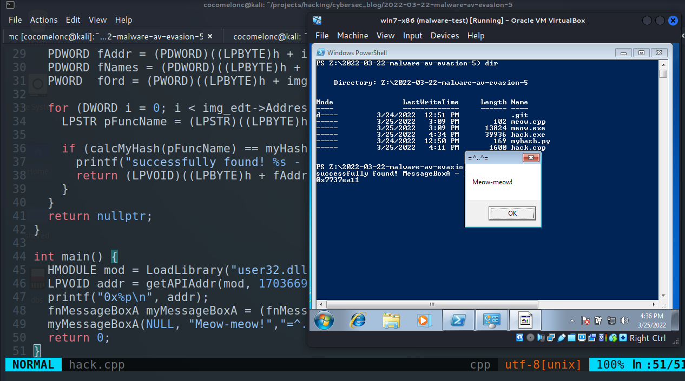{width="80%"}    

Этот раздел является результатом самостоятельного исследования ещё одного трюка обхода антивирусов. Пример обхода антивирусных движков с помощью простого вредоносного ПО на C++.   

### хеширование имён функций

Это простая, но эффективная техника для сокрытия вызовов WinAPI. Она заключается в **вызове функций по их хешу**. Это простой и часто используемый в дикой природе метод.    

Рассмотрим пример, и вы поймёте, что это не так сложно.   

### стандартный вызов

Рассмотрим пример:   

```cpp
#include <windows.h>
#include <stdio.h>

int main() {
  MessageBoxA(NULL, "Meow-meow!","=^..^=", MB_OK);
  return 0;
}
```

Компилируем:    

```bash
i686-w64-mingw32-g++ meow.cpp -o meow.exe -mconsole \
-I/usr/share/mingw-w64/include/ -s -ffunction-sections \
-fdata-sections -Wno-write-strings -Wint-to-pointer-cast \
-fno-exceptions -fmerge-all-constants \
-static-libstdc++ -static-libgcc -fpermissive
```

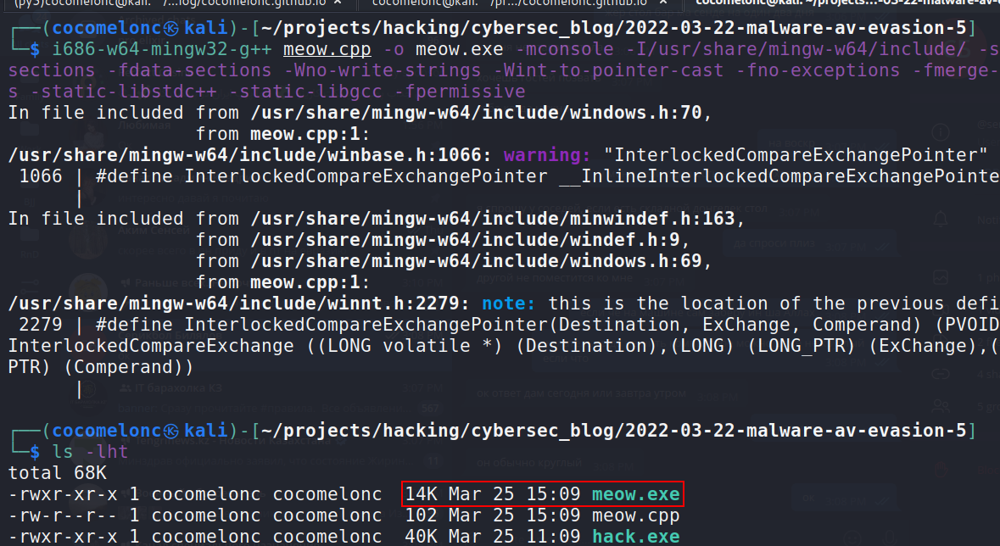{width="80%"}    

И запускаем:    

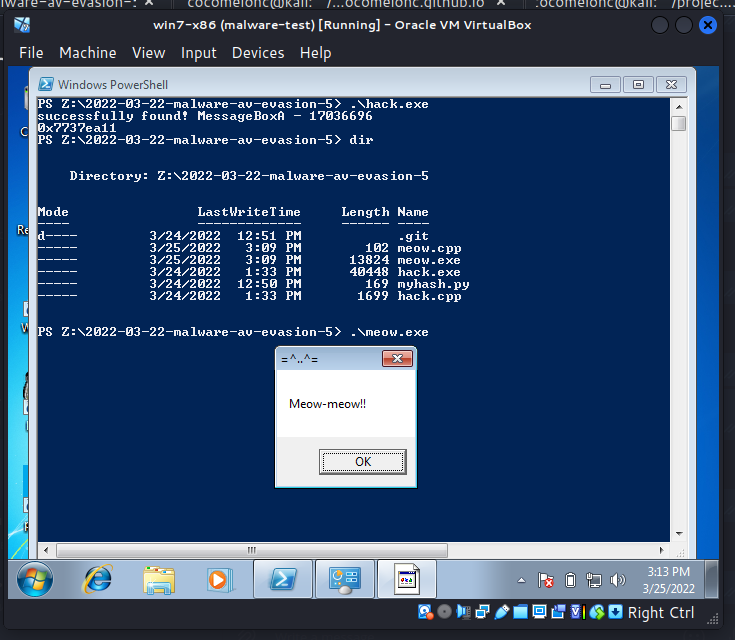{width="80%"}    

Как и ожидалось, появляется всплывающее окно.    

Теперь запустим `strings`:   
```bash
strings -n 8 meow.exe | grep MessageBox
```

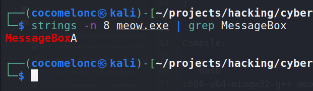{width="80%"}    

Как видите, функция WinAPI явно видна при базовом статическом анализе:    

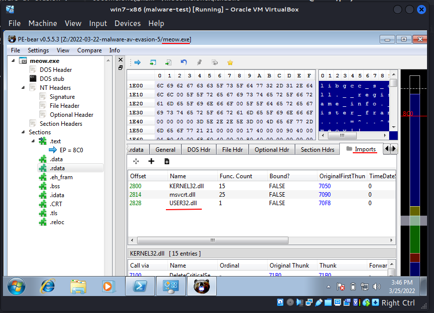{width="80%"}    

а также присутствует в таблице импортов приложения.   

### хеширование    

Теперь давайте скроем WinAPI-функцию `MessageBoxA`, которую мы используем, от аналитиков вредоносного ПО. Давайте её захешируем:    


```python
# simple stupid hashing example
def myHash(data):
    hash = 0x35
    for i in range(0, len(data)):
        hash += ord(data[i]) + (hash << 1)
    print (hash)
    return hash

myHash("MessageBoxA")
```

and run it:    

```bash
python3 myhash.py
```

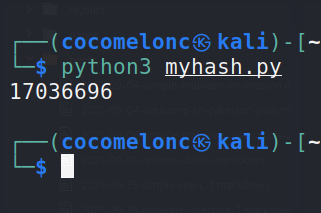{width="80%"}    

### практический пример

В чем основная идея? Основная идея заключается в том, что мы создаем код, в котором находим адрес функции WinAPI по ее имени хэширования с помощью перечисления экспортированных функций WinAPI.

Прежде всего, давайте объявим хэш-функцию, идентичную по логике коду Python:

```cpp
DWORD calcMyHash(char* data) {
  DWORD hash = 0x35;
  for (int i = 0; i < strlen(data); i++) {
    hash += data[i] + (hash << 1);
  }
  return hash;
}
```

Затем я объявил функцию, которая находит адрес функции Windows API, сравнивая ее хэш:

```cpp
static LPVOID getAPIAddr(HMODULE h, DWORD myHash) {
  PIMAGE_DOS_HEADER img_dos_header = (PIMAGE_DOS_HEADER)h;
  PIMAGE_NT_HEADERS img_nt_header = 
  (PIMAGE_NT_HEADERS)((LPBYTE)h + img_dos_header->e_lfanew);
  PIMAGE_EXPORT_DIRECTORY img_edt = (PIMAGE_EXPORT_DIRECTORY)(
    (LPBYTE)h + img_nt_header->
    OptionalHeader.
    DataDirectory[IMAGE_DIRECTORY_ENTRY_EXPORT].
    VirtualAddress);
  PDWORD fAddr = (PDWORD)((LPBYTE)h + 
  img_edt->AddressOfFunctions);
  PDWORD fNames = (PDWORD)((LPBYTE)h + 
  img_edt->AddressOfNames);
  PWORD  fOrd = (PWORD)((LPBYTE)h + 
  img_edt->AddressOfNameOrdinals);

  for (DWORD i = 0; i < img_edt->AddressOfFunctions; i++) {
    LPSTR pFuncName = (LPSTR)((LPBYTE)h + fNames[i]);

    if (calcMyHash(pFuncName) == myHash) {
      printf("successfully found! %s - %d\n", 
      pFuncName, myHash);
      return (LPVOID)((LPBYTE)h + fAddr[fOrd[i]]);
    }
  }
  return nullptr;
}
```

Логика здесь очень проста. Сначала мы пройдемся по заголовкам PE до нужных нам экспортированных функций. В цикле мы посмотрим и сравним хэш, переданный нашей функции, с хэшами функций в таблице экспорта и, как только найдем совпадение, выйдем из цикла:

```cpp
//...
for (DWORD i = 0; i < img_edt->AddressOfFunctions; i++) {
  LPSTR pFuncName = (LPSTR)((LPBYTE)h + fNames[i]);

  if (calcMyHash(pFuncName) == myHash) {
    printf("successfully found! %s - %d\n", 
    pFuncName, myHash);
    return (LPVOID)((LPBYTE)h + fAddr[fOrd[i]]);
  }
}
//...
```

Затем мы объявляем прототип нашей функции:    

```cpp
typedef UINT(CALLBACK* fnMessageBoxA)(
  HWND   hWnd,
  LPCSTR lpText,
  LPCSTR lpCaption,
  UINT   uType
);
```

and `main()`:   

```cpp
int main() {
  HMODULE mod = LoadLibrary("user32.dll");
  LPVOID addr = getAPIAddr(mod, 17036696);
  printf("0x%p\n", addr);
  fnMessageBoxA myMessageBoxA = (fnMessageBoxA)addr;
  myMessageBoxA(NULL, "Meow-meow!","=^..^=", MB_OK);
  return 0;
}
```

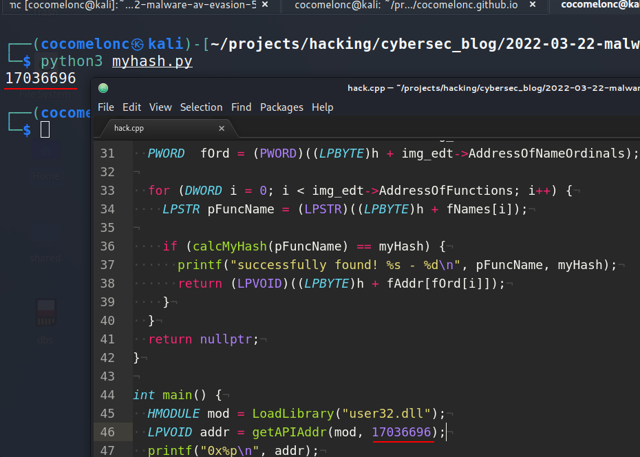{width="80%"}    

Полный исходный код нашей вредоносной программы:    

```cpp
/*
 * hack.cpp - hashing Win32API functions. C++ implementation
 * @cocomelonc
 * https://cocomelonc.github.io/tutorial/
 2022/03/22/simple-malware-av-evasion-5.html
*/
#include <windows.h>
#include <stdio.h>

typedef UINT(CALLBACK* fnMessageBoxA)(
  HWND   hWnd,
  LPCSTR lpText,
  LPCSTR lpCaption,
  UINT   uType
);

DWORD calcMyHash(char* data) {
  DWORD hash = 0x35;
  for (int i = 0; i < strlen(data); i++) {
    hash += data[i] + (hash << 1);
  }
  return hash;
}

static LPVOID getAPIAddr(HMODULE h, DWORD myHash) {
  PIMAGE_DOS_HEADER img_dos_header = (PIMAGE_DOS_HEADER)h;
  PIMAGE_NT_HEADERS img_nt_header = (PIMAGE_NT_HEADERS)(
  (LPBYTE)h + img_dos_header->e_lfanew);
  PIMAGE_EXPORT_DIRECTORY img_edt = (PIMAGE_EXPORT_DIRECTORY)(
    (LPBYTE)h + img_nt_header->
    OptionalHeader.
    DataDirectory[IMAGE_DIRECTORY_ENTRY_EXPORT].
    VirtualAddress);
  PDWORD fAddr = (PDWORD)((LPBYTE)h + 
  img_edt->AddressOfFunctions);
  PDWORD fNames = (PDWORD)((LPBYTE)h + 
  img_edt->AddressOfNames);
  PWORD  fOrd = (PWORD)((LPBYTE)h + 
  img_edt->AddressOfNameOrdinals);

  for (DWORD i = 0; i < img_edt->AddressOfFunctions; i++) {
    LPSTR pFuncName = (LPSTR)((LPBYTE)h + fNames[i]);

    if (calcMyHash(pFuncName) == myHash) {
      printf("successfully found! %s - %d\n", 
      pFuncName, myHash);
      return (LPVOID)((LPBYTE)h + fAddr[fOrd[i]]);
    }
  }
  return nullptr;
}

int main() {
  HMODULE mod = LoadLibrary("user32.dll");
  LPVOID addr = getAPIAddr(mod, 17036696);
  printf("0x%p\n", addr);
  fnMessageBoxA myMessageBoxA = (fnMessageBoxA)addr;
  myMessageBoxA(NULL, "Meow-meow!","=^..^=", MB_OK);
  return 0;
}

```

### демонстрация

Давайте скомпилируем наш вредоносный файл `hack.cpp`:   

```bash
i686-w64-mingw32-g++ hack.cpp -o hack.exe -mconsole \
-I/usr/share/mingw-w64/include/ -s -ffunction-sections \
-fdata-sections -Wno-write-strings -Wint-to-pointer-cast \
-fno-exceptions -fmerge-all-constants -static-libstdc++ \
-static-libgcc -fpermissive
```

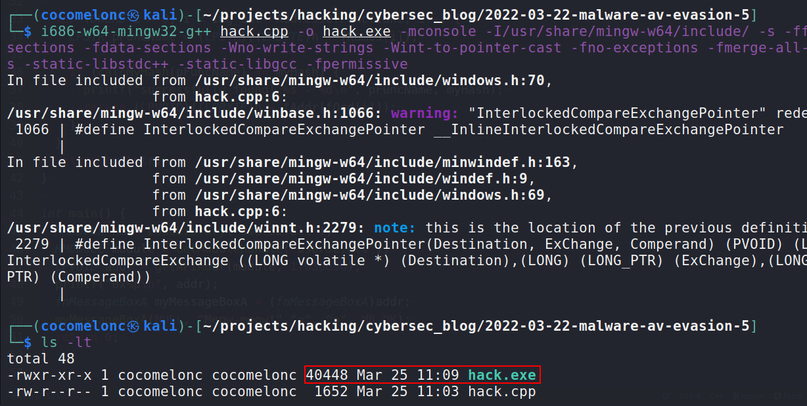{width="80%"}    

И запустим:   

```cmd
.\hack.exe
```

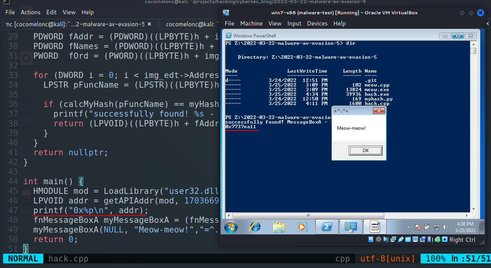{width="80%"}    

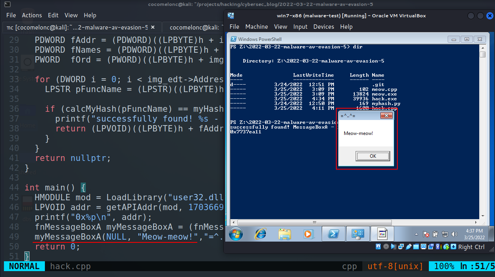{width="80%"}    

Как видите, наша логика сработала!!! Отлично :)

А что насчёт `strings`?    

```bash
strings -n 8 hack.exe | grep MessageBox
```

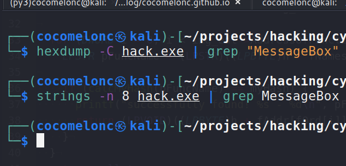{width="80%"}    

Теперь давайте посмотрим таблицу адресов импорта:   

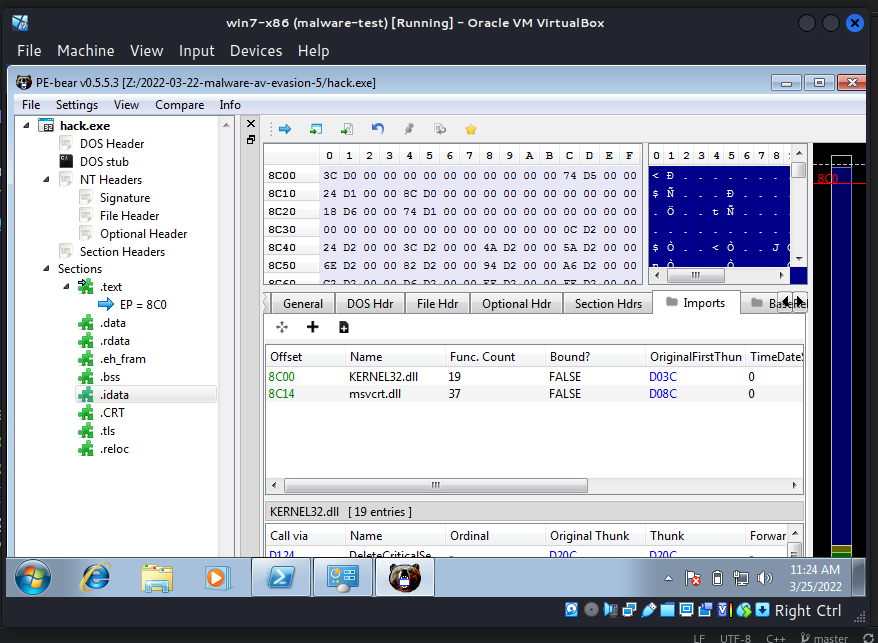{width="80%"}    

Если мы углубимся в анализ вредоносного ПО, то, конечно, найдём наши хеши, строки типа `user32.dll` и так далее. Но это всего лишь пример.    

Давайте загрузим файл на VirusTotal:    

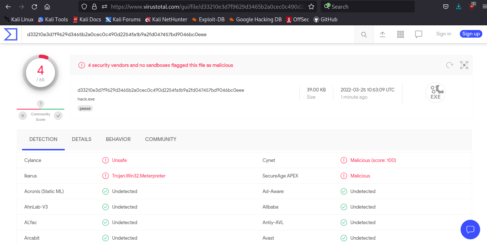{width="80%"}    

[https://www.virustotal.com/gui/file/d33210e3d7f9629d3465b2a0cec0c490d2254fa1b9a2fd047457bd9046bc0eee/detection](https://www.virustotal.com/gui/file/d33210e3d7f9629d3465b2a0cec0c490d2254fa1b9a2fd047457bd9046bc0eee/detection)    

**Итак, 4 из 65 антивирусных движков обнаружили наш файл как вредоносный.**    

Заметьте, что Windows Defender был успешно обойдён! :)

Но что насчёт вызовов WinAPI в классической DLL-инъекции?   

Я продолжу исследования и напишу об этом в следующем посте.    

В реальных вредоносных программах хеши дополнительно защищены математическими функциями и зашифрованы.    

> Например, [Carbanak](https://en.wikipedia.org/wiki/Carbanak) использует несколько техник обхода антивирусов, одна из которых — хеширование вызовов WinAPI.

Надеюсь, этот пост повысит осведомлённость специалистов по защите информации о данной интересной технике и добавит новый инструмент в арсенал пентестеров.    

[pe file format](https://cocomelonc.github.io/tutorial/2021/10/31/windows-shellcoding-3.html)    
[Carbanak](https://en.wikipedia.org/wiki/Carbanak)    
[source code in github](https://github.com/cocomelonc/2022-03-22-malware-av-evasion-5)    
