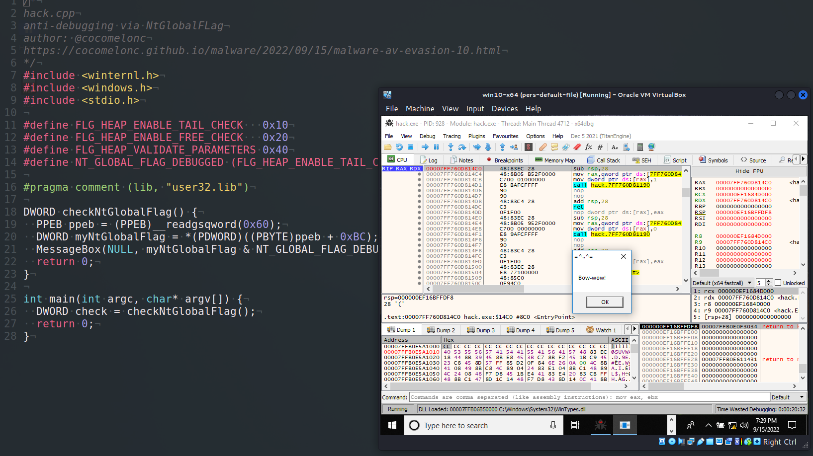
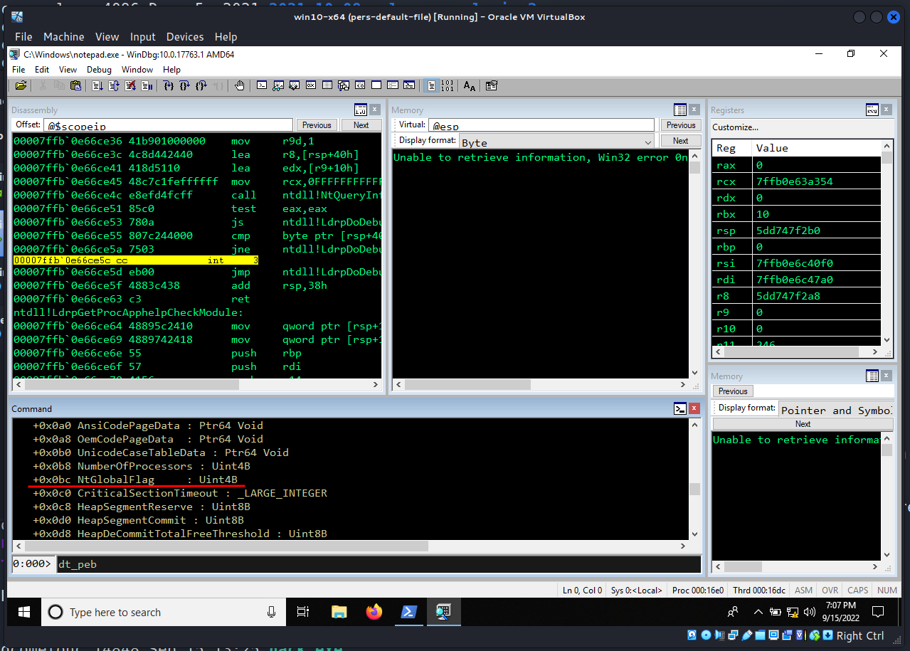
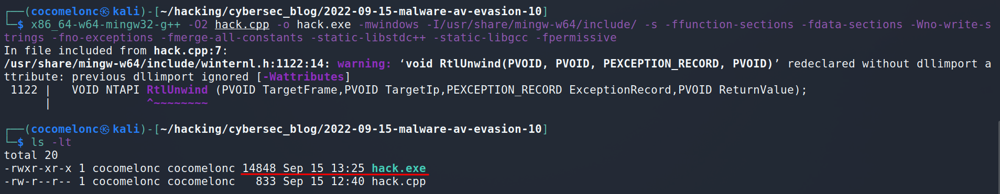
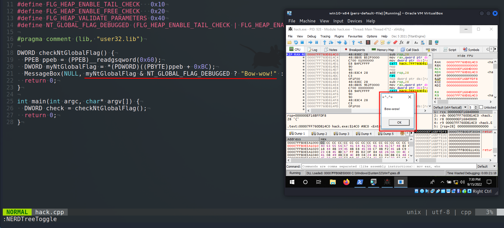
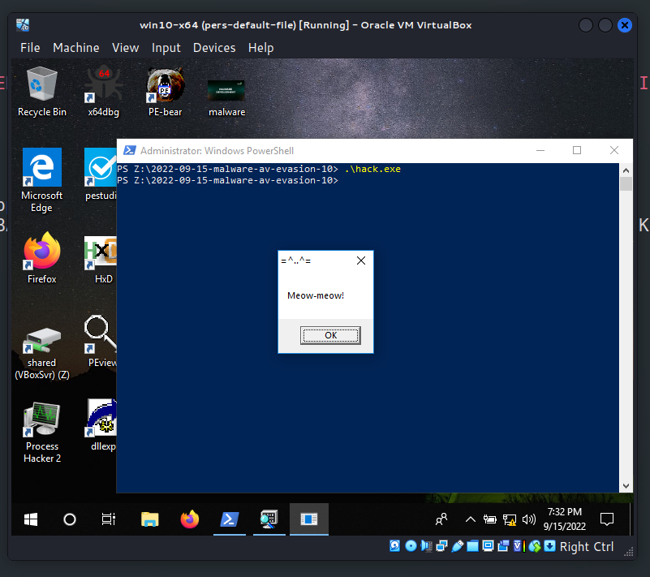
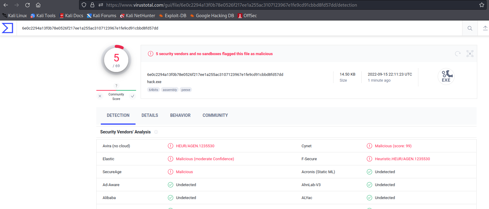

\newpage
\subsection{63. методы обхода AV/VM движков вредоносным ПО - часть 10: антиотладка. NtGlobalFlag. Простой пример на C++.}

الرَّحِيمِ الرَّحْمَٰنِ للَّهِ بِسْمِ 

{width="80%"}

Эта публикация является результатом моего собственного исследования интересного антиотладочного трюка: проверка `NtGlobalFlag`.

Это просто еще один способ, которым вредоносное ПО может обнаружить, что оно работает в отладчике.

### NtGlobalFlag

Во время отладки система устанавливает флаги `FLG_HEAP_ENABLE_TAIL_CHECK` (`0x10`), `FLG_HEAP_ENABLE_FREE_CHECK` (`0x20`) и `FLG_HEAP_VALIDATE_PARAMETERS` (`0x40`) в поле `NtGlobalFlag`, которое находится в структуре `PEB`.

`NtGlobalFlag` имеет смещение значения `0x68` в `32`-битной Windows, значение `0xbc` в `64`-битной Windows, и оба они установлены в `0`:

{width="80%"}

### практический пример

Простой код PoC для антиотладки:

```cpp
/*
hack.cpp
anti-debugging via NtGlobalFLag
author: @cocomelonc
https://cocomelonc.github.io/malware/2022/09/15/malware-av-evasion-10.html
*/
#include <winternl.h>
#include <windows.h>
#include <stdio.h>

#define FLG_HEAP_ENABLE_TAIL_CHECK   0x10
#define FLG_HEAP_ENABLE_FREE_CHECK   0x20
#define FLG_HEAP_VALIDATE_PARAMETERS 0x40
#define NT_GLOBAL_FLAG_DEBUGGED (FLG_HEAP_ENABLE_TAIL_CHECK | 
FLG_HEAP_ENABLE_FREE_CHECK | FLG_HEAP_VALIDATE_PARAMETERS)

#pragma comment (lib, "user32.lib")

DWORD checkNtGlobalFlag() {
  PPEB ppeb = (PPEB)__readgsqword(0x60);
  DWORD myNtGlobalFlag = *(PDWORD)((PBYTE)ppeb + 0xBC);
  MessageBox(NULL, myNtGlobalFlag & NT_GLOBAL_FLAG_DEBUGGED ? "Bow-wow!" : 
  "Meow-meow!", "=^..^=", MB_OK);
  return 0;
}

int main(int argc, char* argv[]) {
  DWORD check = checkNtGlobalFlag();
  return 0;
}
```

Как видите, логика довольно проста, мы просто проверяем комбинацию флагов.

> Для простоты я рассматривал только 64-битную Windows

### демо

Давайте посмотрим на все в действии. Компиляция:

```bash
x86_64-w64-mingw32-g++ -O2 hack.cpp -o hack.exe \
-I/usr/share/mingw-w64/include/ -s \
-ffunction-sections -fdata-sections -Wno-write-strings \
-fno-exceptions -fmerge-all-constants -static-libstdc++ \
-static-libgcc -fpermissive
```

{width="80%"}

Запустим его через отладчик `x64dbg`:

{width="80%"}

и запустим из cmd:

{width="80%"}

Как видите, все работает отлично :)

Загрузим его на VirusTotal:

{width="80%"}

**Как видите, 5 из 69 антивирусных движков определяют наш PoC-файл как вредоносный.**

[https://www.virustotal.com/gui/file/6e0c2294a13f0b78e0526f217ee1a255ac3107123967e1fe9cd91cbbd8fd57dd/detection](https://www.virustotal.com/gui/file/6e0c2294a13f0b78e0526f217ee1a255ac3107123967e1fe9cd91cbbd8fd57dd/detection)

Надеюсь, этот пост повысит осведомленность синих команд об этой интересной технике и добавит оружие в арсенал красных команд.

[MITRE ATT&CK: Debugger evasion](https://attack.mitre.org/techniques/T1622/)       
[MSDN: PEB structure](https://docs.microsoft.com/en-us/windows/win32/api/winternl/ns-winternl-peb)     
[x64dbg](https://github.com/x64dbg/x64dbg)     
[al-khaser](https://github.com/LordNoteworthy/al-khaser)    
[исходный код на github](https://github.com/cocomelonc/meow/tree/master/2022-09-15-malware-av-evasion-10)    
