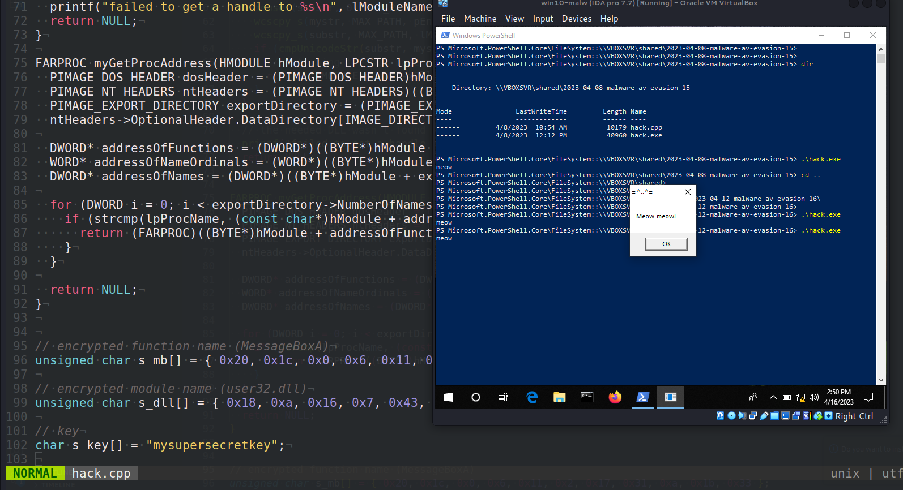
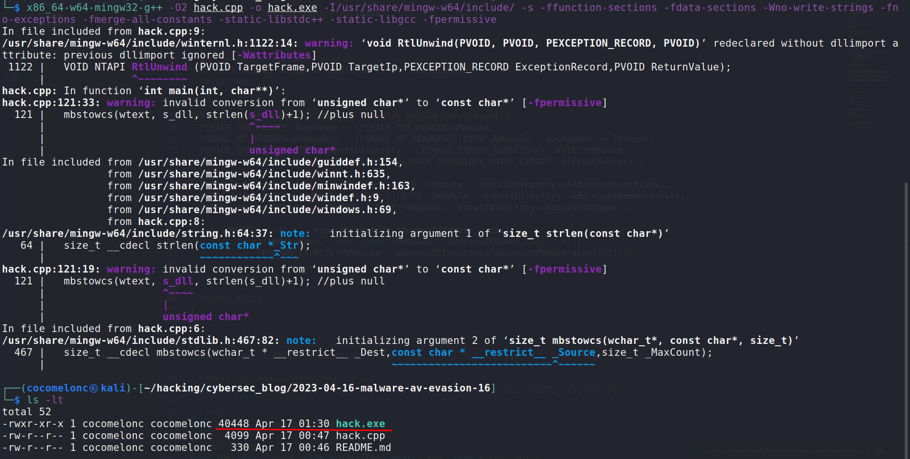
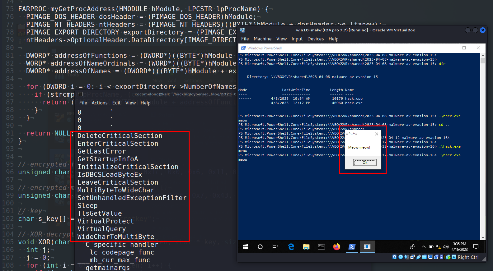

\newpage
\subsection{65. методы обхода AV/VM движков вредоносным ПО - часть 12 (часть 16 в блоге): реализация WinAPI GetProcAddress. Простой пример на C++.}

الرَّحِيمِ الرَّحْمَٰنِ للَّهِ بِسْمِ 

{width="80%"}

Эта публикация является результатом моего собственного исследования попыток обхода антивирусных движков с помощью другого популярного трюка: реализация WinAPI GetProcAddress.

### GetProcAddress

`GetProcAddress` - это функция API Windows, которая извлекает адрес экспортированной функции или переменной из указанной `DLL`. Эта функция полезна, когда вы хотите загрузить функцию из `DLL` во время выполнения, что также известно как динамическое связывание или связывание во время выполнения:

```cpp
FARPROC GetProcAddress(
HMODULE hModule,
LPCSTR lpProcName
);
```

- `hModule` - дескриптор модуля DLL, содержащего функцию или переменную. Функция LoadLibrary или LoadLibraryEx возвращает этот дескриптор.
- `lpProcName` - имя функции или переменной в виде строки с нулевым завершением или порядковое значение функции. Если этот параметр является порядковым значением, он должен находиться в младшем слове, а старшее слово должно быть равно нулю.

Если функция выполнена успешно, возвращаемое значение является адресом экспортированной функции или переменной, если функция не выполнена, возвращаемое значение равно `NULL`.

### практический пример. пользовательская реализация `GetProcAddress`

Как и в [предыдущем посте](https://cocomelonc.github.io/malware/2023/04/08/malware-av-evasion-15.html), создание моей простейшей реализации `GetProcAddress` с использованием Process Environment Block (PEB) также может помочь избежать обнаружения антивирусом (AV) в определенных сценариях.

```cpp
FARPROC myGetProcAddress(HMODULE hModule, LPCSTR lpProcName) {
  PIMAGE_DOS_HEADER dosHeader = (PIMAGE_DOS_HEADER)hModule;
  PIMAGE_NT_HEADERS ntHeaders = 
  (PIMAGE_NT_HEADERS)((BYTE*)hModule + dosHeader->e_lfanew);
  PIMAGE_EXPORT_DIRECTORY exportDirectory = 
  (PIMAGE_EXPORT_DIRECTORY)((BYTE*)hModule + 
  ntHeaders->OptionalHeader.DataDirectory[IMAGE_DIRECTORY_ENTRY_EXPORT].
  VirtualAddress);

  DWORD* addressOfFunctions = (DWORD*)((BYTE*)hModule + 
  exportDirectory->AddressOfFunctions);
  WORD* addressOfNameOrdinals = (WORD*)((BYTE*)hModule + 
  exportDirectory->AddressOfNameOrdinals);
  DWORD* addressOfNames = (DWORD*)((BYTE*)hModule + 
  exportDirectory->AddressOfNames);

  for (DWORD i = 0; i < exportDirectory->NumberOfNames; ++i) {
    if (strcmp(lpProcName, (const char*)hModule + addressOfNames[i]) == 0) {
      return (FARPROC)((BYTE*)hModule + addressOfFunctions[addressOfNameOrdinals[i]]);
    }
  }

  return NULL;
}
```

Вот пошаговое объяснение этого кода:

- получить заголовки `DOS` и `NT`: привести базовый адрес модуля (`hModule`) к указателю `PIMAGE_DOS_HEADER` и использовать его для поиска структуры `PIMAGE_NT_HEADERS`, добавив поле `e_lfanew` к базовому адресу.    

- найти каталог экспорта: использовать поле `OptionalHeader.DataDirectory[IMAGE_DIRECTORY_ENTRY_EXPORT].VirtualAddress` из структуры `PIMAGE_NT_HEADERS`, чтобы найти структуру `PIMAGE_EXPORT_DIRECTORY`.    

- получить указатели на таблицы экспорта: получить указатели на таблицы `AddressOfFunctions`, `AddressOfNameOrdinals` и `AddressOfNames`, используя соответствующие поля структуры `PIMAGE_EXPORT_DIRECTORY` и базовый адрес модуля.    

- выполнить итерацию по именам: выполнить цикл по таблице `AddressOfNames` до `NumberOfNames` раз и сравнить каждое имя функции с именем целевой функции (`lpProcName`) с помощью `strcmp`.   

- найти адрес функции: если имя функции совпадает, [найти порядковый номер функции](https://cocomelonc.github.io/tutorial/2022/03/18/simple-malware-av-evasion-4.html) путем индексации таблицы `AddressOfNameOrdinals` и использовать порядковый номер для индексации таблицы `AddressOfFunctions`. Вычислите абсолютный адрес функции, добавив базовый адрес модуля к относительному виртуальному адресу (`RVA`) функции.   

### обход антивируса "вредоносным ПО"

Хорошо, а что насчет примера "вредоносного ПО"? Для этого я просто обновил код из моего [предыдущего поста](https://cocomelonc.github.io/malware/2023/04/08/malware-av-evasion-15.html). Добавим мою реализацию WinAPI `GetProcAddress`. Полный исходный код:

```cpp
/*
 * hack.cpp - GetProcAddress implementation. C++ implementation
 * @cocomelonc
 * https://cocomelonc.github.io/tutorial/2023/04/16/malware-av-evasion-16.html
*/
#include <stdlib.h>
#include <stdio.h>
#include <windows.h>
#include <winternl.h>
#include <shlwapi.h>
#include <string.h>

#pragma comment(lib, "Shlwapi.lib")

int cmpUnicodeStr(WCHAR substr[], WCHAR mystr[]) {
  _wcslwr_s(substr, MAX_PATH);
  _wcslwr_s(mystr, MAX_PATH);

  int result = 0;
  if (StrStrW(mystr, substr) != NULL) {
    result = 1;
  }

  return result;
}

typedef UINT(CALLBACK* fnMessageBoxA)(
  HWND   hWnd,
  LPCSTR lpText,
  LPCSTR lpCaption,
  UINT   uType
);

// custom implementation
HMODULE myGetModuleHandle(LPCWSTR lModuleName) {

  // obtaining the offset of PPEB from the beginning of TEB
  PEB* pPeb = (PEB*)__readgsqword(0x60);

  // for x86
  // PEB* pPeb = (PEB*)__readgsqword(0x30);

  // obtaining the address of the head node in a linked list 
  // which represents all the models that are loaded into the process.
  PEB_LDR_DATA* Ldr = pPeb->Ldr;
  LIST_ENTRY* ModuleList = &Ldr->InMemoryOrderModuleList; 

  // iterating to the next node. this will be our starting point.
  LIST_ENTRY* pStartListEntry = ModuleList->Flink;

  // iterating through the linked list.
  WCHAR mystr[MAX_PATH] = { 0 };
  WCHAR substr[MAX_PATH] = { 0 };
  for (LIST_ENTRY* pListEntry = pStartListEntry; pListEntry != ModuleList; 
  pListEntry = pListEntry->Flink) {

    // getting the address of current LDR_DATA_TABLE_ENTRY (which represents the DLL).
    LDR_DATA_TABLE_ENTRY* pEntry = 
    (LDR_DATA_TABLE_ENTRY*)((BYTE*)pListEntry - sizeof(LIST_ENTRY));

    // checking if this is the DLL we are looking for
    memset(mystr, 0, MAX_PATH * sizeof(WCHAR));
    memset(substr, 0, MAX_PATH * sizeof(WCHAR));
    wcscpy_s(mystr, MAX_PATH, pEntry->FullDllName.Buffer);
    wcscpy_s(substr, MAX_PATH, lModuleName);
    if (cmpUnicodeStr(substr, mystr)) {
      // returning the DLL base address.
      return (HMODULE)pEntry->DllBase;
    }
  }

  // the needed DLL wasn't found
  printf("failed to get a handle to %s\n", lModuleName);
  return NULL;
}

FARPROC myGetProcAddress(HMODULE hModule, LPCSTR lpProcName) {
  PIMAGE_DOS_HEADER dosHeader = (PIMAGE_DOS_HEADER)hModule;
  PIMAGE_NT_HEADERS ntHeaders = (PIMAGE_NT_HEADERS)((BYTE*)hModule + 
  dosHeader->e_lfanew);
  PIMAGE_EXPORT_DIRECTORY exportDirectory = 
  (PIMAGE_EXPORT_DIRECTORY)((BYTE*)hModule + 
  ntHeaders->OptionalHeader.DataDirectory[IMAGE_DIRECTORY_ENTRY_EXPORT].
  VirtualAddress);

  DWORD* addressOfFunctions = (DWORD*)((BYTE*)hModule + 
  exportDirectory->AddressOfFunctions);
  WORD* addressOfNameOrdinals = (WORD*)((BYTE*)hModule + 
  exportDirectory->AddressOfNameOrdinals);
  DWORD* addressOfNames = (DWORD*)((BYTE*)hModule + 
  exportDirectory->AddressOfNames);

  for (DWORD i = 0; i < exportDirectory->NumberOfNames; ++i) {
    if (strcmp(lpProcName, (const char*)hModule + addressOfNames[i]) == 0) {
      return (FARPROC)((BYTE*)hModule + addressOfFunctions[addressOfNameOrdinals[i]]);
    }
  }

  return NULL;
}


// encrypted function name (MessageBoxA)
unsigned char s_mb[] = { 0x20, 0x1c, 0x0, 0x6, 0x11, 0x2, 0x17, 0x31, 0xa, 
0x1b, 0x33 };

// encrypted module name (user32.dll)
unsigned char s_dll[] = { 0x18, 0xa, 0x16, 0x7, 0x43, 0x57, 0x5c, 0x17, 0x9, 
0xf };

// key
char s_key[] = "mysupersecretkey";

// XOR decrypt
void XOR(char * data, size_t data_len, char * key, size_t key_len) {
  int j;
  j = 0;
  for (int i = 0; i < data_len; i++) {
    if (j == key_len - 1) j = 0;
    data[i] = data[i] ^ key[j];
    j++;
  }
}


int main(int argc, char* argv[]) {
  XOR((char *) s_dll, sizeof(s_dll), s_key, sizeof(s_key));
  XOR((char *) s_mb, sizeof(s_mb), s_key, sizeof(s_key));

  wchar_t wtext[20];
  mbstowcs(wtext, s_dll, strlen(s_dll)+1); //plus null
  LPWSTR user_dll = wtext;

  HMODULE mod = myGetModuleHandle(user_dll);
  if (NULL == mod) {
    return -2;
  } else {
    printf("meow");
  }

  fnMessageBoxA myMessageBoxA = 
  (fnMessageBoxA)myGetProcAddress(mod, (LPCSTR)s_mb);
  myMessageBoxA(NULL, "Meow-meow!","=^..^=", MB_OK);
  return 0;
}
```

Как видите, единственное отличие - это новая функция `myGetProcAddress`.

### демо

Давайте посмотрим все в действии. Сначала скомпилируем нашу «вредоносную программу»:

```bash
x86_64-w64-mingw32-g++ -O2 hack.cpp -o hack.exe \
-I/usr/share/mingw-w64/include/ -s -ffunction-sections \
-fdata-sections -Wno-write-strings -fno-exceptions \
-fmerge-all-constants -static-libstdc++ \
-static-libgcc -fpermissive
```

{width="80%"}

И запустим на машине жертвы (`Windows 10 x64`):

```powershell
.\hack.exe
```

{width="80%"}

Как вы можете видеть, в результате `GetProcAddress` WinAPI скрыт: обходит антивирусные модули в определенных сценариях.

Обратите внимание, что ручная реализация `GetProcAddress` с помощью `PEB` является сложной и потенциально подверженной ошибкам задачей, но обработка внутренней работы механизма загрузки модулей Windows может быть полезна для сложных задач, таких как обратная разработка (reverse engineering) и анализ вредоносного ПО (malware analysis).

Надеюсь, этот пост повысит осведомленность blue team специалистов об этой интересной технике уклонения и добавит оружие в арсенал red team специалистов.

[MITRE ATT&CK: T1027](https://attack.mitre.org/techniques/T1027/)       
[AV evasion: part 1](https://cocomelonc.github.io/tutorial/2021/09/04/simple-malware-av-evasion.html)     
[AV evasion: part 2](https://cocomelonc.github.io/tutorial/2021/09/06/simple-malware-av-evasion-2.html)      
[AV evasion: part 4](https://cocomelonc.github.io/tutorial/2022/03/18/simple-malware-av-evasion-4.html)               
[GetModuleHandle](https://learn.microsoft.com/en-us/windows/win32/api/libloaderapi/nf-libloaderapi-getmodulehandlea)         
[GetProcAddress](https://learn.microsoft.com/en-us/windows/win32/api/libloaderapi/nf-libloaderapi-getprocaddress)      
[исходный код github](https://github.com/cocomelonc/meow/tree/master/2023-04-16-malware-av-evasion-16)    
