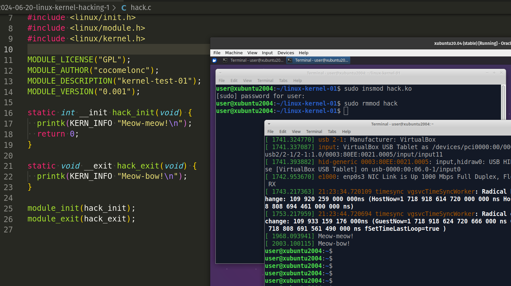
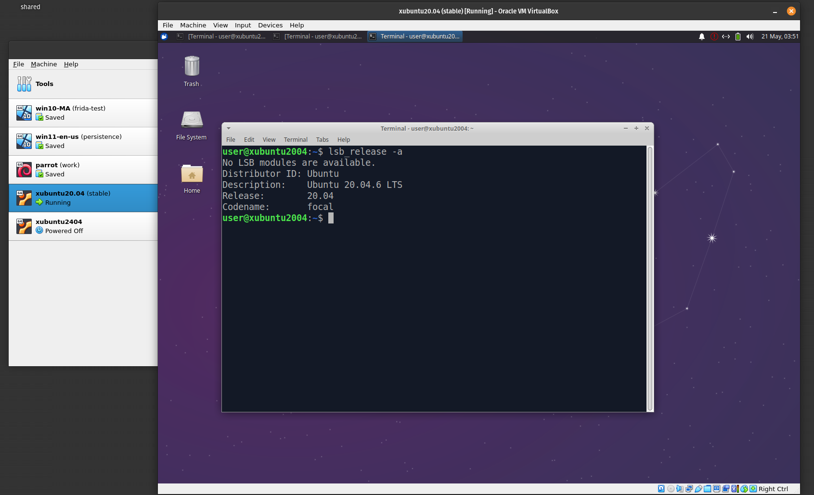
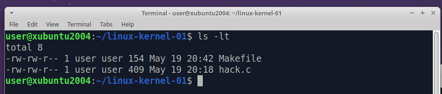
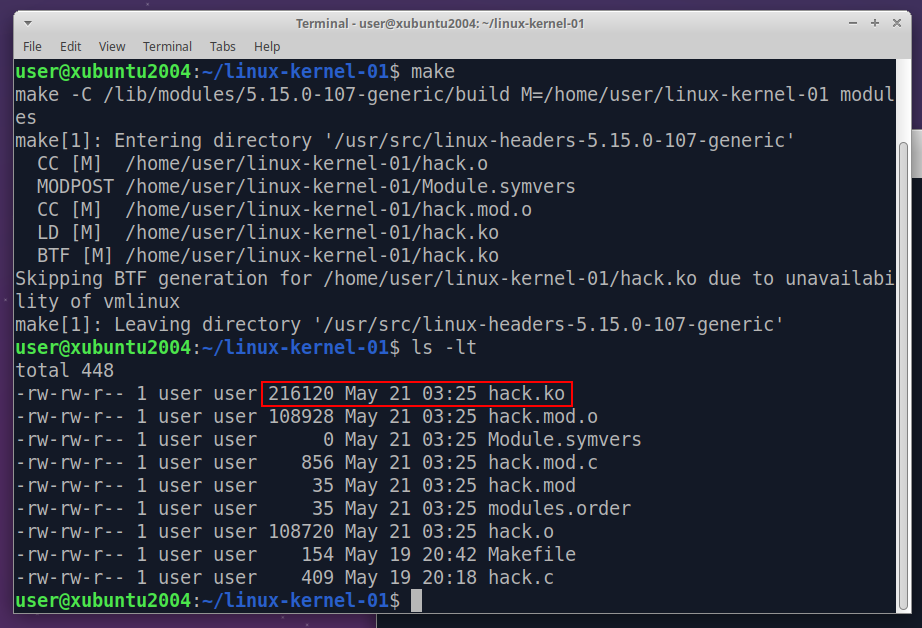
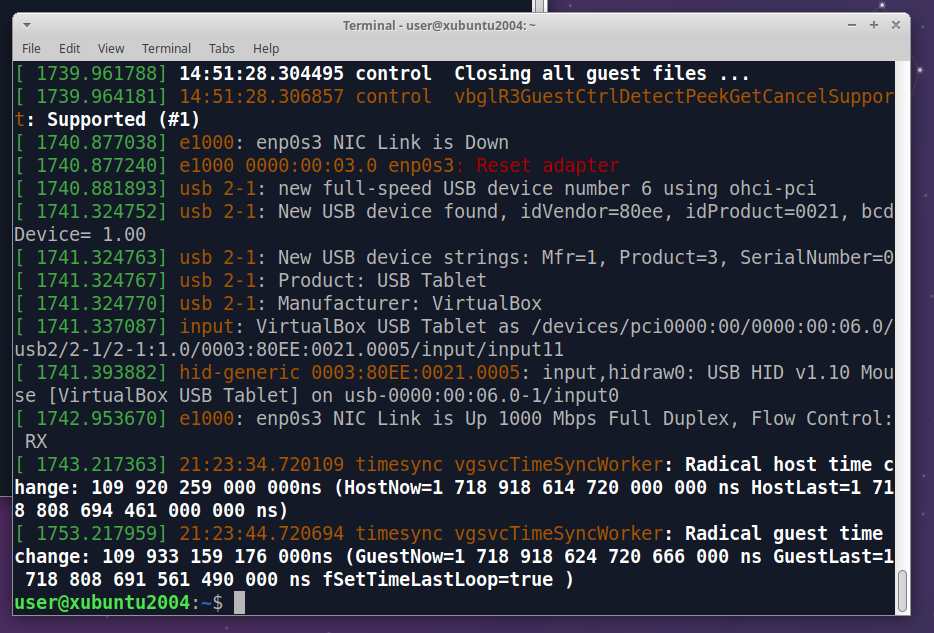
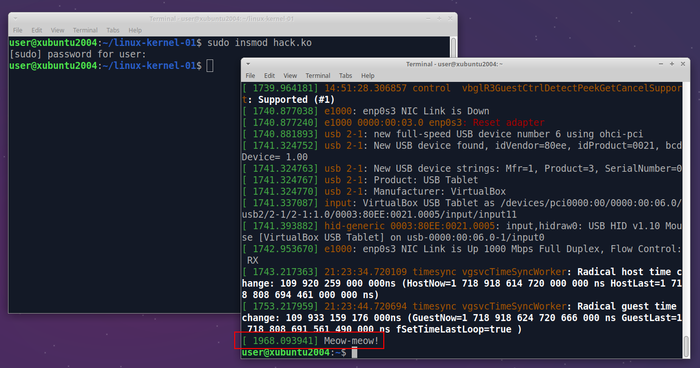
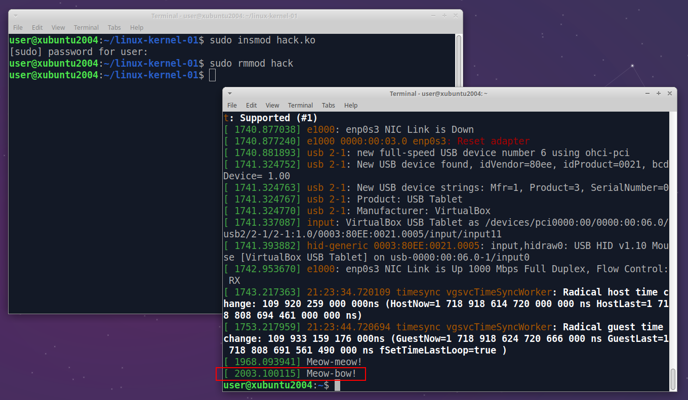
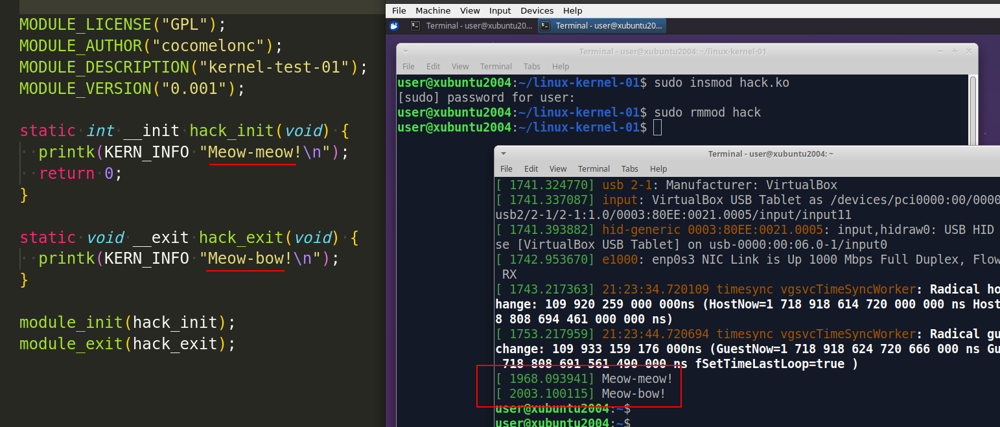

\newpage
\subsection{98. разработка вредоносного ПО для Linux 1: введение в взлом ядра. простой пример на C.}

الرَّحِيمِ الرَّحْمَٰنِ للَّهِ بِسْمِ 

{width="80%"}      

Фактически, этот пост мог бы называться как-то иначе, например, *"Трюки разработки вредоносного ПО - часть 41"*, но здесь я снова отвечаю на множество вопросов, которые мне задают мои читатели. *Как разработать вредоносное ПО для Linux?*     

Возможно, этот пост станет началом, а также отправной точкой для серии публикаций (те, кто давно меня читает, наверное, заметили, что у меня есть много разных серий постов, которые я начал, но еще не довел до логического завершения).      

Честно говоря, мой последний опыт программирования для ядра Linux был в университете более 10 лет назад, с тех пор многое изменилось, поэтому я решил попробовать написать что-то интересное, например, вредоносное ПО: руткит для Linux, стилер и т. д.    

Прежде всего, я установил виртуальную машину с Linux - [xubuntu 20.04](https://xubuntu.org/), чтобы ничего не сломать в своей системе. Думаю, можно установить более свежую версию `Ubuntu (Xubuntu, Lubuntu)`, но версия `20.04` вполне подходит для экспериментов:          

{width="80%"}      

### практический пример

Например, если нам нужно создать вредоносное ПО, такое как руткит ядра, разрабатываемый нами код будет иметь возможность выполняться с привилегиями уровня ядра (`ring 0`), используя создаваемые нами модули ядра. Работа в этой роли может быть сложной. С одной стороны, наша работа остается незаметной для пользователя и инструментов пользовательского пространства. Однако, если мы допустим ошибку, это может привести к серьезным последствиям. Ядро не способно защитить нас от собственных ошибок, что означает риск полного краха системы. Использование виртуальной машины поможет уменьшить сложность разработки в нашей среде Xubuntu, сделав ее более управляемой.    

Начнем с импорта модулей:    

```cpp
#include <linux/init.h>
#include <linux/module.h>
#include <linux/kernel.h>
```

Эти директивы `#include` подключают необходимые заголовочные файлы для программирования модулей ядра:
- `linux/init.h` - содержит макросы и функции для инициализации и очистки модуля.    
- `linux/module.h` - содержит макросы и функции для программирования модулей.     
- `linux/kernel.h` - предоставляет различные функции и макросы для разработки ядра.     

```cpp
MODULE_LICENSE("GPL");
MODULE_AUTHOR("cocomelonc");
MODULE_DESCRIPTION("kernel-test-01");
MODULE_VERSION("0.001");
```

Эти макросы определяют метаданные о модуле:    

- `MODULE_LICENSE("GPL")` - указывает лицензию, под которой выпущен модуль. Здесь это GNU General Public License.    
- `MODULE_AUTHOR("cocomelonc")` - указывает автора модуля.     
- `MODULE_DESCRIPTION("kernel-test-01")` - предоставляет описание модуля.     
- `MODULE_VERSION("0.001")` - определяет версию модуля.      

Следующие строки кода определяют функцию инициализации:     

```cpp
static int __init hack_init(void) {
  printk(KERN_INFO "Meow-meow!\n");
  return 0;
}
```

Эта функция является функцией инициализации модуля:    
- `static int __init hack_init(void)` - объявляет функцию как статическую (локальную для этого файла) и помечает ее как функцию инициализации, используя макрос `__init`.      
- `printk(KERN_INFO "Meow-meow!\n")` - выводит сообщение `"Meow-meow!"` в журнал ядра с информационным уровнем логирования.
- `return 0` - возвращает `0`, что указывает на успешную инициализацию.    

Следующая функция - `hack_exit`:    

```cpp
static void __exit hack_exit(void) {
  printk(KERN_INFO "Meow-bow!\n");
}
```

Эта функция выполняет очистку модуля:

- `static void __exit hack_exit(void)` - объявляет функцию как статическую и помечает ее как функцию завершения (очистки) с использованием макроса `__exit`.
- `printk(KERN_INFO "Meow-bow!\n")` - выводит сообщение `"Meow-bow!"` в журнал ядра с информационным уровнем логирования.    

Затем регистрируем функции инициализации и очистки:    

```cpp
module_init(hack_init);
module_exit(hack_exit);
```

Итак, полный исходный код `hack.c` выглядит следующим образом:    


```cpp
/*
 * hack.c
 * introduction to linux kernel hacking
 * author @cocomelonc
 * https://cocomelonc.github.io/linux/2024/06/20/kernel-hacking-1.html
*/
#include <linux/init.h>
#include <linux/module.h>
#include <linux/kernel.h>

MODULE_LICENSE("GPL");
MODULE_AUTHOR("cocomelonc");
MODULE_DESCRIPTION("kernel-test-01");
MODULE_VERSION("0.001");

static int __init hack_init(void) {
  printk(KERN_INFO "Meow-meow!\n");
  return 0;
}

static void __exit hack_exit(void) {
  printk(KERN_INFO "Meow-bow!\n");
}

module_init(hack_init);
module_exit(hack_exit);
```

Этот код демонстрирует базовую структуру модуля ядра Linux, включая определение функций инициализации и очистки, а также предоставление метаданных о модуле.     

### демонстрация

Давайте посмотрим, как этот модуль работает на практике. Перед компиляцией необходимо установить:    

```bash
$ apt update
$ apt install build-essential linux-headers-$(uname -r)
```

Для компиляции создайте файл `Makefile` со следующим содержимым:     

```makefile
obj-m += hack.o

all:
	make -C /lib/modules/$(shell uname -r)/build M=$(PWD) modules

clean:
	make -C /lib/modules/$(shell uname -r)/build M=$(PWD) clean
```

Предоставленный `Makefile` используется для компиляции и очистки модуля ядра Linux.     
Переменная `obj-m` используется для списка объектных файлов, которые будут собираться в качестве модулей ядра. `hack.o` - это объектный файл, который будет собран из исходного файла `hack.c`. Оператор `+=` добавляет `hack.o` в список объектных файлов, компилируемых как модули.     

```makefile
make -C /lib/modules/$(shell uname -r)/build M=$(PWD) modules
```

Эта команда вызывает `make` для компиляции модуля. `-C /lib/modules/$(shell uname -r)/build` изменяет каталог на каталог сборки текущего запущенного ядра. `$(shell uname -r)` получает версию запущенного ядра, а `/lib/modules/$(shell uname -r)/build` указывает расположение каталога сборки ядра.     

`M=$(PWD)` устанавливает переменную `M` в текущий рабочий каталог `$(PWD)`, где находится исходный код модуля. Это сообщает системе сборки ядра, что следует искать исходные файлы модуля в текущем каталоге.     

А `modules` - это цель в системе сборки ядра, которая компилирует модули, указанные в `obj-m`.

`make -C /lib/modules/$(shell uname -r)/build M=$(PWD) clean` - эта команда очищает файлы сборки модуля.     

Откройте терминал, перейдите в каталог, содержащий `hack.c` и `Makefile`:    

{width="80%"}      

и выполните следующую команду для компиляции модуля:    

```bash
make
```

{width="80%"}      

В результате после выполнения команды `make` появится несколько новых промежуточных бинарных файлов. Однако самым важным дополнением будет появление нового файла `hack.ko`.      

Что дальше? Запустите команду `dmesg` в новом терминале:    

```bash
dmesg
```

{width="80%"}      

Затем выполните следующую команду из каталога с `hack.ko`, чтобы загрузить этот модуль в запущенное ядро:     

```bash
sudo insmod hack.ko
```

Теперь, если вы снова проверите `dmesg` в новом терминале, вы должны увидеть строку `Meow-meow!`:     

{width="80%"}      

Для удаления нашего модуля из запущенного ядра выполните команду:      

```bash
sudo rmmod hack
```

{width="80%"}      

{width="80%"}      

Как видите, сообщение `Meow-bow!` появилось в буфере ядра, значит, всё сработало идеально, как и ожидалось! =^..^=     

Есть, конечно, еще один нюанс. При сборке модуля ядра Linux важно помнить, что он относится к конкретной версии ядра, на которой был собран. Если вы попытаетесь загрузить модуль в систему с другим ядром, скорее всего, он не загрузится.        

Думаю, на этом мы сделаем паузу. В следующих постах мы рассмотрим руткиты и стилеры.      

Надеюсь, этот пост с практическим примером будет полезен исследователям вредоносного ПО, программистам Linux и всем, кто интересуется методами программирования ядра Linux.    

[исходный код на github](https://github.com/cocomelonc/meow/tree/master/2024-06-20-linux-kernel-hacking-1)    
