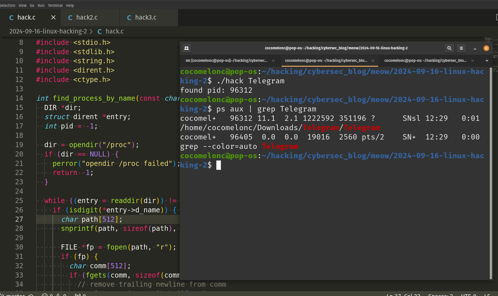
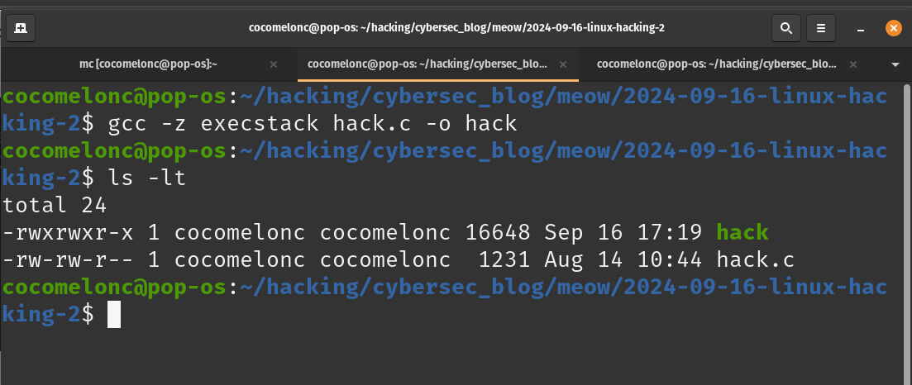
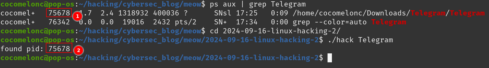
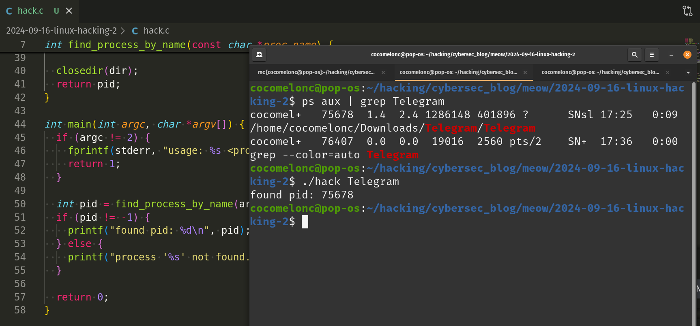
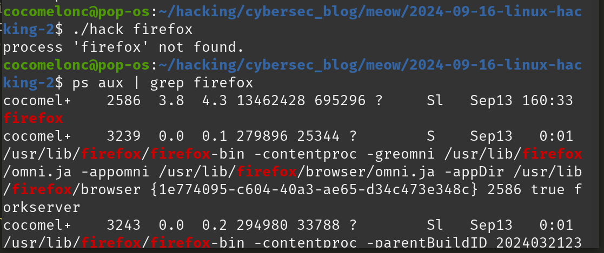
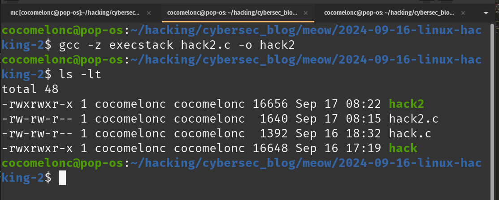
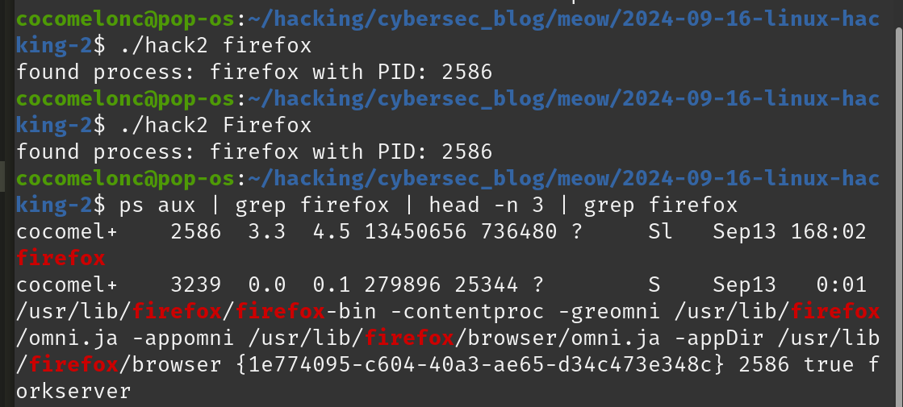

\newpage
\subsection{99. разработка вредоносного ПО для Linux 2: поиск идентификатора процесса по имени. простой пример на C.}

﷽

{width="80%"}     

Я обещал пролить свет на программирование руткитов и других интересных и вредоносных вещей при разработке вредоносного ПО для Linux, но перед тем как мы начнем, давайте попробуем сделать что-то простое. Некоторые из моих читателей не имеют представления о том, как, например, делать внедрение кода в процессы Linux.    

Те, кто читают меня очень давно, помнят такой интересный и простой [пример поиска](https://cocomelonc.github.io/pentest/2021/09/29/findmyprocess.html) идентификатора процесса в Windows для целей инъекции.     

### практический пример

Реализуем аналогичную логику для Linux. Все очень просто:    

```cpp
/*
 * hack.c
 * linux hacking part 2: 
 * find process ID by name
 * author @cocomelonc
 * https://cocomelonc.github.io/linux/2024/09/16/linux-hacking-2.html
*/
#include <stdio.h>
#include <stdlib.h>
#include <string.h>
#include <dirent.h>
#include <ctype.h>

int find_process_by_name(const char *proc_name) {
  DIR *dir;
  struct dirent *entry;
  int pid = -1; 

  dir = opendir("/proc");
  if (dir == NULL) {
    perror("opendir /proc failed"); 
    return -1;
  }

  while ((entry = readdir(dir)) != NULL) {
    if (isdigit(*entry->d_name)) { 
      char path[512];
      snprintf(path, sizeof(path), "/proc/%s/comm", entry->d_name); 

      FILE *fp = fopen(path, "r");
      if (fp) {
        char comm[512];
        if (fgets(comm, sizeof(comm), fp) != NULL) {
          // remove trailing newline from comm
          comm[strcspn(comm, "\r\n")] = 0; 
          if (strcmp(comm, proc_name) == 0) {
            pid = atoi(entry->d_name); 
            fclose(fp);
            break;
          }
        }
        fclose(fp);
      }
    }
  }

  closedir(dir);
  return pid;
}

int main(int argc, char *argv[]) {
  if (argc != 2) {
    fprintf(stderr, "usage: %s <process_name>\n", argv[0]);
    return 1;
  }

  int pid = find_process_by_name(argv[1]);
  if (pid != -1) {
    printf("found pid: %d\n", pid);
  } else {
    printf("process '%s' not found.\n", argv[1]);
  }

  return 0;
}
```

Мой код демонстрирует, как найти запущенный процесс по его имени в Linux, сканируя каталог `/proc`. Он читает имена процессов, хранящиеся в `/proc/[pid]/comm`, и если находит совпадение, получает идентификатор процесса (`PID`) целевого процесса.      

Как видите, здесь всего две функции. В первую очередь мы реализовали функцию `find_process_by_name`. Эта функция отвечает за поиск процесса по имени в каталоге `/proc`.     

Она принимает имя процесса (`proc_name`) в качестве входного параметра и возвращает `PID` найденного процесса или `-1`, если процесс не найден.    

Функция использует `opendir()`, чтобы открыть каталог `/proc`. Этот каталог содержит информацию о запущенных процессах, а каждый его подкаталог назван в соответствии с идентификатором процесса (`PID`).    

Затем выполняется итерация по записям в `/proc`:    

```cpp
while ((entry = readdir(dir)) != NULL) {
```

Функция `readdir()` используется для перебора всех записей в каталоге `/proc`, каждая запись представляет собой либо запущенный процесс (если имя записи — это число), либо другие системные файлы.    

Затем проверяется, представляет ли имя записи число (то есть идентификатор процесса). Только каталоги, названные цифрами, являются допустимыми каталогами процессов в `/proc`:    

```cpp
if (isdigit(*entry->d_name)) {
```

Стоит отметить, что файл `comm` внутри каждого каталога `/proc/[pid]` содержит имя исполняемого файла, связанного с этим процессом:    

```cpp
snprintf(path, sizeof(path), "/proc/%s/comm", entry->d_name);
```

Это означает, что мы строим полный путь к файлу `comm`, объединяя `/proc/`, идентификатор процесса (`d_name`) и `/comm`.    

Наконец, мы открываем файл `comm`, читаем имя процесса и сравниваем его:        

```cpp
FILE *fp = fopen(path, "r");
  if (fp) {
    char comm[512];
    if (fgets(comm, sizeof(comm), fp) != NULL) {
      // remove trailing newline from comm
      comm[strcspn(comm, "\r\n")] = 0; 
      if (strcmp(comm, proc_name) == 0) {
        pid = atoi(entry->d_name); 
        fclose(fp);
        break;
      }

    }
```

Затем, конечно, закрываем каталог и возвращаем результат.    

Вторая функция - это функция `main`:          

```cpp
int main(int argc, char *argv[]) {
  if (argc != 2) {
    fprintf(stderr, "usage: %s <process_name>\n", argv[0]);
    return 1;
  }

  int pid = find_process_by_name(argv[1]);
  if (pid != -1) {
    printf("found pid: %d\n", pid);
  } else {
    printf("process '%s' not found.\n", argv[1]);
  }

  return 0;
}
```

Просто проверяем аргументы командной строки и запускаем логику поиска процесса.     

### демонстрация

Давайте проверим всё в действии. Скомпилируем код:     

```bash
gcc -z execstack hack.c -o hack
```

{width="80%"}     

Затем запустите его на машине с Linux:     

```bash
./hack [process_name]
```

{width="80%"}     

{width="80%"}     

Как видите, всё работает идеально. Мы нашли идентификатор Telegram (`75678`) в моем случае! =^..^=    

Всё кажется очень простым, не так ли?     

Но есть нюанс. Если мы попробуем запустить его для процессов, таких как `firefox` в моем примере:     

```bash
./hack firefox
```

мы получим:    

{width="80%"}     

Проблема, с которой мы сталкиваемся, может быть связана с тем, что некоторые процессы, такие как `firefox`, могут порождать дочерние процессы или несколько потоков, которые могут не использовать файл `comm` для хранения имени процесса.      

Файл `/proc/[pid]/comm` хранит имя исполняемого файла без полного пути и может не отображать все экземпляры процесса, особенно если они содержат несколько потоков или подпроцессов.     

Возможные проблемы, на мой взгляд:    
- разные имена процессов в `/proc/[pid]/comm`: дочерние процессы или потоки могут использовать разные соглашения об именах или могут не отображаться в `/proc/[pid]/comm` как `firefox`.       
- зомби или осиротевшие процессы: некоторые процессы могут отображаться некорректно, если они находятся в состоянии зомби или сиротского процесса.     

### практический пример 2

Вместо чтения файла `comm` можно проверить файл `/proc/[pid]/cmdline`, который содержит полную команду, использованную для запуска процесса (включая имя процесса, полный путь и аргументы). Этот файл более надежен для процессов, которые порождают несколько экземпляров, как `firefox`.     

По этой причине я создал другую версию (`hack2.c`):    

```cpp
/*
 * hack2.c
 * linux hacking part 2: 
 * find processes ID by name
 * author @cocomelonc
 * https://cocomelonc.github.io/linux/2024/09/16/linux-hacking-2.html
*/
#include <stdio.h>
#include <stdlib.h>
#include <string.h>
#include <dirent.h>
#include <ctype.h>

void find_processes_by_name(const char *proc_name) {
  DIR *dir;
  struct dirent *entry;
  int found = 0;

  dir = opendir("/proc");
  if (dir == NULL) {
    perror("opendir /proc failed");
    return;
  }

  while ((entry = readdir(dir)) != NULL) {
    if (isdigit(*entry->d_name)) {
      char path[512];
      snprintf(path, sizeof(path), "/proc/%s/cmdline", entry->d_name);

      FILE *fp = fopen(path, "r");
      if (fp) {
        char cmdline[512];
        if (fgets(cmdline, sizeof(cmdline), fp) != NULL) {
          // command line arguments are separated by '\0', 
          // we only need the first argument (the program name)
          cmdline[strcspn(cmdline, "\0")] = 0;

          // perform case-insensitive comparison 
          // of the base process name
          const char *base_name = strrchr(cmdline, '/');
          base_name = base_name ? base_name + 1 : cmdline;

          if (strcasecmp(base_name, proc_name) == 0) {
            printf("found process: %s with PID: %s\n", base_name, 
            entry->d_name);
            found = 1;
          }
        }
        fclose(fp);
      }
    }
  }

  if (!found) {
    printf("no processes found with the name '%s'.\n", proc_name);
  }

  closedir(dir);
}

int main(int argc, char *argv[]) {
  if (argc != 2) {
    fprintf(stderr, "usage: %s <process_name>\n", argv[0]);
    return 1;
  }

  find_processes_by_name(argv[1]);

  return 0;
}
```

Как видите, это обновленная версия кода, которая вместо этого читает данные из `/proc/[pid]/cmdline`.     

Однако файлы `/proc/[pid]/cmdline` или `/proc/[pid]/status` могут не всегда корректно отображать все подпроцессы или потоки.     

### демонстрация 2

Давайте проверим второй пример в действии. Скомпилируем его:     

```bash
gcc -z execstack hack2.c -o hack2
```

{width="80%"}     

Затем запустите его на машине с Linux:     

```bash
./hack [process_name]
```

{width="80%"}     

Как видите, результат верный.     

Надеюсь, этот пост с практическим примером будет полезен исследователям вредоносного ПО, программистам Linux и всем, кто интересуется программированием ядра Linux и техниками внедрения кода.    

[Find process ID by name. Windows version](https://cocomelonc.github.io/pentest/2021/09/29/findmyprocess.html)      
[исходный код на github](https://github.com/cocomelonc/meow/tree/master/2024-09-16-linux-hacking-2)    
